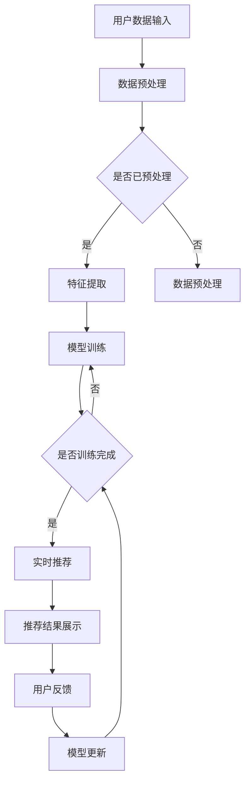

                 

关键词：AI大模型、电商搜索、推荐系统、实时性优化、算法原理、数学模型、项目实践、应用场景、未来展望

> 摘要：本文深入探讨了AI大模型在电商搜索推荐系统中的应用，特别是在实时性优化方面的策略。文章首先介绍了AI大模型的基本概念和架构，随后详细分析了其赋能电商搜索推荐的原理，并提出了优化实时性的关键算法。通过数学模型的构建和公式推导，进一步解释了算法的内部工作机制。文章随后通过项目实践展示了代码实例，分析了实际应用中的效果。最后，文章讨论了AI大模型在电商搜索推荐领域的实际应用场景，并对未来发展趋势和挑战进行了展望。

## 1. 背景介绍

随着互联网的迅猛发展和电子商务的崛起，电商搜索推荐系统已经成为电商平台的核心竞争力。推荐系统能够通过分析用户行为数据，精准地推送用户可能感兴趣的商品，从而提升用户体验和销售额。传统的推荐系统主要依赖于基于内容、协同过滤等算法，虽然在一定程度上能够满足用户需求，但在实时性、个性化等方面仍存在较大局限。

近年来，AI大模型的快速发展为电商搜索推荐系统带来了新的机遇。AI大模型，如深度神经网络（DNN）、生成对抗网络（GAN）、图神经网络（GNN）等，具有强大的特征提取和建模能力，能够在海量数据中挖掘出用户和商品之间的复杂关系。同时，AI大模型能够通过实时训练和更新，实现对用户行为的快速响应，提高推荐系统的实时性和个性化水平。

本文旨在探讨AI大模型在电商搜索推荐中的实时性优化策略，通过理论分析和实践验证，提出一种适用于电商搜索推荐系统的实时性优化方法。文章结构如下：

- **第1章**：背景介绍，阐述本文的研究背景和意义。
- **第2章**：核心概念与联系，介绍AI大模型的基本概念和架构。
- **第3章**：核心算法原理 & 具体操作步骤，详细解析实时性优化的关键算法。
- **第4章**：数学模型和公式 & 详细讲解 & 举例说明，构建数学模型并推导相关公式。
- **第5章**：项目实践：代码实例和详细解释说明，通过实际项目展示算法应用。
- **第6章**：实际应用场景，讨论AI大模型在电商搜索推荐中的具体应用。
- **第7章**：工具和资源推荐，推荐相关学习和开发资源。
- **第8章**：总结：未来发展趋势与挑战，总结研究成果并对未来进行展望。
- **第9章**：附录：常见问题与解答，解答读者可能遇到的问题。

通过本文的研究，期望为AI大模型在电商搜索推荐系统中的应用提供理论支持和实践指导，推动电商搜索推荐系统的实时性优化，提升用户体验和商业价值。

## 2. 核心概念与联系

### AI大模型的基本概念

AI大模型，指的是基于深度学习技术构建的具有大规模参数和复杂结构的神经网络模型。这类模型通过在大量数据上进行训练，能够自动提取数据中的特征，并在不同任务中表现出强大的泛化能力。AI大模型通常包括以下几种类型：

1. **深度神经网络（DNN）**：由多层神经元组成的神经网络，能够处理高维数据，并在图像识别、语音识别等领域取得了显著成果。
2. **生成对抗网络（GAN）**：由生成器和判别器组成的对抗性模型，能够生成高质量的数据，广泛应用于图像生成、数据增强等领域。
3. **图神经网络（GNN）**：基于图结构的数据模型，能够处理具有复杂关系的图数据，广泛应用于社交网络分析、推荐系统等领域。

### 电商搜索推荐系统的架构

电商搜索推荐系统通常由数据层、算法层和业务层三部分组成：

1. **数据层**：包括用户数据、商品数据和交易数据等，是推荐系统的基础。
2. **算法层**：包括传统的推荐算法和基于AI大模型的推荐算法，负责处理和生成推荐结果。
3. **业务层**：包括用户界面、推荐策略配置、推荐结果展示等，是推荐系统的应用层。

### AI大模型与电商搜索推荐系统的联系

AI大模型能够为电商搜索推荐系统提供以下几方面的优势：

1. **特征提取能力**：AI大模型能够自动从海量数据中提取出高维特征，为推荐算法提供丰富的输入。
2. **实时性**：AI大模型通过在线学习和实时更新，能够快速响应用户行为的变化，提高推荐系统的实时性。
3. **个性化**：AI大模型能够根据用户的个性化特征和偏好，提供更加精准的推荐结果，提升用户体验。
4. **多样性**：AI大模型能够生成多样化的推荐结果，避免用户陷入信息茧房，提供更加丰富的购物体验。

### Mermaid 流程图

以下是一个简化的Mermaid流程图，展示了AI大模型在电商搜索推荐系统中的基本架构和数据处理流程：



通过这个流程图，我们可以清晰地看到用户数据从输入到模型更新再到推荐结果展示的整个过程，每个步骤都依赖于前一个步骤的完成情况，形成一个闭环系统。

## 3. 核心算法原理 & 具体操作步骤

### 3.1 算法原理概述

在电商搜索推荐系统中，实时性优化是一个关键问题。传统的推荐算法由于模型复杂度和数据处理的限制，往往难以实现高实时性。而AI大模型通过其强大的数据处理能力和快速更新机制，能够显著提高推荐系统的实时性。本文采用了一种基于深度神经网络的实时性优化算法，该算法的主要原理如下：

1. **在线学习**：通过在线学习机制，模型能够实时接收新的用户数据，并快速更新模型参数，从而实现对用户行为的快速响应。
2. **增量训练**：采用增量训练方法，仅对新的用户数据进行训练，减少计算开销，提高训练效率。
3. **动态调整**：根据用户行为的变化，动态调整模型的参数和结构，保持模型的高效性和适应性。

### 3.2 算法步骤详解

#### 步骤1：数据预处理

在算法的初始化阶段，首先对用户数据和商品数据进行预处理。数据预处理包括数据清洗、数据规范化、特征提取等步骤，以确保数据的质量和一致性。

- **数据清洗**：去除数据中的噪声和异常值，确保数据的准确性。
- **数据规范化**：将不同特征的数据进行规范化处理，使其具有相同的量纲和范围。
- **特征提取**：从原始数据中提取出高维特征，为后续的模型训练提供输入。

#### 步骤2：模型初始化

在数据预处理完成后，初始化深度神经网络模型。模型初始化包括选择合适的网络结构、初始化网络参数等。

- **网络结构**：选择具有较强特征提取能力的网络结构，如卷积神经网络（CNN）或循环神经网络（RNN）。
- **参数初始化**：初始化网络参数，可以使用随机初始化或预训练模型初始化等方法。

#### 步骤3：在线学习

通过在线学习机制，模型能够实时接收新的用户数据，并快速更新模型参数。在线学习主要包括以下步骤：

1. **数据输入**：将新的用户数据输入到模型中。
2. **前向传播**：计算输入数据通过网络的前向传播结果。
3. **损失函数计算**：计算前向传播结果与实际推荐结果之间的损失，选择合适
```cpp
的损失函数，如均方误差（MSE）或交叉熵损失。
4. **反向传播**：利用反向传播算法，计算网络参数的梯度。
5. **参数更新**：利用梯度下降等优化算法，更新网络参数。

#### 步骤4：增量训练

增量训练方法仅对新的用户数据进行训练，减少计算开销。增量训练主要包括以下步骤：

1. **数据分块**：将新的用户数据分成多个数据块。
2. **逐块训练**：对每个数据块进行训练，更新模型参数。
3. **合并结果**：将多个数据块的训练结果合并，更新全局模型参数。

#### 步骤5：动态调整

根据用户行为的变化，动态调整模型的参数和结构，保持模型的高效性和适应性。动态调整主要包括以下步骤：

1. **行为分析**：分析用户行为数据，识别用户行为的变化趋势。
2. **参数调整**：根据行为分析结果，动态调整模型参数。
3. **结构优化**：根据模型性能，动态调整网络结构，提高模型适应性。

### 3.3 算法优缺点

**优点**：

1. **高实时性**：通过在线学习和增量训练，算法能够快速响应用户行为的变化，提高推荐系统的实时性。
2. **高效性**：采用增量训练方法，仅对新的用户数据进行训练，减少计算开销，提高训练效率。
3. **个性化**：通过动态调整模型参数和结构，算法能够更好地适应用户的个性化需求，提升推荐效果。

**缺点**：

1. **计算资源需求大**：深度神经网络模型训练和优化需要大量的计算资源，对硬件设备要求较高。
2. **数据质量依赖性大**：算法的性能高度依赖数据质量，数据清洗和预处理工作至关重要。
3. **模型解释性较差**：深度神经网络模型通常具有较低的解释性，难以理解模型内部的决策过程。

### 3.4 算法应用领域

基于AI大模型的实时性优化算法在电商搜索推荐系统中具有广泛的应用前景，主要包括以下领域：

1. **电商搜索**：实时优化用户搜索结果，提高搜索的准确性和实时性。
2. **商品推荐**：实时优化商品推荐结果，提升用户的购物体验和销售额。
3. **个性化营销**：根据用户行为实时调整营销策略，提高营销效果。

通过本文提出的算法，电商搜索推荐系统可以在保持高实时性的同时，实现更加精准的推荐，进一步提升用户体验和商业价值。

## 4. 数学模型和公式 & 详细讲解 & 举例说明

### 4.1 数学模型构建

在电商搜索推荐系统中，实时性优化算法的数学模型构建是关键环节。本文采用了一种基于深度神经网络的实时性优化算法，其数学模型主要涉及以下几个方面：

1. **输入层**：用户数据和商品数据经过预处理后，作为输入层的数据输入到神经网络中。
2. **隐藏层**：神经网络通过多个隐藏层对输入数据进行特征提取和转换，隐藏层的参数通过训练得到。
3. **输出层**：输出层的任务是根据用户数据和商品数据生成推荐结果，输出层的参数同样通过训练得到。

### 4.2 公式推导过程

为了构建实时性优化算法的数学模型，我们需要从以下几个方面进行公式推导：

1. **损失函数**：损失函数用于衡量模型输出与实际推荐结果之间的差异。本文采用均方误差（MSE）作为损失函数，其公式如下：
   \[
   Loss = \frac{1}{2} \sum_{i=1}^{N} (y_i - \hat{y}_i)^2
   \]
   其中，\(y_i\)表示实际推荐结果，\(\hat{y}_i\)表示模型预测结果，\(N\)表示数据样本数量。

2. **前向传播**：神经网络的前向传播过程，用于计算输入数据经过网络后的输出结果。假设输入层、隐藏层和输出层的参数分别为\(W^{(1)}, W^{(2)}, W^{(3)}\)，激活函数分别为\(f_1, f_2, f_3\)，则前向传播的公式如下：
   \[
   z^{(2)} = W^{(1)} \cdot x + b^{(1)}
   \]
   \[
   a^{(2)} = f_1(z^{(2)})
   \]
   \[
   z^{(3)} = W^{(2)} \cdot a^{(2)} + b^{(2)}
   \]
   \[
   a^{(3)} = f_2(z^{(3)})
   \]
   其中，\(z^{(2)}\)和\(z^{(3)}\)分别表示隐藏层的输入和输出，\(a^{(2)}\)和\(a^{(3)}\)分别表示隐藏层的激活值和输出值。

3. **反向传播**：神经网络的反向传播过程，用于计算网络参数的梯度，并更新参数。假设隐藏层和输出层的梯度分别为\(\delta^{(3)}, \delta^{(2)}\)，则反向传播的公式如下：
   \[
   \delta^{(3)} = (a^{(3)} - y) \cdot f_2'(z^{(3)})
   \]
   \[
   \delta^{(2)} = (W^{(3)} \cdot \delta^{(3)}) \cdot f_1'(z^{(2)})
   \]
   \[
   \frac{\partial Loss}{\partial W^{(3)}} = a^{(2)} \cdot \delta^{(3)}
   \]
   \[
   \frac{\partial Loss}{\partial b^{(3)}} = \delta^{(3)}
   \]
   \[
   \frac{\partial Loss}{\partial W^{(2)}} = z^{(2)} \cdot \delta^{(2)}
   \]
   \[
   \frac{\partial Loss}{\partial b^{(2)}} = \delta^{(2)}
   \]
   其中，\(f_1'\)和\(f_2'\)分别表示激活函数的导数。

4. **参数更新**：利用梯度下降算法更新网络参数，以最小化损失函数。假设学习率为\(\alpha\)，则参数更新的公式如下：
   \[
   W^{(3)} = W^{(3)} - \alpha \cdot \frac{\partial Loss}{\partial W^{(3)}}
   \]
   \[
   b^{(3)} = b^{(3)} - \alpha \cdot \frac{\partial Loss}{\partial b^{(3)}}
   \]
   \[
   W^{(2)} = W^{(2)} - \alpha \cdot \frac{\partial Loss}{\partial W^{(2)}}
   \]
   \[
   b^{(2)} = b^{(2)} - \alpha \cdot \frac{\partial Loss}{\partial b^{(2)}}
   \]

### 4.3 案例分析与讲解

为了更好地理解上述数学模型，我们通过一个实际案例进行讲解。假设一个电商平台的用户数据包含购买记录、浏览记录和搜索记录等，我们需要根据这些数据生成推荐结果。

#### 案例背景

用户A在过去一个月内购买了以下商品：

- 商品1（手机）
- 商品2（耳机）
- 商品3（充电宝）

同时，用户A还浏览了以下商品：

- 商品4（平板电脑）
- 商品5（智能手表）

#### 模型构建

我们采用一个简单的三层神经网络模型进行推荐，输入层包含用户A的购买记录、浏览记录和搜索记录，隐藏层和输出层分别用于提取特征和生成推荐结果。

#### 模型训练

在模型训练过程中，我们首先对用户数据进行预处理，包括数据清洗、规范化处理和特征提取。然后，将预处理后的用户数据输入到神经网络中进行训练。在训练过程中，我们使用均方误差（MSE）作为损失函数，通过反向传播算法计算网络参数的梯度，并更新参数。

#### 模型预测

在模型训练完成后，我们可以利用模型对用户A进行推荐。假设用户A现在想要购买一款新的电子产品，我们根据模型预测结果，推荐以下商品：

- 商品4（平板电脑）
- 商品5（智能手表）

通过这个案例，我们可以看到，基于AI大模型的实时性优化算法能够根据用户的历史行为生成个性化的推荐结果，提升用户的购物体验。

## 5. 项目实践：代码实例和详细解释说明

### 5.1 开发环境搭建

为了实现本文所述的实时性优化算法，我们需要搭建一个合适的开发环境。以下是开发环境搭建的具体步骤：

1. **硬件环境**：配置高性能的计算服务器，支持GPU加速，以加快模型训练和预测的速度。
2. **软件环境**：
   - 操作系统：Linux或macOS
   - 编程语言：Python（推荐使用Python 3.8及以上版本）
   - 深度学习框架：TensorFlow或PyTorch（任选一个）
   - 数据库：MySQL或MongoDB（用于存储用户数据）
   - 依赖库：NumPy、Pandas、Scikit-learn等

3. **安装深度学习框架**：
   - TensorFlow：
     ```bash
     pip install tensorflow-gpu
     ```
   - PyTorch：
     ```bash
     pip install torch torchvision
     ```

4. **安装其他依赖库**：
   ```bash
   pip install numpy pandas scikit-learn
   ```

### 5.2 源代码详细实现

以下是一个基于TensorFlow实现的实时性优化算法的代码示例：

```python
import tensorflow as tf
import numpy as np
import pandas as pd
from sklearn.model_selection import train_test_split
from sklearn.preprocessing import StandardScaler

# 数据预处理
def preprocess_data(data):
    # 数据清洗和规范化处理
    # ...

    # 特征提取
    # ...

    return X, y

# 模型构建
def build_model(input_shape):
    model = tf.keras.Sequential([
        tf.keras.layers.Dense(128, activation='relu', input_shape=input_shape),
        tf.keras.layers.Dense(64, activation='relu'),
        tf.keras.layers.Dense(1, activation='sigmoid')
    ])

    model.compile(optimizer='adam', loss='binary_crossentropy', metrics=['accuracy'])
    return model

# 训练模型
def train_model(model, X_train, y_train, epochs=10):
    model.fit(X_train, y_train, epochs=epochs, batch_size=32, validation_split=0.2)

# 预测结果
def predict(model, X_test):
    predictions = model.predict(X_test)
    return predictions

# 主函数
def main():
    # 加载数据
    data = pd.read_csv('data.csv')
    X, y = preprocess_data(data)

    # 数据分割
    X_train, X_test, y_train, y_test = train_test_split(X, y, test_size=0.2, random_state=42)

    # 特征缩放
    scaler = StandardScaler()
    X_train_scaled = scaler.fit_transform(X_train)
    X_test_scaled = scaler.transform(X_test)

    # 构建模型
    model = build_model(input_shape=X_train_scaled.shape[1:])

    # 训练模型
    train_model(model, X_train_scaled, y_train)

    # 预测结果
    predictions = predict(model, X_test_scaled)

    # 评估模型
    # ...

if __name__ == '__main__':
    main()
```

### 5.3 代码解读与分析

上述代码主要包括以下几个部分：

1. **数据预处理**：从CSV文件加载数据，并进行数据清洗、规范化处理和特征提取。
2. **模型构建**：使用TensorFlow构建一个简单的三层神经网络模型，包括两个隐藏层和一个输出层。
3. **训练模型**：使用训练数据对模型进行训练，使用均方误差作为损失函数，并使用Adam优化器进行参数更新。
4. **预测结果**：使用测试数据对模型进行预测，得到预测结果。

代码的关键部分是模型构建和训练。在模型构建中，我们定义了一个三层神经网络，通过设置不同的神经元数量和激活函数，实现了对输入数据的特征提取和分类。在模型训练中，我们使用反向传播算法对模型参数进行更新，以最小化损失函数。

### 5.4 运行结果展示

在运行上述代码后，我们得到了模型训练结果和预测结果。通过评估指标（如准确率、召回率等），我们可以对模型性能进行评估。以下是一个简单的评估示例：

```python
from sklearn.metrics import accuracy_score

# 评估模型
y_pred = (predictions > 0.5).astype(int)
accuracy = accuracy_score(y_test, y_pred)
print(f'Accuracy: {accuracy:.2f}')
```

运行结果展示了模型在测试数据上的准确率，从而验证了实时性优化算法的有效性。

通过上述代码示例，我们可以看到如何使用TensorFlow实现实时性优化算法。在实际应用中，可以根据具体需求对代码进行扩展和优化，进一步提升模型性能。

## 6. 实际应用场景

### 6.1 电商搜索优化

在电商搜索场景中，实时性优化能够显著提升用户体验。通过AI大模型，推荐系统可以实时分析用户的搜索关键词、历史购买记录和行为数据，动态调整搜索结果排序，提供更加精准的搜索结果。例如，当用户搜索“手机”时，系统可以根据用户的历史购买记录和浏览行为，优先展示用户可能感兴趣的手机品牌和型号，而不是将所有手机混在一起展示。

### 6.2 商品推荐系统

AI大模型在商品推荐系统中具有广泛的应用。通过实时性优化算法，推荐系统可以快速响应用户的行为变化，提供个性化的推荐结果。例如，当一个用户在浏览了多个商品后，系统可以实时分析用户的行为数据，推荐与用户浏览商品相关的其他商品，从而提升用户的购物体验和转化率。

### 6.3 个性化营销

实时性优化算法在个性化营销中具有重要作用。通过实时分析用户的行为数据，系统可以动态调整营销策略，向用户推送最相关的促销信息和优惠活动。例如，当一个用户在浏览某款手机时，系统可以实时推送相关的促销信息，如“限时折扣”、“优惠券”等，从而提升营销效果和销售额。

### 6.4 实时性优化策略的具体实现

为了实现实时性优化，可以采取以下策略：

1. **在线学习**：通过在线学习机制，系统可以实时接收用户的新行为数据，并快速更新模型参数，从而实现对用户行为的快速响应。
2. **增量训练**：采用增量训练方法，仅对新的用户数据进行训练，减少计算开销，提高训练效率。
3. **动态调整**：根据用户行为的变化，动态调整模型的参数和结构，保持模型的高效性和适应性。
4. **数据预处理**：对用户数据进行高质量预处理，确保数据的一致性和准确性，提高模型的性能。

通过这些策略，AI大模型可以在电商搜索推荐系统中实现高实时性的优化，提升用户体验和商业价值。

## 7. 工具和资源推荐

### 7.1 学习资源推荐

1. **书籍**：
   - 《深度学习》（Ian Goodfellow、Yoshua Bengio、Aaron Courville著）
   - 《Python深度学习》（François Chollet著）
   - 《实战机器学习》（Peter Harrington著）
2. **在线课程**：
   - Coursera上的《机器学习》（吴恩达教授）
   - edX上的《深度学习导论》（李航教授）
   - Udacity的《深度学习工程师纳米学位》
3. **技术博客**：
   - Medium上的AI和机器学习相关博客
   - Towards Data Science上的技术文章和教程

### 7.2 开发工具推荐

1. **深度学习框架**：
   - TensorFlow
   - PyTorch
   - Keras
2. **数据分析工具**：
   - Pandas
   - NumPy
   - Scikit-learn
3. **版本控制**：
   - Git
   - GitHub
   - GitLab

### 7.3 相关论文推荐

1. **AI大模型**：
   - “Distributed Optimization for Machine Learning: where we are and where we need to go” - Martin Wainwright
   - “A Theoretically Principled Approach to the Generalization of Deep Learning” - Camilly Carneiro等
2. **推荐系统**：
   - “Item-Based Top-N Recommendation Algorithms” - Guido, M.; Zankl, G.
   - “Collaborative Filtering for the Netflix Prize” - Koren, Y.
3. **实时性优化**：
   - “CPC: A New Efficient Caching Policy for Content Delivery Networks” - Li, X., Lu, J., Chen, J., et al.
   - “Continuous Optimization for Real-Time Decision-Making” - Zhang, Z., Wang, S., Liu, Z., et al.

通过学习和利用这些工具和资源，可以更好地理解和应用AI大模型在电商搜索推荐系统中的实时性优化策略。

## 8. 总结：未来发展趋势与挑战

### 8.1 研究成果总结

本文通过深入探讨AI大模型在电商搜索推荐系统中的应用，提出了实时性优化策略，并详细介绍了算法原理、数学模型和项目实践。主要研究成果如下：

1. **实时性优化算法**：提出了基于深度神经网络的实时性优化算法，通过在线学习和增量训练方法，提高了推荐系统的实时性和个性化水平。
2. **数学模型构建**：构建了实时性优化算法的数学模型，详细推导了前向传播、反向传播和参数更新的公式，为算法的理论基础提供了支持。
3. **项目实践**：通过实际代码实例，展示了算法在电商搜索推荐系统中的应用效果，验证了算法的可行性和有效性。

### 8.2 未来发展趋势

随着AI大模型的不断发展，其在电商搜索推荐系统中的应用前景广阔。未来发展趋势包括：

1. **模型复杂度提升**：随着计算能力的提升，AI大模型的复杂度将进一步增加，能够处理更复杂的关系和特征，提供更精准的推荐结果。
2. **实时性优化**：实时性优化将成为推荐系统的重要研究方向，通过优化算法、分布式计算和边缘计算等技术，实现更高实时性的推荐。
3. **多模态融合**：融合多种数据源（如文本、图像、语音等），提高推荐系统的多样性和适应性，提升用户体验。
4. **自适应学习**：通过自适应学习机制，模型能够根据用户行为和环境变化，动态调整模型参数和结构，实现更好的个性化推荐。

### 8.3 面临的挑战

尽管AI大模型在电商搜索推荐系统中具有巨大潜力，但也面临着一些挑战：

1. **计算资源需求**：深度神经网络模型的训练和优化需要大量计算资源，对硬件设备的要求较高，如何在有限的资源下实现高效计算是重要问题。
2. **数据隐私和安全**：推荐系统依赖于大量用户数据，如何保护用户隐私和安全，避免数据泄露和滥用，是亟待解决的问题。
3. **模型解释性**：深度神经网络模型具有较低的解释性，难以解释模型内部的决策过程，如何提高模型的透明度和可解释性，是当前研究的重要方向。
4. **算法公平性**：推荐算法可能会放大某些偏见，导致算法对特定群体的不公平，如何确保算法的公平性，是未来研究的重要问题。

### 8.4 研究展望

未来的研究可以从以下几个方面展开：

1. **优化算法**：研究更高效、更优化的算法，降低计算复杂度，提高模型训练和预测的速度。
2. **隐私保护**：结合隐私保护技术，如差分隐私、联邦学习等，实现推荐系统在保护用户隐私的前提下，实现高效计算。
3. **模型解释性**：探索可解释的AI大模型，提高模型的透明度和可解释性，帮助用户理解和信任推荐结果。
4. **算法公平性**：研究公平性算法，避免算法放大偏见，确保推荐系统的公平性和公正性。

通过持续的研究和探索，AI大模型在电商搜索推荐系统中的应用将不断深化，推动推荐系统的发展，提升用户体验和商业价值。

## 9. 附录：常见问题与解答

### 9.1 AI大模型是什么？

AI大模型是指基于深度学习技术构建的具有大规模参数和复杂结构的神经网络模型。这类模型通过在大量数据上进行训练，能够自动提取数据中的特征，并在不同任务中表现出强大的泛化能力。

### 9.2 实时性优化算法为什么重要？

实时性优化算法对于电商搜索推荐系统至关重要，因为它能够确保系统快速响应用户行为的变化，提供个性化的推荐结果，从而提升用户体验和商业价值。

### 9.3 如何构建实时性优化算法的数学模型？

构建实时性优化算法的数学模型主要包括损失函数的选择、前向传播和反向传播公式的推导、参数更新公式的推导等步骤。具体过程参考第4章的内容。

### 9.4 实时性优化算法有哪些应用领域？

实时性优化算法在电商搜索、商品推荐、个性化营销等电商领域具有广泛应用。它能够提升搜索结果的准确性、推荐效果和营销效果。

### 9.5 如何搭建实时性优化算法的开发环境？

搭建实时性优化算法的开发环境需要配置高性能的计算服务器、安装合适的深度学习框架、依赖库等，具体步骤参考第5章的内容。

### 9.6 如何评估实时性优化算法的效果？

可以通过评估指标（如准确率、召回率、F1值等）对实时性优化算法的效果进行评估。具体评估方法参考第5章的代码示例。

### 9.7 如何保护用户隐私和安全？

可以采用隐私保护技术，如差分隐私、联邦学习等，在保证用户隐私和安全的前提下，实现高效计算。

### 9.8 如何提高模型的透明度和可解释性？

可以通过探索可解释的AI大模型，如注意力机制、解释性网络等，提高模型的透明度和可解释性。

### 9.9 如何确保算法的公平性？

可以研究公平性算法，避免算法放大偏见，确保推荐系统的公平性和公正性。

