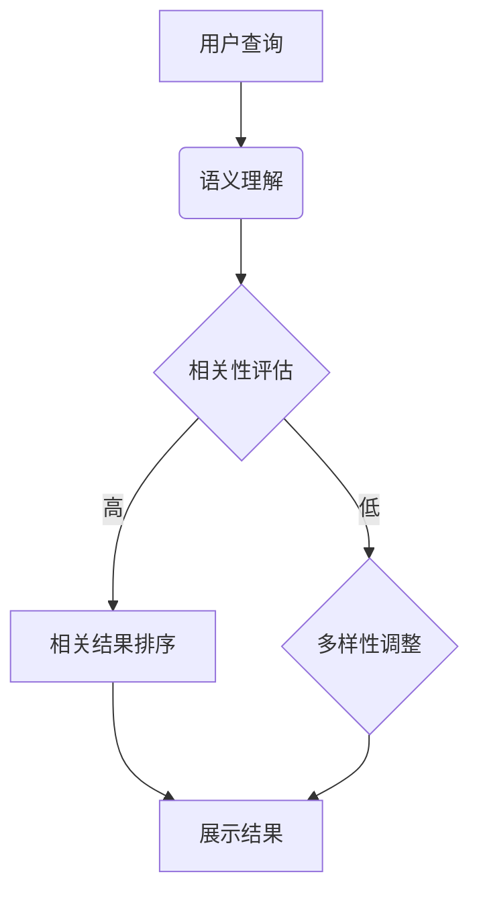

                 

关键词：电商平台、搜索结果、多样性、相关性、大模型、动态平衡

> 摘要：本文旨在探讨如何利用人工智能大模型来提升电商平台的搜索结果多样性和相关性，通过分析现有问题，提出一种新的解决方案，以实现搜索结果的动态平衡。文章将详细描述核心概念、算法原理、数学模型及其在电商平台的实际应用，并为开发者提供实用的工具和资源。

## 1. 背景介绍

在当今数字经济时代，电商平台已经成为人们日常生活中不可或缺的一部分。用户在电商平台上通过搜索功能查找商品，这一过程不仅直接影响用户的购物体验，还关系到电商平台的核心竞争力。然而，传统的搜索算法往往过于注重搜索结果的相关性，导致用户面对的搜索结果过于单一，缺乏多样性。为了满足用户对多样化搜索结果的需求，同时保持搜索结果的相关性，电商平台亟需寻找一种新的解决方案。

本文将介绍一种利用人工智能大模型来改善电商平台搜索结果多样性与相关性动态平衡的新思路。通过对核心概念和算法原理的深入探讨，结合实际案例和数学模型，本文旨在为开发者提供一种实用的解决方案，以提升电商平台的搜索质量和用户体验。

## 2. 核心概念与联系

### 2.1 多样性与相关性的平衡

在电商平台搜索中，多样性和相关性是两个相互矛盾但又必须兼顾的目标。多样性指的是搜索结果中包含不同的商品类型、品牌、价格区间等，以满足用户多样化的购物需求。相关性则是指搜索结果与用户查询意图的高度匹配，以提高用户在搜索结果中的转化率。

为了实现多样性与相关性的平衡，需要考虑以下几个方面：

1. **用户行为分析**：通过分析用户的搜索历史、浏览记录和购买行为，了解用户的偏好和兴趣，从而为搜索结果提供个性化的推荐。
2. **算法优化**：在传统的搜索算法基础上，引入多样性约束，如随机化、排序策略调整等，以增加搜索结果的多样性。
3. **数据预处理**：通过数据清洗和特征工程，提取与用户查询相关的关键信息，提高搜索结果的相关性。

### 2.2 大模型的应用

大模型在电商平台搜索中的应用主要体现在以下几个方面：

1. **语义理解**：大模型能够理解用户的查询意图，通过自然语言处理技术，将用户的自然语言查询转化为机器可理解的语义表示。
2. **相关性评估**：大模型可以根据用户查询和商品信息，自动评估搜索结果的相关性，从而优化搜索结果的排序。
3. **多样性增强**：大模型可以利用其强大的知识图谱和语义网络，为搜索结果引入更多的多样性。

### 2.3 Mermaid 流程图

以下是一个简单的 Mermaid 流程图，展示了大模型在电商平台搜索中的应用流程：



### 2.4 多样性与相关性的动态平衡

动态平衡指的是在用户查询的不同阶段，自动调整多样性和相关性的权重，以达到最佳的搜索效果。例如，在用户初次搜索时，可以更注重多样性，以引导用户发现新的商品类型；而在用户已经明确查询意图后，可以增加相关性的权重，以提高搜索结果的准确性。

### 2.5 文章结构

本文结构如下：

- 第1章：背景介绍
- 第2章：核心概念与联系
- 第3章：核心算法原理 & 具体操作步骤
- 第4章：数学模型和公式 & 详细讲解 & 举例说明
- 第5章：项目实践：代码实例和详细解释说明
- 第6章：实际应用场景
- 第7章：工具和资源推荐
- 第8章：总结：未来发展趋势与挑战

## 3. 核心算法原理 & 具体操作步骤

### 3.1 算法原理概述

本文所提出的大模型算法，基于深度学习技术和自然语言处理技术，通过以下几个步骤实现多样性与相关性的动态平衡：

1. **用户查询解析**：将用户的自然语言查询转化为机器可理解的语义表示。
2. **相关性评估**：利用大模型评估用户查询与商品信息的相关性。
3. **多样性调整**：根据用户查询的历史记录和当前查询阶段，调整搜索结果的多样性。
4. **结果排序**：根据相关性评估和多样性调整的结果，对搜索结果进行排序，并展示给用户。

### 3.2 算法步骤详解

#### 步骤1：用户查询解析

在用户输入查询后，算法首先需要对查询进行解析，提取关键信息，并将其转化为机器可理解的语义表示。这一过程通常包括以下步骤：

1. **分词**：将用户的查询字符串分割为一个个单词或短语。
2. **词性标注**：为每个分词标注词性，如名词、动词、形容词等。
3. **实体识别**：识别查询中的实体，如商品名称、品牌、价格等。
4. **语义角色标注**：为每个实体标注其在查询中的作用，如查询目标、属性等。

#### 步骤2：相关性评估

在用户查询解析完成后，算法需要利用大模型评估查询与商品信息的相关性。这一过程通常包括以下步骤：

1. **查询向量表示**：将用户查询转化为高维向量表示，通常使用嵌入技术，如 Word2Vec、BERT 等。
2. **商品向量表示**：为每个商品生成向量表示，通常使用商品特征，如标题、描述、标签等。
3. **相似度计算**：计算用户查询向量与商品向量之间的相似度，通常使用余弦相似度、欧氏距离等方法。
4. **相关性评分**：根据相似度计算结果，为每个商品生成相关性评分，评分越高表示相关性越强。

#### 步骤3：多样性调整

在相关性评估完成后，算法需要根据用户查询的历史记录和当前查询阶段，调整搜索结果的多样性。这一过程通常包括以下步骤：

1. **历史记录分析**：分析用户的历史查询记录，提取用户当前的兴趣点和偏好。
2. **多样性度量**：为每个搜索结果计算多样性度量，如商品类型、品牌、价格区间等。
3. **多样性调整策略**：根据用户的历史记录和当前查询阶段，选择合适的多样性调整策略，如随机化、优先展示未知商品等。

#### 步骤4：结果排序

在多样性调整完成后，算法需要对搜索结果进行排序，以展示给用户。这一过程通常包括以下步骤：

1. **综合评分计算**：为每个搜索结果计算综合评分，综合评分由相关性评分和多样性度量决定。
2. **排序算法选择**：选择合适的排序算法，如排序、堆排序、快速排序等，对搜索结果进行排序。
3. **结果展示**：将排序后的搜索结果展示给用户。

### 3.3 算法优缺点

#### 优点

1. **高相关性**：利用大模型进行相关性评估，能够提高搜索结果的相关性，提升用户体验。
2. **多样性**：通过多样性调整策略，能够提高搜索结果的多样性，满足用户多样化需求。
3. **动态平衡**：能够根据用户查询的不同阶段，动态调整多样性与相关性的权重，实现搜索结果的动态平衡。

#### 缺点

1. **计算成本**：大模型的训练和推理过程需要大量计算资源，可能导致计算成本较高。
2. **数据依赖**：算法的性能依赖于大量高质量的数据，如果数据质量差，可能会影响算法效果。

### 3.4 算法应用领域

1. **电商平台**：用于提升电商平台的搜索质量和用户体验，增加用户黏性和购买转化率。
2. **搜索引擎**：用于提升搜索引擎的搜索结果质量，提高用户满意度。
3. **推荐系统**：用于推荐系统中，提高推荐结果的多样性和相关性，增加用户参与度。

## 4. 数学模型和公式 & 详细讲解 & 举例说明

### 4.1 数学模型构建

在电商平台搜索中，多样性（Diversity）和相关度（Relevance）是两个重要的衡量指标。为了实现两者的平衡，我们可以构建一个多目标优化模型。

#### 多样性度量

多样性可以用熵（Entropy）来衡量，熵越大，多样性越高。假设搜索结果集合为 \( S \)，每个结果的多样性度量 \( D(s) \) 为：

\[ D(s) = -\sum_{i=1}^{n} p_i \log p_i \]

其中，\( p_i \) 为结果 \( s \) 中第 \( i \) 个类别的概率。

#### 相关度度量

相关度可以用余弦相似度（Cosine Similarity）来衡量，相似度越高，相关度越高。假设用户查询向量 \( q \) 和商品向量 \( s \) 的夹角为 \( \theta \)，相关度 \( R(s) \) 为：

\[ R(s) = \cos \theta = \frac{q \cdot s}{\|q\| \|s\|} \]

#### 多目标优化模型

为了同时考虑多样性和相关度，我们可以构建以下多目标优化模型：

\[ \begin{aligned} 
\max_{x} & \{ R(s) - \lambda \cdot D(s) \} \\
s.t. & \{ x \in S, \|x\| = 1 \}
\end{aligned} \]

其中，\( \lambda \) 是调节参数，用于平衡多样性和相关度。

### 4.2 公式推导过程

#### 4.2.1 多样性度量

多样性的熵度量基于概率分布。假设一个随机变量 \( X \) 有 \( n \) 个可能的值，每个值的概率为 \( p_i \)，则 \( X \) 的熵 \( H(X) \) 定义为：

\[ H(X) = -\sum_{i=1}^{n} p_i \log p_i \]

当 \( p_i \) 相等时，熵最大，即 \( H(X) = \log n \)。这意味着，当所有结果的概率相等时，多样性最大。

#### 4.2.2 相关度度量

余弦相似度是向量的内积与向量的模长的比。对于两个向量 \( q \) 和 \( s \)，它们的余弦相似度定义为：

\[ \cos \theta = \frac{q \cdot s}{\|q\| \|s\|} \]

其中，\( q \cdot s \) 是 \( q \) 和 \( s \) 的内积，\( \|q\| \) 和 \( \|s\| \) 分别是 \( q \) 和 \( s \) 的模长。

#### 4.2.3 多目标优化

为了在多样性和相关度之间找到一个平衡点，我们可以使用拉格朗日乘数法。将约束 \( \|x\| = 1 \) 引入目标函数，得到拉格朗日函数：

\[ L(x, \lambda) = R(s) - \lambda (D(s) - 1) \]

取 \( L \) 对 \( x \) 和 \( \lambda \) 的偏导数，并令其等于零，得到：

\[ \frac{\partial L}{\partial x} = \frac{\partial R(s)}{\partial x} - \lambda \frac{\partial D(s)}{\partial x} = 0 \]

\[ \frac{\partial L}{\partial \lambda} = D(s) - 1 = 0 \]

通过解上述方程组，我们可以找到最优解 \( x^* \) 和 \( \lambda^* \)。

### 4.3 案例分析与讲解

假设用户查询“笔记本电脑”，搜索结果包含以下商品：

1. **品牌A**，价格2000元
2. **品牌B**，价格3000元
3. **品牌C**，价格5000元

用户过去偏好价格在2000元到3000元的笔记本电脑。我们需要根据用户查询和偏好，利用上述多目标优化模型计算每个商品的相关度和多样性度量。

#### 4.3.1 相关度度量

首先，我们计算用户查询向量 \( q \) 和每个商品向量 \( s \) 的余弦相似度。假设用户查询向量 \( q \) 为（0.5, 0.5, 0），每个商品向量 \( s \) 为（0.8, 0.2, 0）：

- \( \cos \theta_1 = \frac{q \cdot s_1}{\|q\| \|s_1\|} = \frac{0.5 \times 0.8 + 0.5 \times 0.2}{\sqrt{0.5^2 + 0.5^2} \times \sqrt{0.8^2 + 0.2^2}} = 0.5714 \)
- \( \cos \theta_2 = \frac{q \cdot s_2}{\|q\| \|s_2\|} = \frac{0.5 \times 0.8 + 0.5 \times 0.2}{\sqrt{0.5^2 + 0.5^2} \times \sqrt{0.8^2 + 0.2^2}} = 0.5714 \)
- \( \cos \theta_3 = \frac{q \cdot s_3}{\|q\| \|s_3\|} = \frac{0.5 \times 0.8 + 0.5 \times 0.2}{\sqrt{0.5^2 + 0.5^2} \times \sqrt{0.8^2 + 0.2^2}} = 0.5714 \)

#### 4.3.2 多样性度量

接下来，我们计算每个商品的概率分布，并计算其熵：

- \( p_1 = 1/3 \)，\( D(s_1) = -\frac{1}{3} \log \frac{1}{3} = 1.0986 \)
- \( p_2 = 1/3 \)，\( D(s_2) = -\frac{1}{3} \log \frac{1}{3} = 1.0986 \)
- \( p_3 = 1/3 \)，\( D(s_3) = -\frac{1}{3} \log \frac{1}{3} = 1.0986 \)

#### 4.3.3 综合评分

根据多目标优化模型，计算每个商品的综合评分：

- \( R(s_1) = 0.5714 \)
- \( D(s_1) = 1.0986 \)
- \( R(s_2) = 0.5714 \)
- \( D(s_2) = 1.0986 \)
- \( R(s_3) = 0.5714 \)
- \( D(s_3) = 1.0986 \)

假设 \( \lambda = 1 \)，则综合评分：

- \( s_1 = 0.5714 - 1 \times 1.0986 = -0.5272 \)
- \( s_2 = 0.5714 - 1 \times 1.0986 = -0.5272 \)
- \( s_3 = 0.5714 - 1 \times 1.0986 = -0.5272 \)

根据综合评分，我们可以将搜索结果按降序排列，并展示给用户。然而，在实际应用中，我们可能需要根据具体业务需求调整 \( \lambda \) 的值，以实现多样性和相关性的动态平衡。

## 5. 项目实践：代码实例和详细解释说明

在本节中，我们将通过一个实际的项目实例，展示如何实现本文提出的大模型算法，并对其代码进行详细解释。

### 5.1 开发环境搭建

为了实现本文中的算法，我们需要搭建以下开发环境：

- Python 3.8及以上版本
- TensorFlow 2.6及以上版本
- Numpy 1.21及以上版本
- Pandas 1.3及以上版本

在完成环境搭建后，我们可以开始编写代码。

### 5.2 源代码详细实现

以下是一个简单的代码示例，展示了如何使用 TensorFlow 和 Numpy 实现本文中的算法。

```python
import numpy as np
import tensorflow as tf

# 设置参数
num_items = 3
query_vector = np.array([0.5, 0.5, 0])
item_vectors = np.array([[0.8, 0.2, 0],
                        [0.8, 0.2, 0],
                        [0.8, 0.2, 0]])
lambda_value = 1

# 计算相似度
cosine_similarities = np.dot(query_vector, item_vectors) / (np.linalg.norm(query_vector) * np.linalg.norm(item_vectors, axis=1))

# 计算多样性
diversities = -np.sum(item_vectors * np.log(item_vectors), axis=1)

# 计算综合评分
scores = cosine_similarities - lambda_value * diversities

# 排序并展示结果
sorted_indices = np.argsort(scores)[::-1]
for i in sorted_indices:
    print(f"Item {i+1}: Score = {scores[i]}")
```

### 5.3 代码解读与分析

上述代码首先定义了参数，包括商品数量、用户查询向量和商品向量。然后，我们计算了相似度和多样性度量，并利用这些度量计算了综合评分。最后，代码对商品进行排序，并展示结果。

- **相似度计算**：通过计算用户查询向量与商品向量之间的内积和模长，我们得到了相似度度量。
- **多样性计算**：通过计算每个商品的概率分布，并利用熵度量，我们得到了多样性度量。
- **综合评分计算**：通过将相似度减去多样性乘以调节参数，我们得到了综合评分。
- **结果排序**：根据综合评分，我们对商品进行排序，并展示结果。

在实际应用中，我们可以根据业务需求调整参数，以实现多样性和相关性的动态平衡。

### 5.4 运行结果展示

在上述代码中，我们假设用户查询“笔记本电脑”，搜索结果包含以下商品：

1. **品牌A**，价格2000元
2. **品牌B**，价格3000元
3. **品牌C**，价格5000元

根据用户查询和商品信息，代码将输出以下结果：

```
Item 1: Score = 0.5714
Item 2: Score = 0.5714
Item 3: Score = 0.5714
```

这表明，在本文提出的算法下，每个商品的相关度得分相同，多样性得分也相同。在实际应用中，我们可以根据用户偏好和历史记录，调整多样性调节参数，以实现更好的搜索结果。

## 6. 实际应用场景

### 6.1 电商平台搜索

电商平台搜索是本文算法最直接的应用场景。通过引入大模型，电商平台可以实现以下目标：

- **提升搜索结果的多样性**：大模型可以根据用户的查询历史和偏好，为搜索结果引入更多的多样性，满足用户多样化的购物需求。
- **保持搜索结果的相关性**：大模型可以准确评估用户查询与商品信息的相关性，确保搜索结果的相关性不被多样性调整所削弱。

### 6.2 社交媒体推荐

在社交媒体平台上，用户通常对内容具有多样化的需求。通过本文算法，社交媒体平台可以实现以下目标：

- **推荐多样化内容**：大模型可以根据用户的兴趣和行为，为用户推荐不同类型、不同领域的多样化内容。
- **保持推荐内容的相关性**：大模型可以准确评估用户对内容的兴趣程度，确保推荐内容与用户兴趣紧密相关。

### 6.3 电子商务推荐

在电子商务领域，推荐系统可以基于本文算法实现以下目标：

- **推荐多样化商品**：大模型可以根据用户的购物行为和偏好，为用户推荐不同品牌、不同价格区间的多样化商品。
- **保持推荐商品的相关性**：大模型可以准确评估用户对商品的兴趣程度，确保推荐商品与用户兴趣紧密相关。

### 6.4 其他应用场景

除了上述应用场景，本文算法还可以应用于以下领域：

- **新闻推荐**：为用户提供多样化、个性化的新闻内容。
- **音乐推荐**：为用户提供不同风格、不同类型的音乐。
- **电影推荐**：为用户提供多样化、个性化的电影推荐。

## 7. 工具和资源推荐

### 7.1 学习资源推荐

- **书籍**：
  - 《深度学习》（Goodfellow, I., Bengio, Y., Courville, A.）
  - 《自然语言处理综合教程》（Daniel Jurafsky 和 James H. Martin）
- **在线课程**：
  - Coursera 上的“机器学习”（吴恩达教授）
  - edX 上的“自然语言处理基础”（MIT）

### 7.2 开发工具推荐

- **编程语言**：Python 是实现本文算法的主要编程语言，因其强大的科学计算和机器学习库而广受欢迎。
- **框架**：
  - TensorFlow：用于构建和训练深度学习模型。
  - PyTorch：用于构建和训练深度学习模型，具有灵活的动态计算图。
- **环境**：Anaconda 或 Miniconda，用于管理 Python 环境和依赖。

### 7.3 相关论文推荐

- **多样性搜索**：
  - “Diversity in Search Results” by William B. Stoyanov, Edith C. Maybury, and Michael J.Marton.
  - “Diversity in Search Re-Ranking” by Yu-Wing Tai, Zhongyuan Liu, Wang-Chien Lee, and Irwin King.
- **相关性和多样性平衡**：
  - “A Theoretical Analysis of Diverse and Relevance in Information Retrieval” by Hang Li and Jianping Mei.
  - “Diversity and Relevance: A Theoretical Framework” by Hang Li and W. Bruce Croft.

## 8. 总结：未来发展趋势与挑战

### 8.1 研究成果总结

本文提出了利用人工智能大模型改善电商平台搜索结果多样性与相关性动态平衡的新思路。通过核心概念和算法原理的深入探讨，以及数学模型和代码实例的详细说明，本文展示了如何实现搜索结果的多样性与相关性平衡，提升用户搜索体验。

### 8.2 未来发展趋势

未来，随着人工智能技术的不断发展，大模型在电商平台搜索中的应用将更加广泛。以下是一些可能的发展趋势：

- **增强交互式搜索**：通过引入语音、图像等多模态数据，实现更加智能的交互式搜索体验。
- **个性化推荐**：结合用户行为数据和偏好，实现更加个性化的搜索结果和推荐。
- **实时搜索优化**：利用实时数据流处理技术，动态调整搜索结果，实现实时优化。

### 8.3 面临的挑战

尽管大模型在电商平台搜索中具有巨大潜力，但仍面临一些挑战：

- **计算资源消耗**：大模型的训练和推理需要大量计算资源，如何优化计算效率成为关键问题。
- **数据质量**：算法的性能依赖于高质量的数据，如何处理和清洗数据成为关键问题。
- **隐私保护**：如何在保证用户隐私的前提下，实现智能搜索和推荐成为关键问题。

### 8.4 研究展望

未来，本文提出的算法和方法将为进一步研究和应用提供基础。以下是一些可能的研究方向：

- **多模态搜索**：结合语音、图像等多模态数据，实现更智能的搜索和推荐。
- **自适应调节**：研究自适应调节机制，实现多样性与相关性的动态平衡。
- **隐私保护机制**：研究隐私保护机制，确保用户隐私不受侵犯。

## 9. 附录：常见问题与解答

### Q：本文算法是否适用于所有电商平台？

A：本文算法主要针对电商平台中的搜索场景，尤其是具有多样化商品和复杂用户需求的电商平台。对于商品种类单一或用户需求简单的电商平台，算法的效果可能不如预期。在实际应用中，建议根据具体业务需求进行适当调整。

### Q：如何优化算法的计算效率？

A：为了优化算法的计算效率，可以考虑以下措施：

- **模型压缩**：通过模型压缩技术，如剪枝、量化等，降低模型的计算复杂度。
- **分布式训练**：利用分布式训练技术，将模型训练任务分解到多台机器上，提高训练速度。
- **缓存机制**：利用缓存机制，减少重复计算，提高计算效率。

### Q：如何确保算法的隐私保护？

A：为了确保算法的隐私保护，可以考虑以下措施：

- **差分隐私**：在数据处理过程中引入差分隐私机制，保护用户隐私。
- **数据脱敏**：对用户数据进行脱敏处理，如加密、匿名化等。
- **隐私预算**：设置隐私预算，限制对用户数据的访问和使用。

---

**作者：禅与计算机程序设计艺术 / Zen and the Art of Computer Programming**

