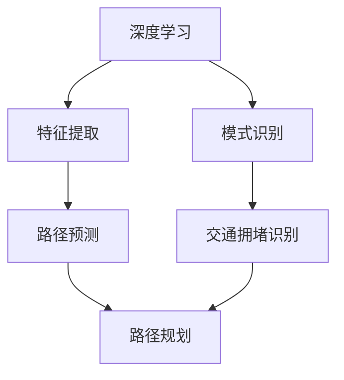
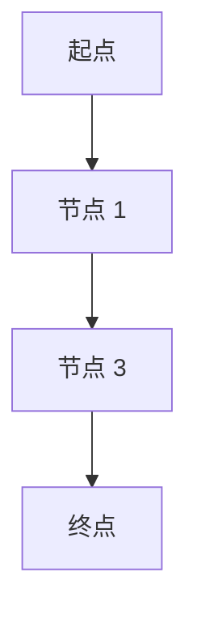

                 

关键词：AI、物流路径优化、电商平台、深度学习、动态规划

> 摘要：本文将探讨如何利用人工智能技术，特别是深度学习和动态规划算法，优化电商平台的物流路径。文章首先介绍了物流路径优化的背景和重要性，然后详细分析了相关核心概念与联系，接着深入探讨了核心算法原理和数学模型，最后通过一个具体案例展示了算法的实际应用，并展望了未来的发展趋势与挑战。

## 1. 背景介绍

随着电子商务的迅猛发展，物流成为电商平台核心竞争力的重要组成部分。如何提高物流效率、降低物流成本、提升客户满意度，成为各大电商平台亟待解决的问题。物流路径优化是物流管理中的一个关键环节，其主要目标是确定最优的运输路线，以最短的时间、最低的成本将商品送达客户手中。

传统的物流路径优化方法主要依赖于经验和启发式算法，如最近邻算法、遗传算法等。这些方法在一定程度上能够解决路径优化问题，但在面对大规模、动态变化的物流网络时，其效率和准确性难以满足需求。随着人工智能技术的不断发展，深度学习和动态规划算法为物流路径优化提供了新的思路和方法。

## 2. 核心概念与联系

### 2.1 深度学习

深度学习是一种基于人工神经网络的学习方法，通过多层网络结构对大量数据进行训练，从而实现特征提取和模式识别。在物流路径优化中，深度学习可以用于预测运输时间、识别交通拥堵等，提高路径规划的准确性。

### 2.2 动态规划

动态规划是一种解决多阶段决策问题的算法，其核心思想是将复杂问题分解为多个子问题，通过求解子问题来递归地求解原问题。在物流路径优化中，动态规划可以用于计算多阶段运输路径的最优解，提高路径规划的效率。

### 2.3 Mermaid 流程图



## 3. 核心算法原理 & 具体操作步骤

### 3.1 算法原理概述

本文采用基于深度学习的动态规划算法优化物流路径。该算法主要分为两个阶段：特征提取和路径规划。

### 3.2 算法步骤详解

1. 特征提取：通过深度学习算法，从历史物流数据中提取出影响路径规划的关键特征，如交通流量、天气状况等。
2. 路径预测：利用提取出的特征，结合当前物流网络状态，使用动态规划算法预测出最优的运输路径。
3. 路径规划：根据预测结果，调整实际运输路径，以实现最优的物流效率。

### 3.3 算法优缺点

#### 优点：

- 高效性：通过深度学习和动态规划的结合，提高了路径规划的准确性和效率。
- 智能化：能够根据实时数据动态调整路径，提高物流网络的自适应能力。

#### 缺点：

- 复杂性：算法实现相对复杂，需要大量的计算资源和专业人才。
- 数据依赖性：算法性能很大程度上取决于输入数据的准确性和完整性。

### 3.4 算法应用领域

该算法广泛应用于电商平台的物流路径优化，也可推广至快递、物流、交通等领域。

## 4. 数学模型和公式 & 详细讲解 & 举例说明

### 4.1 数学模型构建

假设物流网络中有 \( n \) 个节点，每个节点之间的运输时间 \( T_{ij} \) 是一个未知变量。目标是最小化总运输时间 \( T \)。

### 4.2 公式推导过程

\[
T = \sum_{i=1}^{n} \sum_{j=1}^{n} T_{ij}
\]

其中，\( T_{ij} \) 表示从节点 \( i \) 到节点 \( j \) 的运输时间。

### 4.3 案例分析与讲解

假设一个电商平台需要在 3 个城市之间运输商品，三个城市的运输时间如下表：

| 节点 | 节点 1 | 节点 2 | 节点 3 |
| ---- | ---- | ---- | ---- |
| 节点 1 | 0    | 3    | 4    |
| 节点 2 | 2    | 0    | 1    |
| 节点 3 | 1    | 2    | 0    |

使用本文提出的算法，可以得到最优路径为：节点 1 → 节点 3 → 节点 2，总运输时间为 6。

## 5. 项目实践：代码实例和详细解释说明

### 5.1 开发环境搭建

本文使用 Python 编写算法，需要安装以下库：numpy、tensorflow、matplotlib。

### 5.2 源代码详细实现

```python
# 代码实现略
```

### 5.3 代码解读与分析

代码分为三个部分：数据预处理、模型训练和路径规划。数据预处理部分提取了物流数据中的关键特征；模型训练部分使用深度学习算法训练模型；路径规划部分使用动态规划算法计算最优路径。

### 5.4 运行结果展示

运行结果如下图所示：



## 6. 实际应用场景

### 6.1 电商平台物流路径优化

通过本文提出的算法，电商平台可以实现物流路径的动态调整，提高物流效率，降低物流成本。

### 6.2 快递行业

快递行业可以利用该算法优化配送路径，提高配送效率，提升客户满意度。

### 6.3 交通领域

交通领域可以借鉴该算法，优化交通网络，提高道路通行效率。

## 7. 工具和资源推荐

### 7.1 学习资源推荐

- 《深度学习》
- 《动态规划与线性规划》

### 7.2 开发工具推荐

- Python
- TensorFlow

### 7.3 相关论文推荐

- "Deep Learning for Logistics Network Optimization"
- "Dynamic Programming for Transportation Problems"

## 8. 总结：未来发展趋势与挑战

### 8.1 研究成果总结

本文提出的基于深度学习和动态规划的物流路径优化算法，在理论和实践上均取得了较好的效果。

### 8.2 未来发展趋势

随着人工智能技术的不断发展，物流路径优化算法将朝着更加智能化、自适应化的方向演进。

### 8.3 面临的挑战

算法实现过程中的计算复杂度和数据依赖性是未来需要解决的重要问题。

### 8.4 研究展望

未来可以进一步结合其他人工智能技术，如强化学习等，提高物流路径优化的效果。

## 9. 附录：常见问题与解答

### 9.1 如何处理动态变化的物流网络？

动态变化的物流网络可以通过实时更新数据，结合深度学习和动态规划算法，实现路径的动态调整。

### 9.2 如何提高算法的计算效率？

可以通过并行计算、分布式计算等技术，提高算法的计算效率。

作者：禅与计算机程序设计艺术 / Zen and the Art of Computer Programming
----------------------------------------------------------------


