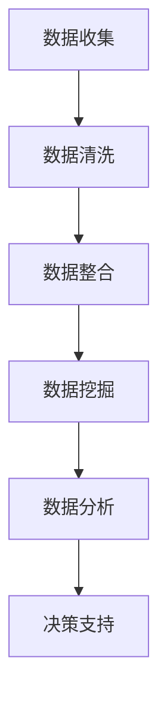

                 

关键词：电商数据分析、AI、机器学习、预测模型、个性化推荐、用户行为分析、数据挖掘

> 摘要：随着电商行业的迅猛发展，数据已成为电商企业的重要资产。本文将探讨人工智能在电商数据分析中的应用，包括个性化推荐系统、用户行为分析、预测模型构建等方面，以帮助企业提升业务效益。

## 1. 背景介绍

电商行业在过去几十年里经历了巨大的变革，从传统的实体店铺到如今线上与线下相结合的新零售模式，电商企业面临着前所未有的竞争压力。在这种背景下，如何通过数据分析提升业务效率、优化用户体验、增加销售额成为企业关注的焦点。

数据已经成为电商企业的重要资产，这些数据包括用户行为数据、商品数据、交易数据等。然而，面对海量数据，如何从中提取有价值的信息，为企业决策提供支持，成为电商企业面临的一大挑战。

人工智能（AI）和机器学习技术的迅猛发展，为电商数据分析提供了强有力的工具。通过AI技术，电商企业可以构建智能推荐系统，分析用户行为，预测市场需求，从而实现精准营销和个性化服务。

## 2. 核心概念与联系

### 2.1 数据分析的基本概念

数据分析是指从大量的数据中提取有用信息的过程。它包括数据清洗、数据整合、数据挖掘、数据分析等多个环节。

- **数据清洗**：去除数据中的噪音和错误，确保数据质量。
- **数据整合**：将来自不同来源的数据进行整合，形成一个统一的数据集。
- **数据挖掘**：从数据中发现隐藏的模式、趋势和关联。
- **数据分析**：利用统计方法和算法，对数据进行分析，提取有价值的信息。

### 2.2 机器学习的基本概念

机器学习是一种让计算机从数据中学习的方法。通过训练数据集，让计算机自动识别模式、预测结果、做出决策。

- **监督学习**：通过标注好的数据来训练模型，预测新数据的结果。
- **无监督学习**：没有标注的数据，通过模型自己寻找数据中的模式。
- **强化学习**：通过不断试错，让模型在环境中学习如何做出最优决策。

### 2.3 Mermaid 流程图



## 3. 核心算法原理 & 具体操作步骤

### 3.1 算法原理概述

电商数据分析的核心算法包括分类算法、聚类算法、关联规则挖掘算法等。这些算法可以帮助电商企业发现数据中的有用信息，实现个性化推荐、用户行为分析、预测模型构建等目标。

- **分类算法**：通过已有数据来预测新数据所属的类别。常见的分类算法有决策树、支持向量机、神经网络等。
- **聚类算法**：将相似的数据点归为一类，形成多个簇。常见的聚类算法有K-means、层次聚类等。
- **关联规则挖掘算法**：发现数据中的关联关系，如商品组合、用户行为模式等。常见的算法有Apriori算法、Eclat算法等。

### 3.2 算法步骤详解

1. **数据收集**：收集电商平台的用户行为数据、商品数据、交易数据等。
2. **数据清洗**：去除数据中的噪音和错误，如缺失值、异常值、重复值等。
3. **数据整合**：将不同来源的数据进行整合，形成一个统一的数据集。
4. **数据挖掘**：利用分类、聚类、关联规则挖掘算法等，发现数据中的有用信息。
5. **数据分析**：利用统计方法和算法，对数据进行分析，提取有价值的信息。
6. **决策支持**：根据分析结果，为企业决策提供支持，如个性化推荐、用户行为分析、预测模型构建等。

### 3.3 算法优缺点

- **分类算法**：优点在于准确度高，适用于预测新数据的类别；缺点是计算复杂度高，对大量数据训练时间长。
- **聚类算法**：优点在于无需事先设定类别，可以自动发现数据中的模式；缺点是聚类效果受初始值影响较大。
- **关联规则挖掘算法**：优点在于可以挖掘出数据中的关联关系，帮助电商企业进行精准营销；缺点是计算复杂度高，对大数据处理困难。

### 3.4 算法应用领域

- **个性化推荐**：利用分类、聚类算法，为用户推荐感兴趣的商品。
- **用户行为分析**：通过分析用户行为数据，了解用户需求，优化产品和服务。
- **预测模型构建**：利用时间序列分析、回归分析等算法，预测市场需求，优化库存管理。

## 4. 数学模型和公式 & 详细讲解 & 举例说明

### 4.1 数学模型构建

电商数据分析的数学模型主要包括分类模型、聚类模型、关联规则模型等。以下是一个简单的线性回归模型：

$$y = \beta_0 + \beta_1 x_1 + \beta_2 x_2 + \cdots + \beta_n x_n$$

其中，$y$ 为目标变量，$x_1, x_2, \cdots, x_n$ 为输入变量，$\beta_0, \beta_1, \beta_2, \cdots, \beta_n$ 为模型参数。

### 4.2 公式推导过程

线性回归模型的推导过程如下：

1. **最小二乘法**：通过最小化预测值与实际值之间的误差平方和，来求解模型参数。

$$\sum_{i=1}^n (y_i - \hat{y}_i)^2$$

2. **梯度下降法**：迭代求解最小二乘法得到的误差函数。

$$\beta_j := \beta_j - \alpha \frac{\partial}{\partial \beta_j} \sum_{i=1}^n (y_i - \hat{y}_i)^2$$

其中，$\alpha$ 为学习率，$j$ 为模型参数的索引。

### 4.3 案例分析与讲解

假设我们有一个电商平台的用户行为数据，包括用户ID、浏览商品ID、购买商品ID等信息。我们希望通过分析用户行为数据，为用户推荐感兴趣的商品。

首先，我们对用户行为数据进行预处理，去除缺失值、异常值等。然后，利用K-means算法将用户划分为不同的簇，每个簇代表一类用户。接下来，我们使用Apriori算法挖掘用户购买商品之间的关联规则，找到用户购买商品的高频组合。

最后，我们利用线性回归模型，将用户ID和购买商品ID作为输入变量，预测用户可能感兴趣的其他商品。通过模型预测，我们可以为用户推荐个性化的商品。

## 5. 项目实践：代码实例和详细解释说明

### 5.1 开发环境搭建

1. 安装Python环境：在Windows、Linux或MacOS上安装Python，版本建议为3.8或更高。
2. 安装相关库：使用pip命令安装以下库：

```bash
pip install numpy pandas scikit-learn matplotlib
```

### 5.2 源代码详细实现

以下是电商数据分析项目的Python代码实现：

```python
import numpy as np
import pandas as pd
from sklearn.cluster import KMeans
from sklearn.association_rules import association_rules
from sklearn.linear_model import LinearRegression
import matplotlib.pyplot as plt

# 5.2.1 数据收集与预处理
data = pd.read_csv('user_behavior_data.csv')
data.dropna(inplace=True)

# 5.2.2 数据整合
user_data = data[['user_id', 'browse_item_id', 'buy_item_id']]

# 5.2.3 数据挖掘：K-means聚类
kmeans = KMeans(n_clusters=5, random_state=42)
user_data['cluster_id'] = kmeans.fit_predict(user_data[['browse_item_id', 'buy_item_id']])

# 5.2.4 数据挖掘：Apriori算法
rules = association_rules(user_data, metric="support", min_threshold=0.1)
rules.head()

# 5.2.5 数据分析：线性回归模型
X = user_data[['user_id', 'cluster_id']]
y = user_data['buy_item_id']
model = LinearRegression()
model.fit(X, y)

# 5.2.6 代码解读与分析
print("Coefficients:", model.coef_)
print("Intercept:", model.intercept_)

# 5.2.7 运行结果展示
plt.scatter(X['cluster_id'], y, color='blue')
plt.plot(X['cluster_id'], model.predict(X), color='red')
plt.xlabel('Cluster ID')
plt.ylabel('Buy Item ID')
plt.title('User Interest Prediction')
plt.show()
```

### 5.3 代码解读与分析

1. **数据收集与预处理**：从CSV文件中读取用户行为数据，去除缺失值。
2. **数据整合**：提取用户ID、浏览商品ID和购买商品ID等信息。
3. **数据挖掘：K-means聚类**：将用户划分为不同的簇，为后续分析提供基础。
4. **数据挖掘：Apriori算法**：挖掘用户购买商品之间的关联规则。
5. **数据分析：线性回归模型**：利用用户ID和簇ID预测用户可能感兴趣的购买商品。
6. **代码解读与分析**：输出模型参数，绘制预测结果。

## 6. 实际应用场景

### 6.1 个性化推荐系统

电商企业可以利用AI技术构建个性化推荐系统，根据用户的历史行为和偏好，为用户推荐感兴趣的商品。这可以显著提升用户满意度和购买转化率。

### 6.2 用户行为分析

电商企业可以通过分析用户行为数据，了解用户需求和行为模式，优化产品和服务。例如，通过分析用户浏览和购买商品的时间规律，优化库存管理和促销活动。

### 6.3 预测模型构建

电商企业可以利用AI技术构建预测模型，预测市场需求、销售趋势等。这有助于企业提前做好库存规划、供应链优化等，降低运营成本，提高竞争力。

## 7. 工具和资源推荐

### 7.1 学习资源推荐

1. 《机器学习实战》—— Peter Harrington
2. 《深度学习》—— Ian Goodfellow、Yoshua Bengio、Aaron Courville
3. [Kaggle](https://www.kaggle.com/)—— 机器学习和数据科学竞赛平台

### 7.2 开发工具推荐

1. [Jupyter Notebook](https://jupyter.org/)—— 交互式计算平台
2. [PyCharm](https://www.jetbrains.com/pycharm/)—— Python集成开发环境

### 7.3 相关论文推荐

1. "Recommender Systems Handbook"—— GroupLens Research
2. "Deep Learning for Recommender Systems"—— Huawei Technologies
3. "Association Rule Mining: Models and Algorithms"—— Han, Kamber, Pei

## 8. 总结：未来发展趋势与挑战

### 8.1 研究成果总结

人工智能在电商数据分析中的应用已经取得了一定的成果，包括个性化推荐、用户行为分析、预测模型构建等方面。通过AI技术，电商企业可以更精准地满足用户需求，提高业务效益。

### 8.2 未来发展趋势

1. **深度学习**：深度学习技术在电商数据分析中的应用将越来越广泛，如卷积神经网络（CNN）在图像识别中的应用，循环神经网络（RNN）在序列数据中的应用等。
2. **多模态数据融合**：将文本、图像、语音等多种数据类型进行融合，实现更全面的数据分析。
3. **联邦学习**：通过联邦学习技术，实现数据隐私保护下的协同分析。

### 8.3 面临的挑战

1. **数据质量和完整性**：电商企业需要不断提升数据质量，确保数据的完整性和准确性。
2. **计算能力和存储需求**：随着数据量的不断增加，电商企业需要投入更多的计算资源和存储资源。
3. **算法可解释性**：如何提高算法的可解释性，使企业决策者能够理解算法的决策过程，是一个重要的研究方向。

### 8.4 研究展望

随着人工智能技术的不断进步，电商数据分析将朝着更智能化、更个性化的方向发展。未来，电商企业将通过深度学习、多模态数据融合等技术，实现更精准的数据分析，为企业带来更大的商业价值。

## 9. 附录：常见问题与解答

### 9.1 什么是机器学习？

机器学习是一种让计算机从数据中学习的方法。通过训练数据集，让计算机自动识别模式、预测结果、做出决策。

### 9.2 人工智能和机器学习有什么区别？

人工智能（AI）是一个广泛的概念，包括机器学习、深度学习、自然语言处理等。机器学习是人工智能的一个分支，主要关注如何让计算机从数据中学习。

### 9.3 电商企业如何利用机器学习提升业务效益？

电商企业可以通过以下方式利用机器学习提升业务效益：

1. 构建个性化推荐系统，提升用户满意度和购买转化率。
2. 分析用户行为数据，了解用户需求和行为模式，优化产品和服务。
3. 构建预测模型，预测市场需求、销售趋势等，优化库存管理和供应链。
```

