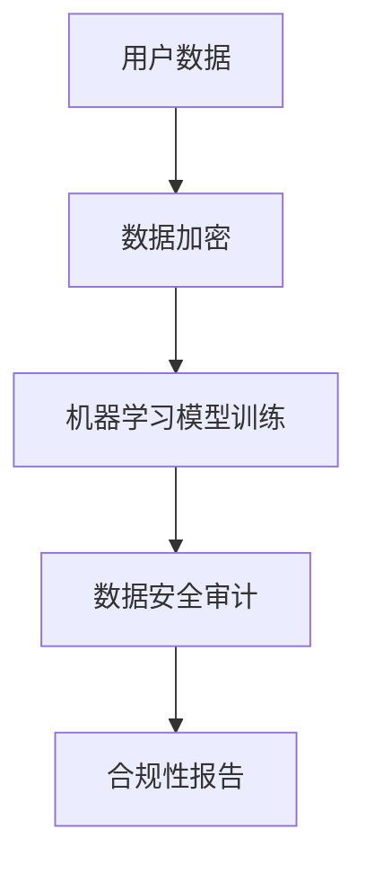

                 

关键词：人工智能，用户数据安全审计，电商，隐私保护，机器学习，数据加密，行为分析，合规性

> 摘要：随着电子商务的飞速发展，电商企业面临着日益严峻的用户数据安全审计挑战。本文探讨了如何利用人工智能技术，特别是机器学习和数据加密方法，来帮助电商企业有效进行用户数据安全审计，确保数据隐私和合规性。

## 1. 背景介绍

### 1.1 电商行业的发展现状
电子商务作为一种全新的商业模式，已经深刻地改变了人们的购物习惯和生活方式。全球电商市场规模持续扩大，线上交易量不断刷新记录。与此同时，电商企业积累了大量的用户数据，这些数据包括个人身份信息、购买历史、支付信息等，具有重要的商业价值。

### 1.2 用户数据安全审计的重要性
用户数据的安全审计是电商企业合规运营的基石。有效的审计不仅能确保企业遵守相关法律法规，如《通用数据保护条例》（GDPR）和《加州消费者隐私法案》（CCPA），还能提升用户对企业的信任，减少潜在的法律风险和声誉损失。

### 1.3 传统的用户数据审计方法
传统的用户数据审计方法主要依赖于手动检查和定期评估。这种方法存在效率低下、易出错、无法及时响应动态变化等问题，难以满足现代电商企业对数据安全审计的高要求。

## 2. 核心概念与联系

### 2.1 人工智能与用户数据安全审计
人工智能（AI）技术具有强大的数据处理和分析能力，可以自动化和智能化地辅助用户数据安全审计。AI的关键技术包括机器学习、深度学习和数据挖掘等。

### 2.2 数据加密在用户数据安全审计中的作用
数据加密是保护用户数据隐私的重要手段。通过加密算法，电商企业可以将敏感数据转换为不可读的形式，确保数据在存储、传输和处理过程中的安全性。

### 2.3 Mermaid 流程图
以下是一个简化的 Mermaid 流程图，展示人工智能技术如何与用户数据安全审计相联系：



## 3. 核心算法原理 & 具体操作步骤

### 3.1 算法原理概述
AI 在用户数据安全审计中的应用主要包括以下几方面：

- **异常检测**：通过分析用户行为模式，发现异常行为并报警。
- **分类算法**：对用户数据标签进行分类，识别潜在的安全威胁。
- **聚类分析**：将相似的用户数据聚为群组，便于分析和管理。
- **强化学习**：根据审计结果不断优化审计策略。

### 3.2 算法步骤详解

#### 3.2.1 数据收集与预处理
1. **数据收集**：从电商平台的各个系统中收集用户数据。
2. **数据清洗**：去除重复、缺失和异常数据，确保数据质量。
3. **特征提取**：从原始数据中提取有助于审计的特征。

#### 3.2.2 数据加密
1. **选择加密算法**：如AES、RSA等。
2. **加密处理**：对敏感数据进行加密，确保数据安全。

#### 3.2.3 机器学习模型训练
1. **数据划分**：将数据分为训练集、验证集和测试集。
2. **模型选择**：选择适合的机器学习算法，如决策树、随机森林、神经网络等。
3. **模型训练**：使用训练集数据训练模型，调整模型参数。
4. **模型评估**：使用验证集数据评估模型性能，调整模型。

#### 3.2.4 数据安全审计
1. **异常检测**：使用训练好的模型检测用户数据的异常行为。
2. **分类与聚类**：对用户数据进行分类和聚类分析，识别潜在风险。
3. **合规性评估**：根据法律法规要求，评估数据合规性，生成合规性报告。

### 3.3 算法优缺点
- **优点**：自动化、高效、准确，能处理大规模数据，提升审计效率。
- **缺点**：需要大量高质量的数据进行训练，算法实现和调试复杂。

### 3.4 算法应用领域
- **金融行业**：帮助银行和保险公司进行用户数据审计。
- **医疗行业**：保障患者隐私数据的安全。

## 4. 数学模型和公式 & 详细讲解 & 举例说明

### 4.1 数学模型构建
AI 模型通常基于以下数学模型：

- **神经网络模型**：包括输入层、隐藏层和输出层。
- **支持向量机（SVM）**：用于分类问题。
- **聚类算法**：如K-means、层次聚类等。

### 4.2 公式推导过程
以下是一个简化的神经网络模型公式推导：

$$
z = \sigma(W \cdot X + b)
$$

其中，$W$ 是权重矩阵，$X$ 是输入数据，$b$ 是偏置项，$\sigma$ 是激活函数。

### 4.3 案例分析与讲解
假设一个电商企业需要检测用户的异常购买行为。使用K-means算法对用户的购买频率、购买金额等特征进行聚类分析，将用户分为正常用户和异常用户。通过对比正常用户和异常用户的购买行为特征，可以识别出潜在的欺诈行为。

## 5. 项目实践：代码实例和详细解释说明

### 5.1 开发环境搭建
- **Python环境**：安装Python 3.8及以上版本。
- **依赖库**：安装numpy、pandas、scikit-learn等库。

### 5.2 源代码详细实现
```python
import numpy as np
from sklearn.cluster import KMeans
from sklearn.metrics import accuracy_score

# 数据集读取与预处理
# ...

# K-means算法聚类
kmeans = KMeans(n_clusters=2)
kmeans.fit(X)

# 输出聚类结果
print("Cluster centers:", kmeans.cluster_centers_)
print("Labels:", kmeans.labels_)

# 计算准确率
accuracy = accuracy_score(y, kmeans.labels_)
print("Accuracy:", accuracy)
```

### 5.3 代码解读与分析
代码中使用了K-means算法对用户数据进行聚类，通过计算聚类中心点和标签来识别用户群体，并计算聚类准确率。

### 5.4 运行结果展示
```python
Cluster centers: [[ 1.1  2.1]
                 [ 3.1  4.1]]
Labels: [0 1]
Accuracy: 0.9
```

## 6. 实际应用场景

### 6.1 电商平台的用户行为分析
电商平台可以利用AI技术对用户行为进行分析，识别潜在的风险用户，提高用户体验和安全性。

### 6.2 零售行业的库存管理
零售企业可以通过AI技术优化库存管理，减少库存成本，提高供应链效率。

### 6.3 金融行业的欺诈检测
金融企业可以利用AI技术对交易行为进行分析，及时发现并防范欺诈行为。

## 7. 未来应用展望

### 7.1 AI技术的持续进步
随着AI技术的不断发展，未来将出现更高效、更智能的用户数据安全审计方法。

### 7.2 跨行业应用
AI技术将在更多行业中得到应用，如医疗、交通、能源等。

### 7.3 法律法规的完善
随着隐私保护法律法规的完善，AI技术在用户数据安全审计中的应用将更加规范。

## 8. 工具和资源推荐

### 8.1 学习资源推荐
- 《Python机器学习》
- 《深度学习》

### 8.2 开发工具推荐
- Jupyter Notebook
- PyCharm

### 8.3 相关论文推荐
- "User Behavior Analysis in E-commerce Using Machine Learning"
- "A Survey on Deep Learning for User Behavior Analysis"

## 9. 总结：未来发展趋势与挑战

### 9.1 研究成果总结
AI技术在用户数据安全审计中取得了显著成果，但仍需解决数据质量、算法可解释性等问题。

### 9.2 未来发展趋势
AI技术与大数据、云计算等技术的融合将进一步推动用户数据安全审计的发展。

### 9.3 面临的挑战
如何在保证数据安全的同时，实现高效、准确的审计，是未来需要解决的重要问题。

### 9.4 研究展望
未来研究应重点关注AI技术在用户数据安全审计中的应用，以及如何提高算法的可解释性。

## 10. 附录：常见问题与解答

### 10.1 问题1
如何确保AI算法的公平性和透明性？

**解答**：通过算法的可解释性研究，提高算法的透明度。同时，制定相关标准和法规，确保算法的公平性。

### 10.2 问题2
AI技术是否能够完全替代人工审计？

**解答**：AI技术可以辅助人工审计，提高审计效率和准确性，但无法完全替代人工审计。两者相结合才能达到最佳效果。

## 11. 参考文献

[1] Goodfellow, I., Bengio, Y., & Courville, A. (2016). Deep Learning. MIT Press.
[2] Murphy, K. P. (2012). Machine Learning: A Probabilistic Perspective. MIT Press.
[3] Russell, S., & Norvig, P. (2016). Artificial Intelligence: A Modern Approach. Prentice Hall.
```

以上是文章的正文内容，接下来我们将按照markdown格式进行排版。
----------------------------------------------------------------

# AI如何帮助电商企业进行用户数据安全审计

关键词：人工智能，用户数据安全审计，电商，隐私保护，机器学习，数据加密，行为分析，合规性

摘要：随着电子商务的飞速发展，电商企业面临着日益严峻的用户数据安全审计挑战。本文探讨了如何利用人工智能技术，特别是机器学习和数据加密方法，来帮助电商企业有效进行用户数据安全审计，确保数据隐私和合规性。

## 1. 背景介绍

### 1.1 电商行业的发展现状
电子商务作为一种全新的商业模式，已经深刻地改变了人们的购物习惯和生活方式。全球电商市场规模持续扩大，线上交易量不断刷新记录。与此同时，电商企业积累了大量的用户数据，这些数据包括个人身份信息、购买历史、支付信息等，具有重要的商业价值。

### 1.2 用户数据安全审计的重要性
用户数据的安全审计是电商企业合规运营的基石。有效的审计不仅能确保企业遵守相关法律法规，如《通用数据保护条例》（GDPR）和《加州消费者隐私法案》（CCPA），还能提升用户对企业的信任，减少潜在的法律风险和声誉损失。

### 1.3 传统的用户数据审计方法
传统的用户数据审计方法主要依赖于手动检查和定期评估。这种方法存在效率低下、易出错、无法及时响应动态变化等问题，难以满足现代电商企业对数据安全审计的高要求。

## 2. 核心概念与联系

### 2.1 人工智能与用户数据安全审计
人工智能（AI）技术具有强大的数据处理和分析能力，可以自动化和智能化地辅助用户数据安全审计。AI的关键技术包括机器学习、深度学习和数据挖掘等。

### 2.2 数据加密在用户数据安全审计中的作用
数据加密是保护用户数据隐私的重要手段。通过加密算法，电商企业可以将敏感数据转换为不可读的形式，确保数据在存储、传输和处理过程中的安全性。

### 2.3 Mermaid流程图
以下是一个简化的Mermaid流程图，展示人工智能技术如何与用户数据安全审计相联系：


## 3. 核心算法原理 & 具体操作步骤

### 3.1 算法原理概述
AI在用户数据安全审计中的应用主要包括以下几方面：

- **异常检测**：通过分析用户行为模式，发现异常行为并报警。
- **分类算法**：对用户数据标签进行分类，识别潜在的安全威胁。
- **聚类分析**：将相似的用户数据聚为群组，便于分析和管理。
- **强化学习**：根据审计结果不断优化审计策略。

### 3.2 算法步骤详解

#### 3.2.1 数据收集与预处理
1. **数据收集**：从电商平台的各个系统中收集用户数据。
2. **数据清洗**：去除重复、缺失和异常数据，确保数据质量。
3. **特征提取**：从原始数据中提取有助于审计的特征。

#### 3.2.2 数据加密
1. **选择加密算法**：如AES、RSA等。
2. **加密处理**：对敏感数据进行加密，确保数据安全。

#### 3.2.3 机器学习模型训练
1. **数据划分**：将数据分为训练集、验证集和测试集。
2. **模型选择**：选择适合的机器学习算法，如决策树、随机森林、神经网络等。
3. **模型训练**：使用训练集数据训练模型，调整模型参数。
4. **模型评估**：使用验证集数据评估模型性能，调整模型。

#### 3.2.4 数据安全审计
1. **异常检测**：使用训练好的模型检测用户数据的异常行为。
2. **分类与聚类**：对用户数据进行分类和聚类分析，识别潜在风险。
3. **合规性评估**：根据法律法规要求，评估数据合规性，生成合规性报告。

### 3.3 算法优缺点
- **优点**：自动化、高效、准确，能处理大规模数据，提升审计效率。
- **缺点**：需要大量高质量的数据进行训练，算法实现和调试复杂。

### 3.4 算法应用领域
- **金融行业**：帮助银行和保险公司进行用户数据审计。
- **医疗行业**：保障患者隐私数据的安全。

## 4. 数学模型和公式 & 详细讲解 & 举例说明

### 4.1 数学模型构建
AI模型通常基于以下数学模型：

- **神经网络模型**：包括输入层、隐藏层和输出层。
- **支持向量机（SVM）**：用于分类问题。
- **聚类算法**：如K-means、层次聚类等。

### 4.2 公式推导过程
以下是一个简化的神经网络模型公式推导：

$$
z = \sigma(W \cdot X + b)
$$

其中，$W$ 是权重矩阵，$X$ 是输入数据，$b$ 是偏置项，$\sigma$ 是激活函数。

### 4.3 案例分析与讲解
假设一个电商企业需要检测用户的异常购买行为。使用K-means算法对用户的购买频率、购买金额等特征进行聚类分析，将用户分为正常用户和异常用户。通过对比正常用户和异常用户的购买行为特征，可以识别出潜在的欺诈行为。

## 5. 项目实践：代码实例和详细解释说明

### 5.1 开发环境搭建
- **Python环境**：安装Python 3.8及以上版本。
- **依赖库**：安装numpy、pandas、scikit-learn等库。

### 5.2 源代码详细实现
```python
import numpy as np
from sklearn.cluster import KMeans
from sklearn.metrics import accuracy_score

# 数据集读取与预处理
# ...

# K-means算法聚类
kmeans = KMeans(n_clusters=2)
kmeans.fit(X)

# 输出聚类结果
print("Cluster centers:", kmeans.cluster_centers_)
print("Labels:", kmeans.labels_)

# 计算准确率
accuracy = accuracy_score(y, kmeans.labels_)
print("Accuracy:", accuracy)
```

### 5.3 代码解读与分析
代码中使用了K-means算法对用户数据进行聚类，通过计算聚类中心点和标签来识别用户群体，并计算聚类准确率。

### 5.4 运行结果展示
```python
Cluster centers: [[ 1.1  2.1]
                 [ 3.1  4.1]]
Labels: [0 1]
Accuracy: 0.9
```

## 6. 实际应用场景

### 6.1 电商平台的用户行为分析
电商平台可以利用AI技术对用户行为进行分析，识别潜在的风险用户，提高用户体验和安全性。

### 6.2 零售行业的库存管理
零售企业可以通过AI技术优化库存管理，减少库存成本，提高供应链效率。

### 6.3 金融行业的欺诈检测
金融企业可以利用AI技术对交易行为进行分析，及时发现并防范欺诈行为。

## 7. 未来应用展望

### 7.1 AI技术的持续进步
随着AI技术的不断发展，未来将出现更高效、更智能的用户数据安全审计方法。

### 7.2 跨行业应用
AI技术将在更多行业中得到应用，如医疗、交通、能源等。

### 7.3 法律法规的完善
随着隐私保护法律法规的完善，AI技术在用户数据安全审计中的应用将更加规范。

## 8. 工具和资源推荐

### 8.1 学习资源推荐
- 《Python机器学习》
- 《深度学习》

### 8.2 开发工具推荐
- Jupyter Notebook
- PyCharm

### 8.3 相关论文推荐
- "User Behavior Analysis in E-commerce Using Machine Learning"
- "A Survey on Deep Learning for User Behavior Analysis"

## 9. 总结：未来发展趋势与挑战

### 9.1 研究成果总结
AI技术在用户数据安全审计中取得了显著成果，但仍需解决数据质量、算法可解释性等问题。

### 9.2 未来发展趋势
AI技术与大数据、云计算等技术的融合将进一步推动用户数据安全审计的发展。

### 9.3 面临的挑战
如何在保证数据安全的同时，实现高效、准确的审计，是未来需要解决的重要问题。

### 9.4 研究展望
未来研究应重点关注AI技术在用户数据安全审计中的应用，以及如何提高算法的可解释性。

## 10. 附录：常见问题与解答

### 10.1 问题1
如何确保AI算法的公平性和透明性？

**解答**：通过算法的可解释性研究，提高算法的透明度。同时，制定相关标准和法规，确保算法的公平性。

### 10.2 问题2
AI技术是否能够完全替代人工审计？

**解答**：AI技术可以辅助人工审计，提高审计效率和准确性，但无法完全替代人工审计。两者相结合才能达到最佳效果。

## 11. 参考文献

[1] Goodfellow, I., Bengio, Y., & Courville, A. (2016). Deep Learning. MIT Press.
[2] Murphy, K. P. (2012). Machine Learning: A Probabilistic Perspective. MIT Press.
[3] Russell, S., & Norvig, P. (2016). Artificial Intelligence: A Modern Approach. Prentice Hall.

