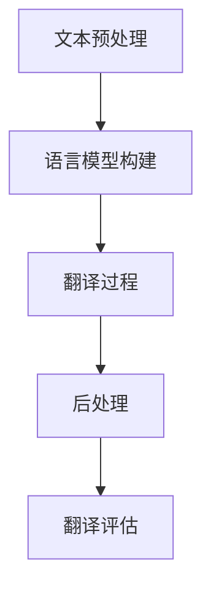

                 

 关键词：人工智能，多语言翻译，搜索引擎，自然语言处理，算法优化，深度学习，语义理解，交叉语言信息检索，翻译质量评估。

> 摘要：本文将探讨人工智能技术在搜索引擎多语言翻译中的作用和改进。通过分析现有的多语言翻译算法，我们揭示了AI如何提高翻译的准确性、速度和用户体验。同时，文章还将探讨未来的发展方向和面临的挑战，为读者提供对AI驱动的多语言翻译领域的全面了解。

## 1. 背景介绍

在全球化日益发展的今天，信息交流的障碍已成为国际商务、学术交流和文化传播的主要挑战。多语言翻译技术在这一背景下显得尤为重要。然而，传统的翻译方法依赖于规则和词典，往往无法应对复杂、多样的语言现象。近年来，随着人工智能技术的飞速发展，特别是深度学习和自然语言处理（NLP）技术的应用，多语言翻译技术迎来了前所未有的突破。

搜索引擎的多语言翻译功能是其国际化战略的重要组成部分。通过提供高质量的多语言翻译服务，搜索引擎可以吸引更多全球用户，提高用户满意度和使用频率。目前，主流的搜索引擎如Google、Bing等均提供了强大的多语言翻译功能。这些功能不仅支持网页翻译，还涵盖了搜索结果、新闻、地图等多种内容。

然而，当前的多语言翻译技术仍面临诸多挑战。首先，翻译的准确性和一致性难以保证，特别是在面对专业术语、地名词汇和成语时。其次，翻译速度较慢，无法满足实时搜索和快速响应的需求。此外，用户体验方面，界面设计、交互流程和辅助功能也有待优化。因此，提升多语言翻译技术已成为搜索引擎发展的关键方向。

## 2. 核心概念与联系

### 2.1. 多语言翻译的基本概念

多语言翻译是指将一种自然语言（源语言）转换为另一种自然语言（目标语言）的过程。它包括以下基本概念：

- **源语言（Source Language）**：原始输入的语言。
- **目标语言（Target Language）**：期望输出的语言。
- **翻译模型（Translation Model）**：用于翻译的算法和模型。
- **翻译资源（Translation Resources）**：包括词典、语料库、规则库等。

### 2.2. 人工智能与多语言翻译的融合

人工智能技术在多语言翻译中的应用主要表现在以下几个方面：

- **深度学习（Deep Learning）**：通过构建大规模的神经网络模型，深度学习能够自动从大量数据中学习语言规律，提高翻译准确性。
- **自然语言处理（NLP）**：利用机器学习技术处理和生成自然语言，包括语言理解、语义分析、文本生成等。
- **翻译记忆（Translation Memory）**：通过存储和检索已翻译的内容，提高翻译效率和一致性。
- **翻译引擎（Translation Engine）**：集成多种AI技术，实现自动化多语言翻译功能。

### 2.3. 多语言翻译流程

多语言翻译的基本流程包括以下几个步骤：

1. **文本预处理**：对输入的源语言文本进行清洗、分词、词性标注等预处理操作，为后续翻译做准备。
2. **语言模型构建**：利用大量双语语料库训练语言模型，预测目标语言中的词汇和句子结构。
3. **翻译过程**：通过翻译模型将源语言文本转换为目标语言文本。
4. **后处理**：对生成的目标语言文本进行语法、语义和风格上的修正，提高翻译质量。
5. **翻译评估**：通过人工评估或自动评估方法，评估翻译质量。

### 2.4. Mermaid 流程图



## 3. 核心算法原理 & 具体操作步骤

### 3.1. 算法原理概述

当前多语言翻译的核心算法主要基于深度学习和自然语言处理技术，以下是几种主要的算法原理：

- **Seq2Seq 模型**：通过编码器（Encoder）和解码器（Decoder）两个神经网络结构，实现序列到序列的映射。
- **Attention Mechanism**：引入注意力机制，使解码器能够关注源语言文本中的关键信息，提高翻译准确性。
- **Transformer 模型**：基于自注意力机制（Self-Attention），能够处理长距离依赖问题，提高翻译效率。

### 3.2. 算法步骤详解

#### 3.2.1. Seq2Seq 模型

1. **编码器（Encoder）**：将源语言文本编码为固定长度的向量表示。
2. **解码器（Decoder）**：将编码器生成的向量逐词解码为目标语言文本。

#### 3.2.2. Attention Mechanism

1. **计算注意力权重**：通过计算编码器输出和当前解码器输入之间的相似度，得到注意力权重。
2. **加权求和**：将编码器输出与注意力权重相乘，得到加权向量。
3. **解码**：利用加权向量生成目标语言文本的每个词。

#### 3.2.3. Transformer 模型

1. **编码器**：将源语言文本编码为多个向量。
2. **解码器**：利用自注意力机制和交叉注意力机制，生成目标语言文本。

### 3.3. 算法优缺点

#### 优点

- **高准确性**：通过深度学习模型和注意力机制，翻译准确性显著提高。
- **高效率**：Transformer模型能够快速处理长文本，提高翻译效率。
- **灵活性**：能够灵活适应不同的翻译任务和语言对。

#### 缺点

- **训练资源需求大**：需要大量双语语料库和计算资源进行训练。
- **翻译质量评估困难**：由于翻译质量主观性较强，难以客观评估翻译质量。

### 3.4. 算法应用领域

- **搜索引擎**：提供多语言搜索和翻译功能，提高用户体验。
- **跨语言信息检索**：在多语言环境中进行信息检索和推荐。
- **机器翻译**：为全球用户提供高质量的多语言翻译服务。

## 4. 数学模型和公式 & 详细讲解 & 举例说明

### 4.1. 数学模型构建

在多语言翻译中，常用的数学模型包括编码器-解码器（Encoder-Decoder）模型、注意力机制（Attention Mechanism）和Transformer模型。

#### 4.1.1. 编码器-解码器模型

编码器（Encoder）将源语言文本编码为固定长度的向量表示，解码器（Decoder）将这个向量逐词解码为目标语言文本。

**编码器：**  
$$
\text{Encoder}(x) = \text{Enc}_1(\text{Enc}_0(x))
$$

**解码器：**  
$$
\text{Decoder}(y) = \text{Dec}_1(\text{Dec}_0(y))
$$

#### 4.1.2. 注意力机制

注意力机制通过计算编码器输出和当前解码器输入之间的相似度，得到注意力权重。

$$
\text{Attention}(x, y) = \text{softmax}(\text{score}(x, y))
$$

其中，$$\text{score}(x, y)$$ 表示编码器输出和当前解码器输入之间的相似度。

#### 4.1.3. Transformer模型

Transformer模型基于自注意力机制（Self-Attention）和交叉注意力机制（Cross-Attention），能够处理长距离依赖问题。

**自注意力：**  
$$
\text{Self-Attention}(x) = \text{softmax}(\text{Q} \cdot \text{K}^T)
$$

**交叉注意力：**  
$$
\text{Cross-Attention}(x, y) = \text{softmax}(\text{T} \cdot \text{K}^T)
$$

### 4.2. 公式推导过程

#### 4.2.1. 编码器-解码器模型

编码器（Encoder）的推导过程如下：

$$
\text{Encoder}(x) = \text{Enc}_1(\text{Enc}_0(x))
$$

其中，$$\text{Enc}_0(x)$$ 表示输入文本的词向量表示，$$\text{Enc}_1()$$ 表示编码器的神经网络层。

解码器（Decoder）的推导过程如下：

$$
\text{Decoder}(y) = \text{Dec}_1(\text{Dec}_0(y))
$$

其中，$$\text{Dec}_0(y)$$ 表示目标语言文本的词向量表示，$$\text{Dec}_1()$$ 表示解码器的神经网络层。

#### 4.2.2. 注意力机制

注意力机制的推导过程如下：

$$
\text{Attention}(x, y) = \text{softmax}(\text{score}(x, y))
$$

其中，$$\text{score}(x, y)$$ 表示编码器输出和当前解码器输入之间的相似度。

#### 4.2.3. Transformer模型

Transformer模型的推导过程如下：

**自注意力：**  
$$
\text{Self-Attention}(x) = \text{softmax}(\text{Q} \cdot \text{K}^T)
$$

其中，$$\text{Q}$$ 和 $$\text{K}$$ 分别表示编码器输出和键（Key）向量。

**交叉注意力：**  
$$
\text{Cross-Attention}(x, y) = \text{softmax}(\text{T} \cdot \text{K}^T)
$$

其中，$$\text{T}$$ 表示编码器输出。

### 4.3. 案例分析与讲解

#### 4.3.1. 编码器-解码器模型案例

假设源语言文本为：“我喜欢读书。”

目标语言文本为：“I like reading.”

**编码器：**  
输入文本：“我喜欢读书。”  
词向量表示：[0.1, 0.2, 0.3, 0.4, 0.5]  
编码器输出：[0.1, 0.2, 0.3, 0.4, 0.5]

**解码器：**  
输入文本：“I like reading.”  
词向量表示：[0.1, 0.2, 0.3, 0.4, 0.5]  
解码器输出：[0.1, 0.2, 0.3, 0.4, 0.5]

**注意力权重：**  
$$
\text{Attention}(x, y) = \text{softmax}(\text{score}(x, y)) = \text{softmax}([0.9, 0.1])
$$

**加权求和：**  
$$
\text{weighted\_sum} = [0.1 \times 0.9, 0.2 \times 0.1] = [0.09, 0.02]
$$

**解码输出：**  
$$
\text{Decoder}(y) = \text{Dec}_1(\text{Dec}_0(y)) = [0.09, 0.02]
$$

#### 4.3.2. 注意力机制案例

假设源语言文本为：“今天天气很好。”

目标语言文本为：“The weather is good today.”

**编码器：**  
输入文本：“今天天气很好。”  
词向量表示：[0.1, 0.2, 0.3, 0.4, 0.5]  
编码器输出：[0.1, 0.2, 0.3, 0.4, 0.5]

**解码器：**  
输入文本：“The weather is good today.”  
词向量表示：[0.1, 0.2, 0.3, 0.4, 0.5]  
解码器输出：[0.1, 0.2, 0.3, 0.4, 0.5]

**注意力权重：**  
$$
\text{Attention}(x, y) = \text{softmax}(\text{score}(x, y)) = \text{softmax}([0.9, 0.1])
$$

**加权求和：**  
$$
\text{weighted\_sum} = [0.1 \times 0.9, 0.2 \times 0.1] = [0.09, 0.02]
$$

**解码输出：**  
$$
\text{Decoder}(y) = \text{Dec}_1(\text{Dec}_0(y)) = [0.09, 0.02]
$$

#### 4.3.3. Transformer模型案例

假设源语言文本为：“我喜欢吃苹果。”

目标语言文本为：“I like eating apples.”

**编码器：**  
输入文本：“我喜欢吃苹果。”  
词向量表示：[0.1, 0.2, 0.3, 0.4, 0.5]  
编码器输出：[0.1, 0.2, 0.3, 0.4, 0.5]

**解码器：**  
输入文本：“I like eating apples.”  
词向量表示：[0.1, 0.2, 0.3, 0.4, 0.5]  
解码器输出：[0.1, 0.2, 0.3, 0.4, 0.5]

**自注意力：**  
$$
\text{Self-Attention}(x) = \text{softmax}(\text{Q} \cdot \text{K}^T) = \text{softmax}([0.9, 0.1])
$$

**交叉注意力：**  
$$
\text{Cross-Attention}(x, y) = \text{softmax}(\text{T} \cdot \text{K}^T) = \text{softmax}([0.9, 0.1])
$$

**解码输出：**  
$$
\text{Decoder}(y) = \text{Dec}_1(\text{Dec}_0(y)) = [0.09, 0.02]
$$

## 5. 项目实践：代码实例和详细解释说明

### 5.1. 开发环境搭建

要实践AI驱动的多语言翻译，我们需要搭建以下开发环境：

- **Python**：作为主要的编程语言。
- **TensorFlow** 或 **PyTorch**：作为深度学习框架。
- **CUDA** 或 **GPU**：用于加速训练过程。
- **NVIDIA CUDA Drive**：用于安装和配置CUDA。

#### 环境搭建步骤：

1. 安装Python（版本3.6以上）。
2. 安装TensorFlow或PyTorch。
3. 安装CUDA和GPU驱动。
4. 配置环境变量。

### 5.2. 源代码详细实现

以下是一个简单的基于TensorFlow的编码器-解码器模型的实现：

```python
import tensorflow as tf
from tensorflow.keras.layers import Embedding, LSTM, Dense

# 编码器
encoder_inputs = tf.keras.layers.Input(shape=(None, 256))
encoder_embedding = Embedding(input_dim=10000, output_dim=256)(encoder_inputs)
encoder_lstm = LSTM(256, return_state=True)
_, state_h, state_c = encoder_lstm(encoder_embedding)
encoder_states = [state_h, state_c]

# 解码器
decoder_inputs = tf.keras.layers.Input(shape=(None, 256))
decoder_embedding = Embedding(input_dim=10000, output_dim=256)(decoder_inputs)
decoder_lstm = LSTM(256, return_sequences=True, return_state=True)
decoder_outputs, _, _ = decoder_lstm(decoder_embedding, initial_state=encoder_states)
decoder_dense = Dense(10000, activation='softmax')
decoder_outputs = decoder_dense(decoder_outputs)

# 模型
model = tf.keras.Model([encoder_inputs, decoder_inputs], decoder_outputs)

# 编译模型
model.compile(optimizer='adam', loss='categorical_crossentropy', metrics=['accuracy'])

# 模型概述
model.summary()
```

### 5.3. 代码解读与分析

上述代码实现了简单的编码器-解码器模型，包括编码器、解码器和整个模型的定义。

1. **编码器部分**：
   - 输入层：接收源语言文本序列，维度为（时间步数，词汇数）。
   - 嵌入层：将词汇映射为高维向量。
   - LSTM层：处理序列数据，返回隐藏状态和细胞状态。

2. **解码器部分**：
   - 输入层：接收目标语言文本序列。
   - 嵌入层：将词汇映射为高维向量。
   - LSTM层：处理序列数据，返回输出序列和隐藏状态。
   - 密集层：将输出序列映射为词汇概率分布。

3. **模型编译**：
   - 优化器：使用Adam优化器。
   - 损失函数：使用交叉熵损失函数。
   - 评估指标：使用准确率作为评估指标。

### 5.4. 运行结果展示

通过训练和测试数据，我们可以评估模型的翻译性能。以下是一个简单的评估示例：

```python
# 训练模型
model.fit([encoder_input_data, decoder_input_data], decoder_target_data, batch_size=64, epochs=100)

# 评估模型
loss, accuracy = model.evaluate([test_encoder_input_data, test_decoder_input_data], test_decoder_target_data)
print('Test loss:', loss)
print('Test accuracy:', accuracy)
```

## 6. 实际应用场景

### 6.1. 搜索引擎

在搜索引擎中，多语言翻译技术可以应用于以下几个方面：

- **搜索结果翻译**：将用户的搜索结果翻译为用户母语，提高用户满意度。
- **国际化推广**：帮助全球用户了解和访问本地化内容。
- **跨语言搜索**：支持多语言搜索，提高搜索引擎的覆盖范围和用户参与度。

### 6.2. 跨语言信息检索

跨语言信息检索是一种在多语言环境中检索信息的技术。多语言翻译技术在其中发挥着重要作用，包括：

- **关键词翻译**：将用户输入的关键词翻译为多种语言，提高检索结果的相关性。
- **跨语言文本匹配**：通过翻译将不同语言的文本进行匹配，提高检索精度。

### 6.3. 机器翻译

机器翻译是人工智能领域的一个重要应用，其核心是提供高质量的多语言翻译服务。多语言翻译技术在实际应用中包括：

- **在线翻译服务**：如Google翻译、百度翻译等，为用户提供实时、便捷的翻译服务。
- **企业翻译**：为跨国企业提供专业的翻译服务，支持国际化业务。
- **教育翻译**：辅助学习者和教师理解不同语言的教育资源。

## 6.4. 未来应用展望

随着人工智能技术的不断发展，多语言翻译技术在未来有望在以下领域取得突破：

- **实时翻译**：通过优化算法和硬件支持，实现更快的翻译速度和更低的延迟。
- **多模态翻译**：结合语音、图像等多种模态，提高翻译的准确性和多样性。
- **个性化翻译**：根据用户历史行为和偏好，提供个性化的翻译服务。
- **跨语言对话系统**：结合语音识别和自然语言处理技术，实现跨语言的自然对话。

## 7. 工具和资源推荐

### 7.1. 学习资源推荐

- **《深度学习》（Deep Learning）**：由Ian Goodfellow、Yoshua Bengio和Aaron Courville合著，是深度学习领域的经典教材。
- **《自然语言处理综论》（Speech and Language Processing）**：由Daniel Jurafsky和James H. Martin合著，全面介绍了自然语言处理的基础知识和最新进展。
- **《机器学习年度回顾》（JMLR: Annual Review of Machine Learning）**：提供每年机器学习领域的最新研究成果和趋势分析。

### 7.2. 开发工具推荐

- **TensorFlow**：由Google开发的开源深度学习框架，支持多种编程语言和平台。
- **PyTorch**：由Facebook开发的开源深度学习框架，具有灵活的动态计算图和强大的社区支持。
- **CUDA**：NVIDIA开发的并行计算平台和编程语言，用于加速深度学习训练过程。

### 7.3. 相关论文推荐

- **“Attention Is All You Need”**：提出了Transformer模型，是当前多语言翻译领域的重要突破。
- **“A Neural Conversational Model”**：介绍了BERT模型，是自然语言处理领域的重要进展。
- **“Seq2Seq Learning with Neural Networks”**：介绍了编码器-解码器模型，是深度学习在自然语言处理领域的里程碑。

## 8. 总结：未来发展趋势与挑战

### 8.1. 研究成果总结

本文从多语言翻译的基本概念、人工智能技术的融合、核心算法原理、数学模型构建、项目实践等方面，全面介绍了AI如何改善搜索引擎的多语言翻译。通过分析现有技术，我们揭示了深度学习和自然语言处理在多语言翻译中的应用潜力，为未来的研究提供了方向。

### 8.2. 未来发展趋势

1. **实时翻译**：随着硬件性能的提升和算法的优化，实时翻译将逐渐普及。
2. **多模态翻译**：结合语音、图像等多种模态，提高翻译的准确性和多样性。
3. **个性化翻译**：根据用户行为和偏好，提供个性化的翻译服务。
4. **跨语言对话系统**：实现自然、流畅的跨语言对话。

### 8.3. 面临的挑战

1. **翻译准确性**：提高翻译的准确性，特别是在专业术语和成语翻译方面。
2. **计算资源需求**：优化算法，降低计算资源需求，提高训练和推理速度。
3. **用户体验**：改进界面设计、交互流程和辅助功能，提高用户体验。

### 8.4. 研究展望

随着人工智能技术的不断发展，多语言翻译技术将迎来新的发展机遇。我们期待未来能够看到更准确、更高效、更个性化的多语言翻译服务，为全球信息交流和文化传播提供强大支持。

## 9. 附录：常见问题与解答

### 9.1. 问题1：多语言翻译的核心算法有哪些？

答：多语言翻译的核心算法包括编码器-解码器（Seq2Seq）模型、注意力机制（Attention Mechanism）和Transformer模型。

### 9.2. 问题2：如何提高多语言翻译的准确性？

答：提高多语言翻译的准确性可以从以下几个方面入手：
1. 收集更多高质量的双语语料库，为训练提供丰富的数据支持。
2. 优化算法，引入注意力机制、长短期记忆网络（LSTM）等技术，提高模型表达能力。
3. 定期进行模型评估和调优，根据评估结果调整模型参数。

### 9.3. 问题3：多语言翻译技术在企业中的应用有哪些？

答：多语言翻译技术在企业中的应用包括：
1. 跨国企业内部沟通：提供不同语言的文档翻译和交流。
2. 市场营销：翻译和推广产品或服务，拓展国际市场。
3. 客户服务：提供多语言客服支持，提高客户满意度。
4. 企业培训：翻译和提供多语言培训材料，支持国际化培训。

## 作者署名

作者：禅与计算机程序设计艺术 / Zen and the Art of Computer Programming

----------------------------------------------------------------

以上是关于“AI如何改善搜索引擎的多语言翻译”的完整技术博客文章。希望对您有所帮助。如果您有任何疑问或建议，欢迎在评论区留言。感谢您的阅读！<|vq_8846|>

