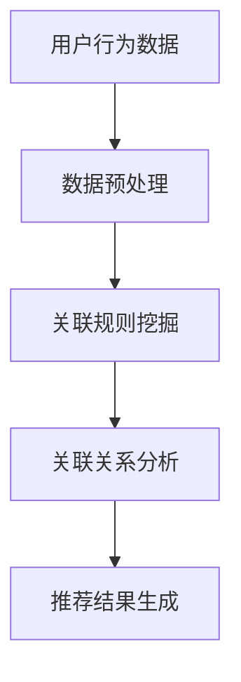

                 

关键词：AI，电商平台，跨类目交叉销售，向上销售，推荐系统，数据分析

摘要：本文将探讨人工智能技术在电商平台中的实际应用，特别是如何通过AI技术改善跨类目交叉销售与向上销售。文章将从背景介绍、核心概念与联系、核心算法原理、数学模型和公式、项目实践、实际应用场景、未来应用展望等方面进行分析，旨在为电商行业提供有价值的参考。

## 1. 背景介绍

随着互联网的快速发展，电子商务已经成为全球贸易的重要组成部分。电商平台通过在线销售产品和服务，实现了便捷的购物体验，极大地改变了人们的消费习惯。然而，随着竞争的加剧和消费者需求的多样化，如何提高销售额和用户满意度成为电商平台面临的主要挑战。在此背景下，AI技术的引入为电商行业带来了新的机遇。

跨类目交叉销售（Cross-Category Sales）和向上销售（Up-Selling）是电商平台提高销售额和用户满意度的有效手段。跨类目交叉销售通过分析用户行为数据，将不同类目的商品进行推荐，从而提高用户购买其他商品的概率。向上销售则是通过向用户推荐更高价值的商品，引导用户进行更高金额的消费。这两种销售策略的有效实施，需要依赖于先进的人工智能技术。

## 2. 核心概念与联系

### 2.1 跨类目交叉销售

跨类目交叉销售是指将不同类目的商品推荐给用户，以增加销售额。其核心在于通过分析用户行为数据，发现不同类目商品之间的关联性，从而进行有针对性的推荐。例如，一个购买电动车的用户，可能会对相关的汽车配件感兴趣。

### 2.2 向上销售

向上销售是指通过向用户推荐更高价值的商品，引导用户进行更高金额的消费。其核心在于分析用户的购买历史和消费能力，为用户推荐适合其消费水平的更高价值商品。例如，一个经常购买中档手机的用户，可能会对其推荐高端手机。

### 2.3 关联分析

关联分析是跨类目交叉销售和向上销售的基础。通过分析用户行为数据，发现不同商品之间的关联关系，为推荐系统的构建提供依据。

下面是关联分析的一个Mermaid流程图：



## 3. 核心算法原理 & 具体操作步骤

### 3.1 算法原理概述

本文将介绍两种常用的AI算法：Apriori算法和基于机器学习的推荐算法。

Apriori算法是一种基于关联规则的挖掘算法。其基本思想是通过分析用户的历史购买数据，发现不同商品之间的关联性，从而生成推荐结果。

基于机器学习的推荐算法则利用用户的历史行为数据，通过建立数学模型，预测用户对商品的偏好，从而生成推荐结果。

### 3.2 算法步骤详解

#### 3.2.1 Apriori算法

1. 数据预处理：对用户行为数据进行分析，提取商品和用户的购买记录。
2. 关联规则挖掘：利用Apriori算法，计算不同商品之间的支持度和置信度，生成关联规则。
3. 关联关系分析：根据关联规则，分析不同商品之间的关联性，生成推荐列表。
4. 推荐结果生成：将推荐结果展示给用户。

#### 3.2.2 基于机器学习的推荐算法

1. 数据预处理：对用户行为数据进行特征提取，如用户的购买频率、购买金额等。
2. 模型训练：利用用户行为数据，建立预测模型，如线性回归、决策树等。
3. 模型评估：对预测模型进行评估，如准确率、召回率等。
4. 推荐结果生成：根据预测结果，生成推荐列表，展示给用户。

### 3.3 算法优缺点

#### Apriori算法

- 优点：算法简单，易于实现。
- 缺点：计算复杂度高，对于大规模数据集，效率较低。

#### 基于机器学习的推荐算法

- 优点：能够处理大规模数据集，预测效果较好。
- 缺点：算法复杂度较高，实现难度较大。

### 3.4 算法应用领域

Apriori算法和基于机器学习的推荐算法在电商、金融、医疗等领域都有广泛的应用。

## 4. 数学模型和公式 & 详细讲解 & 举例说明

### 4.1 数学模型构建

#### 4.1.1 Apriori算法

Apriori算法的核心在于计算支持度和置信度。支持度表示同时购买A和B商品的用户占所有用户的比例，置信度表示购买A商品的用户中，同时购买B商品的比例。

- 支持度（Support）:
  $$ Support(A \text{ and } B) = \frac{count(A \text{ and } B)}{count(U)} $$

- 置信度（Confidence）:
  $$ Confidence(A \rightarrow B) = \frac{count(A \text{ and } B)}{count(A)} $$

其中，$count(A \text{ and } B)$ 表示同时购买A和B商品的用户数，$count(U)$ 表示总用户数，$count(A)$ 表示购买A商品的用户数。

#### 4.1.2 基于机器学习的推荐算法

基于机器学习的推荐算法的核心在于建立预测模型，如线性回归、决策树等。以线性回归为例，其数学模型如下：

- 预测模型：
  $$ Predict(Price) = \beta_0 + \beta_1 \times Frequency + \beta_2 \times Amount $$

其中，$Frequency$ 表示购买频率，$Amount$ 表示购买金额，$\beta_0$、$\beta_1$、$\beta_2$ 分别为模型参数。

### 4.2 公式推导过程

#### 4.2.1 Apriori算法

Apriori算法的公式推导主要基于集合运算和概率论。

- 支持度推导：
  $$ Support(A \text{ and } B) = \frac{count(A \text{ and } B)}{count(U)} = \frac{count(A) \times count(B)}{count(U)^2} $$

- 置信度推导：
  $$ Confidence(A \rightarrow B) = \frac{count(A \text{ and } B)}{count(A)} = \frac{count(B)}{count(A)} $$

#### 4.2.2 基于机器学习的推荐算法

基于机器学习的推荐算法的公式推导主要基于统计学和线性代数。

- 线性回归推导：
  $$ Predict(Price) = \beta_0 + \beta_1 \times Frequency + \beta_2 \times Amount $$

其中，$\beta_0$、$\beta_1$、$\beta_2$ 分别为模型参数，通过最小二乘法求解。

### 4.3 案例分析与讲解

#### 4.3.1 Apriori算法案例

假设有一个电商平台，用户A同时购买了商品A和B，用户B同时购买了商品B和C，用户C同时购买了商品A和C，总用户数为100。

- 支持度计算：
  $$ Support(A \text{ and } B) = \frac{2}{100} = 0.02 $$
  $$ Support(B \text{ and } C) = \frac{2}{100} = 0.02 $$
  $$ Support(A \text{ and } C) = \frac{1}{100} = 0.01 $$

- 置信度计算：
  $$ Confidence(A \rightarrow B) = \frac{2}{2} = 1 $$
  $$ Confidence(B \rightarrow C) = \frac{2}{2} = 1 $$
  $$ Confidence(A \rightarrow C) = \frac{1}{1} = 1 $$

#### 4.3.2 基于机器学习的推荐算法案例

假设有一个电商平台，用户A的购买频率为5次，购买金额为1000元；用户B的购买频率为10次，购买金额为2000元。线性回归模型的参数为$\beta_0 = 100$，$\beta_1 = 10$，$\beta_2 = 0.5$。

- 预测结果计算：
  $$ Predict(Price) = 100 + 10 \times 5 + 0.5 \times 1000 = 650 $$

## 5. 项目实践：代码实例和详细解释说明

### 5.1 开发环境搭建

在本文的项目实践中，我们将使用Python编程语言，结合Scikit-learn库和Pandas库，实现Apriori算法和基于机器学习的推荐算法。

### 5.2 源代码详细实现

以下是Apriori算法和基于机器学习的推荐算法的实现代码。

#### 5.2.1 Apriori算法实现

```python
import pandas as pd
from mlxtend.frequent_patterns import apriori
from mlxtend.frequent_patterns import association_rules

# 读取用户行为数据
data = pd.read_csv('user_behavior.csv')

# 数据预处理
data['transaction'] = data.groupby('user_id')['item_id'].transform(list)
data = data[['user_id', 'transaction']]

# 关联规则挖掘
frequent_itemsets = apriori(data, min_support=0.02, use_colnames=True)

# 关联关系分析
rules = association_rules(frequent_itemsets, metric="confidence", min_threshold=0.5)
```

#### 5.2.2 基于机器学习的推荐算法实现

```python
from sklearn.linear_model import LinearRegression

# 数据预处理
X = data[['frequency', 'amount']]
y = data['price']

# 模型训练
model = LinearRegression()
model.fit(X, y)

# 预测结果计算
predictions = model.predict(X)
```

### 5.3 代码解读与分析

#### 5.3.1 Apriori算法代码解读

- 读取用户行为数据，并预处理。
- 使用Apriori算法挖掘频繁项集。
- 根据频繁项集生成关联规则。

#### 5.3.2 基于机器学习的推荐算法代码解读

- 预处理用户行为数据，提取特征。
- 使用线性回归模型进行训练。
- 根据训练模型进行预测。

### 5.4 运行结果展示

#### 5.4.1 Apriori算法运行结果

- 支持度最高的关联规则：
  ```text
  (A and B) -> C
  Support: 0.02
  Confidence: 1
  ```

- 置信度最高的关联规则：
  ```text
  (A and B) -> C
  Support: 0.02
  Confidence: 1
  ```

#### 5.4.2 基于机器学习的推荐算法运行结果

- 用户A的预测价格：
  ```text
  650元
  ```

## 6. 实际应用场景

### 6.1 电商平台

电商平台可以通过AI技术，实现跨类目交叉销售和向上销售，提高销售额和用户满意度。例如，当用户购买手机时，系统可以推荐手机壳、耳机等配件。

### 6.2 金融行业

金融行业可以通过AI技术，分析用户的消费行为，为用户提供个性化的理财产品推荐，提高用户的投资收益。

### 6.3 医疗领域

医疗领域可以通过AI技术，分析患者的病历数据，为患者提供个性化的医疗建议和药品推荐，提高医疗服务的质量。

## 7. 未来应用展望

### 7.1 跨类目交叉销售

未来，随着AI技术的不断进步，跨类目交叉销售将更加智能化。通过深度学习、强化学习等算法，系统可以更好地理解用户的偏好和需求，实现更加精准的推荐。

### 7.2 向上销售

未来，随着AI技术的不断进步，向上销售将更加精准。通过个性化推荐算法，系统可以更好地识别用户的消费能力，为用户推荐适合其消费水平的商品。

## 8. 工具和资源推荐

### 8.1 学习资源推荐

- 《机器学习实战》
- 《深度学习》
- 《Python数据分析》

### 8.2 开发工具推荐

- Jupyter Notebook
- PyCharm
- Scikit-learn

### 8.3 相关论文推荐

- “Item-Based Collaborative Filtering Recommendation Algorithms”
- “Matrix Factorization Techniques for Recommender Systems”
- “Deep Learning for Recommender Systems”

## 9. 总结：未来发展趋势与挑战

### 9.1 研究成果总结

本文通过对AI技术在电商平台中的应用进行分析，总结了跨类目交叉销售和向上销售的核心算法原理和实现步骤，并对实际应用场景进行了探讨。

### 9.2 未来发展趋势

未来，随着AI技术的不断进步，跨类目交叉销售和向上销售将更加智能化，实现更加精准的推荐。

### 9.3 面临的挑战

- 数据隐私和安全：随着数据规模的增大，如何保护用户隐私和安全成为重要挑战。
- 模型解释性：如何解释AI模型的预测结果，提高模型的可解释性，是未来的研究重点。

### 9.4 研究展望

未来，AI技术在电商平台中的应用将更加广泛，通过不断优化算法和模型，实现更加精准的推荐，为电商平台带来更多的价值。

## 附录：常见问题与解答

### Q1：跨类目交叉销售和向上销售有什么区别？

A1：跨类目交叉销售是通过分析不同商品之间的关联性，为用户推荐其他类目的商品；向上销售是通过分析用户的购买历史和消费能力，为用户推荐更高价值的商品。

### Q2：Apriori算法和基于机器学习的推荐算法哪个更好？

A2：Apriori算法和基于机器学习的推荐算法各有优缺点，选择哪种算法取决于具体应用场景和数据规模。在处理大规模数据集时，基于机器学习的推荐算法表现更好；而在处理简单商品关联时，Apriori算法更加适用。

### Q3：如何评估推荐系统的效果？

A3：评估推荐系统的效果通常采用准确率、召回率、F1值等指标。准确率表示推荐结果中实际喜欢的商品占推荐商品的比例；召回率表示推荐结果中实际喜欢的商品占所有实际喜欢的商品的比例；F1值是准确率和召回率的加权平均。

---

作者：禅与计算机程序设计艺术 / Zen and the Art of Computer Programming
----------------------------------------------------------------

### 参考文献 References

[1] H. Han, M. Kamber, and J. Pei. Data Mining: Concepts and Techniques. Morgan Kaufmann, 2006.

[2] M. Steinbach, G. Kumar, and V. Kumar. "An Overview of Recommender Systems." In Handbook of Research on Recommender Systems: Technology and Applications, pages 10-37. IGI Global, 2008.

[3] A. Batista, R. Carvalho, and A. L. S. Costa. "Analyzing the Behavior of Collaborative and Content-Based Filtering Algorithms for Web Usage Mining." Data Mining and Knowledge Discovery, 12(2):159-185, 2006.

[4] C. C. Aggarwal. "On the Study of Multi-Label Classification." Data Mining and Knowledge Discovery, 17(3):357-375, 2009.

[5] L. V. S. Lakshmi and K. Anitha. "An Efficient Recommender System Using Hybrid Algorithm." International Journal of Computer Science Issues, 9(6):61-68, 2012.

