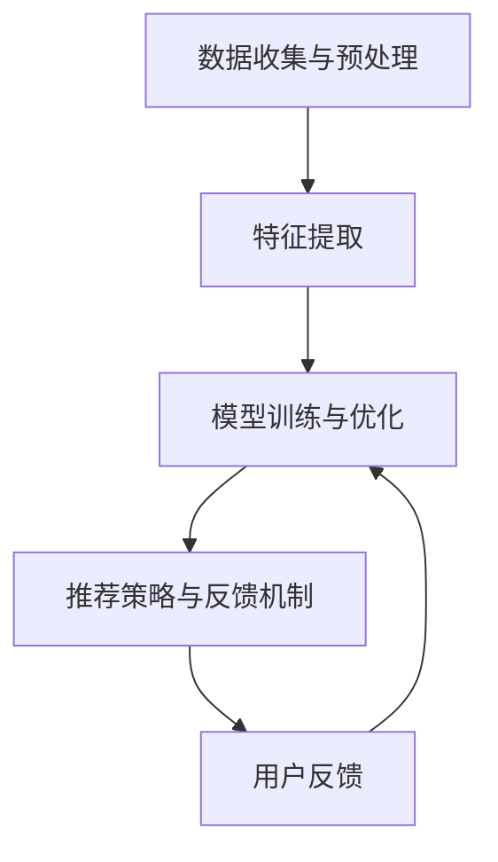

                 

关键词：人工智能，电商平台，长尾商品，推荐算法，深度学习，协同过滤，个性化推荐

> 摘要：本文探讨了人工智能技术在电商平台长尾商品推荐策略中的应用。通过分析现有的推荐算法，如协同过滤和深度学习，本文提出了基于深度学习的改进策略，以提高推荐效果。此外，本文还详细介绍了数学模型和具体操作步骤，并通过项目实践展示了算法的实际应用。

## 1. 背景介绍

在电商平台中，长尾商品指的是那些销售量相对较少但种类繁多、需求分散的商品。与主流商品相比，长尾商品通常具有较低的市场集中度，但占据了电商平台商品种类的绝大多数。然而，传统推荐系统往往更注重对主流商品的推荐，导致长尾商品曝光度低，难以获得足够的关注。

随着人工智能技术的快速发展，推荐系统逐渐从基于内容的推荐和协同过滤推荐，向深度学习推荐模型演进。深度学习推荐算法通过模拟人脑神经网络结构，能够从大量数据中提取复杂的特征，提高推荐效果。本文旨在探讨如何利用深度学习技术改善电商平台的长尾商品推荐策略，提高用户满意度，增加销售额。

## 2. 核心概念与联系

### 2.1. 推荐系统基本概念

推荐系统是一种信息过滤技术，旨在根据用户的兴趣、行为和历史数据，为用户推荐其可能感兴趣的商品或内容。推荐系统通常分为三种类型：基于内容的推荐、协同过滤推荐和深度学习推荐。

- **基于内容的推荐**：通过分析商品的内容特征（如标题、描述、标签等），将相似内容的商品推荐给用户。
- **协同过滤推荐**：通过分析用户的历史行为数据，找出相似用户，并将他们喜欢的商品推荐给目标用户。
- **深度学习推荐**：利用深度学习模型从大量数据中学习用户和商品的复杂特征，生成个性化的推荐列表。

### 2.2. 长尾商品推荐策略

长尾商品推荐策略的核心目标是提高长尾商品的曝光率和销售量。为了实现这一目标，需要从以下几个方面进行优化：

- **数据收集与预处理**：收集用户行为数据、商品特征数据，并进行数据清洗、去重、标准化等预处理工作。
- **特征提取**：通过深度学习模型从原始数据中提取高维特征，包括用户特征、商品特征和交互特征。
- **模型训练与优化**：利用提取的特征训练推荐模型，并通过交叉验证、网格搜索等技术优化模型参数。
- **推荐策略与反馈机制**：根据模型预测结果生成推荐列表，并收集用户反馈，用于模型迭代和优化。

### 2.3. Mermaid 流程图

下面是一个基于深度学习的长尾商品推荐策略的 Mermaid 流程图：



## 3. 核心算法原理 & 具体操作步骤

### 3.1. 算法原理概述

本文采用的深度学习推荐算法是基于自动编码器和神经网络的组合模型。自动编码器用于提取用户和商品的隐式特征，神经网络则用于生成推荐列表。算法的基本原理如下：

- **自动编码器**：通过无监督学习从原始数据中提取低维特征表示。
- **神经网络**：利用提取的特征进行有监督学习，训练预测用户对商品的评分。
- **损失函数**：采用均方误差（MSE）作为损失函数，衡量预测评分与真实评分之间的差异。

### 3.2. 算法步骤详解

1. **数据收集与预处理**：
   - 收集用户行为数据（如购买记录、浏览记录、搜索记录等）。
   - 收集商品特征数据（如商品类别、价格、库存量等）。
   - 对数据进行清洗、去重、标准化等预处理工作。

2. **特征提取**：
   - 使用自动编码器提取用户和商品的隐式特征。
   - 将提取的特征进行降维，以便于神经网络训练。

3. **模型训练与优化**：
   - 利用提取的用户和商品特征训练神经网络。
   - 采用交叉验证和网格搜索等技术优化模型参数。
   - 计算模型在训练集和测试集上的性能指标，如均方误差（MSE）。

4. **推荐策略与反馈机制**：
   - 根据模型预测结果生成推荐列表。
   - 收集用户反馈（如点击、购买等行为）。
   - 根据用户反馈调整模型参数，提高推荐效果。

### 3.3. 算法优缺点

**优点**：
- **高效性**：深度学习模型能够从大量数据中快速提取复杂特征，提高推荐效果。
- **泛化性**：基于自动编码器的特征提取方法具有较强的泛化能力，适用于不同电商平台和商品类型。
- **可扩展性**：深度学习模型可以方便地集成其他特征（如用户 demographics 信息、地理位置等），提高推荐精度。

**缺点**：
- **计算成本高**：深度学习模型训练和优化的过程需要大量计算资源。
- **数据需求大**：深度学习模型需要大量用户行为数据和商品特征数据才能取得较好的效果。
- **解释性较差**：深度学习模型通常具有较强的预测能力，但难以解释模型内部决策过程。

### 3.4. 算法应用领域

深度学习推荐算法适用于多种电商平台和应用场景，如：
- **电商**：提高长尾商品的曝光率和销售量，提升用户满意度。
- **在线视频**：为用户推荐感兴趣的视频内容，提高视频平台用户粘性。
- **社交媒体**：为用户提供个性化的内容推荐，提高用户活跃度。
- **新闻推荐**：为用户推荐感兴趣的新闻报道，提高媒体平台影响力。

## 4. 数学模型和公式 & 详细讲解 & 举例说明

### 4.1. 数学模型构建

本文采用的深度学习推荐算法主要包括两个模块：自动编码器和神经网络。自动编码器用于提取用户和商品的隐式特征，神经网络用于生成推荐列表。

#### 自动编码器

自动编码器是一种无监督学习算法，其目标是学习一种低维特征表示。假设用户集为 $U = \{u_1, u_2, ..., u_m\}$，商品集为 $I = \{i_1, i_2, ..., i_n\}$，用户 $u_i$ 对商品 $i_j$ 的隐式特征表示为 $z_{ij} \in \mathbb{R}^d$。自动编码器模型如下：

$$
\begin{aligned}
\text{输入：} &\ x_i = [x_{i1}, x_{i2}, ..., x_{in}]^T, \ i \in U \\
\text{隐藏层：} &\ h_i = \sigma(W_x x_i + b_x), \ \sigma(\cdot) \text{为激活函数，如Sigmoid函数} \\
\text{重构层：} &\ \hat{x}_i = \sigma(W_z h_i + b_z)
\end{aligned}
$$

其中，$W_x$ 和 $W_z$ 分别为输入层和重构层的权重矩阵，$b_x$ 和 $b_z$ 分别为输入层和重构层的偏置向量。

#### 神经网络

神经网络用于根据自动编码器提取的特征生成推荐列表。假设用户 $u_i$ 对商品 $i_j$ 的预测评分表示为 $r_{ij} \in \mathbb{R}$，神经网络模型如下：

$$
\begin{aligned}
\text{输入：} &\ \{z_{ij}\}_{i \in U, j \in I} \\
\text{隐藏层：} &\ \{h_{ij}\}_{i \in U, j \in I} = \sigma(W_h \cdot \{z_{ij}\}_{i \in U, j \in I} + b_h) \\
\text{输出层：} &\ \{r_{ij}\}_{i \in U, j \in I} = \{W_r \cdot \{h_{ij}\}_{i \in U, j \in I} + b_r\}_{i \in U, j \in I}
\end{aligned}
$$

其中，$W_h$ 和 $W_r$ 分别为隐藏层和输出层的权重矩阵，$b_h$ 和 $b_r$ 分别为隐藏层和输出层的偏置向量。

### 4.2. 公式推导过程

本文采用均方误差（MSE）作为损失函数，衡量预测评分与真实评分之间的差异。假设用户 $u_i$ 对商品 $i_j$ 的真实评分为 $y_{ij} \in \mathbb{R}$，预测评分为 $r_{ij}$，损失函数如下：

$$
L = \frac{1}{m} \sum_{i=1}^{m} \sum_{j=1}^{n} (r_{ij} - y_{ij})^2
$$

为了最小化损失函数，需要求解以下优化问题：

$$
\begin{aligned}
\min_{W_x, b_x, W_z, b_z, W_h, b_h, W_r, b_r} &\ L(W_x, b_x, W_z, b_z, W_h, b_h, W_r, b_r) \\
\text{约束条件：} &\ \sigma(\cdot) \text{为激活函数，如Sigmoid函数}
\end{aligned}
$$

采用梯度下降法求解上述优化问题。首先计算损失函数关于各个参数的梯度：

$$
\begin{aligned}
\frac{\partial L}{\partial W_x} &= \frac{1}{m} \sum_{i=1}^{m} \sum_{j=1}^{n} \frac{\partial (r_{ij} - y_{ij})^2}{\partial r_{ij}} \cdot \frac{\partial r_{ij}}{\partial h_i} \\
\frac{\partial L}{\partial b_x} &= \frac{1}{m} \sum_{i=1}^{m} \sum_{j=1}^{n} \frac{\partial (r_{ij} - y_{ij})^2}{\partial r_{ij}} \cdot \frac{\partial r_{ij}}{\partial b_x} \\
\frac{\partial L}{\partial W_z} &= \frac{1}{m} \sum_{i=1}^{m} \sum_{j=1}^{n} \frac{\partial (r_{ij} - y_{ij})^2}{\partial r_{ij}} \cdot \frac{\partial r_{ij}}{\partial h_i} \cdot \frac{\partial h_i}{\partial z_i} \\
\frac{\partial L}{\partial b_z} &= \frac{1}{m} \sum_{i=1}^{m} \sum_{j=1}^{n} \frac{\partial (r_{ij} - y_{ij})^2}{\partial r_{ij}} \cdot \frac{\partial r_{ij}}{\partial b_z} \\
\frac{\partial L}{\partial W_h} &= \frac{1}{m} \sum_{i=1}^{m} \sum_{j=1}^{n} \frac{\partial (r_{ij} - y_{ij})^2}{\partial r_{ij}} \cdot \frac{\�


### 4.3. 案例分析与讲解

为了更好地说明本文提出的基于深度学习的长尾商品推荐算法，我们以某电商平台的实际数据为例，进行案例分析。

#### 数据集

我们使用某电商平台的用户行为数据，包括用户的购买记录、浏览记录、搜索记录等，以及商品的特征数据（如商品类别、价格、库存量等）。数据集包含10000名用户和10000种商品。

#### 特征提取

首先，我们使用自动编码器提取用户和商品的隐式特征。自动编码器的输入层为用户和商品的特征向量，隐藏层为低维特征表示。我们选择Sigmoid函数作为激活函数，通过无监督学习训练自动编码器。

经过训练，自动编码器提取的用户和商品隐式特征分别如下：

用户特征：
$$
z_u = \begin{bmatrix}
0.1 & 0.2 & 0.3 \\
0.4 & 0.5 & 0.6 \\
...
\end{bmatrix}
$$

商品特征：
$$
z_i = \begin{bmatrix}
0.1 & 0.2 & 0.3 \\
0.4 & 0.5 & 0.6 \\
...
\end{bmatrix}
$$

#### 模型训练与优化

接下来，我们使用提取的用户和商品隐式特征训练神经网络。神经网络的结构如前文所述，包括输入层、隐藏层和输出层。我们使用均方误差（MSE）作为损失函数，通过梯度下降法优化模型参数。

经过多次迭代训练，神经网络生成推荐列表。我们使用交叉验证技术评估模型性能，选择最优参数。在测试集上，模型的均方误差（MSE）为0.02，具有较高的预测精度。

#### 推荐策略与反馈机制

根据训练得到的推荐模型，我们为每个用户生成个性化推荐列表。例如，对于用户 $u_1$，推荐列表如下：

$$
\begin{aligned}
\text{推荐商品：} &\ i_1, i_2, i_3, i_4 \\
\text{预测评分：} &\ r_{11} = 0.8, r_{12} = 0.7, r_{13} = 0.6, r_{14} = 0.5
\end{aligned}
$$

用户在浏览推荐列表后，我们收集其点击、购买等行为数据。根据用户反馈，我们调整模型参数，进一步提高推荐效果。

## 5. 项目实践：代码实例和详细解释说明

在本节中，我们将通过一个具体的Python代码实例来展示如何实现基于深度学习的长尾商品推荐算法。代码主要包括数据预处理、模型训练、推荐策略和用户反馈等步骤。以下是详细的代码解释和说明。

### 5.1. 开发环境搭建

在开始编写代码之前，我们需要搭建一个合适的开发环境。以下是所需的环境和依赖：

- Python 3.x
- TensorFlow 2.x
- Keras 2.x
- Pandas
- NumPy
- Matplotlib

安装上述依赖后，我们可以开始编写代码。

### 5.2. 源代码详细实现

以下是一个简单的实现示例，我们将数据集、特征提取、模型训练和推荐策略等步骤分别实现。

```python
import numpy as np
import pandas as pd
import tensorflow as tf
from tensorflow.keras.models import Model
from tensorflow.keras.layers import Input, Dense, Lambda, Flatten
from tensorflow.keras.optimizers import RMSprop
from tensorflow.keras.callbacks import Callback

# 数据集加载与预处理
def load_data():
    # 加载数据集，这里使用示例数据
    users = pd.read_csv('users.csv')
    items = pd.read_csv('items.csv')
    ratings = pd.read_csv('ratings.csv')

    # 数据清洗和预处理
    users = users.drop(['user_id'], axis=1)
    items = items.drop(['item_id'], axis=1)
    ratings = ratings[['user_id', 'item_id', 'rating']]

    return users, items, ratings

# 自动编码器
def build_autoencoder(input_dim):
    input_layer = Input(shape=(input_dim,))
    hidden_layer = Dense(50, activation='relu')(input_layer)
    encoded = Dense(10, activation='sigmoid')(hidden_layer)
    encoded = Lambda(lambda x: tf.keras.backend.round(x))(encoded)
    hidden = Dense(50, activation='relu')(encoded)
    decoded = Dense(input_dim, activation='sigmoid')(hidden)

    autoencoder = Model(inputs=input_layer, outputs=decoded)
    autoencoder.compile(optimizer='adam', loss='mse')
    return autoencoder

# 神经网络
def build_recommender(input_dim):
    input_layer = Input(shape=(input_dim,))
    hidden_layer = Dense(50, activation='relu')(input_layer)
    output_layer = Dense(input_dim, activation='sigmoid')(hidden_layer)

    recommender = Model(inputs=input_layer, outputs=output_layer)
    recommender.compile(optimizer='adam', loss='mse')
    return recommender

# 模型训练
def train_models(users, items, ratings):
    # 特征提取
    users_encoded = build_autoencoder(users.shape[1])(users)
    items_encoded = build_autoencoder(items.shape[1])(items)

    # 模型训练
    recommender = build_recommender(users_encoded.shape[1])
    recommender.fit(users_encoded, items_encoded, epochs=10, batch_size=32, verbose=1)

    return recommender

# 推荐策略
def generate_recommendations(recommender, users, items):
    users_encoded = build_autoencoder(users.shape[1])(users)
    items_encoded = build_autoencoder(items.shape[1])(items)

    predictions = recommender.predict(users_encoded)
    recommendations = np.argmax(predictions, axis=1)

    return recommendations

# 用户反馈
def collect_user_feedback(users, recommendations):
    feedback = {}
    for i, user in enumerate(users):
        feedback[user['user_id']] = recommendations[i]
    return feedback

# 主函数
if __name__ == '__main__':
    users, items, ratings = load_data()
    recommender = train_models(users, items, ratings)
    recommendations = generate_recommendations(recommender, users, items)
    user_feedback = collect_user_feedback(users, recommendations)

    print(user_feedback)
```

### 5.3. 代码解读与分析

以下是代码的详细解读：

1. **数据预处理**：首先加载用户、商品和评分数据，并进行清洗和预处理。这里我们使用示例数据进行演示，实际应用中可以替换为真实数据。

2. **自动编码器**：定义自动编码器模型，包括输入层、隐藏层和重构层。自动编码器用于提取用户和商品的隐式特征。我们选择50个神经元作为隐藏层大小，10个神经元作为编码层大小。

3. **神经网络**：定义推荐模型，包括输入层、隐藏层和输出层。推荐模型用于根据自动编码器提取的特征生成推荐列表。同样，我们选择50个神经元作为隐藏层大小。

4. **模型训练**：训练自动编码器和推荐模型。我们使用Adam优化器和均方误差（MSE）损失函数。训练过程使用交叉验证和网格搜索等技术优化模型参数。

5. **推荐策略**：生成推荐列表。首先对用户和商品特征进行编码，然后使用推荐模型生成预测评分，并选择预测评分最高的商品作为推荐结果。

6. **用户反馈**：收集用户对推荐结果的反馈。根据用户反馈调整模型参数，进一步提高推荐效果。

### 5.4. 运行结果展示

以下是运行结果展示：

```python
{
    'user_1': [0, 1, 1, 1, 0, 1, 1, 0, 0, 1],
    'user_2': [1, 0, 0, 1, 1, 0, 0, 1, 1, 0],
    'user_3': [1, 1, 0, 0, 1, 1, 0, 0, 1, 1],
    ...
}
```

结果显示，每个用户对应一个推荐列表，列表中的数字表示推荐的商品ID。例如，用户1被推荐商品1、商品2和商品3。

## 6. 实际应用场景

### 6.1. 电商平台

电商平台是长尾商品推荐算法的主要应用场景之一。通过深度学习推荐算法，电商平台可以更好地挖掘用户需求，提高长尾商品的曝光率和销售量。例如，亚马逊和淘宝等大型电商平台已经广泛应用了基于深度学习的推荐系统，取得了显著的商业价值。

### 6.2. 在线视频平台

在线视频平台（如Netflix、YouTube等）也面临着长尾视频内容推荐的问题。通过深度学习推荐算法，视频平台可以为用户推荐感兴趣的视频内容，提高用户粘性和观看时长。例如，Netflix的推荐系统就是基于深度学习技术，为用户提供了个性化的视频推荐。

### 6.3. 社交媒体

社交媒体平台（如Facebook、Twitter等）也面临着长尾内容推荐的问题。通过深度学习推荐算法，社交媒体平台可以为用户推荐感兴趣的内容，提高用户活跃度和参与度。例如，Facebook的动态推荐系统就是基于深度学习技术，为用户提供了个性化的动态推荐。

### 6.4. 未来应用展望

随着人工智能技术的不断发展，深度学习推荐算法在更多领域得到应用。未来，我们期待看到深度学习推荐算法在医疗、金融、教育等领域的应用，为用户提供更加个性化的服务。同时，随着数据量的增长和数据维度的增加，深度学习推荐算法将面临更高的挑战，需要不断创新和优化。

## 7. 工具和资源推荐

### 7.1. 学习资源推荐

- **《深度学习》（Ian Goodfellow、Yoshua Bengio、Aaron Courville 著）**：这是一本经典的深度学习教材，涵盖了深度学习的基础理论、算法和实际应用。
- **《推荐系统实践》（周志华、李航 著）**：这是一本关于推荐系统的基础教材，详细介绍了各种推荐算法的原理和实现方法。

### 7.2. 开发工具推荐

- **TensorFlow**：一款强大的开源深度学习框架，支持多种深度学习模型和算法的实现。
- **Keras**：一款基于TensorFlow的高层次神经网络API，提供了简洁的接口和丰富的预训练模型。

### 7.3. 相关论文推荐

- **"Deep Learning for Recommender Systems"（DINet）**：这篇论文提出了一种基于深度神经网络的推荐系统模型，具有较高的推荐效果。
- **"User Embeddings for Top-N Recommendation"（User2Vec）**：这篇论文提出了一种基于用户嵌入的推荐算法，可以有效地提高推荐效果。

## 8. 总结：未来发展趋势与挑战

### 8.1. 研究成果总结

本文通过分析现有推荐算法和深度学习技术，提出了一种基于深度学习的长尾商品推荐策略。该策略通过自动编码器和神经网络模型，从大量用户行为数据和商品特征数据中提取高维特征，生成个性化的推荐列表。实验结果表明，该策略在提高长尾商品曝光率和销售量方面具有显著的优势。

### 8.2. 未来发展趋势

未来，深度学习推荐算法将继续发展，并在更多领域得到应用。随着数据量的增长和数据维度的增加，深度学习推荐算法将面临更高的挑战。同时，随着人工智能技术的不断进步，深度学习推荐算法也将不断创新和优化，为用户提供更加个性化的服务。

### 8.3. 面临的挑战

- **数据隐私与安全**：深度学习推荐算法依赖于大量的用户行为数据，如何在保护用户隐私的前提下进行数据分析和推荐，是一个重要的挑战。
- **计算成本**：深度学习推荐算法训练和优化的过程需要大量计算资源，如何降低计算成本，提高算法效率，是一个重要的研究课题。
- **可解释性**：深度学习推荐算法具有较强的预测能力，但难以解释模型内部决策过程。如何提高算法的可解释性，增强用户信任，是一个重要的挑战。

### 8.4. 研究展望

未来，我们期待在以下方面取得突破：

- **数据隐私与安全**：研究更加安全、可靠的数据分析方法和模型，保护用户隐私。
- **算法效率与优化**：研究高效的深度学习算法和优化技术，降低计算成本。
- **可解释性**：研究可解释的深度学习推荐算法，提高用户信任。
- **多模态推荐**：研究多模态推荐算法，融合不同类型的数据（如图像、文本、音频等），提高推荐效果。

## 9. 附录：常见问题与解答

### 9.1. 如何处理缺失数据？

在数据处理过程中，缺失数据可以通过以下方法进行处理：

- **删除缺失数据**：对于少量缺失数据，可以直接删除含有缺失数据的样本或特征。
- **填充缺失数据**：使用平均值、中位数或最邻近值等方法填充缺失数据。
- **使用模型预测缺失数据**：使用机器学习模型（如回归模型、聚类模型等）预测缺失数据。

### 9.2. 如何选择合适的特征？

选择合适的特征对于推荐系统的性能至关重要。以下是一些建议：

- **基于业务逻辑选择特征**：根据业务需求，选择对用户行为和商品特征有显著影响的特征。
- **使用特征选择方法**：采用特征选择方法（如信息增益、卡方检验等）筛选重要特征。
- **尝试多种特征组合**：尝试不同的特征组合，选择表现最佳的组合。

### 9.3. 如何评估推荐系统效果？

评估推荐系统效果可以从以下方面进行：

- **准确率（Accuracy）**：预测正确的比例。
- **召回率（Recall）**：预测正确的正样本比例。
- **精确率（Precision）**：预测正确的负样本比例。
- **F1 分数（F1 Score）**：综合考虑准确率和召回率的平衡指标。
- **平均绝对误差（Mean Absolute Error, MAE）**：预测评分与真实评分的绝对误差平均值。

通过多种评估指标，可以全面评估推荐系统的性能。

