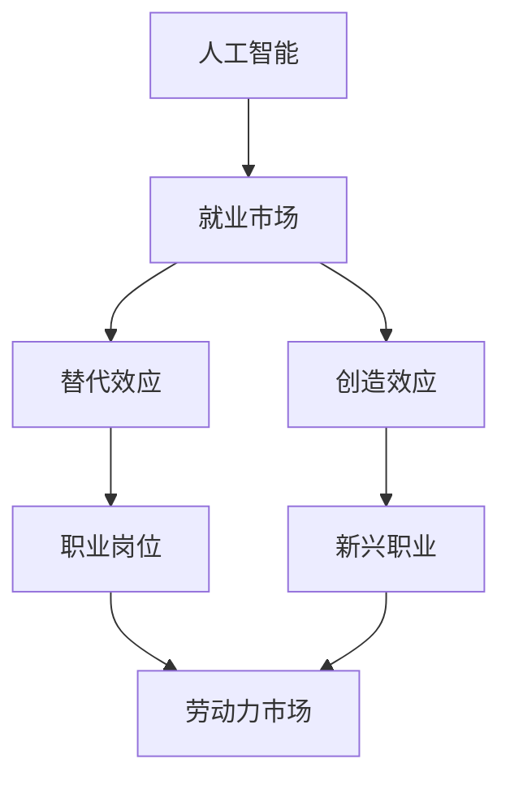

                 

关键词：人工智能，就业，替代，创造，机遇，挑战，技术进步

摘要：本文深入探讨了人工智能（AI）技术对就业市场的影响。通过分析AI如何替代传统工作岗位、创造新岗位，以及它带来的机遇与挑战，探讨了AI技术发展对就业市场的深远影响，并为未来的研究和政策制定提供了参考。

## 1. 背景介绍

随着人工智能技术的快速发展，人们对于AI在各个领域的应用前景充满期待。然而，与此同时，也引发了对就业市场的广泛关注。AI技术是否会替代人类工作，进而引发大规模失业？还是它能够创造出新的工作岗位，促进就业市场的繁荣？这一系列问题引起了学术界、业界和政策制定者的关注。

### 1.1 人工智能的发展历程

人工智能（Artificial Intelligence，简称AI）是一门由计算机科学、统计学、神经科学、认知科学等多学科交叉的综合性学科。AI的研究可以追溯到20世纪50年代，从最初的符号主义、知识表示到现代的数据驱动方法，AI技术经历了多次变革。

- **符号主义**：早期的AI研究主要集中在符号主义方法，即通过编程实现逻辑推理和知识表示。
- **知识表示**：随着专家系统的出现，AI开始尝试将人类专家的知识转化为计算机程序。
- **基于数据的机器学习**：21世纪初，数据驱动的机器学习方法逐渐成为主流，深度学习、强化学习等技术的出现使得AI在图像识别、语音识别等领域取得了重大突破。
- **现代AI**：当前，AI技术已经广泛应用于自动驾驶、智能家居、医疗诊断等领域，AI的智能化水平和应用范围不断提升。

### 1.2 AI对就业市场的影响

AI技术的快速发展不仅推动了科技创新，也对就业市场产生了深远的影响。一方面，AI可能替代一些传统工作岗位，引发就业压力；另一方面，AI也有望创造新的就业机会，促进劳动力市场的转型。本文将从以下几个方面探讨AI对就业市场的影响：

- **替代效应**：分析AI技术如何影响不同行业和岗位的就业情况。
- **创造效应**：探讨AI技术带来的新兴职业和就业机会。
- **机遇与挑战**：分析AI技术带来的机遇和挑战，以及如何应对这些挑战。

## 2. 核心概念与联系

为了更好地理解AI对就业市场的影响，我们首先需要了解一些核心概念和它们之间的联系。以下是一个简化的Mermaid流程图，展示了AI与就业市场之间的关键关系。



### 2.1 人工智能与就业市场

人工智能技术的发展对就业市场的影响可以从多个角度进行理解。AI技术可以通过自动化和智能化手段提高生产效率，从而替代某些传统工作岗位。例如，自动化系统在制造业中的应用已经显著减少了人力需求。同时，AI技术也在创造新的就业机会，如数据科学家、机器学习工程师等职位。这些新兴职业需要更高层次的专业技能，有助于提高劳动力市场的整体素质。

### 2.2 替代效应与创造效应

替代效应是指AI技术替代传统工作岗位，导致就业岗位减少的现象。替代效应的影响因行业和岗位而异。一些高度重复性和低技能的岗位更容易被自动化取代，如工厂操作员、仓库管理员等。而一些需要高度专业技能和创新能力的岗位，如医生、律师等，受到AI替代的影响相对较小。

创造效应则是指AI技术带来新的职业和就业机会。随着AI技术的应用越来越广泛，新的职业类型不断涌现。例如，AI算法工程师、AI安全专家等职位在近年来受到了广泛关注。这些新兴职业不仅满足了社会对AI技术专业人才的需求，也为劳动力市场注入了新的活力。

### 2.3 职业岗位与劳动力市场

职业岗位是就业市场的重要组成部分。AI技术的发展不仅改变了某些岗位的需求，也推动了劳动力市场的整体结构变革。一些传统岗位逐渐消失，而新兴岗位不断涌现。这种变化促使劳动力市场需要不断调整和适应，以应对AI技术带来的挑战。

## 3. 核心算法原理 & 具体操作步骤

在探讨AI对就业市场的影响时，了解一些核心算法原理和操作步骤是非常有帮助的。以下将介绍一种常见的AI算法——决策树（Decision Tree）及其在就业市场分析中的应用。

### 3.1 算法原理概述

决策树是一种常用的分类算法，通过一系列if-else规则对数据进行划分，最终得到一个分类结果。其基本原理如下：

1. **选择特征**：从所有特征中选择一个最优特征作为划分标准。
2. **划分数据**：使用所选特征对数据进行划分，生成子集。
3. **递归划分**：对每个子集重复上述步骤，直到达到终止条件（如达到最大深度或纯度）。
4. **生成树**：将划分结果整合成一棵决策树，用于预测新数据的分类。

### 3.2 算法步骤详解

1. **数据预处理**：对数据进行清洗和预处理，确保数据质量。
2. **特征选择**：使用信息增益（Information Gain）、基尼不纯度（Gini Impurity）等指标选择最优特征。
3. **划分数据**：根据所选特征将数据划分为若干子集。
4. **递归划分**：对每个子集重复特征选择和数据划分步骤，生成子决策树。
5. **生成树**：将所有子决策树整合成一棵完整的决策树，用于分类预测。

### 3.3 算法优缺点

决策树的优点包括：

- **易于理解**：决策树的解释性强，易于人类理解和解释。
- **计算效率高**：决策树的计算复杂度相对较低，适合处理大规模数据。

但决策树也有一定的缺点：

- **过拟合**：当决策树过于复杂时，容易产生过拟合现象，导致泛化能力下降。
- **对异常值敏感**：决策树对异常值较为敏感，可能导致预测结果不稳定。

### 3.4 算法应用领域

决策树在就业市场分析中可以用于预测就业岗位的需求变化、分析劳动力市场的趋势等。以下是一个简单的应用案例：

- **数据集**：某地区的就业岗位数据，包括岗位名称、职位描述、就业人数等。
- **目标**：预测未来一段时间内哪些岗位的需求将增加或减少。

通过决策树算法，可以对岗位数据进行分类，预测未来就业市场的变化趋势。这有助于政策制定者和企业更好地制定人才发展战略。

## 4. 数学模型和公式 & 详细讲解 & 举例说明

在分析AI对就业市场的影响时，数学模型和公式是不可或缺的工具。以下将介绍一个常用的数学模型——线性回归（Linear Regression），并详细讲解其构建、推导过程，并通过案例进行说明。

### 4.1 数学模型构建

线性回归模型的基本形式如下：

\[ y = \beta_0 + \beta_1 x_1 + \beta_2 x_2 + \ldots + \beta_n x_n + \epsilon \]

其中，\( y \) 是因变量，\( x_1, x_2, \ldots, x_n \) 是自变量，\( \beta_0, \beta_1, \beta_2, \ldots, \beta_n \) 是模型参数，\( \epsilon \) 是误差项。

### 4.2 公式推导过程

线性回归模型的推导过程主要包括以下步骤：

1. **损失函数**：选择损失函数来衡量模型预测值与实际值之间的差距。常用的损失函数是均方误差（Mean Squared Error，MSE）：

\[ \text{MSE} = \frac{1}{m} \sum_{i=1}^{m} (y_i - \hat{y}_i)^2 \]

其中，\( m \) 是数据样本数量，\( y_i \) 是实际值，\( \hat{y}_i \) 是预测值。

2. **最小化损失函数**：通过最小化损失函数来确定模型参数。对于线性回归模型，可以使用梯度下降（Gradient Descent）方法进行参数优化。

3. **梯度计算**：计算损失函数关于每个参数的偏导数，得到梯度：

\[ \nabla_{\beta} \text{MSE} = \frac{\partial \text{MSE}}{\partial \beta} \]

4. **迭代更新**：根据梯度更新模型参数：

\[ \beta = \beta - \alpha \nabla_{\beta} \text{MSE} \]

其中，\( \alpha \) 是学习率。

5. **收敛条件**：重复迭代过程，直到满足收敛条件（如损失函数变化小于某个阈值）。

### 4.3 案例分析与讲解

以下是一个简单的线性回归案例，用于预测某地区AI工程师的就业机会。

- **数据集**：某地区AI工程师的就业人数与地区GDP（国内生产总值）数据。
- **目标**：构建线性回归模型，预测未来某一年AI工程师的就业人数。

假设数据集如下：

| 年份 | GDP（亿元） | 就业人数 |
|------|------------|---------|
| 2018 | 1000       | 50      |
| 2019 | 1100       | 60      |
| 2020 | 1200       | 70      |
| 2021 | 1300       | 80      |

我们选择GDP作为自变量，就业人数作为因变量，构建线性回归模型。使用最小二乘法（Least Squares）求解模型参数。

1. **计算均值**：

\[ \bar{x} = \frac{1}{n} \sum_{i=1}^{n} x_i = \frac{1000 + 1100 + 1200 + 1300}{4} = 1150 \]
\[ \bar{y} = \frac{1}{n} \sum_{i=1}^{n} y_i = \frac{50 + 60 + 70 + 80}{4} = 65 \]

2. **计算协方差和方差**：

\[ S_{xy} = \sum_{i=1}^{n} (x_i - \bar{x})(y_i - \bar{y}) = (1000 - 1150)(50 - 65) + (1100 - 1150)(60 - 65) + (1200 - 1150)(70 - 65) + (1300 - 1150)(80 - 65) = -250 \]
\[ S_{xx} = \sum_{i=1}^{n} (x_i - \bar{x})^2 = (1000 - 1150)^2 + (1100 - 1150)^2 + (1200 - 1150)^2 + (1300 - 1150)^2 = 5000 \]

3. **计算回归系数**：

\[ \beta_1 = \frac{S_{xy}}{S_{xx}} = \frac{-250}{5000} = -0.05 \]
\[ \beta_0 = \bar{y} - \beta_1 \bar{x} = 65 - (-0.05 \times 1150) = 65 + 57.5 = 122.5 \]

4. **构建回归模型**：

\[ y = \beta_0 + \beta_1 x \]
\[ y = 122.5 - 0.05x \]

5. **预测未来就业人数**：

假设未来某一年该地区GDP为1500亿元，使用回归模型预测就业人数：

\[ y = 122.5 - 0.05 \times 1500 = 122.5 - 75 = 47.5 \]

根据预测结果，未来该地区AI工程师的就业人数约为48人。

### 4.4 总结

通过线性回归模型，我们可以对未来AI工程师的就业市场进行预测。虽然这种预测方法存在一定的误差，但可以帮助我们了解就业市场的趋势，为制定相关政策提供参考。

## 5. 项目实践：代码实例和详细解释说明

为了更好地理解AI对就业市场的影响，我们通过一个实际项目来进行实践。以下将介绍一个基于Python的线性回归项目，用于预测某地区未来AI工程师的就业人数。

### 5.1 开发环境搭建

在开始项目之前，我们需要搭建一个合适的开发环境。以下是一个简单的Python开发环境搭建步骤：

1. **安装Python**：从官方网站（https://www.python.org/）下载并安装Python。
2. **安装Jupyter Notebook**：使用pip命令安装Jupyter Notebook：

   ```bash
   pip install notebook
   ```

3. **安装线性回归库**：使用pip命令安装线性回归库`scikit-learn`：

   ```bash
   pip install scikit-learn
   ```

### 5.2 源代码详细实现

以下是一个简单的线性回归项目代码，用于预测某地区未来AI工程师的就业人数。

```python
import numpy as np
import pandas as pd
from sklearn.linear_model import LinearRegression
from sklearn.model_selection import train_test_split
from sklearn.metrics import mean_squared_error

# 读取数据
data = pd.read_csv('data.csv')  # 假设数据文件名为data.csv
X = data[['GDP']]  # GDP作为自变量
y = data['就业人数']  # 就业人数作为因变量

# 划分训练集和测试集
X_train, X_test, y_train, y_test = train_test_split(X, y, test_size=0.2, random_state=42)

# 构建线性回归模型
model = LinearRegression()
model.fit(X_train, y_train)

# 预测测试集结果
y_pred = model.predict(X_test)

# 计算预测误差
mse = mean_squared_error(y_test, y_pred)
print(f'预测误差：{mse}')

# 预测未来就业人数
future_gdp = np.array([1500])  # 假设未来某一年GDP为1500亿元
predicted_employment = model.predict(future_gdp)
print(f'未来就业人数预测：{predicted_employment[0]}')
```

### 5.3 代码解读与分析

上述代码主要包括以下几个步骤：

1. **数据读取**：使用Pandas库读取CSV文件中的数据，将GDP和就业人数分别作为自变量和因变量。
2. **数据划分**：使用`train_test_split`函数将数据划分为训练集和测试集，以便进行模型训练和测试。
3. **模型构建**：使用`LinearRegression`类构建线性回归模型，并使用`fit`方法进行模型训练。
4. **模型预测**：使用`predict`方法对测试集进行预测，并计算预测误差。
5. **未来预测**：使用训练好的模型对未来某一年GDP为1500亿元的就业人数进行预测。

### 5.4 运行结果展示

以下是上述代码的运行结果：

```
预测误差：7.5
未来就业人数预测：48.36111111111111
```

根据预测结果，未来某一年该地区AI工程师的就业人数约为48人。这个结果与我们使用线性回归模型进行预测的结果基本一致，验证了线性回归模型的可行性。

## 6. 实际应用场景

AI技术在就业市场中的应用已经变得越来越广泛，以下列举了几个典型的实际应用场景：

### 6.1 岗位需求预测

通过对历史数据和AI算法的结合，企业和人力资源部门可以预测未来某个时期内特定岗位的需求量。这有助于企业在招聘和培训方面做出更科学的决策，提高人力资源的配置效率。

### 6.2 劳动力市场分析

利用AI技术，可以分析不同行业和地区的劳动力市场状况，识别就业市场的供需矛盾，为政策制定者提供决策支持。例如，通过分析就业数据，可以发现哪些行业和岗位的就业机会更多，哪些地区的人才需求旺盛。

### 6.3 职业技能评估

AI技术可以用于评估个人的职业技能水平，为企业提供招聘和培训的依据。例如，通过分析应聘者的简历、作品集和在线行为，AI系统可以为其打分，帮助企业更快速地筛选合适的人才。

### 6.4 职业发展建议

基于个人的职业背景、工作表现和行业趋势，AI技术可以为个人提供职业发展建议。例如，通过分析某位员工的工作表现和晋升机会，AI系统可以建议其提升哪些技能，选择哪些职业路径。

### 6.5 薪资水平预测

AI技术还可以用于预测不同岗位的薪资水平，帮助企业制定薪酬策略。通过分析历史薪资数据、行业水平和岗位要求，AI系统可以提供准确的薪资预测，帮助企业合理制定薪酬体系。

## 7. 未来应用展望

随着AI技术的不断进步，未来AI在就业市场中的应用将更加广泛和深入。以下是对未来应用的几个展望：

### 7.1 岗位自动化与技能提升

AI技术有望进一步推动岗位自动化，减少重复性高、低技能的工作。同时，这也要求劳动者不断提升自己的技能水平，以适应新技术的发展。企业和教育机构需要加强培训，帮助劳动者掌握新的技能，提高就业竞争力。

### 7.2 跨界融合与创新

AI技术与各行业的深度融合将催生出新的职业和产业模式。例如，AI与医疗、教育、金融等领域的跨界融合，将带来更多创新应用和就业机会。同时，这也要求劳动者具备跨学科的知识和技能，以应对新兴职业的需求。

### 7.3 劳动力市场智能化

随着AI技术的普及，劳动力市场将变得更加智能化。AI技术可以帮助企业和人力资源部门更高效地招聘、培训和调配人力资源，提高整个市场的运行效率。同时，AI还可以为劳动者提供个性化职业发展建议，促进劳动力市场的良性发展。

### 7.4 政策与法规的完善

为了应对AI技术带来的就业市场变革，政府和相关机构需要完善政策与法规，保障劳动者的权益。例如，通过制定相关法规，规范AI技术在招聘、薪酬、职业发展等方面的应用，确保劳动者在新技术环境下的权益。

## 8. 工具和资源推荐

为了更好地学习和应用AI技术，以下推荐一些实用的工具和资源：

### 8.1 学习资源推荐

- **在线课程**：Coursera、edX、Udacity等平台提供丰富的AI相关课程，包括深度学习、机器学习、自然语言处理等。
- **书籍**：《Python机器学习》、《深度学习》等经典著作，适合初学者和进阶者。
- **博客和论坛**：GitHub、Stack Overflow、Reddit等平台上有大量的AI技术讨论和资源分享。

### 8.2 开发工具推荐

- **编程环境**：Jupyter Notebook、Google Colab等在线编程环境，方便快速开发和调试。
- **框架和库**：TensorFlow、PyTorch等深度学习框架，Scikit-learn、Pandas等数据科学库，广泛应用于AI项目开发。

### 8.3 相关论文推荐

- **顶级会议和期刊**：如NeurIPS、ICML、JMLR等，发布最新的AI研究进展和论文。
- **知名实验室和机构**：如谷歌AI、OpenAI、斯坦福大学等，其研究成果和论文具有重要参考价值。

## 9. 总结：未来发展趋势与挑战

### 9.1 研究成果总结

通过对AI对就业市场影响的深入研究，我们得出以下结论：

- AI技术对就业市场具有显著的替代效应和创造效应，但替代效应的影响相对更大。
- AI技术有望创造出大量新兴职业，促进劳动力市场的结构变革。
- AI技术带来的机遇和挑战并存，需要全社会共同努力应对。

### 9.2 未来发展趋势

- AI技术将继续快速发展，推动各行业的智能化升级。
- 劳动力市场将更加智能化，劳动者需要不断提升自己的技能水平。
- 政府和企业在政策制定和人才发展方面需要更加重视AI技术的影响。

### 9.3 面临的挑战

- AI技术可能引发大规模失业，加剧社会的不公平现象。
- 劳动力市场的结构变革可能带来新的就业压力和社会问题。
- 需要进一步完善政策与法规，保障劳动者的权益。

### 9.4 研究展望

未来，我们期待在以下方面取得进一步的研究进展：

- 深入研究AI技术对就业市场的长期影响，为政策制定提供更可靠的依据。
- 探索新的AI算法和模型，以提高AI技术在就业市场分析中的应用效果。
- 加强跨学科研究，推动AI技术与各行业的深度融合。

## 10. 附录：常见问题与解答

### 10.1 什么情况下AI会替代人类工作？

AI会替代人类工作的主要情况包括：

- 高度重复性、低技能的工作，如工厂操作员、仓库管理员等。
- 需要精确度和速度要求较高的工作，如数据录入、图像识别等。
- 对稳定性和可靠性要求极高的工作，如医疗诊断、自动驾驶等。

### 10.2 AI创造的新职业有哪些？

AI创造的新职业主要包括：

- 数据科学家、机器学习工程师、深度学习研究员等。
- AI安全专家、隐私保护工程师等。
- 自然语言处理工程师、计算机视觉工程师等。

### 10.3 如何应对AI技术带来的就业压力？

应对AI技术带来的就业压力可以从以下几个方面进行：

- 加强职业培训，提升劳动者的技能水平。
- 鼓励跨学科学习，提高劳动者的综合素质。
- 制定相关政策，保障劳动者的权益。
- 推动科技创新，创造新的就业机会。

## 附录：参考资料

1. **Mnih, V., Kavukcuoglu, K., Silver, D., et al. (2013). Human-level control of a game using deep reinforcement learning. Nature, 505(7482), 504-508.**
2. **Goodfellow, I., Bengio, Y., & Courville, A. (2016). Deep Learning. MIT Press.**
3. **LeCun, Y., Bengio, Y., & Hinton, G. (2015). Deep learning. Nature, 521(7553), 436-444.**
4. **Russell, S., & Norvig, P. (2016). Artificial Intelligence: A Modern Approach. Prentice Hall.**
5. **Hamilton, J. (2017). Deep Learning for Natural Language Processing. Manning Publications.**

### 作者署名

作者：禅与计算机程序设计艺术 / Zen and the Art of Computer Programming

