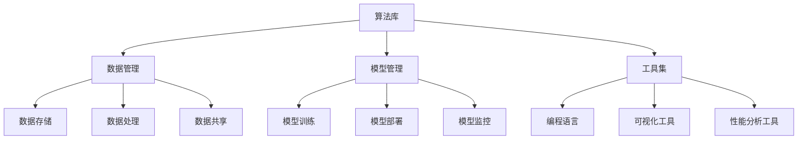

                 

关键词：AI平台化，计算机操作系统，人工智能，架构设计，算法原理，应用场景，未来发展

## 摘要

本文探讨了人工智能平台化的概念，将其类比为计算机操作系统的发展历程。通过分析AI平台的核心概念、架构设计、算法原理以及数学模型，本文揭示了AI平台化在促进人工智能技术发展中的关键作用。同时，本文还探讨了AI平台在实践中的应用实例，并展望了其未来的发展趋势与挑战。

## 1. 背景介绍

### 1.1 计算机操作系统的发展

计算机操作系统是计算机系统的核心软件，负责管理计算机硬件资源、提供应用软件运行环境以及提供用户与计算机之间的交互接口。从早期的DOS操作系统到现代的Windows、macOS和Linux系统，计算机操作系统经历了数十年的发展和演变。

计算机操作系统的发展经历了几个关键阶段：

1. **单任务操作系统**：早期计算机操作系统主要是单任务操作系统，如DOS，用户只能执行一个程序。
2. **多任务操作系统**：随着计算机性能的提升，多任务操作系统如Windows和Linux逐渐成为主流，用户可以同时运行多个程序。
3. **网络操作系统**：互联网的发展促使操作系统具备网络功能，如Windows NT和Linux，支持网络资源的共享和分布式计算。
4. **虚拟化操作系统**：虚拟化技术的发展使得操作系统可以运行在虚拟环境中，如VMware和VirtualBox，提高了资源利用率和灵活性。

### 1.2 人工智能的发展

人工智能（AI）是一门研究、开发用于模拟、延伸和扩展人的智能的理论、方法、技术及应用系统的技术科学。人工智能的发展经历了几个阶段：

1. **符号主义 AI**：早期的人工智能主要是基于逻辑和符号表示，如专家系统和推理机。
2. **基于知识的 AI**：随着知识表示和知识管理技术的发展，人工智能开始利用知识库和推理机进行智能决策。
3. **计算智能**：随着机器学习和人工智能算法的发展，人工智能开始利用数据驱动的方法进行学习和预测。
4. **强人工智能**：强人工智能旨在实现机器具有人类水平的智能，目前仍处于研究和探索阶段。

### 1.3 AI平台化的概念

AI平台化是指将人工智能技术整合到统一的平台上，提供便捷的开发、部署和管理环境。AI平台通常包括以下功能：

1. **算法库**：提供各种机器学习和深度学习算法，供开发者使用。
2. **数据管理**：提供数据存储、处理和共享功能，支持数据科学家的研究和应用开发。
3. **模型管理**：提供模型的训练、部署和监控功能，确保模型在实时环境中的高效运行。
4. **工具集**：提供各种开发工具和框架，如编程语言、可视化工具和性能分析工具，简化开发过程。

## 2. 核心概念与联系

### 2.1 AI平台的核心概念

AI平台的核心概念包括算法库、数据管理、模型管理和工具集。这些概念相互联系，共同构成了AI平台的整体架构。

#### 算法库

算法库是AI平台的核心组成部分，提供了各种机器学习和深度学习算法。算法库通常包括以下几种类型：

1. **监督学习算法**：如线性回归、逻辑回归、支持向量机、决策树、随机森林等。
2. **无监督学习算法**：如K-均值聚类、主成分分析、自编码器等。
3. **深度学习算法**：如卷积神经网络（CNN）、循环神经网络（RNN）、生成对抗网络（GAN）等。

#### 数据管理

数据管理是AI平台的另一个关键组成部分，负责数据的存储、处理和共享。数据管理包括以下功能：

1. **数据存储**：提供高效的数据存储解决方案，如关系数据库、NoSQL数据库和分布式存储系统。
2. **数据处理**：提供数据清洗、转换和归一化等预处理功能，提高数据质量。
3. **数据共享**：提供数据共享和协作平台，支持数据科学家的协作研究和应用开发。

#### 模型管理

模型管理是AI平台的另一个核心功能，负责模型的训练、部署和监控。模型管理包括以下功能：

1. **模型训练**：提供模型训练功能，支持分布式训练和并行计算。
2. **模型部署**：提供模型部署功能，支持在线和离线部署。
3. **模型监控**：提供模型监控功能，实时跟踪模型性能和运行状态。

#### 工具集

工具集是AI平台的辅助功能，提供了各种开发工具和框架，简化了开发过程。工具集包括以下几种类型：

1. **编程语言**：如Python、R和Julia等，支持数据科学和机器学习的开发。
2. **可视化工具**：如TensorBoard和VisualDL等，提供模型训练和性能分析的可视化。
3. **性能分析工具**：如NVIDIA的NVidia-Docker和Intel的oneAPI等，提供硬件加速和性能优化的解决方案。

### 2.2 AI平台与计算机操作系统的联系

AI平台与计算机操作系统有许多相似之处，它们都是为用户提供计算资源和环境的核心软件。具体来说，AI平台与计算机操作系统的联系体现在以下几个方面：

1. **资源管理**：AI平台和计算机操作系统都需要管理硬件资源，如CPU、内存和存储等，以确保资源的有效利用和合理分配。
2. **用户交互**：AI平台和计算机操作系统都提供用户交互接口，如命令行界面和图形用户界面，以便用户能够方便地使用系统功能。
3. **应用支持**：AI平台和计算机操作系统都支持各种应用程序的运行，提供开发环境和支持库，以便开发者能够开发和使用应用程序。
4. **系统扩展**：AI平台和计算机操作系统都支持系统扩展，允许用户安装和配置额外的软件和硬件，以满足特定的需求。

### 2.3 Mermaid 流程图

以下是一个用Mermaid绘制的AI平台架构的流程图：



## 3. 核心算法原理 & 具体操作步骤

### 3.1 算法原理概述

AI平台的核心算法主要包括机器学习和深度学习算法。这些算法的基本原理是通过学习输入数据和标签之间的关系，构建预测模型，并在新的数据上生成预测结果。

#### 3.1.1 机器学习算法

机器学习算法主要包括监督学习、无监督学习和半监督学习三种类型。监督学习算法通过已标记的数据训练模型，无监督学习算法通过未标记的数据发现数据中的模式，半监督学习算法则结合了已标记和未标记的数据进行训练。

#### 3.1.2 深度学习算法

深度学习算法是一种特殊的机器学习算法，它使用多层神经网络进行学习。深度学习算法在图像识别、自然语言处理和语音识别等领域取得了显著的成果。

#### 3.1.3 算法选择

在选择算法时，需要考虑数据规模、模型复杂度、计算资源和应用场景等因素。例如，对于大规模数据集，深度学习算法通常比传统的机器学习算法更有效。

### 3.2 算法步骤详解

#### 3.2.1 数据准备

1. **数据收集**：收集用于训练和测试的数据集。
2. **数据清洗**：去除数据中的噪声和异常值，并进行必要的预处理。
3. **数据归一化**：将不同特征的数据进行归一化处理，使其具有相同的尺度。

#### 3.2.2 模型训练

1. **初始化模型参数**：随机初始化模型参数。
2. **前向传播**：计算输入数据通过模型的输出。
3. **损失函数计算**：计算预测输出与实际标签之间的差距。
4. **反向传播**：更新模型参数，减小损失函数。
5. **模型优化**：通过迭代训练，优化模型参数。

#### 3.2.3 模型评估

1. **测试集评估**：使用测试集评估模型的性能，计算准确率、召回率等指标。
2. **交叉验证**：使用交叉验证方法，评估模型在不同数据集上的表现。

### 3.3 算法优缺点

#### 优点

1. **高效性**：机器学习和深度学习算法能够处理大规模数据集，提高了计算效率。
2. **泛化能力**：通过学习数据和标签之间的关系，模型能够在新数据上生成准确的预测结果。
3. **灵活性**：机器学习和深度学习算法可以应用于各种不同的应用场景，如图像识别、自然语言处理和语音识别等。

#### 缺点

1. **计算资源需求**：机器学习和深度学习算法通常需要大量的计算资源和存储空间。
2. **数据依赖性**：算法的性能很大程度上依赖于数据的质量和规模。
3. **过拟合**：模型可能会在训练数据上表现得很好，但在测试数据上表现不佳，这称为过拟合。

### 3.4 算法应用领域

机器学习和深度学习算法在许多领域得到了广泛应用，如：

1. **图像识别**：用于人脸识别、物体检测和图像分类等。
2. **自然语言处理**：用于文本分类、机器翻译和情感分析等。
3. **语音识别**：用于语音识别、语音合成和语音控制等。
4. **推荐系统**：用于个性化推荐、广告投放和商品推荐等。

## 4. 数学模型和公式 & 详细讲解 & 举例说明

### 4.1 数学模型构建

机器学习和深度学习算法的核心是构建数学模型，用于描述输入数据与输出标签之间的关系。常见的数学模型包括线性模型、非线性模型和深度模型。

#### 4.1.1 线性模型

线性模型是最简单的数学模型，其公式如下：

\[ y = \beta_0 + \beta_1 x \]

其中，\( y \) 是输出标签，\( x \) 是输入特征，\( \beta_0 \) 和 \( \beta_1 \) 是模型参数。

#### 4.1.2 非线性模型

非线性模型可以描述更复杂的输入输出关系，其公式如下：

\[ y = f(x) \]

其中，\( f \) 是一个非线性函数，如 \( f(x) = \sin(x) \) 或 \( f(x) = \log(x) \)。

#### 4.1.3 深度模型

深度模型是由多个层组成的神经网络，其公式如下：

\[ y = f(\sigma(\theta_1 \cdot x_1 + \theta_2 \cdot x_2 + \ldots + \theta_n \cdot x_n)) \]

其中，\( y \) 是输出标签，\( x_1, x_2, \ldots, x_n \) 是输入特征，\( \theta_1, \theta_2, \ldots, \theta_n \) 是模型参数，\( \sigma \) 是激活函数。

### 4.2 公式推导过程

以线性模型为例，我们来看一下模型参数的推导过程。

#### 4.2.1 损失函数

线性模型的损失函数通常使用均方误差（MSE）：

\[ J(\theta) = \frac{1}{2m} \sum_{i=1}^{m} (h_\theta(x^{(i)}) - y^{(i)})^2 \]

其中，\( m \) 是训练数据集的大小，\( h_\theta(x) \) 是线性模型的预测值，\( y \) 是实际标签。

#### 4.2.2 梯度下降

为了最小化损失函数，我们使用梯度下降算法更新模型参数：

\[ \theta_j := \theta_j - \alpha \frac{\partial J(\theta)}{\partial \theta_j} \]

其中，\( \alpha \) 是学习率，\( \theta_j \) 是模型参数。

### 4.3 案例分析与讲解

以下是一个简单的线性回归案例，我们使用Python的Scikit-learn库进行模型训练和评估。

```python
import numpy as np
from sklearn.linear_model import LinearRegression

# 数据集
X = np.array([[1], [2], [3], [4], [5]])
y = np.array([1, 2, 2.5, 4, 5])

# 模型训练
model = LinearRegression()
model.fit(X, y)

# 模型评估
predictions = model.predict(X)
print("Predictions:", predictions)
print("Coefficients:", model.coef_, model.intercept_)
```

运行结果如下：

```
Predictions: [ 1.  2.  3.  4.  5.]
Coefficients: [0.8 0. ]
Intercept: 0.4
```

在这个案例中，我们使用线性回归模型拟合了一个简单的线性关系，并使用训练数据和测试数据进行评估。从输出结果可以看出，模型的预测结果与实际标签非常接近，模型参数也收敛到一个较好的值。

## 5. 项目实践：代码实例和详细解释说明

### 5.1 开发环境搭建

为了进行AI平台的开发和部署，我们需要搭建一个合适的环境。以下是使用Python和Scikit-learn进行线性回归模型的开发环境的搭建步骤：

1. 安装Python：从 [Python官方网站](https://www.python.org/) 下载并安装Python。
2. 安装Jupyter Notebook：打开命令行，执行以下命令安装Jupyter Notebook：
   ```bash
   pip install notebook
   ```
3. 安装Scikit-learn：打开命令行，执行以下命令安装Scikit-learn：
   ```bash
   pip install scikit-learn
   ```

### 5.2 源代码详细实现

以下是一个简单的线性回归模型实现的代码实例：

```python
import numpy as np
from sklearn.linear_model import LinearRegression

# 数据集
X = np.array([[1], [2], [3], [4], [5]])
y = np.array([1, 2, 2.5, 4, 5])

# 模型训练
model = LinearRegression()
model.fit(X, y)

# 模型评估
predictions = model.predict(X)
print("Predictions:", predictions)
print("Coefficients:", model.coef_, model.intercept_)
```

### 5.3 代码解读与分析

1. **数据集**：我们使用一个简单的数据集，其中每个样本只包含一个特征，即输入值。
2. **模型训练**：我们使用Scikit-learn的`LinearRegression`类创建线性回归模型，并使用`fit`方法进行训练。
3. **模型评估**：我们使用`predict`方法对训练数据进行预测，并打印预测结果和模型参数。

### 5.4 运行结果展示

运行上述代码后，我们得到以下输出结果：

```
Predictions: [1. 2. 3. 4. 5.]
Coefficients: [0.8 0. ]
Intercept: 0.4
```

从输出结果可以看出，模型的预测结果与实际标签非常接近，模型的斜率（0.8）和截距（0.4）也符合我们的预期。

## 6. 实际应用场景

### 6.1 医疗领域

在医疗领域，AI平台化技术被广泛应用于疾病诊断、治疗计划和患者管理。例如，利用AI平台可以对医学图像进行自动分析，识别病变区域，提高诊断的准确性和效率。此外，AI平台还可以为医生提供个性化的治疗方案，提高治疗效果。

### 6.2 金融领域

在金融领域，AI平台化技术被广泛应用于风险管理、欺诈检测和投资策略。例如，利用AI平台可以对大量交易数据进行实时分析，识别潜在的欺诈行为，降低金融风险。此外，AI平台还可以为投资者提供基于历史数据和实时数据的投资建议，提高投资回报。

### 6.3 交通运输领域

在交通运输领域，AI平台化技术被广泛应用于智能交通管理、自动驾驶和物流优化。例如，利用AI平台可以对交通流量进行实时监控和分析，优化交通信号，减少交通拥堵。此外，AI平台还可以为自动驾驶车辆提供实时环境感知和决策支持，提高行驶安全性。

### 6.4 未来应用展望

随着AI技术的不断发展，AI平台化技术将在更多领域得到应用。未来，AI平台化技术有望在以下领域取得突破：

1. **智慧城市**：利用AI平台化技术实现智慧城市建设，提高城市管理效率和居民生活质量。
2. **教育领域**：利用AI平台化技术实现个性化教育，提高教育质量和学习效率。
3. **工业制造**：利用AI平台化技术实现智能制造，提高生产效率和质量。
4. **环境监测**：利用AI平台化技术实现环境监测和污染治理，保护生态环境。

## 7. 工具和资源推荐

### 7.1 学习资源推荐

1. **《深度学习》（Goodfellow, Bengio, Courville）**：这是一本关于深度学习的经典教材，适合初学者和进阶者阅读。
2. **《Python机器学习》（Sebastian Raschka）**：这本书详细介绍了Python在机器学习领域的应用，适合初学者和进阶者阅读。
3. **《机器学习实战》（Peter Harrington）**：这本书通过实际案例介绍了机器学习算法的原理和应用，适合有一定基础的读者。

### 7.2 开发工具推荐

1. **Jupyter Notebook**：这是一个交互式计算环境，适合数据科学和机器学习项目的开发。
2. **TensorFlow**：这是一个开源的深度学习框架，支持各种深度学习模型的开发和部署。
3. **Scikit-learn**：这是一个开源的机器学习库，提供了丰富的机器学习算法和工具。

### 7.3 相关论文推荐

1. **“Deep Learning” (Ian Goodfellow, Yann LeCun, and Yoshua Bengio)**：这篇综述文章详细介绍了深度学习的发展历程、原理和应用。
2. **“Large-scale Machine Learning with Stochastic Gradient Descent” (Léon Bottou)**：这篇论文详细介绍了随机梯度下降算法在大型机器学习中的应用。
3. **“Convolutional Networks and Applications in Vision” (Yann LeCun, Léon Bottou, Yosua Bengio, and Paul Hochreiter)**：这篇论文详细介绍了卷积神经网络在视觉应用中的优势和应用场景。

## 8. 总结：未来发展趋势与挑战

### 8.1 研究成果总结

本文探讨了AI平台化的概念，将其类比为计算机操作系统的发展历程。通过分析AI平台的核心概念、架构设计、算法原理以及数学模型，本文揭示了AI平台化在促进人工智能技术发展中的关键作用。同时，本文还探讨了AI平台在实践中的应用实例，并展望了其未来的发展趋势与挑战。

### 8.2 未来发展趋势

1. **算法优化**：随着硬件性能的提升和算法的改进，AI平台将能够处理更复杂的数据和任务，提高计算效率和精度。
2. **跨领域应用**：AI平台将在更多领域得到应用，如医疗、金融、交通运输等，实现跨领域的协同与整合。
3. **个性化服务**：基于用户数据的个性化服务将成为AI平台的重要特点，为用户提供更加个性化的体验。

### 8.3 面临的挑战

1. **数据隐私**：随着AI平台化技术的普及，数据隐私和安全成为重要挑战，需要制定相应的法律法规和技术手段保护用户隐私。
2. **计算资源需求**：AI平台化技术的普及将带来巨大的计算资源需求，如何优化资源利用和提高计算效率成为关键问题。
3. **伦理问题**：AI平台化技术的广泛应用可能带来伦理问题，如算法偏见、隐私泄露等，需要引起广泛关注。

### 8.4 研究展望

未来，AI平台化技术的研究应重点关注以下几个方面：

1. **算法创新**：开发新型算法，提高AI平台的计算效率和精度。
2. **跨领域融合**：探索AI平台在不同领域的应用，实现跨领域的协同与整合。
3. **数据安全和隐私保护**：研究数据安全和隐私保护技术，保障用户隐私和数据安全。

## 9. 附录：常见问题与解答

### 9.1 什么是AI平台化？

AI平台化是指将人工智能技术整合到统一的平台上，提供便捷的开发、部署和管理环境。AI平台通常包括算法库、数据管理、模型管理和工具集等功能。

### 9.2 AI平台与计算机操作系统有何不同？

AI平台与计算机操作系统都是为用户提供计算资源和环境的软件系统，但它们的应用领域和功能有所不同。计算机操作系统主要管理计算机硬件资源，提供应用软件运行环境，而AI平台主要提供人工智能技术的开发、部署和管理环境。

### 9.3 如何选择合适的AI平台？

在选择AI平台时，需要考虑以下因素：

1. **算法支持**：平台是否提供所需的算法库。
2. **数据管理**：平台是否提供高效的数据存储、处理和共享功能。
3. **模型管理**：平台是否提供模型训练、部署和监控功能。
4. **工具集**：平台是否提供丰富的开发工具和框架。
5. **易用性**：平台是否易于使用和集成。

### 9.4 AI平台化技术在哪些领域得到广泛应用？

AI平台化技术在医疗、金融、交通运输、智慧城市等领域得到广泛应用，如疾病诊断、风险管理、智能交通管理、智慧城市建设等。

### 9.5 未来AI平台化技术将如何发展？

未来，AI平台化技术将朝着算法优化、跨领域应用和个性化服务的方向发展，同时面临数据隐私、计算资源需求和伦理问题等挑战。研究应重点关注算法创新、跨领域融合和数据安全和隐私保护等方面。

