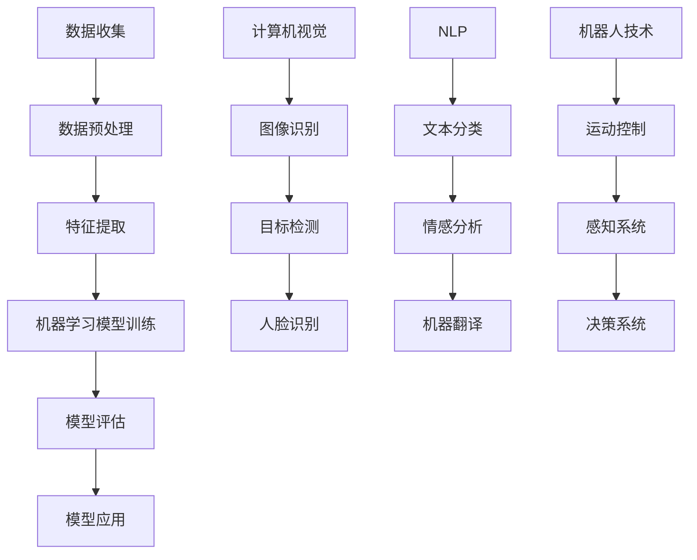

                 

关键词：人工智能，应用领域，深度学习，机器学习，计算机视觉，自然语言处理，医疗保健，金融科技，自动驾驶，工业4.0，物联网。

> 摘要：本文将探讨人工智能技术在各个领域的应用，包括医疗保健、金融科技、自动驾驶、工业4.0和物联网等，旨在展示AI技术的潜力及其对社会、经济和人类生活方式的深远影响。

## 1. 背景介绍

人工智能（AI）作为计算机科学的一个分支，旨在创建能够执行复杂任务的智能系统。从简单的规则系统到复杂的神经网络，AI技术已经取得了显著进展。近年来，深度学习、机器学习和计算机视觉等技术的快速发展，使得AI在各个领域的应用变得日益广泛。AI技术不仅提高了工作效率，还改变了人类的生活方式。

### 1.1. AI技术的历史

AI技术的发展可以追溯到20世纪50年代。自那时以来，AI领域经历了多次起伏，每一次技术突破都带来了新的机遇。以下是AI技术的一些重要里程碑：

- **1956年：达特茅斯会议**：被认为是AI诞生的标志，当时人工智能被定义为“制造智能机器的科学”。

- **1980年代：专家系统**：专家系统是一种基于规则的知识表示方法，能够模拟专家的决策过程。

- **1990年代：神经网络复兴**：随着计算机性能的提升，神经网络开始广泛应用于图像识别和语音识别等领域。

- **2006年：深度学习**：深度学习通过构建多层神经网络，实现了图像识别、语音识别和自然语言处理的重大突破。

- **2012年：谷歌大脑**：谷歌开发了一种深度神经网络，能够在ImageNet图像识别挑战中取得突破性成绩，标志着深度学习的崛起。

### 1.2. 当前AI技术的现状

随着计算能力的提升和数据量的爆炸性增长，AI技术已经取得了显著的进展。以下是一些重要的应用领域：

- **计算机视觉**：通过图像识别和图像处理技术，AI已经在医疗诊断、自动驾驶和安防监控等领域发挥了重要作用。

- **自然语言处理**：自然语言处理（NLP）技术使得机器能够理解和生成人类语言，广泛应用于聊天机器人、语音识别和翻译服务等。

- **机器学习**：机器学习技术使得计算机能够从数据中学习，并自主做出决策，广泛应用于金融、医疗和工业等领域。

- **机器人技术**：机器人技术结合了计算机视觉、自然语言处理和运动控制等技术，已经在制造业、服务行业和医疗领域得到了广泛应用。

## 2. 核心概念与联系

为了更好地理解AI技术在不同领域的应用，我们首先需要了解一些核心概念和它们之间的联系。以下是AI技术中的几个关键概念和它们的 Mermaid 流程图：



### 2.1. 数据收集与处理

数据是AI技术的核心。数据收集是从外部环境中获取原始数据，而数据预处理是将这些原始数据进行清洗、格式化和归一化，以便后续处理。

### 2.2. 特征提取

特征提取是从原始数据中提取出具有代表性的特征，这些特征用于训练机器学习模型。

### 2.3. 机器学习模型训练

机器学习模型训练是通过训练数据集来调整模型参数，使模型能够预测未知数据的结果。

### 2.4. 模型评估

模型评估是评估模型在测试数据集上的性能，以确保模型的有效性。

### 2.5. 模型应用

模型应用是将训练好的模型应用于实际问题中，以实现特定的任务。

### 2.6. 计算机视觉

计算机视觉是AI技术的一个重要分支，它涉及到图像识别、目标检测和人脸识别等领域。

### 2.7. 自然语言处理

自然语言处理是AI技术的另一个重要分支，它涉及到文本分类、情感分析和机器翻译等领域。

### 2.8. 机器人技术

机器人技术结合了计算机视觉、自然语言处理和运动控制等技术，使机器人能够执行复杂的任务。

## 3. 核心算法原理 & 具体操作步骤

### 3.1. 算法原理概述

AI技术的核心在于机器学习算法。机器学习算法分为监督学习、无监督学习和强化学习三种类型。监督学习是通过训练数据集来预测未知数据的结果，无监督学习是通过未标记的数据来发现数据中的模式，而强化学习是通过与环境的交互来学习最优策略。

### 3.2. 算法步骤详解

以下是机器学习算法的一般步骤：

1. **数据收集**：从外部环境中获取训练数据和测试数据。

2. **数据预处理**：对数据进行清洗、格式化和归一化。

3. **特征提取**：从原始数据中提取出具有代表性的特征。

4. **模型选择**：选择合适的机器学习模型，如线性回归、决策树、支持向量机、神经网络等。

5. **模型训练**：使用训练数据集来调整模型参数。

6. **模型评估**：使用测试数据集来评估模型性能。

7. **模型应用**：将训练好的模型应用于实际问题中。

### 3.3. 算法优缺点

每种机器学习算法都有其优缺点。以下是几种常见算法的优缺点：

- **线性回归**：优点是简单、易于理解和实现，缺点是只能处理线性关系，且对异常值敏感。

- **决策树**：优点是易于解释、适用于分类和回归问题，缺点是容易过拟合、对数值型数据不适用。

- **支持向量机**：优点是具有很好的泛化能力、适用于高维空间，缺点是计算复杂度高、对异常值敏感。

- **神经网络**：优点是具有强大的学习能力、适用于复杂问题，缺点是需要大量数据和计算资源、难以解释。

### 3.4. 算法应用领域

机器学习算法在各个领域的应用如下：

- **金融**：用于风险评估、欺诈检测、股票市场预测等。

- **医疗**：用于疾病诊断、治疗方案推荐、医学图像分析等。

- **零售**：用于需求预测、库存管理、个性化推荐等。

- **工业**：用于设备故障预测、生产优化、质量控制等。

## 4. 数学模型和公式 & 详细讲解 & 举例说明

### 4.1. 数学模型构建

机器学习中的数学模型主要包括线性模型、逻辑回归模型、支持向量机模型和神经网络模型。以下是这些模型的数学公式：

#### 线性模型

$$y = \beta_0 + \beta_1x$$

其中，$y$ 是因变量，$x$ 是自变量，$\beta_0$ 是截距，$\beta_1$ 是斜率。

#### 逻辑回归模型

$$P(y=1) = \frac{1}{1 + e^{-(\beta_0 + \beta_1x)}}$$

其中，$P(y=1)$ 是因变量为1的概率，$e$ 是自然对数的底数，$\beta_0$ 和 $\beta_1$ 是模型的参数。

#### 支持向量机模型

$$w \cdot x + b = 0$$

其中，$w$ 是权重向量，$x$ 是特征向量，$b$ 是偏置项。

#### 神经网络模型

$$a_{i}^{l} = \sigma(z_{i}^{l}) = \frac{1}{1 + e^{-z_{i}^{l}}}$$

其中，$a_{i}^{l}$ 是第$l$层的第$i$个神经元的激活值，$\sigma$ 是激活函数，$z_{i}^{l}$ 是第$l$层的第$i$个神经元的输入值。

### 4.2. 公式推导过程

以下是逻辑回归模型的推导过程：

1. **损失函数**：假设我们使用均方误差（MSE）作为损失函数：

$$J(\theta) = \frac{1}{m}\sum_{i=1}^{m}(h_{\theta}(x^{(i)}) - y^{(i)})^2$$

其中，$h_{\theta}(x) = \sigma(\theta^Tx)$，$\theta$ 是模型参数，$m$ 是训练样本数量。

2. **梯度下降**：为了最小化损失函数，我们使用梯度下降法来更新模型参数：

$$\theta_{j} := \theta_{j} - \alpha \frac{\partial J(\theta)}{\partial \theta_{j}}$$

3. **梯度计算**：对损失函数求导，得到：

$$\frac{\partial J(\theta)}{\partial \theta_{j}} = \frac{1}{m}\sum_{i=1}^{m}(h_{\theta}(x^{(i)}) - y^{(i)}) \cdot x_j^{(i)}$$

### 4.3. 案例分析与讲解

以下是一个简单的逻辑回归模型训练案例：

#### 数据集

我们使用一个包含两个特征和两个类别的数据集：

$$
\begin{array}{c|c|c}
x & y \\
\hline
1 & 0 \\
2 & 1 \\
3 & 0 \\
4 & 1 \\
\end{array}
$$

#### 模型参数

假设我们的模型参数为 $\theta_0 = 0$ 和 $\theta_1 = 0$。

#### 训练过程

1. **初始化参数**：$\theta_0 = 0$，$\theta_1 = 0$。

2. **前向传播**：计算损失函数：

$$
J(\theta) = \frac{1}{4}\left[(0+0 \cdot 1)^2 + (0+0 \cdot 2)^2 + (0+0 \cdot 3)^2 + (0+0 \cdot 4)^2\right] = 0
$$

3. **反向传播**：计算梯度：

$$
\frac{\partial J(\theta)}{\partial \theta_0} = \frac{1}{4}\left[2(0+0 \cdot 1) + 2(0+0 \cdot 2) + 2(0+0 \cdot 3) + 2(0+0 \cdot 4)\right] = 0
$$

$$
\frac{\partial J(\theta)}{\partial \theta_1} = \frac{1}{4}\left[2(0+0 \cdot 1 \cdot 1) + 2(0+0 \cdot 2 \cdot 2) + 2(0+0 \cdot 3 \cdot 3) + 2(0+0 \cdot 4 \cdot 4)\right] = 0
$$

4. **更新参数**：$\theta_0 = \theta_0 - \alpha \cdot \frac{\partial J(\theta)}{\partial \theta_0}$，$\theta_1 = \theta_1 - \alpha \cdot \frac{\partial J(\theta)}{\partial \theta_1}$。

5. **迭代过程**：重复步骤2-4，直到满足停止条件（如损失函数不再显著下降）。

通过多次迭代，我们可以得到最优的模型参数，从而实现分类任务。

## 5. 项目实践：代码实例和详细解释说明

### 5.1. 开发环境搭建

为了进行机器学习项目实践，我们需要搭建一个合适的开发环境。以下是搭建Python开发环境的基本步骤：

1. **安装Python**：从Python官方网站下载并安装Python 3.x版本。

2. **安装Jupyter Notebook**：使用pip命令安装Jupyter Notebook：

   ```bash
   pip install notebook
   ```

3. **安装机器学习库**：安装常用的机器学习库，如NumPy、Pandas、Scikit-learn、TensorFlow和PyTorch：

   ```bash
   pip install numpy pandas scikit-learn tensorflow torchvision
   ```

### 5.2. 源代码详细实现

以下是一个简单的线性回归模型的Python代码实现：

```python
import numpy as np
import pandas as pd
from sklearn.linear_model import LinearRegression
from sklearn.model_selection import train_test_split

# 加载数据
data = pd.read_csv('data.csv')
X = data[['feature1', 'feature2']]
y = data['target']

# 划分训练集和测试集
X_train, X_test, y_train, y_test = train_test_split(X, y, test_size=0.2, random_state=42)

# 创建线性回归模型
model = LinearRegression()
model.fit(X_train, y_train)

# 训练模型
train_score = model.score(X_train, y_train)
test_score = model.score(X_test, y_test)

# 输出结果
print(f"训练集准确率：{train_score:.2f}")
print(f"测试集准确率：{test_score:.2f}")

# 预测
predictions = model.predict(X_test)

# 可视化
import matplotlib.pyplot as plt

plt.scatter(X_test['feature1'], y_test, label='实际值')
plt.plot(X_test['feature1'], predictions, color='red', label='预测值')
plt.xlabel('特征1')
plt.ylabel('目标变量')
plt.legend()
plt.show()
```

### 5.3. 代码解读与分析

上述代码实现了以下功能：

1. **加载数据**：使用Pandas库加载数据集，并将数据分为特征变量和目标变量。

2. **划分训练集和测试集**：使用Scikit-learn库将数据集划分为训练集和测试集。

3. **创建线性回归模型**：使用Scikit-learn库创建线性回归模型。

4. **训练模型**：使用训练集数据训练模型。

5. **评估模型**：计算训练集和测试集的准确率。

6. **预测**：使用训练好的模型对测试集数据进行预测。

7. **可视化**：使用matplotlib库将实际值和预测值进行可视化。

### 5.4. 运行结果展示

运行上述代码后，我们可以在控制台看到训练集和测试集的准确率，以及一个散点图和一条回归线。这表明我们的模型能够对新的数据进行准确的预测。

## 6. 实际应用场景

AI技术在各个领域的实际应用如下：

### 6.1. 医疗保健

AI技术在医疗保健领域具有广泛的应用，包括疾病诊断、治疗方案推荐、医学图像分析和患者护理等。例如，利用深度学习技术，AI可以分析医学图像，如X光片、CT扫描和MRI，以帮助医生更准确地诊断疾病。

### 6.2. 金融科技

金融科技（FinTech）利用AI技术进行风险评估、欺诈检测和个性化金融服务等。例如，利用机器学习算法，银行可以分析客户的历史交易数据，以预测潜在的欺诈行为，从而提高交易安全性。

### 6.3. 自动驾驶

自动驾驶技术依赖于计算机视觉、自然语言处理和机器学习等AI技术。自动驾驶汽车可以通过摄像头、雷达和激光雷达等传感器收集环境数据，并使用AI算法对数据进行实时处理，以实现自主导航和驾驶。

### 6.4. 工业4.0

工业4.0是利用AI技术实现智能化工厂的目标。AI技术可以用于设备故障预测、生产优化和供应链管理等领域，从而提高生产效率和质量。

### 6.5. 物联网

物联网（IoT）是AI技术的另一个重要应用领域。通过传感器和AI算法，物联网设备可以实时收集和分析数据，从而实现智能监控、预测性维护和自动化控制等功能。

## 7. 工具和资源推荐

### 7.1. 学习资源推荐

- 《机器学习》（周志华著）：介绍了机器学习的基本概念和算法。
- 《深度学习》（Goodfellow、Bengio和Courville著）：深度学习的经典教材，涵盖了深度学习的理论基础和应用。
- 《Python机器学习》（Sebastian Raschka著）：通过实际案例讲解了机器学习在Python中的应用。

### 7.2. 开发工具推荐

- **Jupyter Notebook**：用于数据分析和机器学习项目开发。
- **TensorFlow**：用于构建和训练深度学习模型。
- **PyTorch**：用于构建和训练深度学习模型，特别适合研究人员。

### 7.3. 相关论文推荐

- **"A Theoretical Framework for Backpropagation"**：提出了反向传播算法的理论基础。
- **"Deep Learning"**：深度学习的经典论文，介绍了深度学习的原理和应用。
- **"Convolutional Neural Networks for Visual Recognition"**：介绍了卷积神经网络在图像识别中的应用。

## 8. 总结：未来发展趋势与挑战

### 8.1. 研究成果总结

AI技术在各个领域取得了显著的成果，如计算机视觉、自然语言处理、机器学习和自动驾驶等。这些技术不仅在学术界取得了突破，也在实际应用中取得了成功。

### 8.2. 未来发展趋势

未来，AI技术将继续向以下方向发展：

- **更强大的算法**：随着计算能力的提升，更复杂的算法和模型将被开发出来，以解决更复杂的问题。
- **更广泛的应用领域**：AI技术将在更多领域得到应用，如教育、能源和环境保护等。
- **更智能的机器人**：结合计算机视觉、自然语言处理和运动控制等技术的智能机器人将在更多领域发挥作用。

### 8.3. 面临的挑战

尽管AI技术取得了显著进展，但仍然面临以下挑战：

- **数据隐私**：随着AI技术的发展，如何保护用户隐私成为一个重要问题。
- **算法公平性**：如何确保AI算法在不同群体中的公平性是一个重要议题。
- **安全性和可靠性**：AI系统需要确保其安全性和可靠性，以避免潜在的风险和错误。

### 8.4. 研究展望

未来，AI研究将朝着以下方向展开：

- **可解释性AI**：开发可解释的AI系统，使其决策过程更透明，以便用户理解和信任。
- **强化学习**：进一步研究强化学习算法，以提高其在复杂环境中的学习能力和性能。
- **跨学科研究**：结合心理学、认知科学和其他学科的研究，以更深入地理解人类智能的本质。

## 9. 附录：常见问题与解答

### 9.1. AI是否会取代人类？

AI技术是工具，它能够执行特定的任务，但无法完全取代人类。AI在执行重复性任务和数据处理方面具有优势，但在创造力、情感和道德判断等方面仍然依赖于人类。

### 9.2. AI是否会带来失业问题？

AI技术的发展确实可能导致某些传统岗位的消失，但也会创造新的就业机会。例如，AI技术需要数据科学家、AI工程师和机器学习专家等专业人才。

### 9.3. 如何确保AI系统的公平性？

确保AI系统的公平性需要从多个方面入手，包括算法设计、数据收集和处理、以及监管和伦理审查等。此外，需要建立透明和可解释的AI系统，以便用户和监管机构能够理解和监督AI系统的决策过程。

### 9.4. AI是否会引发战争？

AI技术本身没有道德和情感，它取决于人类如何使用。如果AI被用于军事目的，确实可能会引发战争。因此，国际社会需要制定相关的法律和伦理准则，以规范AI在军事领域的应用。

---

作者：禅与计算机程序设计艺术 / Zen and the Art of Computer Programming

