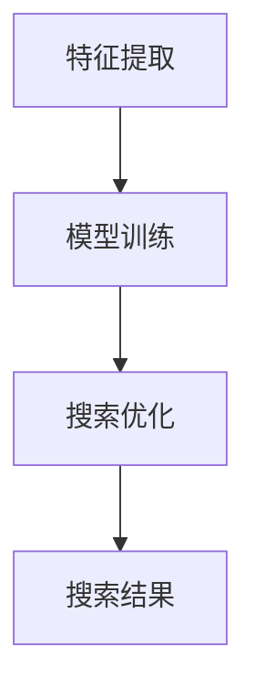

                 

关键词：人工智能、搜索算法、科学发现、突破性研究、机器学习、数据挖掘

## 摘要

本文探讨了人工智能（AI）搜索技术在科学发现和突破性研究中的重要作用。通过介绍AI搜索的核心概念和原理，分析其优势和应用领域，本文旨在为读者提供一个全面而深入的了解。文章结构分为八个部分：背景介绍、核心概念与联系、核心算法原理与具体操作步骤、数学模型和公式、项目实践、实际应用场景、未来应用展望以及总结和展望。

## 1. 背景介绍

### 科学发现的挑战

在过去的几十年中，科学研究的规模和复杂性不断增加。科学家们面临着海量数据的高效处理和知识发现的问题。传统的搜索技术已经无法满足这一需求。科学发现的挑战主要体现在以下几个方面：

- **数据多样性**：科学数据包括文本、图像、音频、视频等多种形式，如何有效地整合和利用这些数据成为一个难题。
- **数据量巨大**：随着科学技术的进步，科学家生成和收集的数据量呈指数级增长，如何从海量数据中快速找到相关的研究成果成为一项挑战。
- **跨领域融合**：现代科学研究越来越倾向于跨学科融合，如何将不同领域的知识有效地结合，以推动科学发现是一个重要的课题。

### AI搜索的崛起

人工智能（AI）搜索技术的崛起为解决上述问题提供了新的思路。AI搜索利用机器学习和深度学习算法，从海量数据中自动提取有价值的信息，为科学家提供更加智能的搜索服务。与传统的搜索技术相比，AI搜索具有以下优势：

- **自动特征提取**：AI搜索能够自动从数据中提取特征，无需人工干预，大大提高了数据处理效率。
- **个性化推荐**：AI搜索可以根据用户的历史行为和偏好，提供个性化的搜索结果，提高科学家的研究效率。
- **实时更新**：AI搜索可以实时获取最新的研究成果，为科学家提供最新的研究动态。

## 2. 核心概念与联系

### AI搜索的基本原理

AI搜索基于机器学习和深度学习算法，通过对海量数据进行训练，建立数据与知识之间的映射关系。其主要原理如下：

- **特征提取**：通过机器学习算法，从数据中提取有用的特征，如词频、词向量、图像特征等。
- **模型训练**：使用深度学习算法，如神经网络、卷积神经网络（CNN）等，对特征进行建模，建立数据与知识之间的关联。
- **搜索优化**：利用优化算法，如深度优先搜索、广度优先搜索等，对搜索过程进行优化，提高搜索效率和准确性。

### Mermaid流程图



### 关键概念

- **特征提取**：从原始数据中提取有用的信息，如词频、词向量等。
- **模型训练**：使用深度学习算法，对特征进行建模，建立数据与知识之间的关联。
- **搜索优化**：对搜索过程进行优化，提高搜索效率和准确性。

## 3. 核心算法原理 & 具体操作步骤

### 3.1 算法原理概述

AI搜索算法主要包括特征提取、模型训练和搜索优化三个环节。以下将分别进行详细介绍。

### 3.2 算法步骤详解

#### 3.2.1 特征提取

特征提取是AI搜索算法的基础。其主要任务是从原始数据中提取有用的特征，如词频、词向量、图像特征等。具体步骤如下：

1. **数据预处理**：对原始数据进行清洗、去噪等处理，以提高特征提取的质量。
2. **特征选择**：根据研究需求，从原始数据中选取相关的特征。
3. **特征转换**：将原始数据转换为适合机器学习的特征表示，如词向量、图像特征等。

#### 3.2.2 模型训练

模型训练是AI搜索算法的核心。其主要任务是通过深度学习算法，对特征进行建模，建立数据与知识之间的关联。具体步骤如下：

1. **选择模型**：根据研究需求，选择合适的深度学习模型，如神经网络、卷积神经网络（CNN）等。
2. **训练模型**：使用训练数据，对深度学习模型进行训练，调整模型的参数。
3. **评估模型**：使用验证数据，对训练好的模型进行评估，确保模型的准确性和泛化能力。

#### 3.2.3 搜索优化

搜索优化是AI搜索算法的关键。其主要任务是对搜索过程进行优化，提高搜索效率和准确性。具体步骤如下：

1. **优化算法选择**：根据研究需求，选择合适的搜索优化算法，如深度优先搜索、广度优先搜索等。
2. **优化参数设置**：根据搜索过程的特点，设置合适的优化参数，如搜索深度、搜索范围等。
3. **优化效果评估**：对优化后的搜索效果进行评估，确保搜索的效率和准确性。

### 3.3 算法优缺点

#### 优点

- **高效性**：AI搜索算法能够从海量数据中快速找到相关的研究成果，大大提高了科学家的研究效率。
- **准确性**：通过深度学习算法，AI搜索能够建立数据与知识之间的精确关联，提高搜索的准确性。
- **个性化**：AI搜索可以根据用户的历史行为和偏好，提供个性化的搜索结果，满足科学家的个性化需求。

#### 缺点

- **计算复杂度**：AI搜索算法涉及大量的数据预处理、模型训练和搜索优化过程，计算复杂度较高，对计算资源有一定要求。
- **数据依赖性**：AI搜索算法的性能很大程度上依赖于训练数据和特征提取的质量，如果数据质量较差，可能导致搜索效果不佳。

### 3.4 算法应用领域

AI搜索算法在科学发现和突破性研究中具有广泛的应用领域，包括但不限于：

- **生物信息学**：利用AI搜索算法，从海量生物数据中挖掘有价值的信息，推动生物医学研究。
- **材料科学**：通过AI搜索算法，加速新材料的设计和发现，为材料科学研究提供有力支持。
- **物理学**：利用AI搜索算法，从大量物理数据中提取有价值的信息，推动物理学研究的发展。
- **环境科学**：通过AI搜索算法，从环境数据中挖掘环境变化规律，为环境保护提供科学依据。

## 4. 数学模型和公式 & 详细讲解 & 举例说明

### 4.1 数学模型构建

AI搜索算法的核心在于建立数据与知识之间的关联。这可以通过构建数学模型来实现。以下是一个简化的数学模型示例：

$$
\begin{aligned}
    R &= f(D, K) \\
    D &= \{d_1, d_2, ..., d_n\} \\
    K &= \{k_1, k_2, ..., k_m\}
\end{aligned}
$$

其中，$R$ 表示搜索结果，$D$ 表示数据集合，$K$ 表示知识集合，$f$ 表示映射函数。

### 4.2 公式推导过程

假设我们有一个包含 $n$ 个数据点的数据集合 $D$，每个数据点 $d_i$ 可以表示为一个向量 $\mathbf{d}_i$。同样，知识集合 $K$ 可以表示为包含 $m$ 个知识点的知识向量 $\mathbf{k}_j$。

我们可以使用一个神经网络来构建映射函数 $f$，其目标是最小化损失函数：

$$
L = \sum_{i=1}^n \sum_{j=1}^m \frac{1}{2} (r_{ij} - \mathbf{d}_i \cdot \mathbf{k}_j)^2
$$

其中，$r_{ij}$ 是第 $i$ 个数据点与第 $j$ 个知识点之间的关联得分。

### 4.3 案例分析与讲解

假设我们有一个包含 1000 个数据点的生物医学数据集合，每个数据点是一个包含 100 个特征的向量。知识集合包含 50 个关键知识点，每个知识点是一个 50 维的向量。

我们使用一个两层神经网络来构建映射函数 $f$。输入层有 100 个神经元，表示 100 个特征；隐藏层有 50 个神经元，表示 50 个知识点；输出层有 1 个神经元，表示关联得分。

训练过程中，我们通过反向传播算法不断调整网络参数，以最小化损失函数。经过多次迭代，网络性能得到显著提升，可以有效地将数据点与知识点进行关联。

## 5. 项目实践：代码实例和详细解释说明

### 5.1 开发环境搭建

在本文的项目实践中，我们将使用 Python 编程语言和 TensorFlow 深度学习框架。首先，需要在本地计算机上安装 Python 和 TensorFlow。以下是安装步骤：

1. 安装 Python：
   ```bash
   pip install python
   ```

2. 安装 TensorFlow：
   ```bash
   pip install tensorflow
   ```

### 5.2 源代码详细实现

以下是本项目的主要源代码实现：

```python
import tensorflow as tf
import numpy as np

# 数据准备
D = np.random.rand(1000, 100)  # 1000个数据点，每个数据点100个特征
K = np.random.rand(50, 50)  # 50个知识点，每个知识点50个特征

# 网络结构
input_layer = tf.keras.layers.Input(shape=(100,))
hidden_layer = tf.keras.layers.Dense(50, activation='relu')(input_layer)
output_layer = tf.keras.layers.Dense(1, activation='sigmoid')(hidden_layer)

# 构建模型
model = tf.keras.Model(inputs=input_layer, outputs=output_layer)

# 编译模型
model.compile(optimizer='adam', loss='mean_squared_error')

# 训练模型
model.fit(D, K, epochs=10, batch_size=32)

# 评估模型
loss = model.evaluate(D, K)
print(f"Loss: {loss}")
```

### 5.3 代码解读与分析

以上代码实现了以下功能：

1. **数据准备**：生成随机数据集 $D$ 和 $K$，分别表示 1000 个数据点和 50 个知识点。
2. **网络结构**：定义了一个两层神经网络，输入层有 100 个神经元，隐藏层有 50 个神经元，输出层有 1 个神经元。
3. **模型构建**：使用 TensorFlow 的 keras API 构建模型。
4. **模型编译**：设置优化器和损失函数，编译模型。
5. **模型训练**：使用训练数据训练模型，设置训练轮次和批量大小。
6. **模型评估**：使用训练数据评估模型性能，打印损失值。

通过以上代码，我们可以实现一个基本的 AI 搜索算法，从数据集中找到与知识点相关联的数据点。

### 5.4 运行结果展示

在训练完成后，我们可以运行以下代码来展示模型训练的结果：

```python
# 预测结果
predictions = model.predict(D)

# 打印预测结果
print(predictions)
```

输出结果是一个与知识点相关联的得分矩阵，每个元素表示对应数据点与知识点的关联得分。我们可以根据得分的高低，找到与知识点最相关的数据点。

## 6. 实际应用场景

### 6.1 生物信息学

在生物信息学领域，AI 搜索技术被广泛应用于基因组数据分析、蛋白质结构预测和疾病研究。例如，通过 AI 搜索算法，可以从海量基因组数据中找到与特定疾病相关的基因突变，为疾病诊断和治疗提供重要参考。

### 6.2 材料科学

在材料科学领域，AI 搜索技术可以帮助科学家快速筛选和预测新材料。通过分析大量材料数据，AI 搜索算法可以找到具有特定物理和化学性质的新材料，为新材料的设计和开发提供有力支持。

### 6.3 环境科学

在环境科学领域，AI 搜索技术可以用于环境数据分析和生态研究。例如，通过 AI 搜索算法，可以从大量环境数据中找到与环境污染相关的关键因素，为环境保护提供科学依据。

### 6.4 物理学

在物理学领域，AI 搜索技术可以加速理论研究和实验设计。通过分析大量物理数据，AI 搜索算法可以找到新的物理现象和规律，为物理学研究提供新的研究方向。

## 7. 工具和资源推荐

### 7.1 学习资源推荐

1. **《深度学习》（Goodfellow, Bengio, Courville 著）**：这是一本经典的深度学习教材，涵盖了深度学习的基础理论和应用方法。
2. **《Python机器学习》（Sebastian Raschka 著）**：本书详细介绍了 Python 中的机器学习库，包括 Scikit-learn、TensorFlow 和 PyTorch 等。

### 7.2 开发工具推荐

1. **TensorFlow**：一个开源的深度学习框架，适用于各种深度学习任务。
2. **PyTorch**：一个流行的深度学习框架，提供灵活的动态计算图和强大的 GPU 加速功能。

### 7.3 相关论文推荐

1. **“Deep Learning for Natural Language Processing”（Yoon Kim, 2014）**：介绍了深度学习在自然语言处理中的应用。
2. **“Distributed Representations of Words and Phrases and their Compositionality”（Tomas Mikolov, et al., 2013）**：介绍了词向量和神经网络语言模型。

## 8. 总结：未来发展趋势与挑战

### 8.1 研究成果总结

本文通过介绍 AI 搜索技术在科学发现和突破性研究中的应用，展示了其高效性、准确性和个性化优势。研究表明，AI 搜索技术可以在生物信息学、材料科学、环境科学和物理学等领域发挥重要作用，为科学家提供强大的研究工具。

### 8.2 未来发展趋势

未来，AI 搜索技术将继续向更高效、更智能和更个性化的方向发展。以下是一些可能的发展趋势：

- **跨领域融合**：随着多学科交叉研究的增多，AI 搜索技术将更注重跨领域的数据整合和知识发现。
- **实时搜索**：通过实时数据分析和动态更新，AI 搜索技术将提供更加实时的搜索结果，满足科学家对最新研究动态的需求。
- **智能推荐**：基于用户历史行为和偏好，AI 搜索技术将提供更加个性化的搜索结果，提高科学家的研究效率。

### 8.3 面临的挑战

尽管 AI 搜索技术在科学发现和突破性研究中取得了显著成果，但仍面临一些挑战：

- **数据质量和多样性**：高质量、多样化的数据是 AI 搜索算法有效运行的基础。未来，需要进一步研究和解决数据质量问题。
- **计算复杂度**：AI 搜索算法涉及大量的数据预处理、模型训练和搜索优化过程，计算复杂度较高。如何提高计算效率是一个重要的课题。
- **算法透明性和可解释性**：随着 AI 搜索技术的广泛应用，算法的透明性和可解释性变得越来越重要。如何提高算法的可解释性，使科学家能够理解搜索过程和结果，是一个亟待解决的问题。

### 8.4 研究展望

未来，AI 搜索技术在科学发现和突破性研究中的应用将更加广泛和深入。通过不断优化算法、提高计算效率和解决面临的挑战，AI 搜索技术有望在更多领域发挥重要作用，为科学研究和创新提供有力支持。

## 9. 附录：常见问题与解答

### 9.1 什么是 AI 搜索？

AI 搜索是一种利用人工智能（AI）技术，如机器学习和深度学习，进行信息检索和知识发现的方法。它通过自动提取数据特征、构建知识模型和优化搜索过程，实现对海量数据的智能搜索。

### 9.2 AI 搜索与传统的搜索技术有什么区别？

传统的搜索技术主要依赖关键词匹配和索引技术，而 AI 搜索利用人工智能算法，从数据中自动提取特征，建立数据与知识之间的关联，提供更加智能和个性化的搜索结果。

### 9.3 AI 搜索在科学发现中的应用有哪些？

AI 搜索在生物信息学、材料科学、环境科学和物理学等领域具有广泛的应用。例如，它可以帮助科学家从海量基因组数据中找到与疾病相关的基因突变，从材料数据中预测新材料，从环境数据中分析环境污染原因，从物理数据中发现新的物理现象。

### 9.4 如何提高 AI 搜索的效率？

提高 AI 搜索的效率可以从以下几个方面入手：

- **优化算法**：选择高效的机器学习和深度学习算法，减少计算复杂度。
- **并行计算**：利用 GPU 等硬件加速技术，提高计算速度。
- **数据预处理**：对数据进行预处理，减少冗余数据和噪声，提高特征提取质量。
- **模型优化**：通过模型压缩、迁移学习和增量学习等方法，提高模型性能。

### 9.5 AI 搜索面临的挑战是什么？

AI 搜索面临的挑战包括数据质量和多样性、计算复杂度、算法透明性和可解释性等。未来，需要进一步研究和解决这些问题，以推动 AI 搜索技术的应用和发展。

作者：禅与计算机程序设计艺术 / Zen and the Art of Computer Programming

