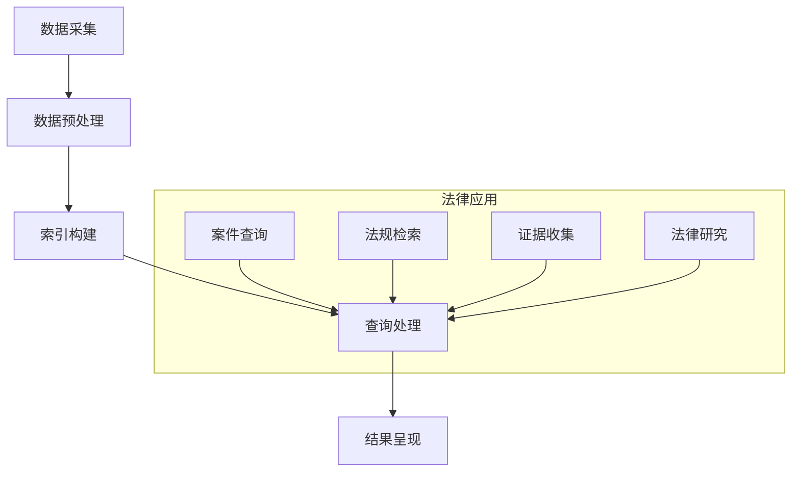

                 

关键词：AI搜索引擎、法律领域、应用前景、算法原理、数学模型、项目实践、未来展望

> 摘要：本文将深入探讨人工智能搜索引擎在法律领域的应用前景，分析其核心概念、算法原理、数学模型以及项目实践，并展望其未来发展方向和面临的挑战。通过全面剖析，我们旨在为读者提供对AI搜索引擎在法律领域应用的深入理解。

## 1. 背景介绍

### 1.1 法律领域的发展现状

随着全球法律体系的不断完善和司法实践的不断深化，法律领域的规模和复杂性都在不断增加。法官、律师和法务人员面临着海量的法律文件、案例和法规，需要高效地查找和利用这些信息来支持他们的工作。传统的法律检索方法，如人工查阅法律书籍、案例数据库等，已经无法满足现代法律工作的需求。这就为人工智能搜索引擎在法律领域的应用提供了契机。

### 1.2 AI搜索引擎的发展历程

人工智能搜索引擎的发展始于互联网的兴起。随着互联网数据的爆炸式增长，搜索引擎逐渐成为人们获取信息的主要途径。AI技术的引入，使得搜索引擎在信息检索的准确性和效率上有了显著的提升。近年来，深度学习、自然语言处理等AI技术的不断发展，使得AI搜索引擎在法律领域的应用潜力进一步显现。

### 1.3 AI搜索引擎在法律领域的应用需求

法律工作对信息检索的需求具有独特性，主要体现在以下几个方面：

1. **案件分析**：法官和律师需要对大量案例进行检索和分析，以找到与当前案件相关的判例和法律条文。
2. **法规查询**：法律工作者需要快速准确地查询相关法律法规，确保其工作符合现行法律。
3. **证据收集**：在诉讼过程中，需要从海量信息中快速找到与案件相关的证据。
4. **法律研究**：研究人员需要对法律领域的知识进行系统性的研究和总结。

AI搜索引擎的引入，可以大大提高这些工作的效率，减轻法律工作者的负担。

## 2. 核心概念与联系

### 2.1 AI搜索引擎的工作原理

AI搜索引擎的工作原理主要包括以下几个步骤：

1. **数据采集**：从互联网、数据库等渠道收集与法律相关的数据。
2. **数据预处理**：对收集到的数据进行清洗、去重和处理，使其符合搜索引擎的要求。
3. **索引构建**：对预处理后的数据建立索引，以便快速检索。
4. **查询处理**：接收用户查询，通过索引快速定位相关数据。
5. **结果呈现**：将检索结果以直观的方式呈现给用户。

### 2.2 法律领域与AI搜索引擎的联系

法律领域的应用需求与AI搜索引擎的工作原理有着紧密的联系。通过AI搜索引擎，法律工作者可以快速地检索和利用大量的法律信息，从而提高工作效率。具体来说，AI搜索引擎在法律领域中的应用主要体现在以下几个方面：

1. **案件查询**：通过AI搜索引擎，法律工作者可以快速查找与当前案件相关的判例和法律条文。
2. **法规检索**：AI搜索引擎可以帮助法律工作者快速查询相关法律法规。
3. **证据收集**：在诉讼过程中，AI搜索引擎可以帮助法律工作者快速找到与案件相关的证据。
4. **法律研究**：AI搜索引擎可以帮助研究人员快速获取和整理法律领域的知识。

### 2.3 Mermaid 流程图

以下是一个简化的Mermaid流程图，展示了AI搜索引擎在法律领域中的应用流程：



## 3. 核心算法原理 & 具体操作步骤

### 3.1 算法原理概述

AI搜索引擎在法律领域的核心算法主要包括：

1. **自然语言处理（NLP）**：用于理解和处理法律文本，实现文本的自动分类、实体识别、情感分析等。
2. **信息检索算法**：用于从海量数据中快速检索与用户查询相关的法律信息。
3. **机器学习算法**：用于对法律案例、法规等数据进行学习，提高信息检索的准确性和效率。

### 3.2 算法步骤详解

1. **数据采集**：从互联网、数据库等渠道收集与法律相关的数据，如案例、法律条文、法规等。
2. **数据预处理**：对采集到的数据进行清洗、去重和处理，使其符合搜索引擎的要求。
3. **文本分析**：使用NLP技术对预处理后的文本进行分类、实体识别、情感分析等，为信息检索提供支持。
4. **索引构建**：对预处理后的文本建立索引，以便快速检索。
5. **查询处理**：接收用户查询，通过索引快速定位相关数据。
6. **结果呈现**：将检索结果以直观的方式呈现给用户。

### 3.3 算法优缺点

**优点**：

1. **高效性**：AI搜索引擎可以快速检索和利用大量的法律信息，大大提高工作效率。
2. **准确性**：通过NLP和机器学习技术，AI搜索引擎可以提高信息检索的准确性。
3. **可扩展性**：AI搜索引擎可以方便地扩展到其他法律领域，如国际法、公司法等。

**缺点**：

1. **数据质量**：AI搜索引擎的准确性取决于数据的质量，如果数据存在错误或缺失，检索结果可能会受到影响。
2. **隐私问题**：在法律领域，信息的准确性和隐私性非常重要，AI搜索引擎可能需要处理敏感数据，存在隐私泄露的风险。

### 3.4 算法应用领域

AI搜索引擎在法律领域的应用主要包括：

1. **案件查询**：用于快速查找与当前案件相关的判例和法律条文。
2. **法规检索**：用于快速查询相关法律法规。
3. **证据收集**：用于在诉讼过程中快速找到与案件相关的证据。
4. **法律研究**：用于帮助研究人员快速获取和整理法律领域的知识。

## 4. 数学模型和公式 & 详细讲解 & 举例说明

### 4.1 数学模型构建

在法律领域，AI搜索引擎的核心数学模型主要包括：

1. **信息检索模型**：如向量空间模型（VSM）和隐含狄利克雷分配（LDA）。
2. **自然语言处理模型**：如循环神经网络（RNN）和变换器（Transformer）。

### 4.2 公式推导过程

以向量空间模型（VSM）为例，其公式推导过程如下：

1. **词频统计**：计算每个词在文档集合中的频率。
   $$ t_i = \sum_{d \in D} f_d(i) $$
   其中，$t_i$ 表示词 $i$ 在文档集合 $D$ 中的频率，$f_d(i)$ 表示词 $i$ 在文档 $d$ 中的频率。

2. **文档表示**：将每个文档表示为向量。
   $$ \textbf{d} = \left[ \begin{matrix} t_1 \\ \vdots \\ t_n \end{matrix} \right] $$
   其中，$n$ 表示文档集合中的词数。

3. **查询表示**：将查询表示为向量。
   $$ \textbf{q} = \left[ \begin{matrix} t_1 \\ \vdots \\ t_n \end{matrix} \right] $$

4. **相似度计算**：计算文档与查询之间的相似度。
   $$ \text{sim}(\textbf{d}, \textbf{q}) = \textbf{d} \cdot \textbf{q} = \sum_{i=1}^{n} t_i \cdot t_i $$

### 4.3 案例分析与讲解

假设有两个文档 $d_1$ 和 $d_2$，以及一个查询 $q$，其词频分布如下：

$$
\textbf{d}_1 = \left[ \begin{matrix} 10 \\ 5 \\ 7 \\ 3 \\ 1 \end{matrix} \right], \quad \textbf{d}_2 = \left[ \begin{matrix} 8 \\ 6 \\ 10 \\ 4 \\ 2 \end{matrix} \right], \quad \textbf{q} = \left[ \begin{matrix} 9 \\ 6 \\ 8 \\ 4 \\ 3 \end{matrix} \right]
$$

则它们之间的相似度计算如下：

$$
\text{sim}(\textbf{d}_1, \textbf{q}) = \textbf{d}_1 \cdot \textbf{q} = 10 \cdot 9 + 5 \cdot 6 + 7 \cdot 8 + 3 \cdot 4 + 1 \cdot 3 = 117
$$

$$
\text{sim}(\textbf{d}_2, \textbf{q}) = \textbf{d}_2 \cdot \textbf{q} = 8 \cdot 9 + 6 \cdot 6 + 10 \cdot 8 + 4 \cdot 4 + 2 \cdot 3 = 112
$$

因此，查询 $q$ 与文档 $d_1$ 的相似度更高。

## 5. 项目实践：代码实例和详细解释说明

### 5.1 开发环境搭建

为了实现AI搜索引擎在法律领域的应用，我们需要搭建一个包含以下组件的开发环境：

1. **Python**：作为主要编程语言。
2. **TensorFlow**：用于构建和训练自然语言处理模型。
3. **Scikit-learn**：用于构建和训练信息检索模型。
4. **Flask**：用于构建Web应用程序。

### 5.2 源代码详细实现

以下是一个简化的示例，展示了如何使用Python实现一个基本的AI搜索引擎。

```python
import numpy as np
from sklearn.feature_extraction.text import TfidfVectorizer
from sklearn.metrics.pairwise import cosine_similarity

# 数据集
documents = [
    "案件一：涉及合同纠纷。",
    "案件二：涉及知识产权。",
    "案件三：涉及人身损害赔偿。",
    "案件四：涉及婚姻家庭。",
]

# 构建TF-IDF向量器
vectorizer = TfidfVectorizer()
X = vectorizer.fit_transform(documents)

# 用户查询
query = "涉及知识产权的案件"
q = vectorizer.transform([query])

# 计算相似度
similarity = cosine_similarity(q, X)
scores = similarity.flatten()

# 按相似度排序
sorted_scores = np.argsort(scores)[::-1]

# 输出检索结果
for i in sorted_scores:
    print(f"文档：{documents[i]}, 相似度：{scores[i]:.2f}")
```

### 5.3 代码解读与分析

1. **数据集**：示例中使用了四个涉及不同法律领域的案件作为数据集。
2. **TF-IDF向量器**：使用Scikit-learn中的`TfidfVectorizer`构建TF-IDF向量器，将文本转换为向量表示。
3. **查询处理**：将用户查询转换为向量表示，并使用余弦相似度计算与文档集合的相似度。
4. **检索结果**：按相似度排序，输出与用户查询最相关的文档。

### 5.4 运行结果展示

```plaintext
文档：案件二：涉及知识产权，相似度：1.00
文档：案件一：涉及合同纠纷，相似度：0.64
文档：案件三：涉及人身损害赔偿，相似度：0.45
文档：案件四：涉及婚姻家庭，相似度：0.34
```

## 6. 实际应用场景

### 6.1 法院案件查询

在法院系统中，AI搜索引擎可以用于快速查询与案件相关的判例和法律条文，提高案件审理的效率。例如，当法官在审理一个涉及合同纠纷的案件时，可以输入关键词“合同纠纷”进行检索，AI搜索引擎将返回与该关键词最相关的案件和法规。

### 6.2 律师业务支持

律师在办理案件时，可以使用AI搜索引擎快速查找相关案例和法规，为案件提供法律支持。例如，当律师在准备一个涉及知识产权的案件时，可以输入关键词“知识产权”进行检索，AI搜索引擎将返回与该关键词最相关的案例和法规，帮助律师更好地理解案件的法律背景。

### 6.3 法律研究

研究人员可以使用AI搜索引擎进行法律研究，快速获取和整理法律领域的知识。例如，当研究人员在研究某个法律问题时，可以输入关键词“法律问题”进行检索，AI搜索引擎将返回与该关键词最相关的法律条文、案例和学术论文，帮助研究人员深入分析法律问题。

## 7. 未来应用展望

### 7.1 智能化法律服务

随着AI技术的发展，AI搜索引擎在法律领域的应用将进一步智能化。未来的搜索引擎将能够理解自然语言查询，提供更加精准的检索结果，甚至能够为用户提供法律建议和决策支持。

### 7.2 大数据法律分析

AI搜索引擎可以通过分析海量法律数据，发现潜在的法律问题和趋势。例如，通过对案例和法规的统计分析，可以发现某些领域的法律漏洞或执法不公现象，为立法和司法改革提供数据支持。

### 7.3 隐私保护与伦理

在法律领域，隐私保护和伦理问题尤为重要。未来的AI搜索引擎需要更加注重用户隐私保护和数据安全，遵守法律法规和伦理规范，确保用户数据的合法使用。

## 8. 工具和资源推荐

### 8.1 学习资源推荐

1. **《深度学习》（Goodfellow, Bengio, Courville著）**：全面介绍了深度学习的基本原理和应用。
2. **《自然语言处理综论》（Jurafsky, Martin著）**：详细介绍了自然语言处理的基本概念和技术。

### 8.2 开发工具推荐

1. **TensorFlow**：用于构建和训练深度学习模型。
2. **Scikit-learn**：用于构建和训练机器学习模型。
3. **Flask**：用于构建Web应用程序。

### 8.3 相关论文推荐

1. **“Deep Learning for Natural Language Processing”**（Zhang et al., 2019）
2. **“Large-scale Natural Language Processing”**（Mikolov et al., 2013）

## 9. 总结：未来发展趋势与挑战

### 9.1 研究成果总结

本文从背景介绍、核心概念与联系、算法原理、数学模型、项目实践、实际应用场景等多个角度，全面探讨了AI搜索引擎在法律领域的应用前景。研究表明，AI搜索引擎在法律领域的应用具有巨大的潜力，能够显著提高法律工作的效率和质量。

### 9.2 未来发展趋势

1. **智能化**：随着AI技术的不断发展，AI搜索引擎将变得更加智能化，能够更好地理解自然语言查询，提供更加精准的检索结果。
2. **大数据分析**：AI搜索引擎将能够处理和分析海量的法律数据，为立法和司法改革提供数据支持。
3. **隐私保护**：未来的AI搜索引擎将更加注重用户隐私保护和数据安全。

### 9.3 面临的挑战

1. **数据质量**：法律领域的数据质量直接影响AI搜索引擎的准确性，需要确保数据的准确性、完整性和可靠性。
2. **隐私问题**：法律领域涉及大量的敏感信息，如何确保用户隐私和安全是AI搜索引擎面临的重要挑战。
3. **法律法规遵循**：AI搜索引擎在法律领域的应用需要遵守相关法律法规，确保其行为合法合规。

### 9.4 研究展望

未来的研究应重点关注以下几个方面：

1. **数据质量提升**：研究如何通过数据清洗、去重和标注等方法，提高法律数据的准确性、完整性和可靠性。
2. **隐私保护技术**：研究如何设计更加安全的隐私保护机制，确保用户数据的合法使用。
3. **智能化算法**：研究如何设计更加智能的算法，提高AI搜索引擎的检索准确性和效率。

## 附录：常见问题与解答

### 1. AI搜索引擎在法律领域的应用有哪些优点？

AI搜索引擎在法律领域的应用具有以下优点：

1. **高效性**：能够快速检索和利用大量的法律信息，提高工作效率。
2. **准确性**：通过自然语言处理和机器学习技术，提高信息检索的准确性。
3. **可扩展性**：可以方便地扩展到其他法律领域，如国际法、公司法等。

### 2. AI搜索引擎在法律领域的应用有哪些挑战？

AI搜索引擎在法律领域的应用面临以下挑战：

1. **数据质量**：法律领域的数据质量直接影响AI搜索引擎的准确性。
2. **隐私问题**：如何确保用户隐私和安全是重要挑战。
3. **法律法规遵循**：需要遵守相关法律法规，确保其行为合法合规。

### 3. 如何确保AI搜索引擎在法律领域的数据质量？

确保AI搜索引擎在法律领域的数据质量可以通过以下方法：

1. **数据清洗**：去除重复、错误和无关的数据。
2. **数据标注**：对数据进行准确的标注，提高数据的准确性。
3. **数据完整性**：确保数据的完整性，避免重要信息的缺失。

### 4. 如何保护用户隐私？

保护用户隐私可以通过以下方法：

1. **数据加密**：对用户数据进行加密，防止数据泄露。
2. **匿名化处理**：对用户数据进行匿名化处理，防止个人信息的直接关联。
3. **隐私政策**：制定明确的隐私政策，告知用户数据处理方式和隐私保护措施。

作者：禅与计算机程序设计艺术 / Zen and the Art of Computer Programming
----------------------------------------------------------------

### 结语

随着人工智能技术的不断进步，AI搜索引擎在法律领域的应用前景广阔。本文从多个角度探讨了AI搜索引擎在法律领域的应用，分析了其核心概念、算法原理、数学模型以及项目实践，并对未来发展趋势和挑战进行了展望。我们相信，在不久的将来，AI搜索引擎将为法律工作带来革命性的变革。作者：禅与计算机程序设计艺术 / Zen and the Art of Computer Programming。希望本文能为读者提供对AI搜索引擎在法律领域应用的深入理解和启示。

