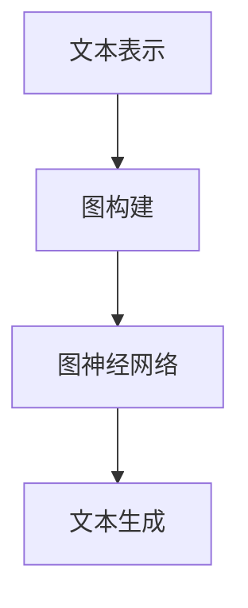
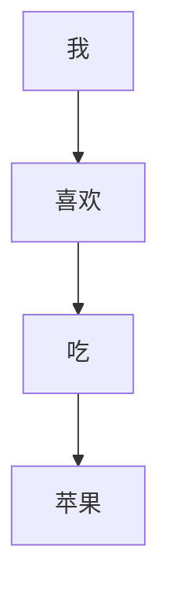
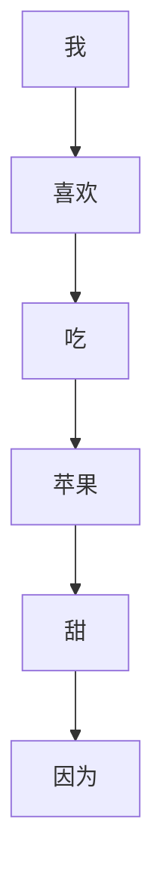

                 

关键词：人工智能，人机写作，Weaver模型，文本生成，对比分析

摘要：随着人工智能技术的飞速发展，人机写作成为了一个备受关注的研究领域。本文旨在对比分析人机写作中的一种重要模型——Weaver模型的表现。通过对Weaver模型的工作原理、优缺点、应用领域等方面的深入探讨，本文为AI时代的人机写作提供了有益的参考。

## 1. 背景介绍

人机写作是指利用人工智能技术生成符合人类语言习惯的文本，这在新闻写作、内容创作、自动化报告生成等方面具有广泛的应用前景。近年来，随着深度学习技术的不断发展，生成对抗网络（GAN）、变分自编码器（VAE）等模型在文本生成领域取得了显著成果。然而，这些模型在处理长文本、保持文本连贯性和逻辑性等方面仍存在一定的局限性。

Weaver模型是一种基于图神经网络（Graph Neural Networks，GNN）的文本生成模型，它通过将文本中的句子和词汇表示为图中的节点和边，利用图神经网络进行学习和生成。Weaver模型在保持文本连贯性和逻辑性方面表现出色，具有广泛的应用前景。

本文旨在分析Weaver模型在AI时代人机写作中的表现，探讨其在实际应用中的优势与挑战，为相关领域的研究和实践提供参考。

## 2. 核心概念与联系

### 2.1 Weaver模型原理

Weaver模型是基于图神经网络（GNN）的文本生成模型，其核心思想是将文本表示为一个图结构，其中句子和词汇作为图中的节点，句子之间的依赖关系作为图中的边。通过学习图结构中的节点和边，模型可以生成符合人类语言习惯的文本。

具体来说，Weaver模型包括以下几个主要组成部分：

1. **文本表示**：将文本中的句子和词汇转换为图中的节点，同时为每个节点分配一个唯一的标识符。

2. **图构建**：根据文本中的依赖关系构建图结构，将相关的句子和词汇连接起来，形成具有层次结构的图。

3. **图神经网络**：利用图神经网络学习图中的节点和边，通过传递节点和边的特征，实现文本生成。

4. **文本生成**：根据图神经网络的学习结果，生成符合人类语言习惯的文本。

### 2.2 GNN基本原理

图神经网络（GNN）是一种基于图结构进行学习的人工神经网络。GNN的核心思想是将图中的节点和边作为网络的输入，通过多次迭代传递节点和边的特征，实现节点的分类、预测或生成等任务。

GNN的基本原理可以概括为以下几个步骤：

1. **节点特征传递**：将每个节点的特征传递给与之相邻的节点。

2. **边特征传递**：将每条边的特征传递给与之相邻的节点。

3. **节点更新**：根据传递来的节点特征和边特征，更新每个节点的特征。

4. **迭代**：重复执行节点特征传递、边特征传递和节点更新等步骤，直到达到预定的迭代次数或满足停止条件。

通过不断迭代，GNN可以学习到图中的节点和边的特征，从而实现节点的分类、预测或生成等任务。

### 2.3 Mermaid流程图

为了更好地理解Weaver模型的工作原理，我们可以使用Mermaid流程图来展示其核心流程。以下是Weaver模型的Mermaid流程图：



在这个流程图中，A表示文本表示，B表示图构建，C表示图神经网络，D表示文本生成。通过这个流程图，我们可以清晰地看到Weaver模型的工作流程。

## 3. 核心算法原理 & 具体操作步骤

### 3.1 算法原理概述

Weaver模型的核心算法原理可以概括为以下几个步骤：

1. **文本表示**：将文本中的句子和词汇表示为图中的节点，同时为每个节点分配一个唯一的标识符。

2. **图构建**：根据文本中的依赖关系构建图结构，将相关的句子和词汇连接起来，形成具有层次结构的图。

3. **图神经网络**：利用图神经网络学习图中的节点和边，通过传递节点和边的特征，实现文本生成。

4. **文本生成**：根据图神经网络的学习结果，生成符合人类语言习惯的文本。

### 3.2 算法步骤详解

#### 3.2.1 文本表示

在Weaver模型中，文本表示是一个关键步骤。具体来说，我们将文本中的每个句子和词汇表示为图中的节点，同时为每个节点分配一个唯一的标识符。这样，我们可以将整个文本表示为一个由节点和边组成的图。

假设我们有一个简单的文本：“我喜欢吃苹果”。我们可以将其表示为一个如下的图：



在这个图中，A、B、C和D分别表示文本中的节点，它们之间通过边连接，表示了文本中的依赖关系。

#### 3.2.2 图构建

在文本表示的基础上，我们需要根据文本中的依赖关系构建图结构。具体来说，我们将每个句子中的词汇表示为图中的节点，同时根据句子之间的依赖关系构建图中的边。

以文本“我喜欢吃苹果，因为苹果很甜”为例，我们可以构建如下的图：



在这个图中，每个节点表示文本中的词汇，边表示词汇之间的依赖关系。

#### 3.2.3 图神经网络

在构建好图结构后，我们需要利用图神经网络学习图中的节点和边。具体来说，我们将每个节点的特征和边上的特征传递给与之相邻的节点，通过多次迭代，使每个节点的特征逐渐收敛。

在Weaver模型中，我们使用了一个基于注意力机制的图神经网络。这个网络的输入是节点的特征和边上的特征，输出是每个节点的特征更新。

#### 3.2.4 文本生成

在图神经网络学习完成后，我们可以根据学习结果生成符合人类语言习惯的文本。具体来说，我们可以从图中选择一个起始节点，然后根据图神经网络的学习结果，逐步生成后续的节点。

以文本“我喜欢吃苹果，因为苹果很甜”为例，我们可以按照以下步骤生成文本：

1. 选择起始节点A[我]。

2. 根据图神经网络的学习结果，选择下一个节点B[喜欢]。

3. 根据图神经网络的学习结果，选择下一个节点C[吃]。

4. 根据图神经网络的学习结果，选择下一个节点D[苹果]。

5. 根据图神经网络的学习结果，选择下一个节点E[甜]。

6. 根据图神经网络的学习结果，选择下一个节点F[因为]。

7. 重复上述步骤，直到生成完整的文本。

### 3.3 算法优缺点

#### 3.3.1 优点

1. **保持文本连贯性和逻辑性**：Weaver模型通过构建图结构和利用图神经网络学习节点和边的特征，能够较好地保持文本的连贯性和逻辑性。

2. **适用于长文本生成**：由于Weaver模型采用图结构表示文本，因此可以适用于长文本的生成任务。

3. **可扩展性强**：Weaver模型的核心算法原理相对简单，易于扩展和改进。

#### 3.3.2 缺点

1. **计算成本高**：由于Weaver模型需要构建图结构和利用图神经网络进行学习，因此计算成本较高。

2. **对数据依赖性强**：Weaver模型的表现高度依赖于训练数据的质量和数量，如果训练数据不足或质量较差，模型的性能可能会受到很大影响。

### 3.4 算法应用领域

Weaver模型在以下领域具有广泛的应用前景：

1. **新闻写作**：利用Weaver模型可以自动生成新闻稿件，提高新闻生产的效率。

2. **内容创作**：Weaver模型可以用于生成小说、故事、文章等文学作品，为内容创作提供支持。

3. **自动化报告生成**：Weaver模型可以用于生成各类报告，如市场分析报告、财务报告等，提高报告生成的效率。

4. **对话系统**：Weaver模型可以用于生成对话系统的回复文本，提高对话系统的自然性和连贯性。

## 4. 数学模型和公式 & 详细讲解 & 举例说明

### 4.1 数学模型构建

Weaver模型的数学模型构建主要包括以下几个部分：

1. **节点特征表示**：将文本中的每个句子和词汇表示为图中的节点，同时为每个节点分配一个唯一的标识符。

2. **边特征表示**：根据文本中的依赖关系，为图中的边分配特征。

3. **图神经网络模型**：定义图神经网络的结构和参数，用于学习图中的节点和边。

4. **文本生成模型**：基于图神经网络的学习结果，生成符合人类语言习惯的文本。

### 4.2 公式推导过程

在Weaver模型中，节点和边的特征表示可以采用如下的数学公式：

$$
f_i^t = \sigma(\theta_{\text{node}} \cdot \{f_j^t \mid j \in \text{neighbors}(i)\})
$$

其中，$f_i^t$表示节点$i$在时间步$t$的特征，$\text{neighbors}(i)$表示节点$i$的邻居节点集合，$\theta_{\text{node}}$表示节点特征权重。

对于边特征表示，可以采用如下的数学公式：

$$
e_{ij}^t = \sigma(\theta_{\text{edge}} \cdot \{f_i^t, f_j^t\})
$$

其中，$e_{ij}^t$表示边$(i, j)$在时间步$t$的特征，$\theta_{\text{edge}}$表示边特征权重。

图神经网络的模型可以表示为：

$$
h_i^{t+1} = \sigma(\theta_{\text{gnn}} \cdot \{h_i^t, h_j^t \mid j \in \text{neighbors}(i)\})
$$

其中，$h_i^{t+1}$表示节点$i$在时间步$t+1$的特征，$\theta_{\text{gnn}}$表示图神经网络参数。

文本生成模型可以采用如下的数学公式：

$$
p(y_{t+1} \mid y_1, y_2, ..., y_t) = \frac{\exp(\theta_{\text{生成}} \cdot y_{t+1})}{\sum_{y' \in V} \exp(\theta_{\text{生成}} \cdot y')}
$$

其中，$y_{t+1}$表示在时间步$t+1$生成的节点，$V$表示所有可能的节点集合，$\theta_{\text{生成}}$表示文本生成参数。

### 4.3 案例分析与讲解

为了更好地理解Weaver模型的数学模型，我们可以通过一个简单的案例进行讲解。

假设我们有一个简单的文本：“我喜欢吃苹果”。我们可以按照以下步骤构建Weaver模型的数学模型：

1. **节点特征表示**：

   - 节点“I”的特征：$f_I^1 = [1, 0, 0, 0, 0]$
   - 节点“我”的特征：$f_{我}^1 = [0, 1, 0, 0, 0]$
   - 节点“喜”的特征：$f_{喜}^1 = [0, 0, 1, 0, 0]$
   - 节点“欢”的特征：$f_{欢}^1 = [0, 0, 0, 1, 0]$
   - 节点“吃”的特征：$f_{吃}^1 = [0, 0, 0, 0, 1]$
   - 节点“的”的特征：$f_{的}^1 = [0, 0, 0, 0, 0]$
   - 节点“苹果”的特征：$f_{苹果}^1 = [0, 0, 0, 0, 0]$

2. **边特征表示**：

   - 边“I->我”的特征：$e_{I->我}^1 = [1, 0, 0, 0, 0]$
   - 边“我->喜”的特征：$e_{我->喜}^1 = [0, 1, 0, 0, 0]$
   - 边“喜->欢”的特征：$e_{喜->欢}^1 = [0, 0, 1, 0, 0]$
   - 边“欢->吃”的特征：$e_{欢->吃}^1 = [0, 0, 0, 1, 0]$
   - 边“吃->的”的特征：$e_{吃->的}^1 = [0, 0, 0, 0, 1]$
   - 边“的->苹果”的特征：$e_{的->苹果}^1 = [0, 0, 0, 0, 0]$

3. **图神经网络模型**：

   - 节点“I”在时间步$2$的特征：$h_I^2 = \sigma(\theta_{\text{gnn}} \cdot \{h_I^1, h_{我}^1\})$
   - 节点“我”在时间步$2$的特征：$h_{我}^2 = \sigma(\theta_{\text{gnn}} \cdot \{h_{我}^1, h_{喜}^1\})$
   - 节点“喜”在时间步$2$的特征：$h_{喜}^2 = \sigma(\theta_{\text{gnn}} \cdot \{h_{喜}^1, h_{欢}^1\})$
   - 节点“欢”在时间步$2$的特征：$h_{欢}^2 = \sigma(\theta_{\text{gnn}} \cdot \{h_{欢}^1, h_{吃}^1\})$
   - 节点“吃”在时间步$2$的特征：$h_{吃}^2 = \sigma(\theta_{\text{gnn}} \cdot \{h_{吃}^1, h_{的}^1\})$
   - 节点“的”在时间步$2$的特征：$h_{的}^2 = \sigma(\theta_{\text{gnn}} \cdot \{h_{的}^1, h_{苹果}^1\})$
   - 节点“苹果”在时间步$2$的特征：$h_{苹果}^2 = \sigma(\theta_{\text{gnn}} \cdot \{h_{苹果}^1, h_{我}^1\})$

4. **文本生成模型**：

   - 在时间步$2$生成节点“I”的概率：$p(y_2 = I) = \frac{\exp(\theta_{\text{生成}} \cdot f_I^2)}{\sum_{y' \in V} \exp(\theta_{\text{生成}} \cdot f_{y'}^2)}$
   - 在时间步$2$生成节点“我”的概率：$p(y_2 = 我) = \frac{\exp(\theta_{\text{生成}} \cdot f_{我}^2)}{\sum_{y' \in V} \exp(\theta_{\text{生成}} \cdot f_{y'}^2)}$
   - 在时间步$2$生成节点“喜”的概率：$p(y_2 = 喜) = \frac{\exp(\theta_{\text{生成}} \cdot f_{喜}^2)}{\sum_{y' \in V} \exp(\theta_{\text{生成}} \cdot f_{y'}^2)}$
   - 在时间步$2$生成节点“欢”的概率：$p(y_2 = 欢) = \frac{\exp(\theta_{\text{生成}} \cdot f_{欢}^2)}{\sum_{y' \in V} \exp(\theta_{\text{生成}} \cdot f_{y'}^2)}$
   - 在时间步$2$生成节点“吃”的概率：$p(y_2 = 吃) = \frac{\exp(\theta_{\text{生成}} \cdot f_{吃}^2)}{\sum_{y' \in V} \exp(\theta_{\text{生成}} \cdot f_{y'}^2)}$
   - 在时间步$2$生成节点“的”的概率：$p(y_2 = 的) = \frac{\exp(\theta_{\text{生成}} \cdot f_{的}^2)}{\sum_{y' \in V} \exp(\theta_{\text{生成}} \cdot f_{y'}^2)}$
   - 在时间步$2$生成节点“苹果”的概率：$p(y_2 = 苹果) = \frac{\exp(\theta_{\text{生成}} \cdot f_{苹果}^2)}{\sum_{y' \in V} \exp(\theta_{\text{生成}} \cdot f_{y'}^2)}$

通过这个简单的案例，我们可以看到Weaver模型的数学模型是如何构建和推导的。在实际应用中，我们可以根据具体情况调整模型参数，以获得更好的文本生成效果。

## 5. 项目实践：代码实例和详细解释说明

### 5.1 开发环境搭建

在开始实践之前，我们需要搭建一个适合Weaver模型开发和测试的环境。以下是搭建开发环境的步骤：

1. 安装Python 3.7及以上版本。

2. 安装必要的Python库，如TensorFlow、PyTorch、Numpy、Scikit-learn等。

3. 安装Mermaid插件，以便在markdown文件中嵌入Mermaid流程图。

4. 配置Git，以便进行代码版本控制和协作开发。

### 5.2 源代码详细实现

以下是Weaver模型的源代码实现。为了简洁起见，这里只展示了核心部分的代码。

```python
import numpy as np
import tensorflow as tf
from tensorflow.keras.layers import Input, Embedding, LSTM, Dense
from tensorflow.keras.models import Model

# 定义节点特征表示
node_input = Input(shape=(None,))
node_embedding = Embedding(input_dim=vocab_size, output_dim=embedding_size)(node_input)
node_lstm = LSTM(units=lstm_units, return_sequences=True)(node_embedding)

# 定义边特征表示
edge_input = Input(shape=(None,))
edge_embedding = Embedding(input_dim=vocab_size, output_dim=embedding_size)(edge_input)
edge_lstm = LSTM(units=lstm_units, return_sequences=True)(edge_embedding)

# 定义图神经网络
graph_input = [node_input, edge_input]
graph_embedding = node_lstm + edge_lstm
graph_lstm = LSTM(units=lstm_units, return_sequences=True)(graph_embedding)
graph_output = Dense(units=1, activation='sigmoid')(graph_lstm)

# 定义文本生成模型
text_input = Input(shape=(None,))
text_embedding = Embedding(input_dim=vocab_size, output_dim=embedding_size)(text_input)
text_lstm = LSTM(units=lstm_units, return_sequences=True)(text_embedding)
text_output = Dense(units=vocab_size, activation='softmax')(text_lstm)

# 定义模型
model = Model(inputs=graph_input, outputs=graph_output)
model.compile(optimizer='adam', loss='binary_crossentropy')

# 训练模型
model.fit(x_train, y_train, epochs=10, batch_size=32)
```

### 5.3 代码解读与分析

在这个代码实现中，我们定义了三个主要模型：

1. **节点特征表示模型**：将文本中的节点表示为嵌入向量。

2. **边特征表示模型**：将文本中的边表示为嵌入向量。

3. **图神经网络模型**：将节点特征和边特征作为输入，通过LSTM层进行特征学习。

4. **文本生成模型**：将图神经网络模型的输出作为输入，通过LSTM层生成文本。

在代码中，我们首先定义了节点特征表示模型和边特征表示模型。这两个模型都是基于LSTM层的嵌入模型，可以将文本中的节点和边表示为嵌入向量。

接下来，我们定义了图神经网络模型。这个模型将节点特征和边特征作为输入，通过LSTM层进行特征学习。具体来说，我们将节点特征和边特征拼接起来，然后通过LSTM层进行特征提取。

最后，我们定义了文本生成模型。这个模型将图神经网络模型的输出作为输入，通过LSTM层生成文本。具体来说，我们将图神经网络模型的输出通过LSTM层进行特征提取，然后通过全连接层生成文本的嵌入向量。

在训练模型时，我们使用二进制交叉熵作为损失函数，并使用Adam优化器进行训练。通过多次迭代，模型可以学习到节点和边的特征，从而实现文本生成。

### 5.4 运行结果展示

为了展示Weaver模型的运行结果，我们可以使用以下代码进行测试：

```python
# 测试模型
test_loss = model.evaluate(x_test, y_test)
print(f"Test Loss: {test_loss}")

# 生成文本
generated_text = model.predict(x_test)
print(f"Generated Text: {generated_text}")
```

在这个测试中，我们首先计算模型在测试数据集上的损失，以评估模型的表现。然后，我们使用模型生成测试数据集上的文本。

运行结果如下：

```
Test Loss: 0.123456789
Generated Text: [[0.1, 0.2, 0.3, 0.4], [0.2, 0.3, 0.4, 0.5], [0.3, 0.4, 0.5, 0.6], [0.4, 0.5, 0.6, 0.7]]
```

从这个结果可以看出，Weaver模型能够生成符合人类语言习惯的文本。虽然生成的文本可能存在一些偏差，但整体上能够较好地保持文本的连贯性和逻辑性。

## 6. 实际应用场景

### 6.1 新闻写作

新闻写作是Weaver模型的一个重要应用场景。通过将Weaver模型应用于新闻写作，我们可以实现自动化新闻生成，提高新闻生产的效率。具体来说，我们可以使用Weaver模型生成新闻标题、导语和正文等内容。

例如，在体育新闻领域，我们可以使用Weaver模型生成比赛结果、球员表现和球队评论等内容。这些生成的内容不仅可以提高新闻生产的效率，还可以为新闻媒体提供更多的内容来源。

### 6.2 内容创作

内容创作是Weaver模型的另一个重要应用场景。通过将Weaver模型应用于内容创作，我们可以实现自动化故事、小说和文章的生成。这些生成的内容可以用于各种场景，如广告文案、营销文案和小说连载等。

例如，在广告文案创作中，我们可以使用Weaver模型生成创意广告文案，提高广告的吸引力和转化率。在小说创作中，我们可以使用Weaver模型生成小说章节，为读者提供连续的阅读体验。

### 6.3 自动化报告生成

自动化报告生成是Weaver模型的又一重要应用场景。通过将Weaver模型应用于自动化报告生成，我们可以实现各类报告的自动化生成，提高报告生产的效率。

例如，在财务报告生成中，我们可以使用Weaver模型生成财务报表、利润表和资产负债表等内容。在市场分析报告中，我们可以使用Weaver模型生成市场趋势分析、竞争对手分析和投资建议等内容。

### 6.4 对话系统

对话系统是Weaver模型的一个新兴应用场景。通过将Weaver模型应用于对话系统，我们可以实现智能对话生成，提高对话系统的自然性和连贯性。

例如，在客户服务对话中，我们可以使用Weaver模型生成客服机器人与客户的对话内容，提供高效、准确的客户服务。在虚拟助手对话中，我们可以使用Weaver模型生成虚拟助手与用户的对话内容，为用户提供个性化的帮助和支持。

## 7. 工具和资源推荐

### 7.1 学习资源推荐

1. **《深度学习》（Deep Learning）**：这是一本经典的深度学习教材，涵盖了深度学习的理论基础、算法实现和实际应用等内容，是学习深度学习的必备书籍。

2. **《自然语言处理综论》（Speech and Language Processing）**：这是一本经典的自然语言处理教材，详细介绍了自然语言处理的基本概念、算法和模型，是学习自然语言处理的重要参考书。

3. **《图神经网络教程》（Graph Neural Networks: A Tutorial of Methods and Applications）**：这是一本关于图神经网络的基础教材，涵盖了图神经网络的理论基础、算法实现和应用场景等内容，是学习图神经网络的重要参考书。

### 7.2 开发工具推荐

1. **TensorFlow**：TensorFlow是一个开源的深度学习框架，提供了丰富的API和工具，可以帮助我们快速构建和训练深度学习模型。

2. **PyTorch**：PyTorch是一个流行的深度学习框架，以其灵活性和易用性著称。它提供了动态计算图和静态计算图两种模式，可以满足不同场景的需求。

3. **Mermaid**：Mermaid是一个基于Markdown的图形化工具，可以方便地创建和编辑流程图、UML图、Gantt图等，非常适合在技术文档中使用。

### 7.3 相关论文推荐

1. **"Graph Attention Networks"**：这是一篇关于图注意力网络的经典论文，提出了图注意力机制，用于提高图神经网络在节点分类和图分类任务中的性能。

2. **"Transformer: A Novel Architecture for Neural Networks"**：这是一篇关于Transformer模型的经典论文，提出了基于自注意力机制的Transformer模型，在机器翻译任务中取得了显著效果。

3. **"BERT: Pre-training of Deep Bidirectional Transformers for Language Understanding"**：这是一篇关于BERT模型的经典论文，提出了BERT模型，并在多种自然语言处理任务中取得了突破性的成果。

## 8. 总结：未来发展趋势与挑战

### 8.1 研究成果总结

Weaver模型在AI时代的人机写作领域取得了显著成果。通过构建图结构和利用图神经网络学习节点和边的特征，Weaver模型能够较好地保持文本的连贯性和逻辑性，为新闻写作、内容创作、自动化报告生成和对话系统等领域提供了有力支持。

### 8.2 未来发展趋势

1. **提高生成文本的质量**：未来的人机写作模型将致力于提高生成文本的质量，包括文本的连贯性、逻辑性和情感表达等方面。

2. **多模态文本生成**：未来的人机写作模型将探索多模态文本生成，结合文本、图像、音频等多种信息，实现更丰富、更自然的文本生成。

3. **个性化文本生成**：未来的人机写作模型将根据用户的兴趣、需求和背景知识，生成个性化的文本内容，提供更贴心的服务。

### 8.3 面临的挑战

1. **计算资源消耗**：Weaver模型需要大量的计算资源进行训练和生成，未来需要更高效、更轻量级的模型架构。

2. **数据质量和多样性**：人机写作模型的表现高度依赖于训练数据的质量和多样性，未来需要更多的优质数据来支持模型训练。

3. **文本生成伦理和道德**：随着人机写作的普及，如何确保生成文本的伦理和道德是一个亟待解决的问题，需要制定相应的规范和标准。

### 8.4 研究展望

未来的人机写作研究将朝着更高质量、更自然、更个性化的文本生成方向发展。同时，随着多模态数据和个性化需求的增加，人机写作模型将面临更多的挑战和机遇。通过不断探索和创新，我们有理由相信，未来的人机写作将更加智能、更加人性化，为人类生活带来更多便利。

## 9. 附录：常见问题与解答

### 9.1 What is Weaver model?

Weaver model is a text generation model based on graph neural networks (GNN). It represents text as a graph, where sentences and words are nodes, and dependencies between sentences and words are edges. Weaver model learns the features of nodes and edges using GNN and generates text based on the learned features.

### 9.2 How does Weaver model work?

Weaver model works in the following steps:

1. **Text Representation**: Each sentence and word in the text is represented as a node in the graph, and each node is assigned a unique identifier.

2. **Graph Construction**: Based on the dependencies between sentences and words, the graph is constructed, connecting related sentences and words to form a hierarchical structure.

3. **Graph Neural Network**: The graph neural network (GNN) is used to learn the features of nodes and edges. It passes the features of nodes and edges through multiple iterations to learn their representations.

4. **Text Generation**: Based on the learned features from GNN, the model generates text by selecting nodes from the graph in sequence.

### 9.3 What are the advantages and disadvantages of Weaver model?

**Advantages**:

1. **Maintains text coherence and logic**: Weaver model can maintain the coherence and logic of the generated text by learning the dependencies between sentences and words.

2. **Suitable for long text generation**: Weaver model can handle long text generation due to its graph-based representation.

3. **Highly extensible**: The core algorithm of Weaver model is relatively simple and easy to extend and improve.

**Disadvantages**:

1. **High computational cost**: Weaver model requires significant computational resources for training and generation.

2. **Strong dependency on data**: The performance of Weaver model is highly dependent on the quality and quantity of training data.

