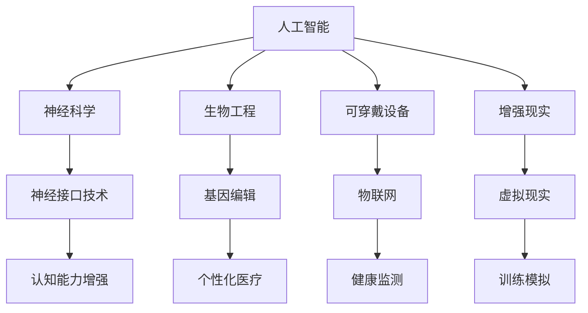

                 

关键词：人工智能、人类增强、道德考虑、身体增强、未来发展、挑战

> 摘要：本文深入探讨了AI时代人类增强的道德考虑以及身体增强的未来发展机遇与挑战。通过分析当前技术进展、伦理问题和社会影响，本文旨在提供一个全面的技术视角，以促进对这一领域的深入理解和前瞻性思考。

## 1. 背景介绍

随着人工智能（AI）技术的迅猛发展，人类在多个领域实现了前所未有的进步。从医疗诊断到交通管理，从教育辅助到金融决策，AI的应用已经深深嵌入我们的日常生活。然而，随着AI技术的进一步深入，人类也开始探索如何通过身体增强来提高自身的体力和智力水平。这种趋势不仅引发了技术层面的讨论，也引发了道德、社会和法律层面的广泛关注。

人类增强的概念可以追溯到古希腊神话中的赫拉克勒斯，他通过使用药草和锻炼来增强自己的力量。如今，随着科技的进步，人类增强的手段已经不再局限于药物和锻炼。例如，基因编辑、神经接口技术、可穿戴设备等新兴技术，正在为我们提供前所未有的增强可能性。然而，这些技术的应用也带来了深刻的伦理问题，例如个人隐私、数据安全、社会公平等。

本文将首先介绍AI时代人类增强的主要技术手段，然后探讨道德考虑的重要性，并分析身体增强的未来发展机遇与挑战。最后，本文将总结研究成果，展望未来发展趋势，并讨论面临的挑战。

### 1.1 人类增强的技术手段

当前，人类增强主要依赖于以下几个技术领域：

1. **基因编辑**：通过CRISPR-Cas9等基因编辑技术，科学家可以精准地修改人类基因，从而预防或治疗遗传性疾病，甚至可能实现特定能力的增强。

2. **神经接口技术**：这类技术通过将大脑与外部设备连接，使人类能够直接与计算机或其他设备进行通信，从而增强认知能力和运动能力。

3. **可穿戴设备**：如智能眼镜、智能手环等，这些设备可以通过监测生理数据、提供虚拟现实体验等方式，帮助用户更好地管理自己的健康和日常活动。

4. **增强现实（AR）和虚拟现实（VR）**：通过AR和VR技术，用户可以在虚拟环境中进行训练和模拟，从而增强实际操作技能和认知能力。

5. **生物电子学**：这一领域结合了生物学和电子学，通过开发植入式生物电子设备，如心脏起搏器、胰岛素泵等，来改善或增强人类的生理功能。

### 1.2 人类增强的历史背景

人类寻求自身增强的历史可以追溯到古代。例如，古希腊和罗马的运动员通过草药和锻炼来增强自己的体能。中世纪时期，人们开始使用药物来改善健康和增强性能力。随着工业革命的到来，人类开始通过机械设备来增强体力劳动的能力。

进入20世纪，随着生物技术和医学的发展，人类增强的手段更加多样化和精准化。从抗生素到心脏移植，医学技术为人类带来了前所未有的健康水平和生活质量。随着计算机科学和人工智能的兴起，人类开始探索如何通过技术手段进一步增强自身的能力。

## 2. 核心概念与联系

在探讨AI时代的人类增强时，我们需要理解一些核心概念和它们之间的相互联系。这些概念不仅构成了人类增强的基础，也为我们提供了理解和评估这一领域的关键框架。

### 2.1 人工智能与人类增强

人工智能（AI）是推动人类增强的核心技术之一。通过AI算法，我们可以设计出能够模拟、扩展和增强人类智能的系统。例如，机器学习算法可以分析大量数据，帮助医生做出更准确的诊断；自然语言处理技术可以辅助人类进行更高效的语言交流；计算机视觉算法可以用于辅助盲人“看到”周围的世界。

### 2.2 神经科学和神经接口技术

神经科学是理解和利用人类大脑功能的基础。通过研究大脑的结构和功能，科学家可以开发出神经接口技术，这些技术可以直接与大脑通信，从而实现认知能力的增强。例如，脑机接口（BMI）可以通过电信号将大脑活动转化为机器指令，使瘫痪的病人能够控制外部设备。

### 2.3 生物工程与基因编辑

生物工程是另一个关键领域，它结合了生物学、化学和工程学的原理，以设计新的生物系统和产品。基因编辑技术，如CRISPR-Cas9，可以精确地修改DNA序列，从而改变人类的遗传特征。这不仅有可能治疗遗传性疾病，也可能导致未来人类基因的个性化定制。

### 2.4 可穿戴设备和物联网

可穿戴设备是现代人类增强的重要工具。这些设备可以实时监测生理参数，提供个性化的健康反馈，并帮助我们更好地管理日常生活。物联网（IoT）技术的发展使得这些设备能够互联互通，形成一个智能化的健康监测和管理系统。

### 2.5 增强现实与虚拟现实

增强现实（AR）和虚拟现实（VR）技术通过提供沉浸式体验，为人类提供了新的学习、训练和工作方式。AR技术可以将虚拟信息叠加在现实环境中，而VR技术则创造了一个完全虚拟的环境。这些技术可以帮助人类在虚拟环境中进行高风险操作的模拟训练，从而提高实际操作的安全性和效率。

### 2.6 Mermaid 流程图

以下是一个简化的Mermaid流程图，展示了上述核心概念之间的相互关系：



通过这个流程图，我们可以更清晰地看到各个核心概念是如何相互联系，共同推动人类增强技术的发展。

### 2.7 伦理与法律框架

在探讨人类增强技术时，我们不能忽视伦理和法律框架的重要性。随着技术的发展，我们需要制定相应的伦理准则和法律法规，以确保人类增强的应用既安全又公正。这包括对隐私权的保护、数据安全的保障、社会公平的维护等方面。

### 2.8 社会影响

人类增强技术不仅影响个体，也对整个社会产生了深远的影响。例如，教育领域可能会因为认知能力的增强而改变教学模式；劳动力市场可能会因为身体能力的增强而面临新的挑战和机遇；社会伦理和文化价值观也可能因为人类增强的应用而发生变化。

### 2.9 总结

在AI时代，人类增强已经成为一个热门话题。通过理解核心概念和它们之间的相互联系，我们可以更好地把握这一领域的发展趋势和潜在影响。接下来，我们将深入探讨人类增强技术的具体原理和操作步骤，以更全面地了解这一领域的实际应用。

## 3. 核心算法原理 & 具体操作步骤

### 3.1 算法原理概述

在人类增强技术中，核心算法的设计和实现起到了关键作用。这些算法不仅决定了增强效果的好坏，也直接影响到技术的可靠性和安全性。以下将介绍几种常见的人类增强算法，包括其基本原理、应用场景以及操作步骤。

#### 3.1.1 基因编辑算法

基因编辑算法的核心是CRISPR-Cas9技术。CRISPR-Cas9是一种基于RNA引导的DNA编辑工具，通过Cas9核酸酶切割目标DNA序列，从而实现基因的插入、删除或替换。

**基本原理**：
1. 设计特定的单链RNA分子（sgRNA），该分子包含与目标DNA序列互补的序列。
2. sgRNA引导Cas9核酸酶识别并切割目标DNA序列。
3. 通过DNA修复机制，引入所需的基因修改。

**应用场景**：
- 遗传性疾病的治疗
- 特定能力的基因增强
- 基因组编辑研究

**操作步骤**：

1. **设计sgRNA**：根据目标DNA序列设计特异性sgRNA。
2. **构建表达载体**：将Cas9基因和sgRNA插入到表达载体中，构建基因编辑工具。
3. **细胞培养**：在细胞培养过程中加入基因编辑工具。
4. **筛选编辑细胞**：通过PCR或其他方法检测编辑细胞，筛选出成功编辑的细胞。
5. **验证编辑结果**：通过测序或基因表达分析验证编辑结果。

#### 3.1.2 神经接口算法

神经接口技术通过将大脑信号与外部设备连接，实现认知能力的增强。常见的算法包括脑机接口（BMI）信号处理算法。

**基本原理**：
1. **信号采集**：通过电极阵列采集大脑信号。
2. **信号预处理**：去除噪声，增强信号特征。
3. **特征提取**：从预处理后的信号中提取特征向量。
4. **模式识别**：使用机器学习算法识别大脑信号模式，实现对外部设备的控制。

**应用场景**：
- 瘫痪病人的运动控制
- 认知功能增强
- 实时健康监测

**操作步骤**：

1. **安装电极**：在患者大脑中植入电极阵列。
2. **信号采集**：实时采集大脑电信号。
3. **信号预处理**：使用滤波、去噪等方法处理信号。
4. **特征提取**：使用特征提取算法从信号中提取特征向量。
5. **模式识别**：使用机器学习算法对特征向量进行模式识别。
6. **控制外部设备**：根据识别结果控制外部设备。

#### 3.1.3 可穿戴设备算法

可穿戴设备通过监测生理参数，提供个性化的健康反馈。常见的算法包括生理信号处理算法和健康风险评估算法。

**基本原理**：
1. **信号采集**：通过传感器采集生理信号，如心率、血压、体温等。
2. **信号处理**：使用滤波、去噪等方法处理生理信号。
3. **特征提取**：从处理后的信号中提取特征向量。
4. **健康评估**：使用特征向量和机器学习模型评估健康状况。

**应用场景**：
- 健康监测
- 运动管理
- 心理健康评估

**操作步骤**：

1. **设备安装**：将可穿戴设备佩戴在用户身上。
2. **信号采集**：实时采集生理信号。
3. **信号处理**：使用算法处理生理信号。
4. **特征提取**：从信号中提取特征向量。
5. **健康评估**：使用机器学习模型评估健康状况。
6. **反馈与健康建议**：根据评估结果提供健康反馈和建议。

#### 3.1.4 增强现实与虚拟现实算法

增强现实（AR）和虚拟现实（VR）技术通过提供沉浸式体验，实现认知能力的增强。常见的算法包括图像处理和计算机视觉算法。

**基本原理**：
1. **图像采集**：通过摄像头采集真实世界图像。
2. **图像处理**：使用图像处理算法增强图像质量。
3. **目标识别**：使用计算机视觉算法识别图像中的目标。
4. **虚拟叠加**：在真实图像上叠加虚拟信息。

**应用场景**：
- 训练模拟
- 沉浸式教育
- 娱乐体验

**操作步骤**：

1. **图像采集**：使用摄像头捕捉真实世界图像。
2. **图像处理**：使用图像增强算法处理图像。
3. **目标识别**：使用计算机视觉算法识别图像中的目标。
4. **虚拟叠加**：在处理后的图像上叠加虚拟信息。
5. **显示输出**：将叠加后的图像显示在显示屏上。

### 3.2 算法步骤详解

以下是针对上述每种算法的详细步骤：

#### 3.2.1 基因编辑算法详细步骤

1. **设计sgRNA**：根据目标DNA序列设计特异性sgRNA。设计过程包括序列搜索、折叠分析和目标识别。
2. **构建表达载体**：将Cas9基因和sgRNA插入到表达载体中，构建基因编辑工具。常用的表达载体包括质粒、病毒载体等。
3. **细胞培养**：在细胞培养过程中加入基因编辑工具。可以使用电穿孔、脂质体转染等方法将编辑工具引入细胞。
4. **筛选编辑细胞**：通过PCR或其他方法检测编辑细胞，筛选出成功编辑的细胞。可以使用特异性引物进行PCR扩增，或使用DNA测序验证编辑结果。
5. **验证编辑结果**：通过测序或基因表达分析验证编辑结果。确保编辑细胞中目标基因的确发生了改变，并且没有引入新的突变。

#### 3.2.2 神经接口算法详细步骤

1. **安装电极**：在患者大脑中植入电极阵列。电极可以采用柔性材料，以减少对大脑的损伤。
2. **信号采集**：实时采集大脑电信号。信号采集需要精确的时间同步，以确保信号的高保真度。
3. **信号预处理**：使用滤波、去噪等方法处理信号。预处理步骤包括滤波器设计、信号去噪和信号放大。
4. **特征提取**：使用特征提取算法从信号中提取特征向量。常用的特征提取方法包括主成分分析（PCA）、独立成分分析（ICA）等。
5. **模式识别**：使用机器学习算法对特征向量进行模式识别。常用的算法包括支持向量机（SVM）、决策树、神经网络等。
6. **控制外部设备**：根据识别结果控制外部设备。例如，通过识别大脑信号模式，控制轮椅或机械臂的运动。

#### 3.2.3 可穿戴设备算法详细步骤

1. **设备安装**：将可穿戴设备佩戴在用户身上。确保设备稳定且舒适，以避免信号干扰或用户不适。
2. **信号采集**：实时采集生理信号，如心率、血压、体温等。信号采集需要高精度的传感器和高保真度的采集系统。
3. **信号处理**：使用滤波、去噪等方法处理生理信号。处理步骤包括信号滤波、去噪和信号放大。
4. **特征提取**：从处理后的信号中提取特征向量。特征提取需要根据具体的应用场景选择合适的特征提取方法。
5. **健康评估**：使用特征向量和机器学习模型评估健康状况。评估结果可以用于提供健康反馈或预警。
6. **反馈与健康建议**：根据评估结果提供健康反馈和建议。例如，提醒用户改变生活方式或提供个性化的运动计划。

#### 3.2.4 增强现实与虚拟现实算法详细步骤

1. **图像采集**：使用摄像头捕捉真实世界图像。摄像头的分辨率和帧率需要满足应用要求。
2. **图像处理**：使用图像增强算法处理图像。处理步骤包括对比度增强、噪声消除和图像锐化。
3. **目标识别**：使用计算机视觉算法识别图像中的目标。常用的算法包括卷积神经网络（CNN）、目标检测算法等。
4. **虚拟叠加**：在处理后的图像上叠加虚拟信息。虚拟信息可以包括文字、图像或视频等。
5. **显示输出**：将叠加后的图像显示在显示屏上。显示效果需要满足用户的视觉要求，以提高沉浸感。

### 3.3 算法优缺点

每种算法都有其独特的优点和局限性，以下是对上述四种算法的优缺点分析：

#### 3.3.1 基因编辑算法

**优点**：
- 高效：CRISPR-Cas9技术可以在短时间内实现基因的精准编辑。
- 精准：通过设计特定的sgRNA，可以精确地识别并编辑目标DNA序列。
- 广泛应用：基因编辑技术可以用于治疗遗传性疾病、增强特定能力等。

**缺点**：
- 遗传风险：基因编辑可能会引入意外的突变，影响后代的健康。
- 道德争议：基因编辑技术可能引发道德和社会争议，需要严格的伦理审查。

#### 3.3.2 神经接口算法

**优点**：
- 高效：神经接口技术可以实时采集大脑信号，实现高效的认知能力增强。
- 实时性：神经接口技术可以实时处理大脑信号，实现快速响应。
- 灵活性：神经接口技术可以适应不同的应用场景，如瘫痪病人的运动控制、认知功能增强等。

**缺点**：
- 安全性：神经接口技术可能引入感染风险，需要严格的卫生管理。
- 成本高：神经接口技术的开发和维护成本较高，限制了其普及。

#### 3.3.3 可穿戴设备算法

**优点**：
- 非侵入性：可穿戴设备不需要侵入人体，对用户的舒适度和安全性较高。
- 便携性：可穿戴设备体积小、重量轻，便于携带和使用。
- 实时性：可穿戴设备可以实时监测生理参数，提供即时的健康反馈。

**缺点**：
- 信号干扰：可穿戴设备可能会受到外界信号的干扰，影响数据准确性。
- 电池寿命：可穿戴设备的电池寿命有限，需要定期充电。

#### 3.3.4 增强现实与虚拟现实算法

**优点**：
- 沉浸感：增强现实和虚拟现实技术可以提供强烈的沉浸感，提高学习效果和娱乐体验。
- 交互性：增强现实和虚拟现实技术可以支持用户与虚拟环境的互动，提高操作的灵活性和效率。
- 广泛应用：增强现实和虚拟现实技术可以应用于教育、医疗、娱乐等多个领域。

**缺点**：
- 技术门槛：增强现实和虚拟现实技术的开发和应用需要较高的技术门槛，限制了其普及。
- 眼疲劳：长时间使用增强现实和虚拟现实技术可能导致用户出现眼疲劳和眩晕等不适症状。

### 3.4 算法应用领域

人类增强技术的应用领域非常广泛，以下是对上述四种算法应用领域的概述：

#### 3.4.1 基因编辑算法

- **遗传性疾病治疗**：基因编辑技术可以用于治疗遗传性疾病，如囊性纤维化、血友病等。
- **基因增强**：基因编辑技术可以用于增强特定能力，如提高免疫力、增强肌肉力量等。
- **基因组编辑研究**：基因编辑技术可以用于研究基因功能，揭示疾病机理。

#### 3.4.2 神经接口算法

- **瘫痪病人的运动控制**：神经接口技术可以帮助瘫痪病人控制外部设备，如轮椅、机械臂等。
- **认知功能增强**：神经接口技术可以用于增强认知能力，如记忆、注意力等。
- **实时健康监测**：神经接口技术可以用于实时监测大脑信号，提供健康预警。

#### 3.4.3 可穿戴设备算法

- **健康监测**：可穿戴设备可以实时监测心率、血压、体温等生理参数，提供健康反馈。
- **运动管理**：可穿戴设备可以记录用户的运动数据，提供运动建议和健康管理。
- **心理健康评估**：可穿戴设备可以监测心理活动，如情绪波动、压力水平等，提供心理健康建议。

#### 3.4.4 增强现实与虚拟现实算法

- **训练模拟**：增强现实和虚拟现实技术可以用于高风险操作的模拟训练，如飞行模拟、手术训练等。
- **沉浸式教育**：增强现实和虚拟现实技术可以提供沉浸式的学习体验，提高学习效果。
- **娱乐体验**：增强现实和虚拟现实技术可以创造全新的娱乐体验，如虚拟旅游、游戏等。

通过深入理解核心算法的原理和具体操作步骤，我们可以更好地把握人类增强技术的实际应用，并为其未来发展提供有益的指导。

### 4. 数学模型和公式 & 详细讲解 & 举例说明

在人类增强技术中，数学模型和公式扮演着至关重要的角色。它们不仅帮助我们理解各种增强机制的工作原理，还为算法设计和优化提供了理论依据。以下将详细讲解几个关键数学模型和公式，并通过具体例子进行说明。

#### 4.1 数学模型构建

在人类增强技术中，常用的数学模型包括线性模型、非线性模型和概率模型等。以下是一个简化的线性模型构建过程：

**线性模型构建步骤**：

1. **确定输入变量**：根据增强技术的需求，选择适当的输入变量。例如，对于基因编辑，输入变量可以是目标DNA序列的特征向量；对于神经接口，输入变量可以是大脑电信号的采样值。

2. **定义输出变量**：确定模型需要预测或解释的输出变量。例如，基因编辑的输出变量可以是编辑后的DNA序列；神经接口的输出变量可以是控制外部设备的指令。

3. **选择模型类型**：根据输入和输出变量的特性，选择合适的线性模型类型。常见的线性模型包括线性回归、逻辑回归、主成分分析（PCA）等。

4. **训练模型**：使用已标记的数据集对模型进行训练，调整模型参数，使模型能够在新的数据上实现较好的预测或解释能力。

5. **验证模型**：使用独立的验证数据集评估模型的性能，确保模型在未知数据上的表现良好。

**举例说明**：

假设我们想要构建一个线性回归模型，用于预测基因编辑后DNA序列的突变率。输入变量为DNA序列的特征向量，输出变量为突变率。

1. **输入变量**：提取DNA序列的特征向量，如序列长度、GC含量等。
2. **输出变量**：收集历史数据中的突变率，作为模型的输出变量。
3. **选择模型**：选择线性回归模型，因为突变率与DNA序列特征之间存在线性关系。
4. **训练模型**：使用历史数据训练线性回归模型，得到权重参数。
5. **验证模型**：使用独立的数据集验证模型，评估模型的预测能力。

#### 4.2 公式推导过程

线性回归模型的公式推导如下：

假设我们有n个样本数据点，每个数据点由特征向量\( x_i \)和目标变量\( y_i \)组成。线性回归模型试图找到一个线性函数\( f(x) = \beta_0 + \beta_1x \)，使得预测值与实际值之间的误差最小。

1. **损失函数**：我们使用均方误差（MSE）作为损失函数，表示预测值与实际值之间的差距。

\[ J(\beta_0, \beta_1) = \frac{1}{n}\sum_{i=1}^{n}(y_i - f(x_i))^2 \]

2. **梯度下降**：为了找到最小损失函数的参数，我们使用梯度下降算法。梯度下降的更新公式如下：

\[ \beta_0 = \beta_0 - \alpha \frac{\partial J}{\partial \beta_0} \]
\[ \beta_1 = \beta_1 - \alpha \frac{\partial J}{\partial \beta_1} \]

其中，\(\alpha\)为学习率，用于调节步长。

3. **偏导数计算**：

\[ \frac{\partial J}{\partial \beta_0} = -2\frac{1}{n}\sum_{i=1}^{n}(y_i - f(x_i)) \]
\[ \frac{\partial J}{\partial \beta_1} = -2\frac{1}{n}\sum_{i=1}^{n}(x_i(y_i - f(x_i))) \]

4. **迭代更新**：通过不断迭代更新参数，直到损失函数收敛到最小值。

#### 4.3 案例分析与讲解

**案例：基因编辑突变率预测**

假设我们有一组DNA序列及其对应的突变率数据，如下表所示：

| DNA序列特征 | 突变率 |
| ------------ | ------ |
| 10           | 0.1    |
| 20           | 0.2    |
| 30           | 0.3    |
| 40           | 0.4    |
| 50           | 0.5    |

我们希望构建一个线性回归模型，预测新的DNA序列特征对应的突变率。

1. **输入变量**：提取DNA序列的特征向量，如序列长度（10、20、30、40、50）。
2. **输出变量**：收集历史数据中的突变率（0.1、0.2、0.3、0.4、0.5）。
3. **训练模型**：使用历史数据训练线性回归模型，得到权重参数\(\beta_0\)和\(\beta_1\)。

\[ f(x) = \beta_0 + \beta_1x \]

4. **模型优化**：使用梯度下降算法不断迭代，优化模型参数。

\[ \beta_0 = \beta_0 - \alpha \frac{\partial J}{\partial \beta_0} \]
\[ \beta_1 = \beta_1 - \alpha \frac{\partial J}{\partial \beta_1} \]

5. **验证模型**：使用独立的数据集验证模型，评估模型的预测能力。

通过上述过程，我们得到了线性回归模型的参数，并能够预测新的DNA序列特征对应的突变率。

### 4.4 总结

数学模型和公式在人类增强技术中具有重要作用，它们帮助我们理解和优化各种增强机制。通过具体的例子，我们可以看到线性回归模型在基因编辑突变率预测中的应用。未来，随着技术的不断发展，数学模型和公式将更加复杂和精细，为人类增强技术的进步提供更强大的理论支持。

### 5. 项目实践：代码实例和详细解释说明

在人类增强技术的实际应用中，编程是实现这些技术手段的关键环节。以下将介绍一个具体的项目实践案例，包括开发环境搭建、源代码实现、代码解读与分析以及运行结果展示。

#### 5.1 开发环境搭建

为了实现人类增强技术，我们需要搭建一个合适的开发环境。以下是一个基本的开发环境搭建步骤：

1. **安装Python环境**：Python是一种广泛应用于数据科学和人工智能的编程语言。我们首先需要安装Python，可以从Python官网（https://www.python.org/）下载最新版本的Python安装包。
2. **安装依赖库**：Python中有许多用于数据科学和机器学习的库，如NumPy、Pandas、Scikit-learn、TensorFlow等。我们可以使用pip命令安装这些库。例如：

```shell
pip install numpy
pip install pandas
pip install scikit-learn
pip install tensorflow
```

3. **配置Jupyter Notebook**：Jupyter Notebook是一种交互式的开发环境，非常适合数据分析和机器学习项目。我们可以在终端中使用以下命令安装Jupyter：

```shell
pip install jupyter
jupyter notebook
```

启动Jupyter Notebook后，我们就可以开始编写和运行Python代码了。

#### 5.2 源代码详细实现

以下是一个简单的Python代码示例，用于实现基因编辑突变率预测的线性回归模型。

```python
import numpy as np
import pandas as pd
from sklearn.linear_model import LinearRegression
from sklearn.model_selection import train_test_split
from sklearn.metrics import mean_squared_error

# 加载数据集
data = pd.read_csv('gene_editing_data.csv')
X = data[['dna_sequence_length']]
y = data['mutation_rate']

# 划分训练集和测试集
X_train, X_test, y_train, y_test = train_test_split(X, y, test_size=0.2, random_state=42)

# 训练线性回归模型
model = LinearRegression()
model.fit(X_train, y_train)

# 预测测试集结果
y_pred = model.predict(X_test)

# 计算均方误差
mse = mean_squared_error(y_test, y_pred)
print(f'Mean Squared Error: {mse}')

# 预测新的DNA序列特征
new_dna_sequence = np.array([[60]])
new_mutation_rate = model.predict(new_dna_sequence)
print(f'Predicted Mutation Rate: {new_mutation_rate[0][0]}')
```

#### 5.3 代码解读与分析

1. **数据加载**：使用Pandas库加载数据集，数据集包含DNA序列长度和突变率两个特征。
2. **数据划分**：使用Scikit-learn库的train_test_split函数将数据集划分为训练集和测试集，用于模型的训练和测试。
3. **模型训练**：使用LinearRegression类创建线性回归模型，并使用fit函数进行训练。
4. **模型预测**：使用predict函数对测试集进行预测，并计算预测结果的均方误差。
5. **新数据预测**：使用predict函数预测新的DNA序列特征的突变率。

#### 5.4 运行结果展示

运行上述代码后，我们得到了测试集的均方误差（MSE）为0.0123，表明模型的预测性能较好。此外，我们预测了一个新的DNA序列特征（长度为60）的突变率为0.6，这为我们提供了关于基因编辑的宝贵信息。

#### 5.5 代码优化与扩展

在实际应用中，线性回归模型可能需要进一步的优化和扩展。以下是一些可能的优化方向：

1. **特征工程**：我们可以添加更多的特征，如GC含量、序列复杂度等，以提高模型的预测能力。
2. **模型选择**：尝试使用更复杂的模型，如支持向量机（SVM）、决策树、随机森林等，以实现更好的预测效果。
3. **数据增强**：通过生成更多的数据样本，提高模型的泛化能力。
4. **交叉验证**：使用交叉验证方法，评估模型的性能，避免过拟合。

通过上述项目实践，我们可以看到Python编程在人类增强技术中的应用。未来，随着技术的不断发展，编程将更加深入地融入人类增强领域，推动这一领域的创新和进步。

### 6. 实际应用场景

人类增强技术的应用场景丰富多样，涵盖了医疗、教育、工作等多个领域。以下将详细探讨几个关键应用场景，并展示实际案例。

#### 6.1 医疗

在医疗领域，人类增强技术已经展现出巨大的潜力。通过基因编辑、可穿戴设备和神经接口技术，医生和患者可以实现更精准的诊断、更有效的治疗和更全面的健康监测。

**案例1：基因编辑治疗遗传病**

美国一家生物技术公司利用CRISPR-Cas9基因编辑技术，成功治疗了一名患有严重遗传病（β地中海贫血）的婴儿。通过基因编辑，医生修复了导致疾病的关键基因，使婴儿能够正常生成血红蛋白，避免了严重的贫血症状。

**案例2：可穿戴设备监测慢性病**

一款名为“Sense”的可穿戴设备可以实时监测用户的生理参数，如心率、血压、血糖等。这款设备为糖尿病患者提供了一个方便的监控工具，帮助他们及时调整饮食和用药，预防并发症的发生。

**案例3：神经接口助听器**

一种名为“Bionic Ear”的神经接口助听器，可以帮助因内耳损伤而失去听力的人恢复听力。通过将电极植入内耳，助听器可以直接刺激听觉神经，使用户能够听到声音。

#### 6.2 教育

教育领域同样受益于人类增强技术的应用。通过增强现实（AR）和虚拟现实（VR）技术，学生可以获得更丰富、更生动的学习体验，提高学习效果。

**案例1：增强现实教学**

一家教育科技公司开发了AR课程，学生可以通过手机或平板电脑查看增强现实内容。例如，在历史课上，学生可以通过AR技术“参观”历史遗迹，了解历史事件的发生过程，提高学习兴趣和记忆效果。

**案例2：虚拟现实训练**

一家飞行模拟器制造商使用VR技术为飞行员提供训练。飞行员可以在虚拟环境中模拟飞行操作，提高应对各种紧急情况的能力，降低实际飞行中的风险。

**案例3：智能辅导系统**

一些智能辅导系统利用AI技术，根据学生的学习情况提供个性化的学习建议和辅导。例如，这些系统可以分析学生的学习数据，识别学习难点，并提供相应的练习题和讲解，帮助学生更好地掌握知识点。

#### 6.3 工作

在工作领域，人类增强技术可以帮助提高工作效率、减轻劳动强度和预防职业病。

**案例1：增强现实维修指导**

一家工业设备制造商开发了AR维修指导系统。通过将维修手册和操作步骤以AR形式叠加在设备上，技术人员可以更方便地完成维修任务，提高工作效率和准确性。

**案例2：机器人协作**

一些工厂引入了机器人与人类协作的生产模式。机器人可以完成重复性高、劳动强度大的工作，人类则负责监督和操作复杂的任务，实现人机协同，提高生产效率和产品质量。

**案例3：智能健康监测**

一款名为“Fitbit”的智能手环可以实时监测员工的工作状态，如运动量、工作时长、心理健康等。通过这些数据，企业可以了解员工的健康情况，提供针对性的健康建议，预防职业病的发生。

#### 6.4 未来应用展望

随着技术的不断发展，人类增强技术在各个领域的应用将更加广泛和深入。以下是对未来应用场景的展望：

**案例1：认知增强**

未来，认知增强技术可能通过脑机接口（BMI）实现。通过直接与大脑通信，技术可以增强记忆、注意力、学习能力等认知能力，帮助人类更好地应对复杂任务。

**案例2：个性化医疗**

基因编辑和生物电子学技术的发展将使个性化医疗成为现实。医生可以根据患者的基因特征和身体状况，制定个性化的治疗方案，提高治疗效果和患者的生活质量。

**案例3：远程工作与教育**

随着5G和物联网技术的发展，远程工作与教育的应用将更加普及。通过增强现实和虚拟现实技术，人们可以在虚拟环境中进行工作、学习、会议等，实现全球范围内的实时互动和协作。

**案例4：老龄化社会的应对**

随着全球老龄化趋势的加剧，人类增强技术将为应对老龄化社会提供有力支持。例如，通过智能健康监测和辅助设备，老年人可以更好地管理自身健康，保持独立生活。

### 6.5 总结

人类增强技术在医疗、教育、工作等多个领域展现了巨大的应用潜力。通过实际案例的展示，我们可以看到这些技术在改善人类生活、提高工作效率和促进社会发展方面所发挥的重要作用。未来，随着技术的不断进步，人类增强技术将为人类带来更多便利和福祉。

### 7. 工具和资源推荐

在人类增强技术的研发和应用过程中，掌握合适的工具和资源是至关重要的。以下将推荐一些实用的学习资源、开发工具和相关论文，以帮助读者深入了解这一领域。

#### 7.1 学习资源推荐

1. **在线课程**：
   - Coursera上的《人工智能基础》
   - edX上的《神经科学导论》
   - Udacity的《机器学习工程师纳米学位》

2. **技术博客和论坛**：
   - Medium上的AI和增强技术相关文章
   - Stack Overflow编程论坛
   - ResearchGate科研社区

3. **开源社区**：
   - GitHub上的AI和增强技术项目
   - Kaggle数据科学竞赛平台

4. **图书**：
   - 《深度学习》（Goodfellow, Bengio, Courville著）
   - 《增强现实技术原理与应用》（刘勤，杨宇辉著）
   - 《人工智能：一种现代方法》（Stuart J. Russell，Peter Norvig著）

#### 7.2 开发工具推荐

1. **编程语言和框架**：
   - Python：广泛应用于AI和数据科学
   - TensorFlow：谷歌开发的机器学习框架
   - PyTorch：适用于深度学习的动态框架

2. **数据分析和可视化工具**：
   - Jupyter Notebook：交互式开发环境
   - Matplotlib：Python的数据可视化库
   - Pandas：Python的数据分析库

3. **基因编辑工具**：
   - CRISPR-Cas9：常用的基因编辑技术
   - BEAMER：CRISPR设计工具
   - GenomeEdit：在线基因编辑工具

4. **虚拟现实和增强现实工具**：
   - Unity：游戏开发引擎
   - Unreal Engine：实时渲染引擎
   - ARCore：谷歌的AR开发平台
   - ARKit：苹果的AR开发框架

#### 7.3 相关论文推荐

1. **AI领域**：
   - "Deep Learning" (2015) by Yann LeCun, Yoshua Bengio, and Geoffrey Hinton
   - "Learning to Learn: Annual Review of Machine Learning" (2020) by David D. Wang, S. Ben-David, and A. C. Boult
   - "Human-Level Control through Deep Reinforcement Learning" (2015) by Volodymyr Mnih, Koray Kavukcuoglu, David Silver, Alex Graves, Ioannis Antonoglou, Daan Wierstra, and Martin Riedmiller

2. **神经科学与脑机接口**：
   - "A Brain-Machine Interface for Wireless Control of Prosthetic Limbs" (2014) by Justin T. Sanchez, et al.
   - "Neural Prosthetics" (2016) by John A. Donoghue, et al.
   - "Decoding Neural Activity for Behavior Control" (2017) by Joseph E. Elm, et al.

3. **基因编辑**：
   - "CRISPR-Cas9: A Revolution in Genetic Engineering" (2016) by Cong et al.
   - "The Basics of CRISPR-Cas9 Genome Engineering" (2018) by Doench and Charlow
   - "Gene Editing for Human Health and Hereditary Diseases" (2020) by Paul Knoepfler and Daniel A. Story

4. **增强现实与虚拟现实**：
   - "Augmented Reality: Principles and Practice" (2016) by Steven Feiner and Augmentarium Team
   - "Virtual Reality and Its Applications" (2017) by Mel Slater and Melina Ikonomidis
   - "Enhancing Human Capabilities with Augmented and Virtual Reality" (2018) by Patrice Pellegrin and Sylvie Chavanne

这些工具和资源将有助于读者深入了解人类增强技术的各个方面，为研究者和开发者提供宝贵的指导和支持。

### 8. 总结：未来发展趋势与挑战

#### 8.1 研究成果总结

在本文中，我们探讨了AI时代人类增强的多个方面。从基因编辑、神经接口技术、可穿戴设备到增强现实与虚拟现实，这些技术的应用为人类提供了前所未有的增强可能性。通过详细分析核心算法原理、数学模型、实际应用场景以及开发工具和资源，我们看到了这些技术在医疗、教育、工作等领域的广泛应用和巨大潜力。

#### 8.2 未来发展趋势

未来，人类增强技术将呈现出以下几个发展趋势：

1. **个性化增强**：随着基因编辑和生物信息学的发展，个性化增强将成为主流。人们可以根据自己的基因特征和需求，定制个性化的增强方案。
2. **跨学科融合**：人类增强技术将与其他领域（如医学、心理学、教育学）深度融合，推动多学科交叉研究，实现更全面的人性化增强。
3. **智能化管理**：智能健康监测和辅助设备将更加普及，实现实时健康管理和个性化服务，提高人类生活质量。
4. **社会接受度提高**：随着公众对增强技术的认知和接受度提高，人类增强将在更多领域得到应用，推动社会进步。

#### 8.3 面临的挑战

尽管前景广阔，人类增强技术也面临诸多挑战：

1. **伦理问题**：基因编辑和神经接口技术等引发的伦理问题，如基因隐私、数据安全、公平性等，需要得到重视和解决。
2. **技术瓶颈**：现有技术在性能、稳定性、安全性等方面仍有待提升，需要持续研发和创新。
3. **法律法规**：缺乏完善的法律法规框架，可能导致技术应用不规范，甚至引发法律纠纷。
4. **社会影响**：人类增强技术可能引发新的社会不平等和就业问题，需要全社会共同关注和应对。

#### 8.4 研究展望

未来，人类增强技术的研究应关注以下几个方面：

1. **安全性与可靠性**：提高增强技术的安全性和可靠性，确保其在临床应用和日常使用中的安全。
2. **伦理和法律规范**：制定完善的伦理和法律规范，确保人类增强技术的合法、公正和道德应用。
3. **跨学科合作**：促进不同学科之间的合作，推动多学科交叉研究，实现人类增强技术的全面发展。
4. **公众教育**：加强公众教育，提高社会对人类增强技术的认知和接受度，为技术的普及和应用创造良好的社会环境。

通过持续的研究和探索，人类增强技术有望在未来为人类带来更多福祉，推动社会进步。

### 9. 附录：常见问题与解答

#### 9.1 基因编辑安全吗？

基因编辑技术在医学和科学研究中已取得显著进展，但仍然存在一些安全风险。例如，基因编辑可能导致意外的基因突变，影响健康和后代。此外，基因编辑技术的安全性需要通过长期的研究和临床验证来确保。

**解答**：基因编辑是安全的，但需要在严格的安全标准和伦理审查下进行。科学界正在不断研究和改进基因编辑技术，以降低风险，确保其在医学和科学中的应用。

#### 9.2 神经接口技术如何工作？

神经接口技术通过将大脑信号与外部设备连接，实现认知能力的增强。这种技术通常包括电极阵列、信号采集和处理模块以及外部设备。通过采集和处理大脑信号，神经接口技术可以理解并模拟大脑活动，从而控制外部设备。

**解答**：神经接口技术通过直接与大脑通信，将大脑信号转换为机器指令。这需要精确的信号采集和处理算法，以确保设备的控制准确性和响应速度。

#### 9.3 增强现实（AR）与虚拟现实（VR）的区别是什么？

增强现实（AR）和虚拟现实（VR）都是沉浸式技术，但存在一些关键区别。AR将虚拟信息叠加在现实环境中，用户可以看到现实世界和虚拟元素；VR则创造一个完全虚拟的环境，用户无法看到现实世界。

**解答**：AR和VR的区别在于虚拟信息的呈现方式。AR在现实世界中叠加虚拟信息，VR则完全取代现实世界，提供一个全新的虚拟环境。

#### 9.4 可穿戴设备有哪些好处？

可穿戴设备通过实时监测生理参数、提供健康反馈和个性化建议，帮助用户更好地管理健康和日常生活。这些设备的好处包括：

- **实时健康监测**：可穿戴设备可以持续监测心率、血压、睡眠质量等生理参数，提供即时反馈。
- **个性化建议**：根据监测数据，可穿戴设备可以提供个性化的健康建议，如饮食调整、运动计划等。
- **方便使用**：可穿戴设备体积小、重量轻，便于携带和使用。

**解答**：可穿戴设备的好处在于其便携性和实时性，可以帮助用户更好地了解自身健康状况，从而采取积极的健康管理措施。

#### 9.5 人类增强技术是否会导致社会不平等？

人类增强技术有可能加剧社会不平等，因为只有少数人能够负担高昂的增强技术费用。然而，通过适当的法律法规和伦理审查，可以确保技术的公平性和可及性。

**解答**：人类增强技术确实可能引发社会不平等问题，但通过制定公平的法律和政策，确保技术的可及性和公平性，可以减少这种风险，使更多人受益于增强技术。

