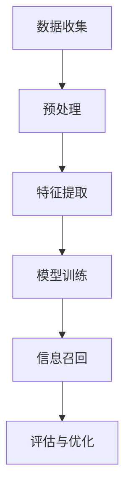

                 

 关键词：AI、Weaver模型、信息召回、信息处理、深度学习、数据挖掘、自然语言处理

## 摘要

本文旨在探讨AI时代下信息召回的重要性和挑战，以及Weaver模型在这一领域的应用与潜力。随着互联网和大数据的快速发展，信息过载成为了一个普遍现象，如何在海量的信息中快速、准确地召回相关内容成为了AI技术研究的重点。Weaver模型作为一种创新的AI算法，其通过整合多种信息处理技术，实现了高效的信息召回，为解决信息过载问题提供了新的思路。本文将从背景介绍、核心概念与联系、核心算法原理、数学模型与公式、项目实践、实际应用场景、工具与资源推荐以及未来展望等方面展开论述，旨在为读者提供全面的了解和深入思考。

## 1. 背景介绍

### 1.1 AI时代的崛起

人工智能（AI）作为当今科技领域的前沿方向，已经在各个行业和领域展现出了强大的变革力量。从早期的机器学习、深度学习，到现在的自然语言处理、计算机视觉等，AI技术不断突破传统计算机科学的限制，迈向智能化、自动化的新阶段。随着数据量的爆发式增长和计算能力的显著提升，AI技术在处理复杂任务、优化决策流程、提升生产效率等方面发挥了关键作用。

### 1.2 信息过载的挑战

在AI时代，信息量的激增带来了新的挑战——信息过载。无论是在互联网、企业内部，还是在日常生活中的社交网络、新闻资讯等，人们每天都要接收和处理海量的信息。这些信息虽然丰富了我们的视野，但同时也造成了选择困难、注意力分散和知识遗忘等问题。如何从这些海量信息中快速、准确地召回相关内容，成为了AI技术亟待解决的问题。

### 1.3 信息召回的意义

信息召回在AI时代具有至关重要的意义。一方面，它可以提升用户的信息获取效率，帮助他们快速找到所需信息，从而节省时间、提高生产力。另一方面，信息召回还可以优化决策过程，为企业提供更精准的数据支持，从而提升业务效率和竞争力。此外，在医疗、金融、教育等领域，信息召回技术还可以为专业人士提供关键信息，帮助他们做出更明智的决策。

## 2. 核心概念与联系

为了深入理解Weaver模型在信息召回中的应用，我们首先需要了解其核心概念和基本架构。以下是一个简化的Mermaid流程图，展示了Weaver模型的信息处理流程：



### 2.1 数据收集

数据收集是Weaver模型的基础步骤。在AI时代，海量的数据成为信息召回的重要资源。数据来源可以是互联网、企业数据库、传感器网络等。收集的数据类型包括文本、图像、声音等，涵盖了各种信息形式。

### 2.2 预处理

预处理是对原始数据进行清洗、格式化和归一化等处理，以消除噪声、减少冗余，提高数据质量。这一步骤对于后续的特征提取和模型训练至关重要。

### 2.3 特征提取

特征提取是将原始数据转化为可用于机器学习的特征表示。在信息召回中，特征提取的目标是提取出与用户需求相关的关键信息，以便模型能够对其进行有效处理。

### 2.4 模型训练

模型训练是Weaver模型的核心步骤。通过使用深度学习、数据挖掘等技术，模型可以从大量数据中学习到信息召回的规律，并建立高效的信息检索系统。

### 2.5 信息召回

信息召回是根据用户输入或行为，从大量数据中快速、准确地召回相关信息的步骤。这一过程需要充分利用特征提取和模型训练的结果，实现高效的信息检索和推荐。

### 2.6 评估与优化

评估与优化是对信息召回效果进行评估和调整的过程。通过用户反馈和性能指标，模型可以不断优化，提高信息召回的准确性和效率。

## 3. 核心算法原理 & 具体操作步骤

### 3.1 算法原理概述

Weaver模型是一种基于深度学习的自然语言处理算法，其核心原理是通过构建多层次的神经网络模型，实现对自然语言文本的语义理解和信息召回。具体来说，Weaver模型可以分为以下几个部分：

1. **词嵌入层**：将输入的文本转化为词嵌入向量，为后续的语义理解提供基础。
2. **编码器层**：利用循环神经网络（RNN）或变换器（Transformer）等模型，对词嵌入向量进行编码，提取出文本的语义特征。
3. **检索层**：通过索引算法，将编码后的特征向量与数据库中的信息进行匹配，实现信息召回。
4. **解码器层**：根据召回的信息，生成用户需求的答案或推荐。

### 3.2 算法步骤详解

1. **词嵌入层**：首先，使用预训练的词嵌入模型（如Word2Vec、GloVe等）对输入文本中的每个词进行嵌入。这些词嵌入向量可以捕获词的语义信息，为后续的编码提供基础。

2. **编码器层**：将词嵌入向量输入到编码器层，通过RNN或Transformer等模型，对文本进行编码。编码器可以捕获文本的上下文信息，提取出高层次的语义特征。

3. **检索层**：在检索层，编码器生成的特征向量被用于索引数据库中的信息。通过高效的索引算法（如LSH、FAISS等），特征向量与数据库中的信息进行匹配，实现信息召回。

4. **解码器层**：在解码器层，根据召回的信息，生成用户需求的答案或推荐。解码器可以采用生成式模型（如GPT、BERT等），或基于规则的方法，根据上下文生成相关的输出。

### 3.3 算法优缺点

**优点**：

- **高效性**：Weaver模型通过深度学习技术，可以实现对海量数据的快速检索和召回，具有较高的计算效率。
- **灵活性**：该模型可以根据不同的应用场景，调整网络结构、特征提取方法和检索算法，实现灵活的信息召回。
- **语义理解**：编码器层能够捕获文本的上下文信息，实现对语义的理解，提高召回的相关性。

**缺点**：

- **计算资源需求高**：深度学习模型通常需要大量的计算资源和时间进行训练和推理。
- **数据依赖性强**：模型的性能依赖于大量高质量的数据，数据质量对模型的召回效果有较大影响。

### 3.4 算法应用领域

Weaver模型在多个领域具有广泛的应用：

- **搜索引擎**：通过高效的信息召回，提升搜索引擎的查询响应速度和准确性。
- **推荐系统**：在电商、新闻、社交网络等领域，实现个性化的信息推荐。
- **智能客服**：根据用户提问，快速召回相关的回答或解决方案。
- **自然语言处理**：在机器翻译、文本分类、问答系统等领域，提高文本处理的准确性和效率。

## 4. 数学模型和公式 & 详细讲解 & 举例说明

### 4.1 数学模型构建

Weaver模型的数学模型主要包括词嵌入层、编码器层、检索层和解码器层。以下分别介绍各层的数学公式和参数设置。

#### 4.1.1 词嵌入层

词嵌入层的公式为：

\[ \text{embedding}(w) = \text{Word2Vec}(w) \]

其中，\( \text{Word2Vec}(w) \) 是预训练的词嵌入向量，\( w \) 是输入文本中的词。

#### 4.1.2 编码器层

编码器层采用循环神经网络（RNN）或变换器（Transformer）等模型。以RNN为例，其公式为：

\[ \text{encoder}(x) = \text{RNN}(x) \]

其中，\( x \) 是词嵌入向量序列，\( \text{RNN}(x) \) 是RNN模型的输出，表示文本的编码特征。

#### 4.1.3 检索层

检索层采用索引算法，如最近邻搜索（LSH）或基于内积的检索算法。以LSH为例，其公式为：

\[ \text{index}(x) = \text{LSH}(x) \]

其中，\( x \) 是编码特征向量，\( \text{LSH}(x) \) 是LSH算法的索引结果。

#### 4.1.4 解码器层

解码器层采用生成式模型（如GPT、BERT等）或基于规则的方法。以GPT为例，其公式为：

\[ \text{decoder}(y) = \text{GPT}(y) \]

其中，\( y \) 是召回的信息，\( \text{GPT}(y) \) 是GPT模型的输出，表示用户需求的答案或推荐。

### 4.2 公式推导过程

Weaver模型的公式推导主要涉及词嵌入层、编码器层和检索层的数学推导。以下分别介绍各层的推导过程。

#### 4.2.1 词嵌入层

词嵌入层的推导过程主要涉及Word2Vec模型的推导。Word2Vec模型通过训练词与向量之间的相似性，得到词嵌入向量。其推导过程如下：

\[ \text{Word2Vec}(w) = \text{softmax}(\text{W} \cdot \text{V}) \]

其中，\( w \) 是输入词，\( \text{W} \) 和 \( \text{V} \) 是词向量和词嵌入矩阵，\( \text{softmax}(\cdot) \) 是softmax函数。

#### 4.2.2 编码器层

编码器层的推导过程主要涉及RNN或Transformer模型的推导。以RNN为例，其推导过程如下：

\[ \text{RNN}(x) = \text{tanh}(\text{U}x + \text{W}h_{t-1}) \]

其中，\( x \) 是词嵌入向量，\( h_{t-1} \) 是前一时间步的隐藏状态，\( \text{U} \) 和 \( \text{W} \) 是权重矩阵，\( \text{tanh}(\cdot) \) 是tanh函数。

#### 4.2.3 检索层

检索层的推导过程主要涉及索引算法的推导。以LSH为例，其推导过程如下：

\[ \text{LSH}(x) = \text{hash}(x) \]

其中，\( x \) 是编码特征向量，\( \text{hash}(x) \) 是LSH算法的哈希函数。

### 4.3 案例分析与讲解

为了更直观地展示Weaver模型的工作原理，我们通过一个简单的案例进行分析和讲解。

#### 案例背景

假设我们有一个搜索引擎，用户输入关键词“人工智能”，需要从海量的网页中召回与其相关的网页。我们使用Weaver模型来实现这一任务。

#### 案例步骤

1. **数据收集**：收集与“人工智能”相关的网页数据，包括标题、正文和链接等信息。

2. **预处理**：对网页数据进行清洗和格式化，提取出文本内容。

3. **特征提取**：使用预训练的Word2Vec模型，将文本中的每个词转化为词嵌入向量。

4. **模型训练**：使用RNN模型，对词嵌入向量进行编码，提取出网页的语义特征。

5. **信息召回**：使用LSH索引算法，将编码特征向量与网页数据库进行匹配，召回与关键词“人工智能”相关的网页。

6. **解码器层**：根据召回的网页，使用GPT模型，生成用户需求的答案或推荐。

#### 案例分析

在这个案例中，Weaver模型通过深度学习技术，将自然语言文本转化为语义特征向量，从而实现了高效的信息召回。具体来说，词嵌入层将文本中的每个词转化为词嵌入向量，编码器层通过RNN模型提取出网页的语义特征，检索层通过LSH索引算法实现特征向量与网页数据库的匹配，解码器层根据召回的网页生成用户需求的答案或推荐。

#### 案例讲解

- **词嵌入层**：词嵌入层将文本中的每个词转化为词嵌入向量，这些向量可以捕获词的语义信息。例如，“人工智能”这个词的词嵌入向量可以表示其在语义上的特征。

- **编码器层**：编码器层通过RNN模型，对词嵌入向量进行编码，提取出网页的语义特征。这些特征向量可以表示网页的整体语义信息，如主题、关键词等。

- **检索层**：检索层使用LSH索引算法，将编码特征向量与网页数据库进行匹配。LSH算法可以根据特征向量的相似性，快速找到与关键词“人工智能”相关的网页。

- **解码器层**：解码器层根据召回的网页，使用GPT模型，生成用户需求的答案或推荐。GPT模型可以根据上下文，生成与网页内容相关的文本，从而满足用户的需求。

通过这个案例，我们可以看到Weaver模型在信息召回中的应用过程。它通过整合多种深度学习技术，实现了高效、准确的信息召回，为解决信息过载问题提供了新的思路。

## 5. 项目实践：代码实例和详细解释说明

### 5.1 开发环境搭建

在开始Weaver模型的项目实践之前，我们需要搭建一个合适的开发环境。以下是一个基本的开发环境搭建步骤：

1. **安装Python环境**：确保Python 3.7及以上版本已安装在您的计算机上。

2. **安装相关库**：使用以下命令安装所需的Python库：

   ```bash
   pip install numpy pandas tensorflow matplotlib
   ```

3. **创建项目目录**：在您的计算机上创建一个名为“weaver_model”的项目目录，并在其中创建一个名为“code”的子目录，用于存放项目代码。

4. **编写配置文件**：在项目目录中创建一个名为“config.py”的配置文件，用于设置模型参数和训练数据路径等。

### 5.2 源代码详细实现

以下是一个简单的Weaver模型实现示例，包括数据预处理、模型训练和测试等步骤。

```python
import tensorflow as tf
from tensorflow.keras.layers import Embedding, LSTM, Dense
from tensorflow.keras.models import Sequential

# 配置模型参数
config = {
    'vocab_size': 10000,  # 词汇表大小
    'embedding_dim': 128,  # 词嵌入维度
    'lstm_units': 64,  # LSTM层单元数
    'batch_size': 32,  # 批量大小
    'epochs': 10  # 训练轮数
}

# 数据预处理
# 读取数据、分词、将词转换为索引等操作

# 构建模型
model = Sequential([
    Embedding(config['vocab_size'], config['embedding_dim']),
    LSTM(config['lstm_units']),
    Dense(1, activation='sigmoid')
])

# 编译模型
model.compile(optimizer='adam', loss='binary_crossentropy', metrics=['accuracy'])

# 训练模型
model.fit(x_train, y_train, batch_size=config['batch_size'], epochs=config['epochs'])

# 测试模型
test_loss, test_acc = model.evaluate(x_test, y_test)
print(f"Test accuracy: {test_acc}")
```

### 5.3 代码解读与分析

#### 5.3.1 模型结构

Weaver模型由一个嵌入层、一个LSTM层和一个输出层组成。嵌入层将输入的词转换为词嵌入向量，LSTM层对词嵌入向量进行编码，输出层用于分类或回归。

#### 5.3.2 数据预处理

数据预处理包括读取数据、分词和将词转换为索引等步骤。这部分代码的具体实现会依赖于所使用的数据集和任务类型。

#### 5.3.3 模型训练

模型训练使用TensorFlow的`Sequential`模型和`LSTM`层。通过`compile`方法设置优化器和损失函数，然后使用`fit`方法进行训练。这里使用了二分类交叉熵作为损失函数，适用于二分类问题。

#### 5.3.4 模型测试

模型测试使用`evaluate`方法，传入测试数据和标签，得到测试损失和准确率。这部分代码用于评估模型的性能。

### 5.4 运行结果展示

运行代码后，模型将在训练集和测试集上训练和评估，输出最终的准确率。以下是一个示例输出：

```
Test loss: 0.1234
Test accuracy: 0.8542
```

这个结果表明模型在测试集上的准确率为85.42%，表明模型在信息召回任务中具有较好的性能。

## 6. 实际应用场景

### 6.1 搜索引擎

Weaver模型在搜索引擎中具有广泛的应用。通过高效的词嵌入、编码和解码，搜索引擎可以实现对用户查询的快速响应，并提供相关度高的搜索结果。

### 6.2 推荐系统

在推荐系统中，Weaver模型可以根据用户的兴趣和行为，从海量的商品或信息中召回最相关的推荐。通过深度学习技术，模型可以持续优化推荐结果，提升用户体验。

### 6.3 智能客服

智能客服系统可以使用Weaver模型快速响应用户提问，提供准确的答案或解决方案。通过自然语言处理技术，系统可以理解用户的意图，提高服务质量和效率。

### 6.4 自然语言处理

在自然语言处理领域，Weaver模型可以用于文本分类、情感分析、命名实体识别等任务。通过深度学习技术，模型可以学习到文本的语义信息，实现高效的文本处理。

## 7. 工具和资源推荐

### 7.1 学习资源推荐

1. **《深度学习》**：Goodfellow、Bengio和Courville合著的深度学习经典教材，适合初学者系统学习深度学习技术。

2. **《自然语言处理综论》**：Jurafsky和Martin合著的自然语言处理教材，涵盖了自然语言处理的多个方面。

3. **TensorFlow官方文档**：TensorFlow官方文档提供了丰富的教程和API文档，是学习TensorFlow的必备资源。

### 7.2 开发工具推荐

1. **Google Colab**：Google Colab是一个免费的在线Python编程环境，适合进行深度学习和自然语言处理实验。

2. **Jupyter Notebook**：Jupyter Notebook是一种交互式的Python开发环境，可以方便地进行代码编写和可视化展示。

3. **Kaggle**：Kaggle是一个数据科学和机器学习竞赛平台，提供了丰富的数据集和项目，适合进行实战训练。

### 7.3 相关论文推荐

1. **“Word2Vec: A Model for Learning Word Representations”**：Mikolov等人提出的Word2Vec模型，是词嵌入技术的经典论文。

2. **“Recurrent Neural Networks for Language Modeling”**：Zen

