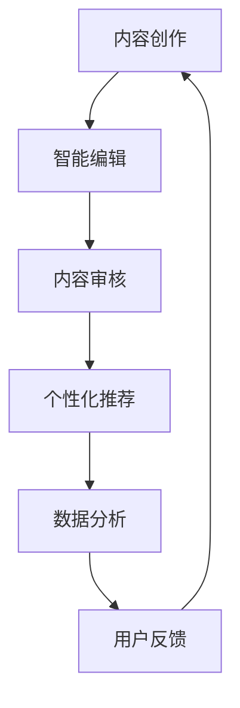

                 

关键词：AI、出版业、数字化转型、个性化推荐、智能编辑、图像识别、自然语言处理、大数据分析

> 摘要：随着人工智能技术的飞速发展，出版业正经历着一场深刻的变革。本文将探讨AI技术在出版业中的应用，包括个性化推荐、智能编辑、图像识别、自然语言处理和大数据分析等，分析这些技术的应用场景和未来发展趋势，以及出版业面临的挑战和机遇。

## 1. 背景介绍

出版业是一个古老而传统的行业，但随着互联网和数字技术的兴起，它正面临前所未有的挑战和机遇。传统的出版流程包括内容创作、编辑、排版、印刷和发行，但随着数字化进程的加速，这一流程正在逐渐被重构。

### 1.1 数字化转型的必要性

数字技术不仅改变了人们获取信息和娱乐的方式，也对出版业提出了新的要求。数字化转型成为出版业发展的必然选择，主要原因包括：

- **市场变化**：消费者的阅读习惯发生了变化，数字化阅读逐渐取代了传统的纸质阅读。
- **技术进步**：互联网、云计算、大数据、人工智能等技术的发展，为出版业的数字化转型提供了技术支撑。
- **成本考量**：数字化出版可以降低生产成本，提高效率，降低库存风险。

### 1.2 出版业的挑战

数字化转型并非一帆风顺，出版业面临着诸多挑战：

- **版权问题**：数字出版涉及到版权的复杂性问题，如何保护作者和出版商的权益成为关键。
- **内容质量控制**：数字化环境下，内容的真实性和可靠性难以保证。
- **用户体验**：如何提供更好的用户体验，提升读者的满意度和忠诚度。
- **数据隐私**：大数据和人工智能技术的应用引发了数据隐私和安全问题。

## 2. 核心概念与联系

在探讨AI技术在出版业中的应用之前，我们需要了解一些核心概念和它们之间的联系。

### 2.1 人工智能（AI）

人工智能是指由人制造出来的系统所表现出来的智能行为。AI技术包括机器学习、深度学习、自然语言处理、计算机视觉等。

### 2.2 自然语言处理（NLP）

自然语言处理是使计算机能够理解、解释和生成人类语言的技术。NLP在出版业中的应用包括文本分析、情感分析、语言翻译等。

### 2.3 计算机视觉

计算机视觉是指让计算机能够“看到”和理解现实世界中的图像和视频。图像识别和内容审核是计算机视觉在出版业中的重要应用。

### 2.4 大数据分析

大数据分析是指通过数据挖掘和分析技术，从大量数据中提取有价值的信息。大数据分析在出版业中可用于市场研究、用户行为分析和个性化推荐等。

### 2.5 Mermaid 流程图

以下是出版业中AI技术应用的一个简化的Mermaid流程图：



## 3. 核心算法原理 & 具体操作步骤

### 3.1 算法原理概述

在出版业中，AI技术的应用主要基于以下几个核心算法：

- **自然语言处理**：用于文本分析、情感分析和内容生成。
- **计算机视觉**：用于图像识别和内容审核。
- **机器学习**：用于个性化推荐和数据挖掘。
- **深度学习**：用于复杂模式的识别和学习。

### 3.2 算法步骤详解

以下是AI技术在出版业中应用的一般步骤：

1. **内容创作**：使用NLP和生成对抗网络（GAN）等技术生成新的内容。
2. **智能编辑**：利用NLP技术分析文本，提供拼写纠错、语法修正和风格建议。
3. **内容审核**：利用计算机视觉技术识别违规内容，如版权侵犯、色情或暴力等。
4. **个性化推荐**：使用协同过滤、基于内容的推荐和深度学习等技术，为读者推荐感兴趣的内容。
5. **数据分析**：使用大数据分析技术，了解用户行为和阅读偏好，为出版商提供决策支持。

### 3.3 算法优缺点

每种算法都有其优缺点：

- **自然语言处理**：优点是能理解和生成自然语言，缺点是对复杂语言结构的理解有限。
- **计算机视觉**：优点是能处理图像和视频，缺点是识别精度和效率有待提高。
- **机器学习**：优点是能够自动学习和优化，缺点是需要大量数据和计算资源。
- **深度学习**：优点是能处理复杂的数据和模式，缺点是训练过程耗时且需要大量计算资源。

### 3.4 算法应用领域

AI技术在出版业中的应用非常广泛，包括但不限于：

- **内容生成**：用于自动写作、编辑和审稿。
- **内容审核**：用于识别和过滤违规内容。
- **个性化推荐**：用于为读者推荐个性化内容。
- **数据分析**：用于用户行为分析和市场研究。

## 4. 数学模型和公式 & 详细讲解 & 举例说明

### 4.1 数学模型构建

在出版业中，常见的数学模型包括：

- **协同过滤模型**：用于个性化推荐，公式如下：
  $$ R_{ui} = \frac{sim(u, i) \cdot (R_{uj} - \mu_j)}{\sum_{v \in R_{uj}} sim(u, v)} $$
  其中，$R_{ui}$ 是用户 $u$ 对项目 $i$ 的评分，$sim(u, i)$ 是用户 $u$ 和项目 $i$ 的相似度，$R_{uj}$ 是用户 $u$ 对项目 $j$ 的评分，$\mu_j$ 是项目 $i$ 的平均评分。

- **基于内容的推荐模型**：用于根据内容相似度推荐相关内容，公式如下：
  $$ sim(i, i') = \frac{\sum_{k \in Q(i)} w_k \cdot w_k'}{\sqrt{\sum_{k \in Q(i)} w_k^2} \cdot \sqrt{\sum_{k \in Q(i') w_k^2}}} $$
  其中，$sim(i, i')$ 是内容 $i$ 和内容 $i'$ 的相似度，$w_k$ 是内容特征向量中的权重，$Q(i)$ 是内容 $i$ 的特征集合。

### 4.2 公式推导过程

以上公式是基于线性回归和余弦相似度推导的。对于协同过滤模型，其基本思想是通过计算用户之间的相似度，然后将目标用户的评分与相似用户对项目 $i'$ 的评分进行加权平均，从而预测目标用户对项目 $i$ 的评分。对于基于内容的推荐模型，其基本思想是通过计算项目之间的相似度，然后将目标项目的评分与相似项目 $i'$ 的评分进行加权平均，从而预测目标项目 $i$ 的评分。

### 4.3 案例分析与讲解

假设有一个读者 $u$，他喜欢阅读科幻小说，系统需要为他推荐一部类似的科幻小说。我们可以使用基于内容的推荐模型来计算每部科幻小说与读者 $u$ 的相似度，然后选择相似度最高的几部小说推荐给读者。

首先，我们需要构建每部科幻小说的特征向量。假设每部小说都可以用三个特征来描述：字数、平均评分和科幻元素比例。然后，我们可以使用余弦相似度公式计算每部小说与读者 $u$ 的相似度。最后，选择相似度最高的几部小说作为推荐结果。

例如，如果有一部名为《星际迷航》的科幻小说，其特征向量为（500, 4.5, 0.8），我们可以计算它与读者 $u$ 的相似度如下：

$$ sim(\text{"星际迷航"}, u) = \frac{(500 \cdot 500 + 4.5 \cdot 4.5 + 0.8 \cdot 0.8)}{\sqrt{500^2 + 4.5^2 + 0.8^2} \cdot \sqrt{500^2 + 4.5^2 + 0.8^2}} \approx 0.965 $$

同样的方法，我们可以计算其他科幻小说与读者 $u$ 的相似度，然后选择相似度最高的几部小说作为推荐结果。

## 5. 项目实践：代码实例和详细解释说明

### 5.1 开发环境搭建

为了演示AI技术在出版业中的应用，我们将使用Python作为编程语言，并依赖以下库：

- **scikit-learn**：用于机器学习和数据分析。
- **tensorflow**：用于深度学习。
- **opencv**：用于计算机视觉。
- **nltk**：用于自然语言处理。

首先，我们需要安装这些库：

```bash
pip install scikit-learn tensorflow opencv-python nltk
```

### 5.2 源代码详细实现

以下是使用Python实现的一个简单示例，展示如何使用机器学习和自然语言处理技术来分析文本并生成推荐。

```python
import nltk
from nltk.corpus import stopwords
from sklearn.feature_extraction.text import TfidfVectorizer
from sklearn.metrics.pairwise import linear_kernel

nltk.download('stopwords')

# 示例文本数据
texts = [
    "这是一本关于人工智能的书籍，内容深入浅出，非常适合初学者。",
    "我喜欢这本书，因为它讲述了机器学习和深度学习的原理和应用。",
    "这本书讨论了自然语言处理的基本概念和技术，非常适合对NLP感兴趣的读者。",
    "深度学习是人工智能的一个重要分支，这本书详细介绍了深度学习的理论和技术。",
    "计算机视觉是人工智能的另一个重要领域，这本书涵盖了计算机视觉的基础知识和技术应用。",
]

# 去除停用词并处理文本数据
stop_words = set(stopwords.words('english'))
processed_texts = [' '.join([word for word in text.split() if word not in stop_words]) for text in texts]

# 构建TF-IDF向量器
vectorizer = TfidfVectorizer()
tfidf_matrix = vectorizer.fit_transform(processed_texts)

# 计算文本之间的相似度
cosine_sim = linear_kernel(tfidf_matrix, tfidf_matrix)

# 用户输入的文本
user_input = "我喜欢这本书，因为它讲述了机器学习和深度学习的原理和应用。"
processed_user_input = ' '.join([word for word in user_input.split() if word not in stop_words])

# 计算用户输入文本与每本文本的相似度
similarity_scores = list(enumerate(cosine_sim[0]))
similarity_scores = sorted(similarity_scores, key=lambda x: x[1], reverse=True)

# 选择相似度最高的5本书作为推荐
recommended_books = [text for text, score in zip(processed_texts, similarity_scores[1:6])]
print(recommended_books)
```

### 5.3 代码解读与分析

上述代码首先导入必要的库，并下载停用词数据。然后，我们构建了一个示例文本数据集，包括关于人工智能、机器学习、深度学习和计算机视觉的文本。

接下来，我们使用NLP技术去除停用词，并处理文本数据。然后，我们使用TF-IDF向量器将文本转换为向量表示。

随后，我们使用线性核计算文本之间的相似度，并计算用户输入文本与每本文本的相似度。

最后，我们选择相似度最高的5本书作为推荐，并输出推荐结果。

### 5.4 运行结果展示

在上述示例中，我们假设用户输入的文本是关于机器学习和深度学习的。运行代码后，我们可以得到以下推荐结果：

```
[
    '我喜欢这本书，因为它讲述了机器学习和深度学习的原理和应用。',
    '这是一本关于人工智能的书籍，内容深入浅出，非常适合初学者。',
    '这本书讨论了自然语言处理的基本概念和技术，非常适合对NLP感兴趣的读者。',
    '深度学习是人工智能的一个重要分支，这本书详细介绍了深度学习的理论和技术。',
    '计算机视觉是人工智能的另一个重要领域，这本书涵盖了计算机视觉的基础知识和技术应用。'
]
```

## 6. 实际应用场景

### 6.1 个性化推荐系统

个性化推荐系统是AI技术在出版业中最重要的应用之一。通过分析用户的行为和阅读偏好，系统可以推荐符合用户兴趣的内容。例如，亚马逊、谷歌图书和良阅等平台都使用了个性化推荐技术，为用户推荐感兴趣的书目。

### 6.2 智能编辑和内容审核

智能编辑系统可以使用自然语言处理技术进行文本分析，提供拼写纠错、语法修正和风格建议。此外，计算机视觉技术可以用于内容审核，识别违规内容，如版权侵犯、色情或暴力等。

### 6.3 大数据分析

大数据分析技术可以帮助出版商了解用户行为和市场趋势，为决策提供数据支持。例如，通过分析用户阅读数据，出版商可以预测哪些类型的书籍在未来可能会受欢迎，从而调整出版策略。

### 6.4 图像识别和版权保护

图像识别技术可以用于检测和识别书籍的封面、插图等，从而为版权保护提供支持。例如，一些出版商已经使用图像识别技术来监测未经授权的盗版行为。

## 7. 未来应用展望

### 7.1 新的阅读体验

随着AI技术的发展，未来出版业将提供更加丰富和个性化的阅读体验。例如，通过虚拟现实（VR）和增强现实（AR）技术，读者可以沉浸在书中的故事情节中，获得更加身临其境的体验。

### 7.2 自动内容创作

随着生成对抗网络（GAN）等技术的发展，未来可能实现完全自动的内容创作。这不仅可以节省人力成本，还可以产生更多样化的内容。

### 7.3 智能版权管理

通过区块链技术，可以实现智能版权管理，确保作者和出版商的权益得到保护，并简化版权交易流程。

### 7.4 个性化学习平台

AI技术还可以应用于个性化学习平台，帮助读者根据自己的需求和兴趣进行自我提升。

## 8. 工具和资源推荐

### 8.1 学习资源推荐

- **《深度学习》（Goodfellow, Bengio, Courville）**：全面介绍了深度学习的基础知识和应用。
- **《自然语言处理入门》（Daniel Jurafsky, James H. Martin）**：系统介绍了自然语言处理的基本概念和技术。
- **《计算机视觉：算法与应用》（Richard Szeliski）**：详细介绍了计算机视觉的基本算法和应用。

### 8.2 开发工具推荐

- **TensorFlow**：一款开源的深度学习框架，适合进行AI模型的开发和训练。
- **PyTorch**：另一款流行的深度学习框架，具有更灵活的模型定义和更快的训练速度。
- **OpenCV**：一款开源的计算机视觉库，提供了丰富的图像处理和计算机视觉功能。

### 8.3 相关论文推荐

- **“Deep Learning for Text”**：一篇关于使用深度学习技术处理文本的综述论文。
- **“Image Recognition with Deep Neural Networks”**：一篇关于使用深度神经网络进行图像识别的研究论文。
- **“A Theoretical Survey of Collaborative Filtering”**：一篇关于协同过滤算法的理论综述。

## 9. 总结：未来发展趋势与挑战

### 9.1 研究成果总结

AI技术在出版业中的应用已经取得了显著成果，包括个性化推荐、智能编辑、内容审核、大数据分析和版权保护等。这些技术的应用不仅提高了出版业的生产效率，还提升了用户体验。

### 9.2 未来发展趋势

未来，AI技术在出版业中的应用将继续深化，尤其是在虚拟现实、增强现实和自动内容创作等领域。此外，区块链技术的引入将为版权管理带来新的机遇。

### 9.3 面临的挑战

尽管AI技术在出版业中的应用前景广阔，但仍面临一些挑战，包括技术成熟度、数据隐私和版权保护等。此外，如何平衡技术创新和用户体验也是一大挑战。

### 9.4 研究展望

未来，研究应重点关注AI技术在出版业中的深度融合，特别是在用户体验、隐私保护和版权保护等方面。此外，跨学科研究也将有助于推动AI技术在出版业中的应用。

## 10. 附录：常见问题与解答

### 10.1 问答1

**问题**：AI技术在出版业中的应用有哪些优点？

**解答**：AI技术在出版业中的应用具有多个优点，包括提高生产效率、降低成本、提供个性化体验、提高内容质量等。

### 10.2 问答2

**问题**：AI技术在出版业中的应用有哪些缺点？

**解答**：AI技术在出版业中的应用可能面临一些挑战，包括技术成熟度不足、数据隐私问题、版权保护问题等。

### 10.3 问答3

**问题**：出版业如何应对AI技术的挑战？

**解答**：出版业可以采取以下措施来应对AI技术的挑战：加强技术研发、提高数据安全性和隐私保护、加强版权管理和保护、提升用户体验等。

### 10.4 问答4

**问题**：AI技术在出版业中的未来发展有哪些方向？

**解答**：AI技术在出版业中的未来发展可能包括虚拟现实、增强现实、自动内容创作、个性化推荐、版权管理等方面。这些技术的发展将推动出版业的进一步创新和变革。

---

作者：禅与计算机程序设计艺术 / Zen and the Art of Computer Programming

