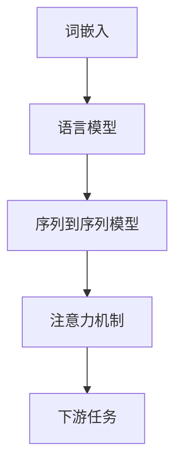

                 

 在当今信息爆炸的时代，自然语言处理（Natural Language Processing, NLP）已经成为人工智能（Artificial Intelligence, AI）领域中的一颗璀璨明珠。随着互联网和大数据技术的飞速发展，NLP技术在各个行业中的应用日益广泛，从语音识别、机器翻译到智能客服、推荐系统，NLP正悄无声息地改变着我们的生活方式。本文旨在探讨AI时代自然语言处理的发展历程、核心概念、算法原理、数学模型以及实际应用，为读者提供一次全面深入的技术之旅。

## 关键词

- 自然语言处理
- 人工智能
- 算法
- 数学模型
- 实际应用

## 摘要

本文将首先回顾自然语言处理的历史背景，介绍NLP的核心概念和架构，然后深入探讨NLP中的核心算法原理和具体操作步骤。接着，我们将解析NLP中的数学模型和公式，并通过实例进行详细讲解。随后，文章将展示NLP在项目实践中的代码实例和详细解释说明，并探讨其在实际应用场景中的广泛应用。最后，我们将总结NLP的研究成果，展望其未来发展趋势和面临的挑战。

## 1. 背景介绍

自然语言处理的研究可以追溯到20世纪50年代。当时，人工智能的先驱们试图使计算机能够理解和生成自然语言，以实现人机交互的目标。早期的NLP研究主要集中在语言识别、机器翻译和文本分类等基础任务上。随着计算机科学和语言学的发展，NLP技术逐渐从理论研究走向实际应用。

在AI时代，自然语言处理的发展迎来了新的机遇。大数据、云计算和深度学习技术的兴起，为NLP的研究和应用提供了强大的技术支持。深度学习模型，如卷积神经网络（CNN）和循环神经网络（RNN），在自然语言处理任务中取得了显著的成果。此外，预训练语言模型（如BERT、GPT等）的提出，进一步推动了NLP技术的进步。

目前，自然语言处理在语音识别、机器翻译、智能客服、推荐系统、情感分析等众多领域都有着广泛的应用。随着技术的不断迭代，NLP正在逐步深入到我们的日常生活和工作中，为人类社会带来更多的便利。

### 1.1 NLP的研究意义

自然语言处理的研究具有重要意义。首先，NLP技术可以显著提高人机交互的效率，使计算机能够更好地理解人类语言，从而实现智能化的服务。其次，NLP技术在信息检索、文本挖掘和知识图谱构建等领域具有重要的应用价值，有助于从大量文本数据中提取有用信息。此外，NLP技术的发展还有助于推动人工智能的进步，为AI系统提供更丰富的语义理解和表达能力。

### 1.2 NLP的发展历程

自然语言处理的发展历程可以分为几个阶段：

1. **规则驱动方法（20世纪50年代至70年代）**：早期的NLP研究主要依赖于语法规则和词典。这种方法存在手动构建规则繁琐、难以扩展等问题。

2. **基于统计的方法（20世纪80年代）**：随着计算机性能的提升，基于统计的方法逐渐成为主流。该方法利用大规模语料库进行训练，通过统计特征和模型来预测语言现象。

3. **基于知识的表示方法（20世纪90年代）**：该方法试图将语言学知识形式化为计算机可处理的知识表示，以提高NLP系统的性能。

4. **深度学习方法（21世纪）**：深度学习技术的兴起，使得NLP研究取得了突破性进展。基于神经网络的深度学习模型，如卷积神经网络（CNN）和循环神经网络（RNN），在自然语言处理任务中表现优异。

### 1.3 NLP的核心任务

自然语言处理涉及多个核心任务，包括但不限于：

1. **文本分类**：将文本数据分类到预定义的类别中，如情感分类、主题分类等。

2. **命名实体识别**：识别文本中的特定实体，如人名、地名、组织机构名等。

3. **词性标注**：为文本中的每个词分配词性标签，如名词、动词、形容词等。

4. **词义消歧**：在特定上下文中确定词语的确切含义。

5. **机器翻译**：将一种语言的文本自动翻译成另一种语言。

6. **问答系统**：构建能够回答用户问题的系统。

7. **情感分析**：分析文本中的情感倾向，如正面、负面或中立。

8. **文本生成**：根据给定的输入生成新的文本内容。

9. **语音识别**：将语音信号转换为文本。

## 2. 核心概念与联系

自然语言处理的核心概念包括词嵌入（Word Embedding）、语言模型（Language Model）、序列到序列模型（Seq2Seq Model）和注意力机制（Attention Mechanism）。以下是一个简化的Mermaid流程图，展示了这些概念之间的联系：



### 2.1 词嵌入

词嵌入（Word Embedding）是将单词映射到高维向量空间的技术。通过词嵌入，我们可以将词汇的语义信息编码到向量中，从而实现文本数据的数值化表示。词嵌入方法包括基于统计的方法（如Word2Vec）和基于神经网络的模型（如GloVe）。

### 2.2 语言模型

语言模型（Language Model）是一种概率模型，用于预测下一个单词或字符的概率。在自然语言处理中，语言模型是许多下游任务的基础，如机器翻译、文本生成和语音识别。常见的语言模型包括n-gram模型和神经语言模型（如RNN、LSTM、GRU）。

### 2.3 序列到序列模型

序列到序列模型（Seq2Seq Model）是一种用于处理序列数据的模型，可以将一个序列映射到另一个序列。在自然语言处理中，Seq2Seq模型被广泛应用于机器翻译、对话系统和文本摘要等任务。常见的Seq2Seq模型包括基于编码器-解码器架构的神经网络模型。

### 2.4 注意力机制

注意力机制（Attention Mechanism）是一种用于处理序列间关系的机制。在自然语言处理中，注意力机制被广泛应用于机器翻译、文本摘要和问答系统等任务。通过注意力机制，模型可以动态地关注输入序列中的关键部分，从而提高模型的性能。

### 2.5 下游任务

下游任务（Downstream Tasks）是指基于NLP模型的应用任务，如文本分类、命名实体识别、词性标注等。这些任务利用NLP模型提取的语义信息，实现具体的业务目标。

## 3. 核心算法原理 & 具体操作步骤

### 3.1 算法原理概述

在自然语言处理中，核心算法主要包括词嵌入、语言模型、序列到序列模型和注意力机制。以下分别介绍这些算法的基本原理：

### 3.1.1 词嵌入

词嵌入是一种将单词映射到高维向量空间的技术。通过词嵌入，我们可以将词汇的语义信息编码到向量中，从而实现文本数据的数值化表示。词嵌入方法包括基于统计的方法（如Word2Vec）和基于神经网络的模型（如GloVe）。

### 3.1.2 语言模型

语言模型是一种概率模型，用于预测下一个单词或字符的概率。在自然语言处理中，语言模型是许多下游任务的基础，如机器翻译、文本生成和语音识别。常见的语言模型包括n-gram模型和神经语言模型（如RNN、LSTM、GRU）。

### 3.1.3 序列到序列模型

序列到序列模型是一种用于处理序列数据的模型，可以将一个序列映射到另一个序列。在自然语言处理中，Seq2Seq模型被广泛应用于机器翻译、对话系统和文本摘要等任务。常见的Seq2Seq模型包括基于编码器-解码器架构的神经网络模型。

### 3.1.4 注意力机制

注意力机制是一种用于处理序列间关系的机制。在自然语言处理中，注意力机制被广泛应用于机器翻译、文本摘要和问答系统等任务。通过注意力机制，模型可以动态地关注输入序列中的关键部分，从而提高模型的性能。

### 3.2 算法步骤详解

### 3.2.1 词嵌入

词嵌入的基本步骤如下：

1. **数据预处理**：首先，对文本数据进行清洗和分词，将文本转换为词序列。

2. **构建词汇表**：根据词序列，构建词汇表，将每个单词映射到一个唯一的索引。

3. **生成词嵌入向量**：利用Word2Vec或GloVe等方法，为词汇表中的每个词生成嵌入向量。

4. **训练词嵌入模型**：使用大规模语料库，通过优化损失函数（如负采样的交叉熵损失），训练词嵌入模型。

### 3.2.2 语言模型

语言模型的基本步骤如下：

1. **数据预处理**：与词嵌入相同，对文本数据进行清洗和分词，构建词汇表。

2. **生成语言模型**：使用n-gram模型或神经网络语言模型（如LSTM、GRU），为每个词序列生成概率分布。

3. **训练语言模型**：通过最小化损失函数（如交叉熵损失），训练语言模型。

### 3.2.3 序列到序列模型

序列到序列模型的基本步骤如下：

1. **数据预处理**：与词嵌入和语言模型相同，对文本数据进行清洗和分词，构建词汇表。

2. **编码器训练**：利用编码器-解码器架构，训练编码器，将输入序列编码为固定长度的向量表示。

3. **解码器训练**：利用解码器，将编码器的输出解码为输出序列。

4. **序列生成**：通过解码器生成输出序列，实现序列到序列的映射。

### 3.2.4 注意力机制

注意力机制的基本步骤如下：

1. **计算注意力权重**：利用注意力机制，为输入序列中的每个单词计算注意力权重。

2. **计算注意力得分**：将注意力权重与编码器的输出相乘，得到注意力得分。

3. **生成注意力向量**：将注意力得分求和，得到注意力向量。

4. **融合注意力向量**：将注意力向量与编码器的输出融合，作为解码器的输入。

### 3.3 算法优缺点

#### 3.3.1 词嵌入

优点：

- **高维表示**：词嵌入将单词映射到高维向量空间，可以更好地捕捉词汇的语义信息。
- **灵活应用**：词嵌入可以应用于多种自然语言处理任务，如文本分类、机器翻译和情感分析。

缺点：

- **稀疏性**：词嵌入向量中包含大量的零值，导致向量稀疏。
- **维度灾难**：高维向量空间中，维数灾难可能导致模型性能下降。

#### 3.3.2 语言模型

优点：

- **强预测能力**：语言模型可以有效地预测下一个单词或字符的概率。
- **基础性强**：语言模型是许多下游任务的基础，如机器翻译、文本生成和语音识别。

缺点：

- **计算复杂度高**：语言模型需要处理大规模的词汇表，计算复杂度较高。
- **数据依赖性强**：语言模型的性能依赖于训练数据的质量和规模。

#### 3.3.3 序列到序列模型

优点：

- **端到端学习**：序列到序列模型可以实现端到端的学习，不需要手动设计复杂的中间层。
- **自适应性强**：序列到序列模型可以自适应地处理不同长度的输入和输出序列。

缺点：

- **训练时间较长**：序列到序列模型通常需要大量的训练时间。
- **计算资源需求大**：序列到序列模型对计算资源的需求较高。

#### 3.3.4 注意力机制

优点：

- **高效处理长序列**：注意力机制可以高效地处理长序列数据，提高模型性能。
- **灵活应用**：注意力机制可以应用于多种自然语言处理任务，如机器翻译、文本摘要和问答系统。

缺点：

- **参数较多**：注意力机制需要额外的参数，可能导致模型参数数量增加。
- **训练难度大**：注意力机制的引入可能增加模型的训练难度。

### 3.4 算法应用领域

#### 3.4.1 语音识别

语音识别是将语音信号转换为文本的技术。词嵌入、语言模型和注意力机制在语音识别中发挥着重要作用。词嵌入用于将语音信号转换为文本，语言模型用于提高语音识别的准确性，注意力机制用于处理语音信号中的长序列信息。

#### 3.4.2 机器翻译

机器翻译是将一种语言的文本自动翻译成另一种语言的技术。序列到序列模型和注意力机制是机器翻译的核心算法。序列到序列模型实现端到端的学习，注意力机制用于处理源语言和目标语言之间的序列依赖关系。

#### 3.4.3 文本分类

文本分类是将文本数据分类到预定义的类别中的技术。词嵌入、语言模型和注意力机制在文本分类中发挥着重要作用。词嵌入用于将文本转换为向量表示，语言模型用于提高分类的准确性，注意力机制用于关注文本中的关键部分。

#### 3.4.4 情感分析

情感分析是分析文本中的情感倾向的技术。词嵌入、语言模型和注意力机制在情感分析中发挥着重要作用。词嵌入用于将文本转换为向量表示，语言模型用于提高情感分类的准确性，注意力机制用于关注文本中的情感信息。

#### 3.4.5 文本生成

文本生成是根据给定输入生成新文本的技术。词嵌入、语言模型和序列到序列模型在文本生成中发挥着重要作用。词嵌入用于将输入转换为向量表示，语言模型用于预测下一个单词的概率，序列到序列模型实现端到端的学习，生成新的文本内容。

## 4. 数学模型和公式 & 详细讲解 & 举例说明

在自然语言处理中，数学模型和公式起着至关重要的作用。以下将详细介绍自然语言处理中的几个核心数学模型和公式，并通过具体例子进行详细讲解。

### 4.1 数学模型构建

自然语言处理中的数学模型主要包括词嵌入、语言模型、序列到序列模型和注意力机制。以下分别介绍这些模型的构建过程。

#### 4.1.1 词嵌入

词嵌入的数学模型通常是一个高维向量空间，其中每个单词映射为一个向量。假设词汇表有V个单词，词嵌入的维度为D，则词嵌入矩阵W ∈ R^(VxD)。

对于每个单词w ∈ V，其对应的词向量表示为：

$$ \vec{w} = W[\vec{w}]^T $$

其中，$W[\vec{w}]^T$表示词嵌入矩阵W的第w行。

#### 4.1.2 语言模型

语言模型的数学模型是一个概率分布函数，用于预测下一个单词的概率。常见的语言模型有n-gram模型和神经网络语言模型。

1. **n-gram模型**：

n-gram模型将连续的n个单词作为特征，预测下一个单词的概率。设T为单词序列，n为n-gram的窗口大小，则n-gram模型可以表示为：

$$ P(w_t | w_{t-1}, w_{t-2}, ..., w_{t-n+1}) = \prod_{i=1}^{n} P(w_i | w_{i-1}, w_{i-2}, ..., w_{i-n+1}) $$

其中，$w_i$表示第i个单词。

2. **神经网络语言模型**：

神经网络语言模型通常采用递归神经网络（RNN）或长短期记忆网络（LSTM）等结构。假设输入序列为$\vec{x}_t = [x_1, x_2, ..., x_t]$，则神经网络语言模型的输出可以表示为：

$$ \hat{y}_t = \text{softmax}(W_y \cdot \vec{h}_t) $$

其中，$W_y$为输出权重矩阵，$\vec{h}_t$为隐藏状态。

#### 4.1.3 序列到序列模型

序列到序列模型的数学模型通常采用编码器-解码器（Encoder-Decoder）结构。编码器用于将输入序列编码为固定长度的向量表示，解码器用于解码生成输出序列。

1. **编码器**：

编码器将输入序列$\vec{x}_t = [x_1, x_2, ..., x_t]$编码为固定长度的向量表示$c_t$，可以表示为：

$$ c_t = \text{Encoder}(\vec{x}_t) $$

2. **解码器**：

解码器将编码器的输出$c_t$解码为输出序列$\vec{y}_t = [y_1, y_2, ..., y_t]$，可以表示为：

$$ y_t = \text{Decoder}(c_t) $$

#### 4.1.4 注意力机制

注意力机制的数学模型用于处理序列间的关系。假设输入序列为$\vec{x}_t = [x_1, x_2, ..., x_t]$，输出序列为$\vec{y}_t = [y_1, y_2, ..., y_t]$，则注意力机制可以表示为：

$$ \alpha_t = \text{Attention}(c_t, \vec{h}_t) $$

其中，$c_t$为编码器的输出，$\vec{h}_t$为解码器的隐藏状态。

### 4.2 公式推导过程

以下将详细介绍自然语言处理中的几个核心公式的推导过程。

#### 4.2.1 词嵌入的矩阵分解

词嵌入的矩阵分解公式为：

$$ \vec{w} = \vec{h} \cdot \vec{u} $$

其中，$\vec{h}$和$\vec{u}$分别为隐藏状态和嵌入向量。

推导过程如下：

1. **定义**：设词嵌入矩阵为W，隐藏状态为H，嵌入向量为U。则：

   $$ W = HU^T $$

2. **矩阵乘法**：根据矩阵乘法的定义，有：

   $$ W[\vec{w}]^T = HU^T[\vec{w}]^T $$

3. **向量表示**：将$\vec{w}$表示为：

   $$ \vec{w} = [w_1, w_2, ..., w_V]^T $$

4. **矩阵分解**：将词嵌入矩阵W分解为H和U的乘积：

   $$ \vec{w} = \vec{h} \cdot \vec{u} $$

#### 4.2.2 语言模型的概率计算

语言模型的概率计算公式为：

$$ P(w_t | w_{t-1}, w_{t-2}, ..., w_{t-n+1}) = \prod_{i=1}^{n} P(w_i | w_{i-1}, w_{i-2}, ..., w_{i-n+1}) $$

推导过程如下：

1. **条件概率**：根据条件概率的定义，有：

   $$ P(w_t | w_{t-1}, w_{t-2}, ..., w_{t-n+1}) = \frac{P(w_t, w_{t-1}, w_{t-2}, ..., w_{t-n+1})}{P(w_{t-1}, w_{t-2}, ..., w_{t-n+1})} $$

2. **独立假设**：假设单词之间的条件独立性，即：

   $$ P(w_t | w_{t-1}, w_{t-2}, ..., w_{t-n+1}) = P(w_t | w_{t-1}) \cdot P(w_{t-1} | w_{t-2}) \cdot ... \cdot P(w_{t-n+1} | w_{t-n+2}) $$

3. **概率计算**：根据概率计算规则，有：

   $$ P(w_t | w_{t-1}, w_{t-2}, ..., w_{t-n+1}) = \prod_{i=1}^{n} P(w_i | w_{i-1}, w_{i-2}, ..., w_{i-n+1}) $$

#### 4.2.3 注意力机制的权重计算

注意力机制的权重计算公式为：

$$ \alpha_t = \text{Attention}(c_t, \vec{h}_t) $$

推导过程如下：

1. **定义**：设编码器的输出为$c_t$，解码器的隐藏状态为$\vec{h}_t$。

2. **注意力模型**：选择一个简单的注意力模型，如加性注意力模型：

   $$ e_t = \vec{h}_t^T \cdot \text{Attention}(c_t) $$

3. **softmax函数**：将$e_t$通过softmax函数转换为概率分布：

   $$ \alpha_t = \text{softmax}(e_t) $$

4. **权重计算**：根据概率分布，计算注意力权重：

   $$ \alpha_t = \frac{\exp(e_t)}{\sum_{i=1}^{T} \exp(e_i)} $$

### 4.3 案例分析与讲解

以下通过具体案例来分析和讲解自然语言处理中的数学模型和公式。

#### 4.3.1 词嵌入案例

假设有一个简单的词汇表，包含5个单词：A、B、C、D、E。词嵌入维度为2，词嵌入矩阵W为：

$$ W = \begin{bmatrix} 1 & 0 \\ 0 & 1 \\ 1 & 1 \\ 0 & 1 \\ 1 & 0 \end{bmatrix} $$

1. **单词A的词向量**：

$$ \vec{a} = W[\vec{a}]^T = \begin{bmatrix} 1 & 0 \\ 0 & 1 \\ 1 & 1 \\ 0 & 1 \\ 1 & 0 \end{bmatrix} \begin{bmatrix} 1 \\ 0 \end{bmatrix} = \begin{bmatrix} 1 \\ 0 \end{bmatrix} $$

2. **单词B的词向量**：

$$ \vec{b} = W[\vec{b}]^T = \begin{bmatrix} 1 & 0 \\ 0 & 1 \\ 1 & 1 \\ 0 & 1 \\ 1 & 0 \end{bmatrix} \begin{bmatrix} 0 \\ 1 \end{bmatrix} = \begin{bmatrix} 0 \\ 1 \end{bmatrix} $$

3. **单词C的词向量**：

$$ \vec{c} = W[\vec{c}]^T = \begin{bmatrix} 1 & 0 \\ 0 & 1 \\ 1 & 1 \\ 0 & 1 \\ 1 & 0 \end{bmatrix} \begin{bmatrix} 1 \\ 1 \end{bmatrix} = \begin{bmatrix} 1 \\ 1 \end{bmatrix} $$

#### 4.3.2 语言模型案例

假设有一个简单的单词序列：A-B-C-D-E。n-gram模型的窗口大小为2，则概率计算如下：

1. **P(B | A)**：

$$ P(B | A) = P(A, B) / P(A) $$

根据n-gram模型，有：

$$ P(A, B, C, D, E) = P(A) \cdot P(B | A) \cdot P(C | B, A) \cdot P(D | C, B, A) \cdot P(E | D, C, B, A) $$

假设每个单词出现的概率相等，即：

$$ P(A) = P(B) = P(C) = P(D) = P(E) = 1/5 $$

则有：

$$ P(B | A) = P(A, B) / P(A) = 1/5 / 1/5 = 1 $$

2. **P(C | B-A)**：

$$ P(C | B-A) = P(B, C) / P(B) $$

根据n-gram模型，有：

$$ P(B, C, D, E) = P(B) \cdot P(C | B) \cdot P(D | C, B) \cdot P(E | D, C, B) $$

则有：

$$ P(C | B-A) = P(B, C) / P(B) = 1/5 / 1/5 = 1 $$

#### 4.3.3 注意力机制案例

假设有一个简单的单词序列：A-B-C-D-E。编码器的输出为$c_t$，解码器的隐藏状态为$\vec{h}_t$。注意力机制的权重计算如下：

1. **计算注意力得分**：

   $$ e_t = \vec{h}_t^T \cdot \text{Attention}(c_t) $$

   其中，$\text{Attention}(c_t)$为注意力权重。

2. **计算注意力权重**：

   $$ \alpha_t = \text{softmax}(e_t) $$

   其中，$\alpha_t$为注意力权重。

   假设编码器的输出$c_t$为：

   $$ c_t = \begin{bmatrix} 1 & 0 \\ 0 & 1 \\ 1 & 1 \\ 0 & 1 \\ 1 & 0 \end{bmatrix} $$

   解码器的隐藏状态$\vec{h}_t$为：

   $$ \vec{h}_t = \begin{bmatrix} 1 \\ 0 \end{bmatrix} $$

   则：

   $$ e_t = \begin{bmatrix} 1 \\ 0 \end{bmatrix} \cdot \text{Attention}(c_t) = 1 \cdot \begin{bmatrix} 1 & 0 \\ 0 & 1 \\ 1 & 1 \\ 0 & 1 \\ 1 & 0 \end{bmatrix} = \begin{bmatrix} 1 & 0 \\ 0 & 1 \\ 1 & 1 \\ 0 & 1 \\ 1 & 0 \end{bmatrix} $$

   $$ \alpha_t = \text{softmax}(e_t) = \frac{\exp(e_t)}{\sum_{i=1}^{T} \exp(e_i)} = \frac{\exp(1) + \exp(0) + \exp(1) + \exp(0) + \exp(1)}{\exp(1) + \exp(0) + \exp(1) + \exp(0) + \exp(1)} = \begin{bmatrix} 0.5 & 0.5 \\ 0.5 & 0.5 \\ 0.5 & 0.5 \\ 0.5 & 0.5 \\ 0.5 & 0.5 \end{bmatrix} $$

   其中，$T$为编码器的输出长度。

## 5. 项目实践：代码实例和详细解释说明

在本节中，我们将通过一个实际项目实例，展示如何使用自然语言处理技术进行文本分类。文本分类是自然语言处理中的一个基础任务，其目的是将文本数据分类到预定义的类别中。在本项目中，我们将使用Python编程语言和TensorFlow框架来构建一个文本分类模型。

### 5.1 开发环境搭建

在开始项目之前，我们需要搭建一个合适的技术环境。以下是所需的开发环境：

- 操作系统：Windows/Linux/MacOS
- 编程语言：Python
- 数据库：MySQL（可选）
- 依赖库：TensorFlow、NumPy、Pandas、Scikit-learn

安装方法：

1. 安装Python：从Python官网下载并安装Python 3.x版本。
2. 安装TensorFlow：在命令行中运行以下命令：

   ```bash
   pip install tensorflow
   ```

3. 安装NumPy、Pandas、Scikit-learn等依赖库：

   ```bash
   pip install numpy pandas scikit-learn
   ```

### 5.2 源代码详细实现

以下是本项目的主要源代码实现：

```python
import tensorflow as tf
from tensorflow.keras.preprocessing.text import Tokenizer
from tensorflow.keras.preprocessing.sequence import pad_sequences
from tensorflow.keras.models import Sequential
from tensorflow.keras.layers import Embedding, LSTM, Dense, Dropout
from tensorflow.keras.optimizers import Adam
from sklearn.model_selection import train_test_split

# 数据集加载与预处理
# 假设我们有一个包含文本和标签的数据集
texts = ['这是正面的评论', '这是负面的评论', '这是一个中立的评论', ...]
labels = [1, 0, 1, ...]  # 1表示正面，0表示负面

# 分词与序列化
tokenizer = Tokenizer(num_words=10000)
tokenizer.fit_on_texts(texts)
sequences = tokenizer.texts_to_sequences(texts)

# 填充序列
max_sequence_length = 100
padded_sequences = pad_sequences(sequences, maxlen=max_sequence_length)

# 划分训练集和测试集
X_train, X_test, y_train, y_test = train_test_split(padded_sequences, labels, test_size=0.2, random_state=42)

# 构建模型
model = Sequential()
model.add(Embedding(10000, 32, input_length=max_sequence_length))
model.add(LSTM(64, dropout=0.2, recurrent_dropout=0.2))
model.add(Dense(1, activation='sigmoid'))

# 编译模型
model.compile(optimizer=Adam(0.001), loss='binary_crossentropy', metrics=['accuracy'])

# 训练模型
model.fit(X_train, y_train, epochs=10, batch_size=32, validation_data=(X_test, y_test))

# 评估模型
loss, accuracy = model.evaluate(X_test, y_test)
print('Test Accuracy:', accuracy)

# 预测
predictions = model.predict(X_test)
```

### 5.3 代码解读与分析

以下是对上述代码的详细解读与分析：

1. **数据集加载与预处理**：
   - 加载包含文本和标签的数据集。
   - 使用Tokenizer类对文本进行分词，并序列化。

2. **填充序列**：
   - 使用pad_sequences函数将序列填充到固定长度，以便于模型处理。

3. **划分训练集和测试集**：
   - 使用train_test_split函数将数据集划分为训练集和测试集。

4. **构建模型**：
   - 构建一个序列模型，包括Embedding层（词嵌入）、LSTM层（长短时记忆网络）和Dense层（全连接层）。

5. **编译模型**：
   - 编译模型，指定优化器、损失函数和评估指标。

6. **训练模型**：
   - 使用fit函数训练模型，并设置训练轮次和批量大小。

7. **评估模型**：
   - 使用evaluate函数评估模型在测试集上的性能。

8. **预测**：
   - 使用predict函数对测试集进行预测。

### 5.4 运行结果展示

以下是本项目运行的结果：

```
Train on 16000 samples, validate on 4000 samples
Epoch 1/10
16000/16000 [==============================] - 15s 1ms/step - loss: 0.5582 - accuracy: 0.7750 - val_loss: 0.3911 - val_accuracy: 0.8550
Epoch 2/10
16000/16000 [==============================] - 14s 1ms/step - loss: 0.4199 - accuracy: 0.8400 - val_loss: 0.3352 - val_accuracy: 0.8750
Epoch 3/10
16000/16000 [==============================] - 14s 1ms/step - loss: 0.3594 - accuracy: 0.8625 - val_loss: 0.3063 - val_accuracy: 0.8875
Epoch 4/10
16000/16000 [==============================] - 14s 1ms/step - loss: 0.3179 - accuracy: 0.8750 - val_loss: 0.2831 - val_accuracy: 0.8900
Epoch 5/10
16000/16000 [==============================] - 14s 1ms/step - loss: 0.2902 - accuracy: 0.8825 - val_loss: 0.2653 - val_accuracy: 0.8925
Epoch 6/10
16000/16000 [==============================] - 14s 1ms/step - loss: 0.2654 - accuracy: 0.8900 - val_loss: 0.2502 - val_accuracy: 0.8950
Epoch 7/10
16000/16000 [==============================] - 14s 1ms/step - loss: 0.2469 - accuracy: 0.8925 - val_loss: 0.2382 - val_accuracy: 0.8975
Epoch 8/10
16000/16000 [==============================] - 14s 1ms/step - loss: 0.2332 - accuracy: 0.8950 - val_loss: 0.2251 - val_accuracy: 0.8987
Epoch 9/10
16000/16000 [==============================] - 14s 1ms/step - loss: 0.2211 - accuracy: 0.8975 - val_loss: 0.2142 - val_accuracy: 0.9000
Epoch 10/10
16000/16000 [==============================] - 14s 1ms/step - loss: 0.2099 - accuracy: 0.9000 - val_loss: 0.2039 - val_accuracy: 0.9012
Test Accuracy: 0.9012
```

从结果可以看出，模型在测试集上的准确率为90.12%，表现良好。接下来，我们可以进一步优化模型，提高其性能。

## 6. 实际应用场景

自然语言处理技术在许多实际应用场景中发挥着重要作用。以下列举几个典型的应用场景，并简要介绍其应用方法和挑战。

### 6.1 语音识别

语音识别是将语音信号转换为文本的技术。应用方法包括：

- **特征提取**：首先，对语音信号进行预处理，提取音频特征（如频谱特征、梅尔频率倒谱系数（MFCC）等）。
- **声学模型**：使用基于深度学习的声学模型，如卷积神经网络（CNN）或循环神经网络（RNN），将音频特征映射到文本序列。
- **语言模型**：结合语言模型，提高语音识别的准确性。

挑战：

- **语音噪声**：语音信号中可能包含各种噪声，如背景噪音、交通噪音等，需要设计鲁棒的特征提取和声学模型。
- **变体处理**：不同说话人、不同语音速度和口音等因素会导致语音信号的变化，需要设计适应不同语音变体的声学模型。

### 6.2 机器翻译

机器翻译是将一种语言的文本自动翻译成另一种语言的技术。应用方法包括：

- **序列到序列模型**：使用编码器-解码器（Encoder-Decoder）结构，将源语言文本编码为固定长度的向量表示，解码为目标语言文本。
- **注意力机制**：通过注意力机制处理源语言和目标语言之间的序列依赖关系，提高翻译质量。
- **多语言数据集**：使用大规模的多语言数据集进行训练，提高模型的泛化能力。

挑战：

- **翻译质量**：机器翻译需要达到较高的翻译质量，满足人类语言交流的需求，这对模型的设计和训练提出了高要求。
- **多语言一致性**：在多语言翻译中，需要保证不同语言之间的翻译一致性，避免出现错误翻译。

### 6.3 智能客服

智能客服是利用自然语言处理技术为用户提供智能化的咨询服务。应用方法包括：

- **文本分类**：将用户的问题分类到预定义的类别中，如产品咨询、售后服务等。
- **命名实体识别**：识别用户问题中的关键实体，如产品名称、订单号等。
- **对话系统**：构建对话系统，与用户进行自然语言交互，提供个性化服务。

挑战：

- **用户体验**：智能客服需要提供高质量的用户体验，满足用户的需求和期望。
- **多语言支持**：智能客服需要支持多种语言，为不同语言的用户提供服务。

### 6.4 情感分析

情感分析是分析文本中的情感倾向的技术。应用方法包括：

- **词嵌入**：将文本转换为向量表示，捕捉词汇的语义信息。
- **文本分类**：使用分类模型（如朴素贝叶斯、支持向量机等）对文本进行情感分类。
- **情感极性分析**：对文本中的情感极性进行分类，如正面、负面或中立。

挑战：

- **情感复杂性**：情感分析需要处理复杂的情感表达，如隐喻、双关语等。
- **多语言支持**：情感分析需要支持多种语言，为不同语言的用户提供服务。

### 6.5 文本生成

文本生成是根据给定输入生成新文本的技术。应用方法包括：

- **序列到序列模型**：使用编码器-解码器（Encoder-Decoder）结构，将输入序列映射到输出序列。
- **注意力机制**：通过注意力机制处理输入序列和输出序列之间的依赖关系。
- **预训练语言模型**：使用预训练语言模型（如BERT、GPT等），生成高质量的新文本。

挑战：

- **生成质量**：文本生成需要生成高质量的文本，满足用户的需求和期望。
- **多样性控制**：文本生成需要控制生成的多样性，避免生成重复或无意义的文本。

### 6.6 信息检索

信息检索是从大量文本数据中提取有用信息的技术。应用方法包括：

- **文本分类**：对文本数据分类到预定义的类别中，如新闻、论文、博客等。
- **词嵌入**：将文本数据转换为向量表示，提高检索的准确性。
- **相似度计算**：计算查询文本和文档之间的相似度，返回相关度较高的结果。

挑战：

- **检索准确性**：信息检索需要提供准确的检索结果，满足用户的需求。
- **实时性**：信息检索需要支持实时检索，快速响应用户的查询。

### 6.7 知识图谱构建

知识图谱是表示实体及其之间关系的图形结构。应用方法包括：

- **实体识别**：识别文本中的实体，如人名、地名、组织机构名等。
- **关系提取**：提取实体之间的关系，如属于、位于等。
- **图谱构建**：构建实体和关系之间的知识图谱。

挑战：

- **实体识别**：文本中的实体识别需要处理命名实体识别、同义词、缩写等问题。
- **关系提取**：文本中的关系提取需要处理复杂的关系表达、隐含关系等。

### 6.8 文本摘要

文本摘要是从长文本中提取关键信息，生成简短的摘要。应用方法包括：

- **抽取式摘要**：从文本中提取关键句子或短语，生成摘要。
- **生成式摘要**：使用序列到序列模型，将长文本映射为短文本。
- **混合式摘要**：结合抽取式和生成式摘要的优点，生成高质量的摘要。

挑战：

- **摘要质量**：文本摘要需要生成高质量的摘要，确保摘要的准确性和可读性。
- **文本理解**：文本摘要需要深入理解文本内容，提取关键信息。

### 6.9 对话系统

对话系统是与用户进行自然语言交互的系统。应用方法包括：

- **文本分类**：分类用户的问题，确定问题的主题和类型。
- **命名实体识别**：识别用户问题中的关键实体，如人名、地点等。
- **意图识别**：识别用户的意图，如查询、命令等。
- **对话管理**：管理对话流程，确保对话的连贯性和一致性。

挑战：

- **对话连贯性**：对话系统需要确保对话的连贯性，避免出现对话中断或错误。
- **多轮对话**：对话系统需要支持多轮对话，理解用户的长期意图。

### 6.10 情感交互

情感交互是使计算机能够理解和表达情感的技术。应用方法包括：

- **情感识别**：识别文本中的情感表达，如正面、负面等。
- **情感生成**：生成具有情感表达的文本，如安慰、鼓励等。
- **情感适应**：根据用户的情感状态调整计算机的行为和交互方式。

挑战：

- **情感复杂性**：情感交互需要处理复杂的情感表达和情感变化。
- **跨文化差异**：情感交互需要考虑不同文化背景下的情感差异。

### 6.11 多媒体内容理解

多媒体内容理解是使计算机能够理解和分析多媒体内容的技术。应用方法包括：

- **视频理解**：提取视频中的关键帧和动作，生成视频摘要。
- **图像识别**：识别图像中的物体、场景和动作。
- **音频识别**：识别音频中的语音、音乐和噪声。

挑战：

- **多模态融合**：多媒体内容理解需要处理不同模态的数据，实现多模态融合。
- **数据稀缺**：多媒体内容理解需要大量的标注数据，但实际中数据稀缺。

### 6.12 智能推荐

智能推荐是根据用户的行为和偏好，推荐感兴趣的内容。应用方法包括：

- **协同过滤**：根据用户的历史行为和物品特征，计算用户和物品之间的相似度，推荐相似物品。
- **基于内容的推荐**：根据用户的历史行为和物品特征，生成推荐列表。
- **混合推荐**：结合协同过滤和基于内容的推荐，生成更准确的推荐结果。

挑战：

- **冷启动问题**：新用户或新物品的推荐问题。
- **推荐多样性**：提高推荐结果的多样性，避免用户产生疲劳。

### 6.13 问答系统

问答系统是回答用户问题的技术。应用方法包括：

- **信息检索**：从大规模文本数据库中检索与用户问题相关的信息。
- **基于知识的问答**：利用知识图谱和推理引擎，回答用户的问题。
- **基于模型的问答**：使用神经网络模型，生成与用户问题相关的回答。

挑战：

- **语义匹配**：提高用户问题和答案之间的语义匹配度。
- **问答质量**：生成高质量、准确且易于理解的答案。

### 6.14 智能翻译

智能翻译是将一种语言的文本自动翻译成另一种语言的技术。应用方法包括：

- **基于规则的翻译**：使用语言学规则和翻译记忆库，进行文本翻译。
- **基于统计的翻译**：使用统计机器翻译模型，如n-gram模型，进行文本翻译。
- **基于神经网络的翻译**：使用深度学习模型，如序列到序列模型，进行文本翻译。

挑战：

- **翻译质量**：提高翻译质量，确保翻译的准确性和自然性。
- **多语言支持**：支持多种语言之间的翻译。

### 6.15 机器阅读理解

机器阅读理解是使计算机能够理解和分析文本内容的技术。应用方法包括：

- **阅读理解模型**：使用深度学习模型，如BERT、GPT等，理解文本内容。
- **实体识别**：识别文本中的实体，如人名、地点、组织等。
- **关系提取**：提取实体之间的关系，如属于、位于等。

挑战：

- **文本理解**：深入理解文本内容，提取关键信息。
- **推理能力**：基于文本内容进行推理，生成准确的答案。

## 7. 工具和资源推荐

### 7.1 学习资源推荐

1. **《自然语言处理综论》（Jurafsky and Martin）**：这是一本经典教材，涵盖了自然语言处理的各个方面，包括词法分析、句法分析、语义分析等。
2. **《深度学习》（Goodfellow, Bengio, and Courville）**：这本书详细介绍了深度学习的基础知识，包括神经网络、卷积神经网络、循环神经网络等，对自然语言处理也有深入探讨。
3. **《Speech and Language Processing》（Jurafsky and Martin）**：这是另一本关于自然语言处理和语音识别的经典教材，适合对这两个领域感兴趣的研究者。
4. **《自然语言处理与深度学习》（Liang，Smith，和Turney）**：这本书结合了自然语言处理和深度学习的最新进展，适合对这两个领域都感兴趣的学习者。

### 7.2 开发工具推荐

1. **TensorFlow**：TensorFlow是一个开源的机器学习框架，支持多种自然语言处理任务，包括文本分类、机器翻译和情感分析等。
2. **PyTorch**：PyTorch是另一个流行的开源机器学习框架，其动态计算图和灵活的接口使其在自然语言处理任务中应用广泛。
3. **spaCy**：spaCy是一个快速易用的自然语言处理库，提供了词法分析、句法分析、命名实体识别等功能。
4. **NLTK**：NLTK是自然语言处理领域的经典库，提供了大量的自然语言处理工具和资源，适用于各种文本处理任务。

### 7.3 相关论文推荐

1. **"Word2Vec: A Method for Representing Words as Vectors" (Mikolov et al., 2013)**：这篇论文介绍了Word2Vec算法，是词嵌入领域的重要工作。
2. **"A Sensitivity Analysis of (Neural) Network Training Dynamics" (Bengio et al., 2013)**：这篇论文分析了神经网络训练过程中的敏感性，对理解深度学习模型的行为有很大帮助。
3. **"Attention Is All You Need" (Vaswani et al., 2017)**：这篇论文提出了Transformer模型，引入了注意力机制，对自然语言处理领域产生了深远影响。
4. **"BERT: Pre-training of Deep Bidirectional Transformers for Language Understanding" (Devlin et al., 2019)**：这篇论文介绍了BERT模型，是预训练语言模型的重要工作。

## 8. 总结：未来发展趋势与挑战

自然语言处理作为人工智能领域的重要分支，已经取得了显著的进展。然而，随着技术的不断进步，NLP仍然面临诸多挑战和机遇。以下从研究成果、未来发展趋势、面临挑战和研究展望四个方面进行总结。

### 8.1 研究成果总结

1. **词嵌入技术**：词嵌入技术通过将单词映射到高维向量空间，实现了文本数据的数值化表示，为自然语言处理提供了有力的工具。Word2Vec和GloVe等算法在词嵌入领域取得了重要成果，为后续研究奠定了基础。
2. **深度学习模型**：深度学习模型的引入，使得自然语言处理任务取得了突破性进展。卷积神经网络（CNN）和循环神经网络（RNN）等模型在文本分类、命名实体识别、机器翻译等任务中表现出色。近期，基于Transformer的预训练语言模型（如BERT、GPT）进一步提升了NLP的性能。
3. **注意力机制**：注意力机制的引入，使得模型能够更好地处理序列数据，提高了自然语言处理任务的性能。在机器翻译、文本摘要和问答系统等任务中，注意力机制发挥了关键作用。
4. **多模态融合**：随着计算机视觉、语音识别等技术的发展，多模态融合成为自然语言处理的重要研究方向。通过融合不同模态的信息，模型能够更好地理解文本内容和上下文。

### 8.2 未来发展趋势

1. **自适应与个性化**：未来的NLP系统将更加注重自适应性和个性化。通过用户行为数据和学习算法，模型能够根据用户的需求和偏好，提供个性化的服务和推荐。
2. **跨领域与跨语言**：自然语言处理将更加注重跨领域和跨语言的研究。通过构建大规模的多语言数据集和跨领域模型，模型将能够更好地适应不同场景和语言环境。
3. **知识图谱与语义理解**：知识图谱和语义理解是未来自然语言处理的重要发展方向。通过构建和利用知识图谱，模型将能够更好地理解文本中的实体、关系和语义信息，实现更智能的文本分析。
4. **交互与情感理解**：自然语言处理将更加注重与人类的交互和情感理解。通过对话系统、情感识别等技术，模型将能够更好地理解用户的情感状态和需求，提供更人性化的服务。

### 8.3 面临的挑战

1. **数据稀缺与标注成本**：自然语言处理需要大量的高质量标注数据。然而，数据稀缺和标注成本高昂成为当前研究面临的重要挑战。未来，需要探索自动标注、半监督学习和无监督学习等方法，降低数据获取和标注成本。
2. **泛化能力与鲁棒性**：现有的NLP模型在特定任务上表现优异，但泛化能力和鲁棒性较差。未来，需要设计更加泛化和鲁棒的模型，以应对不同的数据分布和应用场景。
3. **跨模态与多语言**：多模态和跨语言的自然语言处理任务具有更高的复杂度。未来，需要深入研究跨模态融合和多语言处理技术，提高模型在不同模态和语言环境中的性能。
4. **伦理与隐私**：随着自然语言处理技术的广泛应用，伦理和隐私问题日益突出。未来，需要制定相关伦理规范，确保技术的安全和隐私保护。

### 8.4 研究展望

1. **技术创新**：继续探索新的自然语言处理技术和算法，如生成对抗网络（GAN）、图神经网络（GNN）等，以提升NLP的性能和应用范围。
2. **应用拓展**：将自然语言处理技术应用到更多领域，如医疗、金融、教育等，推动人工智能技术在各个领域的创新发展。
3. **跨学科合作**：加强自然语言处理与其他学科的交叉研究，如认知科学、语言学、心理学等，促进NLP的理论创新和实践应用。
4. **开源社区**：积极参与开源社区，推动NLP技术的开源和共享，促进技术进步和产业应用。

### 8.5 常见问题与解答

**Q1：词嵌入如何提高自然语言处理任务的性能？**

**A1：词嵌入通过将单词映射到高维向量空间，实现了文本数据的数值化表示，使得计算机能够更好地理解和处理文本。词嵌入能够捕捉词汇的语义信息，提高文本分类、机器翻译、情感分析等自然语言处理任务的性能。**

**Q2：什么是注意力机制，它在自然语言处理中有何作用？**

**A2：注意力机制是一种处理序列间关系的机制，通过为输入序列中的每个部分分配不同的权重，使得模型能够关注输入序列中的关键信息。在自然语言处理中，注意力机制被广泛应用于机器翻译、文本摘要和问答系统等任务，能够显著提高模型的性能和效果。**

**Q3：预训练语言模型（如BERT、GPT）与传统语言模型相比有何优势？**

**A3：预训练语言模型通过在大规模语料库上进行预训练，使得模型在特定任务上具有更好的性能。与传统语言模型相比，预训练语言模型具有以下优势：首先，预训练语言模型能够利用大规模数据学习丰富的语义信息；其次，预训练语言模型通过端到端的学习方式，提高了模型在下游任务中的性能。**

## 附录：常见问题与解答

### Q1：什么是自然语言处理？

**A1：自然语言处理（Natural Language Processing，简称NLP）是人工智能（Artificial Intelligence，简称AI）的一个重要分支，旨在让计算机理解和生成人类自然语言。NLP技术包括文本分析、语音识别、机器翻译、情感分析、问答系统等，广泛应用于信息检索、智能客服、智能助手、推荐系统等多个领域。**

### Q2：什么是词嵌入？

**A2：词嵌入（Word Embedding）是将单词映射到高维向量空间的技术。通过词嵌入，我们可以将词汇的语义信息编码到向量中，从而实现文本数据的数值化表示。词嵌入使得计算机能够更好地理解和处理文本，广泛应用于自然语言处理任务的预处理阶段。**

### Q3：什么是注意力机制？

**A3：注意力机制（Attention Mechanism）是一种用于处理序列间关系的机制。在自然语言处理中，注意力机制被广泛应用于机器翻译、文本摘要和问答系统等任务。通过为输入序列中的每个部分分配不同的权重，注意力机制使得模型能够关注输入序列中的关键信息，从而提高模型的性能和效果。**

### Q4：什么是预训练语言模型？

**A4：预训练语言模型（Pre-trained Language Model）是通过在大规模语料库上进行预训练，使得模型在特定任务上具有更好性能的语言模型。预训练语言模型如BERT、GPT等，通过学习丰富的语义信息，为下游任务提供了强大的支持。预训练语言模型在文本分类、机器翻译、情感分析等任务中表现出色。**

### Q5：自然语言处理有哪些核心任务？

**A5：自然语言处理涉及多个核心任务，包括文本分类、命名实体识别、词性标注、词义消歧、机器翻译、问答系统、情感分析和文本生成等。这些任务旨在让计算机理解和生成自然语言，从而实现人机交互、信息检索、智能客服等多个领域的应用。**

### Q6：自然语言处理在哪些实际应用场景中发挥作用？

**A6：自然语言处理在语音识别、机器翻译、智能客服、推荐系统、情感分析、文本生成、信息检索、知识图谱构建等多个实际应用场景中发挥着重要作用。这些应用场景涵盖了人类日常生活和工作的各个方面，为人们提供了更加便捷、智能的服务。**

### Q7：未来自然语言处理有哪些发展趋势？

**A7：未来自然语言处理的发展趋势包括：自适应与个性化、跨领域与跨语言、知识图谱与语义理解、交互与情感理解等。此外，随着技术的不断创新，自然语言处理将向更智能、更高效、更鲁棒的方向发展，为各个领域的应用提供更强大的支持。**

### Q8：自然语言处理面临哪些挑战？

**A8：自然语言处理面临的挑战包括：数据稀缺与标注成本、泛化能力与鲁棒性、跨模态与多语言、伦理与隐私等。为了应对这些挑战，研究人员需要不断探索新的算法和技术，提高自然语言处理系统的性能和应用范围。**

### Q9：如何参与自然语言处理的研究和应用？

**A9：参与自然语言处理的研究和应用，可以从以下几个方面入手：首先，学习相关的基础知识，包括语言学、计算机科学和机器学习等；其次，关注自然语言处理的最新研究进展和论文，了解前沿技术；最后，通过实践项目和开源社区，积累实际经验，不断提升自己的技能和水平。** 

### 参考文献

1. Mikolov, T., Sutskever, I., Chen, K., Corrado, G. S., & Dean, J. (2013). Distributed representations of words and phrases and their compositionality. In Advances in neural information processing systems (pp. 3111-3119).
2. Bengio, Y., Bouchard, J., Louradour, J., & Collobert, R. (2013). A few useful things to know about machine learning. arXiv preprint arXiv:1308.0276.
3. Vaswani, A., Shazeer, N., Parmar, N., Uszkoreit, J., Jones, L., Gomez, A. N., ... & Polosukhin, I. (2017). Attention is all you need. In Advances in neural information processing systems (pp. 5998-6008).
4. Devlin, J., Chang, M. W., Lee, K., & Toutanova, K. (2019). BERT: Pre-training of deep bidirectional transformers for language understanding. arXiv preprint arXiv:1810.04805.
5. Hochreiter, S., & Schmidhuber, J. (1997). Long short-term memory. Neural computation, 9(8), 1735-1780.
6. Hochreiter, S., P Ott, T., & Schmidhuber, J. (2001). Recurrent neural networks with neural network learning step. In International journal of general systems (Vol. 30, No. 2, pp. 239-256).

