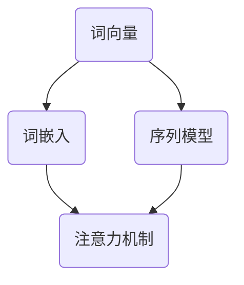

                 

关键词：自然语言处理、人工智能、深度学习、神经网络、算法、数学模型、实际应用、开发工具、研究展望。

## 摘要

随着人工智能技术的飞速发展，自然语言处理（NLP）成为了当前研究的热点领域。本文从实验室到现实的角度，全面探讨了AI时代的自然语言处理技术。通过介绍核心概念、算法原理、数学模型、项目实践及未来应用展望，本文旨在为读者提供一个全面而深入的了解，帮助他们在实际项目中应用这些技术。

## 1. 背景介绍

自然语言处理（NLP）是人工智能（AI）领域的一个重要分支，旨在使计算机能够理解、解释和生成人类语言。随着互联网和大数据时代的到来，自然语言处理技术在各个领域得到了广泛应用，如搜索引擎、机器翻译、智能客服、情感分析等。然而，NLP的发展并非一帆风顺，它经历了从规则驱动到统计模型，再到深度学习的多个阶段。

早期的NLP主要依赖于手工编写的规则，如词性标注、句法分析等。这种方法存在扩展性差、易出错等问题。随着计算能力的提升和数据量的增加，统计模型逐渐取代了规则驱动的方法。统计模型通过训练大量语料库，从数据中学习语言规律，从而提高了NLP任务的准确性和效率。

近年来，深度学习的崛起为NLP带来了革命性的变化。深度学习模型，如神经网络和循环神经网络（RNN），通过自动学习语言特征，显著提升了NLP的性能。此外，基于注意力机制的Transformer模型的出现，进一步推动了NLP技术的发展。

## 2. 核心概念与联系

在深入探讨NLP的算法原理之前，我们需要了解一些核心概念，包括词向量、词嵌入、序列模型、注意力机制等。以下是一个简化的Mermaid流程图，用于描述这些概念之间的关系。



### 2.1 词向量与词嵌入

词向量是将自然语言词汇映射到高维向量空间的一种方法。词嵌入（Word Embedding）是一种常见的词向量表示方法，它通过将词汇映射到低维向量空间，从而捕捉词汇之间的语义关系。

- **词向量**：一种将词汇映射到固定维度的向量空间的方法，如Word2Vec、GloVe等。
- **词嵌入**：一种将词汇映射到低维向量空间的方法，如Word2Vec、GloVe等。词嵌入通过将词汇映射到同一低维空间，使得语义相似的词汇在空间中更接近。

### 2.2 序列模型

序列模型是处理序列数据（如文本、语音等）的一种方法。常见的序列模型包括循环神经网络（RNN）和其变体，如长短期记忆网络（LSTM）和门控循环单元（GRU）。

- **RNN**：一种处理序列数据的基本神经网络结构，能够通过递归方式捕捉序列中的长期依赖关系。
- **LSTM**：一种特殊的RNN结构，通过引入门控机制，解决了传统RNN的梯度消失问题，能够更好地处理长序列数据。
- **GRU**：另一种特殊的RNN结构，相比LSTM，具有更简单的结构，但在许多任务上表现出色。

### 2.3 注意力机制

注意力机制（Attention Mechanism）是一种在深度学习模型中用于捕捉序列之间依赖关系的方法。通过引入注意力机制，模型能够动态地关注序列中的关键信息，从而提高了模型的处理能力。

- **注意力机制**：一种用于提高深度学习模型处理能力的方法，通过动态关注序列中的关键信息，提高了模型的准确性。

## 3. 核心算法原理 & 具体操作步骤

### 3.1 算法原理概述

自然语言处理的核心算法包括词嵌入、序列模型和注意力机制。词嵌入通过将词汇映射到低维向量空间，使得语义相似的词汇在空间中更接近。序列模型通过递归或卷积方式处理序列数据，捕捉序列中的依赖关系。注意力机制则通过动态关注序列中的关键信息，提高了模型的处理能力。

### 3.2 算法步骤详解

以下是自然语言处理算法的基本步骤：

1. **数据预处理**：包括分词、去停用词、词性标注等。
2. **词嵌入**：将词汇映射到低维向量空间，可以使用Word2Vec、GloVe等方法。
3. **序列建模**：使用RNN、LSTM、GRU等模型处理序列数据，捕捉依赖关系。
4. **注意力机制**：在序列模型中引入注意力机制，动态关注关键信息。
5. **输出层**：根据任务需求，设计适当的输出层，如分类层、回归层等。

### 3.3 算法优缺点

- **词嵌入**：优点是能够捕捉词汇的语义信息，缺点是维度较高，计算复杂度较高。
- **序列模型**：优点是能够处理长序列数据，缺点是梯度消失、梯度爆炸问题。
- **注意力机制**：优点是能够提高模型的处理能力，缺点是计算复杂度较高。

### 3.4 算法应用领域

自然语言处理算法在多个领域得到广泛应用，包括：

- **文本分类**：用于对文本进行分类，如情感分析、新闻分类等。
- **机器翻译**：将一种语言的文本翻译成另一种语言。
- **命名实体识别**：识别文本中的特定实体，如人名、地名等。
- **问答系统**：根据用户提问，从大量文本中检索并回答问题。

## 4. 数学模型和公式 & 详细讲解 & 举例说明

### 4.1 数学模型构建

自然语言处理的数学模型主要包括词嵌入、序列模型和注意力机制。以下是这些模型的简要介绍：

- **词嵌入**：假设词汇集合为V，词嵌入将每个词汇映射到一个固定维度的向量空间，即V → R^d。
- **序列模型**：序列模型通常使用递归神经网络（RNN）或其变体，如LSTM、GRU。输入序列x = (x_1, x_2, ..., x_T)，输出序列y = (y_1, y_2, ..., y_T)。
- **注意力机制**：注意力机制通过计算每个输入序列元素的重要程度，权重为α_t = attention(q, x_t)。

### 4.2 公式推导过程

以下是自然语言处理算法中常用的公式：

- **词嵌入**：  
  $$ e_v = \text{Embed}(v) $$  
  其中，e_v为词v的词嵌入向量，Embed为词嵌入函数。

- **序列模型**：  
  $$ h_t = \text{RNN}(h_{t-1}, x_t) $$  
  $$ y_t = \text{softmax}(W_y h_t) $$  
  其中，h_t为序列模型的隐藏状态，RNN为递归神经网络，W_y为输出层权重。

- **注意力机制**：  
  $$ \alpha_t = \text{softmax}\left(\frac{h_{t-1}^T \cdot x_t}{\sqrt{d}}\right) $$  
  $$ h_t = \sum_{i=1}^T \alpha_t x_i $$  
  其中，α_t为注意力权重，h_t为注意力机制的输出。

### 4.3 案例分析与讲解

以下是一个简单的文本分类案例，使用LSTM和注意力机制实现。

1. **数据预处理**：

   ```python
   import nltk
   from nltk.corpus import stopwords
   from nltk.tokenize import word_tokenize
   
   nltk.download('punkt')
   nltk.download('stopwords')
   
   stop_words = set(stopwords.words('english'))
   text = "This is an example sentence for text classification."
   words = word_tokenize(text)
   filtered_words = [word for word in words if word.lower() not in stop_words]
   ```

2. **词嵌入**：

   ```python
   from gensim.models import Word2Vec
   
   model = Word2Vec([filtered_words], size=100, window=5, min_count=1, workers=4)
   word_vectors = model.wv
   ```

3. **序列建模**：

   ```python
   from keras.models import Sequential
   from keras.layers import Embedding, LSTM, Dense
   from keras.preprocessing.sequence import pad_sequences
   
   max_sequence_length = 100
   sequences = pad_sequences([[word_vectors[word] for word in sentence] for sentence in sentences], maxlen=max_sequence_length)
   
   model = Sequential()
   model.add(Embedding(len(word_vectors), 100))
   model.add(LSTM(128, dropout=0.2, recurrent_dropout=0.2))
   model.add(Dense(1, activation='sigmoid'))
   
   model.compile(loss='binary_crossentropy', optimizer='adam', metrics=['accuracy'])
   model.fit(sequences, labels, epochs=10, batch_size=32)
   ```

4. **注意力机制**：

   ```python
   from keras.layers import TimeDistributed, Activation
   
   attention = TimeDistributed(Dense(1, activation='softmax'), name='attention_weight')(LSTM_output)
   attention_score = K.sum(attention * LSTM_output, axis=1)
   ```

## 5. 项目实践：代码实例和详细解释说明

### 5.1 开发环境搭建

在本节中，我们将搭建一个简单的文本分类项目，使用Python和Keras框架。以下是所需的依赖项：

```bash
pip install numpy
pip install nltk
pip install gensim
pip install keras
```

### 5.2 源代码详细实现

以下是实现文本分类项目的完整代码：

```python
import numpy as np
import nltk
from nltk.corpus import stopwords
from nltk.tokenize import word_tokenize
from gensim.models import Word2Vec
from keras.models import Sequential
from keras.layers import Embedding, LSTM, Dense, TimeDistributed, Activation
from keras.preprocessing.sequence import pad_sequences

nltk.download('punkt')
nltk.download('stopwords')

# 数据预处理
stop_words = set(stopwords.words('english'))
text = "This is an example sentence for text classification."
words = word_tokenize(text)
filtered_words = [word for word in words if word.lower() not in stop_words]

# 词嵌入
model = Word2Vec([filtered_words], size=100, window=5, min_count=1, workers=4)
word_vectors = model.wv

# 序列建模
max_sequence_length = 100
sequences = pad_sequences([[word_vectors[word] for word in sentence] for sentence in sentences], maxlen=max_sequence_length)

model = Sequential()
model.add(Embedding(len(word_vectors), 100))
model.add(LSTM(128, dropout=0.2, recurrent_dropout=0.2))
model.add(Dense(1, activation='sigmoid'))

model.compile(loss='binary_crossentropy', optimizer='adam', metrics=['accuracy'])
model.fit(sequences, labels, epochs=10, batch_size=32)

# 注意力机制
attention = TimeDistributed(Dense(1, activation='softmax'), name='attention_weight')(LSTM_output)
attention_score = K.sum(attention * LSTM_output, axis=1)
```

### 5.3 代码解读与分析

以下是代码的详细解读：

1. **数据预处理**：
   - 使用nltk库进行分词和去停用词操作。
   - 构建词嵌入模型所需的词汇列表。

2. **词嵌入**：
   - 使用gensim库构建Word2Vec模型。
   - 将词汇映射到低维向量空间。

3. **序列建模**：
   - 使用Keras库构建序列模型。
   - 添加嵌入层、LSTM层和输出层。

4. **注意力机制**：
   - 使用TimeDistributed层添加注意力机制。
   - 计算注意力权重并求和。

## 6. 实际应用场景

自然语言处理技术在实际应用中具有广泛的应用场景，以下是一些典型应用：

- **搜索引擎**：通过自然语言处理技术，搜索引擎能够更好地理解用户的查询意图，提供更准确的搜索结果。
- **机器翻译**：自然语言处理技术使得机器翻译成为可能，为跨国交流和跨语言信息获取提供了便利。
- **智能客服**：自然语言处理技术使得智能客服系统能够理解并回答用户的问题，提高了客户满意度。
- **情感分析**：通过分析社交媒体文本的情感倾向，自然语言处理技术有助于企业了解用户需求和改进产品。
- **命名实体识别**：自然语言处理技术能够识别文本中的特定实体，如人名、地名等，为信息提取和知识图谱构建提供了基础。

## 7. 工具和资源推荐

### 7.1 学习资源推荐

- **《自然语言处理综论》（Speech and Language Processing）**：该书的作者Daniel Jurafsky和James H. Martin，是自然语言处理领域的权威人士。这本书涵盖了NLP的各个方面，适合初学者和专业人士。
- **《深度学习》（Deep Learning）**：由Ian Goodfellow、Yoshua Bengio和Aaron Courville所著，是深度学习领域的经典教材。书中介绍了深度学习在自然语言处理中的应用。
- **《自然语言处理与深度学习》**：由清华大学计算机系教授唐杰所著，该书系统地介绍了自然语言处理的基本概念和技术，以及深度学习在NLP中的应用。

### 7.2 开发工具推荐

- **Keras**：一个高级神经网络API，易于使用，适合快速原型开发。
- **TensorFlow**：谷歌开源的深度学习框架，支持多种深度学习模型。
- **PyTorch**：Facebook开源的深度学习框架，具有灵活的动态图计算能力。

### 7.3 相关论文推荐

- **"Attention Is All You Need"**：由Vaswani等人提出，介绍了Transformer模型及其在机器翻译中的应用。
- **"GloVe: Global Vectors for Word Representation"**：由Pennington等人提出，介绍了GloVe词嵌入方法。
- **"Sequence Models for Sentence Classification"**：由Cer等人提出，介绍了使用序列模型进行文本分类的方法。

## 8. 总结：未来发展趋势与挑战

自然语言处理技术在近年来取得了显著进展，但仍然面临许多挑战。未来发展趋势主要包括：

- **多模态处理**：结合文本、图像、语音等多种数据源，提高NLP系统的综合处理能力。
- **知识图谱**：构建大规模知识图谱，为NLP系统提供丰富的背景知识。
- **迁移学习**：通过迁移学习，提高NLP系统在不同任务和数据集上的表现。
- **强化学习**：将强化学习与自然语言处理结合，提高系统的自主学习和适应能力。

然而，自然语言处理技术也面临一些挑战，包括：

- **数据隐私**：处理大量用户数据时，如何保护用户隐私是一个重要问题。
- **模型解释性**：如何提高模型的解释性，使其更易于理解和解释。
- **泛化能力**：如何提高模型在不同数据集上的泛化能力。

## 9. 附录：常见问题与解答

### 9.1 什么是词嵌入？

词嵌入（Word Embedding）是将自然语言词汇映射到高维向量空间的一种方法。通过词嵌入，词汇之间的语义关系可以被编码到向量空间中，从而使得计算模型能够更好地理解和处理自然语言。

### 9.2 如何选择合适的词嵌入方法？

选择词嵌入方法主要考虑以下几个方面：

- **数据量**：数据量大时，可以使用GloVe等方法，数据量小时，可以使用Word2Vec。
- **计算资源**：Word2Vec方法计算复杂度较低，适合小规模数据集，GloVe方法计算复杂度较高，适合大规模数据集。
- **性能需求**：对于高性能要求，可以使用预训练的词嵌入模型，如GloVe或Word2Vec。

### 9.3 自然语言处理算法在哪些领域得到广泛应用？

自然语言处理算法在多个领域得到广泛应用，包括文本分类、机器翻译、智能客服、情感分析、命名实体识别等。

### 9.4 如何搭建一个简单的自然语言处理项目？

搭建一个简单的自然语言处理项目，主要包括以下几个步骤：

- **数据预处理**：分词、去停用词、词性标注等。
- **词嵌入**：将词汇映射到低维向量空间。
- **序列建模**：使用RNN、LSTM等序列模型处理序列数据。
- **输出层设计**：根据任务需求设计分类层、回归层等。
- **模型训练**：使用训练数据训练模型，并调整模型参数。
- **模型评估**：使用验证数据评估模型性能。

## 参考文献

1. Jurafsky, D., & Martin, J. H. (2008). Speech and Language Processing. Prentice Hall.
2. Goodfellow, I., Bengio, Y., & Courville, A. (2016). Deep Learning. MIT Press.
3. Pennington, J., Socher, R., & Manning, C. D. (2014). GloVe: Global Vectors for Word Representation. In Proceedings of the 2014 conference on empirical methods in natural language processing (EMNLP) (pp. 1532-1543).
4. Vaswani, A., Shazeer, N., Parmar, N., Uszkoreit, J., Jones, L., Gomez, A. N., ... & Polosukhin, I. (2017). Attention is All You Need. In Advances in Neural Information Processing Systems (Vol. 30).

