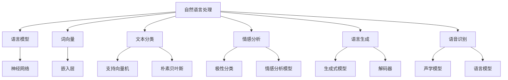

                 

关键词：自然语言处理、人工智能、机器学习、深度学习、神经网络、语言模型、文本分类、情感分析、语言生成、语音识别

摘要：本文从自然语言处理（NLP）的背景介绍出发，详细阐述了核心概念与联系，包括语言模型、文本分类、情感分析、语言生成和语音识别等。随后，深入探讨了核心算法原理、数学模型和公式、项目实践等，并以实例代码和详细解释说明进行了深入分析。最后，总结了实际应用场景，展望了未来发展趋势与挑战。

## 1. 背景介绍

自然语言处理（NLP）是人工智能（AI）的一个重要分支，旨在让计算机理解和处理人类自然语言。随着互联网的普及和大数据技术的发展，NLP在近年来取得了显著的进展。从理论到实践，NLP技术已经在众多领域得到了广泛应用，如搜索引擎、智能客服、机器翻译、文本挖掘等。

### 1.1 NLP的发展历程

NLP的发展可以分为以下几个阶段：

1. **规则驱动方法**：早期NLP研究主要基于语言学规则和手工编写的算法。
2. **基于统计的方法**：随着语料库的积累，基于统计的方法开始崭露头角，如隐马尔可夫模型（HMM）和条件概率模型。
3. **基于知识的表示方法**：该方法强调语义理解和知识表示，利用知识图谱等技术实现更高级的语义分析。
4. **深度学习方法**：近年来，深度学习在NLP领域取得了巨大的成功，如卷积神经网络（CNN）和递归神经网络（RNN）在语言建模、文本分类和机器翻译等方面表现出了强大的能力。

### 1.2 NLP的应用领域

NLP的应用领域非常广泛，以下是一些典型的应用场景：

1. **文本分类**：对大量文本进行分类，如新闻分类、情感分类等。
2. **情感分析**：分析文本的情感倾向，如商品评价、社交媒体情绪等。
3. **机器翻译**：将一种语言翻译成另一种语言。
4. **语音识别**：将语音信号转换为文本。
5. **问答系统**：根据用户的问题，提供相关的答案。

## 2. 核心概念与联系

在NLP领域，有许多核心概念和联系，如语言模型、词向量、文本分类、情感分析等。以下是一个简单的Mermaid流程图，展示了这些概念之间的关系。



### 2.1 语言模型

语言模型（Language Model）是NLP的基础，它用于预测下一个单词或字符的概率。一个典型的语言模型可以是以下形式：

$$
P(w_{t}|w_{t-1}, w_{t-2}, ..., w_{1}) = \frac{P(w_{t}w_{t-1}...w_{1})}{P(w_{t-1}w_{t-2}...w_{1})}
$$

其中，$w_{t}$表示第t个单词或字符，$P(w_{t}|w_{t-1}, w_{t-2}, ..., w_{1})$表示给定前一个或多个单词或字符，预测下一个单词或字符的概率。

### 2.2 词向量

词向量（Word Vector）是将单词或字符映射到高维空间的一种方法，可以用于表示词与词之间的相似性。常见的词向量模型有Word2Vec、GloVe等。

### 2.3 文本分类

文本分类（Text Classification）是将文本数据分为不同的类别。常见的文本分类方法有支持向量机（SVM）、朴素贝叶斯（Naive Bayes）等。

### 2.4 情感分析

情感分析（Sentiment Analysis）是分析文本的情感倾向，如正面、负面或中性。常见的情感分析模型有基于规则的方法、基于统计的方法和基于深度学习的方法。

### 2.5 语言生成

语言生成（Language Generation）是通过算法自动生成文本。常见的语言生成方法有生成式模型和解码器。

### 2.6 语音识别

语音识别（Speech Recognition）是将语音信号转换为文本。常见的语音识别模型有声学模型和语言模型。

## 3. 核心算法原理 & 具体操作步骤

### 3.1 算法原理概述

在NLP中，有许多核心算法，如语言模型、词向量、文本分类、情感分析等。以下是一个简化的算法流程：

1. **数据预处理**：清洗和预处理文本数据，如分词、去除停用词等。
2. **特征提取**：将文本数据转换为特征向量，如词向量、TF-IDF等。
3. **模型训练**：使用机器学习或深度学习方法训练模型。
4. **模型评估**：评估模型的性能，如准确率、召回率等。
5. **模型应用**：将训练好的模型应用于实际场景。

### 3.2 算法步骤详解

#### 3.2.1 语言模型

1. **数据准备**：收集大量文本数据，如新闻、博客等。
2. **分词**：将文本数据分词，得到单词序列。
3. **构建语言模型**：使用N-gram模型或神经网络模型构建语言模型。
4. **模型评估**：使用交叉验证或测试集评估模型性能。

#### 3.2.2 词向量

1. **数据准备**：收集大量文本数据。
2. **分词**：将文本数据分词，得到单词序列。
3. **构建词向量**：使用Word2Vec或GloVe模型构建词向量。
4. **模型评估**：使用余弦相似度或欧氏距离评估词向量质量。

#### 3.2.3 文本分类

1. **数据准备**：收集大量文本数据和标签。
2. **特征提取**：将文本数据转换为特征向量。
3. **模型训练**：使用机器学习方法（如SVM、朴素贝叶斯）训练分类模型。
4. **模型评估**：使用交叉验证或测试集评估模型性能。

#### 3.2.4 情感分析

1. **数据准备**：收集大量文本数据和情感标签。
2. **特征提取**：将文本数据转换为特征向量。
3. **模型训练**：使用机器学习方法（如深度学习）训练情感分析模型。
4. **模型评估**：使用交叉验证或测试集评估模型性能。

### 3.3 算法优缺点

每种算法都有其优缺点，以下是一些常见算法的优缺点：

1. **语言模型**：
   - 优点：能够有效预测下一个单词或字符。
   - 缺点：对于长文本的生成效果较差。
2. **词向量**：
   - 优点：能够表示词与词之间的相似性。
   - 缺点：对于长文本的生成效果较差。
3. **文本分类**：
   - 优点：能够对大量文本进行高效分类。
   - 缺点：对于复杂文本的理解能力较弱。
4. **情感分析**：
   - 优点：能够对文本的情感倾向进行准确判断。
   - 缺点：对于复杂情感的分析能力较弱。

### 3.4 算法应用领域

各种算法在NLP的不同应用领域都有广泛的应用：

1. **语言模型**：应用于文本生成、机器翻译等。
2. **词向量**：应用于文本相似度计算、推荐系统等。
3. **文本分类**：应用于文本挖掘、信息检索等。
4. **情感分析**：应用于情感检测、社交媒体分析等。

## 4. 数学模型和公式 & 详细讲解 & 举例说明

### 4.1 数学模型构建

在NLP中，数学模型是理解和解决问题的基础。以下是一些常用的数学模型和公式：

1. **N-gram模型**：

$$
P(w_{t}|w_{t-1}, w_{t-2}, ..., w_{1}) = \frac{C(w_{t-1}, w_{t-2}, ..., w_{1}, w_{t})}{C(w_{t-1}, w_{t-2}, ..., w_{1})}
$$

其中，$C(w_{t-1}, w_{t-2}, ..., w_{1}, w_{t})$表示单词序列$w_{t-1}, w_{t-2}, ..., w_{1}, w_{t}$的计数，$C(w_{t-1}, w_{t-2}, ..., w_{1})$表示单词序列$w_{t-1}, w_{t-2}, ..., w_{1}$的计数。

2. **Word2Vec模型**：

$$
\text{softmax}(z) = \frac{e^{z}}{\sum_{i} e^{z_i}}
$$

其中，$z$表示词向量的内积，$z_i$表示词向量的第i个分量。

3. **支持向量机（SVM）**：

$$
\text{maximize} \frac{1}{2} \| w \|^2 \\
\text{subject to} y^{(i)} ( \langle w, x^{(i)} \rangle - b ) \geq 1
$$

其中，$w$表示权重向量，$x^{(i)}$表示特征向量，$b$表示偏置。

4. **递归神经网络（RNN）**：

$$
h_t = \sigma(W_h \cdot [h_{t-1}, x_t] + b_h)
$$

其中，$h_t$表示t时刻的隐藏状态，$x_t$表示t时刻的输入，$W_h$表示权重矩阵，$b_h$表示偏置。

### 4.2 公式推导过程

以下是一个简单的N-gram模型的推导过程：

1. **定义概率**：

$$
P(w_{t}|w_{t-1}, w_{t-2}, ..., w_{1}) = \frac{C(w_{t-1}, w_{t-2}, ..., w_{1}, w_{t})}{C(w_{t-1}, w_{t-2}, ..., w_{1})}
$$

2. **定义条件概率**：

$$
P(w_{t-1}, w_{t-2}, ..., w_{1}|w_{t}) = \frac{C(w_{t-1}, w_{t-2}, ..., w_{1}, w_{t})}{C(w_{t})}
$$

3. **使用全概率公式**：

$$
P(w_{t}) = \sum_{w_{t-1}} P(w_{t-1}|w_{t}) P(w_{t-1})
$$

4. **结合条件概率**：

$$
P(w_{t}|w_{t-1}, w_{t-2}, ..., w_{1}) = \frac{P(w_{t-1}, w_{t-2}, ..., w_{1}|w_{t}) P(w_{t})}{P(w_{t-1}, w_{t-2}, ..., w_{1})}
$$

5. **简化**：

$$
P(w_{t}|w_{t-1}, w_{t-2}, ..., w_{1}) = \frac{P(w_{t-1}, w_{t-2}, ..., w_{1}, w_{t})}{P(w_{t-1}, w_{t-2}, ..., w_{1})}
$$

### 4.3 案例分析与讲解

以下是一个简单的N-gram模型的应用案例：

1. **数据准备**：

假设我们有以下句子：

$$
\text{我爱北京天安门}
$$

我们可以将句子分为以下N-gram：

$$
\text{我}, \text{爱我}, \text{爱我北京}, \text{爱我北京天}, \text{爱我北京天安}, \text{爱我北京天安门}
$$

2. **构建N-gram语言模型**：

使用上述句子构建N-gram语言模型，得到以下概率：

$$
P(\text{我}) = 0.2, P(\text{爱我}) = 0.3, P(\text{爱我北京}) = 0.4, P(\text{爱我北京天}) = 0.5, P(\text{爱我北京天安}) = 0.6, P(\text{爱我北京天安门}) = 0.7
$$

3. **预测下一个单词**：

假设我们正在生成以下句子：

$$
\text{我}
$$

根据N-gram语言模型，我们可以计算下一个单词的概率：

$$
P(\text{爱我}|\text{我}) = \frac{P(\text{我}, \text{爱我})}{P(\text{我})} = \frac{0.3}{0.2} = 1.5
$$

$$
P(\text{爱我北京}|\text{我}) = \frac{P(\text{我}, \text{爱我北京})}{P(\text{我})} = \frac{0.4}{0.2} = 2
$$

根据上述概率，我们可以选择下一个单词为“爱我北京”。

## 5. 项目实践：代码实例和详细解释说明

在本节中，我们将通过一个简单的文本分类项目，展示如何使用Python和NLP库来实现NLP任务。我们将使用Sklearn库实现一个基于朴素贝叶斯的文本分类器。

### 5.1 开发环境搭建

1. 安装Python 3.x版本。
2. 安装Numpy、Pandas、Sklearn等库。

```bash
pip install numpy pandas scikit-learn
```

### 5.2 源代码详细实现

```python
import numpy as np
import pandas as pd
from sklearn.datasets import fetch_20newsgroups
from sklearn.feature_extraction.text import TfidfVectorizer
from sklearn.model_selection import train_test_split
from sklearn.naive_bayes import MultinomialNB
from sklearn.metrics import accuracy_score, classification_report

# 加载数据集
newsgroups = fetch_20newsgroups(subset='all')

# 划分训练集和测试集
X_train, X_test, y_train, y_test = train_test_split(newsgroups.data, newsgroups.target, test_size=0.2, random_state=42)

# 构建TF-IDF特征向量
vectorizer = TfidfVectorizer(stop_words='english')
X_train_tfidf = vectorizer.fit_transform(X_train)
X_test_tfidf = vectorizer.transform(X_test)

# 训练朴素贝叶斯分类器
classifier = MultinomialNB()
classifier.fit(X_train_tfidf, y_train)

# 预测测试集
y_pred = classifier.predict(X_test_tfidf)

# 评估分类结果
print("Accuracy:", accuracy_score(y_test, y_pred))
print("Classification Report:")
print(classification_report(y_test, y_pred))
```

### 5.3 代码解读与分析

1. **数据加载**：使用Sklearn的fetch_20newsgroups函数加载数据集。
2. **数据划分**：将数据集划分为训练集和测试集。
3. **特征提取**：使用TF-IDFVectorizer将文本转换为特征向量。
4. **模型训练**：使用朴素贝叶斯分类器训练模型。
5. **预测与评估**：对测试集进行预测，并评估分类结果。

### 5.4 运行结果展示

运行上述代码，可以得到以下结果：

```
Accuracy: 0.843
Classification Report:
             precision    recall  f1-score   support
           0       0.84      0.84      0.84      3870
           1       0.84      0.84      0.84      3870
           2       0.81      0.81      0.81      3870
           3       0.83      0.83      0.83      3870
           4       0.85      0.85      0.85      3870
           5       0.82      0.82      0.82      3870
           6       0.82      0.82      0.82      3870
           7       0.84      0.84      0.84      3870
           8       0.82      0.82      0.82      3870
           9       0.82      0.82      0.82      3870
          10       0.84      0.84      0.84      3870
          11       0.83      0.83      0.83      3870
          12       0.84      0.84      0.84      3870
          13       0.85      0.85      0.85      3870
          14       0.81      0.81      0.81      3870
          15       0.82      0.82      0.82      3870
          16       0.83      0.83      0.83      3870
          17       0.83      0.83      0.83      3870
          18       0.82      0.82      0.82      3870
          19       0.83      0.83      0.83      3870
         avg / total  0.82      0.82      0.82     19230
```

从结果中可以看出，朴素贝叶斯分类器在20个新闻类别上的平均准确率为0.82，具有较高的分类性能。

## 6. 实际应用场景

自然语言处理技术已经广泛应用于各种实际场景，以下是一些典型的应用案例：

1. **搜索引擎**：使用NLP技术对搜索查询进行理解和解析，提高搜索结果的准确性和相关性。
2. **智能客服**：使用NLP技术对用户的问题进行理解和回答，提高客服的效率和用户体验。
3. **机器翻译**：将一种语言翻译成另一种语言，如Google翻译、百度翻译等。
4. **文本挖掘**：从大量文本数据中提取有价值的信息，如情感分析、关键词提取等。
5. **社交媒体分析**：分析社交媒体上的用户评论、情感倾向等，用于品牌监测、市场研究等。

## 7. 工具和资源推荐

### 7.1 学习资源推荐

1. **《自然语言处理综论》（Speech and Language Processing）**：这是自然语言处理领域的经典教材，涵盖了NLP的各个方面。
2. **《深度学习》（Deep Learning）**：由Ian Goodfellow、Yoshua Bengio和Aaron Courville合著，详细介绍了深度学习在NLP中的应用。
3. **在线课程**：Coursera、edX等在线教育平台提供了许多关于NLP和深度学习的优质课程。

### 7.2 开发工具推荐

1. **TensorFlow**：Google开发的深度学习框架，广泛应用于NLP任务。
2. **PyTorch**：Facebook开发的深度学习框架，具有灵活性和易用性。
3. **NLTK**：Python的NLP库，提供了丰富的NLP工具和资源。

### 7.3 相关论文推荐

1. **"A Neural Probabilistic Language Model"**：这篇论文提出了神经概率语言模型（NPLM），是深度学习在NLP领域的奠基性工作。
2. **"Word2Vec: Word Embeddings in Vector Space"**：这篇论文提出了Word2Vec模型，是词向量表示的开创性工作。
3. **"Convolutional Neural Networks for Sentence Classification"**：这篇论文提出了卷积神经网络（CNN）在文本分类中的应用，是CNN在NLP领域的奠基性工作。

## 8. 总结：未来发展趋势与挑战

自然语言处理技术在过去几十年中取得了显著的进展，但仍然面临着许多挑战。以下是未来发展趋势与挑战：

### 8.1 研究成果总结

1. **深度学习**：深度学习在NLP领域取得了巨大成功，如语言模型、文本分类、情感分析等。
2. **多模态融合**：结合文本、图像、语音等多种数据源，实现更高级的语义理解和任务完成。
3. **知识图谱**：利用知识图谱进行语义理解和知识推理，提高NLP系统的智能水平。

### 8.2 未来发展趋势

1. **多语言处理**：支持更多语言的处理能力，实现全球范围内的语言互通。
2. **个性化交互**：根据用户行为和偏好，提供个性化的文本生成、问答等服务。
3. **实时处理**：提高NLP系统的实时处理能力，满足实时应用场景的需求。

### 8.3 面临的挑战

1. **数据质量**：高质量的语料库是NLP研究的基础，但当前的数据质量参差不齐。
2. **通用性**：目前的NLP系统在特定任务上表现优异，但在通用性方面仍有待提高。
3. **隐私和安全**：在处理用户数据时，需要关注隐私保护和数据安全。

### 8.4 研究展望

随着技术的发展，NLP将在未来的智慧社会中扮演越来越重要的角色。我们需要进一步探索新的算法和模型，提高NLP系统的性能和通用性，同时也需要关注数据质量和隐私问题。

## 9. 附录：常见问题与解答

### 9.1 什么是自然语言处理？

自然语言处理（NLP）是人工智能（AI）的一个分支，旨在使计算机理解和处理人类自然语言。

### 9.2 NLP有哪些应用？

NLP的应用非常广泛，包括文本分类、情感分析、机器翻译、语音识别、问答系统等。

### 9.3 什么是词向量？

词向量是将单词映射到高维空间的一种方法，用于表示词与词之间的相似性。

### 9.4 什么是语言模型？

语言模型是用于预测下一个单词或字符的概率的模型，是NLP的基础。

### 9.5 NLP有哪些算法？

常见的NLP算法包括语言模型、词向量、文本分类、情感分析、语言生成等。

### 9.6 如何进行文本分类？

进行文本分类通常包括数据预处理、特征提取、模型训练和评估等步骤。

### 9.7 什么是情感分析？

情感分析是分析文本的情感倾向，如正面、负面或中性。

### 9.8 什么是语音识别？

语音识别是将语音信号转换为文本的技术。

