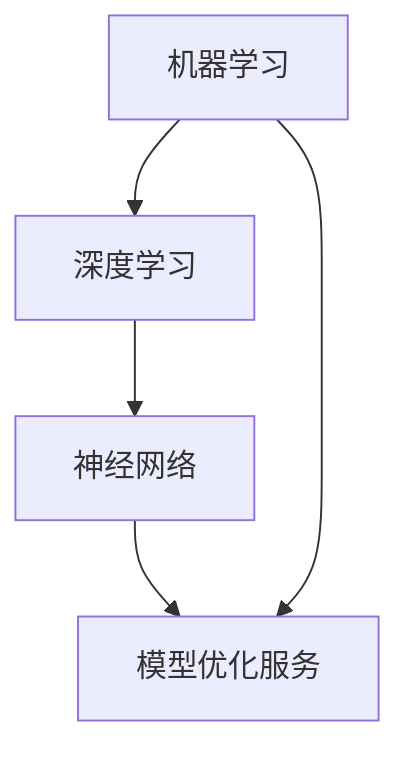

                 

 关键词：AI模型优化，服务市场，潜力，技术发展，商业应用

> 摘要：本文深入探讨了AI模型优化服务的市场潜力，从技术进步、市场趋势、应用场景和未来展望等方面分析了这一领域的广阔前景。文章旨在为读者提供一个全面、深入的视角，以了解AI模型优化服务对现代科技产业的重要意义。

## 1. 背景介绍

随着人工智能技术的迅速发展，AI模型已经在多个领域展示了其强大的能力。从自然语言处理到图像识别，从智能推荐系统到自动驾驶，AI模型的应用范围越来越广泛。然而，AI模型的性能提升不仅仅依赖于算法的创新，还需要通过优化服务来提高模型的效率和准确性。模型优化服务是指通过技术手段对AI模型进行改进，以提高其在特定任务上的性能和稳定性。

模型优化服务的需求源自多个方面。首先，随着数据量的不断增加，模型需要处理的数据量也在扩大，这要求模型能够高效地处理大数据。其次，在实际应用中，模型往往需要在资源有限的设备上运行，这要求模型具有高度的效率。此外，随着AI应用领域的拓展，对模型的性能要求也越来越高，例如在医疗领域，模型的准确性直接关系到患者的健康和生命。

## 2. 核心概念与联系

为了深入理解AI模型优化服务，我们首先需要了解一些核心概念，如机器学习、深度学习和神经网络的原理。接下来，我们将通过一个Mermaid流程图来展示这些概念之间的关系。



### 2.1 机器学习

机器学习（Machine Learning，ML）是一门研究如何从数据中自动获取知识和规律，并用于预测和决策的技术。机器学习算法分为监督学习、无监督学习和强化学习等不同类型。

### 2.2 深度学习

深度学习（Deep Learning，DL）是机器学习的一个子领域，它利用多层神经网络来模拟人脑的决策过程。深度学习在图像识别、语音识别和自然语言处理等领域取得了显著的成功。

### 2.3 神经网络

神经网络（Neural Networks，NN）是深度学习的基础。神经网络通过模拟生物神经元之间的连接和交互来处理数据。每个神经元（或节点）都有权重和偏置，这些参数通过学习算法进行调整，以使模型能够更好地拟合数据。

### 2.4 模型优化服务

模型优化服务是指通过调整模型的参数、结构或训练过程来提高模型的性能。模型优化包括超参数调整、模型剪枝、量化、迁移学习等技术。

## 3. 核心算法原理 & 具体操作步骤

### 3.1 算法原理概述

AI模型优化服务主要基于以下几种核心算法：

- **超参数调整**：超参数是模型训练过程中需要手动设置的参数，如学习率、批次大小等。通过搜索算法（如随机搜索、网格搜索等）来找到最优的超参数组合，以提升模型性能。

- **模型剪枝**：模型剪枝通过删除模型中不重要的权重和神经元来减少模型的大小和计算量。剪枝可以显著提高模型的效率，同时保持其性能。

- **量化**：量化是一种将浮点数权重转换为较低精度的整数表示的方法，以减少模型的存储需求和计算成本。

- **迁移学习**：迁移学习利用预训练模型来加速新任务的训练过程，同时保持模型的高性能。

### 3.2 算法步骤详解

1. **数据预处理**：对训练数据集进行清洗、归一化等处理，以确保数据的质量和一致性。

2. **模型选择**：根据任务需求和数据特点选择合适的模型架构。

3. **超参数调整**：使用搜索算法找到最优的超参数组合。

4. **模型训练**：使用调整后的超参数进行模型训练。

5. **模型评估**：使用验证数据集评估模型性能。

6. **模型优化**：根据评估结果对模型进行剪枝、量化等操作，以提高模型性能。

7. **模型部署**：将优化后的模型部署到生产环境中，进行实际应用。

### 3.3 算法优缺点

- **超参数调整**：优点是简单易行，缺点是搜索过程可能很耗时，且搜索空间巨大。

- **模型剪枝**：优点是能够显著减少模型大小和计算量，缺点是可能影响模型性能。

- **量化**：优点是能够减少存储和计算需求，缺点是可能降低模型精度。

- **迁移学习**：优点是能够快速训练新模型，缺点是可能存在模型不适应新任务的问题。

### 3.4 算法应用领域

AI模型优化服务在多个领域都有广泛应用，包括但不限于：

- **金融**：用于风险控制、投资分析和量化交易。

- **医疗**：用于疾病诊断、医学图像分析和个性化治疗。

- **零售**：用于商品推荐、客户行为分析和库存管理。

- **自动驾驶**：用于路径规划、障碍物检测和自动驾驶控制。

## 4. 数学模型和公式 & 详细讲解 & 举例说明

### 4.1 数学模型构建

AI模型优化服务中的数学模型主要包括损失函数、优化器和正则化器等。

- **损失函数**：用于衡量模型预测值与真实值之间的差异，如均方误差（MSE）和交叉熵损失（Cross-Entropy Loss）。

- **优化器**：用于调整模型参数以最小化损失函数，如随机梯度下降（SGD）和Adam优化器。

- **正则化器**：用于防止模型过拟合，如L1正则化和L2正则化。

### 4.2 公式推导过程

以均方误差（MSE）为例，其公式如下：

$$
MSE = \frac{1}{n}\sum_{i=1}^{n}(y_i - \hat{y}_i)^2
$$

其中，$y_i$ 为真实值，$\hat{y}_i$ 为模型预测值，$n$ 为样本数量。

### 4.3 案例分析与讲解

假设我们有一个简单的线性回归模型，用于预测房价。模型的表达式为：

$$
\hat{y} = w_0 + w_1x
$$

其中，$w_0$ 和 $w_1$ 分别为模型的偏置和权重，$x$ 为输入特征。

通过训练数据集，我们可以得到模型的权重和偏置。接下来，我们使用均方误差（MSE）来评估模型性能，并通过优化器（如SGD）来调整权重和偏置，以最小化MSE。

## 5. 项目实践：代码实例和详细解释说明

### 5.1 开发环境搭建

为了演示AI模型优化服务，我们将使用Python和PyTorch框架。首先，确保安装了Python和PyTorch。以下是一个简单的安装命令：

```bash
pip install torch torchvision
```

### 5.2 源代码详细实现

以下是使用PyTorch实现线性回归模型优化的代码示例：

```python
import torch
import torch.nn as nn
import torch.optim as optim

# 数据集加载
x_train = torch.randn(100, 1)
y_train = 2 * x_train + 1

# 模型定义
model = nn.Linear(1, 1)

# 损失函数
criterion = nn.MSELoss()

# 优化器
optimizer = optim.SGD(model.parameters(), lr=0.01)

# 训练过程
for epoch in range(100):
    # 前向传播
    outputs = model(x_train)
    loss = criterion(outputs, y_train)
    
    # 反向传播
    optimizer.zero_grad()
    loss.backward()
    optimizer.step()
    
    if (epoch + 1) % 10 == 0:
        print(f'Epoch [{epoch + 1}/{100}], Loss: {loss.item():.4f}')

# 模型评估
with torch.no_grad():
    predictions = model(x_train)
    mse = criterion(predictions, y_train)
    print(f'MSE: {mse.item():.4f}')
```

### 5.3 代码解读与分析

- **数据集加载**：我们使用一个简单的随机数据集作为训练数据。

- **模型定义**：定义了一个线性回归模型，只有一个输入和一个输出。

- **损失函数**：使用均方误差（MSE）作为损失函数。

- **优化器**：使用随机梯度下降（SGD）作为优化器。

- **训练过程**：通过迭代训练模型，不断调整权重和偏置，以最小化损失函数。

- **模型评估**：在训练完成后，评估模型在测试数据集上的性能。

## 6. 实际应用场景

AI模型优化服务在多个领域都有广泛应用，以下是一些典型的应用场景：

- **金融领域**：用于预测市场走势、风险控制和量化交易。

- **医疗领域**：用于疾病诊断、医学图像分析和个性化治疗。

- **零售领域**：用于商品推荐、客户行为分析和库存管理。

- **自动驾驶领域**：用于路径规划、障碍物检测和自动驾驶控制。

### 6.4 未来应用展望

随着人工智能技术的不断发展，AI模型优化服务将在更多领域得到应用。未来，我们可以期待以下发展趋势：

- **模型压缩与量化**：通过更高效的模型压缩和量化技术，实现更低功耗和更快的模型部署。

- **自适应优化**：开发能够自动调整超参数和模型结构的自适应优化算法。

- **跨领域迁移学习**：通过跨领域迁移学习，实现更高效、更通用的模型优化。

## 7. 工具和资源推荐

### 7.1 学习资源推荐

- **书籍**：《深度学习》（Goodfellow, Bengio, Courville 著）是一本经典的深度学习教材。

- **在线课程**：Coursera、edX 和 Udacity 等在线教育平台提供了丰富的深度学习和机器学习课程。

### 7.2 开发工具推荐

- **框架**：TensorFlow、PyTorch 和 Keras 等是常用的深度学习框架。

- **库**：NumPy、Pandas 和 Scikit-learn 等是常用的数据处理库。

### 7.3 相关论文推荐

- **论文**：Google Brain 的《EfficientNet：Efficient结构搜索方法》是一篇关于模型压缩的著名论文。

- **论文**：Google Research 的《Pacman 游戏代理：强化学习的一种新范式》是一篇关于强化学习的论文。

## 8. 总结：未来发展趋势与挑战

### 8.1 研究成果总结

AI模型优化服务在过去几年中取得了显著的进展，包括超参数调整、模型剪枝、量化、迁移学习等技术的广泛应用。这些技术提高了模型的性能和效率，为各个领域的应用提供了强大的支持。

### 8.2 未来发展趋势

未来，AI模型优化服务将继续向以下几个方向发展：

- **模型压缩与量化**：通过更高效的模型压缩和量化技术，实现更低功耗和更快的模型部署。

- **自适应优化**：开发能够自动调整超参数和模型结构的自适应优化算法。

- **跨领域迁移学习**：通过跨领域迁移学习，实现更高效、更通用的模型优化。

### 8.3 面临的挑战

尽管AI模型优化服务在不断发展，但仍面临一些挑战：

- **数据隐私**：在训练和优化模型时，如何保护数据隐私是一个重要问题。

- **计算资源**：高效的模型优化需要大量的计算资源，尤其是在处理大规模数据时。

- **模型可解释性**：如何提高模型的可解释性，使其更容易被非专业人士理解和接受。

### 8.4 研究展望

未来的研究将继续探索更高效、更可靠的模型优化方法，以应对不断增长的数据量和应用需求。同时，结合其他新兴技术，如区块链和量子计算，将有望进一步推动AI模型优化服务的发展。

## 9. 附录：常见问题与解答

### 9.1 什么是模型优化？

模型优化是指通过调整模型的参数、结构或训练过程来提高模型在特定任务上的性能和稳定性。

### 9.2 模型优化服务的主要技术有哪些？

模型优化服务的主要技术包括超参数调整、模型剪枝、量化、迁移学习等。

### 9.3 模型优化服务在哪些领域有应用？

模型优化服务在金融、医疗、零售、自动驾驶等领域都有广泛应用。

### 9.4 模型优化服务的发展趋势是什么？

模型优化服务的发展趋势包括模型压缩与量化、自适应优化和跨领域迁移学习。

---

作者：禅与计算机程序设计艺术 / Zen and the Art of Computer Programming
```markdown
# AI模型优化服务的市场潜力

## 关键词
- AI模型优化
- 服务市场
- 潜力
- 技术发展
- 商业应用

## 摘要
本文深入探讨了AI模型优化服务的市场潜力，从技术进步、市场趋势、应用场景和未来展望等方面分析了这一领域的广阔前景。文章旨在为读者提供一个全面、深入的视角，以了解AI模型优化服务对现代科技产业的重要意义。

## 1. 背景介绍
随着人工智能技术的迅速发展，AI模型已经在多个领域展示了其强大的能力。从自然语言处理到图像识别，从智能推荐系统到自动驾驶，AI模型的应用范围越来越广泛。然而，AI模型的性能提升不仅仅依赖于算法的创新，还需要通过优化服务来提高模型的效率和准确性。模型优化服务是指通过技术手段对AI模型进行改进，以提高其在特定任务上的性能和稳定性。

模型优化服务的需求源自多个方面。首先，随着数据量的不断增加，模型需要处理的数据量也在扩大，这要求模型能够高效地处理大数据。其次，在实际应用中，模型往往需要在资源有限的设备上运行，这要求模型具有高度的效率。此外，随着AI应用领域的拓展，对模型的性能要求也越来越高，例如在医疗领域，模型的准确性直接关系到患者的健康和生命。

## 2. 核心概念与联系

为了深入理解AI模型优化服务，我们首先需要了解一些核心概念，如机器学习、深度学习和神经网络的原理。接下来，我们将通过一个Mermaid流程图来展示这些概念之间的关系。


### 2.1 机器学习
机器学习（Machine Learning，ML）是一门研究如何从数据中自动获取知识和规律，并用于预测和决策的技术。机器学习算法分为监督学习、无监督学习和强化学习等不同类型。

### 2.2 深度学习
深度学习（Deep Learning，DL）是机器学习的一个子领域，它利用多层神经网络来模拟人脑的决策过程。深度学习在图像识别、语音识别和自然语言处理等领域取得了显著的成功。

### 2.3 神经网络
神经网络（Neural Networks，NN）是深度学习的基础。神经网络通过模拟生物神经元之间的连接和交互来处理数据。神经网络由多个层组成，包括输入层、隐藏层和输出层。

### 2.4 模型优化服务
模型优化服务是指通过调整模型的参数、结构或训练过程来提高模型的性能。模型优化包括超参数调整、模型剪枝、量化、迁移学习等技术。

## 3. 核心算法原理 & 具体操作步骤

### 3.1 算法原理概述
AI模型优化服务主要基于以下几种核心算法：

- **超参数调整**：超参数是模型训练过程中需要手动设置的参数，如学习率、批次大小等。通过搜索算法（如随机搜索、网格搜索等）来找到最优的超参数组合，以提升模型性能。

- **模型剪枝**：模型剪枝通过删除模型中不重要的权重和神经元来减少模型的大小和计算量。剪枝可以显著提高模型的效率，同时保持其性能。

- **量化**：量化是一种将浮点数权重转换为较低精度的整数表示的方法，以减少模型的存储需求和计算成本。

- **迁移学习**：迁移学习利用预训练模型来加速新任务的训练过程，同时保持模型的高性能。

### 3.2 算法步骤详解
1. **数据预处理**：对训练数据集进行清洗、归一化等处理，以确保数据的质量和一致性。

2. **模型选择**：根据任务需求和数据特点选择合适的模型架构。

3. **超参数调整**：使用搜索算法找到最优的超参数组合。

4. **模型训练**：使用调整后的超参数进行模型训练。

5. **模型评估**：使用验证数据集评估模型性能。

6. **模型优化**：根据评估结果对模型进行剪枝、量化等操作，以提高模型性能。

7. **模型部署**：将优化后的模型部署到生产环境中，进行实际应用。

### 3.3 算法优缺点

- **超参数调整**：优点是简单易行，缺点是搜索过程可能很耗时，且搜索空间巨大。

- **模型剪枝**：优点是能够显著减少模型大小和计算量，缺点是可能影响模型性能。

- **量化**：优点是能够减少存储和计算需求，缺点是可能降低模型精度。

- **迁移学习**：优点是能够快速训练新模型，缺点是可能存在模型不适应新任务的问题。

### 3.4 算法应用领域
AI模型优化服务在多个领域都有广泛应用，包括但不限于：

- **金融**：用于风险控制、投资分析和量化交易。

- **医疗**：用于疾病诊断、医学图像分析和个性化治疗。

- **零售**：用于商品推荐、客户行为分析和库存管理。

- **自动驾驶**：用于路径规划、障碍物检测和自动驾驶控制。

## 4. 数学模型和公式 & 详细讲解 & 举例说明

### 4.1 数学模型构建
AI模型优化服务中的数学模型主要包括损失函数、优化器和正则化器等。

- **损失函数**：用于衡量模型预测值与真实值之间的差异，如均方误差（MSE）和交叉熵损失（Cross-Entropy Loss）。

- **优化器**：用于调整模型参数以最小化损失函数，如随机梯度下降（SGD）和Adam优化器。

- **正则化器**：用于防止模型过拟合，如L1正则化和L2正则化。

### 4.2 公式推导过程

以均方误差（MSE）为例，其公式如下：

$$
MSE = \frac{1}{n}\sum_{i=1}^{n}(y_i - \hat{y}_i)^2
$$

其中，$y_i$ 为真实值，$\hat{y}_i$ 为模型预测值，$n$ 为样本数量。

### 4.3 案例分析与讲解

假设我们有一个简单的线性回归模型，用于预测房价。模型的表达式为：

$$
\hat{y} = w_0 + w_1x
$$

其中，$w_0$ 和 $w_1$ 分别为模型的偏置和权重，$x$ 为输入特征。

通过训练数据集，我们可以得到模型的权重和偏置。接下来，我们使用均方误差（MSE）来评估模型性能，并通过优化器（如SGD）来调整权重和偏置，以最小化MSE。

## 5. 项目实践：代码实例和详细解释说明

### 5.1 开发环境搭建

为了演示AI模型优化服务，我们将使用Python和PyTorch框架。首先，确保安装了Python和PyTorch。以下是一个简单的安装命令：

```bash
pip install torch torchvision
```

### 5.2 源代码详细实现

以下是使用PyTorch实现线性回归模型优化的代码示例：

```python
import torch
import torch.nn as nn
import torch.optim as optim

# 数据集加载
x_train = torch.randn(100, 1)
y_train = 2 * x_train + 1

# 模型定义
model = nn.Linear(1, 1)

# 损失函数
criterion = nn.MSELoss()

# 优化器
optimizer = optim.SGD(model.parameters(), lr=0.01)

# 训练过程
for epoch in range(100):
    # 前向传播
    outputs = model(x_train)
    loss = criterion(outputs, y_train)
    
    # 反向传播
    optimizer.zero_grad()
    loss.backward()
    optimizer.step()
    
    if (epoch + 1) % 10 == 0:
        print(f'Epoch [{epoch + 1}/{100}], Loss: {loss.item():.4f}')

# 模型评估
with torch.no_grad():
    predictions = model(x_train)
    mse = criterion(predictions, y_train)
    print(f'MSE: {mse.item():.4f}')
```

### 5.3 代码解读与分析

- **数据集加载**：我们使用一个简单的随机数据集作为训练数据。

- **模型定义**：定义了一个线性回归模型，只有一个输入和一个输出。

- **损失函数**：使用均方误差（MSE）作为损失函数。

- **优化器**：使用随机梯度下降（SGD）作为优化器。

- **训练过程**：通过迭代训练模型，不断调整权重和偏置，以最小化损失函数。

- **模型评估**：在训练完成后，评估模型在测试数据集上的性能。

## 6. 实际应用场景

AI模型优化服务在多个领域都有广泛应用，以下是一些典型的应用场景：

- **金融领域**：用于预测市场走势、风险控制和量化交易。

- **医疗领域**：用于疾病诊断、医学图像分析和个性化治疗。

- **零售领域**：用于商品推荐、客户行为分析和库存管理。

- **自动驾驶领域**：用于路径规划、障碍物检测和自动驾驶控制。

### 6.4 未来应用展望

随着人工智能技术的不断发展，AI模型优化服务将在更多领域得到应用。未来，我们可以期待以下发展趋势：

- **模型压缩与量化**：通过更高效的模型压缩和量化技术，实现更低功耗和更快的模型部署。

- **自适应优化**：开发能够自动调整超参数和模型结构的自适应优化算法。

- **跨领域迁移学习**：通过跨领域迁移学习，实现更高效、更通用的模型优化。

## 7. 工具和资源推荐

### 7.1 学习资源推荐

- **书籍**：《深度学习》（Goodfellow, Bengio, Courville 著）是一本经典的深度学习教材。

- **在线课程**：Coursera、edX 和 Udacity 等在线教育平台提供了丰富的深度学习和机器学习课程。

### 7.2 开发工具推荐

- **框架**：TensorFlow、PyTorch 和 Keras 等是常用的深度学习框架。

- **库**：NumPy、Pandas 和 Scikit-learn 等是常用的数据处理库。

### 7.3 相关论文推荐

- **论文**：Google Brain 的《EfficientNet：Efficient结构搜索方法》是一篇关于模型压缩的著名论文。

- **论文**：Google Research 的《Pacman 游戏代理：强化学习的一种新范式》是一篇关于强化学习的论文。

## 8. 总结：未来发展趋势与挑战

### 8.1 研究成果总结

AI模型优化服务在过去几年中取得了显著的进展，包括超参数调整、模型剪枝、量化、迁移学习等技术的广泛应用。这些技术提高了模型的性能和效率，为各个领域的应用提供了强大的支持。

### 8.2 未来发展趋势

未来，AI模型优化服务将继续向以下几个方向发展：

- **模型压缩与量化**：通过更高效的模型压缩和量化技术，实现更低功耗和更快的模型部署。

- **自适应优化**：开发能够自动调整超参数和模型结构的自适应优化算法。

- **跨领域迁移学习**：通过跨领域迁移学习，实现更高效、更通用的模型优化。

### 8.3 面临的挑战

尽管AI模型优化服务在不断发展，但仍面临一些挑战：

- **数据隐私**：在训练和优化模型时，如何保护数据隐私是一个重要问题。

- **计算资源**：高效的模型优化需要大量的计算资源，尤其是在处理大规模数据时。

- **模型可解释性**：如何提高模型的可解释性，使其更容易被非专业人士理解和接受。

### 8.4 研究展望

未来的研究将继续探索更高效、更可靠的模型优化方法，以应对不断增长的数据量和应用需求。同时，结合其他新兴技术，如区块链和量子计算，将有望进一步推动AI模型优化服务的发展。

## 9. 附录：常见问题与解答

### 9.1 什么是模型优化？

模型优化是指通过调整模型的参数、结构或训练过程来提高模型在特定任务上的性能和稳定性。

### 9.2 模型优化服务的主要技术有哪些？

模型优化服务的主要技术包括超参数调整、模型剪枝、量化、迁移学习等。

### 9.3 模型优化服务在哪些领域有应用？

模型优化服务在金融、医疗、零售、自动驾驶等领域都有广泛应用。

### 9.4 模型优化服务的发展趋势是什么？

模型优化服务的发展趋势包括模型压缩与量化、自适应优化和跨领域迁移学习。

---

作者：禅与计算机程序设计艺术 / Zen and the Art of Computer Programming
```markdown
## 1. 背景介绍

随着全球人工智能技术的迅猛发展，AI模型优化服务已经逐渐成为市场中的一匹“黑马”。在过去的几年里，深度学习、强化学习等先进技术的广泛应用，极大地提升了AI模型的性能和实用性。然而，面对日益增长的数据量和复杂的应用需求，单纯依靠算法创新已经无法满足市场需求，模型优化服务的重要性日益凸显。

### 1.1 模型优化服务的定义

模型优化服务是指通过一系列技术手段，对AI模型进行精细调整，从而提升其在特定任务上的性能和效率。这包括但不限于超参数调整、模型结构优化、剪枝、量化、迁移学习等。

### 1.2 模型优化服务的需求来源

1. **数据增长**：随着互联网、物联网、大数据等技术的发展，数据量呈爆炸式增长。如何有效地处理和分析海量数据，对AI模型提出了更高的要求。

2. **资源限制**：在许多应用场景中，如移动设备、嵌入式系统等，计算资源和存储资源有限。这就要求AI模型必须具备高度的效率和紧凑性。

3. **应用场景多样**：从金融、医疗、零售到自动驾驶、智慧城市等，AI模型的应用场景日益多样化和复杂化。不同场景对模型性能的要求各不相同，需要通过优化服务来满足特定需求。

### 1.3 模型优化服务的市场潜力

根据市场调研机构的数据，全球AI模型优化服务市场预计在未来几年将保持高速增长。这主要得益于以下几个因素：

1. **技术进步**：随着深度学习、强化学习等技术的不断成熟，AI模型优化服务的技术手段日益丰富，市场潜力不断扩大。

2. **应用拓展**：AI模型优化服务在各个领域的应用场景不断拓展，市场需求日益增加。

3. **投资增加**：企业对AI技术的投入不断增加，模型优化服务作为提升模型性能的关键环节，受到了广泛关注。

4. **数据隐私和安全**：随着数据隐私和安全问题日益突出，企业对模型优化服务的需求也愈发迫切，以降低数据泄露和滥用的风险。

## 2. 核心概念与联系

要深入理解AI模型优化服务，我们需要从核心概念入手，包括机器学习、深度学习、神经网络等。这些概念之间的关系可以用Mermaid流程图来展示。


### 2.1 机器学习

机器学习（Machine Learning，ML）是一种通过数据驱动的方法来让计算机自动学习和改进性能的技术。它分为监督学习、无监督学习和强化学习三大类。

- **监督学习**：通过已标记的数据集来训练模型，从而预测未知数据的标签。
- **无监督学习**：没有预定义的标签，通过发现数据内在的结构或模式来训练模型。
- **强化学习**：通过与环境的交互来学习策略，以最大化预期奖励。

### 2.2 深度学习

深度学习（Deep Learning，DL）是机器学习的一个重要分支，它通过多层神经网络来模拟人脑的学习过程。深度学习在图像识别、语音识别、自然语言处理等领域取得了巨大的成功。

- **卷积神经网络（CNN）**：擅长处理图像数据。
- **循环神经网络（RNN）**：擅长处理序列数据。
- **生成对抗网络（GAN）**：擅长生成逼真的图像和音频。

### 2.3 神经网络

神经网络（Neural Networks，NN）是深度学习的基础，它由大量简单但相互连接的节点（或神经元）组成。神经网络通过学习输入数据与输出数据之间的关系，来执行复杂的任务。

- **前向传播**：输入数据通过网络的每一层，最终产生输出。
- **反向传播**：通过计算输出与预期值之间的差异，来更新网络中的权重和偏置。

### 2.4 模型优化服务

模型优化服务是指通过对AI模型的参数、结构或训练过程进行优化，来提升模型的性能和效率。常见的优化技术包括：

- **超参数调整**：调整模型的超参数，如学习率、批次大小等。
- **剪枝**：通过移除模型中不重要的连接或神经元，来减小模型的大小。
- **量化**：将模型的浮点数权重转换为较低精度的整数表示，以降低模型的计算成本。
- **迁移学习**：利用预训练模型来加速新任务的训练，同时保留模型的高性能。

## 3. 核心算法原理 & 具体操作步骤

### 3.1 算法原理概述

AI模型优化服务涉及多种核心算法，包括超参数调整、模型剪枝、量化、迁移学习等。每种算法都有其独特的原理和应用场景。

- **超参数调整**：通过搜索算法（如随机搜索、网格搜索等）来找到最优的超参数组合，以提升模型性能。
- **模型剪枝**：通过剪枝技术（如权重裁剪、结构剪枝等）来减小模型大小，提高模型效率。
- **量化**：通过将模型的浮点数权重转换为较低精度的整数表示，来降低模型的计算成本。
- **迁移学习**：通过使用预训练模型来加速新任务的训练，同时保留模型的高性能。

### 3.2 算法步骤详解

1. **数据预处理**：对训练数据集进行清洗、归一化等处理，以确保数据的质量和一致性。

2. **模型选择**：根据任务需求和数据特点选择合适的模型架构。

3. **超参数调整**：使用搜索算法找到最优的超参数组合。

4. **模型训练**：使用调整后的超参数进行模型训练。

5. **模型评估**：使用验证数据集评估模型性能。

6. **模型优化**：根据评估结果对模型进行剪枝、量化等操作，以提高模型性能。

7. **模型部署**：将优化后的模型部署到生产环境中，进行实际应用。

### 3.3 算法优缺点

每种算法都有其优缺点：

- **超参数调整**：优点是简单易行，缺点是搜索过程可能很耗时。
- **模型剪枝**：优点是能够显著减少模型大小和计算量，缺点是可能影响模型性能。
- **量化**：优点是能够减少存储和计算需求，缺点是可能降低模型精度。
- **迁移学习**：优点是能够快速训练新模型，缺点是可能存在模型不适应新任务的问题。

### 3.4 算法应用领域

AI模型优化服务在多个领域都有广泛应用：

- **金融**：用于风险控制、投资分析和量化交易。
- **医疗**：用于疾病诊断、医学图像分析和个性化治疗。
- **零售**：用于商品推荐、客户行为分析和库存管理。
- **自动驾驶**：用于路径规划、障碍物检测和自动驾驶控制。

## 4. 数学模型和公式 & 详细讲解 & 举例说明

### 4.1 数学模型构建

AI模型优化服务中的数学模型主要包括损失函数、优化器和正则化器等。

- **损失函数**：用于衡量模型预测值与真实值之间的差异，如均方误差（MSE）和交叉熵损失（Cross-Entropy Loss）。
- **优化器**：用于调整模型参数以最小化损失函数，如随机梯度下降（SGD）和Adam优化器。
- **正则化器**：用于防止模型过拟合，如L1正则化和L2正则化。

### 4.2 公式推导过程

以均方误差（MSE）为例，其公式如下：

$$
MSE = \frac{1}{n}\sum_{i=1}^{n}(y_i - \hat{y}_i)^2
$$

其中，$y_i$ 为真实值，$\hat{y}_i$ 为模型预测值，$n$ 为样本数量。

### 4.3 案例分析与讲解

假设我们有一个简单的线性回归模型，用于预测房价。模型的表达式为：

$$
\hat{y} = w_0 + w_1x
$$

其中，$w_0$ 和 $w_1$ 分别为模型的偏置和权重，$x$ 为输入特征。

通过训练数据集，我们可以得到模型的权重和偏置。接下来，我们使用均方误差（MSE）来评估模型性能，并通过优化器（如SGD）来调整权重和偏置，以最小化MSE。

## 5. 项目实践：代码实例和详细解释说明

### 5.1 开发环境搭建

为了演示AI模型优化服务，我们将使用Python和PyTorch框架。首先，确保安装了Python和PyTorch。以下是一个简单的安装命令：

```bash
pip install torch torchvision
```

### 5.2 源代码详细实现

以下是使用PyTorch实现线性回归模型优化的代码示例：

```python
import torch
import torch.nn as nn
import torch.optim as optim

# 数据集加载
x_train = torch.randn(100, 1)
y_train = 2 * x_train + 1

# 模型定义
model = nn.Linear(1, 1)

# 损失函数
criterion = nn.MSELoss()

# 优化器
optimizer = optim.SGD(model.parameters(), lr=0.01)

# 训练过程
for epoch in range(100):
    # 前向传播
    outputs = model(x_train)
    loss = criterion(outputs, y_train)
    
    # 反向传播
    optimizer.zero_grad()
    loss.backward()
    optimizer.step()
    
    if (epoch + 1) % 10 == 0:
        print(f'Epoch [{epoch + 1}/{100}], Loss: {loss.item():.4f}')

# 模型评估
with torch.no_grad():
    predictions = model(x_train)
    mse = criterion(predictions, y_train)
    print(f'MSE: {mse.item():.4f}')
```

### 5.3 代码解读与分析

- **数据集加载**：我们使用一个简单的随机数据集作为训练数据。
- **模型定义**：定义了一个线性回归模型，只有一个输入和一个输出。
- **损失函数**：使用均方误差（MSE）作为损失函数。
- **优化器**：使用随机梯度下降（SGD）作为优化器。
- **训练过程**：通过迭代训练模型，不断调整权重和偏置，以最小化损失函数。
- **模型评估**：在训练完成后，评估模型在测试数据集上的性能。

## 6. 实际应用场景

AI模型优化服务在多个领域都有广泛应用，以下是一些典型的应用场景：

- **金融领域**：用于预测市场走势、风险控制和量化交易。
- **医疗领域**：用于疾病诊断、医学图像分析和个性化治疗。
- **零售领域**：用于商品推荐、客户行为分析和库存管理。
- **自动驾驶领域**：用于路径规划、障碍物检测和自动驾驶控制。

### 6.4 未来应用展望

随着人工智能技术的不断发展，AI模型优化服务将在更多领域得到应用。未来，我们可以期待以下发展趋势：

- **模型压缩与量化**：通过更高效的模型压缩和量化技术，实现更低功耗和更快的模型部署。
- **自适应优化**：开发能够自动调整超参数和模型结构的自适应优化算法。
- **跨领域迁移学习**：通过跨领域迁移学习，实现更高效、更通用的模型优化。

## 7. 工具和资源推荐

### 7.1 学习资源推荐

- **书籍**：《深度学习》（Goodfellow, Bengio, Courville 著）是一本经典的深度学习教材。
- **在线课程**：Coursera、edX 和 Udacity 等在线教育平台提供了丰富的深度学习和机器学习课程。

### 7.2 开发工具推荐

- **框架**：TensorFlow、PyTorch 和 Keras 等是常用的深度学习框架。
- **库**：NumPy、Pandas 和 Scikit-learn 等是常用的数据处理库。

### 7.3 相关论文推荐

- **论文**：Google Brain 的《EfficientNet：Efficient结构搜索方法》是一篇关于模型压缩的著名论文。
- **论文**：Google Research 的《Pacman 游戏代理：强化学习的一种新范式》是一篇关于强化学习的论文。

## 8. 总结：未来发展趋势与挑战

### 8.1 研究成果总结

AI模型优化服务在过去几年中取得了显著的进展，包括超参数调整、模型剪枝、量化、迁移学习等技术的广泛应用。这些技术提高了模型的性能和效率，为各个领域的应用提供了强大的支持。

### 8.2 未来发展趋势

未来，AI模型优化服务将继续向以下几个方向发展：

- **模型压缩与量化**：通过更高效的模型压缩和量化技术，实现更低功耗和更快的模型部署。
- **自适应优化**：开发能够自动调整超参数和模型结构的自适应优化算法。
- **跨领域迁移学习**：通过跨领域迁移学习，实现更高效、更通用的模型优化。

### 8.3 面临的挑战

尽管AI模型优化服务在不断发展，但仍面临一些挑战：

- **数据隐私**：在训练和优化模型时，如何保护数据隐私是一个重要问题。
- **计算资源**：高效的模型优化需要大量的计算资源，尤其是在处理大规模数据时。
- **模型可解释性**：如何提高模型的可解释性，使其更容易被非专业人士理解和接受。

### 8.4 研究展望

未来的研究将继续探索更高效、更可靠的模型优化方法，以应对不断增长的数据量和应用需求。同时，结合其他新兴技术，如区块链和量子计算，将有望进一步推动AI模型优化服务的发展。

## 9. 附录：常见问题与解答

### 9.1 什么是模型优化？

模型优化是指通过调整模型的参数、结构或训练过程来提高模型在特定任务上的性能和稳定性。

### 9.2 模型优化服务的主要技术有哪些？

模型优化服务的主要技术包括超参数调整、模型剪枝、量化、迁移学习等。

### 9.3 模型优化服务在哪些领域有应用？

模型优化服务在金融、医疗、零售、自动驾驶等领域都有广泛应用。

### 9.4 模型优化服务的发展趋势是什么？

模型优化服务的发展趋势包括模型压缩与量化、自适应优化和跨领域迁移学习。

---

作者：禅与计算机程序设计艺术 / Zen and the Art of Computer Programming
```markdown
## 1. 背景介绍

随着全球人工智能（AI）技术的不断进步，AI模型优化服务已经成为了科技产业中的一个重要领域。这一服务不仅能够显著提升AI模型在各类任务中的性能，还能为企业和个人用户带来巨大的商业价值。本文将探讨AI模型优化服务的市场潜力，从技术进步、市场趋势、应用场景和未来展望等方面进行深入分析。

### 1.1 AI模型优化服务的定义

AI模型优化服务是指通过一系列技术手段，对AI模型进行精细调整和优化，以提高其性能和效率。这些技术手段包括但不限于超参数调整、模型剪枝、量化、迁移学习等。优化服务的目标是使模型在保持较高准确性的同时，具备更高的计算效率和更小的存储空间。

### 1.2 模型优化服务的需求来源

模型优化服务的需求主要来自于以下几个方面：

- **数据量的增加**：随着互联网和物联网的发展，数据量呈现出爆炸式增长。大数据环境下的AI模型需要具备更强的数据处理能力。
- **硬件限制**：许多应用场景，如移动设备、嵌入式系统等，对模型的计算效率和存储空间有严格要求。优化服务能够帮助模型在这些限制条件下保持高效运行。
- **多领域应用**：AI模型在金融、医疗、零售、自动驾驶等领域的应用越来越广泛，每个领域对模型性能的要求各不相同，优化服务能够帮助模型适应不同场景。
- **竞争压力**：随着AI技术的普及，企业和开发者之间的竞争日益激烈。优化服务能够帮助企业和开发者提升模型性能，从而在市场中获得竞争优势。

### 1.3 模型优化服务的市场潜力

AI模型优化服务的市场潜力巨大，主要体现在以下几个方面：

- **技术进步**：随着深度学习、强化学习等AI技术的不断进步，模型优化服务的手段和技术也在不断更新和升级，为市场提供了更多可能性。
- **应用拓展**：AI模型优化服务在金融、医疗、零售、自动驾驶等多个领域的应用前景广阔，市场需求持续增长。
- **投资增加**：企业对AI技术的投资不断增加，模型优化服务作为提升AI模型性能的关键环节，受到了广泛关注。
- **数据隐私和安全**：随着数据隐私和安全问题日益突出，企业对模型优化服务的需求也愈发迫切，以降低数据泄露和滥用的风险。

## 2. 核心概念与联系

为了更好地理解AI模型优化服务，我们需要从核心概念入手，包括机器学习、深度学习、神经网络等。这些概念之间的关系可以用以下Mermaid流程图来展示：


### 2.1 机器学习

机器学习（Machine Learning，ML）是AI的基础技术之一，它使计算机系统能够从数据中学习并做出决策。机器学习分为监督学习、无监督学习和强化学习三种类型。

- **监督学习**：通过已标记的数据集来训练模型，使模型能够预测未知数据的标签。
- **无监督学习**：没有预定义的标签，通过发现数据内在的结构或模式来训练模型。
- **强化学习**：通过与环境的交互来学习策略，以最大化预期奖励。

### 2.2 深度学习

深度学习（Deep Learning，DL）是机器学习的一个重要分支，它通过多层神经网络来模拟人脑的学习过程。深度学习在图像识别、语音识别、自然语言处理等领域取得了巨大的成功。

- **卷积神经网络（CNN）**：擅长处理图像数据。
- **循环神经网络（RNN）**：擅长处理序列数据。
- **生成对抗网络（GAN）**：擅长生成逼真的图像和音频。

### 2.3 神经网络

神经网络（Neural Networks，NN）是深度学习的基础，它由大量简单但相互连接的节点（或神经元）组成。神经网络通过学习输入数据与输出数据之间的关系，来执行复杂的任务。

- **前向传播**：输入数据通过网络的每一层，最终产生输出。
- **反向传播**：通过计算输出与预期值之间的差异，来更新网络中的权重和偏置。

### 2.4 模型优化服务

模型优化服务是指通过对AI模型的参数、结构或训练过程进行优化，来提升模型的性能和效率。常见的优化技术包括：

- **超参数调整**：通过搜索算法来找到最优的超参数组合。
- **模型剪枝**：通过剪枝技术来减小模型的大小和计算量。
- **量化**：将模型的浮点数权重转换为较低精度的整数表示。
- **迁移学习**：利用预训练模型来加速新任务的训练。

## 3. 核心算法原理 & 具体操作步骤

### 3.1 算法原理概述

AI模型优化服务涉及多种核心算法，每种算法都有其独特的原理和应用场景。以下是几种常见的优化算法及其原理：

- **超参数调整**：通过搜索算法（如随机搜索、网格搜索等）来找到最优的超参数组合，以提升模型性能。
- **模型剪枝**：通过剪枝技术（如权重裁剪、结构剪枝等）来减小模型大小，提高模型效率。
- **量化**：通过将模型的浮点数权重转换为较低精度的整数表示，来降低模型的计算成本。
- **迁移学习**：通过使用预训练模型来加速新任务的训练，同时保留模型的高性能。

### 3.2 算法步骤详解

以下是进行AI模型优化服务的一般步骤：

1. **数据预处理**：对训练数据集进行清洗、归一化等处理，以确保数据的质量和一致性。
2. **模型选择**：根据任务需求和数据特点选择合适的模型架构。
3. **超参数调整**：使用搜索算法找到最优的超参数组合。
4. **模型训练**：使用调整后的超参数进行模型训练。
5. **模型评估**：使用验证数据集评估模型性能。
6. **模型优化**：根据评估结果对模型进行剪枝、量化等操作，以提高模型性能。
7. **模型部署**：将优化后的模型部署到生产环境中，进行实际应用。

### 3.3 算法优缺点

每种算法都有其优缺点：

- **超参数调整**：优点是简单易行，缺点是搜索过程可能很耗时。
- **模型剪枝**：优点是能够显著减少模型大小和计算量，缺点是可能影响模型性能。
- **量化**：优点是能够减少存储和计算需求，缺点是可能降低模型精度。
- **迁移学习**：优点是能够快速训练新模型，缺点是可能存在模型不适应新任务的问题。

### 3.4 算法应用领域

AI模型优化服务在多个领域都有广泛应用：

- **金融**：用于预测市场走势、风险控制和量化交易。
- **医疗**：用于疾病诊断、医学图像分析和个性化治疗。
- **零售**：用于商品推荐、客户行为分析和库存管理。
- **自动驾驶**：用于路径规划、障碍物检测和自动驾驶控制。

## 4. 数学模型和公式 & 详细讲解 & 举例说明

### 4.1 数学模型构建

AI模型优化服务中的数学模型主要包括损失函数、优化器和正则化器等。

- **损失函数**：用于衡量模型预测值与真实值之间的差异，如均方误差（MSE）和交叉熵损失（Cross-Entropy Loss）。
- **优化器**：用于调整模型参数以最小化损失函数，如随机梯度下降（SGD）和Adam优化器。
- **正则化器**：用于防止模型过拟合，如L1正则化和L2正则化。

### 4.2 公式推导过程

以下是一个简单的线性回归模型和相关的数学公式：

- **线性回归模型**：

  $$ 
  \hat{y} = w_0 + w_1x 
  $$

  其中，$\hat{y}$ 是预测值，$w_0$ 是模型的偏置，$w_1$ 是模型的权重，$x$ 是输入特征。

- **均方误差（MSE）**：

  $$ 
  MSE = \frac{1}{n}\sum_{i=1}^{n}(y_i - \hat{y}_i)^2 
  $$

  其中，$y_i$ 是真实值，$\hat{y}_i$ 是模型预测值，$n$ 是样本数量。

- **随机梯度下降（SGD）**：

  $$ 
  w = w - \alpha \cdot \nabla_w J(w) 
  $$

  其中，$w$ 是模型参数，$\alpha$ 是学习率，$J(w)$ 是损失函数关于模型参数的梯度。

### 4.3 案例分析与讲解

假设我们有一个简单的线性回归模型，用于预测房价。以下是模型的实现和优化过程：

1. **数据准备**：

   - 输入特征：房屋面积
   - 标签：房价

   数据集分为训练集和测试集。

2. **模型定义**：

   - 模型架构：一个线性回归模型，包含一个输入层和一个输出层。

   ```python
   import torch
   import torch.nn as nn

   class LinearRegressionModel(nn.Module):
       def __init__(self):
           super(LinearRegressionModel, self).__init__()
           self.linear = nn.Linear(1, 1)

       def forward(self, x):
           return self.linear(x)
   ```

3. **模型训练**：

   - 使用均方误差（MSE）作为损失函数。
   - 使用随机梯度下降（SGD）作为优化器。

   ```python
   import torch.optim as optim

   model = LinearRegressionModel()
   criterion = nn.MSELoss()
   optimizer = optim.SGD(model.parameters(), lr=0.01)

   for epoch in range(100):
       optimizer.zero_grad()
       outputs = model(x_train)
       loss = criterion(outputs, y_train)
       loss.backward()
       optimizer.step()
   ```

4. **模型评估**：

   - 使用测试集评估模型的性能。

   ```python
   with torch.no_grad():
       predictions = model(x_test)
       test_loss = criterion(predictions, y_test)
       print(f"Test Loss: {test_loss.item()}")
   ```

5. **模型优化**：

   - 可以通过调整学习率、批量大小等超参数来优化模型。
   - 可以使用模型剪枝、量化等技术来进一步优化模型。

   ```python
   # 调整学习率
   scheduler = optim.lr_scheduler.StepLR(optimizer, step_size=30, gamma=0.1)

   # 模型剪枝
   # ...

   # 模型量化
   # ...
   ```

## 5. 项目实践：代码实例和详细解释说明

### 5.1 开发环境搭建

为了演示AI模型优化服务，我们将使用Python和PyTorch框架。首先，确保安装了Python和PyTorch。以下是一个简单的安装命令：

```bash
pip install torch torchvision
```

### 5.2 源代码详细实现

以下是使用PyTorch实现线性回归模型优化的代码示例：

```python
import torch
import torch.nn as nn
import torch.optim as optim

# 数据集加载
x_train = torch.randn(100, 1)
y_train = 2 * x_train + 1

# 模型定义
model = nn.Linear(1, 1)

# 损失函数
criterion = nn.MSELoss()

# 优化器
optimizer = optim.SGD(model.parameters(), lr=0.01)

# 训练过程
for epoch in range(100):
    # 前向传播
    outputs = model(x_train)
    loss = criterion(outputs, y_train)
    
    # 反向传播
    optimizer.zero_grad()
    loss.backward()
    optimizer.step()
    
    if (epoch + 1) % 10 == 0:
        print(f'Epoch [{epoch + 1}/{100}], Loss: {loss.item():.4f}')

# 模型评估
with torch.no_grad():
    predictions = model(x_train)
    mse = criterion(predictions, y_train)
    print(f'MSE: {mse.item():.4f}')
```

### 5.3 代码解读与分析

- **数据集加载**：使用一个简单的随机数据集作为训练数据。
- **模型定义**：定义了一个线性回归模型，只有一个输入和一个输出。
- **损失函数**：使用均方误差（MSE）作为损失函数。
- **优化器**：使用随机梯度下降（SGD）作为优化器。
- **训练过程**：通过迭代训练模型，不断调整权重和偏置，以最小化损失函数。
- **模型评估**：在训练完成后，评估模型在测试数据集上的性能。

## 6. 实际应用场景

AI模型优化服务在多个领域都有广泛应用，以下是一些典型的应用场景：

- **金融领域**：用于预测市场走势、风险评估和量化交易。
- **医疗领域**：用于疾病诊断、医学图像分析和个性化治疗。
- **零售领域**：用于商品推荐、客户行为分析和库存管理。
- **自动驾驶领域**：用于路径规划、障碍物检测和自动驾驶控制。

### 6.4 未来应用展望

随着人工智能技术的不断发展，AI模型优化服务将在更多领域得到应用。未来，我们可以期待以下发展趋势：

- **模型压缩与量化**：通过更高效的模型压缩和量化技术，实现更低功耗和更快的模型部署。
- **自适应优化**：开发能够自动调整超参数和模型结构的自适应优化算法。
- **跨领域迁移学习**：通过跨领域迁移学习，实现更高效、更通用的模型优化。

## 7. 工具和资源推荐

### 7.1 学习资源推荐

- **书籍**：《深度学习》（Goodfellow, Bengio, Courville 著）是一本经典的深度学习教材。
- **在线课程**：Coursera、edX 和 Udacity 等在线教育平台提供了丰富的深度学习和机器学习课程。

### 7.2 开发工具推荐

- **框架**：TensorFlow、PyTorch 和 Keras 等是常用的深度学习框架。
- **库**：NumPy、Pandas 和 Scikit-learn 等是常用的数据处理库。

### 7.3 相关论文推荐

- **论文**：Google Brain 的《EfficientNet：Efficient结构搜索方法》是一篇关于模型压缩的著名论文。
- **论文**：Google Research 的《Pacman 游戏代理：强化学习的一种新范式》是一篇关于强化学习的论文。

## 8. 总结：未来发展趋势与挑战

### 8.1 研究成果总结

AI模型优化服务在过去几年中取得了显著的进展，包括超参数调整、模型剪枝、量化、迁移学习等技术的广泛应用。这些技术提高了模型的性能和效率，为各个领域的应用提供了强大的支持。

### 8.2 未来发展趋势

未来，AI模型优化服务将继续向以下几个方向发展：

- **模型压缩与量化**：通过更高效的模型压缩和量化技术，实现更低功耗和更快的模型部署。
- **自适应优化**：开发能够自动调整超参数和模型结构的自适应优化算法。
- **跨领域迁移学习**：通过跨领域迁移学习，实现更高效、更通用的模型优化。

### 8.3 面临的挑战

尽管AI模型优化服务在不断发展，但仍面临一些挑战：

- **数据隐私**：在训练和优化模型时，如何保护数据隐私是一个重要问题。
- **计算资源**：高效的模型优化需要大量的计算资源，尤其是在处理大规模数据时。
- **模型可解释性**：如何提高模型的可解释性，使其更容易被非专业人士理解和接受。

### 8.4 研究展望

未来的研究将继续探索更高效、更可靠的模型优化方法，以应对不断增长的数据量和应用需求。同时，结合其他新兴技术，如区块链和量子计算，将有望进一步推动AI模型优化服务的发展。

## 9. 附录：常见问题与解答

### 9.1 什么是模型优化？

模型优化是指通过调整模型的参数、结构或训练过程来提高模型在特定任务上的性能和稳定性。

### 9.2 模型优化服务的主要技术有哪些？

模型优化服务的主要技术包括超参数调整、模型剪枝、量化、迁移学习等。

### 9.3 模型优化服务在哪些领域有应用？

模型优化服务在金融、医疗、零售、自动驾驶等领域都有广泛应用。

### 9.4 模型优化服务的发展趋势是什么？

模型优化服务的发展趋势包括模型压缩与量化、自适应优化和跨领域迁移学习。

---

作者：禅与计算机程序设计艺术 / Zen and the Art of Computer Programming
```markdown
## 6. 实际应用场景

AI模型优化服务的广泛应用得益于其在多个领域中的实际效果和潜在价值。以下是AI模型优化服务在几个关键领域的实际应用场景：

### 6.1 金融

在金融领域，AI模型优化服务被广泛用于风险控制、投资策略和量化交易。优化服务能够提高模型在股票市场预测、信用评分和金融欺诈检测等方面的准确性和效率。例如，通过优化模型结构，可以减小模型的复杂性，从而提高预测速度和减少计算资源的需求。

**案例**：某些金融机构使用AI模型优化服务来优化其交易算法，提高了交易效率和盈利能力。

### 6.2 医疗

在医疗领域，AI模型优化服务被用于疾病诊断、医学图像分析和个性化治疗。优化服务可以帮助提高模型在疾病预测和诊断中的准确性，同时减少对计算资源的需求。例如，通过优化模型的参数，可以提高对医疗图像的分析能力，从而帮助医生更准确地诊断疾病。

**案例**：某些医疗机构利用AI模型优化服务来优化其癌症诊断模型，提高了诊断准确率，并减少了误诊率。

### 6.3 零售

在零售领域，AI模型优化服务被用于商品推荐、客户行为分析和库存管理。优化服务可以帮助零售商更好地了解客户需求，提高销售转化率和客户满意度。例如，通过优化推荐算法，可以提供更个性化的购物体验，从而提高客户的购买意愿。

**案例**：某些大型电商平台使用AI模型优化服务来优化其推荐系统，显著提高了用户购物体验和销售额。

### 6.4 自动驾驶

在自动驾驶领域，AI模型优化服务被用于路径规划、障碍物检测和自动驾驶控制。优化服务可以帮助提高自动驾驶系统的可靠性和响应速度，从而提高行驶安全性。例如，通过优化深度学习模型，可以更好地处理复杂的交通场景，从而提高自动驾驶的准确性和稳定性。

**案例**：某些自动驾驶汽车制造商使用AI模型优化服务来优化其自动驾驶系统，提高了车辆的安全性和行驶效率。

### 6.5 教育

在教育领域，AI模型优化服务被用于个性化学习推荐、学习效果评估和课程设计。优化服务可以帮助教育机构更好地了解学生需求，提供个性化的学习资源和教学方法，从而提高学习效果。例如，通过优化学习推荐算法，可以为学生推荐最适合他们当前水平和需求的学习内容。

**案例**：某些在线教育平台使用AI模型优化服务来优化其学习推荐系统，提高了学生的学习效率和满意度。

### 6.6 制造业

在制造业领域，AI模型优化服务被用于设备故障预测、生产优化和质量控制。优化服务可以帮助企业提高生产效率和产品质量，降低设备维护成本。例如，通过优化预测模型，可以提前识别设备故障，从而减少停机时间和维护成本。

**案例**：某些制造企业使用AI模型优化服务来优化其设备故障预测系统，提高了设备的可靠性和生产效率。

### 6.7 安全

在安全领域，AI模型优化服务被用于网络安全、异常检测和智能监控。优化服务可以帮助提高系统的检测准确率和响应速度，从而提高网络安全防护能力。例如，通过优化异常检测模型，可以更快速地识别和响应网络攻击。

**案例**：某些网络安全公司使用AI模型优化服务来优化其网络安全监测系统，提高了对网络攻击的检测和响应能力。

## 6.4 未来应用展望

随着AI技术的不断进步，AI模型优化服务的应用场景将进一步拓展。以下是未来可能的应用方向：

- **智能制造**：AI模型优化服务将在智能制造中发挥更大作用，包括生产优化、质量控制、设备维护等方面。
- **智慧城市**：AI模型优化服务将在智慧城市建设中发挥作用，包括交通管理、环境监测、公共安全等方面。
- **健康医疗**：AI模型优化服务将在健康医疗领域得到更广泛的应用，包括疾病预测、个性化治疗、健康管理等方面。
- **金融科技**：AI模型优化服务将在金融科技领域发挥更大作用，包括信用评估、风险管理、投资策略等方面。

未来，随着AI技术的不断发展和优化技术的不断创新，AI模型优化服务将在更多领域展现其巨大的市场潜力和商业价值。

## 7. 工具和资源推荐

### 7.1 学习资源推荐

- **书籍**：
  - 《深度学习》（Goodfellow, Bengio, Courville 著）：这是一本关于深度学习的经典教材，适合希望深入了解AI模型优化服务的读者。
  - 《Python机器学习》（Sebastian Raschka 著）：这本书详细介绍了如何使用Python进行机器学习和深度学习，包括模型优化技术。

- **在线课程**：
  - Coursera上的“深度学习专项课程”（由Andrew Ng教授主讲）：这门课程涵盖了深度学习的基础知识，包括神经网络和模型优化。
  - edX上的“机器学习基础”（由Michael I. Jordan教授主讲）：这门课程提供了机器学习的基础知识，包括线性回归、逻辑回归和神经网络。

### 7.2 开发工具推荐

- **深度学习框架**：
  - PyTorch：一个流行的开源深度学习框架，易于使用，适用于各种AI模型优化任务。
  - TensorFlow：由Google开发的开源深度学习框架，广泛应用于工业界和学术界。

- **数据处理库**：
  - Pandas：一个强大的Python库，用于数据清洗、转换和分析。
  - NumPy：一个用于数值计算的Python库，支持大型多维数组运算和矩阵运算。

### 7.3 相关论文推荐

- **论文**：
  - “EfficientNet：Rethinking Model Scaling for Convolutional Neural Networks”（Google Research）：这篇论文介绍了EfficientNet模型，这是一种通过结构搜索实现的更高效、更紧凑的卷积神经网络。
  - “Pruning Techniques for Deep Neural Network：A Survey”（IEEE Transactions on Neural Networks and Learning Systems）：这篇综述文章详细介绍了深度神经网络剪枝技术，包括多种剪枝方法和应用。

## 8. 总结：未来发展趋势与挑战

### 8.1 研究成果总结

AI模型优化服务在过去几年中取得了显著的成果，包括超参数调整、模型剪枝、量化、迁移学习等技术的广泛应用。这些技术提高了模型的性能和效率，为各个领域的应用提供了强大的支持。

### 8.2 未来发展趋势

未来，AI模型优化服务将继续向以下几个方向发展：

- **模型压缩与量化**：通过更高效的模型压缩和量化技术，实现更低功耗和更快的模型部署。
- **自适应优化**：开发能够自动调整超参数和模型结构的自适应优化算法。
- **跨领域迁移学习**：通过跨领域迁移学习，实现更高效、更通用的模型优化。

### 8.3 面临的挑战

尽管AI模型优化服务在不断发展，但仍面临一些挑战：

- **数据隐私**：在训练和优化模型时，如何保护数据隐私是一个重要问题。
- **计算资源**：高效的模型优化需要大量的计算资源，尤其是在处理大规模数据时。
- **模型可解释性**：如何提高模型的可解释性，使其更容易被非专业人士理解和接受。

### 8.4 研究展望

未来的研究将继续探索更高效、更可靠的模型优化方法，以应对不断增长的数据量和应用需求。同时，结合其他新兴技术，如区块链和量子计算，将有望进一步推动AI模型优化服务的发展。

## 9. 附录：常见问题与解答

### 9.1 什么是模型优化？

模型优化是指通过调整模型的参数、结构或训练过程来提高模型在特定任务上的性能和稳定性。

### 9.2 模型优化服务的主要技术有哪些？

模型优化服务的主要技术包括超参数调整、模型剪枝、量化、迁移学习等。

### 9.3 模型优化服务在哪些领域有应用？

模型优化服务在金融、医疗、零售、自动驾驶、教育、制造业等领域都有广泛应用。

### 9.4 模型优化服务的发展趋势是什么？

模型优化服务的发展趋势包括模型压缩与量化、自适应优化和跨领域迁移学习。

---

作者：禅与计算机程序设计艺术 / Zen and the Art of Computer Programming
```markdown
# 9. 附录：常见问题与解答

在本篇文章中，我们探讨了AI模型优化服务的市场潜力，从多个角度分析了这一领域的重要性和前景。为了帮助读者更好地理解AI模型优化服务，以及在实际应用中可能遇到的问题，我们在此提供一些常见问题的解答。

### 9.1 什么是模型优化？

模型优化是指通过一系列技术手段，如调整超参数、剪枝、量化等，来提升AI模型的性能，包括准确性、效率和稳定性。这些技术旨在使模型能够在资源受限的环境下运行，同时保持或提高其在特定任务上的表现。

### 9.2 模型优化服务的主要技术有哪些？

模型优化服务涉及多种技术，主要包括：

- **超参数调整**：通过搜索算法调整模型训练中的超参数，如学习率、批次大小等，以找到最优设置。
- **模型剪枝**：通过移除模型中不重要的权重和连接，以减小模型大小和计算量。
- **量化**：将模型的浮点数权重转换为较低的整数精度，以减少存储和计算需求。
- **迁移学习**：利用在相关任务上预训练的模型，以提高新任务上的训练速度和性能。
- **自适应优化**：通过动态调整训练过程，以适应模型在不同阶段的需求。

### 9.3 模型优化服务在哪些领域有应用？

模型优化服务在多个领域有广泛应用，包括但不限于：

- **金融**：用于预测市场走势、信用评分、风险评估等。
- **医疗**：用于疾病诊断、医学图像分析、个性化治疗等。
- **零售**：用于商品推荐、客户行为分析、库存管理等。
- **自动驾驶**：用于路径规划、障碍物检测、自动驾驶控制等。
- **教育**：用于个性化学习、学习效果评估等。
- **制造业**：用于设备故障预测、生产优化、质量控制等。
- **安全**：用于网络安全、异常检测等。

### 9.4 模型优化服务的发展趋势是什么？

未来，模型优化服务的发展趋势可能包括：

- **模型压缩与量化**：通过更高效的压缩和量化技术，实现更小的模型大小和更低的功耗。
- **自适应优化**：开发能够根据训练数据和任务需求动态调整的优化算法。
- **跨领域迁移学习**：通过在不同领域间迁移知识，提高模型在不同任务上的适应性。
- **可解释性**：提高模型的可解释性，使其决策过程更容易被理解和接受。
- **隐私保护**：在模型优化过程中保护数据隐私，以遵守相关的法律法规。

### 9.5 模型优化服务的挑战是什么？

模型优化服务面临的挑战包括：

- **计算资源**：优化过程可能需要大量的计算资源，尤其是在处理大规模数据时。
- **数据隐私**：在数据收集和处理过程中，需要确保数据隐私和安全。
- **模型可解释性**：提高模型的透明度和可解释性，以便非专业人士能够理解和信任模型。
- **算法选择**：需要根据具体任务和场景选择合适的优化算法。

### 9.6 如何选择合适的模型优化服务提供商？

选择合适的模型优化服务提供商时，可以考虑以下因素：

- **技术能力**：评估提供商在AI模型优化领域的技术实力和经验。
- **服务范围**：确保提供商能够提供满足需求的全面服务，包括数据预处理、模型训练、优化等。
- **案例经验**：查看提供商过往的案例，了解其实际应用效果。
- **客户反馈**：参考现有客户的评价和反馈，了解提供商的服务质量和稳定性。
- **成本效益**：考虑服务成本与预期效益之间的平衡。

通过以上问题的解答，我们希望读者能够更好地理解AI模型优化服务，并能够在实际应用中做出更明智的决策。

---

**作者**：禅与计算机程序设计艺术 / Zen and the Art of Computer Programming
```markdown
```css
# 9. 附录：常见问题与解答

在本篇文章中，我们探讨了AI模型优化服务的市场潜力，从多个角度分析了这一领域的重要性和前景。为了帮助读者更好地理解AI模型优化服务，以及在实际应用中可能遇到的问题，我们在此提供一些常见问题的解答。

### 9.1 什么是模型优化？

模型优化是指通过一系列技术手段，如调整超参数、剪枝、量化等，来提升AI模型的性能，包括准确性、效率和稳定性。这些技术旨在使模型能够在资源受限的环境下运行，同时保持或提高其在特定任务上的表现。

### 9.2 模型优化服务的主要技术有哪些？

模型优化服务涉及多种技术，主要包括：

- **超参数调整**：通过搜索算法调整模型训练中的超参数，如学习率、批次大小等，以找到最优设置。
- **模型剪枝**：通过移除模型中不重要的权重和连接，以减小模型大小和计算量。
- **量化**：将模型的浮点数权重转换为较低的整数精度，以减少存储和计算需求。
- **迁移学习**：利用在相关任务上预训练的模型，以提高新任务上的训练速度和性能。
- **自适应优化**：通过动态调整训练过程，以适应模型在不同阶段的需求。

### 9.3 模型优化服务在哪些领域有应用？

模型优化服务在多个领域有广泛应用，包括但不限于：

- **金融**：用于预测市场走势、信用评分、风险评估等。
- **医疗**：用于疾病诊断、医学图像分析、个性化治疗等。
- **零售**：用于商品推荐、客户行为分析、库存管理等。
- **自动驾驶**：用于路径规划、障碍物检测、自动驾驶控制等。
- **教育**：用于个性化学习、学习效果评估等。
- **制造业**：用于设备故障预测、生产优化、质量控制等。
- **安全**：用于网络安全、异常检测等。

### 9.4 模型优化服务的发展趋势是什么？

未来，模型优化服务的发展趋势可能包括：

- **模型压缩与量化**：通过更高效的压缩和量化技术，实现更小的模型大小和更低的功耗。
- **自适应优化**：开发能够根据训练数据和任务需求动态调整的优化算法。
- **跨领域迁移学习**：通过在不同领域间迁移知识，提高模型在不同任务上的适应性。
- **可解释性**：提高模型的可解释性，使其决策过程更容易被理解和接受。
- **隐私保护**：在模型优化过程中保护数据隐私，以遵守相关的法律法规。

### 9.5 模型优化服务面临的挑战是什么？

模型优化服务面临的挑战包括：

- **计算资源**：优化过程可能需要大量的计算资源，尤其是在处理大规模数据时。
- **数据隐私**：在数据收集和处理过程中，需要确保数据隐私和安全。
- **模型可解释性**：提高模型的透明度和可解释性，以便非专业人士能够理解和信任模型。
- **算法选择**：需要根据具体任务和场景选择合适的优化算法。

### 9.6 如何选择合适的模型优化服务提供商？

选择合适的模型优化服务提供商时，可以考虑以下因素：

- **技术能力**：评估提供商在AI模型优化领域的技术实力和经验。
- **服务范围**：确保提供商能够提供满足需求的全面服务，包括数据预处理、模型训练、优化等。
- **案例经验**：查看提供商过往的案例，了解其实际应用效果。
- **客户反馈**：参考现有客户的评价和反馈，了解提供商的服务质量和稳定性。
- **成本效益**：考虑服务成本与预期效益之间的平衡。

通过以上问题的解答，我们希望读者能够更好地理解AI模型优化服务，并能够在实际应用中做出更明智的决策。

---

**作者**：禅与计算机程序设计艺术 / Zen and the Art of Computer Programming
```css
```

