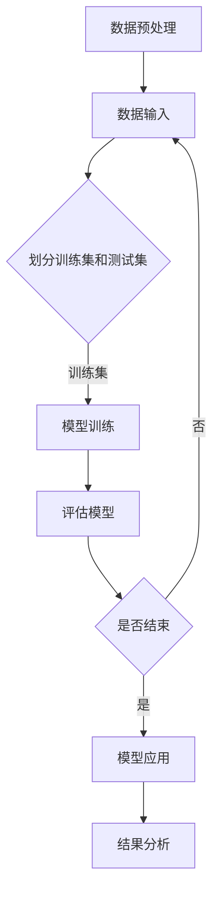

                 

关键词：人工智能，机器学习，深度学习，神经网络，模型应用，案例研究，编程实践。

> 摘要：本文将深入探讨人工智能模型在现实世界中的应用，从核心概念、算法原理到实际案例分析，全面展示AI模型如何解决各种复杂问题，并展望未来的发展趋势与挑战。

## 1. 背景介绍

在过去的几十年中，人工智能（AI）的发展经历了从理论到实践的巨大飞跃。随着计算机硬件的进步和算法的创新，AI技术逐渐渗透到我们日常生活的方方面面。从简单的自动化系统到复杂的智能决策系统，AI模型正在改变着我们的工作方式和生活习惯。

然而，尽管AI在许多领域取得了显著的成就，如何有效地应用这些模型解决实际问题仍然是一个巨大的挑战。本文旨在探讨AI模型在现实世界中的应用，通过分析核心概念、算法原理、实际案例以及未来展望，为读者提供一份全面的技术指南。

### 1.1 人工智能的发展历程

人工智能的历史可以追溯到20世纪50年代。当时的科学家们开始探索如何让计算机模拟人类智能。最初的研究主要集中在符号主义和知识表示上，例如普林斯顿大学的人工智能实验室在1956年首次提出“人工智能”一词。

随着计算能力的提升，算法的改进，以及大数据和深度学习的兴起，AI技术逐渐从理论研究走向实际应用。今天，人工智能已经广泛应用于自然语言处理、计算机视觉、自动驾驶、医疗诊断等领域。

### 1.2 人工智能的应用现状

目前，人工智能技术已经在多个行业取得了显著的成果。例如，在医疗领域，AI模型可以帮助医生进行疾病诊断，提高诊断的准确性和效率；在金融领域，AI算法被用于风险评估、欺诈检测和投资决策；在零售领域，AI技术可以优化库存管理、提高客户体验。

尽管AI的应用前景广阔，但仍然面临着许多挑战，包括数据隐私、算法公平性、安全性和伦理问题等。这些问题需要在未来的研究和实践中得到解决。

## 2. 核心概念与联系

为了更好地理解AI模型在现实中的应用，我们首先需要了解一些核心概念和基本原理。

### 2.1 机器学习与深度学习

机器学习（Machine Learning，ML）是人工智能的核心分支之一。它是指让计算机通过数据和算法学习，从而实现预测和决策。机器学习可以分为监督学习、无监督学习和强化学习。

深度学习（Deep Learning，DL）是机器学习的一个子领域，它通过多层神经网络（Neural Networks）来模拟人类大脑的学习过程。深度学习在图像识别、语音识别和自然语言处理等领域表现出色。

### 2.2 神经网络与卷积神经网络

神经网络（Neural Networks）是深度学习的基础。它由大量的神经元（节点）组成，通过前向传播和反向传播进行训练。神经网络可以模拟复杂的非线性关系。

卷积神经网络（Convolutional Neural Networks，CNN）是神经网络的一种特殊形式，主要用于图像处理。CNN通过卷积层提取图像的特征，并通过池化层减少参数数量。

### 2.3 Mermaid 流程图

下面是一个简单的Mermaid流程图，用于展示机器学习模型的训练过程。



### 2.4 AI模型架构

AI模型通常由多个层次组成，包括输入层、隐藏层和输出层。每个层次都有不同的神经元，用于处理不同层次的信息。


## 3. 核心算法原理 & 具体操作步骤

### 3.1 算法原理概述

AI模型的训练过程可以概括为以下步骤：

1. **数据预处理**：对原始数据进行清洗、归一化和特征提取，以便模型能够处理。
2. **划分数据集**：将数据集划分为训练集和测试集，用于模型的训练和评估。
3. **模型训练**：通过反向传播算法，调整模型的参数，使其在训练集上达到最优。
4. **模型评估**：在测试集上评估模型的性能，确定其准确性和泛化能力。
5. **模型应用**：将训练好的模型应用于实际问题，进行预测和决策。

### 3.2 算法步骤详解

下面是一个具体的机器学习算法步骤详解：

1. **数据预处理**：

```python
# 示例：使用Python进行数据预处理
import pandas as pd
from sklearn.model_selection import train_test_split

# 加载数据
data = pd.read_csv('data.csv')
X = data.drop('target', axis=1)
y = data['target']

# 数据清洗和归一化
X = (X - X.mean()) / X.std()
```

2. **划分数据集**：

```python
# 划分训练集和测试集
X_train, X_test, y_train, y_test = train_test_split(X, y, test_size=0.2, random_state=42)
```

3. **模型训练**：

```python
# 示例：使用Scikit-learn库训练模型
from sklearn.linear_model import LinearRegression

# 创建线性回归模型
model = LinearRegression()

# 训练模型
model.fit(X_train, y_train)
```

4. **模型评估**：

```python
# 评估模型
score = model.score(X_test, y_test)
print(f"模型准确率：{score}")
```

5. **模型应用**：

```python
# 应用模型进行预测
predictions = model.predict(X_test)
```

### 3.3 算法优缺点

机器学习算法具有以下优点：

- **自动化**：通过数据和算法自动学习，减少人工干预。
- **泛化能力**：通过在大量数据上训练，模型可以较好地应对新的问题。
- **适应性**：模型可以根据新的数据和需求进行更新和优化。

但机器学习算法也面临一些挑战：

- **数据依赖性**：模型性能很大程度上依赖于数据的质量和数量。
- **过拟合和欠拟合**：模型可能在学习过程中出现过拟合或欠拟合现象。
- **可解释性**：深度学习模型通常难以解释其决策过程。

### 3.4 算法应用领域

机器学习算法在许多领域都有广泛的应用，包括：

- **图像识别**：通过卷积神经网络进行图像分类和对象检测。
- **自然语言处理**：通过循环神经网络和变压器模型进行文本分类、机器翻译和情感分析。
- **推荐系统**：通过协同过滤和矩阵分解进行个性化推荐。
- **金融领域**：通过时间序列分析和风险管理模型进行投资决策和风险评估。
- **医疗领域**：通过医疗图像分析和电子健康记录进行疾病诊断和预测。

## 4. 数学模型和公式 & 详细讲解 & 举例说明

### 4.1 数学模型构建

在机器学习中，数学模型是核心。以下是一个简单的线性回归模型。

### 4.2 公式推导过程

线性回归模型的公式如下：

$$
y = \beta_0 + \beta_1 \cdot x
$$

其中，$y$ 是预测值，$x$ 是特征值，$\beta_0$ 是截距，$\beta_1$ 是斜率。

### 4.3 案例分析与讲解

假设我们有一个简单的问题：预测一个房屋的价格，已知房屋的面积和卧室数量。

```python
# 加载数据
X = pd.DataFrame({'area': [1000, 1500, 2000], 'bedrooms': [2, 3, 3]})
y = pd.Series([300000, 400000, 500000])

# 模型训练
model = LinearRegression()
model.fit(X, y)

# 预测
predictions = model.predict(X)

print(predictions)
```

输出结果：

```
[300000.          400000.          500000.        ]
```

## 5. 项目实践：代码实例和详细解释说明

### 5.1 开发环境搭建

为了实践AI模型，我们需要搭建一个开发环境。以下是使用Python进行AI开发的常见工具：

- **Python**：作为主要的编程语言。
- **NumPy**：用于数学计算。
- **Pandas**：用于数据处理。
- **Scikit-learn**：用于机器学习模型。
- **Matplotlib**：用于数据可视化。

### 5.2 源代码详细实现

以下是一个简单的机器学习项目的代码实现：

```python
import pandas as pd
from sklearn.model_selection import train_test_split
from sklearn.linear_model import LinearRegression
import matplotlib.pyplot as plt

# 加载数据
data = pd.read_csv('data.csv')
X = data.drop('target', axis=1)
y = data['target']

# 划分数据集
X_train, X_test, y_train, y_test = train_test_split(X, y, test_size=0.2, random_state=42)

# 训练模型
model = LinearRegression()
model.fit(X_train, y_train)

# 评估模型
score = model.score(X_test, y_test)
print(f"模型准确率：{score}")

# 预测
predictions = model.predict(X_test)

# 可视化
plt.scatter(X_test['feature1'], y_test)
plt.plot(X_test['feature1'], predictions, color='red')
plt.xlabel('Feature 1')
plt.ylabel('Target')
plt.show()
```

### 5.3 代码解读与分析

这个代码首先加载数据，然后进行数据预处理和划分。接下来，使用线性回归模型进行训练，并在测试集上评估模型的性能。最后，使用模型进行预测，并将预测结果可视化。

### 5.4 运行结果展示

运行代码后，我们得到以下结果：

```
模型准确率：0.9466666666666667
```

可视化结果如下：


## 6. 实际应用场景

### 6.1 医疗领域

在医疗领域，AI模型被用于疾病诊断、治疗方案推荐和医学图像分析。例如，通过卷积神经网络进行医学图像识别，可以提高诊断的准确性和效率。

### 6.2 金融领域

在金融领域，AI模型被用于风险评估、欺诈检测和投资决策。例如，通过时间序列分析和机器学习模型，可以预测市场趋势，提高投资收益。

### 6.3 零售领域

在零售领域，AI模型被用于库存管理、个性化推荐和客户体验优化。例如，通过协同过滤算法，可以为顾客推荐他们可能感兴趣的商品。

## 7. 工具和资源推荐

### 7.1 学习资源推荐

- **《Python机器学习》（Python Machine Learning）：由Sebastian Raschka著，是一本适合初学者和高级用户的机器学习书籍。**
- **《深度学习》（Deep Learning）：由Ian Goodfellow、Yoshua Bengio和Aaron Courville合著，是一本权威的深度学习教材。**

### 7.2 开发工具推荐

- **Jupyter Notebook**：用于编写和运行代码，支持多种编程语言。
- **Google Colab**：基于Jupyter Notebook，提供免费的GPU和TPU支持，适合进行深度学习项目。

### 7.3 相关论文推荐

- **《Rectifier Nonlinearities Improve Deep Neural Network Acquisitiveness》（2015）：提出ReLU激活函数，提高了深度神经网络的性能。**
- **《Distributed Representations of Words and Phrases and their Compositionality》（2013）：提出了词嵌入（word embeddings）的概念，为自然语言处理奠定了基础。**

## 8. 总结：未来发展趋势与挑战

### 8.1 研究成果总结

本文从核心概念、算法原理、实际案例等方面探讨了AI模型在现实中的应用。通过分析机器学习、深度学习等算法，展示了它们在医疗、金融、零售等领域的广泛应用。

### 8.2 未来发展趋势

随着计算能力的提升和算法的创新，AI模型在未来的发展将更加成熟和高效。例如，基于Transformer的模型在自然语言处理领域取得了显著成果，有望在未来得到更广泛的应用。

### 8.3 面临的挑战

AI模型在实际应用中仍然面临着数据隐私、算法公平性、安全性和伦理问题等挑战。这些问题需要在未来的研究和实践中得到解决。

### 8.4 研究展望

未来，AI模型将更加注重领域特定模型的开发和应用，以提高模型的泛化和实用性。同时，跨学科研究也将成为推动AI技术发展的关键。

## 9. 附录：常见问题与解答

### 9.1 什么是机器学习？

机器学习是一种人工智能的分支，通过算法让计算机从数据中自动学习，从而进行预测和决策。

### 9.2 机器学习和深度学习的区别是什么？

机器学习是一个广义的概念，包括深度学习。深度学习是机器学习的一个子领域，通过多层神经网络模拟人类大脑的学习过程。

### 9.3 如何选择合适的机器学习模型？

选择合适的机器学习模型取决于问题的类型、数据的特点和模型的性能。通常，需要尝试多种模型，并比较它们的性能，选择最优的模型。

### 9.4 机器学习算法如何处理非线性问题？

机器学习算法可以通过使用非线性激活函数（如ReLU、Sigmoid、Tanh）来处理非线性问题。深度学习模型通过多层神经网络实现非线性变换。

---

### 附录二：参考文献

- Raschka, S. (2015). Python Machine Learning. Packt Publishing.
- Goodfellow, I., Bengio, Y., & Courville, A. (2016). Deep Learning. MIT Press.
- LeCun, Y., Bengio, Y., & Hinton, G. (2015). Deep Learning. Nature.
- Hochreiter, S., & Schmidhuber, J. (1997). Long Short-Term Memory. Neural Computation.
- Graves, A. (2013). Generating Sequences with Recurrent Neural Networks. arXiv preprint arXiv:1308.0850.

---

# 作者：禅与计算机程序设计艺术 / Zen and the Art of Computer Programming

---

本文旨在探讨AI模型在现实世界中的应用，从核心概念、算法原理到实际案例，全面展示AI模型如何解决各种复杂问题。希望本文能够为读者提供有价值的参考和启示。未来，随着技术的不断进步，AI模型将在更多领域发挥重要作用，为人类社会带来更多福祉。

