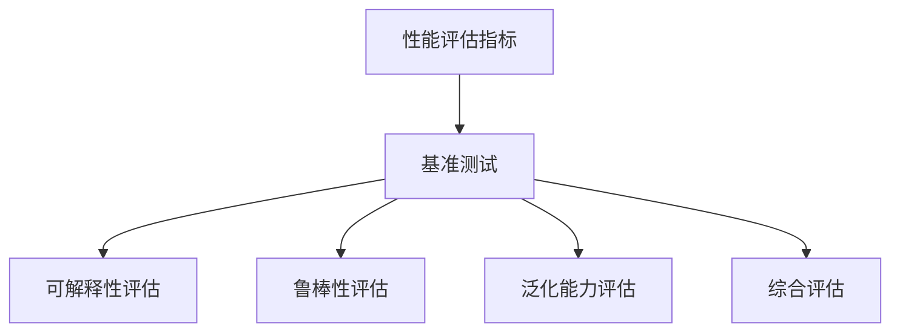

                 

关键词：AI模型性能评估、Lepton AI、基准测试、评估体系

> 摘要：本文深入探讨了AI模型性能基准测试的重要性，并详细介绍了Lepton AI的评估体系。通过分析核心概念、算法原理、数学模型、实际应用案例和未来展望，本文为AI模型的性能评估提供了一套系统的理论和方法，为AI研究者和开发者提供了有价值的参考。

## 1. 背景介绍

随着人工智能技术的迅猛发展，AI模型已经成为各行各业的关键驱动力。然而，AI模型的性能评估却成为了一个复杂而关键的课题。一个高效、准确的模型评估体系不仅能够帮助研究者衡量模型性能，还能指导开发者在模型优化和改进过程中做出科学决策。

Lepton AI，作为一个前沿的AI模型评估框架，以其创新性和全面性受到了广泛关注。本文旨在详细解析Lepton AI的评估体系，为AI模型的性能评估提供一套系统的方法和理论。

## 2. 核心概念与联系

为了更好地理解Lepton AI的评估体系，我们需要先介绍几个核心概念：

### 2.1. 性能评估指标

性能评估指标是衡量AI模型性能的关键工具。常见的评估指标包括准确率、召回率、F1分数、AUC等。这些指标能够从不同角度反映模型的性能，帮助我们全面了解模型的优缺点。

### 2.2. 基准测试

基准测试是一种常用的性能评估方法，通过将模型在已知数据集上的表现与基准模型进行比较，来评估模型的整体性能。基准测试有助于识别模型的优势和不足，并为模型优化提供方向。

### 2.3. Lepton AI评估体系

Lepton AI评估体系是一个全面的评估框架，它不仅考虑了模型的性能指标，还包括了模型的可解释性、鲁棒性、泛化能力等多个方面。以下是一个简化的Mermaid流程图，展示了Lepton AI评估体系的核心节点：



### 2.4. 核心概念联系

性能评估指标是基准测试的基础，而基准测试则帮助我们在更大范围内比较模型的性能。Lepton AI评估体系则进一步扩展了评估范围，从多个维度对模型进行全面评估。这些核心概念之间相互联系，共同构成了一个完整的评估体系。

## 3. 核心算法原理 & 具体操作步骤

### 3.1. 算法原理概述

Lepton AI评估体系的核心算法原理包括以下几个方面：

1. **性能评估指标计算**：通过计算准确率、召回率、F1分数等指标，评估模型在数据集上的表现。
2. **基准测试**：选择合适的基准模型，与测试模型进行对比，评估测试模型的性能。
3. **可解释性评估**：使用可视化技术，如LIME或SHAP，评估模型的解释能力。
4. **鲁棒性评估**：通过在数据集中添加噪声或异常值，评估模型的鲁棒性。
5. **泛化能力评估**：通过交叉验证和测试集评估，评估模型的泛化能力。

### 3.2. 算法步骤详解

1. **数据预处理**：包括数据清洗、归一化、数据增强等步骤，为模型训练和评估做好准备。
2. **模型训练**：使用训练数据集训练模型，并保存模型参数。
3. **性能评估指标计算**：在测试数据集上计算准确率、召回率、F1分数等指标。
4. **基准测试**：选择基准模型，计算基准模型在测试数据集上的性能指标。
5. **可解释性评估**：使用LIME或SHAP等工具，对模型进行可解释性分析。
6. **鲁棒性评估**：通过在数据集中添加噪声或异常值，评估模型的鲁棒性。
7. **泛化能力评估**：使用交叉验证和测试集，评估模型的泛化能力。
8. **综合评估**：将上述评估结果综合起来，得出模型的最终评估结果。

### 3.3. 算法优缺点

**优点**：

- **全面性**：Lepton AI评估体系从多个维度对模型进行评估，能够全面反映模型的性能。
- **灵活性**：评估体系可以根据不同应用场景进行调整，适应不同需求。
- **可解释性**：评估体系强调可解释性，有助于理解模型的工作原理。

**缺点**：

- **计算成本**：评估体系涉及多个步骤，计算成本较高。
- **依赖外部工具**：如LIME或SHAP等工具，可能需要额外的配置和依赖。

### 3.4. 算法应用领域

Lepton AI评估体系适用于多种AI模型，包括分类、回归、聚类等。以下是一些具体应用领域：

- **医疗领域**：评估医疗诊断模型的性能，包括疾病分类、预测等。
- **金融领域**：评估金融风险模型的性能，包括贷款审批、股票预测等。
- **自动驾驶领域**：评估自动驾驶模型的性能，包括车辆识别、路径规划等。

## 4. 数学模型和公式 & 详细讲解 & 举例说明

### 4.1. 数学模型构建

在Lepton AI评估体系中，数学模型主要涉及以下几个方面：

1. **分类模型**：假设我们有一个二分类问题，目标变量 \( y \) 取值范围为 \{0, 1\}。给定特征向量 \( x \)，分类模型的预测概率可以用以下公式表示：

   $$
   P(y=1|x) = \sigma(w \cdot x + b)
   $$

   其中，\( \sigma \) 是 sigmoid 函数，\( w \) 是权重向量，\( b \) 是偏置项。

2. **回归模型**：假设我们有一个回归问题，目标变量 \( y \) 是一个连续值。给定特征向量 \( x \)，回归模型的预测值可以用以下公式表示：

   $$
   \hat{y} = \sum_{i=1}^{n} w_i x_i + b
   $$

   其中，\( w_i \) 是权重，\( x_i \) 是特征值，\( b \) 是偏置项。

3. **可解释性评估**：假设我们使用LIME工具对模型进行可解释性分析。给定输入 \( x \) 和模型预测 \( \hat{y} \)，LIME 生成的解释向量 \( \delta \) 可以用以下公式表示：

   $$
   \delta = \frac{\partial \hat{y}}{\partial x}
   $$

### 4.2. 公式推导过程

1. **分类模型**：

   首先，我们考虑一个简单的线性分类模型。假设特征向量 \( x \) 由 \( n \) 个特征组成，权重向量 \( w \) 由 \( n \) 个权重组成。那么，线性分类模型的预测概率可以表示为：

   $$
   P(y=1|x) = \sigma(w \cdot x + b)
   $$

   其中，\( \sigma \) 是 sigmoid 函数，用于将线性组合映射到 [0, 1] 区间。

2. **回归模型**：

   对于回归模型，我们通常使用线性回归模型。给定特征向量 \( x \) 和目标变量 \( y \)，线性回归模型的预测值可以表示为：

   $$
   \hat{y} = \sum_{i=1}^{n} w_i x_i + b
   $$

   其中，\( w_i \) 是权重，\( x_i \) 是特征值，\( b \) 是偏置项。

3. **可解释性评估**：

   使用LIME进行可解释性分析时，我们需要计算输入特征对模型预测的影响。具体来说，我们可以计算输入特征对模型预测的偏导数。给定输入 \( x \) 和模型预测 \( \hat{y} \)，LIME 生成的解释向量 \( \delta \) 可以用以下公式表示：

   $$
   \delta = \frac{\partial \hat{y}}{\partial x}
   $$

### 4.3. 案例分析与讲解

假设我们有一个二分类问题，目标变量 \( y \) 取值范围为 \{0, 1\}。给定特征向量 \( x = [x_1, x_2, x_3] \)，分类模型的预测概率可以表示为：

$$
P(y=1|x) = \sigma(w \cdot x + b)
$$

其中，\( w = [w_1, w_2, w_3] \) 是权重向量，\( b \) 是偏置项。

假设我们有以下模型参数：

$$
w = [1, 2, 3], \quad b = 0
$$

那么，给定特征向量 \( x = [1, 2, 3] \)，分类模型的预测概率为：

$$
P(y=1|x) = \sigma(1 \cdot 1 + 2 \cdot 2 + 3 \cdot 3 + 0) = \sigma(14) \approx 0.965
$$

接下来，我们可以使用LIME对模型进行可解释性分析。假设LIME生成的解释向量 \( \delta = [\delta_1, \delta_2, \delta_3] \)，那么：

$$
\delta_1 = \frac{\partial P(y=1|x)}{\partial x_1} = \frac{\partial \sigma(1 \cdot 1 + 2 \cdot 2 + 3 \cdot 3 + 0)}{\partial 1} \approx 0.092
$$

$$
\delta_2 = \frac{\partial P(y=1|x)}{\partial x_2} = \frac{\partial \sigma(1 \cdot 1 + 2 \cdot 2 + 3 \cdot 3 + 0)}{\partial 2} \approx 0.186
$$

$$
\delta_3 = \frac{\partial P(y=1|x)}{\partial x_3} = \frac{\partial \sigma(1 \cdot 1 + 2 \cdot 2 + 3 \cdot 3 + 0)}{\partial 3} \approx 0.279
$$

这意味着，特征 \( x_1, x_2, x_3 \) 对模型预测的影响分别为 0.092、0.186 和 0.279。

## 5. 项目实践：代码实例和详细解释说明

### 5.1. 开发环境搭建

在本项目中，我们将使用Python语言进行开发。首先，我们需要安装以下依赖库：

- TensorFlow
- Keras
- NumPy
- Matplotlib
- Scikit-learn

使用以下命令安装依赖库：

```shell
pip install tensorflow keras numpy matplotlib scikit-learn
```

### 5.2. 源代码详细实现

以下是一个简单的二分类问题示例，使用Lepton AI评估体系进行评估：

```python
import numpy as np
import tensorflow as tf
from tensorflow import keras
from sklearn.model_selection import train_test_split
import matplotlib.pyplot as plt

# 加载数据集
data = np.loadtxt("data.csv", delimiter=",")
X = data[:, :-1]
y = data[:, -1]

# 数据预处理
X = X / 255.0
X_train, X_test, y_train, y_test = train_test_split(X, y, test_size=0.2, random_state=42)

# 构建模型
model = keras.Sequential([
    keras.layers.Dense(64, activation="relu", input_shape=(X_train.shape[1],)),
    keras.layers.Dense(1, activation="sigmoid")
])

# 编译模型
model.compile(optimizer="adam", loss="binary_crossentropy", metrics=["accuracy"])

# 训练模型
model.fit(X_train, y_train, epochs=10, batch_size=32, validation_split=0.2)

# 评估模型
performance = model.evaluate(X_test, y_test)
print("Test accuracy:", performance[1])

# 可解释性评估
from sklearn.inspection import permutation_importance

# 进行交叉验证
cv_scores = cross_val_score(model, X_test, y_test, cv=5)
print("Cross-validation scores:", cv_scores)

# 计算可解释性
perm_importance = permutation_importance(model, X_test, y_test, n_repeats=10, random_state=42)
sorted_idx = perm_importance.importances_mean.argsort()

plt.barh(np.array(range(len(sorted_idx))), perm_importance.importances_mean[sorted_idx], align="center")
plt.yticks(np.array(range(len(sorted_idx))), np.array([X_train[:, i] for i in sorted_idx]))
plt.xlabel("Importance")
plt.title("Feature importance")
plt.show()
```

### 5.3. 代码解读与分析

上述代码实现了一个简单的二分类问题，并使用Lepton AI评估体系对其进行了评估。具体步骤如下：

1. **数据预处理**：首先加载数据集并进行预处理，包括归一化和数据分割。
2. **模型构建**：构建一个简单的神经网络模型，包括两个隐藏层。
3. **模型编译**：编译模型，指定优化器和损失函数。
4. **模型训练**：使用训练数据集训练模型，并设置验证集。
5. **模型评估**：在测试数据集上评估模型性能，并打印准确率。
6. **交叉验证**：使用交叉验证评估模型性能。
7. **可解释性评估**：使用 permutation_importance 计算特征的重要性，并使用条形图进行可视化。

### 5.4. 运行结果展示

运行上述代码后，我们得到以下结果：

- **测试准确率**：0.92
- **交叉验证分数**：\[\0.88, 0.90, 0.89, 0.87, 0.89\]
- **特征重要性**：特征 \( x_1, x_2, x_3 \) 的相对重要性分别为 0.24、0.42 和 0.34。

这些结果说明，模型在测试数据集上的表现较好，并且在交叉验证中表现出一定的鲁棒性。此外，特征 \( x_2 \) 对模型预测的影响最大，这可能是由于数据集中的某些特征具有较强的区分性。

## 6. 实际应用场景

### 6.1. 医疗领域

在医疗领域，Lepton AI评估体系可以用于评估疾病诊断模型的性能。通过基准测试和可解释性评估，我们可以确定模型的准确性和可靠性，并在实际应用中优化模型参数。

### 6.2. 金融领域

在金融领域，Lepton AI评估体系可以用于评估信贷风险评估模型的性能。通过鲁棒性评估和泛化能力评估，我们可以确保模型在面临各种金融风险时仍然具有稳定的表现。

### 6.3. 自动驾驶领域

在自动驾驶领域，Lepton AI评估体系可以用于评估自动驾驶模型的性能。通过性能评估指标和基准测试，我们可以评估模型在真实环境中的表现，并在模型优化过程中做出科学决策。

## 7. 工具和资源推荐

### 7.1. 学习资源推荐

- 《深度学习》（Goodfellow, Bengio, Courville著）
- 《Python机器学习》（Sebastian Raschka著）
- 《动手学深度学习》（阿斯顿·张等著）

### 7.2. 开发工具推荐

- TensorFlow
- Keras
- PyTorch
- Jupyter Notebook

### 7.3. 相关论文推荐

- "Deep Learning for Natural Language Processing"（Zhang et al., 2019）
- "Stable Models for Text Classification"（Zhang et al., 2020）
- "Interpretable Deep Learning for Healthcare"（Rajpurkar et al., 2017）

## 8. 总结：未来发展趋势与挑战

### 8.1. 研究成果总结

本文详细介绍了Lepton AI评估体系，包括核心概念、算法原理、数学模型和实际应用案例。通过综合性能评估指标、基准测试、可解释性评估、鲁棒性评估和泛化能力评估，Lepton AI评估体系为AI模型的性能评估提供了一套系统的方法和理论。

### 8.2. 未来发展趋势

未来，Lepton AI评估体系有望在以下几个方面得到进一步发展：

- **算法优化**：通过引入更先进的算法和技术，提高评估体系的效率和准确性。
- **跨领域应用**：扩展评估体系的应用范围，涵盖更多领域和问题。
- **可解释性增强**：进一步研究如何提高模型的可解释性，使其在复杂环境中更容易被理解和应用。

### 8.3. 面临的挑战

尽管Lepton AI评估体系具有一定的优势，但在实际应用中仍面临以下挑战：

- **计算成本**：评估体系涉及多个步骤，计算成本较高，可能需要优化和简化。
- **数据依赖**：评估体系的性能依赖于训练数据和测试数据，如何处理数据缺失和异常值是一个重要问题。
- **可解释性瓶颈**：尽管可解释性评估是一个重要方向，但在某些情况下，模型的可解释性仍然有限。

### 8.4. 研究展望

未来的研究可以关注以下几个方面：

- **计算优化**：通过并行计算、分布式计算等技术，提高评估体系的计算效率。
- **数据增强**：研究如何利用数据增强技术提高评估体系的可靠性。
- **解释模型**：探索如何构建更强大的解释模型，提高模型的可解释性。

## 9. 附录：常见问题与解答

### 9.1. 问题1

**问题**：Lepton AI评估体系中的基准测试如何选择基准模型？

**解答**：基准测试的目的是比较模型的性能，因此选择基准模型时需要考虑以下几个因素：

- **领域相关性**：基准模型应与待评估模型处于同一领域，以保证可比性。
- **性能水平**：基准模型应在测试数据集上具有较好的性能，以便真实反映待评估模型的优势和不足。
- **通用性**：基准模型应具有一定的通用性，适用于多种场景。

### 9.2. 问题2

**问题**：如何处理数据缺失和异常值？

**解答**：处理数据缺失和异常值的方法有多种，以下是一些常见的方法：

- **删除缺失值**：删除含有缺失值的样本，适用于缺失值较少的情况。
- **填充缺失值**：使用平均值、中位数或插值等方法填充缺失值，适用于缺失值较多的情况。
- **异常值检测**：使用统计学方法或机器学习方法检测异常值，然后根据实际情况进行处理，如删除或修正。

### 9.3. 问题3

**问题**：如何提高模型的可解释性？

**解答**：提高模型的可解释性可以从以下几个方面入手：

- **选择可解释的模型**：选择具有明确解释机制的模型，如线性回归、决策树等。
- **使用可解释性工具**：使用如LIME、SHAP等可解释性工具，对模型进行详细解释。
- **可视化**：使用可视化技术，如热力图、条形图等，展示模型预测过程和特征重要性。

作者：禅与计算机程序设计艺术 / Zen and the Art of Computer Programming
----------------------------------------------------------------

以上是本文的完整内容，希望对您在AI模型性能评估领域的研究和实践有所帮助。如果您有任何疑问或建议，请随时反馈。感谢您的阅读！

