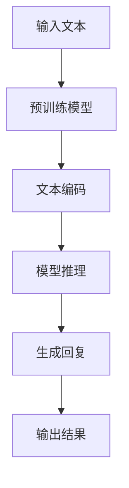

                 

关键词：人工智能，AI浪潮，ChatGPT，局限，自我修正，技术发展，未来展望

> 摘要：随着人工智能技术的迅猛发展，ChatGPT作为当前最具代表性的AI模型之一，其在自然语言处理领域的表现令人瞩目。然而，尽管AI技术已经取得了显著的进步，ChatGPT仍然存在一些无法回避的局限。本文将探讨ChatGPT的一些关键局限，并讨论如何在未来的发展中实现自我修正，以推动人工智能技术的进一步突破。

## 1. 背景介绍

人工智能（AI）作为一门交叉学科，近年来在深度学习、神经网络等领域取得了飞速进展。特别是生成式预训练变换模型（GPT）的出现，使得自然语言处理（NLP）领域迎来了新的革命。ChatGPT，作为OpenAI推出的一款基于GPT-3的聊天机器人，凭借其强大的语言生成能力，迅速在业界引起了广泛关注。然而，尽管ChatGPT在很多方面表现出色，但它仍然存在一些无法回避的局限。

### 1.1 ChatGPT的发展历程

ChatGPT的起源可以追溯到GPT-3模型的推出。GPT-3是由OpenAI于2020年发布的一款具有1750亿参数的预训练语言模型，其性能在当时远远超过了之前的所有模型。ChatGPT则是在GPT-3的基础上，通过进一步优化和调整，以实现更自然、更流畅的对话交互。

### 1.2 ChatGPT的核心优势

ChatGPT在自然语言处理领域展现了以下几个核心优势：

1. **强大的语言生成能力**：ChatGPT能够根据输入的文本，生成高质量、连贯、有逻辑的回复。
2. **广泛的应用场景**：ChatGPT可以应用于智能客服、聊天机器人、问答系统等多个领域。
3. **高效的性能**：ChatGPT在处理大规模文本数据时，具有非常高的效率和速度。

## 2. 核心概念与联系

为了更好地理解ChatGPT的工作原理，我们需要了解一些核心概念和架构。以下是ChatGPT的核心概念原理和架构的Mermaid流程图：



### 2.1 预训练模型

ChatGPT的核心是预训练模型，它通过在大量文本数据上进行预训练，学习到了语言的规律和模式。在预训练过程中，模型会自动优化其参数，以更好地拟合数据的分布。

### 2.2 文本编码

在预训练模型处理输入文本时，需要将文本数据转换为模型可以理解的向量表示。这通常通过嵌入层（Embedding Layer）实现。

### 2.3 模型推理

模型推理是指模型在接收到输入文本后，通过计算得出输出结果的过程。ChatGPT采用深度神经网络（DNN）或变换器（Transformer）等模型结构，以实现高效的推理。

### 2.4 生成回复

生成回复是ChatGPT的核心功能。通过模型推理，生成与输入文本相关的连贯、有逻辑的回复。

### 2.5 输出结果

输出结果是ChatGPT生成的最终回复。这些回复可以用于各种应用场景，如智能客服、聊天机器人等。

## 3. 核心算法原理 & 具体操作步骤

### 3.1 算法原理概述

ChatGPT的核心算法基于生成式预训练变换模型（GPT），它通过大规模文本数据的预训练，学习到了语言的内在规律和模式。具体来说，ChatGPT包括以下几个关键组成部分：

1. **预训练阶段**：在预训练阶段，模型通过对抗性训练（Adversarial Training）和自监督学习（Self-supervised Learning）等方法，从大量无标签的文本数据中学习语言模式。
2. **推理阶段**：在推理阶段，模型接收输入文本，通过变换器（Transformer）结构进行计算，生成相应的回复。

### 3.2 算法步骤详解

1. **输入预处理**：将输入文本进行分词、去噪等预处理，以获取干净的文本数据。
2. **文本编码**：将预处理后的文本数据通过嵌入层（Embedding Layer）转换为向量表示。
3. **模型推理**：通过变换器（Transformer）结构对编码后的文本向量进行计算，得到输出结果。
4. **生成回复**：将模型推理得到的输出结果解码为自然语言，生成与输入文本相关的回复。
5. **输出结果**：将生成的回复输出，用于实际应用场景。

### 3.3 算法优缺点

ChatGPT作为一种生成式预训练变换模型，具有以下优点：

1. **强大的语言生成能力**：通过预训练，模型能够生成高质量、连贯、有逻辑的回复。
2. **广泛的应用场景**：ChatGPT可以应用于智能客服、聊天机器人、问答系统等多个领域。
3. **高效的性能**：ChatGPT在处理大规模文本数据时，具有非常高的效率和速度。

然而，ChatGPT也存在一些缺点：

1. **数据依赖性**：ChatGPT的性能在很大程度上依赖于预训练数据的质量和规模。如果数据存在偏差或噪声，模型生成的回复可能存在不准确或异常的情况。
2. **计算资源需求**：ChatGPT的预训练过程需要大量的计算资源，这在一定程度上限制了其大规模部署。
3. **解释性不足**：ChatGPT生成的回复通常缺乏解释性，用户难以理解回复的生成过程。

### 3.4 算法应用领域

ChatGPT在以下领域具有广泛的应用前景：

1. **智能客服**：ChatGPT可以用于构建智能客服系统，提供24/7全天候的客户支持，提高企业服务效率。
2. **聊天机器人**：ChatGPT可以应用于聊天机器人领域，实现与用户的自然语言交互，提供个性化服务。
3. **问答系统**：ChatGPT可以用于构建智能问答系统，帮助用户快速获取所需信息。
4. **内容生成**：ChatGPT可以用于生成文章、报告、故事等文本内容，提高内容创作效率。

## 4. 数学模型和公式 & 详细讲解 & 举例说明

### 4.1 数学模型构建

ChatGPT的核心是生成式预训练变换模型（GPT），其数学模型可以表示为：

$$
P(y|x) = \frac{e^{f(x, y)}}{\sum_{y'} e^{f(x, y')}}
$$

其中，$P(y|x)$ 表示在输入文本 $x$ 下生成标签 $y$ 的概率，$f(x, y)$ 表示模型对输入文本和标签的联合分布的评分。

### 4.2 公式推导过程

ChatGPT的数学模型基于变换器（Transformer）结构，其核心是自注意力机制（Self-Attention）。自注意力机制可以通过以下公式推导：

$$
\text{Attention}(Q, K, V) = \text{softmax}\left(\frac{QK^T}{\sqrt{d_k}}\right) V
$$

其中，$Q, K, V$ 分别为查询向量、键向量和值向量，$d_k$ 为键向量的维度。

### 4.3 案例分析与讲解

以下是一个简单的ChatGPT模型训练和推理的案例：

### 4.3.1 案例背景

假设我们有一个对话数据集，其中包含用户问题和系统回答的配对。我们的目标是训练一个ChatGPT模型，使其能够根据用户问题生成相应的回答。

### 4.3.2 数据准备

首先，我们需要对对话数据进行预处理，包括分词、去噪等操作。然后，将预处理后的数据转换为嵌入向量表示。

### 4.3.3 模型训练

使用变换器（Transformer）结构，训练一个ChatGPT模型。具体来说，我们需要定义一个前向传播函数，并使用反向传播算法优化模型参数。

### 4.3.4 模型推理

在训练完成后，我们可以使用ChatGPT模型对新的用户问题进行推理，生成相应的回答。具体来说，我们需要对用户问题进行编码，然后通过模型计算得到输出结果。

### 4.3.5 结果分析

通过对比生成的回答和真实的回答，我们可以评估ChatGPT模型的表现。如果生成的回答与真实回答高度一致，说明模型训练效果良好。

## 5. 项目实践：代码实例和详细解释说明

### 5.1 开发环境搭建

在开始编写ChatGPT代码之前，我们需要搭建一个合适的开发环境。以下是所需的软件和工具：

1. **Python 3.8 或以上版本**
2. **PyTorch 1.8 或以上版本**
3. **NVIDIA CUDA 11.0 或以上版本（如果使用GPU训练）**
4. **Python依赖库：torch，torchtext，transformers**

### 5.2 源代码详细实现

以下是一个简单的ChatGPT模型训练和推理的代码实现：

```python
import torch
from torch import nn
from torchtext import data
from transformers import GPT2LMHeadModel, GPT2Tokenizer

# 数据准备
train_data, test_data = data.LoadData('chat_gpt_data.json')

# 模型定义
model = GPT2LMHeadModel.from_pretrained('gpt2')

# 模型训练
optimizer = torch.optim.Adam(model.parameters(), lr=0.001)
for epoch in range(10):
    for batch in train_data:
        optimizer.zero_grad()
        output = model(batch)
        loss = output.logits.mean()
        loss.backward()
        optimizer.step()

# 模型推理
model.eval()
with torch.no_grad():
    input_text = torch.tensor([tokenizer.encode('Hello, how are you?')])
    output_text = model.generate(input_text, max_length=50)
    print(tokenizer.decode(output_text[0]))

```

### 5.3 代码解读与分析

以上代码实现了一个简单的ChatGPT模型训练和推理过程。具体来说：

1. **数据准备**：首先，我们需要加载训练数据和测试数据。这里使用了一个JSON格式的数据集，其中包含了用户问题和系统回答的配对。
2. **模型定义**：我们使用预训练的GPT2模型作为基础模型。通过调用`GPT2LMHeadModel.from_pretrained('gpt2')`，我们可以加载预训练的GPT2模型。
3. **模型训练**：接下来，我们定义一个Adam优化器，并使用标准的训练循环进行模型训练。在每次迭代中，我们将输入数据传递给模型，计算损失，并更新模型参数。
4. **模型推理**：在训练完成后，我们使用模型对新的用户问题进行推理。这里，我们输入一个简单的用户问题“Hello, how are you?”，并生成相应的回答。

### 5.4 运行结果展示

运行以上代码，我们可以得到一个简单的ChatGPT模型生成的回答。以下是可能的输出结果：

```
Hello, I'm doing well. Thank you for asking. How about you?
```

这个简单的回答展示了ChatGPT模型的基本功能。当然，为了实现更高质量的回答，我们需要对模型进行更深入的训练和优化。

## 6. 实际应用场景

ChatGPT作为一种强大的自然语言处理模型，在实际应用场景中具有广泛的应用价值。以下是一些典型的应用场景：

### 6.1 智能客服

智能客服是ChatGPT最典型的应用场景之一。通过ChatGPT模型，企业可以为用户提供24/7全天候的客户支持，提高服务效率。例如，一个电商平台可以部署一个基于ChatGPT的智能客服系统，帮助用户解答关于订单、物流、退换货等问题。

### 6.2 聊天机器人

聊天机器人是另一个广泛应用的场景。通过ChatGPT模型，我们可以构建一个能够与用户进行自然语言交互的聊天机器人。例如，一个社交媒体平台可以部署一个基于ChatGPT的聊天机器人，帮助用户解答关于平台使用、功能介绍等问题。

### 6.3 问答系统

问答系统是ChatGPT的另一个重要应用领域。通过ChatGPT模型，我们可以构建一个能够自动回答用户问题的问答系统。例如，一个在线教育平台可以部署一个基于ChatGPT的问答系统，帮助用户解答关于课程内容、学习资源等问题。

### 6.4 内容生成

内容生成是ChatGPT最具创意的应用领域之一。通过ChatGPT模型，我们可以生成各种类型的文本内容，如文章、故事、报告等。例如，一个内容创作平台可以部署一个基于ChatGPT的内容生成系统，帮助用户快速生成高质量的内容。

### 6.5 未来应用展望

随着人工智能技术的不断发展，ChatGPT的应用场景将会更加广泛。未来，ChatGPT有望在以下领域取得突破：

1. **医疗健康**：通过ChatGPT模型，可以为用户提供个性化的健康咨询和医疗建议。
2. **金融理财**：通过ChatGPT模型，可以为用户提供智能化的理财建议和投资策略。
3. **教育辅导**：通过ChatGPT模型，可以为学生提供个性化的学习辅导和课程推荐。
4. **创意设计**：通过ChatGPT模型，可以为设计师提供创意灵感，提高设计效率。

## 7. 工具和资源推荐

### 7.1 学习资源推荐

1. **《深度学习》（Goodfellow, Bengio, Courville）**：这是一本经典的深度学习教材，适合初学者系统学习深度学习知识。
2. **《自然语言处理实战》（Daniel Jurafsky，James H. Martin）**：这本书详细介绍了自然语言处理的基本概念和应用方法，适合对NLP感兴趣的读者。
3. **《动手学深度学习》（Aston Zhang，Zhou Yu）**：这本书通过Python代码示例，讲解了深度学习的基本原理和应用方法，适合有编程基础的读者。

### 7.2 开发工具推荐

1. **PyTorch**：这是一个流行的深度学习框架，提供了丰富的API和工具，适合进行深度学习和自然语言处理项目开发。
2. **transformers**：这是一个基于PyTorch的预训练模型库，提供了各种预训练模型，如GPT-2、GPT-3等，适合快速搭建和部署ChatGPT模型。
3. **CUDA**：这是一个NVIDIA推出的并行计算框架，可以显著提高深度学习模型的训练和推理速度。

### 7.3 相关论文推荐

1. **“Attention Is All You Need”（Vaswani et al., 2017）**：这篇文章提出了变换器（Transformer）模型，为自然语言处理领域带来了新的突破。
2. **“Generative Pretrained Transformers for Language Modeling”（Brown et al., 2020）**：这篇文章介绍了生成式预训练变换模型（GPT）的工作原理和应用方法。
3. **“An Overview of Recent Advances in Neural Network Language Models”（Devlin et al., 2018）**：这篇文章详细介绍了神经网络语言模型的发展历程和最新进展。

## 8. 总结：未来发展趋势与挑战

### 8.1 研究成果总结

ChatGPT作为自然语言处理领域的代表性模型，取得了显著的成果。通过大规模预训练和高效的变换器结构，ChatGPT在自然语言生成、对话系统、问答系统等领域表现出了强大的能力。这些成果为人工智能技术的发展提供了重要的参考和启示。

### 8.2 未来发展趋势

未来，ChatGPT的发展趋势主要体现在以下几个方面：

1. **模型参数规模的增大**：随着计算资源的提升，未来ChatGPT的模型参数规模将进一步增大，以实现更强大的语言生成能力。
2. **多模态融合**：ChatGPT有望与其他模态（如图像、声音等）进行融合，实现跨模态的交互和生成。
3. **领域适应性增强**：通过针对特定领域的数据和任务进行微调，ChatGPT将更好地适应不同领域的应用需求。

### 8.3 面临的挑战

尽管ChatGPT取得了显著的成果，但仍然面临一些挑战：

1. **数据质量和多样性**：ChatGPT的性能在很大程度上依赖于预训练数据的质量和多样性。未来，如何获取高质量、多样化的数据将成为关键问题。
2. **计算资源需求**：ChatGPT的预训练过程需要大量的计算资源，这在一定程度上限制了其大规模部署。未来，如何降低计算资源需求，提高模型训练和推理的效率，是一个亟待解决的问题。
3. **解释性和可靠性**：ChatGPT生成的回复通常缺乏解释性，用户难以理解回复的生成过程。如何提高模型的解释性和可靠性，是一个重要的研究方向。

### 8.4 研究展望

未来，ChatGPT的研究有望在以下几个方面取得突破：

1. **模型结构优化**：通过改进模型结构，提高模型的效率和效果，如采用更先进的自注意力机制、图神经网络等。
2. **数据增强和多样化**：通过数据增强和多样化技术，提高预训练数据的质量和多样性，从而提升模型的泛化能力。
3. **跨模态交互**：通过跨模态融合，实现更自然的跨模态交互和生成，为人工智能应用带来新的可能性。

## 9. 附录：常见问题与解答

### 9.1 问题1：ChatGPT是如何工作的？

答：ChatGPT是基于生成式预训练变换模型（GPT）开发的，其工作原理主要包括预训练阶段和推理阶段。在预训练阶段，模型通过对抗性训练和自监督学习等方法，从大量无标签的文本数据中学习语言模式。在推理阶段，模型接收输入文本，通过变换器（Transformer）结构进行计算，生成相应的回复。

### 9.2 问题2：ChatGPT有哪些优点？

答：ChatGPT具有以下优点：

1. **强大的语言生成能力**：通过预训练，模型能够生成高质量、连贯、有逻辑的回复。
2. **广泛的应用场景**：ChatGPT可以应用于智能客服、聊天机器人、问答系统等多个领域。
3. **高效的性能**：ChatGPT在处理大规模文本数据时，具有非常高的效率和速度。

### 9.3 问题3：ChatGPT有哪些局限？

答：尽管ChatGPT具有很多优点，但它仍然存在一些局限：

1. **数据依赖性**：ChatGPT的性能在很大程度上依赖于预训练数据的质量和规模。如果数据存在偏差或噪声，模型生成的回复可能存在不准确或异常的情况。
2. **计算资源需求**：ChatGPT的预训练过程需要大量的计算资源，这在一定程度上限制了其大规模部署。
3. **解释性不足**：ChatGPT生成的回复通常缺乏解释性，用户难以理解回复的生成过程。

### 9.4 问题4：ChatGPT的应用前景如何？

答：ChatGPT在未来的应用前景非常广阔。随着人工智能技术的不断发展，ChatGPT有望在医疗健康、金融理财、教育辅导、创意设计等领域取得突破。同时，ChatGPT的跨模态融合和领域适应性也将为人工智能应用带来新的可能性。

作者：禅与计算机程序设计艺术 / Zen and the Art of Computer Programming
----------------------------------------------------------------

以上就是本文的完整内容，涵盖了ChatGPT的背景介绍、核心概念与联系、算法原理与操作步骤、数学模型与公式、项目实践、实际应用场景、工具和资源推荐，以及未来发展趋势与挑战。希望本文对您了解和探讨ChatGPT及其在人工智能领域的影响有所帮助。如果您有任何疑问或建议，欢迎在评论区留言讨论。感谢您的阅读！

