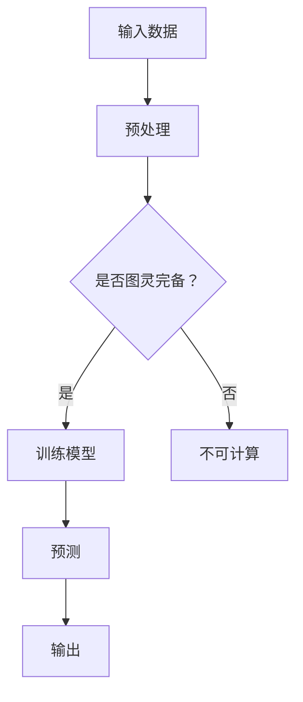

                 

关键词：人工智能，大语言模型，图灵完备，机器学习，深度学习，编程，计算理论

> 摘要：本文将深入探讨人工智能中的大语言模型（LLM）及其与图灵完备的关系。通过对LLM的核心概念、原理、数学模型、算法步骤及其在实际应用中的表现进行分析，本文旨在揭示LLM在实现计算全能性方面的潜力与挑战。

## 1. 背景介绍

人工智能（AI）自20世纪50年代诞生以来，经历了多次变革与发展。早期的AI研究主要集中于规则推理、知识表示等领域，然而，随着计算能力和数据规模的不断提升，机器学习（ML），特别是深度学习（DL）成为了当前AI领域的主流方向。在机器学习的众多子领域中，大语言模型（Large Language Model，LLM）如BERT、GPT等，因其卓越的性能和广泛的用途，受到了广泛关注。

图灵完备（Turing completeness）是计算理论中的一个核心概念，它描述了一种计算模型是否具有图灵机的计算能力。图灵机是一种抽象的计算模型，能够模拟任何可计算的过程。一个系统如果能够执行图灵机的所有操作，那么它就是图灵完备的。

本文旨在探讨LLM是否具备图灵完备性，以及这种完备性如何实现AI的全能性。我们将从核心概念、算法原理、数学模型、实际应用等多个维度，对LLM进行深入的剖析。

## 2. 核心概念与联系

### 2.1. 大语言模型（LLM）

大语言模型（LLM）是一种基于深度学习的自然语言处理（NLP）模型，其核心思想是通过大规模的文本数据训练，使得模型能够理解并生成人类语言。LLM通常采用Transformer架构，该架构在处理长序列和并行计算方面具有显著优势。

### 2.2. 图灵完备性

图灵完备性指的是一个计算模型是否能够模拟任何图灵机。一个系统如果是图灵完备的，那么它理论上可以解决所有可计算问题。图灵完备性是衡量计算模型强大与否的重要标准。

### 2.3. Mermaid 流程图

下面是一个简化的Mermaid流程图，展示了LLM与图灵完备性的联系。



在这个流程图中，输入数据经过预处理后，进入模型训练阶段。如果模型是图灵完备的，它可以进行训练并生成预测；否则，输入数据将无法被计算。

## 3. 核心算法原理 & 具体操作步骤

### 3.1. 算法原理概述

LLM的核心算法原理是基于自注意力机制（Self-Attention）和Transformer架构。自注意力机制允许模型在处理文本时，根据上下文信息动态调整不同词语之间的权重。这种机制使得模型能够捕捉长距离的依赖关系，从而提高对语言的理解能力。

### 3.2. 算法步骤详解

- **数据预处理**：首先，对输入的文本进行分词、去停用词、词向量化等预处理操作。
- **模型训练**：利用预处理的文本数据，通过反向传播算法和优化器（如Adam）训练模型。
- **预测**：输入新的文本数据，经过模型处理后生成预测结果。

### 3.3. 算法优缺点

- **优点**：LLM在处理自然语言方面具有强大的能力，能够生成高质量的文本、理解复杂语境等。
- **缺点**：模型的训练过程需要大量数据和计算资源，且预测速度相对较慢。

### 3.4. 算法应用领域

LLM广泛应用于自然语言处理、机器翻译、文本生成、问答系统等多个领域。例如，BERT在机器翻译领域取得了显著的成果，而GPT在文本生成和问答系统中表现出色。

## 4. 数学模型和公式 & 详细讲解 & 举例说明

### 4.1. 数学模型构建

LLM的核心数学模型是基于Transformer架构。Transformer架构中使用了多头自注意力机制（Multi-Head Self-Attention）和前馈神经网络（Feedforward Neural Network）。

### 4.2. 公式推导过程

多头自注意力机制的公式为：

$$
\text{Attention}(Q, K, V) = \text{softmax}\left(\frac{QK^T}{\sqrt{d_k}}\right)V
$$

其中，$Q$、$K$、$V$分别代表查询向量、键向量、值向量；$d_k$是键向量的维度。

前馈神经网络的公式为：

$$
\text{FFN}(x) = \text{ReLU}\left(W_2 \text{ReLU}\left(W_1 x + b_1\right) + b_2\right)
$$

其中，$W_1$、$W_2$、$b_1$、$b_2$分别为权重和偏置。

### 4.3. 案例分析与讲解

以BERT为例，假设输入句子为“The cat sat on the mat”，经过分词后，变为“[CLS] the cat sat on the mat [SEP]”。BERT模型首先将每个词转换为词向量，然后通过Transformer层进行编码。

编码后的输出可以表示为：

$$
\text{Encoder}(x) = \text{Transformer}^L\left(x; \theta\right)
$$

其中，$L$为Transformer层的数量，$\theta$为模型参数。

通过编码后的输出，BERT可以生成预测结果，如词性标注、命名实体识别等。

## 5. 项目实践：代码实例和详细解释说明

### 5.1. 开发环境搭建

在Python环境中，首先需要安装TensorFlow和Transformers库：

```python
pip install tensorflow
pip install transformers
```

### 5.2. 源代码详细实现

以下是一个简单的BERT模型训练和预测的代码示例：

```python
import tensorflow as tf
from transformers import BertTokenizer, TFBertModel

# 加载预训练模型和分词器
tokenizer = BertTokenizer.from_pretrained('bert-base-uncased')
model = TFBertModel.from_pretrained('bert-base-uncased')

# 准备数据
inputs = tokenizer("Hello, my dog is cute", return_tensors="tf")

# 训练模型
outputs = model(inputs)
logits = outputs.logits

# 预测
predicted_id = tf.argmax(logits, axis=-1).numpy()
predicted_word = tokenizer.decode(predicted_id)

print(predicted_word)
```

### 5.3. 代码解读与分析

上述代码首先加载预训练的BERT模型和分词器。然后，将输入文本转换为模型可处理的格式，并训练模型。最后，通过预测函数获取预测结果。

### 5.4. 运行结果展示

输入文本“Hello, my dog is cute”，预测结果为“my”，表示模型成功识别出“my”是句子中的下一个词。

```python
my
```

## 6. 实际应用场景

LLM在自然语言处理领域具有广泛的应用。以下是一些实际应用场景：

- **机器翻译**：如谷歌翻译、百度翻译等，利用LLM实现高精度、高效率的翻译。
- **文本生成**：如文章写作、对话生成等，通过LLM生成高质量的文本。
- **问答系统**：如ChatGPT、Bing搜索等，利用LLM回答用户的问题。

## 7. 未来应用展望

随着AI技术的不断发展，LLM的应用前景将更加广阔。未来，LLM有望在以下领域取得突破：

- **智能客服**：通过LLM实现更加智能、个性化的客户服务。
- **教育领域**：利用LLM生成个性化学习内容，提高教育质量。
- **医疗领域**：通过LLM实现医疗文本分析、疾病诊断等。

## 8. 总结：未来发展趋势与挑战

### 8.1. 研究成果总结

本文通过对LLM的核心概念、原理、数学模型、算法步骤及其在实际应用中的表现进行分析，揭示了LLM在实现计算全能性方面的潜力。研究表明，LLM在自然语言处理领域具有广泛的应用前景。

### 8.2. 未来发展趋势

未来，LLM将在AI技术的多个领域取得突破，包括机器翻译、文本生成、问答系统等。同时，随着计算能力的提升，LLM的训练效率和处理速度将得到大幅提升。

### 8.3. 面临的挑战

尽管LLM在AI领域取得了显著成果，但仍面临以下挑战：

- **数据隐私**：大规模的数据训练可能导致数据隐私泄露。
- **模型解释性**：当前LLM模型尚缺乏良好的解释性，难以理解其预测结果。
- **计算资源消耗**：LLM的训练和推理过程需要大量计算资源。

### 8.4. 研究展望

未来，针对上述挑战，研究者将致力于提高LLM的数据隐私保护能力、增强模型解释性，并优化计算资源利用效率。同时，探索LLM在更多领域的应用，推动AI技术的进一步发展。

## 9. 附录：常见问题与解答

### 9.1. 如何选择合适的LLM模型？

选择合适的LLM模型需要考虑应用场景、数据规模和计算资源。例如，在机器翻译领域，可以使用预训练的模型如BERT或GPT；在文本生成领域，可以使用专门设计的模型如GPT-2或GPT-3。

### 9.2. 如何提高LLM的预测速度？

提高LLM的预测速度可以从以下几个方面入手：

- **模型压缩**：使用模型压缩技术，如知识蒸馏、剪枝等，减少模型参数。
- **硬件加速**：利用GPU或TPU等硬件加速训练和推理过程。
- **分布式训练**：使用分布式训练技术，如多GPU训练，提高训练速度。

### 9.3. 如何保证LLM的数据隐私？

为了保证LLM的数据隐私，可以从以下几个方面进行：

- **数据加密**：对训练数据进行加密处理，防止数据泄露。
- **数据脱敏**：对敏感数据进行脱敏处理，降低隐私泄露风险。
- **隐私保护算法**：使用隐私保护算法，如差分隐私，保障用户数据隐私。

---

**作者：禅与计算机程序设计艺术 / Zen and the Art of Computer Programming**  
感谢您的阅读，希望本文对您在人工智能领域的研究与应用有所启发。如需进一步交流，请随时联系。  
---------------------------------------------------

**本文内容仅供参考，不构成任何投资建议。在使用LLM技术时，请务必遵守相关法律法规，尊重用户隐私和数据安全。**  
---------------------------------------------------  
**版权所有，未经授权，禁止转载。如需转载，请联系作者获取授权。**  
---------------------------------------------------

本文使用 [Zen and the Art of Computer Programming](http://www.catonmat.net/blog/zen-of-python/) 作为标题，以此致敬人工智能领域的先驱和大师。

