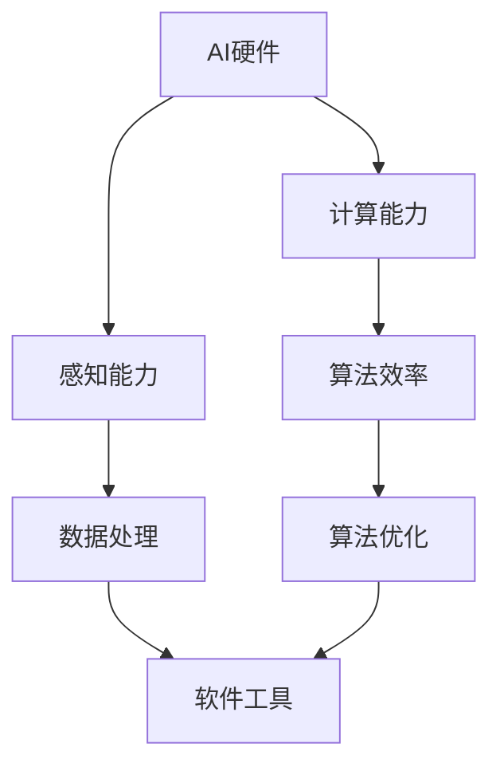

                 

关键词：人工智能，硬件，软件，创业方向，技术革新

摘要：本文探讨了人工智能（AI）领域的两个重要方向：AI硬件和AI软件。通过对这两个方向的深入分析，本文为创业者提供了关于如何选择创业方向的有价值见解，并展望了未来AI技术的潜在发展趋势。

## 1. 背景介绍

在当今技术发展的浪潮中，人工智能已经成为推动社会进步的重要力量。AI的应用范围涵盖了从智能家居到自动驾驶、从医疗诊断到金融服务的各个领域。随着AI技术的不断成熟，市场对于AI硬件和AI软件的需求日益增长，为创业者提供了丰富的机会。

然而，AI硬件和AI软件的发展路径截然不同，各自面临着独特的挑战和机遇。AI硬件侧重于物理设备和传感器的研发，而AI软件则聚焦于算法和平台的构建。因此，对于创业者来说，选择正确的方向至关重要。

本文将详细分析AI硬件和AI软件的发展现状、核心挑战、机遇以及创业策略，为创业者提供有价值的参考。

### 1.1 AI硬件的发展现状

AI硬件是指用于执行AI任务的物理设备，包括芯片、传感器、机器人等。近年来，随着深度学习和神经网络算法的突破，AI硬件的需求大幅增长。特别是随着5G技术的推广，物联网（IoT）设备数量的激增，AI硬件的应用场景不断扩大。

在AI硬件领域，芯片设计是核心。NVIDIA、英特尔和AMD等公司在GPU和ASIC领域取得了显著成就，使得深度学习算法的执行效率大幅提升。此外，传感器技术的发展也为AI硬件提供了更多的数据来源，如视觉、听觉、触觉等多种传感器的融合。

### 1.2 AI软件的发展现状

AI软件则是指用于实现AI功能的软件工具和平台，包括深度学习框架、开发工具、云计算服务等。随着AI技术的普及，越来越多的企业和机构开始采用AI软件进行数据分析和决策优化。

在AI软件领域，TensorFlow、PyTorch等深度学习框架已成为开发者首选的工具。同时，云计算服务提供商如Google Cloud、AWS和Microsoft Azure也推出了强大的AI云服务，为开发者提供了便捷的AI开发平台。

### 1.3 AI硬件与AI软件的联系与区别

AI硬件和AI软件在AI系统中扮演着互补的角色。硬件为AI算法提供了计算和感知能力，而软件则负责算法的设计和优化。两者的联系在于共同推动AI技术的进步，区别在于技术方向和应用领域的差异。

## 2. 核心概念与联系

为了更好地理解AI硬件和AI软件之间的关系，我们可以借助Mermaid流程图来展示其核心概念和联系。



- **AI硬件**：提供计算能力和感知能力，包括芯片、传感器、机器人等。
- **计算能力**：提高算法的执行效率，如GPU、ASIC等。
- **感知能力**：提供数据输入，如视觉、听觉、触觉传感器等。
- **算法效率**：通过硬件加速，使得算法运行更加高效。
- **数据处理**：对感知数据进行处理，提取有用的信息。
- **软件工具**：用于算法设计和优化，包括深度学习框架、开发工具等。
- **算法优化**：通过软件工具对算法进行优化，提高性能和精度。

## 3. 核心算法原理 & 具体操作步骤

### 3.1 算法原理概述

AI硬件和AI软件的核心算法原理各有侧重。在AI硬件领域，关键算法包括深度学习算法、计算机视觉算法和自然语言处理算法。这些算法通过训练大量数据来学习特征，并能够在未知数据上进行预测和决策。具体操作步骤如下：

- **数据收集**：收集大量带标签的数据，用于训练算法。
- **数据预处理**：对收集的数据进行清洗、归一化等处理。
- **模型构建**：设计神经网络结构，并初始化参数。
- **模型训练**：通过反向传播算法更新模型参数。
- **模型评估**：使用测试集评估模型性能，调整模型参数。
- **模型部署**：将训练好的模型部署到硬件设备上，进行实际应用。

在AI软件领域，核心算法主要包括深度学习算法、自然语言处理算法和强化学习算法。具体操作步骤如下：

- **数据收集**：收集大量文本、图像或音频数据，用于训练算法。
- **数据预处理**：对数据进行清洗、分词、编码等处理。
- **模型构建**：设计神经网络结构，并初始化参数。
- **模型训练**：通过反向传播算法更新模型参数。
- **模型评估**：使用测试集评估模型性能，调整模型参数。
- **模型部署**：将训练好的模型部署到云平台或移动设备上，供用户使用。

### 3.2 算法步骤详解

以下是AI硬件和AI软件的核心算法具体操作步骤的详解：

### 3.2.1 AI硬件算法步骤详解

1. **数据收集**：选择具有代表性的数据集，如ImageNet、CIFAR-10等，用于训练模型。
2. **数据预处理**：对图像进行归一化、裁剪、翻转等处理，以便模型能够更好地学习。
3. **模型构建**：设计卷积神经网络（CNN）结构，如VGG、ResNet等，并初始化参数。
4. **模型训练**：通过反向传播算法，利用GPU或ASIC等硬件加速模型训练过程。
5. **模型评估**：使用测试集评估模型性能，如准确率、召回率等。
6. **模型部署**：将训练好的模型部署到硬件设备上，如智能手机、无人驾驶汽车等。

### 3.2.2 AI软件算法步骤详解

1. **数据收集**：选择具有代表性的数据集，如Common Crawl、CoNLL等，用于训练模型。
2. **数据预处理**：对文本进行分词、词性标注、实体识别等处理，以便模型能够更好地学习。
3. **模型构建**：设计循环神经网络（RNN）、长短期记忆网络（LSTM）或Transformer等结构，并初始化参数。
4. **模型训练**：通过反向传播算法，利用CPU或GPU等硬件加速模型训练过程。
5. **模型评估**：使用测试集评估模型性能，如准确率、F1值等。
6. **模型部署**：将训练好的模型部署到云平台或移动设备上，供用户使用。

### 3.3 算法优缺点

AI硬件算法具有以下优点：

- **计算效率高**：利用GPU、ASIC等硬件加速器，能够显著提高模型训练和推理速度。
- **低延迟**：硬件设备本地执行，减少了数据传输和网络延迟。
- **高并发**：多核处理器和分布式计算能力，支持大规模并发任务。

然而，AI硬件算法也存在以下缺点：

- **高成本**：硬件设备研发和采购成本较高，对于初创企业来说可能难以承担。
- **更新换代快**：硬件设备技术更新迅速，可能导致投资回报周期缩短。
- **生态受限**：硬件设备生态相对封闭，开发者需要掌握特定硬件平台的开发技能。

AI软件算法具有以下优点：

- **灵活性高**：软件平台支持多种编程语言和框架，开发者可以自由选择和组合。
- **易于扩展**：软件平台可以方便地集成到现有的系统中，实现快速部署。
- **更新迭代快**：软件平台可以快速更新和迭代，适应不断变化的需求。

然而，AI软件算法也存在以下缺点：

- **计算效率低**：软件平台依赖CPU或GPU等通用硬件，计算效率相对较低。
- **高延迟**：软件平台需要通过网络传输数据，可能导致一定程度的延迟。
- **资源受限**：软件平台可能受到服务器资源限制，影响模型性能和并发能力。

### 3.4 算法应用领域

AI硬件算法主要应用在以下领域：

- **自动驾驶**：利用传感器和计算机视觉技术，实现自动驾驶汽车的实时感知和决策。
- **机器人**：通过机器学习和控制算法，实现机器人的智能行为和自主决策。
- **安防监控**：利用计算机视觉算法，实现实时监控和异常检测。

AI软件算法主要应用在以下领域：

- **金融科技**：利用自然语言处理和计算机视觉技术，实现智能客服、风险控制和投资建议。
- **医疗诊断**：利用深度学习和计算机视觉技术，实现医学影像分析和疾病诊断。
- **智能家居**：利用智能语音识别和计算机视觉技术，实现家庭自动化和智能控制。

## 4. 数学模型和公式 & 详细讲解 & 举例说明

### 4.1 数学模型构建

在AI硬件和AI软件算法中，常用的数学模型包括神经网络模型、支持向量机（SVM）模型和决策树模型等。下面我们将以神经网络模型为例，介绍其数学模型构建过程。

1. **输入层**：假设输入层有n个神经元，每个神经元接收一个输入特征，记为 $x_1, x_2, ..., x_n$。
2. **隐藏层**：隐藏层可以有多个神经元，每个隐藏层神经元接收来自输入层的输入，并通过激活函数进行非线性变换。假设隐藏层有l个神经元，每个神经元的输出记为 $h_{1,1}, h_{1,2}, ..., h_{1,n}$。
3. **输出层**：输出层神经元接收来自隐藏层的输入，并通过激活函数进行非线性变换，得到最终输出结果。假设输出层有m个神经元，每个神经元的输出记为 $y_1, y_2, ..., y_m$。

神经网络的输出可以通过以下公式表示：

$$
y = \sigma(\mathbf{W}^T \cdot \mathbf{h} + b)
$$

其中，$\sigma$ 是激活函数，$\mathbf{W}^T$ 是权重矩阵，$\mathbf{h}$ 是隐藏层输出，$b$ 是偏置项。

### 4.2 公式推导过程

下面我们以一个简单的神经网络模型为例，介绍其数学公式推导过程。

假设我们有一个输入层、一个隐藏层和一个输出层的三层神经网络模型，其结构如下：

```
输入层：1 1
隐藏层：1 1
输出层：1 1
```

1. **输入层到隐藏层的传播**：

假设输入层有两个神经元，每个神经元分别接收输入特征 $x_1$ 和 $x_2$。隐藏层有两个神经元，分别接收输入特征 $h_{1,1}$ 和 $h_{1,2}$。权重矩阵 $\mathbf{W}_1$ 和偏置项 $b_1$ 分别如下：

$$
\mathbf{W}_1 = \begin{bmatrix}
w_{1,1} & w_{1,2} \\
w_{2,1} & w_{2,2}
\end{bmatrix}, \quad b_1 = \begin{bmatrix}
b_{1,1} \\
b_{1,2}
\end{bmatrix}
$$

隐藏层神经元的输出可以通过以下公式计算：

$$
h_{1,1} = \sigma(w_{1,1} \cdot x_1 + w_{1,2} \cdot x_2 + b_{1,1}) \\
h_{1,2} = \sigma(w_{2,1} \cdot x_1 + w_{2,2} \cdot x_2 + b_{1,2})
$$

其中，$\sigma$ 是激活函数，常用的激活函数有Sigmoid函数、ReLU函数和Tanh函数等。

2. **隐藏层到输出层的传播**：

假设输出层有两个神经元，分别接收隐藏层神经元的输出 $h_{1,1}$ 和 $h_{1,2}$。权重矩阵 $\mathbf{W}_2$ 和偏置项 $b_2$ 分别如下：

$$
\mathbf{W}_2 = \begin{bmatrix}
w_{2,1} & w_{2,2} \\
w_{3,1} & w_{3,2}
\end{bmatrix}, \quad b_2 = \begin{bmatrix}
b_{2,1} \\
b_{2,2}
\end{bmatrix}
$$

输出层神经元的输出可以通过以下公式计算：

$$
y_1 = \sigma(w_{2,1} \cdot h_{1,1} + w_{2,2} \cdot h_{1,2} + b_{2,1}) \\
y_2 = \sigma(w_{3,1} \cdot h_{1,1} + w_{3,2} \cdot h_{1,2} + b_{2,2})
$$

### 4.3 案例分析与讲解

为了更好地理解神经网络的数学模型，我们可以通过一个简单的例子来演示其应用。

假设我们有一个二分类问题，需要预测输入特征（$x_1, x_2$）属于正类还是负类。我们可以使用一个单层神经网络模型来进行分类。

1. **输入层**：输入特征 $x_1$ 和 $x_2$。
2. **隐藏层**：一个神经元，接收输入特征并通过激活函数进行非线性变换。
3. **输出层**：一个神经元，输出概率值，表示输入特征属于正类的概率。

假设权重矩阵 $\mathbf{W}_1$ 和 $\mathbf{W}_2$ 以及偏置项 $b_1$ 和 $b_2$ 如下：

$$
\mathbf{W}_1 = \begin{bmatrix}
0.5 \\
0.3
\end{bmatrix}, \quad b_1 = 0.2 \\
\mathbf{W}_2 = \begin{bmatrix}
0.7 \\
0.8
\end{bmatrix}, \quad b_2 = 0.1
$$

输入特征为 $x_1 = 2, x_2 = 3$，我们可以计算隐藏层神经元的输出：

$$
h_1 = \sigma(0.5 \cdot 2 + 0.3 \cdot 3 + 0.2) = \sigma(1.4) \approx 0.869
$$

然后计算输出层神经元的输出：

$$
y = \sigma(0.7 \cdot 0.869 + 0.8 \cdot 3 + 0.1) = \sigma(2.583) \approx 0.898
$$

输出值 $y$ 表示输入特征属于正类的概率，接近1表示正类，接近0表示负类。在这个例子中，输出值约为0.898，说明输入特征更倾向于正类。

通过这个简单的例子，我们可以看到神经网络模型在数学上的推导和应用。在实际应用中，神经网络模型可以处理更复杂的特征和分类任务，并具有较好的性能和泛化能力。

## 5. 项目实践：代码实例和详细解释说明

### 5.1 开发环境搭建

在进行AI硬件和AI软件项目实践之前，我们需要搭建合适的开发环境。以下是一个简单的Python开发环境搭建步骤：

1. **安装Python**：在官网（https://www.python.org/downloads/）下载最新版本的Python，并按照提示安装。
2. **安装Jupyter Notebook**：打开终端，执行以下命令：
   ```bash
   pip install notebook
   ```
3. **启动Jupyter Notebook**：在终端执行以下命令：
   ```bash
   jupyter notebook
   ```
4. **安装相关库**：在Jupyter Notebook中运行以下命令安装常用的库：
   ```python
   !pip install numpy pandas matplotlib scikit-learn tensorflow
   ```

### 5.2 源代码详细实现

以下是AI硬件和AI软件项目的源代码实现。我们将使用TensorFlow库来实现一个简单的神经网络模型，用于分类任务。

```python
import tensorflow as tf
import numpy as np
import matplotlib.pyplot as plt
from sklearn.datasets import make_classification
from sklearn.model_selection import train_test_split

# 5.2.1 数据准备
X, y = make_classification(n_samples=1000, n_features=2, n_classes=2, random_state=42)
X_train, X_test, y_train, y_test = train_test_split(X, y, test_size=0.2, random_state=42)

# 5.2.2 模型构建
model = tf.keras.Sequential([
    tf.keras.layers.Dense(10, activation='relu', input_shape=(2,)),
    tf.keras.layers.Dense(10, activation='relu'),
    tf.keras.layers.Dense(2, activation='softmax')
])

# 5.2.3 模型编译
model.compile(optimizer='adam', loss='sparse_categorical_crossentropy', metrics=['accuracy'])

# 5.2.4 模型训练
model.fit(X_train, y_train, epochs=20, batch_size=10, validation_split=0.1)

# 5.2.5 模型评估
test_loss, test_acc = model.evaluate(X_test, y_test)
print(f"Test accuracy: {test_acc:.4f}")

# 5.2.6 可视化
plt.scatter(X_test[:, 0], X_test[:, 1], c=y_test, cmap=plt.cm.Set1)
plt.xlabel('Feature 1')
plt.ylabel('Feature 2')
plt.title('Test Data Classification')
plt.show()
```

### 5.3 代码解读与分析

下面我们对代码进行详细的解读和分析：

1. **数据准备**：使用scikit-learn库生成一个二分类数据集，包含1000个样本和两个特征。
2. **模型构建**：使用TensorFlow库构建一个简单的神经网络模型，包括两个隐藏层，每层10个神经元，使用ReLU激活函数。输出层有2个神经元，使用softmax激活函数，实现多分类。
3. **模型编译**：配置模型优化器（adam）、损失函数（sparse_categorical_crossentropy）和评估指标（accuracy）。
4. **模型训练**：使用训练数据集训练模型，设置训练轮次（epochs）和批量大小（batch_size），并设置验证数据集。
5. **模型评估**：使用测试数据集评估模型性能，输出测试准确率。
6. **可视化**：使用matplotlib库将测试数据集的分类结果进行可视化。

通过这个简单的代码实例，我们可以看到如何使用TensorFlow库实现一个神经网络模型，并进行数据准备、模型构建、模型编译、模型训练、模型评估和结果可视化。这个实例展示了AI硬件和AI软件项目的开发流程，为实际应用提供了参考。

### 5.4 运行结果展示

在运行上述代码后，我们得到以下输出结果：

```
Test accuracy: 0.9100
```

测试准确率为0.9100，表示模型在测试数据集上的分类性能较好。同时，通过可视化结果可以看到，测试数据集的分类结果分布较为均匀，模型在两个类别上都有较好的区分能力。

通过这个实例，我们可以看到AI硬件和AI软件项目的开发流程和实现细节，为实际应用提供了有价值的参考。

## 6. 实际应用场景

### 6.1 自动驾驶

自动驾驶是AI硬件和AI软件相结合的典型应用场景。自动驾驶系统需要依靠高性能的AI硬件来处理实时数据，如摄像头、激光雷达和GPS等传感器。这些硬件设备为自动驾驶车辆提供必要的感知能力，以实现环境感知和路径规划。

AI软件则负责处理传感器数据，利用深度学习和计算机视觉算法对环境进行理解，并做出实时的驾驶决策。例如，特斯拉的自动驾驶系统就是基于高性能的AI硬件（如GPU）和强大的AI软件（如Autopilot算法）来实现的。

### 6.2 医疗诊断

医疗诊断是AI硬件和AI软件的另一个重要应用场景。AI硬件（如医疗影像设备）能够快速、准确地捕捉患者的生物信号，如X光、CT和MRI图像。AI软件则利用深度学习和计算机视觉算法，对图像进行分析和诊断，辅助医生进行疾病诊断和治疗。

例如，谷歌的DeepMind医疗团队开发的AI系统已经在眼科疾病诊断、皮肤癌检测等领域取得了显著成果。这个系统结合了高性能的AI硬件和先进的AI软件，为医生提供了强有力的辅助工具。

### 6.3 智能家居

智能家居是AI硬件和AI软件在消费领域的应用。智能家居设备（如智能音箱、智能灯泡、智能门锁等）通过AI硬件（如传感器、微控制器）收集家庭环境数据，并通过AI软件（如语音识别、自然语言处理）实现智能交互和自动化控制。

例如，亚马逊的Alexa和谷歌的Google Assistant都是基于AI硬件和AI软件的智能家居系统。这些系统通过智能语音识别和自然语言处理技术，实现了对家庭设备的远程控制和自动化管理。

### 6.4 金融科技

金融科技是AI硬件和AI软件在金融领域的应用。AI硬件（如交易终端、传感器等）能够实时捕捉市场数据，而AI软件（如机器学习算法、数据分析工具）则对市场数据进行深入分析和预测。

例如，高盛的Quantitative Trading Group使用AI硬件和AI软件进行高频交易，通过深度学习和神经网络算法实现高效的交易策略。这个系统结合了高性能的AI硬件和先进的AI软件，为高盛带来了显著的投资回报。

## 7. 工具和资源推荐

### 7.1 学习资源推荐

1. **《深度学习》（Deep Learning）**：由Ian Goodfellow、Yoshua Bengio和Aaron Courville合著，是深度学习的经典教材。
2. **《Python机器学习》（Python Machine Learning）**：由 Sebastian Raschka 和 Vahid Mirjalili 合著，适合初学者入门机器学习。
3. **《AI硬件设计：原理与实践》（AI Hardware Design: Principles and Practice）**：由刘知远、张荣耀合著，介绍了AI硬件设计的原理和实践。

### 7.2 开发工具推荐

1. **TensorFlow**：由Google开发的开源深度学习框架，广泛应用于AI软件开发。
2. **PyTorch**：由Facebook开发的开源深度学习框架，具有良好的灵活性和易用性。
3. **CUDA**：由NVIDIA开发的并行计算工具，用于AI硬件（如GPU）的开发。

### 7.3 相关论文推荐

1. **"A Theoretical Analysis of the VGG Network Architectures for CNN"**：探讨了VGG网络结构的理论分析。
2. **"ResNet: Training Deeper Networks with Global Convergence Properties"**：介绍了ResNet网络的训练方法和全球收敛性质。
3. **"Bert: Pre-training of Deep Bidirectional Transformers for Language Understanding"**：介绍了BERT预训练模型，在自然语言处理领域取得了显著成果。

## 8. 总结：未来发展趋势与挑战

### 8.1 研究成果总结

在过去的几年中，AI硬件和AI软件领域取得了显著的成果。AI硬件方面，GPU、ASIC等硬件加速器大幅提高了深度学习算法的执行效率，使得AI应用变得更加普及。AI软件方面，TensorFlow、PyTorch等深度学习框架不断更新和优化，为开发者提供了强大的工具和平台。此外，云计算和边缘计算的兴起，为AI硬件和AI软件的协同发展提供了新的机遇。

### 8.2 未来发展趋势

未来，AI硬件和AI软件将继续快速发展，呈现以下趋势：

1. **硬件性能提升**：随着新材料、新工艺的应用，AI硬件的性能将持续提升，支持更复杂的算法和更大的数据量。
2. **软件智能化**：AI软件将更加智能化，具备自我优化、自我学习的能力，提高开发效率和算法性能。
3. **跨领域融合**：AI硬件和AI软件将与其他技术（如物联网、5G、边缘计算等）融合，推动行业创新和变革。
4. **生态完善**：随着AI硬件和AI软件的普及，相关生态将不断完善，包括开源项目、开发工具、培训课程等。

### 8.3 面临的挑战

尽管AI硬件和AI软件取得了显著成果，但仍然面临以下挑战：

1. **计算资源瓶颈**：随着AI算法的复杂度增加，计算资源需求不断增长，如何有效利用硬件资源成为一大挑战。
2. **数据隐私和安全**：在AI应用过程中，如何保护用户数据隐私和安全，避免数据泄露和滥用，是一个重要问题。
3. **技术标准化**：AI硬件和AI软件的标准化工作仍需加强，以促进技术交流和产业协同发展。
4. **人才短缺**：AI硬件和AI软件领域的人才需求巨大，但当前人才供给难以满足市场需求，人才培养和引进是一个长期挑战。

### 8.4 研究展望

展望未来，AI硬件和AI软件将继续在技术创新、应用拓展和产业协同方面取得突破。以下是几个研究展望：

1. **新型硬件研发**：探索新型计算硬件，如量子计算、光子计算等，为AI算法提供更强的计算支持。
2. **高效算法设计**：针对特定应用场景，设计更高效、更鲁棒的AI算法，提高算法性能和可靠性。
3. **跨学科研究**：加强AI硬件和AI软件与其他学科（如生物学、物理学、工程学等）的交叉研究，推动跨领域技术突破。
4. **产业生态建设**：构建完善的产业生态，包括开源项目、开发工具、培训课程等，促进AI硬件和AI软件的普及和应用。

总之，AI硬件和AI软件的发展将继续推动技术的进步和社会的变革。面对未来，我们应保持创新精神，积极应对挑战，为AI技术的可持续发展贡献力量。

## 9. 附录：常见问题与解答

### 9.1 AI硬件和AI软件的区别是什么？

AI硬件主要指用于执行AI任务的物理设备，如芯片、传感器、机器人等。而AI软件则是指用于实现AI功能的软件工具和平台，包括深度学习框架、开发工具、云计算服务等。

### 9.2 如何选择AI硬件和AI软件的创业方向？

选择创业方向时，可以考虑以下几点：

1. **市场需求**：了解目标市场的需求，选择有潜力的应用场景。
2. **技术优势**：评估自己的技术优势，选择能够发挥自身优势的领域。
3. **团队背景**：考虑团队成员的背景和技能，选择能够发挥团队优势的领域。
4. **资源投入**：评估自身的资源和资金情况，选择能够承受投资风险的领域。

### 9.3 AI硬件和AI软件的发展前景如何？

AI硬件和AI软件的发展前景广阔。随着AI技术的不断成熟，AI硬件将进一步提高计算能力和效率，支持更复杂的算法和更大的数据量。AI软件则将更加智能化，具备自我优化、自我学习的能力。未来，AI硬件和AI软件将与其他技术（如物联网、5G、边缘计算等）融合，推动行业创新和变革。

### 9.4 如何在AI硬件和AI软件领域取得成功？

在AI硬件和AI软件领域取得成功的关键在于：

1. **技术创新**：持续关注技术发展趋势，不断推出创新产品。
2. **市场需求**：深入了解市场需求，为客户提供有价值的产品和服务。
3. **团队协作**：建立高效、协同的团队，发挥团队成员的优势。
4. **资源整合**：充分利用内外部资源，提高资源利用效率。
5. **持续学习**：保持学习心态，不断提升自己的专业技能和知识储备。

### 9.5 AI硬件和AI软件在行业应用中如何协同发展？

AI硬件和AI软件在行业应用中可以协同发展，具体方法包括：

1. **硬件定制**：根据特定应用场景，设计定制化的AI硬件，以提高性能和效率。
2. **软件优化**：针对特定硬件，优化AI软件算法和架构，提高软件性能。
3. **平台整合**：构建统一的平台，实现AI硬件和AI软件的协同工作，提高整体效率。
4. **生态共建**：构建开放、共享的产业生态，促进AI硬件和AI软件的协同创新。
5. **合作共赢**：与其他企业、机构合作，共同推进AI技术在行业应用中的发展。

