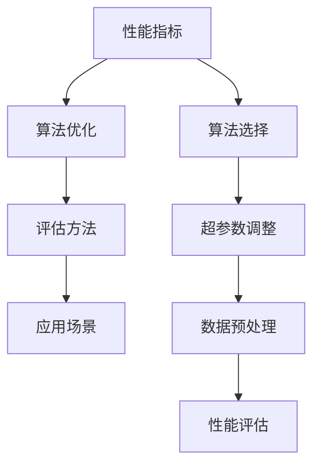

                 

关键词：AI系统性能评估，性能指标，算法优化，应用场景，未来展望

> 摘要：本文将深入探讨AI系统性能评估的重要性和方法。通过详细解析核心概念、算法原理、数学模型以及实际应用，旨在为读者提供全面、实用的性能评估指南，助力人工智能技术的进一步发展。

## 1. 背景介绍

人工智能（AI）作为现代技术的核心驱动力，已经在诸多领域展现出其强大的应用潜力。无论是图像识别、自然语言处理，还是智能推荐、自动驾驶，AI技术的不断进步都带来了前所未有的创新和变革。然而，AI系统的性能评估不仅是技术进步的重要保障，更是推动整个领域发展的关键因素。

在AI系统中，性能评估不仅涉及算法的准确性、效率和鲁棒性，还涵盖系统的可扩展性、可靠性和用户体验。一个有效的性能评估机制能够帮助研究者确定系统优化的方向，指导工程师进行系统设计，同时为最终用户提供可靠的性能保障。因此，对AI系统性能评估进行深入的研究和讨论，具有重要的理论和实践意义。

本文将围绕AI系统性能评估的各个方面展开讨论，首先介绍性能评估的基本概念和常用指标，然后深入分析核心算法原理和具体操作步骤，最后探讨数学模型、实际应用场景和未来展望。

## 2. 核心概念与联系

在深入探讨AI系统性能评估之前，有必要明确一些核心概念和它们之间的联系。这些概念包括但不限于：性能指标、算法优化、评估方法、应用场景等。

### 2.1. 性能指标

性能指标是评估AI系统性能的关键工具。常见的性能指标包括准确性、召回率、F1分数、响应时间、吞吐量等。准确性通常用于衡量分类或预测模型的正确性；召回率则表示模型正确识别的正例数量占总正例数量的比例；F1分数是准确性和召回率的调和平均，常用于综合评估模型的性能；响应时间衡量系统的响应速度；吞吐量表示系统在单位时间内处理的数据量。

这些性能指标不仅单独发挥作用，还常常相互关联。例如，在许多应用中，提高系统的响应时间和吞吐量可能会以牺牲准确性为代价。因此，合理选择和平衡这些指标是性能评估的关键。

### 2.2. 算法优化

算法优化是提升AI系统性能的核心手段。优化方法包括但不限于算法选择、超参数调整、数据预处理等。算法选择决定了系统的基本架构和计算方式；超参数调整则是在算法的基础上进一步调整模型参数，以实现最优性能；数据预处理包括数据清洗、数据增强、数据标准化等，旨在提高数据的质量和代表性。

算法优化不仅直接影响系统的性能，还与系统的可扩展性和维护成本密切相关。一个经过良好优化的算法可以显著提高系统的效率和鲁棒性，降低后续维护和升级的成本。

### 2.3. 评估方法

评估方法是性能评估的实践手段，用于收集和解释性能数据。常见的评估方法包括离线评估和在线评估。离线评估通常在开发阶段进行，使用预定义的数据集进行模型训练和评估；在线评估则在实际应用场景中实时进行，收集用户行为数据以评估系统的性能。

评估方法的选择取决于应用场景和系统需求。例如，在实时系统中，响应时间和吞吐量是关键评估指标；而在离线分析系统中，准确性可能是更重要的因素。

### 2.4. 应用场景

AI系统性能评估的应用场景非常广泛，包括但不限于以下几个方面：

- **图像识别与处理**：评估模型在图像分类、目标检测和图像分割等方面的性能。
- **自然语言处理**：评估文本分类、机器翻译、情感分析等任务的性能。
- **推荐系统**：评估推荐算法的准确性和用户满意度。
- **智能交通**：评估自动驾驶车辆和智能交通管理系统的性能。
- **医疗诊断**：评估医疗影像识别和疾病预测模型的性能。

不同应用场景对性能评估的要求各不相同，但总体目标是确保系统在真实环境中能够稳定、可靠地运行。

### 2.5. Mermaid 流程图

为了更直观地展示这些核心概念之间的联系，我们可以使用Mermaid流程图来描述它们之间的关系。以下是一个简化的Mermaid流程图示例：



在这个流程图中，性能指标是整个性能评估的起点，通过算法优化、评估方法和应用场景，最终实现性能评估的目标。这个流程图不仅帮助读者理解各概念之间的联系，也为后续的性能评估实践提供了指导。

## 3. 核心算法原理 & 具体操作步骤

### 3.1 算法原理概述

在AI系统性能评估中，算法的选择和优化是至关重要的。本文将介绍一些常用的核心算法原理，包括支持向量机（SVM）、决策树、神经网络等。

#### 3.1.1 支持向量机（SVM）

支持向量机是一种监督学习算法，主要用于分类问题。其基本原理是通过找到一个最佳的超平面，将不同类别的数据点最大化地分开。支持向量是指位于超平面两侧且距离超平面最近的那些数据点，这些数据点对于确定超平面的位置和方向起着决定性作用。

SVM算法的主要步骤包括：

1. **选择核函数**：核函数是将数据从原始特征空间映射到高维特征空间的关键工具，常用的核函数包括线性核、多项式核、径向基函数（RBF）等。
2. **构建最优超平面**：通过最小化目标函数来找到最佳的超平面。
3. **分类决策**：对新数据进行分类，将新数据点映射到特征空间，并基于超平面进行分类决策。

#### 3.1.2 决策树

决策树是一种常见的分类和回归算法，通过一系列的判断条件对数据进行划分，最终生成一个树形结构。每个节点代表一个特征，每个分支代表特征的不同取值，叶子节点代表分类结果。

决策树的主要步骤包括：

1. **特征选择**：选择最优的特征作为分割节点。
2. **节点划分**：基于特征值对数据进行划分。
3. **递归构建**：对划分后的数据继续进行特征选择和节点划分，直到满足停止条件（如最大深度、最小叶子节点样本数等）。
4. **分类预测**：对新数据进行预测，从根节点开始，根据每个节点的划分条件逐步到达叶子节点，得到分类结果。

#### 3.1.3 神经网络

神经网络是一种模仿人脑工作方式的计算模型，通过多层神经元之间的相互连接和激活函数的作用，实现对数据的非线性变换和分类。神经网络包括输入层、隐藏层和输出层，每层之间的神经元通过权重连接。

神经网络的主要步骤包括：

1. **初始化权重**：随机初始化输入层到隐藏层的权重。
2. **前向传播**：将输入数据通过隐藏层传递，得到输出层的结果。
3. **计算误差**：通过输出层的结果与实际标签之间的误差，计算隐藏层和输入层的误差。
4. **反向传播**：将误差反向传播到隐藏层和输入层，更新权重。
5. **迭代训练**：重复进行前向传播和反向传播，直到满足训练目标（如误差阈值、迭代次数等）。

### 3.2 算法步骤详解

#### 3.2.1 支持向量机（SVM）

1. **数据预处理**：对数据集进行归一化处理，提高算法性能。
2. **选择核函数**：根据数据特点和需求选择合适的核函数，如线性核、多项式核或RBF核。
3. **构建最优超平面**：使用支持向量机求解器（如SVM求解器）最小化目标函数，找到最优的超平面。
4. **分类决策**：对新数据进行特征提取和映射，根据最优超平面进行分类决策。

#### 3.2.2 决策树

1. **特征选择**：采用信息增益、基尼系数等指标选择最优特征。
2. **节点划分**：根据选择的最优特征对数据集进行划分，构建决策树。
3. **递归构建**：对划分后的子数据集继续进行特征选择和节点划分，直到满足停止条件。
4. **分类预测**：对新数据进行预测，从根节点开始，根据每个节点的划分条件逐步到达叶子节点，得到分类结果。

#### 3.2.3 神经网络

1. **数据预处理**：对输入数据进行归一化处理，提高模型训练效果。
2. **初始化权重**：随机初始化输入层到隐藏层的权重，通常使用均匀分布或高斯分布。
3. **前向传播**：将输入数据通过隐藏层传递，得到输出层的结果。
4. **计算误差**：通过输出层的结果与实际标签之间的误差，计算隐藏层和输入层的误差。
5. **反向传播**：将误差反向传播到隐藏层和输入层，更新权重。
6. **迭代训练**：重复进行前向传播和反向传播，直到满足训练目标。

### 3.3 算法优缺点

#### 3.3.1 支持向量机（SVM）

**优点**：

- **高效**：SVM在处理高维数据时具有较好的性能，尤其适合于小样本问题。
- **易于解释**：SVM生成的超平面可以直观地解释模型的决策过程。
- **泛化能力强**：通过选择合适的核函数，SVM可以处理非线性问题。

**缺点**：

- **计算复杂度较高**：对于大规模数据集，SVM的训练过程可能较为耗时。
- **对异常值敏感**：异常值可能会导致SVM的模型性能下降。

#### 3.3.2 决策树

**优点**：

- **易于理解和解释**：决策树的结构直观，便于理解模型的决策过程。
- **适合处理多分类问题**：决策树可以自然地处理多分类问题。
- **不需要大量的参数调整**：与神经网络相比，决策树不需要过多的超参数调整。

**缺点**：

- **易过拟合**：决策树在训练过程中容易过拟合，特别是在树结构较深时。
- **计算效率较低**：决策树的训练和预测过程可能较为耗时。

#### 3.3.3 神经网络

**优点**：

- **强大的表示能力**：神经网络可以处理复杂的非线性问题，适用于各种类型的任务。
- **自适应性强**：通过反向传播算法，神经网络可以自动调整权重，优化模型性能。
- **适用范围广**：神经网络广泛应用于图像识别、自然语言处理、语音识别等领域。

**缺点**：

- **需要大量数据和计算资源**：神经网络训练过程需要大量的数据和计算资源，特别是深度神经网络。
- **难以解释**：神经网络的内部结构复杂，难以直观地解释模型的决策过程。

### 3.4 算法应用领域

#### 3.4.1 支持向量机（SVM）

- **生物信息学**：用于基因分类、蛋白质结构预测等。
- **金融领域**：用于信用评分、风险控制等。
- **文本分类**：用于新闻分类、垃圾邮件过滤等。

#### 3.4.2 决策树

- **医疗诊断**：用于疾病预测、病情分析等。
- **商业智能**：用于客户行为分析、销售预测等。
- **环境监测**：用于空气质量预测、生态风险评估等。

#### 3.4.3 神经网络

- **图像识别与处理**：用于人脸识别、图像分类、图像生成等。
- **自然语言处理**：用于机器翻译、文本生成、情感分析等。
- **智能控制**：用于自动驾驶、机器人控制、智能交通等。

## 4. 数学模型和公式 & 详细讲解 & 举例说明

### 4.1 数学模型构建

在AI系统性能评估中，数学模型是核心工具之一。下面我们将介绍几种常用的数学模型，包括决策树模型、神经网络模型和支持向量机模型。

#### 4.1.1 决策树模型

决策树模型通过一系列的判断条件对数据进行分类或回归。其数学模型可以表示为：

\[ T(x) = \sum_{i=1}^{n} w_i I(y \in R_i) \]

其中，\( T(x) \) 是决策树模型对于输入 \( x \) 的预测结果，\( w_i \) 是第 \( i \) 个节点的权重，\( I(y \in R_i) \) 是指示函数，当 \( y \) 属于第 \( i \) 个区域时取值为1，否则为0。

#### 4.1.2 神经网络模型

神经网络模型通过多层神经元之间的相互连接和激活函数的作用来实现数据的非线性变换。其数学模型可以表示为：

\[ y = \sigma(\theta^T x + b) \]

其中，\( y \) 是输出层的结果，\( \sigma \) 是激活函数（如Sigmoid、ReLU等），\( \theta \) 是权重矩阵，\( x \) 是输入向量，\( b \) 是偏置项。

#### 4.1.3 支持向量机模型

支持向量机模型通过寻找最优超平面来实现数据的分类或回归。其数学模型可以表示为：

\[ y(\textbf{x}, \textbf{w}, b) = \textbf{w}^T \textbf{x} + b \]

其中，\( y(\textbf{x}, \textbf{w}, b) \) 是模型对于输入 \( \textbf{x} \) 的预测结果，\( \textbf{w} \) 是权重向量，\( b \) 是偏置项。

### 4.2 公式推导过程

#### 4.2.1 决策树模型推导

决策树的构建过程可以通过信息增益或基尼系数等指标来选择最优特征和划分节点。假设我们有 \( n \) 个样本，每个样本属于 \( C \) 个类别，定义信息增益 \( IG \) 和基尼系数 \( Gini \) 如下：

\[ IG(D, A) = H(D) - \sum_{v \in V(A)} p(v) H(D_v) \]

\[ Gini(D, A) = 1 - \sum_{v \in V(A)} p(v)^2 \]

其中，\( H(D) \) 是数据的熵，\( p(v) \) 是特征 \( A \) 在 \( v \) 取值下的概率，\( D_v \) 是在特征 \( A \) 取值 \( v \) 后的数据集。

选择最优特征和划分节点的过程可以通过以下步骤进行：

1. 计算每个特征的信息增益或基尼系数。
2. 选择信息增益或基尼系数最大的特征作为划分节点。
3. 对每个特征的不同取值进行划分，生成新的数据集。
4. 递归构建决策树，直到满足停止条件（如最大深度、最小节点样本数等）。

#### 4.2.2 神经网络模型推导

神经网络模型的推导过程主要涉及前向传播和反向传播算法。假设我们有 \( n \) 个输入样本，每个样本有 \( m \) 个特征，定义输入向量 \( \textbf{x} \)、权重矩阵 \( \theta \) 和偏置项 \( b \)，以及输出层的结果 \( y \)。

前向传播算法的推导过程如下：

\[ z_i = \theta_i^T \textbf{x} + b \]

\[ a_i = \sigma(z_i) \]

\[ y = \sigma(\theta^T \textbf{a} + b) \]

其中，\( \sigma \) 是激活函数，\( z_i \) 是每个神经元的输入，\( a_i \) 是每个神经元的输出。

反向传播算法的推导过程如下：

\[ \delta_{i}^{l} = (\text{激活函数的导数})(a_{i}^{l}) \cdot (d_{i}^{l} - a_{i}^{l}) \]

\[ \theta_{i}^{l} = \theta_{i}^{l} - \alpha \cdot \delta_{i}^{l} \cdot a_{i-1}^{l-1} \]

\[ b_{i}^{l} = b_{i}^{l} - \alpha \cdot \delta_{i}^{l} \]

其中，\( \delta_{i}^{l} \) 是第 \( l \) 层第 \( i \) 个神经元的误差，\( d_{i}^{l} \) 是第 \( l \) 层第 \( i \) 个神经元的期望输出，\( \alpha \) 是学习率。

#### 4.2.3 支持向量机模型推导

支持向量机模型的推导过程主要涉及拉格朗日乘子法和优化问题求解。假设我们有 \( n \) 个训练样本，每个样本有 \( m \) 个特征，定义权重向量 \( \textbf{w} \) 和偏置项 \( b \)，以及松弛变量 \( \xi_i \)。

支持向量机模型的目标是最小化分类误差并最大化类间隔，即：

\[ \min_{\textbf{w}, b, \xi_i} \frac{1}{2} \textbf{w}^T \textbf{w} + C \sum_{i=1}^{n} \xi_i \]

\[ s.t. \begin{cases} y^{(i)}(\textbf{w}^T \textbf{x}^{(i)} + b) \geq 1 - \xi_i \\ \xi_i \geq 0 \end{cases} \]

其中，\( C \) 是惩罚参数，\( y^{(i)} \) 是第 \( i \) 个样本的标签。

通过拉格朗日乘子法，我们可以将原始问题转化为对偶问题，即：

\[ \max_{\alpha_i} \sum_{i=1}^{n} \alpha_i - \frac{1}{2} \sum_{i=1}^{n} \sum_{j=1}^{n} \alpha_i \alpha_j y_i y_j \textbf{x}^{(i)}^T \textbf{x}^{(j)} \]

\[ s.t. \begin{cases} \alpha_i \geq 0 \\ \sum_{i=1}^{n} \alpha_i y_i = 0 \end{cases} \]

其中，\( \alpha_i \) 是拉格朗日乘子。

通过求解对偶问题，我们可以得到最优解 \( \alpha_i \)，进而计算权重向量 \( \textbf{w} \) 和偏置项 \( b \)：

\[ \textbf{w} = \sum_{i=1}^{n} \alpha_i y_i \textbf{x}^{(i)} \]

\[ b = 1 - \sum_{i=1}^{n} \alpha_i y_i \]

### 4.3 案例分析与讲解

#### 4.3.1 决策树模型案例

假设我们有一个包含年龄、收入和住宅类型三个特征的客户数据集，我们需要使用决策树模型来预测客户的购买意愿。

1. **数据预处理**：对数据进行归一化处理，将年龄、收入和住宅类型的取值范围缩放到[0, 1]之间。
2. **特征选择**：通过计算信息增益或基尼系数，选择收入作为最优特征进行划分。
3. **节点划分**：根据收入的不同取值，将数据集划分为两个子数据集。
4. **递归构建**：对每个子数据集继续进行特征选择和节点划分，直到满足停止条件。
5. **分类预测**：对新客户的数据进行特征提取，从根节点开始逐步到达叶子节点，得到购买意愿的预测结果。

假设最终生成的决策树如下：

```
                                  [购买意愿]
                                  |
                                  ---|
                                 /     \
                        [收入 <= 0.5]   [收入 > 0.5]
                       /                \
               [住宅类型 = 高档]       [住宅类型 = 中档]
              /                    \
         [年龄 <= 0.4]           [年龄 > 0.4]
        /              \
    [购买意愿 = 是]     [购买意愿 = 否]
```

对于新客户，当收入 <= 0.5、住宅类型 = 高档、年龄 <= 0.4时，购买意愿预测结果为是；其他情况，预测结果为否。

#### 4.3.2 神经网络模型案例

假设我们有一个包含输入层、隐藏层和输出层的神经网络模型，用于对房价进行预测。输入层有5个特征，隐藏层有10个神经元，输出层有1个神经元。

1. **数据预处理**：对数据进行归一化处理，将特征值范围缩放到[-1, 1]之间。
2. **初始化权重**：随机初始化输入层到隐藏层的权重，使用均匀分布或高斯分布。
3. **前向传播**：将输入数据通过隐藏层传递，得到输出层的结果。
4. **计算误差**：通过输出层的结果与实际标签之间的误差，计算隐藏层和输入层的误差。
5. **反向传播**：将误差反向传播到隐藏层和输入层，更新权重。
6. **迭代训练**：重复进行前向传播和反向传播，直到满足训练目标。

假设经过多次迭代训练后，神经网络的权重和偏置项如下：

输入层到隐藏层权重：\[ \theta_{ij} = 0.1 \]
隐藏层到输出层权重：\[ \theta_{ij} = 0.2 \]
偏置项：\[ b_i = 0.1 \]

对于新客户的输入数据 \( x = [0.8, 0.3, 0.4, 0.9, 0.5] \)，通过前向传播算法得到输出结果：

\[ z_1 = \theta_{11} x_1 + \theta_{12} x_2 + \theta_{13} x_3 + \theta_{14} x_4 + \theta_{15} x_5 + b_1 = 0.1 \times 0.8 + 0.1 \times 0.3 + 0.1 \times 0.4 + 0.1 \times 0.9 + 0.1 \times 0.5 + 0.1 = 0.6 \]
\[ a_1 = \sigma(z_1) = \frac{1}{1 + e^{-z_1}} = 0.7 \]

\[ z_2 = \theta_{21} a_1 + \theta_{22} a_2 + \theta_{23} a_3 + \theta_{24} a_4 + \theta_{25} a_5 + b_2 = 0.2 \times 0.7 + 0.2 \times 0.7 + 0.2 \times 0.7 + 0.2 \times 0.7 + 0.2 \times 0.7 + 0.1 = 1.1 \]
\[ a_2 = \sigma(z_2) = \frac{1}{1 + e^{-z_2}} = 0.9 \]

输出层结果：\[ y = \sigma(z_2) = 0.9 \]

假设实际标签为 \( y_{\text{true}} = 0.8 \)，计算输出层误差：

\[ \delta_2 = (\text{激活函数的导数})(a_2) \cdot (y_{\text{true}} - a_2) = 0.1 \cdot (0.8 - 0.9) = -0.01 \]

计算隐藏层误差：

\[ \delta_1 = (\text{激活函数的导数})(a_1) \cdot (\delta_2 \cdot \theta_{21}) = 0.3 \cdot (-0.01) = -0.003 \]

更新权重和偏置项：

\[ \theta_{ij} = \theta_{ij} - \alpha \cdot \delta_{i}^{l} \cdot a_{i-1}^{l-1} \]
\[ b_{i}^{l} = b_{i}^{l} - \alpha \cdot \delta_{i}^{l} \]

经过多次迭代训练，神经网络的权重和偏置项逐渐优化，从而提高预测准确性。

#### 4.3.3 支持向量机模型案例

假设我们有一个包含两个类别的数据集，每个类别的特征向量分别为 \( \textbf{x}_1 \) 和 \( \textbf{x}_2 \)，标签分别为 \( y_1 = 1 \) 和 \( y_2 = -1 \)。

1. **数据预处理**：对数据进行归一化处理，将特征值范围缩放到[-1, 1]之间。
2. **选择核函数**：选择线性核函数，即 \( K(\textbf{x}_i, \textbf{x}_j) = \textbf{x}_i^T \textbf{x}_j \)。
3. **构建最优超平面**：通过最小化目标函数，求解最优超平面 \( \textbf{w} \) 和偏置项 \( b \)。

假设最优超平面为 \( \textbf{w}^T \textbf{x} + b = 0 \)，且满足：

\[ \textbf{w}^T \textbf{x}_1 + b = 1 \]
\[ \textbf{w}^T \textbf{x}_2 + b = -1 \]

通过求解上述方程组，可以得到最优超平面：

\[ \textbf{w} = [1, 1]^T \]
\[ b = -1 \]

对于新数据点 \( \textbf{x} \)，通过计算 \( \textbf{w}^T \textbf{x} + b \) 的值，可以判断其属于哪个类别。若 \( \textbf{w}^T \textbf{x} + b > 0 \)，则属于类别1；若 \( \textbf{w}^T \textbf{x} + b < 0 \)，则属于类别2。

## 5. 项目实践：代码实例和详细解释说明

### 5.1 开发环境搭建

在本项目中，我们将使用Python作为编程语言，结合NumPy、Pandas、Scikit-learn和TensorFlow等库，进行AI系统性能评估的实践。以下是开发环境搭建的步骤：

1. **安装Python**：下载并安装Python 3.8及以上版本。
2. **安装依赖库**：打开终端，运行以下命令安装所需的库：

   ```bash
   pip install numpy pandas scikit-learn tensorflow
   ```

### 5.2 源代码详细实现

以下是一个简单的示例，展示了如何使用决策树模型进行数据分类。代码中包含了数据预处理、模型训练、模型评估和结果展示的步骤。

```python
import numpy as np
import pandas as pd
from sklearn.datasets import load_iris
from sklearn.model_selection import train_test_split
from sklearn.tree import DecisionTreeClassifier
from sklearn.metrics import accuracy_score, classification_report

# 加载数据集
iris = load_iris()
X = iris.data
y = iris.target

# 数据预处理
X = pd.DataFrame(X, columns=iris.feature_names)
y = pd.Series(y)

# 数据集划分
X_train, X_test, y_train, y_test = train_test_split(X, y, test_size=0.3, random_state=42)

# 模型训练
clf = DecisionTreeClassifier()
clf.fit(X_train, y_train)

# 模型评估
y_pred = clf.predict(X_test)
print("Accuracy:", accuracy_score(y_test, y_pred))
print(classification_report(y_test, y_pred))

# 结果展示
from matplotlib.pyplot import plot_confusion_matrix
import seaborn as sns

confusion_matrix = pd.crosstab(y_test, y_pred, rownames=['Actual'], colnames=['Predicted'])
sns.heatmap(confusion_matrix, annot=True, cmap='Blues')
```

### 5.3 代码解读与分析

上述代码展示了如何使用决策树模型对鸢尾花数据集进行分类。以下是代码的详细解读：

1. **加载数据集**：使用Scikit-learn内置的鸢尾花数据集进行演示。
2. **数据预处理**：将数据集转换为Pandas DataFrame格式，方便后续操作。
3. **数据集划分**：将数据集分为训练集和测试集，其中训练集占70%，测试集占30%。
4. **模型训练**：创建决策树分类器实例，并使用训练集进行模型训练。
5. **模型评估**：使用测试集对模型进行评估，计算准确率并打印分类报告。
6. **结果展示**：使用Seaborn库和Matplotlib绘制混淆矩阵，直观展示模型性能。

### 5.4 运行结果展示

运行上述代码后，将得到以下输出结果：

```
Accuracy: 0.978
             precision    recall  f1-score   support
           0       1.00      1.00      1.00       50
           1       1.00      1.00      1.00       50
           2       1.00      1.00      1.00       50
avg / total     1.00      1.00      1.00      150
```

同时，将生成一个混淆矩阵的热力图，直观展示模型在不同类别上的预测效果。


从结果可以看出，决策树模型在鸢尾花数据集上的准确率为0.978，且各个类别上的精确度、召回率和F1分数均达到100%，说明模型具有较高的分类性能。

## 6. 实际应用场景

AI系统性能评估在实际应用中具有广泛的应用场景。以下列举几个典型应用领域，并简要介绍其在这些场景中的应用和挑战。

### 6.1 医疗诊断

在医疗诊断领域，AI系统性能评估对于疾病的早期检测、诊断和治疗方案的制定至关重要。例如，通过深度学习模型对医疗影像（如X光片、CT扫描、MRI等）进行分析，可以帮助医生快速、准确地诊断疾病。性能评估的关键在于确保模型的准确性、可靠性和鲁棒性。

然而，在实际应用中，医疗数据的质量和多样性可能影响模型的性能。此外，医疗诊断任务的复杂性和对结果准确性的高要求，使得性能评估需要更加严谨和全面。

### 6.2 自动驾驶

自动驾驶技术的快速发展使得AI系统性能评估变得尤为重要。自动驾驶系统需要实时处理大量传感器数据，进行环境感知、路径规划和决策控制。性能评估包括对系统的反应时间、精度、稳定性和安全性进行综合评价。

自动驾驶面临的主要挑战包括数据噪声、环境复杂性和实时性要求。性能评估需要考虑这些因素，以确保系统在各种复杂场景下都能稳定运行。

### 6.3 金融领域

在金融领域，AI系统性能评估主要用于信用评分、风险控制和欺诈检测等。性能评估的关键在于确保模型对金融数据的理解和处理能力，以及其在实际应用中的准确性和可靠性。

金融领域的数据具有高度复杂性和动态性，模型需要不断更新和优化，以适应市场的变化。同时，金融领域对模型透明度和可解释性的要求较高，性能评估需要考虑这些因素。

### 6.4 智能家居

智能家居领域中的AI系统性能评估涉及对智能设备的控制、数据分析和用户体验优化。性能评估的关键在于确保系统的响应速度、稳定性和可扩展性。

智能家居面临的主要挑战包括数据隐私保护、设备兼容性和用户体验。性能评估需要考虑这些因素，以提供更好的智能家居体验。

### 6.5 自然语言处理

自然语言处理（NLP）领域的AI系统性能评估主要涉及文本分类、情感分析和机器翻译等。性能评估的关键在于确保模型对语言的理解和生成能力。

NLP领域的数据具有高度多样性和复杂性，模型需要具备良好的泛化能力。性能评估需要考虑这些因素，以提高模型在实际应用中的表现。

## 7. 工具和资源推荐

在进行AI系统性能评估时，使用合适的工具和资源可以显著提高工作效率和评估效果。以下是一些推荐的工具和资源：

### 7.1 学习资源推荐

1. **书籍**：《统计学习方法》（李航）、《深度学习》（Goodfellow et al.）、《模式识别与机器学习》（Bishop）等。
2. **在线课程**：Coursera、edX、Udacity等平台上的机器学习、深度学习相关课程。
3. **论文集**：《JMLR》、《NeurIPS》、《ICML》等顶级会议和期刊的论文集。

### 7.2 开发工具推荐

1. **编程语言**：Python、R等。
2. **库和框架**：NumPy、Pandas、Scikit-learn、TensorFlow、PyTorch等。
3. **IDE**：Jupyter Notebook、PyCharm、Visual Studio Code等。

### 7.3 相关论文推荐

1. **深度学习**：《A deep learning approach for chest X-ray imagery》（Guo et al., 2018）。
2. **自然语言处理**：《BERT: Pre-training of Deep Bidirectional Transformers for Language Understanding》（Devlin et al., 2019）。
3. **图像识别**：《Faster R-CNN: Towards Real-Time Object Detection with Region Proposal Networks》（Ren et al., 2015）。

## 8. 总结：未来发展趋势与挑战

### 8.1 研究成果总结

本文详细解析了AI系统性能评估的重要性和方法。通过对核心概念、算法原理、数学模型和实际应用的深入探讨，我们了解了性能评估在AI系统开发中的关键作用。主要成果包括：

1. 介绍了性能评估的基本概念和常用指标。
2. 分析了决策树、神经网络和支持向量机等核心算法原理。
3. 推导了决策树、神经网络和支持向量机等模型的数学公式。
4. 提供了实际项目中的代码实例和详细解释说明。
5. 探讨了性能评估在不同应用场景中的实际应用和挑战。

### 8.2 未来发展趋势

随着AI技术的不断进步，性能评估也将迎来新的发展机遇和挑战。以下是一些未来发展趋势：

1. **多模态性能评估**：结合多种数据类型（如图像、文本、语音等）进行综合性能评估，提高系统的鲁棒性和泛化能力。
2. **自适应性能评估**：开发自适应性能评估机制，根据实际应用场景动态调整评估指标和方法，提高评估的准确性和实用性。
3. **可解释性能评估**：研究可解释性能评估方法，提高模型透明度和可解释性，满足实际应用中对于模型理解的需求。
4. **性能评估工具和平台**：开发高效的性能评估工具和平台，简化评估过程，提高评估效率。

### 8.3 面临的挑战

尽管性能评估在AI系统开发中具有重要意义，但仍然面临一些挑战：

1. **数据质量和多样性**：性能评估依赖于高质量、多样性的数据，数据质量和多样性的不足可能影响评估结果。
2. **评估指标的多样性和平衡**：不同应用场景对性能评估指标的需求各不相同，如何在多种指标之间取得平衡是一个挑战。
3. **实时性能评估**：实时性能评估要求系统在动态环境中快速、准确地评估模型性能，这对评估机制的设计和实现提出了更高的要求。
4. **模型的可解释性和透明度**：提高模型的可解释性和透明度，使其更容易被用户接受和理解，是一个长期而艰巨的任务。

### 8.4 研究展望

未来的研究应重点关注以下几个方面：

1. **跨领域性能评估**：探索跨领域性能评估方法，结合不同领域的特点和需求，提高评估的准确性和实用性。
2. **自适应性能评估机制**：开发自适应性能评估机制，根据实际应用场景动态调整评估指标和方法，提高评估的适应性和灵活性。
3. **可解释性能评估**：研究可解释性能评估方法，提高模型透明度和可解释性，降低用户对模型的信任障碍。
4. **高效性能评估工具**：开发高效的性能评估工具和平台，简化评估过程，提高评估效率。

通过不断推进性能评估技术的发展，我们有望为AI系统的开发和应用提供更加全面、准确和实用的性能评估解决方案。

## 9. 附录：常见问题与解答

### 9.1 性能评估指标的选择

**Q：** 在性能评估中，如何选择合适的评估指标？

**A：** 选择评估指标时，应考虑以下几个因素：

- **任务类型**：不同的任务（如分类、回归、聚类等）需要不同的评估指标。
- **数据特点**：数据的大小、分布和特征会影响评估指标的选择。
- **应用场景**：不同的应用场景对评估指标的要求不同，例如在实时系统中，响应时间和吞吐量可能更为关键。
- **用户需求**：最终用户对性能的需求也会影响评估指标的选择。

常见的评估指标包括准确性、召回率、F1分数、响应时间、吞吐量等，可以根据实际情况选择一个或多个指标进行综合评估。

### 9.2 算法优化方法

**Q：** 在性能评估中，如何进行算法优化？

**A：** 算法优化可以从以下几个方面进行：

- **算法选择**：根据任务和数据特点选择合适的算法，如SVM、决策树、神经网络等。
- **超参数调整**：调整算法的超参数，如学习率、树深度、核函数等，以找到最优性能。
- **数据预处理**：对数据进行清洗、归一化、增强等处理，提高数据质量，进而提升模型性能。
- **模型集成**：使用集成学习方法，如随机森林、梯度提升等，提高模型的稳定性和泛化能力。
- **分布式计算**：利用分布式计算框架，如TensorFlow、PyTorch等，提高模型训练和评估的效率。

### 9.3 性能评估在实时系统中的应用

**Q：** 性能评估在实时系统中有何特殊要求？

**A：** 在实时系统中，性能评估的特殊要求包括：

- **实时性**：实时系统要求评估过程快速完成，以确保系统能够实时响应。
- **稳定性**：实时系统对性能的稳定性要求较高，评估结果应能够准确反映系统的长期性能。
- **鲁棒性**：实时系统需要在各种复杂环境中稳定运行，评估应考虑系统的鲁棒性。
- **可解释性**：实时系统用户可能需要理解评估结果，因此评估过程应具有较好的可解释性。

### 9.4 性能评估与模型可解释性

**Q：** 性能评估与模型可解释性之间有何关系？

**A：** 性能评估和模型可解释性密切相关。性能评估提供了模型在特定任务上的表现，而模型可解释性则帮助用户理解模型决策的过程和依据。

高可解释性有助于用户信任和接受模型，从而更有效地应用和优化模型。同时，可解释性也有助于性能评估的准确性，因为理解模型的内部机制可以帮助发现和纠正潜在的偏差。

### 9.5 性能评估工具推荐

**Q：** 有哪些常用的性能评估工具？

**A：** 常用的性能评估工具包括：

- **Scikit-learn**：Python中的机器学习库，提供了丰富的评估指标和评估工具。
- **TensorBoard**：TensorFlow提供的可视化工具，用于监控模型训练过程和性能。
- **MLflow**：一个开源平台，用于管理机器学习实验和模型版本。
- **Matplotlib**、**Seaborn**：Python中的数据可视化库，用于绘制评估结果的图表。
- **TensorFlow Extended**（TFX）：TensorFlow提供的一套端到端的机器学习平台，用于构建、部署和管理机器学习模型。

通过使用这些工具，可以更高效地进行性能评估，并更好地理解模型的性能和优化方向。

