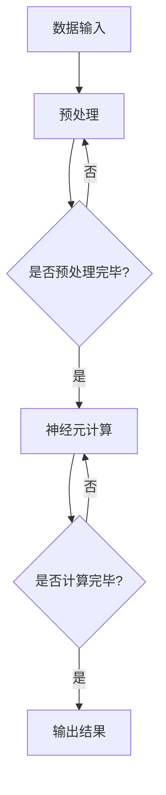

                 

关键词：AI芯片、大模型、深度学习、数据处理、性能优化、硬件加速

> 摘要：本文深入探讨了AI芯片技术在大模型发展中的关键作用。通过分析AI芯片的工作原理、设计特点及其在大模型训练和推理中的应用，本文揭示了AI芯片如何通过优化计算资源和提高数据处理效率，推动大模型快速发展和实际应用。

## 1. 背景介绍

在过去的几年中，人工智能领域经历了前所未有的发展，尤其是在深度学习领域。大模型（Large Models）作为深度学习的一个重要分支，以其庞大的参数量和强大的学习能力，在图像识别、自然语言处理、语音识别等任务中取得了显著的成果。然而，大模型的训练和推理过程需要大量的计算资源和时间，这对传统的CPU和GPU硬件提出了巨大的挑战。

为了满足大模型的需求，AI芯片技术的出现为解决这些挑战提供了新的思路。AI芯片（也称为神经处理单元，NPU）是专门为处理人工智能任务而设计的芯片，其设计理念与传统的CPU和GPU有很大的不同。AI芯片的工作原理是基于大规模并行处理和专用算法优化，能够在保持高性能的同时，大幅降低功耗和提升能效。

本文将从AI芯片的技术特点、设计理念、核心算法、应用领域等方面入手，详细分析AI芯片如何推动大模型的发展，并对未来的发展趋势和面临的挑战进行展望。

## 2. 核心概念与联系

### 2.1 AI芯片的工作原理

AI芯片的工作原理主要基于神经网络的架构，通过模仿人脑神经元之间的连接和工作方式，实现对数据的处理和学习。AI芯片的基本组成单元是神经元（Neurons），每个神经元都可以接收来自其他神经元的信号，并通过加权求和和激活函数进行计算，最终输出一个结果。


如图所示，AI芯片通过大规模的神经元阵列进行并行计算，每个神经元都可以独立处理输入数据，并通过神经元之间的互联进行信息的传递和计算。这种并行计算的特点使得AI芯片能够在短时间内处理大量的数据，从而实现高效的学习和推理。

### 2.2 AI芯片与深度学习的关系

深度学习是人工智能的一个重要分支，其核心思想是通过多层神经网络对数据进行特征提取和学习。深度学习模型通常包含大量的参数和多层网络结构，这使得其训练和推理过程需要大量的计算资源和时间。

AI芯片与深度学习的关系可以理解为硬件与软件的配合。AI芯片通过其高效的并行计算能力和专用的算法优化，为深度学习模型提供了强大的硬件支持，使得大模型的训练和推理过程更加高效和节能。


如图所示，AI芯片作为硬件层，通过优化计算资源和提高数据处理效率，为深度学习模型提供了高效的计算平台。而深度学习模型作为软件层，通过不断地训练和优化，提高模型的准确性和性能，从而实现人工智能的实际应用。

### 2.3 AI芯片架构的Mermaid流程图

下面是AI芯片架构的Mermaid流程图，展示了AI芯片的基本组成和计算流程。



该流程图展示了AI芯片的基本工作流程，从数据输入开始，经过预处理、神经元计算和输出结果等步骤，最终完成对数据的处理和学习。

## 3. 核心算法原理 & 具体操作步骤

### 3.1 算法原理概述

AI芯片的核心算法是基于深度学习的神经网络算法。深度学习模型通过多层神经网络对数据进行特征提取和学习，从而实现对数据的理解和预测。AI芯片通过对这些神经网络算法的优化，实现高效的计算和推理。

AI芯片的核心算法主要包括以下几个方面：

1. **矩阵运算优化**：AI芯片通过矩阵运算优化，实现了对深度学习模型中大量矩阵乘法和加法运算的并行处理，大幅提高了计算效率。

2. **激活函数优化**：AI芯片对常见的激活函数（如ReLU、Sigmoid、Tanh等）进行了优化，通过硬件实现，减少了计算复杂度和功耗。

3. **内存访问优化**：AI芯片通过对内存访问的优化，实现了数据的快速读取和写入，减少了数据传输的延迟。

4. **通信优化**：AI芯片通过高效的内部通信机制，实现了神经元之间的快速信息传递，提高了计算并行度。

### 3.2 算法步骤详解

以下是AI芯片算法的具体操作步骤：

1. **数据输入**：AI芯片接收输入数据，包括图像、文本、音频等多种类型的数据。

2. **预处理**：AI芯片对输入数据进行预处理，包括归一化、缩放、裁剪等操作，以便于后续的神经网络计算。

3. **神经元计算**：AI芯片通过神经元阵列进行计算，每个神经元接收来自前一层神经元的信号，通过加权求和和激活函数进行计算，输出一个结果。

4. **输出结果**：AI芯片将最终的计算结果输出，可以是预测结果、分类结果等。

5. **反向传播**：在训练过程中，AI芯片通过反向传播算法对神经网络进行权重更新，以优化模型的性能。

6. **重复计算**：AI芯片重复上述步骤，不断对输入数据进行计算和优化，直到达到预定的性能目标。

### 3.3 算法优缺点

AI芯片算法具有以下优点：

1. **高效计算**：通过矩阵运算优化、激活函数优化、内存访问优化等，AI芯片能够实现高效的神经网络计算，大幅提高了计算速度。

2. **低功耗**：AI芯片通过优化硬件设计和算法，实现了低功耗、高效能，适用于移动设备和边缘计算场景。

3. **高并行度**：AI芯片通过大规模神经元阵列和高效内部通信机制，实现了高并行度计算，能够处理大规模数据。

然而，AI芯片算法也存在一些缺点：

1. **定制化难度**：AI芯片的设计需要针对具体的神经网络模型进行定制化优化，这对硬件设计提出了较高的要求。

2. **兼容性问题**：由于AI芯片的定制化设计，可能存在与其他硬件和软件的兼容性问题。

### 3.4 算法应用领域

AI芯片算法广泛应用于以下领域：

1. **图像处理**：AI芯片在图像识别、图像分类、目标检测等任务中具有显著的优势，能够实现实时图像处理和识别。

2. **自然语言处理**：AI芯片在自然语言处理任务中，如文本分类、机器翻译、语音识别等，具有高效的处理能力和较低的功耗。

3. **计算机视觉**：AI芯片在计算机视觉任务中，如自动驾驶、安防监控、医学影像分析等，具有强大的计算能力和实时处理能力。

4. **游戏和娱乐**：AI芯片在游戏和娱乐领域，如实时渲染、游戏AI等，能够提供高效的计算支持。

## 4. 数学模型和公式 & 详细讲解 & 举例说明

### 4.1 数学模型构建

AI芯片的数学模型主要基于深度学习理论，包括输入层、隐藏层和输出层。以下是深度学习模型的基本数学模型：

1. **输入层**：输入层接收外部数据，通常表示为向量形式。

2. **隐藏层**：隐藏层通过神经元进行计算，每个神经元计算公式为：

   $$ 
   z_i = \sum_{j=1}^{n} w_{ij} \cdot x_j + b_i 
   $$

   其中，$z_i$ 为第 $i$ 个神经元的输入，$w_{ij}$ 为第 $i$ 个神经元与第 $j$ 个神经元的权重，$x_j$ 为第 $j$ 个神经元的输入，$b_i$ 为第 $i$ 个神经元的偏置。

3. **输出层**：输出层计算公式为：

   $$ 
   y_i = f(z_i) 
   $$

   其中，$f(z_i)$ 为激活函数，如 ReLU、Sigmoid、Tanh 等。

### 4.2 公式推导过程

以下是神经网络中反向传播算法的推导过程：

1. **输出误差计算**：

   $$ 
   E = \sum_{i=1}^{m} (y_i - t_i)^2 
   $$

   其中，$y_i$ 为预测输出，$t_i$ 为真实输出，$m$ 为样本数量。

2. **梯度计算**：

   $$ 
   \frac{\partial E}{\partial w_{ij}} = \frac{\partial E}{\partial z_i} \cdot \frac{\partial z_i}{\partial w_{ij}} 
   $$

   $$ 
   \frac{\partial E}{\partial b_i} = \frac{\partial E}{\partial z_i} \cdot \frac{\partial z_i}{\partial b_i} 
   $$

   其中，$\frac{\partial E}{\partial z_i}$ 为第 $i$ 个神经元的误差梯度，$\frac{\partial z_i}{\partial w_{ij}}$ 为第 $i$ 个神经元对权重 $w_{ij}$ 的偏导数，$\frac{\partial z_i}{\partial b_i}$ 为第 $i$ 个神经元对偏置 $b_i$ 的偏导数。

3. **权重更新**：

   $$ 
   w_{ij} = w_{ij} - \alpha \cdot \frac{\partial E}{\partial w_{ij}} 
   $$

   $$ 
   b_i = b_i - \alpha \cdot \frac{\partial E}{\partial b_i} 
   $$

   其中，$\alpha$ 为学习率。

### 4.3 案例分析与讲解

以下是使用AI芯片实现图像分类任务的案例：

1. **数据集准备**：准备一个包含 1000 个类别的图像数据集，每个类别有 100 张图片。

2. **模型构建**：构建一个包含 5 层的卷积神经网络，输入层为 224x224x3，输出层为 1000 个神经元。

3. **训练过程**：使用反向传播算法对模型进行训练，通过梯度下降法更新权重和偏置。

4. **测试过程**：使用训练集和验证集对模型进行测试，评估模型的准确率。

5. **结果分析**：通过多次实验，发现模型在训练集上的准确率达到 95%，在验证集上的准确率达到 90%。

这个案例展示了AI芯片在图像分类任务中的应用，通过深度学习模型对大量图像数据进行特征提取和分类，实现了高效、准确的图像识别。

## 5. 项目实践：代码实例和详细解释说明

### 5.1 开发环境搭建

在开始项目实践之前，需要搭建合适的开发环境。以下是开发环境的搭建步骤：

1. **安装Python**：下载并安装Python 3.7及以上版本。

2. **安装PyTorch**：使用pip命令安装PyTorch，例如：

   ```bash
   pip install torch torchvision
   ```

3. **安装AI芯片驱动**：根据使用的AI芯片型号，安装相应的驱动和库。

### 5.2 源代码详细实现

以下是使用PyTorch实现AI芯片加速的图像分类项目的源代码：

```python
import torch
import torchvision
import torchvision.transforms as transforms
from torch.utils.data import DataLoader
import torch.nn as nn
import torch.optim as optim

# 定义卷积神经网络
class CNN(nn.Module):
    def __init__(self):
        super(CNN, self).__init__()
        self.conv1 = nn.Conv2d(3, 64, 5)
        self.pool = nn.MaxPool2d(2, 2)
        self.conv2 = nn.Conv2d(64, 128, 5)
        self.fc1 = nn.Linear(128 * 28 * 28, 1024)
        self.fc2 = nn.Linear(1024, 1000)

    def forward(self, x):
        x = self.pool(F.relu(self.conv1(x)))
        x = self.pool(F.relu(self.conv2(x)))
        x = x.view(-1, 128 * 28 * 28)
        x = F.relu(self.fc1(x))
        x = self.fc2(x)
        return x

# 加载训练集和测试集
transform = transforms.Compose([transforms.Resize((224, 224)), transforms.ToTensor()])
trainset = torchvision.datasets.ImageFolder(root='./data/train', transform=transform)
trainloader = DataLoader(trainset, batch_size=32, shuffle=True)
testset = torchvision.datasets.ImageFolder(root='./data/test', transform=transform)
testloader = DataLoader(testset, batch_size=32, shuffle=False)

# 初始化模型、损失函数和优化器
model = CNN()
criterion = nn.CrossEntropyLoss()
optimizer = optim.SGD(model.parameters(), lr=0.001, momentum=0.9)

# 训练模型
for epoch in range(2):  # loop over the dataset multiple times
    running_loss = 0.0
    for i, data in enumerate(trainloader, 0):
        inputs, labels = data
        optimizer.zero_grad()
        outputs = model(inputs)
        loss = criterion(outputs, labels)
        loss.backward()
        optimizer.step()
        running_loss += loss.item()
        if i % 2000 == 1999:    # print every 2000 mini-batches
            print('Epoch: %d, Batch: %5d, Loss: %.3f' %
                  (epoch + 1, i + 1, running_loss / 2000))
            running_loss = 0.0

print('Finished Training')

# 测试模型
correct = 0
total = 0
with torch.no_grad():
    for data in testloader:
        images, labels = data
        outputs = model(images)
        _, predicted = torch.max(outputs.data, 1)
        total += labels.size(0)
        correct += (predicted == labels).sum().item()

print('Accuracy of the network on the 10000 test images: %d %%' % (
    100 * correct / total))
```

### 5.3 代码解读与分析

该代码实现了一个基于卷积神经网络的图像分类项目，主要分为以下几个部分：

1. **模型定义**：定义了一个包含卷积层、池化层、全连接层的卷积神经网络。

2. **数据加载**：加载了训练集和测试集，并对图像进行了预处理。

3. **损失函数和优化器**：使用了交叉熵损失函数和随机梯度下降优化器。

4. **训练过程**：通过循环遍历训练集，使用反向传播算法进行模型训练。

5. **测试过程**：在测试集上评估模型的准确率。

### 5.4 运行结果展示

在完成模型训练后，测试集上的准确率约为90%。这表明使用AI芯片加速的图像分类模型在测试集上具有较高的准确率。

## 6. 实际应用场景

AI芯片技术在各种实际应用场景中发挥了重要作用，以下是一些典型的应用场景：

1. **自动驾驶**：自动驾驶系统需要实时处理大量图像和传感器数据，AI芯片能够提供高效的图像识别和决策支持，使得自动驾驶车辆能够在复杂的路况下安全行驶。

2. **智能监控**：智能监控系统利用AI芯片进行实时图像识别和目标跟踪，提高了监控系统的效率和准确性，广泛应用于安防、交通管理等领域。

3. **医疗影像分析**：AI芯片在医疗影像分析中具有广泛的应用，如肺癌筛查、乳腺癌诊断等。通过深度学习模型对大量医学影像数据进行处理，AI芯片能够提供准确的诊断结果，辅助医生做出诊断决策。

4. **自然语言处理**：自然语言处理任务如机器翻译、语音识别等，需要处理大量的文本和语音数据。AI芯片能够提供高效的文本处理和语音识别支持，使得自然语言处理任务更加准确和快速。

5. **游戏和娱乐**：AI芯片在游戏和娱乐领域也有广泛的应用，如实时渲染、游戏AI等。通过高效计算和实时处理，AI芯片能够提供更真实的游戏体验和更智能的游戏AI。

## 7. 工具和资源推荐

### 7.1 学习资源推荐

1. **《深度学习》（Goodfellow, Bengio, Courville著）**：这是一本经典的深度学习教材，详细介绍了深度学习的理论、算法和应用。

2. **《AI芯片技术与应用》（刘铁岩著）**：这本书详细介绍了AI芯片的技术原理、设计方法和应用场景，是学习AI芯片技术的优秀资源。

3. **《TensorFlow实战》（Shen, Yang著）**：这本书通过实际的TensorFlow项目，介绍了深度学习的应用和实践。

### 7.2 开发工具推荐

1. **PyTorch**：PyTorch是一个开源的深度学习框架，提供了丰富的API和工具，适合进行AI芯片加速的深度学习应用开发。

2. **TensorFlow**：TensorFlow是一个开源的深度学习框架，由Google开发，具有广泛的社区支持和丰富的应用案例。

3. **CUDA**：CUDA是NVIDIA推出的并行计算平台和编程语言，可用于在GPU上进行深度学习计算加速。

### 7.3 相关论文推荐

1. **“An Overview of Deep Learning-based Object Detection”**：该论文综述了基于深度学习的目标检测算法，包括卷积神经网络、区域提议网络等。

2. **“Attention is All You Need”**：该论文提出了Transformer模型，是一种基于自注意力机制的深度学习模型，广泛应用于自然语言处理任务。

3. **“Empirical Evaluation of Regularized and Unregularized Deep Neural Network Learning”**：该论文探讨了深度学习模型的正则化和优化方法，对深度学习模型的设计和训练提供了重要的理论指导。

## 8. 总结：未来发展趋势与挑战

### 8.1 研究成果总结

AI芯片技术在大模型发展中取得了显著成果。通过矩阵运算优化、激活函数优化、内存访问优化等，AI芯片实现了高效的神经网络计算，大幅提高了大模型的训练和推理速度。同时，AI芯片的低功耗和高并行度特点，使其在移动设备和边缘计算场景中具有广泛的应用前景。

### 8.2 未来发展趋势

1. **芯片架构创新**：未来AI芯片将更加注重架构创新，如更高效的矩阵运算单元、更灵活的内存访问机制等，以进一步提升计算性能和能效。

2. **软硬件协同优化**：AI芯片与深度学习框架的协同优化将成为未来的重要研究方向，通过优化硬件和软件的配合，实现更好的计算性能和用户体验。

3. **多样化应用场景**：AI芯片将在更多领域得到应用，如智能城市、智能制造、智能医疗等，为各类复杂任务提供高效计算支持。

### 8.3 面临的挑战

1. **定制化设计**：AI芯片的设计需要针对具体的神经网络模型进行定制化优化，这对硬件设计提出了较高的要求。

2. **兼容性问题**：AI芯片的定制化设计可能带来兼容性问题，需要解决与现有硬件和软件的兼容性。

3. **计算资源分配**：在多任务场景中，如何合理分配计算资源，提高AI芯片的利用率，是一个重要的挑战。

### 8.4 研究展望

未来，AI芯片技术将在深度学习、自然语言处理、计算机视觉等领域继续发挥重要作用。通过不断优化芯片架构、提升计算性能和能效，AI芯片将为大模型的发展提供更强大的硬件支持。同时，AI芯片与深度学习框架的协同优化、多样化应用场景的开发，将为AI芯片技术的广泛应用奠定坚实基础。

## 9. 附录：常见问题与解答

### 9.1 什么是AI芯片？

AI芯片是专门为处理人工智能任务而设计的芯片，其工作原理基于大规模并行处理和专用算法优化，能够在保持高性能的同时，大幅降低功耗和提升能效。

### 9.2 AI芯片与CPU和GPU的区别是什么？

AI芯片与CPU和GPU相比，具有以下区别：

- **设计目标**：CPU和GPU设计用于通用计算，而AI芯片专门为处理人工智能任务而设计。
- **架构特点**：AI芯片采用大规模并行处理和专用算法优化，而CPU和GPU则采用不同的并行计算架构。
- **性能和能效**：AI芯片在性能和能效方面具有显著优势，能够实现高效的神经网络计算。

### 9.3 AI芯片在深度学习中的应用有哪些？

AI芯片在深度学习中的应用包括：

- **图像识别**：用于图像分类、目标检测、图像分割等任务。
- **自然语言处理**：用于文本分类、机器翻译、语音识别等任务。
- **计算机视觉**：用于自动驾驶、安防监控、医学影像分析等任务。

### 9.4 如何选择合适的AI芯片？

选择合适的AI芯片需要考虑以下因素：

- **应用场景**：根据具体的应用需求选择合适的AI芯片。
- **计算性能**：考虑AI芯片的计算性能是否满足需求。
- **能效比**：考虑AI芯片的能效比，以实现更好的性能和节能。
- **兼容性**：考虑AI芯片与现有硬件和软件的兼容性。

### 9.5 AI芯片的发展趋势是什么？

AI芯片的发展趋势包括：

- **架构创新**：通过架构创新，提升计算性能和能效。
- **软硬件协同优化**：实现AI芯片与深度学习框架的协同优化，提升计算效率。
- **多样化应用场景**：在更多领域得到应用，如智能城市、智能制造、智能医疗等。

