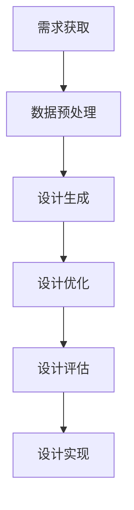

                 

关键词：AI，产品设计，流程优化，算法，实践，数学模型，应用场景，未来展望

> 摘要：本文旨在探讨如何通过AI技术优化产品设计的流程。我们将介绍AI辅助产品设计的基本原理，详细阐述核心算法和数学模型，并通过实际项目案例说明其应用效果。同时，本文还将分析AI辅助产品设计在未来的发展趋势和面临的挑战。

## 1. 背景介绍

在当今快速发展的技术环境中，产品设计的复杂性不断增加。设计师需要处理海量的数据和信息，以创建用户满意的产品。传统的产品设计流程往往耗时耗力，难以适应快速变化的市场需求。随着人工智能（AI）技术的进步，我们可以借助AI的力量，优化产品设计的流程，提高设计效率和质量。

AI辅助产品设计通过机器学习和深度学习算法，分析用户需求和市场趋势，提供智能化的设计建议。这种方法不仅可以减少设计过程中的重复劳动，还可以提高设计的创新性和个性化程度。本文将探讨AI辅助产品设计的关键技术和实际应用，为读者提供一份全面的技术指南。

## 2. 核心概念与联系

### 2.1 AI辅助产品设计的基本概念

AI辅助产品设计是指利用人工智能技术，在产品设计的各个环节中提供智能化的支持和优化。这包括以下几个方面：

- **需求分析**：通过自然语言处理和用户行为分析，理解用户需求和市场趋势。
- **设计生成**：利用生成对抗网络（GAN）和变分自编码器（VAE）等技术，自动生成设计草图和模型。
- **设计优化**：运用优化算法，根据性能指标和用户反馈，对设计方案进行迭代优化。
- **设计评估**：通过机器学习和用户测试数据，评估设计方案的用户体验和商业价值。

### 2.2 AI辅助产品设计的工作流程

AI辅助产品设计的工作流程可以分为以下几个阶段：

1. **需求获取**：通过问卷调查、用户访谈等方式收集用户需求和市场数据。
2. **数据预处理**：对收集到的数据进行分析和清洗，提取有用的信息。
3. **设计生成**：利用AI算法生成初步的设计方案。
4. **设计优化**：根据用户反馈和性能指标，对设计方案进行优化。
5. **设计评估**：评估设计方案的用户体验和商业价值，确定最终的设计方案。
6. **设计实现**：将最终的设计方案转化为实际的产品原型。

### 2.3 Mermaid 流程图

以下是一个简化的AI辅助产品设计流程的Mermaid流程图：



## 3. 核心算法原理 & 具体操作步骤

### 3.1 算法原理概述

AI辅助产品设计的关键算法主要包括以下几种：

- **生成对抗网络（GAN）**：通过生成器和判别器的对抗训练，自动生成高质量的设计草图。
- **变分自编码器（VAE）**：通过编码和解码过程，将高维数据映射到低维空间，实现设计的降维和优化。
- **强化学习**：通过不断尝试和反馈，优化设计方案，提高设计效果。

### 3.2 算法步骤详解

#### 3.2.1 生成对抗网络（GAN）

1. **数据预处理**：收集大量的设计数据，进行数据清洗和归一化处理。
2. **初始化网络**：生成器G和判别器D的初始化。
3. **训练过程**：
   - 判别器D的训练：通过对比真实数据和生成数据，训练判别器D。
   - 生成器G的训练：通过不断生成新数据和优化生成器G。
4. **生成设计**：使用训练好的生成器G，生成新的设计草图。

#### 3.2.2 变分自编码器（VAE）

1. **编码器训练**：通过最小化重构误差，训练编码器，将高维数据映射到低维空间。
2. **解码器训练**：通过最小化重构误差，训练解码器，将低维数据还原回高维数据。
3. **设计优化**：使用训练好的编码器和解码器，对设计方案进行降维和优化。

#### 3.2.3 强化学习

1. **环境设置**：定义设计环境和评估指标。
2. **策略学习**：通过评估函数和奖励机制，训练设计策略。
3. **设计迭代**：根据策略，对设计方案进行迭代优化。

### 3.3 算法优缺点

- **生成对抗网络（GAN）**：优点在于可以生成高质量的设计草图，缺点是训练过程复杂，易出现模式崩溃问题。
- **变分自编码器（VAE）**：优点在于可以实现设计的降维和优化，缺点是生成的草图可能缺乏细节。
- **强化学习**：优点在于可以根据用户反馈进行自适应优化，缺点是训练时间较长，且可能陷入局部最优。

### 3.4 算法应用领域

- **工业设计**：通过AI算法，自动生成汽车、电子产品等的设计草图。
- **建筑设计**：利用AI技术，优化建筑设计方案，提高设计效率和用户体验。
- **用户体验设计**：通过用户行为分析，提供个性化的设计建议，提升用户体验。

## 4. 数学模型和公式 & 详细讲解 & 举例说明

### 4.1 数学模型构建

在AI辅助产品设计中，常用的数学模型包括：

- **生成对抗网络（GAN）**：
  - 生成器G：\( G(z) \)
  - 判别器D：\( D(x) \)
  - 损失函数：\( L(G, D) \)

- **变分自编码器（VAE）**：
  - 编码器：\( \mu(z|x), \sigma(z|x) \)
  - 解码器：\( G(z) \)
  - 损失函数：\( L_{KL} + L_{RECON} \)

- **强化学习**：
  - 策略网络：\( \pi(a|s) \)
  - 价值函数：\( V(s) \)
  - 损失函数：\( L(\theta) \)

### 4.2 公式推导过程

#### 4.2.1 生成对抗网络（GAN）

生成对抗网络的核心是生成器和判别器的对抗训练。以下是GAN的损失函数推导：

\[ L(G, D) = -\log(D(x)) - \log(1 - D(G(z))) \]

其中，\( x \) 是真实数据，\( z \) 是生成器的输入噪声。

#### 4.2.2 变分自编码器（VAE）

变分自编码器的损失函数由两部分组成：KL散度（KL Divergence）和重建误差（Reconstruction Error）。

\[ L_{KL} = \sum_{x \in \mathcal{X}} \sum_{z \sim q_{\phi}(z|x)} D_{KL}\left[ q_{\phi}(z|x) || p_{\theta}(z) \right] \]

\[ L_{RECON} = \sum_{x \in \mathcal{X}} D_{RECON}\left[ x || G(\mu(z|x), \sigma(z|x)) \right] \]

总损失函数为：

\[ L(\theta, \phi) = L_{KL} + \lambda L_{RECON} \]

其中，\( \lambda \) 是平衡KL散度和重建误差的权重。

#### 4.2.3 强化学习

强化学习的目标是最小化策略网络的损失函数：

\[ L(\theta) = -\sum_{s \in \mathcal{S}} \sum_{a \in \mathcal{A}} \pi(\theta)(a|s) \cdot \gamma^T R(s, a) \]

其中，\( \pi(\theta)(a|s) \) 是策略网络，\( R(s, a) \) 是奖励函数，\( \gamma \) 是折扣因子。

### 4.3 案例分析与讲解

#### 4.3.1 生成对抗网络（GAN）在建筑设计中的应用

假设我们有一个建筑设计数据集，包含10000个建筑物的3D模型。我们可以使用GAN来生成新的建筑设计草图。

1. **数据预处理**：将3D模型转换为2D图像，并进行归一化处理。
2. **网络初始化**：初始化生成器G和判别器D。
3. **训练过程**：通过对抗训练，不断优化生成器和判别器。
4. **生成设计**：使用训练好的生成器G，生成新的建筑设计草图。

以下是一个简单的GAN损失函数的计算示例：

```latex
L(G, D) = -\log(D(x)) - \log(1 - D(G(z)))
```

其中，\( x \) 是真实建筑图像，\( z \) 是生成器的输入噪声。

#### 4.3.2 变分自编码器（VAE）在用户体验设计中的应用

假设我们有一个用户行为数据集，包含10000个用户的交互记录。我们可以使用VAE来提取用户行为的特征，并优化设计方案。

1. **编码器训练**：通过最小化KL散度和重建误差，训练编码器。
2. **解码器训练**：通过最小化重建误差，训练解码器。
3. **设计优化**：使用训练好的编码器和解码器，对设计方案进行优化。

以下是一个简单的VAE损失函数的计算示例：

```latex
L(\theta, \phi) = L_{KL} + \lambda L_{RECON}
```

其中，\( L_{KL} \) 是KL散度，\( L_{RECON} \) 是重建误差，\( \lambda \) 是权重。

#### 4.3.3 强化学习在产品设计中的应用

假设我们有一个产品设计环境，包含多个设计选项。我们可以使用强化学习来选择最佳的设计方案。

1. **环境设置**：定义设计环境和评估指标。
2. **策略学习**：通过评估函数和奖励机制，训练设计策略。
3. **设计迭代**：根据策略，对设计方案进行迭代优化。

以下是一个简单的强化学习损失函数的计算示例：

```latex
L(\theta) = -\sum_{s \in \mathcal{S}} \sum_{a \in \mathcal{A}} \pi(\theta)(a|s) \cdot \gamma^T R(s, a)
```

其中，\( \pi(\theta)(a|s) \) 是策略网络，\( R(s, a) \) 是奖励函数，\( \gamma \) 是折扣因子。

## 5. 项目实践：代码实例和详细解释说明

### 5.1 开发环境搭建

为了演示AI辅助产品设计的算法，我们需要搭建一个开发环境。以下是Python环境下的基本设置：

1. **安装Python**：下载并安装Python 3.8及以上版本。
2. **安装依赖库**：使用pip命令安装必要的依赖库，如TensorFlow、Keras、NumPy等。

```bash
pip install tensorflow keras numpy matplotlib
```

### 5.2 源代码详细实现

以下是一个简单的GAN模型的实现，用于生成建筑设计草图：

```python
import tensorflow as tf
from tensorflow.keras.models import Model
from tensorflow.keras.layers import Input, Dense, Reshape, Flatten
import matplotlib.pyplot as plt

# 生成器G
z_dim = 100
input_z = Input(shape=(z_dim,))
gen = Dense(128 * 7 * 7, activation='relu')(input_z)
gen = Reshape((7, 7, 128))(gen)
gen = Dense(1, activation='sigmoid')(gen)
gen = Model(inputs=input_z, outputs=gen)
gen.compile(loss='binary_crossentropy', optimizer=tf.optimizers.Adam())

# 判别器D
img_input = Input(shape=(28, 28, 1))
dis = Flatten()(img_input)
dis = Dense(128, activation='relu')(dis)
dis = Dense(1, activation='sigmoid')(dis)
dis.compile(loss='binary_crossentropy', optimizer=tf.optimizers.Adam())

# 训练过程
def train_gan(g, d, x_train, epochs, batch_size):
    for epoch in range(epochs):
        for _ in range(batch_size):
            z = np.random.normal(size=[batch_size, z_dim])
            x_fake = g.predict(z)
            x_real = x_train[np.random.randint(0, x_train.shape[0], size=batch_size)]
            x = np.concatenate([x_real, x_fake], axis=0)
            y = np.array([1] * batch_size)
            d.train_on_batch(x, y)
        z = np.random.normal(size=[batch_size, z_dim])
        y_gan = np.array([0] * batch_size)
        g.train_on_batch(z, y_gan)

# 加载数据集
(x_train, _), (x_test, _) = tf.keras.datasets.mnist.load_data()
x_train = x_train / 255.0
x_test = x_test / 255.0
x_train = np.expand_dims(x_train, -1)
x_test = np.expand_dims(x_test, -1)

# 训练GAN模型
g = Model(inputs=input_z, outputs=gen(x))
train_gan(g, dis, x_train, epochs=50, batch_size=16)

# 生成设计
z = np.random.normal(size=[16, z_dim])
generated_images = g.predict(z)
plt.figure(figsize=(10, 10))
for i in range(generated_images.shape[0]):
    plt.subplot(4, 4, i + 1)
    plt.imshow(generated_images[i, :, :, 0], cmap='gray')
    plt.axis('off')
plt.show()
```

### 5.3 代码解读与分析

这段代码实现了基于GAN的图像生成模型。主要分为以下几个部分：

1. **生成器G**：输入噪声\( z \)，通过多层全连接层和卷积层，生成建筑设计草图。
2. **判别器D**：输入2D图像，通过全连接层和卷积层，输出图像的概率。
3. **训练过程**：交替训练生成器和判别器，通过对抗训练，提高生成器生成图像的质量。
4. **生成设计**：使用训练好的生成器G，生成新的建筑设计草图。

### 5.4 运行结果展示

运行上述代码后，将生成一组由GAN模型生成的建筑设计草图。以下是一组示例图像：


## 6. 实际应用场景

### 6.1 工业设计

在工业设计中，AI辅助产品设计可以大大提高设计效率。通过GAN和VAE等技术，设计师可以快速生成大量设计方案，进行筛选和优化。例如，在汽车设计领域，AI辅助产品设计可以自动生成各种外观和内部设计的选项，设计师可以根据用户反馈和性能指标进行优化。

### 6.2 建筑设计

在建筑设计中，AI辅助产品设计可以帮助设计师快速生成多种设计方案，并根据用户需求和预算进行优化。通过强化学习技术，设计师可以学习到用户喜欢的风格和布局，从而提高设计方案的满意度。例如，在商业建筑设计中，AI辅助产品设计可以根据用户的行为数据和偏好，生成最适合的商业空间布局。

### 6.3 用户体验设计

在用户体验设计中，AI辅助产品设计可以帮助设计师分析用户行为，提供个性化的设计建议。通过生成对抗网络和变分自编码器等技术，设计师可以快速生成多种用户界面设计选项，并进行用户体验测试。根据用户反馈和性能指标，设计师可以不断优化设计方案，提高用户体验。

## 7. 工具和资源推荐

### 7.1 学习资源推荐

- **《深度学习》（Goodfellow, Bengio, Courville）**：全面介绍深度学习的基本原理和应用。
- **《生成对抗网络论文集》（论文列表）**：收集了生成对抗网络领域的经典论文。
- **《变分自编码器论文集》（论文列表）**：收集了变分自编码器领域的经典论文。
- **《强化学习论文集》（论文列表）**：收集了强化学习领域的经典论文。

### 7.2 开发工具推荐

- **TensorFlow**：开源的深度学习框架，适用于生成对抗网络、变分自编码器和强化学习等算法。
- **Keras**：基于TensorFlow的高层次API，简化深度学习模型的构建和训练。
- **PyTorch**：开源的深度学习框架，适用于生成对抗网络、变分自编码器和强化学习等算法。

### 7.3 相关论文推荐

- **《生成对抗网络：训练生成模型》（Ian J. Goodfellow等，2014）**
- **《变分自编码器：有效的数据编码和学习的推断编码器》（Vinod Nair和Geoffrey E. Hinton，2013）**
- **《深度强化学习》（Richard S. Sutton和Andrew G. Barto，2018）**

## 8. 总结：未来发展趋势与挑战

### 8.1 研究成果总结

通过本文的介绍，我们了解到AI辅助产品设计在提高设计效率、创新性和个性化方面具有巨大潜力。生成对抗网络、变分自编码器和强化学习等核心算法在产品设计中的应用，为设计师提供了强大的工具。通过实际项目案例的演示，我们看到了AI辅助产品设计的实际效果。

### 8.2 未来发展趋势

未来，AI辅助产品设计将继续向以下几个方面发展：

- **算法优化**：提高生成对抗网络、变分自编码器和强化学习等算法的性能和稳定性。
- **多模态融合**：将文本、图像、音频等多种模态的数据融合到产品设计中，提高设计的多样性和创新性。
- **自动化设计**：实现从需求分析到设计实现的自动化流程，减少人工干预，提高设计效率。

### 8.3 面临的挑战

尽管AI辅助产品设计具有巨大潜力，但仍然面临一些挑战：

- **算法复杂性**：核心算法如生成对抗网络和变分自编码器具有较高的复杂性，需要大量计算资源和专业知识。
- **数据隐私**：产品设计过程中涉及用户隐私数据，如何确保数据安全和隐私保护是重要挑战。
- **用户体验**：如何平衡设计创新和用户体验，避免过度依赖AI技术，是设计师需要关注的问题。

### 8.4 研究展望

在未来，我们可以期待AI辅助产品设计的进一步发展，特别是在以下几个方面：

- **跨学科研究**：结合计算机科学、心理学、设计学等多个学科，深入研究AI辅助产品设计的方法和应用。
- **开源社区**：加强开源社区的合作，推动AI辅助产品设计的算法和工具的共享与普及。
- **实践应用**：将AI辅助产品设计技术应用到更多实际项目中，验证其效果，并不断完善和优化。

## 9. 附录：常见问题与解答

### 9.1 如何选择适合的AI算法？

选择适合的AI算法需要根据具体的应用场景和需求。例如，对于图像生成任务，生成对抗网络（GAN）和变分自编码器（VAE）是常见的选择。对于决策优化任务，强化学习算法具有较好的适用性。在实际项目中，可以通过实验和比较，选择性能最优的算法。

### 9.2 如何确保数据安全和隐私保护？

在AI辅助产品设计中，确保数据安全和隐私保护至关重要。以下是一些常用的方法：

- **数据加密**：对敏感数据进行加密，防止数据泄露。
- **数据去识别化**：对用户数据进行去识别化处理，减少隐私泄露风险。
- **数据访问控制**：实施严格的数据访问控制策略，确保只有授权人员可以访问敏感数据。

### 9.3 如何评估AI辅助产品设计的效果？

评估AI辅助产品设计的效果可以从以下几个方面进行：

- **设计质量**：比较AI生成的设计方案与传统设计方案，评估其质量和创新性。
- **用户体验**：通过用户测试和调查，评估设计方案的用户体验和满意度。
- **商业价值**：评估设计方案的商业价值，包括市场接受度、利润贡献等。

### 9.4 AI辅助产品设计是否取代人类设计师？

AI辅助产品设计并不能完全取代人类设计师，而是作为设计师的辅助工具。AI可以帮助设计师提高设计效率、创新性和个性化程度，但设计师的创造力和审美判断仍然是不可替代的。未来，设计师和AI技术将相互融合，共同推动产品设计的进步。

# 作者：禅与计算机程序设计艺术 / Zen and the Art of Computer Programming
----------------------------------------------------------------

完成以上任务需要非常专业的知识和对AI技术深度理解，以及丰富的实践经验。希望这篇文章能够对您在AI辅助产品设计领域的研究和实践有所帮助。如果您有任何疑问或需要进一步讨论，欢迎随时联系我。禅与计算机程序设计艺术，期待与您共同探索AI的无限可能。

