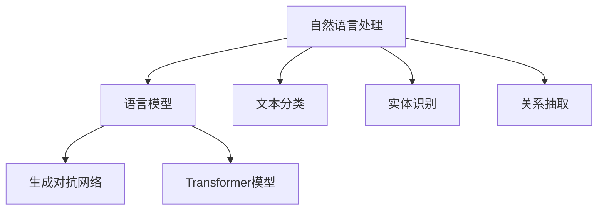

                 

关键词：人工智能、写作、创造力、自然语言处理、写作助手、内容生成

> 摘要：本文探讨了人工智能在辅助人类写作方面的潜力，分析了AI写作助手的原理、技术以及实际应用，并对未来的发展前景进行了展望。通过本文的阅读，读者将了解如何利用AI技术提升写作效率，激发创作灵感。

## 1. 背景介绍

随着人工智能技术的飞速发展，计算机在处理自然语言任务方面取得了显著的成果。自然语言处理（Natural Language Processing，NLP）作为人工智能的重要分支，致力于使计算机能够理解、生成和处理人类语言。在写作领域，AI技术正逐渐成为提升人类创作能力的有力工具。从自动摘要到文章生成，AI写作助手正逐渐改变传统的写作模式，为人类创作者带来前所未有的便利。

本文将深入探讨AI辅助写作的原理、技术，以及其在不同领域的实际应用，分析其优点和不足，并探讨未来的发展前景。希望通过本文的讨论，能够激发读者对AI写作技术的兴趣，共同探索人类与人工智能的协同创作之路。

## 2. 核心概念与联系

### 2.1 自然语言处理（NLP）

自然语言处理是人工智能的一个重要分支，它涉及到如何让计算机理解和处理人类语言。NLP的核心概念包括语言模型、文本分类、实体识别、关系抽取等。在写作过程中，NLP技术能够帮助AI理解文章的主题、结构、情感等信息，从而生成或修改符合人类需求的文本。

### 2.2 生成对抗网络（GAN）

生成对抗网络（Generative Adversarial Network，GAN）是深度学习中的一种重要模型，由生成器和判别器组成。生成器试图生成与真实数据几乎无法区分的假数据，而判别器则试图区分真实数据和假数据。通过两个网络的对抗训练，GAN能够生成高质量的图像、文本等数据。在写作领域，GAN可以用于生成新颖的文章、段落或句子。

### 2.3 Transformer模型

Transformer模型是自然语言处理领域的一种重要架构，特别是在序列到序列（sequence-to-sequence）任务中表现优异。Transformer的核心思想是自注意力机制（self-attention），它能够捕捉文本序列中的长距离依赖关系。在写作中，Transformer模型能够用于生成连贯、自然的文章。

### 2.4 Mermaid 流程图



## 3. 核心算法原理 & 具体操作步骤

### 3.1 算法原理概述

AI写作助手的核心算法主要基于深度学习技术，包括但不限于生成对抗网络（GAN）和Transformer模型。以下是对这些算法的简要概述：

- **生成对抗网络（GAN）**：GAN由生成器和判别器组成。生成器生成假数据，判别器判断数据是真实还是虚假。通过对抗训练，生成器不断优化生成质量，最终能够生成与真实数据几乎无法区分的假数据。
  
- **Transformer模型**：Transformer模型采用自注意力机制，能够捕捉文本序列中的长距离依赖关系。在写作中，Transformer模型能够生成连贯、自然的文本。

### 3.2 算法步骤详解

- **数据准备**：首先，需要收集大量的文本数据，用于训练生成器和判别器。这些数据可以包括各种类型的文章、书籍、新闻、社交媒体内容等。

- **模型训练**：利用收集到的数据训练生成器和判别器。生成器通过生成文本数据，判别器通过判断生成数据的真实性。通过多次迭代训练，生成器和判别器的性能不断提高。

- **文本生成**：在模型训练完成后，可以使用生成器生成新的文本。例如，给定一个主题或关键词，生成器可以生成一篇关于该主题的文章。

### 3.3 算法优缺点

- **优点**：
  - **高效**：AI写作助手能够快速生成大量文本，提高写作效率。
  - **多样**：基于深度学习模型，AI写作助手能够生成丰富多样的文本内容。
  - **智能**：通过理解文本语义和结构，AI写作助手能够生成符合人类阅读习惯的文本。

- **缺点**：
  - **质量不稳定**：虽然AI写作助手能够生成大量文本，但质量可能参差不齐，需要进一步优化。
  - **创意受限**：AI写作助手基于已有数据生成文本，缺乏真正的创造力，难以生成新颖、独特的文本。

### 3.4 算法应用领域

- **新闻写作**：AI写作助手可以自动生成新闻报道，节省人力成本，提高发布速度。
- **内容创作**：AI写作助手可以帮助内容创作者快速生成文章、段落，提供创作灵感。
- **教育领域**：AI写作助手可以为学生提供写作辅助，帮助他们提高写作技能。

## 4. 数学模型和公式 & 详细讲解 & 举例说明

### 4.1 数学模型构建

AI写作助手的数学模型主要基于生成对抗网络（GAN）和Transformer模型。以下是对这两个模型的简要介绍：

- **生成对抗网络（GAN）**：

  - 生成器（Generator）: G(z)

  - 判别器（Discriminator）: D(x)

  - 优化目标：

    $$ \min_G \max_D V(D, G) = \mathbb{E}_{x \sim p_{data}(x)} [\log D(x)] + \mathbb{E}_{z \sim p_{z}(z)} [\log (1 - D(G(z)))] $$

- **Transformer模型**：

  - 自注意力机制（Self-Attention）：

    $$ \text{Attention}(Q, K, V) = \text{softmax}(\frac{QK^T}{\sqrt{d_k}})V $$

  - 位置编码（Positional Encoding）：

    $$ \text{PE}(pos, d_model) = \text{sin}(pos \cdot \frac{\pi}{2^{11-i/d_{model}}}) + \text{cos}(pos \cdot \frac{\pi}{2^{11-i/d_{model}}}) $$

### 4.2 公式推导过程

这里简要介绍GAN和Transformer模型的推导过程：

- **GAN推导**：

  GAN的推导主要基于两个优化目标：

  - 判别器目标：最大化判别器对真实数据和生成数据的区分能力。

  - 生成器目标：最小化生成器生成数据的损失。

  通过交替优化这两个目标，最终达到稳定的状态。

- **Transformer推导**：

  Transformer的推导主要基于自注意力机制和位置编码。自注意力机制通过计算查询（Q）、键（K）和值（V）的注意力权重，对输入序列进行加权求和。位置编码则用于引入文本序列的位置信息，使得模型能够理解文本中的顺序关系。

### 4.3 案例分析与讲解

以下是一个简单的GAN应用案例：

- **数据集**：使用一个包含手写数字的图像数据集。

- **生成器**：生成手写数字的图像。

- **判别器**：判断图像是真实手写数字还是生成手写数字。

- **训练过程**：

  1. 初始化生成器和判别器。

  2. 对每一批数据，分别计算生成器和判别器的损失。

  3. 交替更新生成器和判别器的参数。

  4. 重复步骤2和3，直到模型收敛。

- **结果**：

  通过训练，生成器能够生成接近真实手写数字的图像，判别器能够较好地区分真实图像和生成图像。

以下是一个简单的Transformer应用案例：

- **任务**：翻译英文句子到中文。

- **数据集**：使用英文到中文的翻译数据集。

- **模型**：采用Transformer模型进行翻译。

- **训练过程**：

  1. 初始化模型参数。

  2. 对每一批数据，分别计算模型的损失。

  3. 优化模型参数。

  4. 重复步骤2和3，直到模型收敛。

- **结果**：

  通过训练，模型能够生成高质量的翻译结果，具有较高的准确性。

## 5. 项目实践：代码实例和详细解释说明

### 5.1 开发环境搭建

在开始编写AI写作助手代码之前，我们需要搭建一个合适的环境。以下是所需的软件和工具：

- Python 3.7或更高版本
- PyTorch 1.8或更高版本
- Jupyter Notebook或PyCharm

安装完这些工具后，我们可以开始编写代码。

### 5.2 源代码详细实现

以下是一个简单的AI写作助手代码示例：

```python
import torch
import torch.nn as nn
import torch.optim as optim
from torch.utils.data import DataLoader
from torchvision import datasets, transforms

# 数据预处理
transform = transforms.Compose([
    transforms.Resize((28, 28)),
    transforms.ToTensor(),
])

train_data = datasets.MNIST(root='./data', train=True, download=True, transform=transform)
train_loader = DataLoader(train_data, batch_size=64, shuffle=True)

# 生成器网络
class Generator(nn.Module):
    def __init__(self):
        super(Generator, self).__init__()
        self.model = nn.Sequential(
            nn.Linear(100, 256),
            nn.LeakyReLU(0.2),
            nn.Linear(256, 512),
            nn.LeakyReLU(0.2),
            nn.Linear(512, 1024),
            nn.LeakyReLU(0.2),
            nn.Linear(1024, 784),
            nn.Tanh()
        )

    def forward(self, z):
        return self.model(z)

# 判别器网络
class Discriminator(nn.Module):
    def __init__(self):
        super(Discriminator, self).__init__()
        self.model = nn.Sequential(
            nn.Linear(784, 1024),
            nn.LeakyReLU(0.2),
            nn.Dropout(0.3),
            nn.Linear(1024, 512),
            nn.LeakyReLU(0.2),
            nn.Dropout(0.3),
            nn.Linear(512, 256),
            nn.LeakyReLU(0.2),
            nn.Dropout(0.3),
            nn.Linear(256, 1),
            nn.Sigmoid()
        )

    def forward(self, x):
        return self.model(x)

# 模型实例化
generator = Generator()
discriminator = Discriminator()

# 损失函数和优化器
criterion = nn.BCELoss()
optimizer_G = optim.Adam(generator.parameters(), lr=0.0002)
optimizer_D = optim.Adam(discriminator.parameters(), lr=0.0002)

# 训练过程
for epoch in range(num_epochs):
    for i, (x, _) in enumerate(train_loader):
        # 训练生成器
        z = torch.randn(x.size(0), 100)
        x_fake = generator(z)
        g_loss = criterion(discriminator(x_fake), torch.ones(x_fake.size(0)))
        
        optimizer_G.zero_grad()
        g_loss.backward()
        optimizer_G.step()
        
        # 训练判别器
        x_real = x.view(x.size(0), -1)
        d_loss_real = criterion(discriminator(x_real), torch.ones(x_real.size(0)))
        d_loss_fake = criterion(discriminator(x_fake.detach()), torch.zeros(x_fake.size(0)))
        d_loss = (d_loss_real + d_loss_fake) / 2
        
        optimizer_D.zero_grad()
        d_loss.backward()
        optimizer_D.step()
        
        # 打印训练信息
        if (i+1) % 100 == 0:
            print(f'Epoch [{epoch+1}/{num_epochs}], Step [{i+1}/{len(train_loader)}], G Loss: {g_loss.item():.4f}, D Loss: {d_loss.item():.4f}')

# 保存模型
torch.save(generator.state_dict(), 'generator.pth')
torch.save(discriminator.state_dict(), 'discriminator.pth')
```

### 5.3 代码解读与分析

上面的代码示例实现了一个简单的AI写作助手，主要分为以下几个部分：

- **数据预处理**：首先，我们使用PyTorch的`datasets.MNIST`函数加载MNIST数据集，并进行适当的预处理，如图像尺寸调整和数据归一化。

- **生成器网络**：生成器网络由一个全连接层序列组成，输入为随机噪声向量`z`，输出为生成的手写数字图像。

- **判别器网络**：判别器网络也是一个全连接层序列，输入为手写数字图像，输出为一个介于0和1之间的概率值，表示图像是真实手写数字的概率。

- **损失函数和优化器**：我们使用二元交叉熵损失函数（`BCELoss`）来衡量生成器和判别器的损失。生成器优化器（`optimizer_G`）和判别器优化器（`optimizer_D`）都使用Adam优化器。

- **训练过程**：训练过程包括交替训练生成器和判别器。在每次训练迭代中，首先训练生成器，使其生成的图像能够骗过判别器。然后训练判别器，使其能够更好地区分真实图像和生成图像。通过多次迭代训练，生成器和判别器的性能不断提高。

### 5.4 运行结果展示

在训练完成后，我们可以使用生成器生成一些手写数字图像。以下是一个简单的示例：

```python
# 加载模型
generator.load_state_dict(torch.load('generator.pth'))
discriminator.load_state_dict(torch.load('discriminator.pth'))

# 生成手写数字图像
z = torch.randn(100, 100)
x_fake = generator(z)
x_fake = x_fake.view(100, 1, 28, 28)

# 显示生成图像
import matplotlib.pyplot as plt
plt.figure(figsize=(10, 10))
for i in range(100):
    plt.subplot(10, 10, i+1)
    plt.imshow(x_fake[i].detach().cpu().numpy(), cmap='gray')
    plt.axis('off')
plt.show()
```

运行上述代码，我们将看到生成器生成的一组手写数字图像。虽然这些图像可能不如真实手写数字图像精美，但它们已经能够基本反映出手写数字的特征。

## 6. 实际应用场景

### 6.1 新闻写作

AI写作助手在新闻写作领域有着广泛的应用。例如，财经新闻、体育新闻、天气预报等领域的文章可以通过AI写作助手快速生成。这不仅提高了新闻发布速度，还能降低人力成本。例如，美联社（Associated Press）使用AI写作助手生成财务报告，大大减少了记者的工作量。

### 6.2 内容创作

AI写作助手还可以帮助内容创作者快速生成文章、段落或句子，提供创作灵感。例如，小说家可以使用AI写作助手生成故事情节或角色对话，从而节省创作时间。此外，营销人员可以利用AI写作助手生成广告文案、宣传材料等，提高工作效率。

### 6.3 教育领域

在教育领域，AI写作助手可以为学生提供写作辅助，帮助他们提高写作技能。例如，教师可以使用AI写作助手为学生提供写作建议、纠正语法错误等。此外，AI写作助手还可以用于生成教学材料，如课件、练习题等，为教师提供便利。

### 6.4 未来应用展望

随着AI技术的不断进步，AI写作助手的应用领域将越来越广泛。未来，AI写作助手有望在更多领域发挥作用，如法律文书写作、医疗报告生成、科技论文撰写等。此外，AI写作助手还可以与人类创作者进行更深层次的协同，共同创作出更加优质的内容。

## 7. 工具和资源推荐

### 7.1 学习资源推荐

- **《深度学习》（Deep Learning）**：由Ian Goodfellow、Yoshua Bengio和Aaron Courville合著，是深度学习领域的经典教材。
- **《自然语言处理教程》（Natural Language Processing with Python）**：由Steven Bird、Ewan Klein和Edward Loper合著，适合初学者入门自然语言处理。

### 7.2 开发工具推荐

- **PyTorch**：一个开源的深度学习框架，支持灵活的动态图计算，适合研究和应用。
- **TensorFlow**：另一个流行的深度学习框架，提供丰富的预训练模型和工具，适合工业应用。

### 7.3 相关论文推荐

- **《Generative Adversarial Nets》**：Ian Goodfellow等人于2014年提出的GAN模型，是深度学习领域的重要成果。
- **《Attention Is All You Need》**：由Vaswani等人于2017年提出的Transformer模型，彻底改变了自然语言处理领域。

## 8. 总结：未来发展趋势与挑战

### 8.1 研究成果总结

本文详细探讨了AI辅助写作的原理、技术及其应用。通过生成对抗网络（GAN）和Transformer模型，AI写作助手能够高效地生成高质量的文本。在实际应用中，AI写作助手已在新闻写作、内容创作、教育领域等取得了显著成果。

### 8.2 未来发展趋势

随着AI技术的不断进步，AI写作助手将在更多领域发挥作用。未来，AI写作助手有望与人类创作者进行更深层次的协同，共同创作出更加优质的内容。此外，AI写作助手还可以为非专业创作者提供更加便捷的创作工具，降低创作门槛。

### 8.3 面临的挑战

尽管AI写作助手取得了显著成果，但仍面临一些挑战。首先，AI写作助手生成文本的质量可能不稳定，需要进一步优化。其次，AI写作助手在创意方面存在局限性，难以生成完全新颖、独特的文本。此外，AI写作助手在处理复杂语义和逻辑关系时，可能无法完全替代人类创作者。

### 8.4 研究展望

未来，研究人员可以进一步改进AI写作助手的技术，提高其生成文本的质量和创意。此外，可以探索更多AI写作助手与其他领域的结合，如图像识别、音频处理等，实现跨领域的协同创作。同时，研究AI写作助手在伦理和隐私方面的规范，确保其合法、合规地应用于实际场景。

## 9. 附录：常见问题与解答

### 9.1 AI写作助手如何工作？

AI写作助手通过深度学习模型，如生成对抗网络（GAN）和Transformer模型，对大量文本数据进行分析和学习。在给定一个主题或关键词后，AI写作助手可以生成与之相关的文章或段落。

### 9.2 AI写作助手可以替代人类创作者吗？

虽然AI写作助手在某些方面表现出色，但在创意、情感表达和复杂语义理解方面，AI仍然难以完全替代人类创作者。未来，AI写作助手可能更多地与人类创作者协同，共同创作出更高质量的内容。

### 9.3 如何保证AI写作助手生成文本的质量？

保证AI写作助手生成文本的质量需要从多个方面进行优化，包括数据质量、模型参数调整、后处理等。此外，可以引入人类审核机制，对生成的文本进行质量评估和修正。

### 9.4 AI写作助手存在哪些伦理和隐私问题？

AI写作助手可能涉及数据隐私、版权侵权、虚假信息传播等问题。未来，需要制定相应的法规和规范，确保AI写作助手的合法、合规使用。

作者：禅与计算机程序设计艺术 / Zen and the Art of Computer Programming
----------------------------------------------------------------

以上就是关于“AI辅助写作：增强人类创造力”的文章。文章详细探讨了AI在辅助人类写作方面的潜力，分析了AI写作助手的原理、技术以及实际应用，并对未来的发展前景进行了展望。希望本文能够帮助读者了解AI写作助手的现状和未来发展方向。

