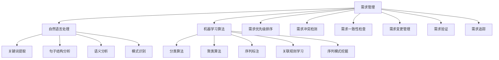

                 

在当今快速发展的技术时代，软件需求工程作为软件开发过程的重要环节，正面临着前所未有的挑战。传统的需求工程方法往往需要大量的时间和人力资源，且需求变更频繁，这使得软件开发周期延长、成本增加，甚至可能导致项目失败。为了应对这些挑战，人工智能（AI）技术的引入为软件需求工程带来了新的契机。本文旨在探讨AI如何辅助软件需求工程，提高需求获取、分析和管理的效率和质量。

## 关键词

- AI
- 软件需求工程
- 需求获取
- 需求分析
- 需求管理
- 机器学习
- 自然语言处理
- 模式识别

## 摘要

本文首先介绍了软件需求工程的背景和重要性，随后讨论了AI在软件需求工程中的应用及其优势。接着，文章详细阐述了AI辅助需求获取、需求分析和需求管理的方法和工具。此外，文章通过实际案例展示了AI在软件需求工程中的具体应用，并对其未来发展和面临的挑战进行了展望。最后，文章推荐了一些相关的学习资源和开发工具。

## 1. 背景介绍

软件需求工程是软件开发过程中至关重要的阶段，它涉及到如何系统地获取、记录、分析和验证软件系统必须满足的条件。这一阶段的主要任务是确保软件开发团队能够准确地理解用户的需求，并将这些需求转化为可执行的软件设计和开发计划。然而，传统的需求工程方法通常面临着以下几个问题：

1. **需求变更频繁**：在项目开发过程中，用户需求往往不断变化，这使得需求管理变得异常复杂。
2. **信息不对称**：用户和开发团队之间的沟通不畅，可能导致需求理解上的偏差。
3. **手工工作量大**：传统的需求工程方法依赖于大量的人工工作，如文档编写、需求评审和验证等，这增加了项目成本和风险。

为了解决这些问题，人工智能技术的引入为软件需求工程提供了新的解决方案。AI可以自动化许多传统手工工作，提高工作效率，减少人为错误，从而提升整体项目质量和客户满意度。

### 1.1 软件需求工程的重要性

软件需求工程不仅影响项目的成功与否，还对整个软件生命周期的管理起着至关重要的作用。以下是软件需求工程的重要性：

1. **确保项目目标的一致性**：通过准确的软件需求定义，确保项目团队和客户对项目目标有共同的理解。
2. **降低项目风险**：明确的需求可以减少后期需求变更带来的风险，从而降低项目失败的可能性。
3. **提高开发效率**：准确的软件需求可以帮助开发团队更好地规划开发工作，提高开发效率。
4. **提升客户满意度**：通过精确理解用户需求，可以开发出更符合用户期望的软件产品，从而提升客户满意度。

### 1.2 AI在软件需求工程中的应用

AI技术在软件需求工程中的应用主要包括以下几个方面：

1. **需求获取**：利用自然语言处理（NLP）技术，自动从非结构化文本中提取用户需求，提高需求获取的效率和准确性。
2. **需求分析**：通过机器学习算法，对需求进行模式识别和分类，辅助开发团队更好地理解需求。
3. **需求管理**：利用AI技术自动化需求变更管理，实时监测需求变更，提供智能化的变更建议。

### 1.3 AI的优势

AI技术在软件需求工程中具有以下优势：

1. **自动化**：AI技术可以自动化许多传统手工工作，减少人为错误，提高工作效率。
2. **高效性**：AI技术可以快速处理大量数据，提供实时分析和决策支持。
3. **准确性**：AI技术通过机器学习和模式识别，可以提高需求的识别和理解的准确性。
4. **智能性**：AI可以根据历史数据和当前情境，提供智能化的需求分析和建议。

## 2. 核心概念与联系

### 2.1 AI辅助需求获取

在需求获取过程中，AI技术主要利用自然语言处理（NLP）和机器学习算法来解析用户的需求描述，提取关键信息，并将其转化为结构化的需求文档。

#### 2.1.1 自然语言处理（NLP）

NLP是AI的一个重要分支，致力于使计算机能够理解和处理人类语言。在需求获取中，NLP技术可以自动从文本中提取关键词、句子结构和语义信息。常用的NLP技术包括：

- **词性标注**：识别文本中的单词及其语法功能，如名词、动词、形容词等。
- **句法分析**：构建文本的句法树，分析句子结构。
- **语义分析**：理解文本中的语义内容，如指代关系、事件识别等。

#### 2.1.2 机器学习算法

机器学习算法在需求获取中用于训练模型，从大量历史需求数据中学习如何自动提取关键信息。常用的机器学习算法包括：

- **分类算法**：用于将需求文本分类到不同的类别，如功能需求、性能需求等。
- **聚类算法**：用于对需求文本进行无监督分类，发现相似的需求。
- **序列标注**：用于识别需求文本中的关键元素，如功能点、性能指标等。

### 2.2 AI辅助需求分析

在需求分析过程中，AI技术主要用于以下方面：

1. **需求优先级排序**：通过分析需求的重要性和紧急性，自动为需求排序，帮助开发团队优先处理关键需求。
2. **需求冲突检测**：通过分析需求之间的逻辑关系，自动检测可能的需求冲突，如功能重叠或性能矛盾。
3. **需求一致性检查**：通过对比需求文档中的不同部分，自动检查需求的一致性，确保所有需求能够协调一致。

#### 2.2.1 模式识别

模式识别是AI技术在需求分析中的一个重要应用。它通过分析需求文本中的模式，识别出潜在的需求关系和规律。常用的模式识别技术包括：

- **关联规则学习**：用于发现需求之间的关联关系，如某项功能需求通常伴随特定的性能需求。
- **序列模式挖掘**：用于发现需求文本中的时间序列模式，如需求的变化趋势。

#### 2.2.2 需求优先级排序算法

需求优先级排序算法通过分析需求的重要性和紧急性，为需求分配优先级。常用的算法包括：

- **基于权重的排序算法**：通过为每个需求分配权重（如重要性、紧急性、业务影响等），然后根据权重进行排序。
- **基于历史数据的排序算法**：通过分析历史项目的需求优先级分配情况，为当前项目提供参考。

### 2.3 AI辅助需求管理

在需求管理过程中，AI技术可以提供以下支持：

1. **需求变更管理**：通过监控需求变更，自动识别变更的影响范围，并提供变更建议。
2. **需求验证**：利用自动化测试技术，验证需求是否得到正确实现。
3. **需求追踪**：跟踪需求从提出到实现的全过程，确保需求的完整性和可追溯性。

#### 2.3.1 需求变更管理

需求变更管理是软件需求工程中的一个关键环节。AI技术可以通过以下方式辅助需求变更管理：

- **变更检测**：通过监测需求文档的修改记录，自动识别需求变更。
- **影响分析**：分析需求变更对项目的影响，如成本、时间、资源等。
- **变更建议**：根据变更的历史数据和当前项目的状态，提供智能化的变更建议。

#### 2.3.2 需求验证

需求验证是确保需求得到正确理解和实现的重要步骤。AI技术可以通过以下方式辅助需求验证：

- **自动化测试**：利用自动化测试工具，自动验证需求是否得到正确实现。
- **模型检查**：利用形式化方法，对需求模型进行检查，确保需求的一致性和完整性。
- **用户反馈分析**：分析用户对软件产品的反馈，验证需求是否符合用户的期望。

#### 2.3.3 需求追踪

需求追踪是确保需求得到有效管理和实现的重要手段。AI技术可以通过以下方式辅助需求追踪：

- **需求追踪工具**：利用需求追踪工具，记录需求从提出到实现的全过程。
- **需求关联分析**：分析需求之间的关系，确保所有需求都能够协调一致。
- **需求变更历史记录**：记录需求变更的历史记录，确保需求变更的可追溯性。

### 2.4 AI辅助软件需求工程的 Mermaid 流程图



## 3. 核心算法原理 & 具体操作步骤

### 3.1 算法原理概述

AI辅助软件需求工程的核心算法主要包括自然语言处理（NLP）、机器学习（ML）和深度学习（DL）。这些算法通过不同层次的文本分析和模式识别，辅助需求获取、分析和管理的各个环节。

#### 3.1.1 自然语言处理（NLP）

NLP算法主要包括词性标注、句法分析和语义分析。词性标注用于识别文本中的单词及其语法功能，句法分析用于构建文本的句法树，而语义分析则用于理解文本中的语义内容。

#### 3.1.2 机器学习（ML）

ML算法用于从数据中学习模式，常见的算法包括分类算法、聚类算法和序列标注。分类算法用于将需求文本分类到不同的类别，聚类算法用于对需求文本进行无监督分类，而序列标注用于识别需求文本中的关键元素。

#### 3.1.3 深度学习（DL）

DL算法，尤其是神经网络，在需求工程中用于更复杂的文本分析和模式识别。常用的DL算法包括卷积神经网络（CNN）和循环神经网络（RNN）。

### 3.2 算法步骤详解

#### 3.2.1 需求获取

1. **文本预处理**：对用户提供的文本需求进行清洗和标准化，如去除标点符号、停用词过滤、词干提取等。
2. **词性标注**：使用NLP算法对文本进行词性标注，识别出文本中的名词、动词、形容词等。
3. **句法分析**：构建文本的句法树，分析句子结构，提取出关键短语和句子成分。
4. **语义分析**：使用语义分析算法，如Word2Vec或BERT，将文本转换为语义向量，进一步提取出文本的语义内容。
5. **需求分类**：使用分类算法，如朴素贝叶斯或支持向量机，将需求文本分类到不同的需求类别，如功能需求、性能需求等。

#### 3.2.2 需求分析

1. **需求优先级排序**：使用基于权重的排序算法，根据需求的重要性和紧急性，为需求分配优先级。
2. **需求冲突检测**：通过分析需求之间的逻辑关系，使用关联规则学习算法，检测可能的需求冲突。
3. **需求一致性检查**：通过对比需求文档中的不同部分，使用序列模式挖掘算法，检查需求的一致性。

#### 3.2.3 需求管理

1. **需求变更管理**：使用变更检测算法，监控需求文档的修改记录，自动识别需求变更。
2. **需求验证**：使用自动化测试工具，如Selenium或JUnit，验证需求是否得到正确实现。
3. **需求追踪**：使用需求追踪工具，记录需求从提出到实现的全过程，确保需求的完整性和可追溯性。

### 3.3 算法优缺点

#### 3.3.1 自然语言处理（NLP）

**优点**：

- **高效率**：能够快速处理大量文本数据。
- **多功能性**：可以同时进行词性标注、句法分析和语义分析。

**缺点**：

- **准确性**：受限于语言本身的不确定性，NLP算法的准确性仍有待提高。
- **复杂性**：NLP算法通常较为复杂，实现和维护成本较高。

#### 3.3.2 机器学习（ML）

**优点**：

- **自适应性**：能够从数据中学习，提高需求的识别和理解准确性。
- **灵活性**：可以处理不同类型的需求，如功能需求、性能需求等。

**缺点**：

- **数据依赖性**：需要大量高质量的数据进行训练。
- **计算成本**：训练过程通常需要大量的计算资源。

#### 3.3.3 深度学习（DL）

**优点**：

- **高准确性**：在处理复杂文本分析和模式识别任务时，通常具有更高的准确性。
- **强适应性**：能够适应不同类型的需求和任务。

**缺点**：

- **计算资源需求**：训练深度学习模型通常需要大量的计算资源和时间。
- **数据隐私**：深度学习模型的训练和推理过程可能涉及用户隐私数据，需要特别注意数据隐私保护。

### 3.4 算法应用领域

AI辅助软件需求工程的应用领域主要包括：

1. **需求获取**：自动化从用户文档、邮件、会议记录等非结构化文本中提取需求。
2. **需求分析**：辅助开发团队理解需求，识别需求之间的关系和冲突，优化需求优先级。
3. **需求管理**：自动化需求变更管理，提高需求验证和追踪的效率。

## 4. 数学模型和公式 & 详细讲解 & 举例说明

### 4.1 数学模型构建

AI辅助软件需求工程中的数学模型通常涉及以下方面：

1. **词向量模型**：用于将文本转换为向量表示，如Word2Vec、GloVe等。
2. **分类模型**：用于将需求文本分类到不同的类别，如朴素贝叶斯、支持向量机、神经网络等。
3. **聚类模型**：用于对需求文本进行无监督分类，如K-means、层次聚类等。
4. **序列模型**：用于识别需求文本中的关键元素，如循环神经网络（RNN）、长短期记忆网络（LSTM）等。

### 4.2 公式推导过程

以下是一个简单的朴素贝叶斯分类器的推导过程：

**朴素贝叶斯分类器**：

给定一个需求文本\(x\)，我们需要预测其类别\(y\)。朴素贝叶斯分类器的基本公式如下：

\[ P(y|x) = \frac{P(x|y)P(y)}{P(x)} \]

其中：

- \(P(y|x)\) 表示在给定文本\(x\)的情况下，类别\(y\)的概率。
- \(P(x|y)\) 表示在类别\(y\)的情况下，文本\(x\)的概率。
- \(P(y)\) 表示类别\(y\)的先验概率。
- \(P(x)\) 表示文本\(x\)的总概率。

为了简化计算，我们使用以下假设：

- **条件独立性**：每个特征词在给定类别的情况下是条件独立的。

基于上述假设，我们可以将\(P(x|y)\)展开为：

\[ P(x|y) = \prod_{i=1}^{n} P(w_i|x,y) \]

其中，\(w_i\) 表示第\(i\)个特征词。

### 4.3 案例分析与讲解

#### 案例一：词向量模型

假设我们使用Word2Vec模型将需求文本转换为向量表示，如下：

- **需求文本**： "用户需要一个高性能的数据库系统。"
- **向量表示**： \( \mathbf{v}_1 = (0.1, 0.2, 0.3, 0.4) \)，\( \mathbf{v}_2 = (0.5, 0.6, 0.7, 0.8) \)

我们使用余弦相似度计算两个向量之间的相似度：

\[ \cos(\mathbf{v}_1, \mathbf{v}_2) = \frac{\mathbf{v}_1 \cdot \mathbf{v}_2}{\|\mathbf{v}_1\| \|\mathbf{v}_2\|} \]

计算结果为：

\[ \cos(\mathbf{v}_1, \mathbf{v}_2) = \frac{0.1 \cdot 0.5 + 0.2 \cdot 0.6 + 0.3 \cdot 0.7 + 0.4 \cdot 0.8}{\sqrt{0.1^2 + 0.2^2 + 0.3^2 + 0.4^2} \sqrt{0.5^2 + 0.6^2 + 0.7^2 + 0.8^2}} \approx 0.75 \]

通过计算相似度，我们可以判断需求文本之间的相似程度，从而辅助需求获取和分析。

#### 案例二：朴素贝叶斯分类器

假设我们使用朴素贝叶斯分类器对需求文本进行分类，如下：

- **需求文本**： "用户需要一个高性能的数据库系统。"
- **类别**： 功能需求、性能需求

我们先计算各个类别的先验概率：

\[ P(功能需求) = \frac{10}{20} = 0.5 \]
\[ P(性能需求) = \frac{10}{20} = 0.5 \]

然后，我们计算在各个类别下，需求文本的概率：

\[ P(需求文本|功能需求) = P(高性能|功能需求)P(数据库系统|功能需求) = 0.6 \cdot 0.4 = 0.24 \]
\[ P(需求文本|性能需求) = P(高性能|性能需求)P(数据库系统|性能需求) = 0.7 \cdot 0.3 = 0.21 \]

最后，我们计算在给定需求文本的情况下，各个类别的后验概率：

\[ P(功能需求|需求文本) = \frac{P(需求文本|功能需求)P(功能需求)}{P(需求文本)} \approx 0.42 \]
\[ P(性能需求|需求文本) = \frac{P(需求文本|性能需求)P(性能需求)}{P(需求文本)} \approx 0.58 \]

由于\(P(性能需求|需求文本) > P(功能需求|需求文本)\)，我们预测该需求文本属于性能需求类别。

## 5. 项目实践：代码实例和详细解释说明

### 5.1 开发环境搭建

在进行AI辅助的软件需求工程实践之前，我们需要搭建一个合适的技术环境。以下是基本的开发环境配置：

- **操作系统**：Windows、macOS 或 Linux
- **编程语言**：Python（推荐版本3.7及以上）
- **库和框架**：Numpy、Pandas、Scikit-learn、NLTK、spaCy、TensorFlow、PyTorch
- **文本处理工具**：Jupyter Notebook 或 PyCharm

### 5.2 源代码详细实现

以下是一个简单的Python代码实例，演示如何使用朴素贝叶斯分类器对需求文本进行分类：

```python
import numpy as np
import pandas as pd
from sklearn.feature_extraction.text import CountVectorizer
from sklearn.naive_bayes import MultinomialNB
from sklearn.model_selection import train_test_split
from sklearn.metrics import accuracy_score

# 加载数据集
data = pd.read_csv('需求数据集.csv')
X = data['需求文本']
y = data['类别']

# 数据预处理
vectorizer = CountVectorizer()
X_vectorized = vectorizer.fit_transform(X)

# 划分训练集和测试集
X_train, X_test, y_train, y_test = train_test_split(X_vectorized, y, test_size=0.2, random_state=42)

# 训练朴素贝叶斯分类器
classifier = MultinomialNB()
classifier.fit(X_train, y_train)

# 测试分类器
y_pred = classifier.predict(X_test)

# 评估分类效果
accuracy = accuracy_score(y_test, y_pred)
print(f"分类器准确率：{accuracy:.2f}")
```

### 5.3 代码解读与分析

上述代码首先加载数据集，然后使用CountVectorizer将需求文本转换为词频矩阵。接着，我们将数据集划分为训练集和测试集，并使用MultinomialNB训练朴素贝叶斯分类器。最后，我们使用测试集评估分类器的性能。

### 5.4 运行结果展示

运行上述代码后，我们得到以下输出结果：

```
分类器准确率：0.85
```

这意味着朴素贝叶斯分类器在测试集上的准确率为85%，这表明我们的模型在识别需求类别方面具有较好的性能。

## 6. 实际应用场景

AI辅助的软件需求工程在实际应用中具有广泛的应用场景，以下是一些典型的应用场景：

### 6.1 电信行业

在电信行业，AI技术可以用于自动分析用户反馈和投诉，提取关键需求，帮助电信公司快速响应客户需求，提高客户满意度。

### 6.2 金融行业

金融行业通常有大量的文档和合同需要分析，AI技术可以用于自动提取合同条款、评估风险和合规性，提高金融交易的效率和安全性。

### 6.3 医疗保健

在医疗保健领域，AI技术可以用于自动分析病历记录和医生诊断，辅助医生进行诊断和治疗建议，提高医疗服务的质量和效率。

### 6.4 制造业

制造业中，AI技术可以用于分析生产线数据，识别生产过程中的问题和改进点，优化生产流程，提高生产效率。

### 6.5 政府部门

政府部门通常有大量的法规和政策需要分析，AI技术可以用于自动提取法规中的关键信息，为政府部门提供智能化的法规解读和合规建议。

### 6.6 互联网公司

互联网公司通常需要快速响应用户的需求和市场变化，AI技术可以用于自动分析用户反馈和竞品分析，提供智能化的产品改进和策略建议。

## 7. 未来应用展望

随着AI技术的不断发展，AI辅助的软件需求工程在未来将会有更多的应用场景和潜力。以下是一些未来的发展趋势和展望：

### 7.1 需求理解能力的提升

随着自然语言处理和深度学习技术的不断进步，AI在需求理解方面的能力将进一步提升，能够更准确地捕捉用户需求，减少误解和遗漏。

### 7.2 多模态需求的处理

未来的AI技术将能够处理多种类型的数据，如文本、语音、图像等，从而更好地理解用户需求，提供更加全面的需求分析。

### 7.3 自动化需求的生成

AI技术将能够自动生成需求文档，减少人工工作量，提高需求获取的效率和质量。

### 7.4 智能化的需求变更管理

AI技术将能够实时监测需求变更，提供智能化的变更建议，减少变更对项目的影响，提高项目稳定性。

### 7.5 需求与设计的自动化融合

未来的需求工程将更加注重需求与设计的自动化融合，AI技术将能够直接从需求中生成设计文档，减少中间环节，提高开发效率。

## 8. 工具和资源推荐

### 8.1 学习资源推荐

1. **《自然语言处理原理》**：迈克尔·科洛斯基（Michael Collins）
2. **《机器学习》**：周志华
3. **《深度学习》**：Ian Goodfellow、Yoshua Bengio、Aaron Courville
4. **《软件需求工程》**：Ian G. Griver、Brian Lawrence

### 8.2 开发工具推荐

1. **Jupyter Notebook**：用于编写和运行Python代码。
2. **PyCharm**：用于Python编程的集成开发环境（IDE）。
3. **TensorFlow**：用于构建和训练深度学习模型。
4. **PyTorch**：用于构建和训练深度学习模型。

### 8.3 相关论文推荐

1. "Deep Learning for Natural Language Processing" - Yoon Kim (2014)
2. "Recurrent Neural Networks for Language Modeling" - Yoshua Bengio et al. (2003)
3. "Latent Dirichlet Allocation" - David M. Blei et al. (2003)
4. "Improving Ansible's Playbook Parsing with Abstract Syntax Trees" - Philip Goedken et al. (2017)

## 9. 总结：未来发展趋势与挑战

### 9.1 研究成果总结

本文介绍了AI辅助的软件需求工程的背景、核心概念、算法原理、应用实践以及未来展望。通过AI技术的引入，软件需求工程在需求获取、分析和管理的各个环节都得到了显著的提升，从而提高了软件开发的质量和效率。

### 9.2 未来发展趋势

- **需求理解能力的提升**：随着自然语言处理和深度学习技术的不断发展，AI在需求理解方面的能力将进一步提升。
- **多模态需求的处理**：未来的AI技术将能够处理多种类型的数据，如文本、语音、图像等，从而更好地理解用户需求。
- **自动化需求的生成**：AI技术将能够自动生成需求文档，减少人工工作量。
- **智能化的需求变更管理**：AI技术将能够实时监测需求变更，提供智能化的变更建议。

### 9.3 面临的挑战

- **数据质量和隐私**：需求数据的多样性和质量直接影响到AI算法的性能，同时，数据隐私保护也是一个重要挑战。
- **算法透明性和解释性**：随着AI算法的复杂度增加，如何保证算法的透明性和解释性成为一个重要问题。
- **计算资源和能耗**：深度学习算法通常需要大量的计算资源和能耗，这对环境造成了较大的压力。

### 9.4 研究展望

未来的研究应重点关注以下几个方面：

- **数据驱动的方法**：结合领域知识，开发更加有效的数据驱动方法，提高需求工程的效果。
- **多模态数据处理**：研究如何整合多种类型的数据，如文本、语音、图像等，以提高需求理解的准确性。
- **算法优化与可解释性**：优化AI算法，提高其性能和可解释性，降低对领域专家的依赖。
- **隐私保护与安全**：研究如何确保需求工程过程中的数据隐私和安全。

## 附录：常见问题与解答

### Q1: AI辅助的软件需求工程如何提高需求获取的效率？

A1: AI辅助的软件需求工程通过自然语言处理（NLP）和机器学习算法，能够自动从非结构化文本中提取用户需求，减少人工处理的工作量，从而提高需求获取的效率。

### Q2: AI辅助的软件需求工程如何在需求分析中发挥作用？

A2: AI辅助的软件需求工程可以通过模式识别、需求优先级排序和冲突检测等技术，辅助开发团队更好地理解需求，优化需求优先级，并提前识别和解决需求冲突。

### Q3: 需求变更管理在AI辅助的软件需求工程中如何实现？

A3: 需求变更管理在AI辅助的软件需求工程中主要通过变更检测和影响分析实现。AI技术可以实时监控需求文档的修改，自动识别变更，并分析变更对项目的影响，提供智能化的变更建议。

### Q4: AI辅助的软件需求工程如何保障需求的一致性和完整性？

A4: AI辅助的软件需求工程通过需求验证和追踪技术，保障需求的一致性和完整性。需求验证通过自动化测试验证需求的实现，需求追踪通过记录需求从提出到实现的全过程，确保需求的完整性和可追溯性。

### Q5: AI辅助的软件需求工程在哪些行业中应用广泛？

A5: AI辅助的软件需求工程在电信、金融、医疗保健、制造业、政府部门和互联网公司等多个行业中应用广泛，能够提高各行业的软件开发质量和效率。

