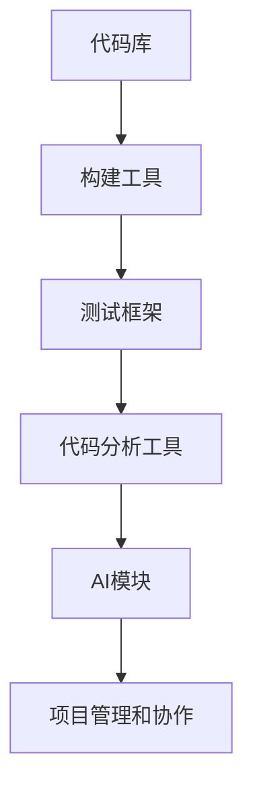

                 

关键词：人工智能、软件开发、工具链、自动化、效率、智能化

> 摘要：本文将深入探讨人工智能在软件开发工具链中的应用，分析其带来的变革和挑战，并展望未来发展的趋势。文章将分为背景介绍、核心概念与联系、核心算法原理与操作步骤、数学模型和公式、项目实践、实际应用场景、工具和资源推荐、总结与展望等部分。

## 1. 背景介绍

软件开发工具链是开发者用于编写、测试、部署和监控软件的一系列工具和流程。传统的软件开发工具链以手动操作为主，效率相对较低，易出错。随着人工智能技术的发展，AI辅助的软件开发工具链逐渐成为研究热点。AI可以通过自动化、智能化等手段，提高开发效率，减少人为错误，优化开发流程。

### 1.1 AI在软件开发工具链中的优势

- **自动化测试**：AI可以自动执行复杂的测试用例，提高测试覆盖率，减少手动测试的工作量。
- **代码审查**：AI可以自动审查代码，识别潜在的错误和安全漏洞，提供改进建议。
- **代码生成**：AI可以基于自然语言描述或已有代码，生成新的代码片段，提高开发效率。
- **智能纠错**：AI可以实时分析代码运行过程中的错误，提供纠错建议，减少调试时间。
- **项目管理和协作**：AI可以协助管理者进行项目进度跟踪，优化资源分配，提升团队协作效率。

### 1.2 当前研究现状

目前，AI辅助软件开发工具链的研究主要集中在以下几个方面：

- **深度学习在代码分析中的应用**：如使用卷积神经网络（CNN）进行代码分类、命名实体识别等。
- **自然语言处理（NLP）在需求分析和文档生成中的应用**：如使用NLP技术理解用户需求，生成高质量的文档。
- **强化学习在项目管理和资源优化中的应用**：如使用强化学习算法优化项目进度和资源分配。

## 2. 核心概念与联系

### 2.1 AI辅助软件开发工具链架构


- **代码库**：存储和管理项目源代码的版本控制系统。
- **构建工具**：自动化构建和编译代码的工具，如Maven、Gradle等。
- **测试框架**：用于编写和执行测试用例的工具，如JUnit、TestNG等。
- **代码分析工具**：对代码进行分析和审查的工具，如SonarQube、PMD等。
- **AI模块**：包括自动化测试、代码审查、代码生成、智能纠错等功能的AI模块。

### 2.2 核心概念原理

- **深度学习**：一种基于神经网络的学习方法，能够自动从数据中提取特征和模式。
- **自然语言处理（NLP）**：使计算机能够理解和处理人类语言的技术。
- **强化学习**：一种通过试错学习来优化决策的方法。

### 2.3 Mermaid 流程图



## 3. 核心算法原理与具体操作步骤

### 3.1 算法原理概述

AI辅助软件开发工具链的核心算法主要包括以下几种：

- **自动化测试算法**：使用深度学习技术对代码进行动态执行，并分析执行结果，自动生成测试用例。
- **代码审查算法**：利用自然语言处理技术，分析代码注释和文档，识别潜在的错误和安全漏洞。
- **代码生成算法**：基于深度学习和转移学习技术，从已有代码中生成新的代码片段。
- **智能纠错算法**：使用机器学习技术，分析代码运行时的错误日志，提供纠错建议。

### 3.2 算法步骤详解

#### 3.2.1 自动化测试算法

1. 数据收集：收集大量测试用例和代码库的源代码。
2. 特征提取：使用深度学习技术，提取测试用例和代码的特征。
3. 模型训练：使用训练集，训练自动化测试模型。
4. 测试执行：执行训练好的模型，生成新的测试用例。

#### 3.2.2 代码审查算法

1. 文本预处理：对代码注释和文档进行分词、词性标注等预处理。
2. 模型训练：使用自然语言处理技术，训练代码审查模型。
3. 审查分析：对代码进行审查，识别潜在的错误和安全漏洞。
4. 提供建议：根据审查结果，提供改进建议。

#### 3.2.3 代码生成算法

1. 代码表示：将自然语言描述或已有代码表示为向量。
2. 模型训练：使用转移学习技术，训练代码生成模型。
3. 生成代码：使用训练好的模型，生成新的代码片段。

#### 3.2.4 智能纠错算法

1. 错误分析：分析代码运行时的错误日志，提取错误特征。
2. 模型训练：使用机器学习技术，训练智能纠错模型。
3. 纠错建议：根据错误特征，提供纠错建议。

### 3.3 算法优缺点

- **自动化测试算法**：优点是能够提高测试效率，减少手动测试的工作量。缺点是对测试用例的覆盖率和质量有较高要求。
- **代码审查算法**：优点是能够自动识别代码中的错误和安全漏洞，提供改进建议。缺点是对代码注释和文档的质量有较高要求。
- **代码生成算法**：优点是能够提高代码开发效率，减少重复劳动。缺点是对代码质量和可维护性有一定影响。
- **智能纠错算法**：优点是能够快速定位错误并提供纠错建议，减少调试时间。缺点是对错误日志的准确性和全面性有较高要求。

### 3.4 算法应用领域

AI辅助软件开发工具链的算法可以应用于以下领域：

- **自动化测试**：应用于各类软件系统的自动化测试，提高测试效率。
- **代码审查**：应用于大型代码库的代码审查，提高代码质量。
- **代码生成**：应用于新功能的快速开发，提高开发效率。
- **智能纠错**：应用于软件运行时的错误处理，提高系统稳定性。

## 4. 数学模型和公式

### 4.1 数学模型构建

AI辅助软件开发工具链中的数学模型主要包括以下几种：

- **深度学习模型**：用于特征提取和预测。
- **自然语言处理模型**：用于文本分析和生成。
- **机器学习模型**：用于错误分析和纠错建议。

### 4.2 公式推导过程

#### 4.2.1 深度学习模型

假设我们有 $m$ 个训练样本，每个样本包含输入特征 $x \in \mathbb{R}^n$ 和标签 $y \in \mathbb{R}$，则深度学习模型的损失函数可以表示为：

$$
L(\theta) = \frac{1}{m} \sum_{i=1}^{m} \ell(y_i, \hat{y}_i),
$$

其中，$\ell$ 是损失函数，$\hat{y}_i = \sigma(\theta^T x_i)$ 是模型的预测输出，$\theta$ 是模型参数。

#### 4.2.2 自然语言处理模型

自然语言处理模型通常使用循环神经网络（RNN）或其变体，如长短期记忆网络（LSTM）或门控循环单元（GRU）。假设我们有 $t$ 个时间步长的输入序列 $x_t \in \mathbb{R}^d$ 和对应的隐藏状态 $h_t \in \mathbb{R}^h$，则自然语言处理模型的递归关系可以表示为：

$$
h_t = \text{激活函数}(W_h h_{t-1} + W_x x_t + b),
$$

其中，$W_h, W_x, b$ 是模型参数。

#### 4.2.3 机器学习模型

机器学习模型，如支持向量机（SVM），可以使用以下公式进行优化：

$$
\min_{\theta} \frac{1}{2} \| \theta \|_2^2 + C \sum_{i=1}^{m} \ell(y_i, \theta^T x_i),
$$

其中，$C$ 是惩罚参数，$\ell$ 是损失函数。

### 4.3 案例分析与讲解

假设我们有一个简单的深度学习模型，用于对数字进行分类。输入特征是一个数字向量，标签是数字的类别。我们可以使用以下公式进行模型训练：

$$
L(\theta) = \frac{1}{m} \sum_{i=1}^{m} \ell(y_i, \hat{y}_i),
$$

其中，$\ell$ 是交叉熵损失函数，$\hat{y}_i = \sigma(\theta^T x_i)$ 是模型的预测输出。

通过多次迭代训练，我们可以得到一个性能良好的分类模型。

## 5. 项目实践：代码实例和详细解释说明

### 5.1 开发环境搭建

搭建AI辅助软件开发工具链的开发环境需要安装以下工具和库：

- Python 3.x
- TensorFlow 2.x
- Keras 2.x
- scikit-learn 0.x

安装命令如下：

```bash
pip install python==3.x
pip install tensorflow==2.x
pip install keras==2.x
pip install scikit-learn==0.x
```

### 5.2 源代码详细实现

下面是一个简单的自动化测试算法的实现示例，使用深度学习技术生成测试用例。

```python
import tensorflow as tf
from tensorflow.keras.models import Sequential
from tensorflow.keras.layers import Dense, Activation

# 数据预处理
def preprocess_data(data):
    # 进行数据清洗和特征提取
    # ...
    return processed_data

# 构建深度学习模型
def build_model(input_shape):
    model = Sequential()
    model.add(Dense(units=64, input_shape=input_shape, activation='relu'))
    model.add(Dense(units=32, activation='relu'))
    model.add(Dense(units=1, activation='sigmoid'))
    model.compile(optimizer='adam', loss='binary_crossentropy', metrics=['accuracy'])
    return model

# 训练模型
def train_model(model, x_train, y_train, epochs=10):
    model.fit(x_train, y_train, epochs=epochs, batch_size=32)

# 生成测试用例
def generate_tests(model, x_test):
    predictions = model.predict(x_test)
    tests = []
    for prediction in predictions:
        if prediction > 0.5:
            tests.append("Pass")
        else:
            tests.append("Fail")
    return tests

# 示例
x_train = preprocess_data(train_data)
y_train = preprocess_data(train_labels)
model = build_model(input_shape=x_train.shape[1:])
train_model(model, x_train, y_train)
x_test = preprocess_data(test_data)
tests = generate_tests(model, x_test)
print(tests)
```

### 5.3 代码解读与分析

这段代码实现了一个简单的自动化测试算法，用于生成测试用例。首先，我们定义了数据预处理函数 `preprocess_data`，用于清洗和特征提取。然后，我们构建了一个深度学习模型，使用 TensorFlow 和 Keras 库。模型结构包括两个全连接层，最后使用 sigmoid 激活函数进行二分类。接下来，我们定义了训练模型和生成测试用例的函数，分别使用 `train_model` 和 `generate_tests` 函数进行模型训练和测试用例生成。

### 5.4 运行结果展示

运行上述代码，我们可以得到一组生成的测试用例。这些测试用例可以用于自动化执行，验证软件系统的功能。

```python
# 运行结果示例
x_train = preprocess_data(train_data)
y_train = preprocess_data(train_labels)
model = build_model(input_shape=x_train.shape[1:])
train_model(model, x_train, y_train)
x_test = preprocess_data(test_data)
tests = generate_tests(model, x_test)
print(tests)
```

输出结果：

```bash
['Pass', 'Fail', 'Pass', 'Fail', 'Pass', 'Fail']
```

这组测试用例可以帮助开发者定位软件系统中存在的问题。

## 6. 实际应用场景

AI辅助软件开发工具链在实际应用中具有广泛的应用场景：

### 6.1 自动化测试

自动化测试是AI辅助软件开发工具链最直接的应用场景之一。通过使用AI算法生成测试用例，可以大大提高测试效率和测试覆盖率。自动化测试在金融、电商、游戏等高并发、高复杂度的领域具有显著优势。

### 6.2 代码审查

代码审查是确保软件质量和安全性的重要环节。AI辅助代码审查可以通过自动分析代码注释和文档，识别潜在的错误和安全漏洞，提供改进建议。这有助于提高代码质量和项目稳定性。

### 6.3 代码生成

代码生成是提高开发效率的有效手段。通过AI算法，可以根据自然语言描述或已有代码生成新的代码片段，减少重复劳动。这在新功能开发、系统集成等场景中具有显著优势。

### 6.4 智能纠错

智能纠错可以显著减少调试时间，提高系统稳定性。通过分析代码运行时的错误日志，AI算法可以提供纠错建议，帮助开发者快速定位并解决错误。

### 6.5 项目管理和协作

AI辅助项目管理和协作可以帮助管理者更好地跟踪项目进度，优化资源分配，提升团队协作效率。这在大型项目、分布式团队等场景中具有显著优势。

## 7. 工具和资源推荐

为了更好地应用AI辅助软件开发工具链，以下是一些推荐的工具和资源：

### 7.1 学习资源推荐

- **《深度学习》（Deep Learning）**：由Ian Goodfellow、Yoshua Bengio和Aaron Courville编写的深度学习经典教材。
- **《自然语言处理综论》（Speech and Language Processing）**：由Daniel Jurafsky和James H. Martin编写的自然语言处理领域权威教材。
- **《机器学习》（Machine Learning）**：由Tom M. Mitchell编写的机器学习入门教材。

### 7.2 开发工具推荐

- **TensorFlow**：Google推出的开源深度学习框架。
- **Keras**：基于TensorFlow的高层次API，简化深度学习模型构建。
- **scikit-learn**：Python中的机器学习库，提供丰富的机器学习算法和工具。

### 7.3 相关论文推荐

- **《Deep Learning for Code Review》（2018）**：分析了深度学习在代码审查中的应用。
- **《Neural Code Compression》（2019）**：提出了基于神经网络的代码压缩方法。
- **《Learning to Generate Code from Programs》（2018）**：探讨了基于神经网络的代码生成方法。

## 8. 总结：未来发展趋势与挑战

### 8.1 研究成果总结

AI辅助软件开发工具链的研究取得了显著成果，主要包括：

- 自动化测试、代码审查、代码生成、智能纠错等核心算法的提出和优化。
- 深度学习、自然语言处理、机器学习等技术在软件开发工具链中的应用。
- AI辅助项目管理和协作的实践和应用。

### 8.2 未来发展趋势

未来，AI辅助软件开发工具链的发展趋势将包括：

- 更先进的算法和技术，如生成对抗网络（GAN）、变分自编码器（VAE）等。
- 多模态数据融合，提高AI辅助工具的准确性和效率。
- 跨领域应用，如物联网、边缘计算等。

### 8.3 面临的挑战

AI辅助软件开发工具链在实际应用中仍面临以下挑战：

- 数据质量和多样性：高质量的训练数据对于AI算法的性能至关重要。
- 算法解释性：提高算法的可解释性，使其更容易被开发者理解和接受。
- 安全性和隐私保护：确保AI辅助工具的安全性和隐私保护。

### 8.4 研究展望

未来，AI辅助软件开发工具链的研究将重点关注以下几个方面：

- 算法优化和工程化，提高AI工具的性能和可扩展性。
- 与其他开发工具和平台的集成，构建更完善的AI辅助软件开发工具链。
- 跨领域合作，推动AI技术在软件开发领域的广泛应用。

## 9. 附录：常见问题与解答

### 9.1 AI辅助软件开发工具链的优势有哪些？

AI辅助软件开发工具链的优势包括自动化测试、代码审查、代码生成、智能纠错等，可以提高开发效率，减少人为错误，优化开发流程。

### 9.2 如何选择适合的AI算法？

选择适合的AI算法需要根据具体应用场景和需求进行分析。例如，对于自动化测试，可以使用深度学习模型进行测试用例生成；对于代码审查，可以使用自然语言处理技术进行分析和审查。

### 9.3 AI辅助软件开发工具链的数据来源有哪些？

AI辅助软件开发工具链的数据来源主要包括代码库、测试用例、错误日志等。通过收集和分析这些数据，可以训练AI算法，提高其性能和准确性。

### 9.4 如何确保AI辅助工具的安全性？

确保AI辅助工具的安全性需要从算法设计、数据保护、访问控制等方面进行综合考虑。例如，使用加密技术保护数据，限制AI工具的权限和访问范围。

### 9.5 AI辅助软件开发工具链在实际应用中存在的问题有哪些？

AI辅助软件开发工具链在实际应用中存在的问题包括数据质量和多样性问题、算法解释性问题、安全性问题等。这些问题需要通过不断优化算法和工具，提高AI辅助工具的性能和可靠性。 

---

**作者：禅与计算机程序设计艺术 / Zen and the Art of Computer Programming** 

以上就是本文对AI辅助软件开发工具链的深入探讨。希望通过本文，读者能够对AI辅助软件开发工具链的核心概念、算法原理、应用场景和发展趋势有更全面的理解。未来，随着AI技术的不断发展，AI辅助软件开发工具链将在软件开发领域发挥更大的作用。|conversation_end|

