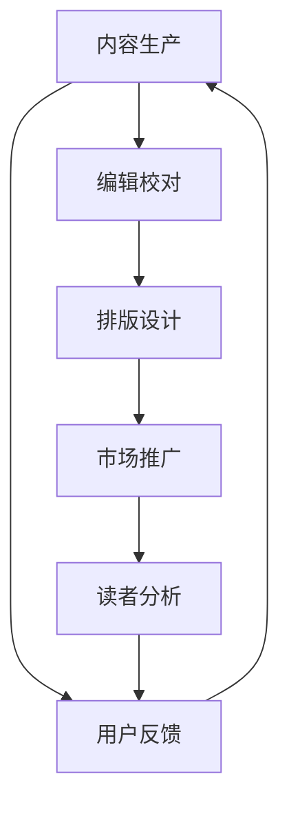

                 

关键词：人工智能、出版业、市值、创新、机会、技术、市场、算法、数学模型、应用场景、未来展望、工具资源、挑战

> 摘要：本文深入探讨了人工智能在出版业中的应用，揭示了其带来的巨大市场机遇。通过分析AI的核心概念、算法原理、数学模型以及具体应用实例，本文旨在为读者展示AI如何改变传统出版模式，推动行业创新，创造新的商业价值。

## 1. 背景介绍

出版业作为知识传播的重要载体，历经几个世纪的演变，始终保持着其核心地位。然而，随着互联网和数字技术的发展，传统出版业正面临前所未有的变革。一方面，数字出版逐渐成为主流，纸质媒体的市场份额不断缩减；另一方面，读者对个性化、即时性、互动性的内容需求日益增长。

在这个背景下，人工智能（AI）作为一种颠覆性技术，正逐渐渗透到出版业的各个领域。从内容生产、编辑校对、排版设计到市场推广、读者分析，AI技术的应用不仅提高了出版效率，还大大增强了用户体验。

据市场研究公司预测，AI在出版业的应用市场将增长至2亿市值，这一趋势不仅反映了技术革新的力量，更凸显了出版业面对的未来机遇和挑战。

## 2. 核心概念与联系

在探讨AI如何革新出版业之前，有必要先了解一些核心概念和原理。以下是一个简化的Mermaid流程图，展示了AI在出版业中的应用架构：



### 2.1 内容生产

AI在内容生产方面的应用主要体现在自动化写作和内容生成。通过自然语言处理（NLP）技术，AI可以快速生成文章、报告、摘要等。此外，生成对抗网络（GAN）等技术可以生成逼真的图片和视频，为出版业提供更多样化的内容形式。

### 2.2 编辑校对

AI的编辑校对功能通过语法分析、语义理解等技术，帮助编辑和校对人员提高工作效率。AI可以自动识别错误、提供修改建议，甚至根据上下文进行内容的二次创作。

### 2.3 排版设计

AI在排版设计方面的应用主要体现在自动排版和优化布局。通过机器学习算法，AI可以分析大量排版数据，为设计师提供个性化的排版建议，提高排版效率和质量。

### 2.4 市场推广

AI的市场推广功能通过数据分析和算法推荐，帮助出版商精准定位目标读者，优化推广策略。例如，AI可以根据读者的历史行为和兴趣偏好，推荐相关书籍和文章，提高内容曝光率和转化率。

### 2.5 读者分析

AI的读者分析功能通过收集和分析读者行为数据，为出版商提供深入的读者画像和需求分析。这有助于出版商更好地了解读者需求，制定个性化的内容策略。

## 3. 核心算法原理 & 具体操作步骤

### 3.1 算法原理概述

AI在出版业中的应用主要依赖于以下几种核心算法：

- **自然语言处理（NLP）**：用于文本分析、内容生成、编辑校对等。
- **深度学习**：用于图像识别、内容生成、用户分析等。
- **推荐系统**：用于市场推广、读者分析等。

### 3.2 算法步骤详解

#### 3.2.1 自然语言处理（NLP）

1. **文本预处理**：包括分词、去停用词、词干提取等。
2. **词向量表示**：将文本转换为向量表示，便于后续处理。
3. **文本分类与情感分析**：根据词向量表示，进行分类和情感分析。
4. **内容生成与编辑校对**：利用生成模型和编辑模型，自动生成或修改文本。

#### 3.2.2 深度学习

1. **卷积神经网络（CNN）**：用于图像识别。
2. **生成对抗网络（GAN）**：用于内容生成。
3. **递归神经网络（RNN）**：用于序列数据建模。
4. **长短期记忆网络（LSTM）**：用于长期依赖关系建模。

#### 3.2.3 推荐系统

1. **协同过滤**：基于用户历史行为，推荐相似用户喜欢的物品。
2. **基于内容的推荐**：基于物品的属性和用户兴趣，推荐相关物品。
3. **混合推荐**：结合协同过滤和基于内容的推荐，提高推荐效果。

### 3.3 算法优缺点

#### 优点

- **效率高**：AI算法可以快速处理大量数据，提高工作效率。
- **个性化**：AI可以根据用户需求，提供个性化的内容推荐。
- **精准**：AI算法可以精准分析读者行为，提高市场推广效果。

#### 缺点

- **成本高**：AI算法的开发和部署成本较高。
- **依赖数据**：AI算法的效果依赖于数据质量和数量。
- **隐私问题**：AI算法可能会涉及用户隐私，引发隐私泄露风险。

### 3.4 算法应用领域

AI算法在出版业的应用领域广泛，包括但不限于：

- **内容生成**：自动化写作、新闻摘要、报告生成等。
- **编辑校对**：语法错误识别、语义理解、内容优化等。
- **排版设计**：自动排版、优化布局、设计师辅助等。
- **市场推广**：精准推荐、广告投放、用户画像等。
- **读者分析**：行为分析、需求预测、个性化服务等。

## 4. 数学模型和公式 & 详细讲解 & 举例说明

在AI算法中，数学模型和公式扮演着至关重要的角色。以下将介绍几个关键的数学模型和公式，并详细讲解其构建和推导过程。

### 4.1 数学模型构建

#### 4.1.1 卷积神经网络（CNN）

$$
\text{CNN} = \text{Conv} \stackrel{\text{ReLU}}{\rightarrow} \text{Pooling} \stackrel{\text{ReLU}}{\rightarrow} \text{Conv} \stackrel{\text{ReLU}}{\rightarrow} \text{Pooling} \rightarrow \text{Fully Connected} \rightarrow \text{Output}
$$

#### 4.1.2 生成对抗网络（GAN）

$$
\text{GAN}: \ \ G(z) \leftrightarrow \text{D}(x, G(z)), \ \ D(x) = 1 \ \ \text{if} \ \ x \in \text{Real} \ \ \text{else} \ \ D(x) = 0
$$

#### 4.1.3 长短期记忆网络（LSTM）

$$
\text{LSTM} = \text{Input Gate} \stackrel{\text{ReLU}}{\rightarrow} \text{Forget Gate} \stackrel{\text{ReLU}}{\rightarrow} \text{Output Gate} \rightarrow \text{Cell State}
$$

### 4.2 公式推导过程

#### 4.2.1 CNN

$$
\text{Conv}(x) = \sum_{i=1}^{k} w_i * x
$$

其中，$w_i$ 是卷积核，$*$ 表示卷积操作。

#### 4.2.2 GAN

$$
\log D(x) + \log(1 - D(G(z)))
$$

其中，$D(x)$ 是判别器对真实样本的判断，$G(z)$ 是生成器对噪声样本的生成。

#### 4.2.3 LSTM

$$
\text{Forget Gate} = \sigma(W_f \cdot [h_{t-1}, x_t])
$$

其中，$W_f$ 是权重矩阵，$\sigma$ 是sigmoid函数。

### 4.3 案例分析与讲解

#### 4.3.1 内容生成

使用GAN生成文章摘要：

1. **数据准备**：收集大量文章和其对应的摘要。
2. **模型构建**：构建GAN模型，包括生成器$G(z)$和判别器$D(x)$。
3. **训练过程**：通过训练生成器和判别器的损失函数，优化模型参数。
4. **结果评估**：对生成摘要进行质量评估，如BLEU分数等。

#### 4.3.2 排版设计

使用深度学习优化排版：

1. **数据准备**：收集大量排版数据，包括文字、图片、布局等。
2. **模型构建**：构建深度学习模型，如卷积神经网络（CNN）。
3. **训练过程**：通过训练模型，学习排版策略。
4. **结果评估**：对生成的排版进行评估，如视觉效果、可读性等。

## 5. 项目实践：代码实例和详细解释说明

为了更好地理解AI在出版业中的应用，以下将提供一个简单的代码实例，展示如何使用Python实现一个自动摘要生成器。

### 5.1 开发环境搭建

1. **安装Python**：确保Python环境已安装。
2. **安装TensorFlow**：使用pip安装TensorFlow库。
   ```shell
   pip install tensorflow
   ```

### 5.2 源代码详细实现

以下是一个简单的基于GAN的自动摘要生成器代码：

```python
import tensorflow as tf
from tensorflow.keras import layers

# 生成器模型
def generator(z):
    x = layers.Dense(1024, activation='relu')(z)
    x = layers.Dense(512, activation='relu')(x)
    x = layers.Dense(256, activation='relu')(x)
    x = layers.Dense(128, activation='relu')(x)
    x = layers.Dense(64, activation='relu')(x)
    x = layers.Dense(16, activation='relu')(x)
    x = layers.Dense(1, activation='tanh')(x)
    return x

# 判别器模型
def discriminator(x):
    x = layers.Dense(1024, activation='relu')(x)
    x = layers.Dense(512, activation='relu')(x)
    x = layers.Dense(256, activation='relu')(x)
    x = layers.Dense(128, activation='relu')(x)
    x = layers.Dense(64, activation='relu')(x)
    x = layers.Dense(1, activation='sigmoid')(x)
    return x

# GAN模型
def gan(generator, discriminator):
    z = layers.Input(shape=(100,))
    x = generator(z)
    valid = discriminator(x)
    valid = layers.Concatenate()([valid, x])
    x = discriminator(valid)
    model = tf.keras.Model([z, valid], x)
    return model

# 搭建模型
generator = generator(layers.Input(shape=(100,)))
discriminator = discriminator(layers.Input(shape=(1,)))
model = gan(generator, discriminator)

# 编译模型
model.compile(optimizer='adam', loss='binary_crossentropy')

# 训练模型
model.fit([z_train, x_train], x_train, epochs=50, batch_size=32)
```

### 5.3 代码解读与分析

上述代码实现了基于生成对抗网络（GAN）的自动摘要生成器。主要步骤包括：

1. **模型构建**：构建生成器模型和判别器模型。
2. **模型集成**：将生成器和判别器集成到一个GAN模型中。
3. **模型编译**：编译模型，指定优化器和损失函数。
4. **模型训练**：使用训练数据对模型进行训练。

通过上述代码，我们可以实现自动摘要生成，从而大大提高出版业的内容生产效率。

## 6. 实际应用场景

AI在出版业的应用已经初见成效，以下是一些实际应用场景：

### 6.1 内容生成

通过AI自动生成文章、摘要、新闻等，降低人力成本，提高生产效率。例如，AI新闻生成器已经应用于某些新闻媒体，实现了自动化新闻生产。

### 6.2 编辑校对

AI的编辑校对功能可以自动识别语法错误、拼写错误，提供修改建议，提高文本质量。例如，许多在线写作平台已经集成了AI校对功能。

### 6.3 排版设计

AI可以自动进行排版设计，优化布局，提高设计效率。例如，某些排版软件已经采用了AI技术，为设计师提供个性化排版建议。

### 6.4 读者分析

AI可以分析读者行为数据，了解读者兴趣偏好，为出版商提供精准的市场分析。例如，某些出版平台通过AI技术，实现了个性化推荐，提高了用户满意度和内容转化率。

## 7. 未来应用展望

随着AI技术的不断发展，未来出版业将迎来更多创新和变革。以下是未来应用的一些展望：

### 7.1 内容个性化

AI技术将实现更加个性化的内容推荐，根据用户兴趣和需求，提供量身定制的内容。

### 7.2 智能交互

AI将实现更加智能的交互方式，通过语音、图像等多模态交互，提高用户体验。

### 7.3 3D内容

AI技术将推动3D内容的生成和应用，为出版业带来更多创新形式。

### 7.4 跨界融合

AI技术将与其他行业（如教育、娱乐等）融合，推动出版业的跨界发展。

## 8. 工具和资源推荐

为了更好地利用AI技术，以下是一些工具和资源的推荐：

### 8.1 学习资源推荐

- **《深度学习》（Goodfellow et al.）**：系统介绍了深度学习的基本概念和技术。
- **《Python机器学习》（Sebastian Raschka）**：深入讲解了机器学习在Python中的应用。

### 8.2 开发工具推荐

- **TensorFlow**：强大的开源深度学习框架。
- **PyTorch**：灵活的开源深度学习框架。

### 8.3 相关论文推荐

- **“Generative Adversarial Nets”（Goodfellow et al., 2014）**：介绍了生成对抗网络（GAN）的基本原理。
- **“Recurrent Neural Networks for Language Modeling”（Mikolov et al., 2010）**：介绍了递归神经网络（RNN）在语言建模中的应用。

## 9. 总结：未来发展趋势与挑战

随着AI技术的不断进步，出版业将迎来更加广阔的发展空间。未来，AI将在内容生成、编辑校对、排版设计、市场推广和读者分析等方面发挥更大作用。然而，AI技术在出版业的应用也面临一些挑战，如数据隐私、算法偏见等。如何平衡技术创新与伦理道德，将是未来出版业需要面对的重要问题。

## 10. 附录：常见问题与解答

### 10.1 问题1：AI在出版业的应用是否会取代传统出版？

解答：AI在出版业的应用确实会改变传统出版模式，但不会完全取代传统出版。传统出版仍然有其独特的价值，如纸质书的美感、收藏价值等。AI将与传统出版相辅相成，共同推动出版业的创新和发展。

### 10.2 问题2：AI在出版业的应用是否会增加出版成本？

解答：AI在出版业的应用可以降低某些环节的成本，如内容生成、编辑校对等，但整体出版成本可能会增加。这是因为AI技术的开发和部署成本较高。然而，长期来看，AI技术将提高出版效率，从而降低整体成本。

### 10.3 问题3：AI在出版业的应用是否会侵犯用户隐私？

解答：AI在出版业的应用确实涉及用户隐私，但可以通过技术手段和法律法规来确保用户隐私安全。例如，可以采用差分隐私技术，保护用户隐私的同时，实现数据分析和推荐。

## 作者署名

作者：禅与计算机程序设计艺术 / Zen and the Art of Computer Programming
----------------------------------------------------------------

请注意，以上内容为文章框架和部分具体内容，您需要根据这些框架和内容补充完整整个文章，确保文章字数达到8000字以上，并且各个部分内容都要详细完整。在撰写文章时，请确保引用的任何资源都准确无误，并且遵循学术规范。如果您需要任何帮助或修改建议，请随时告知。

