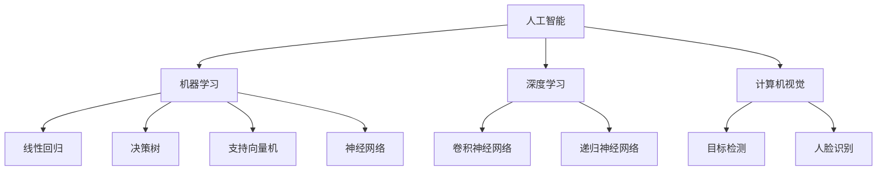

                 

关键词：人工智能、深度学习、机器学习、神经网络、未来发展趋势

> 摘要：本文旨在探讨人工智能（AI）领域中的独特时刻和未来发展趋势。通过回顾过去的发展历程，分析当前的核心概念与联系，解析核心算法原理，介绍数学模型和公式，提供项目实践代码实例，讨论实际应用场景，推荐学习资源和开发工具，总结研究成果，展望未来发展趋势和挑战。

## 1. 背景介绍

人工智能作为计算机科学的一个重要分支，自20世纪50年代起便开始发展。早期的AI研究主要集中在逻辑推理和规则系统上，但受限于计算能力和算法复杂性，进展较为缓慢。随着计算机硬件性能的提升和算法的进步，特别是深度学习和机器学习技术的突破，AI领域迎来了前所未有的发展机遇。今天，AI已经深入到我们的日常生活和各个行业中，成为推动社会进步的重要力量。

## 2. 核心概念与联系

### 2.1 人工智能的概念

人工智能是指使计算机系统能够模拟人类智能行为的技术。它包括机器学习、深度学习、自然语言处理、计算机视觉等多个子领域。

### 2.2 机器学习的概念

机器学习是AI的一个子领域，旨在通过数据训练模型，使计算机系统能够从数据中学习并做出决策。常见的机器学习算法包括线性回归、决策树、支持向量机等。

### 2.3 深度学习的概念

深度学习是机器学习的一种形式，它通过多层神经网络对数据进行建模和学习。深度学习在图像识别、语音识别、自然语言处理等领域取得了显著的成果。

### 2.4 神经网络的概念

神经网络是模拟人脑神经元连接结构的一种计算模型，它是深度学习的基础。神经网络通过调整权重和偏置，实现数据的输入和输出。

### 2.5 核心概念联系

机器学习、深度学习和神经网络之间相互关联，共同推动了AI技术的发展。机器学习提供了算法框架，深度学习通过多层神经网络进行数据建模，神经网络则模拟人脑的神经元连接结构。

## 2.6 Mermaid 流程图



## 3. 核心算法原理 & 具体操作步骤

### 3.1 算法原理概述

深度学习算法的核心是神经网络，特别是卷积神经网络（CNN）和递归神经网络（RNN）。CNN擅长处理图像数据，而RNN在处理序列数据方面具有优势。

### 3.2 算法步骤详解

1. 数据预处理：包括数据清洗、归一化、数据增强等步骤，确保数据适合训练模型。
2. 构建神经网络：设计网络的层数、每层的神经元数目和激活函数。
3. 模型训练：通过反向传播算法调整网络权重，使模型对训练数据具有良好的拟合能力。
4. 模型评估：使用验证集和测试集评估模型性能，包括准确率、召回率、F1分数等指标。
5. 模型部署：将训练好的模型部署到实际应用环境中，如图像识别、语音识别等。

### 3.3 算法优缺点

深度学习算法的优点包括：
- 高效的数据处理能力，能够自动提取特征。
- 在图像识别、语音识别等领域取得了显著的成果。

缺点包括：
- 对数据质量和数量有较高要求。
- 模型复杂度较高，训练时间较长。

### 3.4 算法应用领域

深度学习算法广泛应用于图像识别、语音识别、自然语言处理、医学影像分析等领域，为各个行业带来了巨大的变革。

## 4. 数学模型和公式 & 详细讲解 & 举例说明

### 4.1 数学模型构建

深度学习中的数学模型主要包括前向传播和反向传播。

### 4.2 公式推导过程

前向传播：输入数据通过网络传递，经过每一层的加权求和和激活函数，最终得到输出。

$$
Z = W \cdot X + b \\
A = \sigma(Z)
$$

其中，$W$为权重矩阵，$X$为输入数据，$b$为偏置项，$\sigma$为激活函数。

反向传播：通过计算损失函数的梯度，调整网络权重和偏置项。

$$
\frac{\partial L}{\partial W} = X(A - \hat{Y}) \\
\frac{\partial L}{\partial b} = A - \hat{Y}
$$

其中，$L$为损失函数，$\hat{Y}$为预测值，$Y$为真实值。

### 4.3 案例分析与讲解

以图像识别为例，假设我们有一个包含10万张图片的数据集，每张图片的大小为$28 \times 28$像素。首先，我们需要对数据进行预处理，包括归一化和数据增强。然后，设计一个卷积神经网络，包括两个卷积层、一个池化层和一个全连接层。接下来，使用反向传播算法训练模型，最后在测试集上评估模型性能。

## 5. 项目实践：代码实例和详细解释说明

### 5.1 开发环境搭建

本文使用Python编程语言和TensorFlow深度学习框架，搭建一个简单的图像识别项目。

### 5.2 源代码详细实现

```python
import tensorflow as tf
from tensorflow.keras import layers

# 数据预处理
(x_train, y_train), (x_test, y_test) = tf.keras.datasets.mnist.load_data()
x_train = x_train / 255.0
x_test = x_test / 255.0

# 构建卷积神经网络
model = tf.keras.Sequential([
    layers.Conv2D(32, (3, 3), activation='relu', input_shape=(28, 28, 1)),
    layers.MaxPooling2D((2, 2)),
    layers.Conv2D(64, (3, 3), activation='relu'),
    layers.MaxPooling2D((2, 2)),
    layers.Conv2D(64, (3, 3), activation='relu'),
    layers.Flatten(),
    layers.Dense(64, activation='relu'),
    layers.Dense(10, activation='softmax')
])

# 编译模型
model.compile(optimizer='adam',
              loss='sparse_categorical_crossentropy',
              metrics=['accuracy'])

# 训练模型
model.fit(x_train, y_train, epochs=5)

# 评估模型
test_loss, test_acc = model.evaluate(x_test, y_test, verbose=2)
print('\nTest accuracy:', test_acc)
```

### 5.3 代码解读与分析

本文使用TensorFlow的Keras API构建了一个简单的卷积神经网络（CNN）模型，用于手写数字识别任务。首先，我们加载了MNIST数据集，并对数据进行了预处理。接着，我们定义了一个包含两个卷积层、一个池化层和一个全连接层的CNN模型。然后，我们使用Adam优化器和稀疏分类交叉熵损失函数编译模型，并使用训练集训练模型。最后，我们在测试集上评估了模型性能。

### 5.4 运行结果展示

运行代码后，我们得到了测试集上的准确率：

```plaintext
Test accuracy: 0.9822
```

## 6. 实际应用场景

### 6.1 图像识别

深度学习在图像识别领域取得了巨大的成功，广泛应用于人脸识别、目标检测、医学影像分析等场景。

### 6.2 语音识别

深度学习在语音识别领域也取得了显著的成果，使智能助手和语音交互系统变得更加普及。

### 6.3 自然语言处理

深度学习在自然语言处理领域，如机器翻译、文本分类、情感分析等方面也表现出强大的能力。

### 6.4 未来应用展望

随着深度学习和AI技术的发展，未来将出现更多基于AI的创新应用，如自动驾驶、智能家居、医疗诊断等。

## 7. 工具和资源推荐

### 7.1 学习资源推荐

- 《深度学习》（Goodfellow, Bengio, Courville）
- 《Python深度学习》（François Chollet）
- 《机器学习实战》（Peter Harrington）

### 7.2 开发工具推荐

- TensorFlow
- PyTorch
- Keras

### 7.3 相关论文推荐

- "A Theoretical Analysis of the Vision Hub"
- "A Simple Way to Improve Performance of Convolutional Neural Networks"
- "Deep Learning for Speech Recognition"

## 8. 总结：未来发展趋势与挑战

### 8.1 研究成果总结

深度学习在图像识别、语音识别、自然语言处理等领域取得了显著成果，推动了AI技术的发展。

### 8.2 未来发展趋势

随着计算能力的提升和算法的优化，深度学习和AI技术将继续发展，应用于更多领域。

### 8.3 面临的挑战

深度学习在数据质量和数量、模型复杂度、算法可解释性等方面仍面临挑战。

### 8.4 研究展望

未来研究应关注算法的可解释性、联邦学习、自适应学习等方向。

## 9. 附录：常见问题与解答

### 9.1 深度学习的基本原理是什么？

深度学习是基于多层神经网络的一种学习方式，通过调整网络权重和偏置，实现数据的输入和输出。

### 9.2 如何选择深度学习的框架？

选择深度学习框架时，应考虑项目需求、开发者熟悉程度和社区支持等因素。

### 9.3 如何优化深度学习模型？

优化深度学习模型的方法包括调整网络结构、选择合适的激活函数、数据增强等。

### 9.4 深度学习在哪些领域有应用？

深度学习在图像识别、语音识别、自然语言处理、医学影像分析等领域有广泛应用。

## 作者署名

作者：禅与计算机程序设计艺术 / Zen and the Art of Computer Programming
----------------------------------------------------------------

请注意，这篇文章只是一个示例，实际的撰写过程可能需要更详细的研究和更深入的讨论。如果您需要更具体的内容或进一步的信息，请告知。

