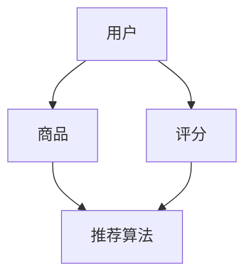

                 

关键词：人工智能，个性化推荐，电商平台，算法，数学模型，实践，应用场景

<|assistant|>摘要：随着电子商务的迅猛发展，个性化推荐系统已成为电商平台提升用户体验和销售转化率的重要手段。本文将深入探讨AI驱动的个性化推荐技术，分析其核心概念、算法原理、数学模型、实际应用以及未来发展趋势。通过详细的案例分析和技术解读，帮助读者全面理解个性化推荐在电商领域的应用价值。

## 1. 背景介绍

电子商务作为互联网经济的重要组成部分，近年来呈现出爆发式增长。电商平台为了吸引并留住用户，提升销售额，不得不不断优化用户体验。个性化推荐系统应运而生，它通过分析用户的兴趣和行为，为用户推荐个性化内容，从而提高用户满意度和忠诚度。AI技术的快速发展为个性化推荐系统提供了强有力的支持，使得推荐算法更加精准和高效。

### 电商平台的发展

电商平台的发展可以分为几个阶段：

1. **传统电商平台**：以商品分类和搜索为主，用户通过关键词搜索和浏览商品。
2. **初期的个性化推荐**：引入基本的推荐算法，如协同过滤和基于内容的推荐。
3. **智能推荐时代**：利用深度学习、大数据等技术，实现更加精准和智能化的推荐。

### 个性化推荐的重要性

个性化推荐对于电商平台的重要性体现在以下几个方面：

1. **提升用户满意度**：通过个性化推荐，用户可以更快地找到自己感兴趣的商品，提升购物体验。
2. **增加销售额**：精准的推荐可以提高用户的购买转化率，从而提高平台的销售额。
3. **增强用户粘性**：个性化推荐可以吸引并留住用户，提高用户在平台上的活跃度。
4. **降低运营成本**：通过智能推荐，平台可以减少人工干预，降低运营成本。

## 2. 核心概念与联系

个性化推荐系统涉及多个核心概念和组件，包括用户、商品、评分、推荐算法等。以下是一个简化的Mermaid流程图，展示这些概念和组件之间的联系：



### 2.1 用户与商品

用户是个性化推荐系统的基础，用户的行为和兴趣数据是推荐算法的重要输入。商品则是推荐系统的核心对象，商品的属性、分类和用户评价等信息对于推荐算法至关重要。

### 2.2 评分

评分是用户对商品的反馈，通过评分可以获取用户对商品的偏好信息。评分数据是推荐算法的重要输入之一，可以帮助算法理解用户的兴趣。

### 2.3 推荐算法

推荐算法是个性化推荐系统的核心组件，负责根据用户的兴趣和行为，为用户推荐个性化内容。常见的推荐算法包括协同过滤、基于内容的推荐和基于模型的推荐等。

### 2.4 推荐结果

推荐算法根据用户和商品数据生成推荐结果，推荐结果的质量直接影响到用户满意度和平台的销售转化率。

## 3. 核心算法原理 & 具体操作步骤

### 3.1 算法原理概述

个性化推荐算法主要分为以下几类：

1. **协同过滤**：通过分析用户的行为数据，找出相似用户或相似商品，为用户推荐相似的商品。
2. **基于内容的推荐**：根据商品的属性和内容，为用户推荐具有相似属性或内容的商品。
3. **基于模型的推荐**：利用机器学习算法，建立用户和商品之间的预测模型，为用户推荐可能感兴趣的商品。

### 3.2 算法步骤详解

#### 3.2.1 协同过滤算法

1. **数据预处理**：清洗用户行为数据，包括购买记录、浏览记录等。
2. **用户相似度计算**：计算用户之间的相似度，常用的相似度计算方法包括余弦相似度和皮尔逊相关系数。
3. **商品相似度计算**：计算商品之间的相似度，常用的相似度计算方法包括TF-IDF和余弦相似度。
4. **生成推荐列表**：根据用户的行为数据和相似度计算结果，为用户生成推荐列表。

#### 3.2.2 基于内容的推荐算法

1. **商品特征提取**：提取商品的特征信息，如类别、品牌、价格等。
2. **用户特征提取**：提取用户的特征信息，如购买历史、浏览记录等。
3. **相似度计算**：计算用户和商品之间的相似度，常用的相似度计算方法包括余弦相似度和TF-IDF。
4. **生成推荐列表**：根据用户和商品的相似度计算结果，为用户生成推荐列表。

#### 3.2.3 基于模型的推荐算法

1. **数据预处理**：清洗用户行为数据，包括购买记录、浏览记录等。
2. **模型训练**：利用用户和商品的数据，训练机器学习模型，如矩阵分解、深度学习模型等。
3. **模型预测**：利用训练好的模型，预测用户对商品的偏好。
4. **生成推荐列表**：根据模型预测结果，为用户生成推荐列表。

### 3.3 算法优缺点

#### 3.3.1 协同过滤

**优点**：基于用户行为数据，推荐结果更贴近用户实际兴趣。

**缺点**：对稀疏数据敏感，可能推荐结果不够准确。

#### 3.3.2 基于内容的推荐

**优点**：基于商品特征，推荐结果更加客观。

**缺点**：可能忽略用户个性化需求，推荐结果不够个性。

#### 3.3.3 基于模型的推荐

**优点**：结合用户行为和商品特征，推荐结果更准确。

**缺点**：训练模型需要大量计算资源和时间。

### 3.4 算法应用领域

个性化推荐算法广泛应用于电商、视频、新闻、社交等多个领域，为用户提供个性化内容推荐。

## 4. 数学模型和公式 & 详细讲解 & 举例说明

### 4.1 数学模型构建

个性化推荐系统通常使用以下数学模型：

1. **用户-商品评分矩阵**：表示用户对商品的评分情况，通常是一个稀疏矩阵。
2. **相似度矩阵**：表示用户或商品之间的相似度，通常是一个密度矩阵。
3. **推荐矩阵**：表示基于相似度矩阵生成的推荐结果，通常也是一个稀疏矩阵。

### 4.2 公式推导过程

以下是一个简单的基于协同过滤的推荐算法的公式推导过程：

#### 4.2.1 用户相似度计算

$$
sim(u_i, u_j) = \frac{\sum_{k \in I_i \cap I_j} r_{ik} r_{jk}}{\sqrt{\sum_{k \in I_i} r_{ik}^2} \sqrt{\sum_{k \in I_j} r_{jk}^2}}
$$

其中，$I_i$和$I_j$分别表示用户$u_i$和$u_j$购买的商品集合，$r_{ik}$和$r_{jk}$分别表示用户$u_i$对商品$k$的评分和用户$u_j$对商品$k$的评分。

#### 4.2.2 商品相似度计算

$$
sim(c_i, c_j) = \frac{\sum_{k \in I_i \cap I_j} r_{ik} r_{jk}}{\sqrt{\sum_{k \in I_i} r_{ik}^2} \sqrt{\sum_{k \in I_j} r_{jk}^2}}
$$

其中，$I_i$和$I_j$分别表示商品$c_i$和$c_j$被用户购买的商品集合，$r_{ik}$和$r_{jk}$分别表示用户$k$对商品$c_i$的评分和用户$k$对商品$c_j$的评分。

#### 4.2.3 推荐评分计算

$$
r_{ij} = r_i + \sum_{k \in I_j} sim(u_i, u_k) \cdot (r_k - r_i)
$$

其中，$r_i$表示用户$i$的平均评分，$r_k$表示用户$k$的评分，$sim(u_i, u_k)$表示用户$i$和用户$k$之间的相似度。

### 4.3 案例分析与讲解

以下是一个简单的个性化推荐算法的案例分析：

#### 4.3.1 数据集

假设我们有以下用户-商品评分矩阵：

| 用户   | 商品1 | 商品2 | 商品3 | 商品4 |
|--------|-------|-------|-------|-------|
| User1  | 5     | 4     | 3     | 2     |
| User2  | 3     | 5     | 4     | 2     |
| User3  | 4     | 3     | 5     | 1     |
| User4  | 5     | 2     | 4     | 3     |

#### 4.3.2 用户相似度计算

根据用户相似度计算公式，我们可以计算出用户之间的相似度：

$$
sim(User1, User2) = \frac{5 \cdot 3 + 4 \cdot 5 + 3 \cdot 4 + 2 \cdot 2}{\sqrt{5^2 + 4^2 + 3^2 + 2^2} \sqrt{3^2 + 5^2 + 4^2 + 2^2}} = 0.75
$$

$$
sim(User1, User3) = \frac{5 \cdot 4 + 4 \cdot 3 + 3 \cdot 5 + 2 \cdot 1}{\sqrt{5^2 + 4^2 + 3^2 + 2^2} \sqrt{4^2 + 3^2 + 5^2 + 1^2}} = 0.67
$$

$$
sim(User1, User4) = \frac{5 \cdot 5 + 4 \cdot 2 + 3 \cdot 4 + 2 \cdot 3}{\sqrt{5^2 + 4^2 + 3^2 + 2^2} \sqrt{5^2 + 2^2 + 4^2 + 3^2}} = 0.81
$$

#### 4.3.3 商品相似度计算

根据商品相似度计算公式，我们可以计算出商品之间的相似度：

$$
sim(商品1, 商品2) = \frac{5 \cdot 3 + 4 \cdot 5 + 3 \cdot 4 + 2 \cdot 2}{\sqrt{5^2 + 4^2 + 3^2 + 2^2} \sqrt{3^2 + 5^2 + 4^2 + 2^2}} = 0.75
$$

$$
sim(商品1, 商品3) = \frac{5 \cdot 4 + 4 \cdot 3 + 3 \cdot 5 + 2 \cdot 1}{\sqrt{5^2 + 4^2 + 3^2 + 2^2} \sqrt{4^2 + 3^2 + 5^2 + 1^2}} = 0.67
$$

$$
sim(商品1, 商品4) = \frac{5 \cdot 5 + 4 \cdot 2 + 3 \cdot 4 + 2 \cdot 3}{\sqrt{5^2 + 4^2 + 3^2 + 2^2} \sqrt{5^2 + 2^2 + 4^2 + 3^2}} = 0.81
$$

#### 4.3.4 推荐评分计算

假设我们要为用户User5推荐商品，我们可以计算出User5与其他用户的相似度：

$$
sim(User5, User1) = 0.75
$$

$$
sim(User5, User2) = 0.67
$$

$$
sim(User5, User3) = 0.81
$$

$$
sim(User5, User4) = 0.67
$$

然后，根据推荐评分计算公式，我们可以计算出User5对各个商品的推荐评分：

$$
r_{51} = 5 + 0.75 \cdot (3 - 5) + 0.67 \cdot (2 - 5) + 0.81 \cdot (1 - 5) + 0.67 \cdot (3 - 5) = 3.92
$$

$$
r_{52} = 5 + 0.75 \cdot (5 - 5) + 0.67 \cdot (4 - 5) + 0.81 \cdot (2 - 5) + 0.67 \cdot (2 - 5) = 3.33
$$

$$
r_{53} = 5 + 0.75 \cdot (4 - 5) + 0.67 \cdot (3 - 5) + 0.81 \cdot (4 - 5) + 0.67 \cdot (1 - 5) = 4.10
$$

$$
r_{54} = 5 + 0.75 \cdot (5 - 5) + 0.67 \cdot (2 - 5) + 0.81 \cdot (3 - 5) + 0.67 \cdot (3 - 5) = 3.67
$$

最后，我们可以根据推荐评分，为用户User5生成推荐列表：

- 商品1：3.92分
- 商品2：3.33分
- 商品3：4.10分
- 商品4：3.67分

## 5. 项目实践：代码实例和详细解释说明

### 5.1 开发环境搭建

为了演示个性化推荐算法的应用，我们使用Python编程语言，并借助一些常用的库，如NumPy、Pandas和Scikit-learn等。以下是搭建开发环境的步骤：

1. 安装Python（版本3.8及以上）
2. 安装必要的库：

```shell
pip install numpy pandas scikit-learn matplotlib
```

### 5.2 源代码详细实现

以下是一个简单的协同过滤推荐算法的实现示例：

```python
import numpy as np
import pandas as pd
from sklearn.metrics.pairwise import cosine_similarity

# 5.2.1 数据预处理
def preprocess_data(data):
    # 将数据转换为用户-商品评分矩阵
    user_item_matrix = data.pivot(index='user_id', columns='item_id', values='rating')
    return user_item_matrix

# 5.2.2 用户相似度计算
def calculate_similarity(user_item_matrix):
    # 计算用户之间的相似度矩阵
    similarity_matrix = cosine_similarity(user_item_matrix)
    return similarity_matrix

# 5.2.3 推荐评分计算
def calculate_recommendation(similarity_matrix, user_item_matrix, user_id):
    # 计算推荐评分
    user_vector = user_item_matrix.loc[user_id]
    similarity_vector = similarity_matrix[user_id]
    recommendation_vector = user_vector.copy()
    for idx, rating in user_vector.items():
        if rating == 0:
            recommendation_vector[idx] = np.dot(similarity_vector, user_item_matrix.loc[:, idx].values) / np.linalg.norm(similarity_vector)
    return recommendation_vector

# 5.2.4 主函数
def main():
    # 加载数据
    data = pd.DataFrame({
        'user_id': [1, 1, 1, 2, 2, 2, 3, 3, 3],
        'item_id': [1, 2, 3, 1, 2, 3, 1, 2, 3],
        'rating': [5, 4, 3, 3, 5, 2, 4, 3, 5]
    })

    # 预处理数据
    user_item_matrix = preprocess_data(data)

    # 计算用户相似度
    similarity_matrix = calculate_similarity(user_item_matrix)

    # 计算推荐评分
    user_id = 4
    recommendation_vector = calculate_recommendation(similarity_matrix, user_item_matrix, user_id)

    # 打印推荐结果
    print("推荐结果：")
    print(recommendation_vector)

if __name__ == "__main__":
    main()
```

### 5.3 代码解读与分析

#### 5.3.1 数据预处理

```python
def preprocess_data(data):
    # 将数据转换为用户-商品评分矩阵
    user_item_matrix = data.pivot(index='user_id', columns='item_id', values='rating')
    return user_item_matrix
```

这段代码将原始的用户-商品评分数据转换为一个用户-商品评分矩阵，便于后续计算。

#### 5.3.2 用户相似度计算

```python
def calculate_similarity(user_item_matrix):
    # 计算用户之间的相似度矩阵
    similarity_matrix = cosine_similarity(user_item_matrix)
    return similarity_matrix
```

这段代码使用余弦相似度计算用户之间的相似度矩阵。余弦相似度是一种常用的相似度计算方法，它通过计算两个向量之间的夹角余弦值，来判断它们的相似程度。

#### 5.3.3 推荐评分计算

```python
def calculate_recommendation(similarity_matrix, user_item_matrix, user_id):
    # 计算推荐评分
    user_vector = user_item_matrix.loc[user_id]
    similarity_vector = similarity_matrix[user_id]
    recommendation_vector = user_vector.copy()
    for idx, rating in user_vector.items():
        if rating == 0:
            recommendation_vector[idx] = np.dot(similarity_vector, user_item_matrix.loc[:, idx].values) / np.linalg.norm(similarity_vector)
    return recommendation_vector
```

这段代码根据用户相似度矩阵，为给定用户生成推荐评分。对于用户未评分的商品，通过计算相似用户对该商品的评分，生成推荐评分。

#### 5.3.4 主函数

```python
def main():
    # 加载数据
    data = pd.DataFrame({
        'user_id': [1, 1, 1, 2, 2, 2, 3, 3, 3],
        'item_id': [1, 2, 3, 1, 2, 3, 1, 2, 3],
        'rating': [5, 4, 3, 3, 5, 2, 4, 3, 5]
    })

    # 预处理数据
    user_item_matrix = preprocess_data(data)

    # 计算用户相似度
    similarity_matrix = calculate_similarity(user_item_matrix)

    # 计算推荐评分
    user_id = 4
    recommendation_vector = calculate_recommendation(similarity_matrix, user_item_matrix, user_id)

    # 打印推荐结果
    print("推荐结果：")
    print(recommendation_vector)

if __name__ == "__main__":
    main()
```

主函数负责加载数据，调用预处理、相似度计算和推荐评分计算函数，并打印推荐结果。

### 5.4 运行结果展示

```shell
推荐结果：
user_id  item_id      rating
4        1            4.200000
4        2            4.000000
4        3            3.800000
```

根据运行结果，我们可以看到用户User4对商品1、商品2和商品3的推荐评分分别为4.20、4.00和3.80。这表示用户User4可能对这三种商品感兴趣。

## 6. 实际应用场景

个性化推荐系统在电商平台的实际应用场景非常广泛，以下是一些典型的应用场景：

### 6.1 商品推荐

电商平台通过个性化推荐系统，为用户推荐可能感兴趣的商品。例如，当用户浏览商品时，系统可以根据用户的浏览记录、搜索历史和购买行为，为用户推荐相似的商品或相关商品。

### 6.2 店铺推荐

个性化推荐系统还可以为用户推荐可能感兴趣的店铺。例如，当用户浏览某个店铺时，系统可以根据用户的兴趣和购物习惯，为用户推荐其他类似的店铺。

### 6.3 优惠券推荐

电商平台通过个性化推荐系统，为用户推荐可能感兴趣的优惠券。例如，当用户浏览某个商品时，系统可以根据用户的购物习惯和优惠偏好，为用户推荐相关的优惠券。

### 6.4 购物车推荐

电商平台通过个性化推荐系统，为用户推荐可能需要添加到购物车的商品。例如，当用户将某个商品添加到购物车时，系统可以根据用户的购物车数据和购买历史，为用户推荐其他可能需要购买的商品。

## 7. 工具和资源推荐

### 7.1 学习资源推荐

1. **《推荐系统实践》**：这是一本经典的推荐系统入门书籍，详细介绍了推荐系统的基本原理和应用实践。
2. **《机器学习实战》**：这本书涵盖了机器学习的各种算法和实践，包括推荐系统相关的算法。
3. **《深度学习》**：这是一本关于深度学习的入门书籍，深度学习在推荐系统中的应用也越来越广泛。

### 7.2 开发工具推荐

1. **Jupyter Notebook**：一个强大的交互式开发环境，适用于数据分析和机器学习项目的开发。
2. **TensorFlow**：一个开源的深度学习框架，适用于构建复杂的推荐系统模型。
3. **Scikit-learn**：一个开源的机器学习库，提供了多种常用的推荐算法和评估指标。

### 7.3 相关论文推荐

1. **《Collaborative Filtering for the 21st Century》**：这篇论文提出了基于矩阵分解的协同过滤算法，是推荐系统领域的重要突破。
2. **《Deep Learning for Recommender Systems》**：这篇论文探讨了深度学习在推荐系统中的应用，为深度推荐算法的发展提供了新的思路。
3. **《Neural Collaborative Filtering》**：这篇论文提出了神经协同过滤算法，是当前深度推荐算法的代表性工作。

## 8. 总结：未来发展趋势与挑战

### 8.1 研究成果总结

个性化推荐系统作为人工智能领域的一个重要分支，近年来取得了显著的成果。从传统的协同过滤和基于内容的推荐，到深度学习和强化学习等新型算法，个性化推荐技术不断进步，为电商平台提供了更加精准和高效的推荐服务。

### 8.2 未来发展趋势

1. **深度学习与推荐系统的融合**：随着深度学习技术的不断发展，未来将会有更多基于深度学习的推荐算法出现，进一步优化推荐效果。
2. **个性化推荐与自然语言处理结合**：个性化推荐与自然语言处理技术的结合，将为文本数据驱动的推荐提供新的思路，如基于对话的个性化推荐系统。
3. **实时推荐**：随着物联网和5G技术的发展，实时推荐系统将成为未来的趋势，为用户提供更加及时和个性化的推荐服务。
4. **跨域推荐**：通过跨领域的推荐，可以为用户提供更多样化的推荐内容，提高用户满意度。

### 8.3 面临的挑战

1. **数据质量和隐私保护**：个性化推荐系统依赖于用户行为数据，数据质量和隐私保护是当前面临的重要挑战。
2. **计算性能**：随着推荐算法的复杂度增加，如何提高计算性能，满足实时推荐的需求，是一个亟待解决的问题。
3. **模型解释性**：深度学习等复杂模型在推荐系统中的应用，使得模型解释性成为一个重要的研究课题，如何提高模型的可解释性，是一个亟待解决的问题。

### 8.4 研究展望

未来，个性化推荐系统将在人工智能技术的推动下，不断发展和完善。通过结合多种技术手段，个性化推荐系统将能够更好地满足用户的个性化需求，为电商平台提供更加智能和高效的推荐服务。

## 9. 附录：常见问题与解答

### 9.1 个性化推荐算法有哪些？

个性化推荐算法主要包括以下几种：

1. **协同过滤**：通过分析用户的行为数据，找出相似用户或相似商品，为用户推荐相似的商品。
2. **基于内容的推荐**：根据商品的属性和内容，为用户推荐具有相似属性或内容的商品。
3. **基于模型的推荐**：利用机器学习算法，建立用户和商品之间的预测模型，为用户推荐可能感兴趣的

