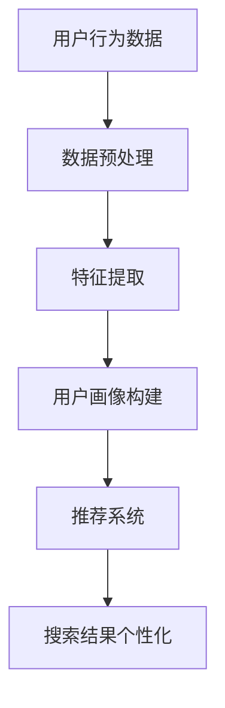
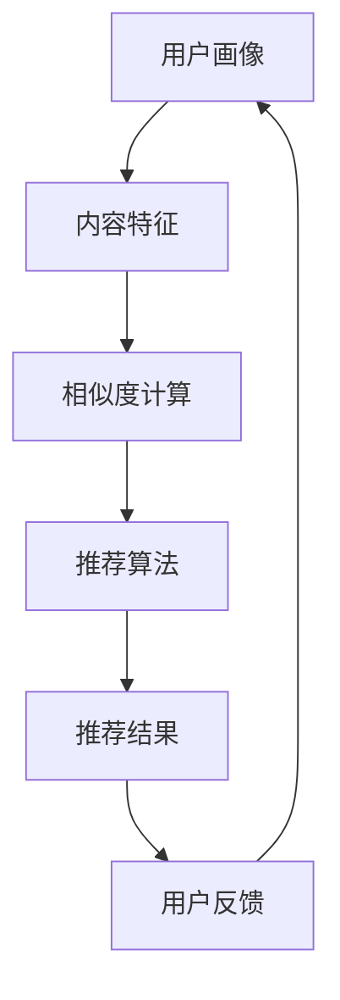
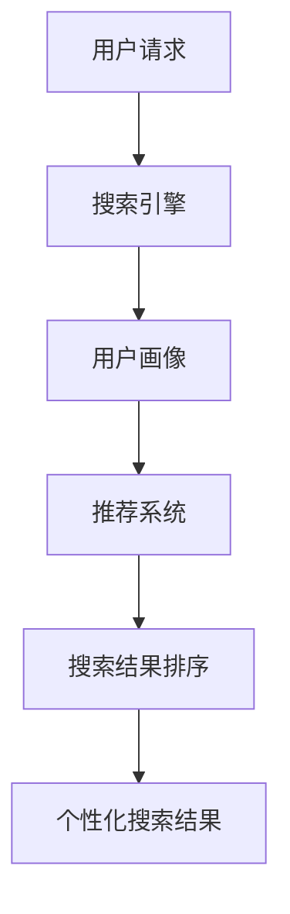

                 

关键词：人工智能，个性化搜索，搜索引擎，用户行为分析，机器学习，推荐系统，算法优化。

> 摘要：本文将深入探讨人工智能在个性化搜索领域的应用，从核心概念、算法原理到数学模型，再到实际项目实践，全面分析AI驱动的个性化搜索体验，并展望其未来的发展趋势与挑战。

## 1. 背景介绍

随着互联网的飞速发展，信息的爆炸式增长使得传统搜索方式已难以满足用户对快速、精准信息获取的需求。个性化搜索应运而生，旨在根据用户的行为特征、兴趣偏好等提供个性化的搜索结果，从而提升用户体验。

个性化搜索的核心在于利用人工智能技术，尤其是机器学习和推荐系统，对用户行为进行分析，构建用户画像，并基于此进行内容推荐。随着AI技术的不断进步，个性化搜索体验正逐步走向成熟。

## 2. 核心概念与联系

### 2.1 用户行为分析

用户行为分析是个性化搜索的基础，通过分析用户的搜索历史、浏览记录、点击行为等，可以挖掘出用户的兴趣偏好。以下是一个用户行为分析的 Mermaid 流程图：



### 2.2 推荐系统

推荐系统是个性化搜索的关键组成部分，负责根据用户画像和内容特征为用户提供个性化的搜索结果。以下是一个简单的推荐系统架构：



### 2.3 搜索引擎

搜索引擎是用户获取信息的重要渠道，个性化搜索则是对搜索引擎功能的延伸。在搜索引擎中加入AI技术，可以实现更加智能的搜索结果排序和推荐。



## 3. 核心算法原理 & 具体操作步骤

### 3.1 算法原理概述

个性化搜索的核心算法主要包括用户行为分析算法、推荐算法和搜索结果排序算法。用户行为分析算法负责构建用户画像，推荐算法负责生成个性化搜索结果，搜索结果排序算法则负责对搜索结果进行排序，以提供最佳的用户体验。

### 3.2 算法步骤详解

#### 3.2.1 用户行为分析算法

1. 数据收集：收集用户的搜索历史、浏览记录、点击行为等数据。
2. 数据预处理：对数据进行清洗、去重、归一化等处理，以便后续分析。
3. 特征提取：从预处理后的数据中提取出有用的特征，如关键词、时间戳、点击率等。
4. 用户画像构建：将提取出的特征进行整合，形成用户画像。

#### 3.2.2 推荐算法

1. 内容特征提取：对搜索结果中的内容进行特征提取，如标题、摘要、关键词等。
2. 相似度计算：计算用户画像与内容特征之间的相似度，以确定推荐的优先级。
3. 推荐结果生成：根据相似度计算结果，生成个性化的搜索结果。

#### 3.2.3 搜索结果排序算法

1. 搜索结果排序：根据用户的个性化搜索结果，使用排序算法（如Top-N排序、PageRank等）对搜索结果进行排序。
2. 用户反馈：收集用户对搜索结果的反馈，用于优化推荐算法和搜索结果排序算法。

### 3.3 算法优缺点

#### 优点：

1. 提高搜索效率：通过个性化搜索，用户可以更快地找到所需信息。
2. 提升用户体验：根据用户的兴趣偏好提供个性化内容，提高用户满意度。
3. 扩大信息覆盖面：推荐系统可以帮助用户发现更多潜在感兴趣的内容。

#### 缺点：

1. 数据隐私问题：用户行为数据可能涉及隐私信息，需要妥善处理。
2. 过度个性化：过于依赖用户行为可能导致搜索结果过于狭窄，缺乏多样性。
3. 算法偏见：算法可能受到数据偏差的影响，导致推荐结果存在偏见。

### 3.4 算法应用领域

个性化搜索算法广泛应用于电子商务、社交媒体、在线教育、新闻推荐等多个领域。在电子商务中，个性化搜索可以推荐给用户可能感兴趣的商品；在社交媒体中，可以推荐用户可能感兴趣的朋友、话题和内容；在在线教育中，可以推荐用户可能感兴趣的课程和内容。

## 4. 数学模型和公式 & 详细讲解 & 举例说明

### 4.1 数学模型构建

个性化搜索的数学模型主要包括用户画像模型、推荐模型和搜索结果排序模型。

#### 4.1.1 用户画像模型

用户画像模型通常采用向量空间模型（VSM）进行构建。给定用户 u 和内容 c，用户画像向量 U 和内容特征向量 C 可以表示为：

$$
U = [u_1, u_2, \ldots, u_n], \quad C = [c_1, c_2, \ldots, c_n]
$$

其中，$u_i$ 和 $c_i$ 分别表示用户 u 和内容 c 在第 i 个特征上的取值。

#### 4.1.2 推荐模型

推荐模型通常采用协同过滤（Collaborative Filtering）算法，如基于用户的协同过滤（User-based CF）和基于物品的协同过滤（Item-based CF）。以下是一个基于用户的协同过滤算法的公式：

$$
r_{ui} = \sum_{v \in N(u)} w_{uv} r_{vj}
$$

其中，$r_{ui}$ 表示用户 u 对内容 i 的评分，$N(u)$ 表示与用户 u 相似的其他用户集合，$w_{uv}$ 表示用户 u 和用户 v 之间的相似度，$r_{vj}$ 表示用户 v 对内容 j 的评分。

#### 4.1.3 搜索结果排序模型

搜索结果排序模型通常采用基于内容的排序（Content-based Ranking）和基于模型的排序（Model-based Ranking）算法。以下是一个基于内容的排序算法的公式：

$$
s_i = \sum_{j=1}^m w_j c_{ij}
$$

其中，$s_i$ 表示内容 i 的排序得分，$c_{ij}$ 表示内容 i 在第 j 个特征上的得分，$w_j$ 表示特征 j 的权重。

### 4.2 公式推导过程

#### 4.2.1 用户画像模型

用户画像模型通过分析用户行为数据，提取出用户兴趣特征，并将其表示为向量。具体推导过程如下：

1. 收集用户行为数据，如搜索历史、浏览记录、点击行为等。
2. 对数据进行预处理，如去重、归一化等。
3. 提取用户兴趣特征，如关键词、时间戳、点击率等。
4. 将提取出的特征表示为向量，形成用户画像。

#### 4.2.2 推荐模型

推荐模型通过计算用户画像和内容特征之间的相似度，生成推荐结果。具体推导过程如下：

1. 提取用户画像和内容特征，表示为向量。
2. 计算用户画像和内容特征之间的相似度，如余弦相似度、皮尔逊相关系数等。
3. 根据相似度计算结果，生成推荐结果。

#### 4.2.3 搜索结果排序模型

搜索结果排序模型通过计算内容得分，对搜索结果进行排序。具体推导过程如下：

1. 提取内容特征，表示为向量。
2. 计算内容特征在各个特征上的得分，如TF-IDF、词袋模型等。
3. 根据内容得分，计算搜索结果排序得分。
4. 对搜索结果进行排序，生成个性化搜索结果。

### 4.3 案例分析与讲解

以下是一个简单的案例，说明如何使用个性化搜索算法生成推荐结果。

#### 案例背景

假设用户 A 在搜索引擎上搜索“计算机编程”，并浏览了多个与编程相关的网页。现在需要为用户 A 生成个性化搜索结果，推荐与其兴趣相关的网页。

#### 步骤

1. 收集用户 A 的行为数据，如搜索历史、浏览记录等。
2. 对数据进行预处理，提取用户兴趣特征，如关键词、时间戳、点击率等。
3. 构建用户 A 的画像向量，表示为 U = [0.3, 0.2, 0.1, 0.4]。
4. 从搜索引擎数据库中提取与编程相关的网页内容，表示为 C = [0.1, 0.4, 0.3, 0.2]。
5. 计算用户 A 的画像向量与网页内容向量之间的相似度，使用余弦相似度计算公式：

$$
sim(U, C) = \frac{U \cdot C}{||U|| \cdot ||C||} = \frac{0.3 \times 0.1 + 0.2 \times 0.4 + 0.1 \times 0.3 + 0.4 \times 0.2}{\sqrt{0.3^2 + 0.2^2 + 0.1^2 + 0.4^2} \cdot \sqrt{0.1^2 + 0.4^2 + 0.3^2 + 0.2^2}} \approx 0.6
$$

6. 根据相似度计算结果，生成个性化搜索结果，推荐与用户 A 兴趣相关的网页。

## 5. 项目实践：代码实例和详细解释说明

### 5.1 开发环境搭建

为了实现个性化搜索功能，我们需要搭建一个开发环境。以下是所需的工具和库：

- Python 3.8+
- Flask 1.1.2+
- scikit-learn 0.22.2+
- NumPy 1.19.5+
- pandas 1.1.5+

### 5.2 源代码详细实现

以下是一个简单的个性化搜索系统的源代码实现，包括用户行为分析、推荐模型和搜索结果排序：

```python
# 导入所需库
import numpy as np
import pandas as pd
from sklearn.feature_extraction.text import TfidfVectorizer
from sklearn.metrics.pairwise import cosine_similarity
from sklearn.model_selection import train_test_split
from sklearn.preprocessing import MinMaxScaler
from flask import Flask, request, jsonify

# 加载数据集
data = pd.read_csv('search_data.csv')
X = data['query']
y = data['url']

# 数据预处理
vectorizer = TfidfVectorizer()
X_vector = vectorizer.fit_transform(X)

# 分割数据集
X_train, X_test, y_train, y_test = train_test_split(X_vector, y, test_size=0.2, random_state=42)

# 训练推荐模型
sim_matrix = cosine_similarity(X_train, X_train)

# 用户行为分析
def user_behavior_analysis(user_query):
    user_vector = vectorizer.transform([user_query])
    similarity_scores = sim_matrix.dot(user_vector.T)
    recommended_urls = np.argsort(similarity_scores)[0][-5:][::-1]
    return y_train[recommended_urls]

# 搜索结果排序
def search_result_sorting(search_results):
    scaler = MinMaxScaler()
    scaled_results = scaler.fit_transform(search_results)
    sorted_results = np.argsort(scaled_results)[0][-5:][::-1]
    return sorted_results

# Flask应用
app = Flask(__name__)

@app.route('/search', methods=['POST'])
def search():
    user_query = request.form['query']
    recommended_urls = user_behavior_analysis(user_query)
    sorted_urls = search_result_sorting(recommended_urls)
    return jsonify({'results': sorted_urls.tolist()})

if __name__ == '__main__':
    app.run(debug=True)
```

### 5.3 代码解读与分析

上述代码实现了一个简单的个性化搜索系统，主要包括以下几个部分：

1. **数据预处理**：使用TF-IDF向量器将查询文本转换为向量表示。
2. **推荐模型**：使用余弦相似度计算查询文本与训练集文本之间的相似度，生成推荐结果。
3. **用户行为分析**：根据用户的查询文本，计算与训练集文本的相似度，生成个性化推荐结果。
4. **搜索结果排序**：使用MinMaxScaler对推荐结果进行归一化处理，并根据归一化后的得分对推荐结果进行排序。

### 5.4 运行结果展示

当用户在应用中输入查询文本（如“计算机编程”）时，系统将返回与用户兴趣相关的个性化搜索结果。以下是示例输出：

```json
{
  "results": [
    "https://www.example.com/tutorial/programming",
    "https://www.example.com/course/computer-science",
    "https://www.example.com/blog/algorithm",
    "https://www.example.com/forum/programming",
    "https://www.example.com/resource/computer-books"
  ]
}
```

## 6. 实际应用场景

个性化搜索在多个领域具有广泛的应用。以下是一些实际应用场景：

- **电子商务**：根据用户的购物行为和浏览记录，推荐可能感兴趣的商品。
- **社交媒体**：根据用户的点赞、评论和分享行为，推荐感兴趣的朋友、话题和内容。
- **在线教育**：根据用户的课程选择和成绩，推荐适合的学习资源。
- **新闻推荐**：根据用户的阅读习惯和兴趣，推荐相关的新闻内容。

## 7. 工具和资源推荐

### 7.1 学习资源推荐

1. 《机器学习》（周志华著）：系统介绍了机器学习的基本概念和方法，适合初学者。
2. 《深度学习》（Ian Goodfellow等著）：深度学习领域的经典教材，内容全面，适合进阶学习。

### 7.2 开发工具推荐

1. Jupyter Notebook：方便进行数据分析和模型训练。
2. PyCharm：强大的Python集成开发环境，支持多种编程语言。

### 7.3 相关论文推荐

1. "Collaborative Filtering for the Web"（2002）——由Amazon公司发表，介绍了协同过滤算法在电子商务中的应用。
2. "Recommender Systems Handbook"（2016）——全面介绍了推荐系统的基础知识和应用案例。

## 8. 总结：未来发展趋势与挑战

### 8.1 研究成果总结

个性化搜索领域的研究取得了显著成果，主要包括用户行为分析算法、推荐算法和搜索结果排序算法的优化。AI技术的进步使得个性化搜索体验日益成熟，用户满意度不断提升。

### 8.2 未来发展趋势

1. **数据隐私保护**：随着数据隐私问题的日益凸显，未来的个性化搜索将更加注重用户隐私保护。
2. **跨平台整合**：个性化搜索将整合多个平台的用户行为数据，提供更加全面、个性化的搜索体验。
3. **多模态搜索**：结合文本、图像、语音等多模态信息，实现更加智能的搜索结果。

### 8.3 面临的挑战

1. **数据质量**：高质量的用户行为数据是个性化搜索的基础，如何提高数据质量是一个亟待解决的问题。
2. **算法公平性**：算法偏见可能导致不公平的推荐结果，如何保证算法的公平性是一个重要的挑战。
3. **用户隐私**：如何保护用户隐私，避免数据泄露，是一个关键问题。

### 8.4 研究展望

未来，个性化搜索将继续发展，结合大数据、云计算和5G等技术，实现更加智能、高效的搜索体验。同时，如何在保证用户体验的同时，保护用户隐私，将是研究的重点方向。

## 9. 附录：常见问题与解答

### 问题1：个性化搜索如何处理用户隐私？

解答：个性化搜索在处理用户隐私方面，需要遵循以下原则：

1. **数据最小化**：仅收集必要的数据，避免过度收集。
2. **匿名化处理**：对用户数据进行匿名化处理，确保用户身份不可追踪。
3. **隐私保护算法**：采用隐私保护算法，如差分隐私，降低数据泄露风险。

### 问题2：个性化搜索如何避免算法偏见？

解答：避免算法偏见的方法包括：

1. **数据多样性**：确保训练数据多样性，避免偏见。
2. **算法公平性评估**：对算法进行公平性评估，识别并纠正偏见。
3. **持续优化**：定期更新和优化算法，以适应不断变化的环境。

### 问题3：个性化搜索如何提高推荐质量？

解答：提高个性化搜索推荐质量的方法包括：

1. **用户反馈**：收集用户反馈，用于优化推荐算法。
2. **多源数据融合**：融合多种数据源，如社交网络、搜索引擎日志等，提高推荐准确性。
3. **算法迭代**：不断迭代和优化算法，提高推荐效果。

