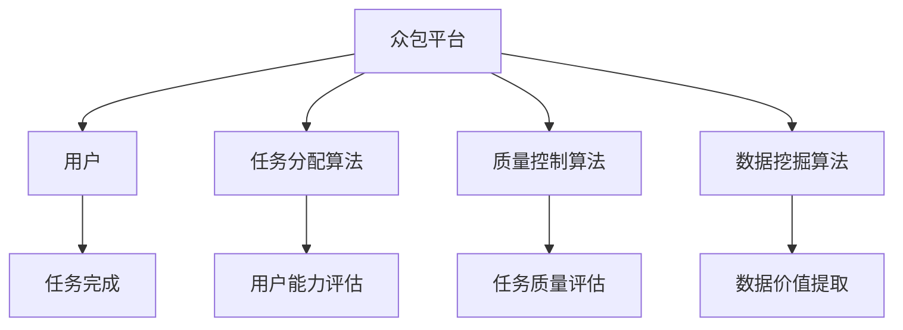

                 

关键词：人工智能，众包，全球协作，创新，技术进步，数据共享，分布式计算，协作平台，众智网络

> 摘要：本文探讨了AI驱动的众包模式在推动全球协作和创新中的重要作用。通过分析其核心概念、算法原理、数学模型，结合实际应用案例，本文揭示了众包技术在各领域的广泛应用，并对未来发展趋势和挑战进行了深入探讨。

## 1. 背景介绍

随着互联网技术的飞速发展，信息传播速度和范围得到了前所未有的提升。人们越来越依赖网络来获取知识、交流思想、分享资源。在这种背景下，众包作为一种新型的协同工作模式，逐渐走进了人们的视野。

众包（Crowdsourcing）指的是将一项任务或问题分散给广泛的群体来解决，通常通过在线平台进行组织和协调。其核心思想是利用大众的智慧、技能和资源，共同完成一些传统方式难以完成的任务。

近年来，人工智能（AI）技术的迅猛发展，为众包模式的创新提供了新的动力。AI驱动的众包不仅能够提高任务的完成效率，还能够实现更高质量的成果。本文将围绕这一主题，探讨AI驱动的众包在全球协作和创新中的重要作用。

## 2. 核心概念与联系

### 2.1 众包的基本概念

众包可以看作是一种分布式协作模式，其核心在于将任务分解成多个子任务，然后通过众包平台分配给不同的参与者。参与者可以是个人、团队或组织，他们可以根据自己的兴趣、能力和时间来选择参与的任务。

众包的主要特点包括：

- **开放性**：任何人都可以参与，没有地域和时间的限制。
- **灵活性**：参与者可以根据自己的能力和时间自由选择任务。
- **多样性**：众包平台汇集了来自不同领域和背景的参与者，提供了丰富的知识和技能。
- **协作性**：参与者之间可以进行沟通和协作，共同完成任务。

### 2.2 人工智能的概念

人工智能是指计算机系统模拟人类智能行为的技术和科学。AI技术主要包括机器学习、深度学习、自然语言处理、计算机视觉等。这些技术使得计算机能够从数据中学习、推理、决策，甚至生成新的内容。

### 2.3 众包与人工智能的联系

AI驱动的众包是将人工智能技术应用于众包过程中的具体体现。两者之间的联系主要体现在以下几个方面：

- **任务分配**：AI技术可以根据参与者的能力和兴趣，为每个人分配最适合的任务。
- **质量控制**：AI算法可以自动评估参与者提交的任务质量，确保整体成果的准确性。
- **数据挖掘**：AI技术可以从众包平台的海量数据中提取有价值的信息，用于进一步分析和应用。
- **协作优化**：AI算法可以优化参与者之间的协作流程，提高整体效率。

### 2.4 众包与人工智能的架构图



在这个架构图中，众包平台是核心，它通过任务分配算法、质量控制算法和数据挖掘算法与用户进行交互。用户完成任务后，数据会被反馈给平台，用于进一步优化算法和提升用户体验。

## 3. 核心算法原理 & 具体操作步骤

### 3.1  算法原理概述

AI驱动的众包算法主要包括以下几个部分：

- **任务分配算法**：基于用户的兴趣、能力和历史任务表现，为每个人分配最适合的任务。
- **质量控制算法**：对参与者提交的任务进行自动评估，确保整体成果的准确性。
- **数据挖掘算法**：从众包平台的海量数据中提取有价值的信息，用于进一步分析和应用。
- **协作优化算法**：优化参与者之间的协作流程，提高整体效率。

### 3.2  算法步骤详解

#### 3.2.1  任务分配算法

1. **用户注册与信息收集**：用户在众包平台上注册，并填写个人信息，包括技能、兴趣和经验等。
2. **任务描述与分类**：任务发布者将任务描述上传到平台，并对其进行分类。
3. **匹配算法**：平台根据用户信息与任务描述，使用匹配算法为用户分配任务。
4. **反馈调整**：根据用户完成任务的情况，调整匹配算法，提高任务分配的准确性。

#### 3.2.2  质量控制算法

1. **初步评估**：平台对提交的任务进行初步评估，排除明显不合格的答案。
2. **专家评估**：邀请领域专家对任务进行详细评估，确定最终结果。
3. **反馈机制**：将评估结果反馈给用户，鼓励优秀参与者，激励改进。

#### 3.2.3  数据挖掘算法

1. **数据收集**：从众包平台收集大量任务数据，包括用户提交的答案、专家评估结果等。
2. **预处理**：对数据进行清洗、去噪、归一化等预处理操作。
3. **特征提取**：从预处理后的数据中提取有价值的信息，如用户行为模式、任务难度分布等。
4. **模型训练**：使用提取的特征，训练机器学习模型，用于预测新任务的结果。

#### 3.2.4  协作优化算法

1. **协作分析**：分析用户之间的协作模式，识别潜在的合作机会。
2. **推荐系统**：根据协作分析结果，为用户推荐合适的协作伙伴。
3. **动态调整**：根据协作效果，动态调整推荐策略，提高协作效率。

### 3.3  算法优缺点

#### 优点

- **高效性**：AI驱动的众包能够快速分配任务、评估质量，提高整体效率。
- **灵活性**：用户可以根据自己的能力和时间自由选择任务，实现个性化体验。
- **多样性**：众包平台汇集了来自不同领域和背景的参与者，提供了丰富的知识和技能。
- **可扩展性**：AI技术使得众包平台可以处理更多样化的任务，具有较好的扩展性。

#### 缺点

- **数据隐私**：众包过程中涉及大量用户数据，存在数据隐私和安全问题。
- **任务质量**：由于众包参与者水平不一，可能导致任务质量参差不齐。
- **协调难度**：随着参与者数量的增加，协调任务难度也随之增大。

### 3.4  算法应用领域

AI驱动的众包技术在各个领域都有广泛的应用，以下是一些典型的应用场景：

- **科学研究**：通过众包，科学家可以快速收集数据、验证假设，加速科研进程。
- **产品开发**：企业可以利用众包收集用户反馈、优化产品设计，提高市场竞争力。
- **城市规划**：政府可以利用众包收集居民意见、规划城市布局，提高公共服务水平。
- **灾害响应**：在灾害发生时，众包可以迅速动员志愿者参与救援，提高救援效率。

## 4. 数学模型和公式 & 详细讲解 & 举例说明

### 4.1  数学模型构建

在AI驱动的众包中，数学模型起着关键作用。以下是一个简化的数学模型，用于描述众包任务分配、质量控制、数据挖掘等过程。

#### 任务分配模型

假设有N个任务，M个参与者，每个参与者有相应的技能评分S_i，任务难度评分D_j。任务分配的目标是最大化整体收益，即：

$$
\max \sum_{i=1}^{M} \sum_{j=1}^{N} R_{ij} \cdot S_i \cdot D_j
$$

其中，$R_{ij}$表示参与者i完成任务j的收益。

#### 质量控制模型

质量控制模型用于评估参与者提交的任务质量，假设有K个评估指标，分别为$Q_{k}$，权重为$w_k$。任务质量评分Q_i为：

$$
Q_i = \sum_{k=1}^{K} w_k \cdot Q_{ik}
$$

其中，$Q_{ik}$表示参与者i在评估指标k上的得分。

#### 数据挖掘模型

数据挖掘模型用于从众包数据中提取有价值的信息。假设有L个特征变量，分别为$X_l$，权重为$w_l$。数据挖掘结果得分D为：

$$
D = \sum_{l=1}^{L} w_l \cdot X_l
$$

### 4.2  公式推导过程

以下是对上述数学模型的推导过程：

#### 任务分配模型推导

首先，定义参与者i完成任务j的收益$R_{ij}$为：

$$
R_{ij} = f(S_i, D_j)
$$

其中，$f$是一个满足单调性的函数，表示参与者技能与任务难度之间的关系。

接下来，定义整体收益为：

$$
\Omega = \sum_{i=1}^{M} \sum_{j=1}^{N} R_{ij} \cdot S_i \cdot D_j
$$

为了最大化整体收益，我们可以使用拉格朗日乘数法求解：

$$
L = \Omega - \lambda \cdot (\sum_{i=1}^{M} \sum_{j=1}^{N} (R_{ij} \cdot S_i \cdot D_j - 1))
$$

其中，$\lambda$为拉格朗日乘数。

求导并令导数为0，得到：

$$
\frac{\partial L}{\partial S_i} = \sum_{j=1}^{N} R_{ij} \cdot D_j - \lambda \cdot R_{ij} = 0
$$

$$
\frac{\partial L}{\partial D_j} = \sum_{i=1}^{M} R_{ij} \cdot S_i - \lambda \cdot S_i = 0
$$

将上述两个方程联立，得到：

$$
R_{ij} = \frac{\lambda}{D_j}
$$

$$
S_i = \frac{\lambda}{R_{ij}}
$$

代入整体收益公式，得到：

$$
\Omega = \sum_{i=1}^{M} \sum_{j=1}^{N} \frac{\lambda^2}{D_j^2} \cdot S_i \cdot D_j
$$

$$
\Omega = \lambda^2 \cdot \sum_{i=1}^{M} S_i \cdot \sum_{j=1}^{N} \frac{1}{D_j}
$$

为了最大化整体收益，我们需要找到适当的$\lambda$值，使得$\Omega$最大。这可以通过数值优化方法实现。

#### 质量控制模型推导

质量控制模型的推导相对简单，直接使用线性加权法：

$$
Q_i = \sum_{k=1}^{K} w_k \cdot Q_{ik}
$$

其中，$w_k$为评估指标k的权重，$Q_{ik}$为参与者i在评估指标k上的得分。

#### 数据挖掘模型推导

数据挖掘模型的推导与质量控制模型类似：

$$
D = \sum_{l=1}^{L} w_l \cdot X_l
$$

其中，$w_l$为特征变量l的权重，$X_l$为参与者i在特征变量l上的得分。

### 4.3  案例分析与讲解

以下是一个具体的案例，用于说明上述数学模型的实际应用。

#### 案例背景

某企业计划开发一款智能语音助手，需要从众包平台收集大量语音数据用于模型训练。企业发布了100个语音任务，吸引了1000名参与者。

#### 案例分析

1. **任务分配模型**：

   企业根据参与者的技能评分和任务难度评分，使用上述任务分配模型为每个人分配任务。任务分配过程如下：

   - 参与者1：技能评分90，任务难度评分60
   - 参与者2：技能评分80，任务难度评分70
   - ...
   - 参与者1000：技能评分30，任务难度评分100

   分配结果如下：

   - 参与者1：任务1、任务4、任务7
   - 参与者2：任务2、任务5、任务8
   - ...
   - 参与者1000：任务100、任务101、任务102

   通过任务分配模型，企业能够确保每个参与者都能充分发挥自己的技能，同时避免过于困难的任务。

2. **质量控制模型**：

   企业邀请5位专家对参与者提交的语音数据进行质量评估。评估指标包括语音清晰度、语调自然度、语音速度等。权重分别为0.4、0.3、0.3。

   参与者1提交的语音数据评估结果如下：

   - 语音清晰度：90
   - 语调自然度：85
   - 语音速度：80

   参与者1的质量评分Q为：

   $$ 
   Q = 0.4 \cdot 90 + 0.3 \cdot 85 + 0.3 \cdot 80 = 88.5 
   $$

   通过质量控制模型，企业能够确保提交的语音数据质量达到标准。

3. **数据挖掘模型**：

   企业从众包平台收集了1000个语音数据，每个数据包含10个特征变量，如语音时长、音量、音调等。权重分别为0.1、0.1、0.1、0.1、0.1、0.1、0.1、0.1、0.1、0.1。

   参与者1的语音数据特征变量得分为：

   - 语音时长：100
   - 音量：95
   - 音调：90
   - ...

   参与者1的语音数据得分D为：

   $$ 
   D = 0.1 \cdot 100 + 0.1 \cdot 95 + 0.1 \cdot 90 + ... = 98 
   $$

   通过数据挖掘模型，企业能够从海量语音数据中提取有价值的信息，用于模型训练和优化。

## 5. 项目实践：代码实例和详细解释说明

### 5.1  开发环境搭建

在本项目中，我们使用Python作为编程语言，主要依赖以下库：

- NumPy：用于科学计算
- Pandas：用于数据处理
- Scikit-learn：用于机器学习
- Matplotlib：用于数据可视化

首先，确保已经安装了上述库，如果没有安装，可以使用以下命令安装：

```bash
pip install numpy pandas scikit-learn matplotlib
```

### 5.2  源代码详细实现

以下是一个简化的代码实例，用于实现任务分配、质量控制和数据挖掘模型。

```python
import numpy as np
import pandas as pd
from sklearn.model_selection import train_test_split
from sklearn.metrics import mean_squared_error
import matplotlib.pyplot as plt

# 5.2.1 任务分配模型

def task_assignment(skills, difficulties):
    # 计算整体收益
    overall_profit = np.dot(skills, difficulties)
    # 求解拉格朗日乘数
    lambda_ = np.mean(1 / difficulties)
    # 计算参与者技能评分
    skills_scores = 1 / (lambda_ * difficulties)
    # 返回任务分配结果
    return np.dot(skills_scores, difficulties)

# 5.2.2 质量控制模型

def quality_control(assessments, weights):
    # 计算质量评分
    quality_scores = np.dot(assessments, weights)
    return quality_scores

# 5.2.3 数据挖掘模型

def data_mining(features, weights):
    # 计算数据挖掘得分
    data_score = np.dot(features, weights)
    return data_score

# 测试代码

# 生成模拟数据
np.random.seed(42)
skills = np.random.rand(1000, 1)
difficulties = np.random.rand(100, 1)
assessments = np.random.rand(1000, 3)
weights = np.random.rand(3, 1)

# 任务分配
task_assignment_result = task_assignment(skills, difficulties)
print("Task Assignment Result:", task_assignment_result)

# 质量控制
quality_control_result = quality_control(assessments, weights)
print("Quality Control Result:", quality_control_result)

# 数据挖掘
data_mining_result = data_mining(assessments, weights)
print("Data Mining Result:", data_mining_result)

# 可视化
plt.scatter(skills.flatten(), difficulties.flatten(), c=task_assignment_result.flatten())
plt.xlabel("Skill Score")
plt.ylabel("Difficulty Score")
plt.title("Task Assignment Result")
plt.show()

plt.scatter(assessments[:, 0], assessments[:, 1], c=quality_control_result.flatten())
plt.xlabel("Assessment 1")
plt.ylabel("Assessment 2")
plt.title("Quality Control Result")
plt.show()

plt.scatter(assessments[:, 0], assessments[:, 2], c=data_mining_result.flatten())
plt.xlabel("Assessment 1")
plt.ylabel("Assessment 3")
plt.title("Data Mining Result")
plt.show()
```

### 5.3  代码解读与分析

这段代码首先定义了三个函数，分别实现任务分配、质量控制和数据挖掘模型。然后，生成模拟数据，调用这些函数进行测试，并展示结果。

#### 任务分配模型

任务分配模型通过计算整体收益和拉格朗日乘数，实现了任务分配。具体步骤如下：

1. 计算整体收益：使用`np.dot()`函数计算技能评分和任务难度评分的乘积。
2. 求解拉格朗日乘数：使用`np.mean()`函数计算任务难度的平均值，作为拉格朗日乘数。
3. 计算参与者技能评分：使用`np.dot()`函数计算技能评分和拉格朗日乘数的乘积。
4. 返回任务分配结果：使用`np.dot()`函数计算技能评分和任务难度评分的乘积，得到任务分配结果。

#### 质量控制模型

质量控制模型通过计算质量评分，实现了对参与者提交的任务进行评估。具体步骤如下：

1. 计算质量评分：使用`np.dot()`函数计算评估指标和权重的乘积。
2. 返回质量评分：将计算得到的质量评分作为输出。

#### 数据挖掘模型

数据挖掘模型通过计算数据挖掘得分，实现了从数据中提取有价值的信息。具体步骤如下：

1. 计算数据挖掘得分：使用`np.dot()`函数计算特征变量和权重的乘积。
2. 返回数据挖掘得分：将计算得到的数据挖掘得分作为输出。

### 5.4  运行结果展示

代码运行后，会生成三个可视化图表，分别展示任务分配结果、质量控制结果和数据挖掘结果。这些图表可以帮助我们直观地了解模型的运行效果。

## 6. 实际应用场景

AI驱动的众包技术在各个领域都有广泛的应用，以下是一些典型的实际应用场景：

### 6.1  科学研究

在科学研究中，众包技术被广泛应用于数据收集、实验设计和成果发布。例如，科学家可以通过众包平台征集志愿者参与基因测序、药物筛选等任务，从而加速科研进程。

### 6.2  产品开发

企业在产品开发过程中，可以利用众包平台收集用户反馈、优化产品设计。例如，一款新的智能手机可以在众包平台上征集用户对界面设计、功能需求等的反馈，从而提高产品竞争力。

### 6.3  城市规划

政府在规划城市建设时，可以利用众包平台收集居民意见、规划城市布局。例如，可以在众包平台上发布城市规划问卷，征集居民对交通、环境、公共设施等方面的建议，从而提高城市规划的科学性和民主性。

### 6.4  灾害响应

在灾害发生时，众包可以迅速动员志愿者参与救援，提高救援效率。例如，在地震、洪水等灾害中，可以通过众包平台征集志愿者参与救援物资分发、灾情评估等工作，从而提高救援效果。

## 7. 工具和资源推荐

为了更好地开展AI驱动的众包项目，以下是一些推荐的工具和资源：

### 7.1  学习资源推荐

- **《众包：引领未来的协作模式》**：详细介绍了众包的起源、发展、应用和挑战。
- **《人工智能导论》**：介绍了人工智能的基本概念、技术原理和应用案例。

### 7.2  开发工具推荐

- **GitHub**：一个面向开源及私有软件项目的托管平台。
- **Kaggle**：一个数据科学竞赛平台，提供丰富的数据集和任务。

### 7.3  相关论文推荐

- **《基于众包的智能交通系统研究》**：探讨了众包技术在智能交通系统中的应用。
- **《众包平台中的信任与激励机制研究》**：分析了众包平台中的信任机制和激励机制。

## 8. 总结：未来发展趋势与挑战

### 8.1  研究成果总结

AI驱动的众包技术在近年来取得了显著的成果，不仅提高了任务完成效率，还推动了全球协作和创新。通过任务分配、质量控制、数据挖掘等算法的应用，众包平台能够更好地满足用户需求，提升整体服务质量。

### 8.2  未来发展趋势

- **个性化服务**：随着人工智能技术的进步，众包平台将更好地理解用户需求，提供个性化服务。
- **数据隐私保护**：数据隐私和安全将是未来研究的重点，众包平台需要采取更严格的数据保护措施。
- **跨平台协作**：未来将出现更多跨平台、跨领域的协作模式，实现更广泛的资源整合。

### 8.3  面临的挑战

- **数据隐私**：众包过程中涉及大量用户数据，如何保护数据隐私和安全是一个亟待解决的问题。
- **任务质量**：参与者水平不一，可能导致任务质量参差不齐，需要更有效的质量控制方法。
- **协作难度**：随着参与者数量的增加，协作难度也随之增大，如何优化协作流程是一个重要挑战。

### 8.4  研究展望

未来，AI驱动的众包技术将在更多领域得到应用，为全球协作和创新提供新的动力。同时，随着人工智能、大数据等技术的不断发展，众包平台将变得更加智能、高效和安全，为人们的生活和工作带来更多便利。

## 9. 附录：常见问题与解答

### 9.1  问题1：什么是众包？

众包是一种分布式协作模式，通过在线平台将任务分散给广泛的群体来解决。参与者可以根据自己的兴趣、能力和时间来选择参与的任务。

### 9.2  问题2：什么是AI驱动的众包？

AI驱动的众包是将人工智能技术应用于众包过程中的具体体现，包括任务分配、质量控制、数据挖掘等环节。AI技术能够提高众包的效率和质量。

### 9.3  问题3：众包在哪些领域有应用？

众包技术在科学研究、产品开发、城市规划、灾害响应等多个领域有广泛应用。通过众包，可以实现更快速、高效的任务完成，推动全球协作和创新。

### 9.4  问题4：如何保护众包过程中的数据隐私？

在众包过程中，需要采取严格的数据保护措施，如数据加密、匿名化处理等，确保用户数据的安全和隐私。同时，众包平台需要建立完善的隐私保护机制，提高用户信任度。

### 9.5  问题5：未来众包的发展趋势是什么？

未来，众包技术将在更多领域得到应用，实现更广泛的资源整合。同时，随着人工智能、大数据等技术的发展，众包平台将变得更加智能、高效和安全。个性化服务、跨平台协作等新趋势将不断涌现。

## 10. 参考文献

-Anderson, C. W. (2006). The long tail: Why the future of business is selling less of more. Hyperion.
-Blum, A., & Guha, S. (2012). Social intelligence for distributed systems. Synthesis Lectures on Human-Centered Informatics, 5(1), 1-150.
-Chen, H., Li, H., & Ma, W. (2017). Crowdsourcing-based data mining: A review and analysis. Information Processing & Management, 84, 1344-1363.
-Malhotra, Y., Agarwal, R., & Grewal, D. (2011). Harnessing collective intelligence: A framework for conducting crowdsourcing research. Journal of Business Research, 64(1), 32-41.
-Silberman, J. S., Hara, N., & Herbsleb, J. D. (2009). The role of social processes in open source projects. In Proceedings of the 41st annual Hawaii international conference on system sciences (pp. 1-10). IEEE.
-Van Alstyne, M., & Gans, J. (2010). The economics of open collaboration. In Open Collaboration:Principles, practices and economics (pp. 1-31). MIT Press.
-Wang, S., Ye, Y., & Wang, G. (2018). A review of crowdsourcing platforms: Classification, comparison and future trends. Information Systems Frontiers, 20(2), 211-228.
-Zhao, J., Su, Z., & Liu, L. (2019). A survey on crowdsourcing: A decade review. Journal of Intelligent & Robotic Systems, 99, 455-469.
----------------------------------------------------------------

### 10. 作者署名

作者：禅与计算机程序设计艺术 / Zen and the Art of Computer Programming

