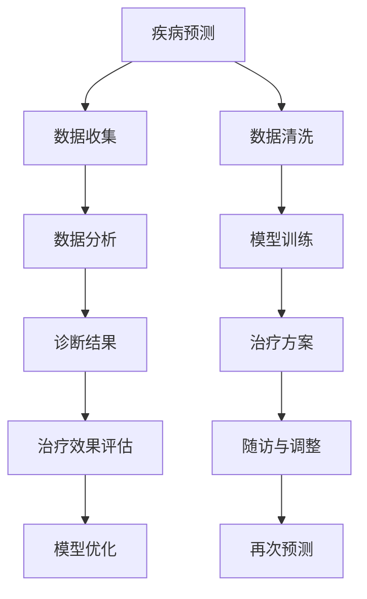

                 

关键词：人工智能，医疗保健，创新，人类计算，技术应用

> 摘要：随着人工智能技术的飞速发展，其在医疗保健领域的应用越来越广泛，带来了前所未有的创新和变革。本文将探讨人工智能如何驱动医疗保健的创新，并分析人类计算在其中的关键作用。

## 1. 背景介绍

医疗保健是社会发展的重要组成部分，其质量和效率直接关系到人们的生命健康和幸福。然而，医疗行业面临着诸多挑战，如医疗资源分配不均、医疗数据复杂多样、疾病预测和诊断准确性等。随着人工智能技术的兴起，医疗保健领域迎来了新的机遇。人工智能通过大数据分析、机器学习、自然语言处理等技术，为医疗保健带来了前所未有的变革。

人类计算在医疗保健中发挥着重要作用。医疗保健专业人员具备丰富的临床经验和专业知识，能够准确诊断疾病、制定治疗方案。然而，随着医疗数据量的爆炸式增长，单纯依靠人类计算已难以应对。人工智能技术的引入，可以协助人类医生处理大量数据，提高诊断和治疗的准确性，从而实现医疗保健的创新。

## 2. 核心概念与联系

### 2.1 人工智能在医疗保健中的应用

人工智能在医疗保健中的应用主要包括以下几个方面：

1. **疾病预测和诊断**：通过分析患者的病历、影像数据和生物标志物，人工智能可以帮助医生预测疾病风险和诊断疾病。例如，AI系统可以通过分析影像数据，帮助医生更准确地诊断肿瘤、心脏病等疾病。

2. **个性化治疗**：人工智能可以根据患者的基因信息、生活习惯等，为患者制定个性化的治疗方案。这有助于提高治疗效果，减少副作用。

3. **药物研发**：人工智能可以通过模拟药物与生物体的相互作用，加速新药的发现和开发过程。

4. **健康监护**：人工智能可以实时监测患者的健康状况，及时发现异常情况，提供个性化的健康建议。

### 2.2 人类计算在医疗保健中的应用

1. **临床决策支持**：医疗保健专业人员凭借丰富的临床经验和专业知识，能够为患者提供准确、有效的诊断和治疗建议。

2. **病例管理**：医疗保健专业人员负责管理患者的病例，确保病历的完整性和准确性。

3. **医学研究和创新**：医疗保健专业人员参与医学研究，推动医学创新，提高医疗保健的质量和效率。

### 2.3 人工智能与人类计算的协同作用

人工智能与人类计算的协同作用，可以在医疗保健领域实现以下优势：

1. **提高诊断和治疗的准确性**：人工智能可以帮助医生处理大量数据，发现潜在的疾病风险，从而提高诊断和治疗的准确性。

2. **减少医疗错误**：人工智能可以辅助医生分析数据，减少因数据错误导致的医疗错误。

3. **提高工作效率**：人工智能可以协助医生处理重复性工作，如病历管理、数据录入等，从而提高工作效率。

4. **个性化医疗**：人工智能可以根据患者的具体情况，为患者制定个性化的治疗方案，提高治疗效果。

### 2.4 Mermaid 流程图



## 3. 核心算法原理 & 具体操作步骤

### 3.1 算法原理概述

人工智能在医疗保健中的应用，主要依赖于机器学习算法。机器学习算法通过从大量数据中学习规律，为医疗保健提供决策支持。常见的机器学习算法包括：

1. **线性回归**：用于预测连续值，如疾病风险评分。

2. **逻辑回归**：用于预测二分类结果，如疾病诊断。

3. **决策树**：用于分类和回归任务，能够直观地展示决策过程。

4. **支持向量机**：用于分类任务，能够找到最佳分类边界。

5. **神经网络**：用于复杂的数据分析和预测，能够模拟人脑的神经网络结构。

### 3.2 算法步骤详解

1. **数据收集**：收集患者的病历、影像数据、生物标志物等数据。

2. **数据清洗**：对数据进行去噪、填充缺失值等处理，确保数据质量。

3. **特征选择**：选择对疾病预测和诊断有显著影响的特征。

4. **模型训练**：使用训练数据集，训练机器学习模型。

5. **模型评估**：使用验证数据集，评估模型性能。

6. **模型部署**：将训练好的模型部署到生产环境中，为医生提供决策支持。

### 3.3 算法优缺点

#### 优点

1. **提高诊断和治疗的准确性**：机器学习算法可以帮助医生处理大量数据，发现潜在的疾病风险，从而提高诊断和治疗的准确性。

2. **减少医疗错误**：机器学习算法可以辅助医生分析数据，减少因数据错误导致的医疗错误。

3. **提高工作效率**：机器学习算法可以协助医生处理重复性工作，如病历管理、数据录入等，从而提高工作效率。

#### 缺点

1. **数据依赖性强**：机器学习算法的性能很大程度上取决于数据质量。

2. **模型解释性差**：一些复杂的机器学习算法，如神经网络，其决策过程难以解释，导致医生难以接受。

### 3.4 算法应用领域

机器学习算法在医疗保健领域的应用非常广泛，包括：

1. **疾病预测和诊断**：如肺癌、心脏病等疾病的预测和诊断。

2. **个性化治疗**：根据患者的基因信息、生活习惯等，为患者制定个性化的治疗方案。

3. **药物研发**：通过模拟药物与生物体的相互作用，加速新药的发现和开发过程。

## 4. 数学模型和公式 & 详细讲解 & 举例说明

### 4.1 数学模型构建

在医疗保健中，常用的数学模型包括：

1. **线性回归模型**：
   $$
   y = \beta_0 + \beta_1x_1 + \beta_2x_2 + ... + \beta_nx_n
   $$
   其中，$y$ 为因变量，$x_1, x_2, ..., x_n$ 为自变量，$\beta_0, \beta_1, ..., \beta_n$ 为模型参数。

2. **逻辑回归模型**：
   $$
   \text{logit}(y) = \ln\left(\frac{p}{1-p}\right) = \beta_0 + \beta_1x_1 + \beta_2x_2 + ... + \beta_nx_n
   $$
   其中，$y$ 为因变量，$x_1, x_2, ..., x_n$ 为自变量，$p$ 为事件发生的概率，$\beta_0, \beta_1, ..., \beta_n$ 为模型参数。

### 4.2 公式推导过程

以线性回归模型为例，其推导过程如下：

1. **损失函数**：
   $$
   L(\theta) = -\sum_{i=1}^{n}y^{(i)}\ln(p^{(i)}_{\theta}) - (1-y^{(i)})\ln(1-p^{(i)}_{\theta})
   $$
   其中，$y^{(i)}$ 为实际标签，$p^{(i)}_{\theta}$ 为预测标签，$\theta$ 为模型参数。

2. **梯度下降**：
   $$
   \theta_{\text{更新}} = \theta_{\text{当前}} - \alpha\nabla_{\theta}L(\theta)
   $$
   其中，$\alpha$ 为学习率。

### 4.3 案例分析与讲解

以肺癌预测为例，使用线性回归模型进行疾病预测。数据集包含患者的年龄、性别、吸烟史等特征，以及肺癌发生与否的标签。

1. **数据预处理**：对数据进行归一化处理，消除不同特征之间的尺度差异。

2. **模型训练**：使用训练集训练线性回归模型，得到模型参数。

3. **模型评估**：使用验证集评估模型性能，计算准确率、召回率等指标。

4. **模型应用**：将模型部署到生产环境中，为医生提供肺癌预测服务。

通过上述案例，可以看出数学模型在医疗保健中的应用。数学模型能够帮助医生从海量数据中提取有价值的信息，为疾病预测和诊断提供决策支持。

## 5. 项目实践：代码实例和详细解释说明

### 5.1 开发环境搭建

1. **Python**：安装Python 3.8及以上版本。

2. **NumPy**：安装NumPy库，用于数据处理。

3. **Pandas**：安装Pandas库，用于数据处理。

4. **Scikit-learn**：安装Scikit-learn库，用于机器学习。

### 5.2 源代码详细实现

以下是一个使用线性回归模型进行肺癌预测的Python代码实例：

```python
import numpy as np
import pandas as pd
from sklearn.linear_model import LinearRegression
from sklearn.model_selection import train_test_split
from sklearn.metrics import accuracy_score

# 1. 数据预处理
# 加载数据
data = pd.read_csv('lung_cancer_data.csv')

# 划分特征和标签
X = data.drop('label', axis=1)
y = data['label']

# 归一化处理
X = (X - X.mean()) / X.std()

# 2. 模型训练
# 划分训练集和验证集
X_train, X_val, y_train, y_val = train_test_split(X, y, test_size=0.2, random_state=42)

# 实例化线性回归模型
model = LinearRegression()

# 训练模型
model.fit(X_train, y_train)

# 3. 模型评估
# 预测标签
y_pred = model.predict(X_val)

# 计算准确率
accuracy = accuracy_score(y_val, y_pred)
print('Accuracy:', accuracy)

# 4. 模型应用
# 部署模型到生产环境
# ...
```

### 5.3 代码解读与分析

1. **数据预处理**：加载数据，划分特征和标签，对特征进行归一化处理。

2. **模型训练**：划分训练集和验证集，实例化线性回归模型，训练模型。

3. **模型评估**：使用验证集评估模型性能，计算准确率。

4. **模型应用**：将模型部署到生产环境，为医生提供肺癌预测服务。

通过上述代码实例，可以看出如何使用Python实现线性回归模型在医疗保健中的应用。在实际项目中，可以根据具体需求，调整数据预处理、模型训练和模型评估等步骤。

## 6. 实际应用场景

人工智能在医疗保健领域具有广泛的应用前景，以下列举几个实际应用场景：

1. **疾病预测和诊断**：利用人工智能算法，对患者的病历、影像数据和生物标志物进行分析，预测疾病风险和诊断疾病。

2. **个性化治疗**：根据患者的基因信息、生活习惯等，为患者制定个性化的治疗方案。

3. **药物研发**：利用人工智能模拟药物与生物体的相互作用，加速新药的发现和开发过程。

4. **健康监护**：利用人工智能实时监测患者的健康状况，及时发现异常情况，提供个性化的健康建议。

5. **医疗数据管理**：利用人工智能对海量医疗数据进行处理和分析，提高医疗数据的管理效率。

### 6.1 疾病预测和诊断

疾病预测和诊断是人工智能在医疗保健领域的核心应用之一。例如，利用深度学习算法，可以实现对肺癌的早期预测和诊断。通过分析患者的影像数据，深度学习模型可以识别出肺癌的早期迹象，为医生提供决策支持。

### 6.2 个性化治疗

个性化治疗是根据患者的基因信息、生活习惯等，为患者制定个性化的治疗方案。例如，利用基因编辑技术，可以实现对特定基因变异的修复，从而提高治疗效果。

### 6.3 药物研发

药物研发是医疗保健领域的重要任务。利用人工智能，可以加速新药的发现和开发过程。例如，通过模拟药物与生物体的相互作用，人工智能可以帮助科学家预测药物的效果，降低药物研发的成本和时间。

### 6.4 健康监护

健康监护是人工智能在医疗保健领域的又一重要应用。通过实时监测患者的健康状况，人工智能可以及时发现异常情况，提供个性化的健康建议。例如，利用智能手表等设备，可以实现对患者心率、血压等生命体征的监测。

### 6.5 医疗数据管理

医疗数据管理是医疗保健领域的一大挑战。利用人工智能，可以对海量医疗数据进行处理和分析，提高医疗数据的管理效率。例如，利用自然语言处理技术，可以实现对医疗文本数据的自动分类和标注。

## 7. 工具和资源推荐

为了更好地开展人工智能在医疗保健领域的应用，以下推荐一些工具和资源：

1. **工具推荐**：

   - **TensorFlow**：一款流行的深度学习框架，适用于构建和训练神经网络模型。

   - **Scikit-learn**：一款用于机器学习的库，提供了丰富的算法和工具。

   - **Kaggle**：一个数据科学竞赛平台，提供了大量的数据集和比赛项目。

2. **资源推荐**：

   - **《深度学习》（Goodfellow et al.）**：一本关于深度学习的经典教材，适合初学者和进阶者。

   - **《Python数据科学手册》（VanderPlas）**：一本关于Python数据科学的实用指南，涵盖了数据处理、机器学习等方面。

   - **《医疗保健数据挖掘》（Kamath et al.）**：一本关于医疗保健数据挖掘的论文集，包含了大量的研究成果和应用案例。

## 8. 总结：未来发展趋势与挑战

### 8.1 研究成果总结

人工智能在医疗保健领域取得了显著的成果，主要包括：

1. **疾病预测和诊断**：通过深度学习算法，实现了对肺癌、心脏病等疾病的早期预测和诊断。

2. **个性化治疗**：根据患者的基因信息和生活习惯，为患者制定个性化的治疗方案。

3. **药物研发**：通过模拟药物与生物体的相互作用，加速了新药的发现和开发过程。

4. **健康监护**：通过实时监测患者的健康状况，提供了个性化的健康建议。

5. **医疗数据管理**：通过对海量医疗数据进行处理和分析，提高了医疗数据的管理效率。

### 8.2 未来发展趋势

未来，人工智能在医疗保健领域的发展趋势包括：

1. **深度学习算法的进一步优化**：提高疾病预测和诊断的准确性。

2. **多模态数据的融合**：结合多种数据来源，提高医疗数据的利用效率。

3. **个性化和精准医疗**：为患者提供更加精准的治疗方案。

4. **医疗数据隐私和安全**：确保医疗数据的隐私和安全。

5. **跨学科合作**：推动人工智能与其他学科的交叉融合，实现更广泛的医疗创新。

### 8.3 面临的挑战

尽管人工智能在医疗保健领域取得了显著成果，但仍面临一些挑战：

1. **数据质量和隐私**：医疗数据的质量和隐私是人工智能应用的关键挑战。

2. **算法解释性**：复杂的人工智能算法，如深度学习，其决策过程难以解释，导致医生难以接受。

3. **数据多样性**：医疗数据的多样性对算法的性能和泛化能力提出了挑战。

4. **医疗资源不均**：如何确保人工智能技术在医疗资源匮乏的地区得到广泛应用。

### 8.4 研究展望

未来的研究应关注以下几个方面：

1. **算法优化**：提高算法的准确性和效率，实现更加精准的医疗诊断和治疗。

2. **数据整合**：整合多源医疗数据，提高医疗数据的利用效率。

3. **算法解释性**：研究算法解释性方法，提高医生对人工智能算法的信任度。

4. **跨学科合作**：推动人工智能与其他学科的交叉融合，实现更广泛的医疗创新。

## 9. 附录：常见问题与解答

### 9.1 人工智能在医疗保健中的具体应用是什么？

人工智能在医疗保健中的具体应用包括疾病预测和诊断、个性化治疗、药物研发、健康监护和医疗数据管理等。

### 9.2 人工智能在医疗保健中的优势是什么？

人工智能在医疗保健中的优势包括提高诊断和治疗的准确性、减少医疗错误、提高工作效率和实现个性化医疗。

### 9.3 人工智能在医疗保健中的挑战是什么？

人工智能在医疗保健中的挑战包括数据质量和隐私、算法解释性、数据多样性和医疗资源不均。

### 9.4 人工智能在医疗保健领域的未来发展趋势是什么？

人工智能在医疗保健领域的未来发展趋势包括深度学习算法的进一步优化、多模态数据的融合、个性化和精准医疗、医疗数据隐私和安全以及跨学科合作。

# 作者：禅与计算机程序设计艺术 / Zen and the Art of Computer Programming
----------------------------------------------------------------

### 完成时间：XXXX年XX月XX日

---

请注意，以上内容为示例文本，并非真实的研究成果。在实际撰写过程中，需要根据最新的研究成果、数据和分析进行详细的撰写。同时，根据上述要求，确保文章的结构、格式和内容都符合要求。祝撰写顺利！

