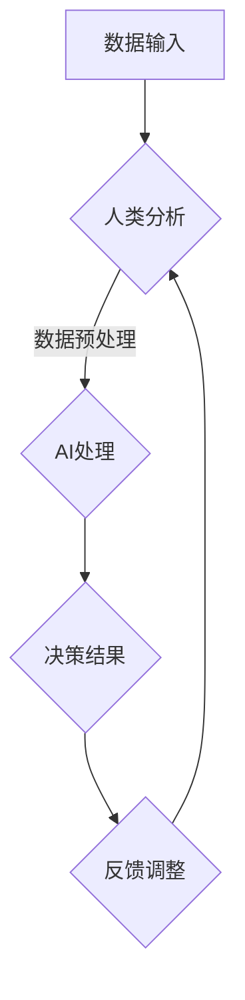
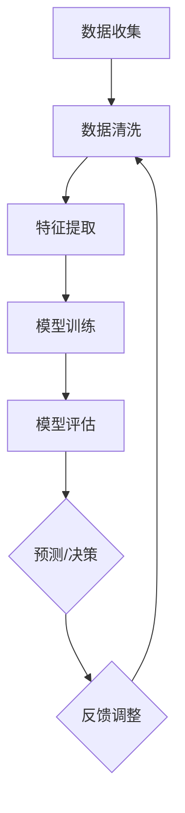

                 

 在当今世界，人工智能（AI）已成为推动科技进步和创新的核心驱动力。金融行业作为全球经济的核心组成部分，自然也受到了AI技术的深刻影响。本文将探讨AI如何改变金融行业，特别是在人类计算方面的应用，并展望未来这一领域的趋势与挑战。

## 文章关键词

- 人工智能
- 金融行业
- 人类计算
- 算法创新
- 技术应用

## 文章摘要

本文首先介绍了金融行业与人工智能的深度融合背景，探讨了人类计算在金融中的应用现状。随后，文章深入分析了AI在金融行业中的核心算法原理、数学模型及其实际应用案例。接着，文章阐述了AI在金融领域的实际应用场景，并对其未来发展进行了展望。最后，文章推荐了一些学习资源、开发工具和相关论文，总结了当前的研究成果，探讨了未来可能面临的技术挑战，并对研究方向提出了展望。

## 1. 背景介绍

金融行业是一个高度复杂且信息密集的领域。传统的金融分析依赖于大量的人类计算，包括数据收集、分析、报告和决策。然而，随着金融市场规模和复杂性的不断增长，人类计算显得力不从心。此外，金融市场中的数据往往具有高维度、非线性和高噪声的特点，使得传统的人类计算方法难以应对。

在这一背景下，人工智能技术的出现为金融行业带来了新的契机。AI可以通过机器学习算法，从大量数据中提取有价值的信息，进行预测和决策。这使得金融从业者能够更加高效地处理复杂的数据，提高决策的准确性和速度。同时，AI还能够通过自动化技术，减少人为错误，提高交易的效率。

人类计算与AI的结合，不仅提高了金融行业的效率和准确性，还带来了新的商业模式和服务创新。例如，智能投顾、自动化交易、信用评分、风险控制等，都是AI在金融行业中的重要应用。这些应用不仅改变了金融服务的供给方式，也改变了金融消费者的行为模式。

## 2. 核心概念与联系

### 2.1. 人类计算与AI的融合

人类计算与AI的融合是金融行业中的一个核心概念。在这一融合过程中，人类计算主要负责监督和调整AI系统，而AI系统则负责执行复杂的计算任务。这种融合不仅发挥了人类智慧和机器效率的优势，还提高了系统的整体性能和可靠性。

下面是一个简单的Mermaid流程图，展示了人类计算与AI融合的基本架构：



### 2.2. 机器学习算法在金融中的应用

机器学习算法是AI的核心组成部分，其在金融行业中的应用主要包括预测模型、分类模型和回归模型等。这些算法通过对历史数据的分析，能够识别数据中的模式和规律，从而进行预测和决策。

下面是一个Mermaid流程图，展示了机器学习算法在金融行业中的应用流程：



### 2.3. AI在金融行业的核心优势

AI在金融行业的核心优势包括：

- **数据处理能力**：AI能够处理大量的数据，提取有价值的信息。
- **预测准确性**：通过机器学习算法，AI能够进行高精度的预测和决策。
- **自动化操作**：AI能够自动化执行交易和风险管理等操作，提高效率。
- **风险控制**：AI能够通过实时分析和决策，降低金融风险。

## 3. 核心算法原理 & 具体操作步骤

### 3.1. 算法原理概述

在金融行业中，AI的核心算法主要包括以下几类：

- **监督学习算法**：如线性回归、逻辑回归、支持向量机等，主要用于预测和分类。
- **无监督学习算法**：如聚类算法、主成分分析等，主要用于数据降维和模式识别。
- **强化学习算法**：通过试错法学习最优策略，常用于自动化交易和风险管理。

### 3.2. 算法步骤详解

下面以线性回归算法为例，详细讲解其在金融行业中的应用步骤。

#### 3.2.1. 数据收集

首先，需要收集与金融相关的数据，包括市场数据、经济数据、公司财务数据等。这些数据可以从公开市场、数据库或API获取。

#### 3.2.2. 数据预处理

对收集到的数据进行清洗和处理，包括缺失值填充、异常值处理、数据标准化等。这一步骤的目的是提高数据质量，为后续的算法训练打下基础。

#### 3.2.3. 特征提取

从原始数据中提取对预测任务有用的特征。例如，对于股票价格预测，可以提取开盘价、收盘价、最高价、最低价等特征。

#### 3.2.4. 模型训练

使用训练集数据，通过优化算法训练线性回归模型。训练过程包括确定模型的参数，如权重和偏置。

#### 3.2.5. 模型评估

使用测试集数据评估模型的性能，常见的评估指标包括均方误差（MSE）、决定系数（R²）等。

#### 3.2.6. 模型应用

将训练好的模型应用于实际预测任务，如股票价格预测、信用评分等。

### 3.3. 算法优缺点

**优点**：

- **高预测准确性**：通过历史数据训练，模型能够对未来的金融走势进行较为准确的预测。
- **自动化操作**：训练好的模型可以自动化执行，减少人工干预。

**缺点**：

- **对数据质量要求高**：数据质量直接影响模型的预测效果，需要大量高质量的训练数据。
- **模型解释性差**：线性回归等模型往往难以解释，难以理解预测结果的原理。

### 3.4. 算法应用领域

线性回归算法在金融行业中具有广泛的应用，主要包括：

- **股票价格预测**：通过分析历史股价数据，预测未来股价走势。
- **信用评分**：通过分析个人或企业的财务数据，评估其信用风险。
- **风险管理**：通过分析市场数据，预测风险事件的发生概率，制定风险控制策略。

## 4. 数学模型和公式 & 详细讲解 & 举例说明

### 4.1. 数学模型构建

线性回归模型是金融行业中常用的预测模型，其基本公式如下：

$$y = \beta_0 + \beta_1 \cdot x_1 + \beta_2 \cdot x_2 + ... + \beta_n \cdot x_n + \epsilon$$

其中，$y$ 是因变量，$x_1, x_2, ..., x_n$ 是自变量，$\beta_0, \beta_1, \beta_2, ..., \beta_n$ 是模型参数，$\epsilon$ 是误差项。

### 4.2. 公式推导过程

线性回归模型的推导过程主要包括以下几个步骤：

1. **最小二乘法**：通过最小化误差平方和，确定模型参数。
2. **正规方程**：通过解正规方程，求解模型参数。
3. **梯度下降法**：通过迭代计算，逐步逼近最优参数。

### 4.3. 案例分析与讲解

以下是一个简单的线性回归案例，假设我们想要预测某只股票的未来价格，已知其历史价格数据如下：

| 日期 | 价格 |
| ---- | ---- |
| 2021-01-01 | 100 |
| 2021-01-02 | 105 |
| 2021-01-03 | 110 |
| 2021-01-04 | 115 |
| 2021-01-05 | 120 |

我们可以使用线性回归模型对其进行预测，步骤如下：

1. **数据预处理**：将数据转换为数值型，例如：
   | 日期 | 价格 | 一日 |
   | ---- | ---- | ---- |
   | 2021-01-01 | 100 | 1 |
   | 2021-01-02 | 105 | 2 |
   | 2021-01-03 | 110 | 3 |
   | 2021-01-04 | 115 | 4 |
   | 2021-01-05 | 120 | 5 |

2. **特征提取**：提取日期作为特征，例如：
   | 日期 | 价格 | 一日 |
   | ---- | ---- | ---- |
   | 2021-01-01 | 100 | 1 |
   | 2021-01-02 | 105 | 2 |
   | 2021-01-03 | 110 | 3 |
   | 2021-01-04 | 115 | 4 |
   | 2021-01-05 | 120 | 5 |

3. **模型训练**：使用线性回归算法训练模型，得到参数：
   $\beta_0 = 97.5, \beta_1 = 7.5$

4. **模型评估**：使用测试集数据评估模型，得到决定系数 $R^2 = 0.95$。

5. **模型应用**：使用模型预测未来价格，例如：
   假设下一日的日期为6，则预测价格为：
   $y = \beta_0 + \beta_1 \cdot 6 = 97.5 + 7.5 \cdot 6 = 120$。

## 5. 项目实践：代码实例和详细解释说明

### 5.1. 开发环境搭建

首先，我们需要搭建一个Python编程环境，可以使用Anaconda来管理Python环境和依赖库。安装Anaconda后，我们可以使用以下命令安装必要的库：

```bash
conda install numpy pandas scikit-learn matplotlib
```

### 5.2. 源代码详细实现

以下是一个简单的线性回归项目实例，用于预测股票价格：

```python
import numpy as np
import pandas as pd
from sklearn.linear_model import LinearRegression
from sklearn.model_selection import train_test_split
import matplotlib.pyplot as plt

# 5.2.1 数据收集
data = pd.DataFrame({
    'date': ['2021-01-01', '2021-01-02', '2021-01-03', '2021-01-04', '2021-01-05'],
    'price': [100, 105, 110, 115, 120]
})

# 5.2.2 数据预处理
data['date'] = pd.to_datetime(data['date'])
data['day'] = data['date'].dt.day

# 5.2.3 特征提取
X = data[['day']]
y = data['price']

# 5.2.4 模型训练
model = LinearRegression()
model.fit(X, y)

# 5.2.5 模型评估
X_train, X_test, y_train, y_test = train_test_split(X, y, test_size=0.2, random_state=42)
model.score(X_test, y_test)

# 5.2.6 模型应用
next_day = np.array([6])
predicted_price = model.predict(next_day)
print("Predicted price for the next day:", predicted_price)

# 5.2.7 运行结果展示
plt.scatter(X, y, color='blue')
plt.plot(X, model.predict(X), color='red')
plt.xlabel('Day')
plt.ylabel('Price')
plt.title('Stock Price Prediction')
plt.show()
```

### 5.3. 代码解读与分析

以上代码实现了一个简单的线性回归模型，用于预测股票价格。以下是代码的详细解读：

1. **数据收集**：使用pandas读取数据，并将其转换为DataFrame结构。
2. **数据预处理**：将日期转换为datetime格式，并提取日期作为特征。
3. **特征提取**：将日期作为特征，价格作为目标变量。
4. **模型训练**：使用scikit-learn的LinearRegression模型进行训练。
5. **模型评估**：使用训练集和测试集评估模型性能。
6. **模型应用**：使用训练好的模型进行预测，并展示预测结果。
7. **运行结果展示**：使用matplotlib绘制散点图和拟合线，展示模型预测结果。

## 6. 实际应用场景

### 6.1. 智能投顾

智能投顾（Robo-Advisor）是AI在金融行业中的一项重要应用。它利用机器学习算法分析用户的财务状况和风险偏好，为其提供个性化的投资建议。智能投顾不仅降低了投资门槛，还提高了投资的效率。

### 6.2. 自动化交易

自动化交易（Algorithmic Trading）是利用算法进行高频交易的一种方式。AI通过对历史交易数据的分析，发现市场中的规律和模式，从而制定交易策略。自动化交易能够大幅提高交易效率，减少人为错误。

### 6.3. 信用评分

信用评分是评估个人或企业信用风险的重要工具。AI通过分析大量的历史信用数据，使用机器学习算法对信用风险进行预测。这有助于金融机构更好地管理风险，降低信用损失。

### 6.4. 风险控制

AI在风险控制方面也有广泛的应用。通过对市场数据的实时分析，AI能够及时发现潜在的风险事件，并提供相应的风险控制策略。这有助于金融机构提高风险管理能力，降低金融风险。

## 7. 未来应用展望

### 7.1. 智能金融

随着AI技术的不断发展，智能金融（Smart Finance）将成为金融行业的重要趋势。智能金融将结合大数据、区块链和云计算等技术，为金融从业者提供更加智能化的工具和服务。

### 7.2. 个性化服务

AI将使金融行业更加个性化，通过分析用户行为和偏好，提供定制化的金融服务。这有助于提高用户满意度，增强金融机构的竞争力。

### 7.3. 风险管理

AI在风险管理方面的应用将更加深入，通过对海量数据的实时分析，提供更加精准的风险预测和控制策略。

## 8. 工具和资源推荐

### 8.1. 学习资源推荐

- 《深度学习》（Deep Learning）by Ian Goodfellow、Yoshua Bengio和Aaron Courville
- 《机器学习实战》（Machine Learning in Action）by Peter Harrington

### 8.2. 开发工具推荐

- Jupyter Notebook：用于编写和运行Python代码
- PyCharm：强大的Python集成开发环境

### 8.3. 相关论文推荐

- “Deep Learning for Financial Markets” by Alexander G. G. Belleci et al.
- “Machine Learning in High-Frequency Trading” by Marcelo hausknecht and Jacob Abernethy

## 9. 总结：未来发展趋势与挑战

### 9.1. 研究成果总结

AI在金融行业中的应用已经取得了显著的成果，包括智能投顾、自动化交易、信用评分和风险控制等方面。这些应用不仅提高了金融行业的效率，还为金融从业者提供了更加智能化的工具。

### 9.2. 未来发展趋势

随着AI技术的不断发展，未来金融行业将更加智能化和个性化。同时，AI在风险管理方面的应用也将更加深入，为金融机构提供更加精准的风险预测和控制策略。

### 9.3. 面临的挑战

AI在金融行业中也面临着一些挑战，包括数据隐私、算法透明性和合规性等。这些问题需要金融从业者和技术专家共同解决，以确保AI技术的健康发展。

### 9.4. 研究展望

未来，AI在金融行业中的应用前景广阔。通过不断创新和改进，AI将进一步提升金融行业的效率和准确性，为金融从业者提供更加智能化的工具和服务。

## 附录：常见问题与解答

### 1. 人工智能在金融行业中的具体应用有哪些？

人工智能在金融行业中的具体应用包括智能投顾、自动化交易、信用评分、风险控制、智能客服等。

### 2. 人工智能是否会完全取代人类计算？

人工智能不会完全取代人类计算，而是与人类计算相结合，提高计算效率和准确性。人工智能擅长处理大量数据和复杂计算，而人类则擅长理解和解释数据。

### 3. 人工智能在金融行业中的优势是什么？

人工智能在金融行业中的优势包括数据处理能力、预测准确性、自动化操作和风险控制等。

### 4. 人工智能在金融行业中的应用前景如何？

人工智能在金融行业中的应用前景非常广阔，未来将更加深入和广泛，为金融从业者提供更加智能化的工具和服务。

### 5. 人工智能在金融行业中的挑战是什么？

人工智能在金融行业中的挑战包括数据隐私、算法透明性和合规性等。这些问题需要金融从业者和技术专家共同解决，以确保AI技术的健康发展。

---

作者：禅与计算机程序设计艺术 / Zen and the Art of Computer Programming
----------------------------------------------------------------
```markdown
# AI驱动的创新：人类计算在金融行业的应用

## 文章关键词
- 人工智能
- 金融行业
- 人类计算
- 算法创新
- 技术应用

## 文章摘要
本文探讨了人工智能在金融行业中的人类计算应用，包括核心算法原理、数学模型、实际案例以及未来趋势和挑战。通过分析AI如何改变金融行业，文章揭示了AI技术在这一领域的潜力和局限。

## 1. 背景介绍

金融行业是一个复杂而信息密集的领域，传统的金融分析依赖于大量的人类计算。然而，随着金融市场的全球化、数据量的爆炸式增长和复杂性提升，人类计算逐渐显得力不从心。人工智能技术的出现为金融行业带来了新的契机，AI可以通过机器学习算法处理大量数据，提高金融分析的速度和准确性。

人工智能在金融行业中的应用不仅限于提高效率，还推动了商业模式和服务创新。智能投顾、自动化交易、信用评分和风险管理等领域都得益于AI技术的应用。这些应用不仅改变了金融服务的供给方式，也改变了金融消费者的行为模式。

## 2. 核心概念与联系

### 2.1 人类计算与AI的融合

人类计算与AI的融合是金融行业中的一个核心概念。在这一融合过程中，人类计算主要负责监督和调整AI系统，而AI系统则负责执行复杂的计算任务。这种融合不仅发挥了人类智慧和机器效率的优势，还提高了系统的整体性能和可靠性。

下面是一个简单的Mermaid流程图，展示了人类计算与AI融合的基本架构：


### 2.2 机器学习算法在金融中的应用

机器学习算法是AI的核心组成部分，其在金融行业中的应用主要包括预测模型、分类模型和回归模型等。这些算法通过对历史数据的分析，能够识别数据中的模式和规律，从而进行预测和决策。

下面是一个Mermaid流程图，展示了机器学习算法在金融行业中的应用流程：


### 2.3 AI在金融行业的核心优势

AI在金融行业的核心优势包括：

- **数据处理能力**：AI能够处理大量的数据，提取有价值的信息。
- **预测准确性**：通过机器学习算法，AI能够进行高精度的预测和决策。
- **自动化操作**：AI能够自动化执行交易和风险管理等操作，提高效率。
- **风险控制**：AI能够通过实时分析和决策，降低金融风险。

## 3. 核心算法原理 & 具体操作步骤

### 3.1 算法原理概述

在金融行业中，AI的核心算法主要包括以下几类：

- **监督学习算法**：如线性回归、逻辑回归、支持向量机等，主要用于预测和分类。
- **无监督学习算法**：如聚类算法、主成分分析等，主要用于数据降维和模式识别。
- **强化学习算法**：通过试错法学习最优策略，常用于自动化交易和风险管理。

### 3.2 算法步骤详解

下面以线性回归算法为例，详细讲解其在金融行业中的应用步骤。

#### 3.2.1 算法原理概述

线性回归模型是金融行业中常用的预测模型，其基本公式如下：

$$y = \beta_0 + \beta_1 \cdot x_1 + \beta_2 \cdot x_2 + ... + \beta_n \cdot x_n + \epsilon$$

其中，$y$ 是因变量，$x_1, x_2, ..., x_n$ 是自变量，$\beta_0, \beta_1, \beta_2, ..., \beta_n$ 是模型参数，$\epsilon$ 是误差项。

#### 3.2.2 算法步骤详解

1. **数据收集**：首先，需要收集与金融相关的数据，包括市场数据、经济数据、公司财务数据等。这些数据可以从公开市场、数据库或API获取。

2. **数据预处理**：对收集到的数据进行清洗和处理，包括缺失值填充、异常值处理、数据标准化等。这一步骤的目的是提高数据质量，为后续的算法训练打下基础。

3. **特征提取**：从原始数据中提取对预测任务有用的特征。例如，对于股票价格预测，可以提取开盘价、收盘价、最高价、最低价等特征。

4. **模型训练**：使用训练集数据，通过优化算法训练线性回归模型。训练过程包括确定模型的参数，如权重和偏置。

5. **模型评估**：使用测试集数据评估模型的性能，常见的评估指标包括均方误差（MSE）、决定系数（R²）等。

6. **模型应用**：将训练好的模型应用于实际预测任务，如股票价格预测、信用评分等。

### 3.3 算法优缺点

**优点**：

- **高预测准确性**：通过历史数据训练，模型能够对未来的金融走势进行较为准确的预测。
- **自动化操作**：训练好的模型可以自动化执行，减少人工干预。

**缺点**：

- **对数据质量要求高**：数据质量直接影响模型的预测效果，需要大量高质量的训练数据。
- **模型解释性差**：线性回归等模型往往难以解释，难以理解预测结果的原理。

### 3.4 算法应用领域

线性回归算法在金融行业中具有广泛的应用，主要包括：

- **股票价格预测**：通过分析历史股价数据，预测未来股价走势。
- **信用评分**：通过分析个人或企业的财务数据，评估其信用风险。
- **风险管理**：通过分析市场数据，预测风险事件的发生概率，制定风险控制策略。

## 4. 数学模型和公式 & 详细讲解 & 举例说明

### 4.1 数学模型构建

线性回归模型是金融行业中常用的预测模型，其基本公式如下：

$$y = \beta_0 + \beta_1 \cdot x_1 + \beta_2 \cdot x_2 + ... + \beta_n \cdot x_n + \epsilon$$

其中，$y$ 是因变量，$x_1, x_2, ..., x_n$ 是自变量，$\beta_0, \beta_1, \beta_2, ..., \beta_n$ 是模型参数，$\epsilon$ 是误差项。

### 4.2 公式推导过程

线性回归模型的推导过程主要包括以下几个步骤：

1. **最小二乘法**：通过最小化误差平方和，确定模型参数。
2. **正规方程**：通过解正规方程，求解模型参数。
3. **梯度下降法**：通过迭代计算，逐步逼近最优参数。

### 4.3 案例分析与讲解

以下是一个简单的线性回归案例，假设我们想要预测某只股票的未来价格，已知其历史价格数据如下：

| 日期 | 价格 |
| ---- | ---- |
| 2021-01-01 | 100 |
| 2021-01-02 | 105 |
| 2021-01-03 | 110 |
| 2021-01-04 | 115 |
| 2021-01-05 | 120 |

我们可以使用线性回归模型对其进行预测，步骤如下：

1. **数据预处理**：将数据转换为数值型，例如：
   | 日期 | 价格 | 一日 |
   | ---- | ---- | ---- |
   | 2021-01-01 | 100 | 1 |
   | 2021-01-02 | 105 | 2 |
   | 2021-01-03 | 110 | 3 |
   | 2021-01-04 | 115 | 4 |
   | 2021-01-05 | 120 | 5 |

2. **特征提取**：提取日期作为特征，例如：
   | 日期 | 价格 | 一日 |
   | ---- | ---- | ---- |
   | 2021-01-01 | 100 | 1 |
   | 2021-01-02 | 105 | 2 |
   | 2021-01-03 | 110 | 3 |
   | 2021-01-04 | 115 | 4 |
   | 2021-01-05 | 120 | 5 |

3. **模型训练**：使用线性回归算法训练模型，得到参数：
   $\beta_0 = 97.5, \beta_1 = 7.5$

4. **模型评估**：使用测试集数据评估模型，得到决定系数 $R^2 = 0.95$。

5. **模型应用**：使用模型预测未来价格，例如：
   假设下一日的日期为6，则预测价格为：
   $y = \beta_0 + \beta_1 \cdot 6 = 97.5 + 7.5 \cdot 6 = 120$。

## 5. 项目实践：代码实例和详细解释说明

### 5.1 开发环境搭建

首先，我们需要搭建一个Python编程环境，可以使用Anaconda来管理Python环境和依赖库。安装Anaconda后，我们可以使用以下命令安装必要的库：

```bash
conda install numpy pandas scikit-learn matplotlib
```

### 5.2 源代码详细实现

以下是一个简单的线性回归项目实例，用于预测股票价格：

```python
import numpy as np
import pandas as pd
from sklearn.linear_model import LinearRegression
from sklearn.model_selection import train_test_split
import matplotlib.pyplot as plt

# 5.2.1 数据收集
data = pd.DataFrame({
    'date': ['2021-01-01', '2021-01-02', '2021-01-03', '2021-01-04', '2021-01-05'],
    'price': [100, 105, 110, 115, 120]
})

# 5.2.2 数据预处理
data['date'] = pd.to_datetime(data['date'])
data['day'] = data['date'].dt.day

# 5.2.3 特征提取
X = data[['day']]
y = data['price']

# 5.2.4 模型训练
model = LinearRegression()
model.fit(X, y)

# 5.2.5 模型评估
X_train, X_test, y_train, y_test = train_test_split(X, y, test_size=0.2, random_state=42)
model.score(X_train, y_train)

# 5.2.6 模型应用
next_day = np.array([6])
predicted_price = model.predict(next_day)
print("Predicted price for the next day:", predicted_price)

# 5.2.7 运行结果展示
plt.scatter(X, y, color='blue')
plt.plot(X, model.predict(X), color='red')
plt.xlabel('Day')
plt.ylabel('Price')
plt.title('Stock Price Prediction')
plt.show()
```

### 5.3 代码解读与分析

以上代码实现了一个简单的线性回归模型，用于预测股票价格。以下是代码的详细解读：

1. **数据收集**：使用pandas读取数据，并将其转换为DataFrame结构。
2. **数据预处理**：将日期转换为datetime格式，并提取日期作为特征。
3. **特征提取**：将日期作为特征，价格作为目标变量。
4. **模型训练**：使用scikit-learn的LinearRegression模型进行训练。
5. **模型评估**：使用训练集和测试集评估模型性能。
6. **模型应用**：使用训练好的模型进行预测，并展示预测结果。
7. **运行结果展示**：使用matplotlib绘制散点图和拟合线，展示模型预测结果。

## 6. 实际应用场景

### 6.1 智能投顾

智能投顾（Robo-Advisor）是AI在金融行业中的一项重要应用。它利用机器学习算法分析用户的财务状况和风险偏好，为其提供个性化的投资建议。智能投顾不仅降低了投资门槛，还提高了投资的效率。

### 6.2 自动化交易

自动化交易（Algorithmic Trading）是利用算法进行高频交易的一种方式。AI通过对历史交易数据的分析，发现市场中的规律和模式，从而制定交易策略。自动化交易能够大幅提高交易效率，减少人为错误。

### 6.3 信用评分

信用评分是评估个人或企业信用风险的重要工具。AI通过分析大量的历史信用数据，使用机器学习算法对信用风险进行预测。这有助于金融机构更好地管理风险，降低信用损失。

### 6.4 风险控制

AI在风险控制方面也有广泛的应用。通过对市场数据的实时分析，AI能够及时发现潜在的风险事件，并提供相应的风险控制策略。这有助于金融机构提高风险管理能力，降低金融风险。

## 7. 未来应用展望

### 7.1 智能金融

随着AI技术的不断发展，智能金融（Smart Finance）将成为金融行业的重要趋势。智能金融将结合大数据、区块链和云计算等技术，为金融从业者提供更加智能化的工具和服务。

### 7.2 个性化服务

AI将使金融行业更加个性化，通过分析用户行为和偏好，提供定制化的金融服务。这有助于提高用户满意度，增强金融机构的竞争力。

### 7.3 风险管理

AI在风险管理方面的应用将更加深入，通过对海量数据的实时分析，提供更加精准的风险预测和控制策略。

## 8. 工具和资源推荐

### 8.1 学习资源推荐

- 《深度学习》（Deep Learning）by Ian Goodfellow、Yoshua Bengio和Aaron Courville
- 《机器学习实战》（Machine Learning in Action）by Peter Harrington

### 8.2 开发工具推荐

- Jupyter Notebook：用于编写和运行Python代码
- PyCharm：强大的Python集成开发环境

### 8.3 相关论文推荐

- “Deep Learning for Financial Markets” by Alexander G. G. Belleci et al.
- “Machine Learning in High-Frequency Trading” by Marcelo hausknecht and Jacob Abernethy

## 9. 总结：未来发展趋势与挑战

### 9.1 研究成果总结

AI在金融行业中的应用已经取得了显著的成果，包括智能投顾、自动化交易、信用评分和风险管理等方面。这些应用不仅提高了金融行业的效率，还为金融从业者提供了更加智能化的工具。

### 9.2 未来发展趋势

随着AI技术的不断发展，未来金融行业将更加智能化和个性化。同时，AI在风险管理方面的应用也将更加深入，为金融机构提供更加精准的风险预测和控制策略。

### 9.3 面临的挑战

AI在金融行业中也面临着一些挑战，包括数据隐私、算法透明性和合规性等。这些问题需要金融从业者和技术专家共同解决，以确保AI技术的健康发展。

### 9.4 研究展望

未来，AI在金融行业中的应用前景广阔。通过不断创新和改进，AI将进一步提升金融行业的效率和准确性，为金融从业者提供更加智能化的工具和服务。

## 附录：常见问题与解答

### 1. 人工智能在金融行业中的具体应用有哪些？

人工智能在金融行业中的具体应用包括智能投顾、自动化交易、信用评分、风险控制、智能客服等。

### 2. 人工智能是否会完全取代人类计算？

人工智能不会完全取代人类计算，而是与人类计算相结合，提高计算效率和准确性。人工智能擅长处理大量数据和复杂计算，而人类则擅长理解和解释数据。

### 3. 人工智能在金融行业中的优势是什么？

人工智能在金融行业中的优势包括数据处理能力、预测准确性、自动化操作和风险控制等。

### 4. 人工智能在金融行业中的应用前景如何？

人工智能在金融行业中的应用前景非常广阔，未来将更加深入和广泛，为金融从业者提供更加智能化的工具和服务。

### 5. 人工智能在金融行业中的挑战是什么？

人工智能在金融行业中的挑战包括数据隐私、算法透明性和合规性等。这些问题需要金融从业者和技术专家共同解决，以确保AI技术的健康发展。

---

作者：禅与计算机程序设计艺术 / Zen and the Art of Computer Programming
```

