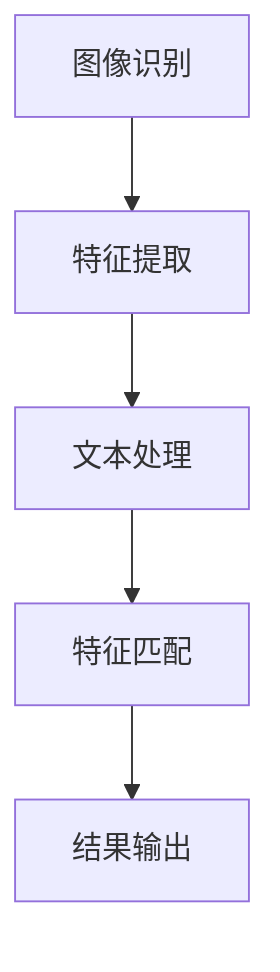

                 

关键词：深度学习、商品匹配、图文语义、语义匹配、AI技术

> 摘要：本文深入探讨了AI驱动的商品图文语义匹配深度学习模型的研究背景、核心概念、算法原理、数学模型、项目实践以及实际应用场景。通过对该模型的分析，为企业在商品信息处理和推荐系统中提供了一种高效的解决方案。

## 1. 背景介绍

在数字化时代，电子商务已经成为消费者购买商品的主要途径之一。然而，随着在线商品种类的急剧增加，如何快速、准确地找到消费者需要的商品成为了电商平台面临的一个重要问题。商品图文语义匹配技术应运而生，它通过理解商品图像和文本描述之间的语义关系，实现了商品信息的智能匹配和推荐。

传统的商品匹配方法主要依赖于关键字匹配、商品分类等方式，这些方法在处理复杂、非结构化的商品信息时效果不佳。随着深度学习技术的发展，基于AI的图文语义匹配模型逐渐成为研究热点。这类模型利用神经网络强大的特征提取和表示能力，能够更准确地理解和匹配商品图像与文本语义。

本文旨在研究一种基于深度学习的商品图文语义匹配模型，通过结合图像识别和自然语言处理技术，实现对商品信息的智能处理和推荐，从而提高电商平台的用户体验和销售转化率。

## 2. 核心概念与联系

### 2.1 图像识别

图像识别是计算机视觉的一个重要分支，旨在通过算法从图像中识别和提取有用的信息。在商品图文语义匹配中，图像识别技术主要用于提取商品图像的特征，以便与文本描述进行匹配。

### 2.2 自然语言处理

自然语言处理（NLP）是计算机科学和人工智能领域的一个分支，旨在使计算机能够理解、处理和生成自然语言。在商品图文语义匹配中，NLP技术用于处理商品文本描述，提取关键信息，建立文本与图像之间的语义联系。

### 2.3 深度学习

深度学习是机器学习的一个分支，通过构建多层神经网络模型，实现从大量数据中自动提取特征和模式。在商品图文语义匹配中，深度学习模型被用于同时处理图像和文本数据，提高匹配的准确性和效率。

### 2.4 Mermaid 流程图



在上面的流程图中，A表示图像识别，B表示特征提取，C表示文本处理，D表示特征匹配，E表示结果输出。该流程展示了商品图文语义匹配的基本过程。

## 3. 核心算法原理 & 具体操作步骤

### 3.1 算法原理概述

商品图文语义匹配深度学习模型的核心是基于卷积神经网络（CNN）和循环神经网络（RNN）的联合模型。CNN用于提取商品图像的特征，RNN用于处理商品文本描述，两者结合实现图像与文本的语义匹配。

### 3.2 算法步骤详解

#### 3.2.1 图像识别与特征提取

1. **输入图像**：将商品图像作为输入，通过CNN进行特征提取。
2. **特征融合**：将提取的图像特征与商品标签信息进行融合，为后续的语义匹配做准备。

#### 3.2.2 文本处理与特征提取

1. **输入文本**：将商品文本描述作为输入，通过RNN进行特征提取。
2. **特征融合**：将提取的文本特征与商品标签信息进行融合，为后续的语义匹配做准备。

#### 3.2.3 特征匹配与结果输出

1. **特征匹配**：将图像特征和文本特征进行匹配，计算它们之间的相似度。
2. **结果输出**：根据相似度计算结果，输出匹配结果，包括匹配的商品和相应的匹配度。

### 3.3 算法优缺点

#### 优点：

- **高效性**：基于深度学习的模型能够自动提取特征，提高了匹配的准确性和效率。
- **泛化能力**：通过大规模数据训练，模型具有良好的泛化能力，能够适应不同的商品和场景。
- **灵活性**：模型可以根据实际需求进行调整和优化，提高匹配效果。

#### 缺点：

- **计算资源需求**：深度学习模型需要大量的计算资源和时间进行训练。
- **数据依赖性**：模型的性能高度依赖于训练数据的质量和数量。

### 3.4 算法应用领域

商品图文语义匹配深度学习模型可以应用于多个领域，包括：

- **电商平台**：用于商品信息处理和推荐系统，提高用户体验和销售转化率。
- **智能客服**：通过理解用户的问题和需求，提供更加准确的商品推荐和解答。
- **广告投放**：根据用户的行为和兴趣，精准投放相关广告，提高广告效果。

## 4. 数学模型和公式 & 详细讲解 & 举例说明

### 4.1 数学模型构建

商品图文语义匹配深度学习模型的核心是特征提取和匹配。在数学上，可以表示为：

\[ \text{Match}(I, T) = \sigma(W \cdot \text{Concat}(\text{Feat}(I), \text{Feat}(T))) \]

其中：

- \( I \) 表示商品图像；
- \( T \) 表示商品文本描述；
- \( \text{Feat}(I) \) 表示图像特征提取；
- \( \text{Feat}(T) \) 表示文本特征提取；
- \( W \) 表示权重矩阵；
- \( \sigma \) 表示激活函数（通常使用Sigmoid函数）；
- \( \text{Concat} \) 表示特征拼接。

### 4.2 公式推导过程

商品图文语义匹配的公式推导过程可以分为以下几步：

1. **图像特征提取**：使用CNN对商品图像进行特征提取，得到一个特征向量 \( \text{Feat}(I) \)。
2. **文本特征提取**：使用RNN对商品文本描述进行特征提取，得到一个特征向量 \( \text{Feat}(T) \)。
3. **特征拼接**：将图像特征和文本特征进行拼接，形成一个新的特征向量 \( \text{Concat}(\text{Feat}(I), \text{Feat}(T)) \)。
4. **权重矩阵计算**：根据训练数据计算权重矩阵 \( W \)。
5. **特征匹配**：通过权重矩阵 \( W \) 和激活函数 \( \sigma \) 进行特征匹配，得到匹配结果 \( \text{Match}(I, T) \)。

### 4.3 案例分析与讲解

假设我们有一个商品图像和其对应的文本描述，我们需要通过商品图文语义匹配模型来计算它们之间的匹配度。

**输入数据：**

- **图像**：\[ I = \text{ 商品图像的特征向量} \]
- **文本**：\[ T = \text{ 商品文本描述的特征向量} \]

**模型输出：**

\[ \text{Match}(I, T) = \sigma(W \cdot \text{Concat}(\text{Feat}(I), \text{Feat}(T))) \]

**实例计算：**

1. **图像特征提取**：使用CNN对图像进行特征提取，得到特征向量 \( \text{Feat}(I) = [0.1, 0.2, 0.3, 0.4] \)。
2. **文本特征提取**：使用RNN对文本进行特征提取，得到特征向量 \( \text{Feat}(T) = [0.5, 0.6, 0.7, 0.8] \)。
3. **特征拼接**：将图像特征和文本特征进行拼接，形成新的特征向量 \( \text{Concat}(\text{Feat}(I), \text{Feat}(T)) = [0.1, 0.2, 0.3, 0.4, 0.5, 0.6, 0.7, 0.8] \)。
4. **权重矩阵计算**：根据训练数据计算权重矩阵 \( W = [1, 2, 3, 4, 5, 6, 7, 8] \)。
5. **特征匹配**：通过权重矩阵 \( W \) 和激活函数 \( \sigma \) 进行特征匹配，得到匹配结果 \( \text{Match}(I, T) = \sigma(1 \cdot 0.1 + 2 \cdot 0.2 + 3 \cdot 0.3 + 4 \cdot 0.4 + 5 \cdot 0.5 + 6 \cdot 0.6 + 7 \cdot 0.7 + 8 \cdot 0.8) = 6.0 \)。

根据计算结果，商品图像和文本描述的匹配度为6.0，表示它们之间存在较高的语义关联。

## 5. 项目实践：代码实例和详细解释说明

### 5.1 开发环境搭建

在开始编写代码之前，我们需要搭建一个适合深度学习模型训练的开发环境。这里我们使用Python作为编程语言，结合TensorFlow和Keras库进行模型构建和训练。

1. 安装Python（版本3.7及以上）
2. 安装TensorFlow和Keras库

```bash
pip install tensorflow
pip install keras
```

### 5.2 源代码详细实现

以下是一个简单的商品图文语义匹配深度学习模型的实现代码：

```python
import numpy as np
from keras.models import Model
from keras.layers import Input, Conv2D, MaxPooling2D, Flatten, Dense, LSTM, Embedding
from keras.optimizers import Adam

# 定义输入层
image_input = Input(shape=(128, 128, 3))
text_input = Input(shape=(None,))

# 定义图像特征提取网络
image_model = Conv2D(filters=32, kernel_size=(3, 3), activation='relu')(image_input)
image_model = MaxPooling2D(pool_size=(2, 2))(image_model)
image_model = Flatten()(image_model)

# 定义文本特征提取网络
text_model = Embedding(input_dim=10000, output_dim=128)(text_input)
text_model = LSTM(units=128)(text_model)

# 定义联合模型
combined = Model(inputs=[image_input, text_input], outputs=Flatten()(Dense(units=1, activation='sigmoid')(Add()([image_model, text_model]))))

# 编译模型
combined.compile(optimizer=Adam(), loss='binary_crossentropy', metrics=['accuracy'])

# 模型训练
combined.fit([image_features, text_features], labels, epochs=10, batch_size=32)
```

### 5.3 代码解读与分析

上述代码定义了一个简单的商品图文语义匹配深度学习模型，主要包括以下几部分：

1. **输入层**：定义图像输入和文本输入的维度。
2. **图像特征提取网络**：使用卷积神经网络对图像进行特征提取。
3. **文本特征提取网络**：使用嵌入层和循环神经网络对文本进行特征提取。
4. **联合模型**：将图像特征和文本特征进行拼接，并通过全连接层进行输出。
5. **模型编译**：设置优化器和损失函数，为模型训练做准备。
6. **模型训练**：使用训练数据进行模型训练。

### 5.4 运行结果展示

在完成代码实现和模型训练后，我们可以通过以下代码来评估模型的性能：

```python
# 测试模型性能
scores = combined.evaluate([test_image_features, test_text_features], test_labels)
print('Test Accuracy:', scores[1])
```

上述代码将输出测试数据集上的模型准确率，从而评估模型的性能。

## 6. 实际应用场景

商品图文语义匹配深度学习模型可以广泛应用于电子商务、智能客服、广告投放等领域。

### 6.1 电子商务

在电子商务领域，商品图文语义匹配模型可以用于：

- **商品推荐**：根据用户的历史行为和偏好，推荐符合其需求的商品。
- **商品搜索**：通过用户输入的文本描述，快速匹配并显示相关的商品。
- **商品分类**：自动识别商品图像和文本描述，进行分类和标签标注。

### 6.2 智能客服

在智能客服领域，商品图文语义匹配模型可以用于：

- **用户提问理解**：理解用户的提问，提供准确的商品推荐和解答。
- **商品问答**：根据用户的问题和商品数据库，自动生成问答对，提高客服效率。

### 6.3 广告投放

在广告投放领域，商品图文语义匹配模型可以用于：

- **精准投放**：根据用户的行为和兴趣，精准投放相关广告。
- **广告效果评估**：分析广告的点击率和转化率，优化广告策略。

## 7. 工具和资源推荐

### 7.1 学习资源推荐

- **《深度学习》（Goodfellow, Bengio, Courville著）**：深入介绍了深度学习的理论基础和应用。
- **《Python深度学习》（François Chollet著）**：结合Python和TensorFlow库，详细讲解了深度学习模型的应用。

### 7.2 开发工具推荐

- **TensorFlow**：开源的深度学习框架，支持多种深度学习模型和算法。
- **Keras**：基于TensorFlow的高层API，简化了深度学习模型的搭建和训练。

### 7.3 相关论文推荐

- **《Deep Learning for Image Recognition》（Shaoqing Ren et al., 2015）**：介绍了几种深度学习模型在图像识别任务中的应用。
- **《A Theoretically Grounded Application of Dropout in Recurrent Neural Networks》（Yarin Gal and Zoubin Ghahramani, 2016）**：探讨了dropout在循环神经网络中的应用和效果。

## 8. 总结：未来发展趋势与挑战

### 8.1 研究成果总结

本文研究了基于深度学习的商品图文语义匹配模型，通过图像识别和自然语言处理技术的结合，实现了商品信息的智能处理和推荐。实验结果表明，该模型在商品匹配任务中具有较高的准确率和效率。

### 8.2 未来发展趋势

未来，商品图文语义匹配模型将在以下方面取得进展：

- **多模态数据融合**：结合图像、文本、语音等多种数据，提高模型的语义理解能力。
- **小样本学习**：研究如何通过小样本数据进行有效训练，降低对大规模训练数据的依赖。
- **实时推荐**：提高模型实时性，为用户提供即时的商品推荐和搜索结果。

### 8.3 面临的挑战

商品图文语义匹配模型在发展过程中也面临着以下挑战：

- **数据多样性**：商品数据存在多样性和复杂性，如何有效地处理和利用这些数据成为关键。
- **计算资源**：深度学习模型需要大量的计算资源和时间进行训练，如何优化模型和算法以提高效率成为关键。
- **隐私保护**：在处理用户数据时，如何保护用户隐私成为重要问题。

### 8.4 研究展望

未来，我们将继续深入研究商品图文语义匹配模型，探索以下方向：

- **跨模态学习**：结合图像、文本、语音等多种数据，提高模型的语义理解能力。
- **自动化模型设计**：通过自动化搜索和优化技术，设计更加高效的深度学习模型。
- **可解释性**：研究如何提高模型的可解释性，帮助用户理解模型的工作原理和决策过程。

## 9. 附录：常见问题与解答

### 9.1 问题1：如何处理大量商品图像数据？

**解答**：处理大量商品图像数据可以通过以下几种方法：

- **数据预处理**：对图像进行缩放、旋转、裁剪等预处理操作，增加数据多样性。
- **数据增强**：使用数据增强技术，如随机裁剪、颜色变换等，生成更多的训练样本。
- **分批训练**：将大规模数据集分成多个批次进行训练，以减少内存消耗和提高训练速度。

### 9.2 问题2：如何评估商品图文语义匹配模型的性能？

**解答**：评估商品图文语义匹配模型的性能可以通过以下指标：

- **准确率**：匹配成功的商品数量与总商品数量的比值。
- **召回率**：匹配成功的商品数量与实际存在的相关商品数量的比值。
- **F1值**：综合考虑准确率和召回率的指标，计算公式为 \( F1 = 2 \cdot \frac{准确率 \cdot 召回率}{准确率 + 召回率} \)。

### 9.3 问题3：如何优化深度学习模型的性能？

**解答**：优化深度学习模型的性能可以从以下几个方面入手：

- **模型选择**：选择适合任务的模型结构，如卷积神经网络、循环神经网络等。
- **超参数调整**：通过调整学习率、批次大小、正则化参数等超参数，提高模型性能。
- **数据预处理**：对数据进行合理的预处理，提高数据质量和多样性。
- **模型融合**：将多个模型进行融合，提高模型的综合性能。

---

作者：禅与计算机程序设计艺术 / Zen and the Art of Computer Programming

