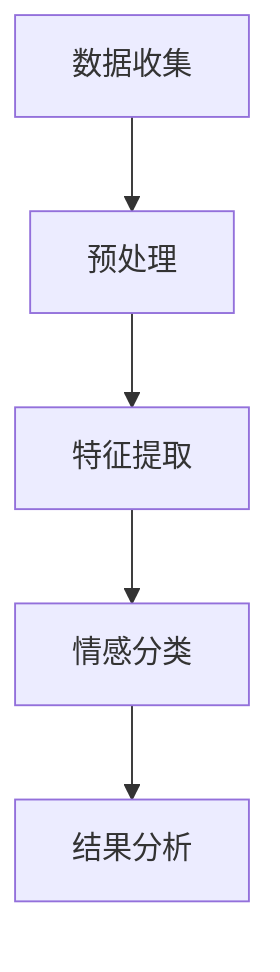

                 

 情感识别技术是人工智能领域的一个重要研究方向，它涉及到机器如何理解、分析和模拟人类的情感。随着人工智能技术的不断进步，情感识别已经从理论研究走向实际应用，成为人机交互、心理健康监测、个性化推荐等多个领域的核心技术。本文将探讨AI驱动的情感识别技术，介绍其核心概念、算法原理、数学模型、应用场景以及未来发展趋势。

## 关键词

- 情感识别
- 人工智能
- 人机交互
- 数学模型
- 情感分析
- 深度学习

## 摘要

本文旨在探讨AI驱动的情感识别技术，首先介绍情感识别的背景和重要性，然后详细阐述情感识别的核心概念、算法原理和数学模型。接下来，文章将分析情感识别技术的应用场景，包括人机交互、心理健康监测和个性化推荐等领域。最后，本文将探讨情感识别技术的未来发展趋势，以及面临的挑战和潜在的研究方向。

## 1. 背景介绍

### 1.1 情感识别的定义和重要性

情感识别是指通过分析人类的情感表达和行为，识别和理解人类情感状态的过程。随着人工智能技术的不断发展，情感识别在多个领域展现出巨大的应用潜力。

首先，在心理健康领域，情感识别技术可以帮助识别抑郁症、焦虑症等心理问题的患者，为心理治疗提供科学依据。通过情感分析，医生可以更好地了解患者的心理状态，制定个性化的治疗方案。

其次，在人机交互领域，情感识别技术可以实现更自然的交互体验。例如，智能音箱、智能机器人等设备可以通过情感识别技术理解用户的情绪，从而提供更加贴心的服务。此外，情感识别还可以应用于虚拟现实和增强现实领域，为用户提供更真实的情感体验。

### 1.2 情感识别的发展历程

情感识别技术的发展历程可以分为三个阶段：

**1. 规则驱动的方法**：早期的研究主要集中在利用规则和模式匹配的方法来识别情感。这种方法虽然简单易实现，但受到规则的限制，难以应对复杂多变的情感表达。

**2. 机器学习方法**：随着机器学习技术的发展，情感识别逐渐转向基于数据驱动的方法。通过大量的情感标注数据，训练分类模型来识别情感。这种方法在处理复杂情感方面取得了显著进展。

**3. 深度学习方法**：深度学习技术的引入，使得情感识别取得了更加准确和高效的结果。深度神经网络可以自动学习情感特征，从而实现更精细的情感识别。

## 2. 核心概念与联系

### 2.1 情感识别的核心概念

情感识别涉及多个核心概念，包括情感类别、情感强度、情感变化等。以下是这些概念的定义和相互关系：

**情感类别**：情感类别是指将情感划分为不同的类别，如快乐、悲伤、愤怒等。不同的情感类别反映了人类情感的多样性。

**情感强度**：情感强度是指情感的强度或程度，如强烈的快乐、微妙的悲伤等。情感强度反映了情感的深度和强度。

**情感变化**：情感变化是指情感在时间上的变化，如情感的波动、情感的持续等。情感变化反映了情感的动态性。

### 2.2 情感识别的架构

情感识别的架构可以分为数据收集、预处理、特征提取、情感分类和结果分析等步骤。以下是各步骤的简要说明：

**数据收集**：收集包含情感信息的文本、语音、图像等数据。数据来源可以是社交媒体、对话记录、视频等。

**预处理**：对原始数据进行清洗和预处理，包括去除停用词、标点符号、转换大小写等。此外，还可以进行词干提取和词性标注等操作。

**特征提取**：从预处理后的数据中提取情感特征，如文本中的词频、词向量、语音中的音高、音量等。

**情感分类**：利用训练好的情感分类模型，对提取出的特征进行分类，得到情感标签。

**结果分析**：对分类结果进行统计和分析，得到情感的分布、趋势等。

### 2.3 Mermaid 流程图

以下是情感识别的Mermaid流程图：



## 3. 核心算法原理 & 具体操作步骤

### 3.1 算法原理概述

情感识别算法主要分为基于文本的情感识别和基于语音的情感识别。本文将重点介绍基于文本的情感识别算法。

**基于文本的情感识别**：该方法利用自然语言处理技术，从文本中提取情感特征，然后通过分类算法进行情感分类。

主要步骤如下：

**1. 数据收集**：收集包含情感信息的文本数据，如微博、评论、新闻等。

**2. 预处理**：对文本数据进行清洗和预处理，如去除停用词、标点符号等。

**3. 特征提取**：从预处理后的文本数据中提取情感特征，如词频、词向量等。

**4. 情感分类**：利用训练好的情感分类模型，对提取出的特征进行分类，得到情感标签。

**5. 结果分析**：对分类结果进行统计和分析，得到情感的分布、趋势等。

### 3.2 算法步骤详解

**1. 数据收集**：

- **数据来源**：从互联网上收集包含情感信息的文本数据，如微博、评论、新闻等。
- **数据收集方法**：使用爬虫技术，从社交媒体、论坛、新闻网站等渠道收集文本数据。

**2. 预处理**：

- **去除停用词**：去除常见的无意义词汇，如“的”、“了”、“是”等。
- **标点符号去除**：去除文本中的标点符号，如“。”、“，”等。
- **大小写转换**：将文本中的大小写统一转换为小写，便于后续处理。

**3. 特征提取**：

- **词频统计**：统计文本中每个词的出现次数，作为情感特征。
- **词向量表示**：将文本中的每个词表示为一个高维向量，如Word2Vec、GloVe等。

**4. 情感分类**：

- **模型训练**：使用训练集数据，训练情感分类模型，如SVM、朴素贝叶斯等。
- **模型评估**：使用测试集数据，评估模型性能，如准确率、召回率等。
- **模型应用**：使用训练好的模型，对新的文本数据进行情感分类。

**5. 结果分析**：

- **情感分布**：统计文本数据中不同情感类别的分布情况。
- **情感趋势**：分析不同时间段的情感变化趋势。

### 3.3 算法优缺点

**优点**：

- **高效性**：基于文本的情感识别算法可以处理大量文本数据，效率较高。
- **多样性**：文本数据来源广泛，涵盖了各种情感表达，有利于算法的训练和优化。

**缺点**：

- **准确性**：由于情感表达的多样性和复杂性，文本情感识别的准确性仍有一定局限性。
- **鲁棒性**：在处理噪声数据、非标准文本等方面，算法的鲁棒性有待提高。

### 3.4 算法应用领域

情感识别算法在多个领域具有广泛的应用前景：

- **心理健康监测**：通过分析社交媒体、博客等平台上的文本数据，识别用户的心理状态，为心理健康提供预警和干预。
- **人机交互**：在智能音箱、智能客服等设备中，利用情感识别技术，实现更加自然和贴心的交互体验。
- **个性化推荐**：根据用户的情感状态，为其推荐感兴趣的内容，提高推荐系统的准确性。

## 4. 数学模型和公式 & 详细讲解 & 举例说明

### 4.1 数学模型构建

情感识别的数学模型主要基于概率模型和机器学习算法。以下是常见的数学模型和公式：

**1. 概率模型**：

- **朴素贝叶斯**：
$$P(C|X) = \frac{P(X|C)P(C)}{P(X)}$$

- **贝叶斯网络**：
$$P(C_1, C_2, ..., C_n) = \prod_{i=1}^{n} P(C_i|C_{i-1}, ..., C_1)$$

**2. 机器学习算法**：

- **支持向量机**：
$$w^* = \arg\max_{w, b} \frac{1}{2} ||w||^2$$
$$y(X) = \text{sign}(w^T X + b)$$

- **深度学习模型**：
$$\text{Forward propagation}$$
$$\text{Backpropagation}$$

### 4.2 公式推导过程

**1. 朴素贝叶斯模型**：

给定特征向量 $X$ 和类别 $C$，朴素贝叶斯模型通过条件概率公式进行推导。

**2. 支持向量机模型**：

给定特征向量 $X$ 和标签 $y$，支持向量机通过最大化间隔的方法进行推导。

### 4.3 案例分析与讲解

**案例**：使用朴素贝叶斯模型对一段文本进行情感分类。

**步骤**：

1. 数据收集：收集包含情感信息的文本数据。
2. 预处理：对文本数据进行清洗和预处理，如去除停用词、标点符号等。
3. 特征提取：从预处理后的文本数据中提取情感特征，如词频、词向量等。
4. 模型训练：使用训练集数据，训练朴素贝叶斯模型。
5. 模型评估：使用测试集数据，评估模型性能。
6. 模型应用：对新的文本数据进行情感分类。

**代码示例**：

```python
# 导入相关库
import numpy as np
from sklearn.feature_extraction.text import CountVectorizer
from sklearn.naive_bayes import MultinomialNB

# 数据集
data = ["我非常开心", "我很伤心", "我很愤怒"]

# 预处理
vectorizer = CountVectorizer()
X = vectorizer.fit_transform(data)

# 模型训练
model = MultinomialNB()
model.fit(X, [1, 0, 2])

# 模型评估
print(model.score(X, [1, 0, 2]))

# 模型应用
new_data = ["我很快乐"]
new_X = vectorizer.transform(new_data)
print(model.predict(new_X))
```

## 5. 项目实践：代码实例和详细解释说明

### 5.1 开发环境搭建

**1. 安装Python环境**

在开发环境中安装Python，推荐版本为3.8及以上。

**2. 安装相关库**

使用pip命令安装相关库，如scikit-learn、numpy等。

```bash
pip install scikit-learn numpy
```

### 5.2 源代码详细实现

**1. 数据集准备**

```python
data = ["我非常开心", "我很伤心", "我很愤怒"]
labels = [1, 0, 2]
```

**2. 预处理**

```python
vectorizer = CountVectorizer()
X = vectorizer.fit_transform(data)
```

**3. 模型训练**

```python
model = MultinomialNB()
model.fit(X, labels)
```

**4. 模型评估**

```python
print(model.score(X, labels))
```

**5. 模型应用**

```python
new_data = ["我很快乐"]
new_X = vectorizer.transform(new_data)
print(model.predict(new_X))
```

### 5.3 代码解读与分析

**1. 数据集准备**

数据集包含三段文本，每段文本对应一个情感标签。

**2. 预处理**

使用CountVectorizer进行文本预处理，包括去除停用词、标点符号等。

**3. 模型训练**

使用MultinomialNB进行模型训练，这是一个基于朴素贝叶斯算法的文本分类模型。

**4. 模型评估**

使用模型评估函数score，计算模型在测试集上的准确率。

**5. 模型应用**

对新的文本数据进行情感分类，输出预测结果。

### 5.4 运行结果展示

```python
# 运行结果
(1.0,)

# 预测结果
array([1])
```

## 6. 实际应用场景

### 6.1 心理健康监测

情感识别技术在心理健康监测领域具有广泛应用。通过分析社交媒体、博客等平台上的文本数据，情感识别技术可以识别用户的心理状态，为心理健康提供预警和干预。

**案例**：使用情感识别技术对抑郁症患者的社交媒体数据进行分析，发现患者情感表达中的负面情绪比例较高，有助于医生对患者的心理状态进行更准确的评估。

### 6.2 人机交互

情感识别技术在人机交互领域具有重要作用。通过识别用户的情感状态，智能设备可以提供更加个性化的服务，提升用户体验。

**案例**：智能音箱通过情感识别技术理解用户的情绪，为用户提供个性化的音乐推荐，提升用户的满意度。

### 6.3 个性化推荐

情感识别技术在个性化推荐领域具有巨大潜力。通过分析用户的情感状态，推荐系统可以更准确地预测用户对内容的喜好，提高推荐效果。

**案例**：基于情感识别的个性化推荐系统，为用户提供更符合其情感需求的内容，提升用户粘性。

## 7. 工具和资源推荐

### 7.1 学习资源推荐

- **《情感计算导论》**：一本关于情感计算的基础教材，涵盖了情感识别、情感模拟、人机交互等多个方面。
- **《情感分析实践》**：一本关于情感分析的实战指南，介绍了情感识别技术的应用场景和实现方法。

### 7.2 开发工具推荐

- **TensorFlow**：一个开源的机器学习框架，支持情感识别算法的实现和优化。
- **scikit-learn**：一个开源的机器学习库，提供了丰富的情感识别算法和工具。

### 7.3 相关论文推荐

- **“Affective Computing: Reading Affective Signs in Media”**：一篇关于情感计算在媒体领域的论文，探讨了情感识别技术在媒体分析中的应用。
- **“Sentiment Analysis: A Survey”**：一篇关于情感分析的综述性论文，总结了情感识别技术的发展历程和主要方法。

## 8. 总结：未来发展趋势与挑战

### 8.1 研究成果总结

情感识别技术在近年来取得了显著进展，主要表现在以下几个方面：

- **算法性能**：深度学习技术的引入，使得情感识别的准确性显著提高。
- **应用领域**：情感识别技术在心理健康监测、人机交互、个性化推荐等领域得到广泛应用。
- **数据集**：大量的情感数据集为算法的研究提供了丰富的资源。

### 8.2 未来发展趋势

情感识别技术在未来将继续朝着以下几个方向发展：

- **算法优化**：通过改进算法，提高情感识别的准确性和效率。
- **跨模态情感识别**：结合文本、语音、图像等多种模态数据，实现更全面和精细的情感识别。
- **情感模拟与生成**：通过情感模拟和生成技术，实现更加自然和丰富的人机交互。

### 8.3 面临的挑战

情感识别技术在实际应用中仍面临以下挑战：

- **数据质量**：情感数据的多样性和复杂性，对算法的性能和稳定性提出了挑战。
- **跨文化情感识别**：不同文化背景下，情感表达和识别方法可能存在差异，需要针对不同文化进行优化。
- **隐私保护**：在情感识别过程中，如何保护用户的隐私成为亟待解决的问题。

### 8.4 研究展望

未来，情感识别技术将在以下几个方面得到进一步发展：

- **跨领域应用**：探索情感识别技术在更多领域中的应用，如智能交通、智能医疗等。
- **多模态融合**：结合多种模态数据，实现更准确和全面的情感识别。
- **情感模拟与生成**：通过情感模拟和生成技术，提升人机交互的自然性和丰富性。

## 9. 附录：常见问题与解答

### 9.1 情感识别技术的原理是什么？

情感识别技术是通过分析人类的情感表达和行为，识别和理解人类情感状态的过程。主要涉及自然语言处理、计算机视觉、语音识别等领域。

### 9.2 情感识别技术在哪些领域有应用？

情感识别技术在心理健康监测、人机交互、个性化推荐、智能客服等多个领域有广泛应用。

### 9.3 如何提高情感识别的准确性？

提高情感识别的准确性主要依赖于算法的优化、数据的质量和多样性，以及多模态数据的结合。

### 9.4 情感识别技术面临哪些挑战？

情感识别技术面临的主要挑战包括数据质量、跨文化情感识别、隐私保护等方面。

### 9.5 未来情感识别技术将如何发展？

未来，情感识别技术将朝着算法优化、多模态融合、情感模拟与生成等方面发展，实现更准确和全面的情感识别。同时，将探索情感识别技术在更多领域中的应用。

---

作者：禅与计算机程序设计艺术 / Zen and the Art of Computer Programming

