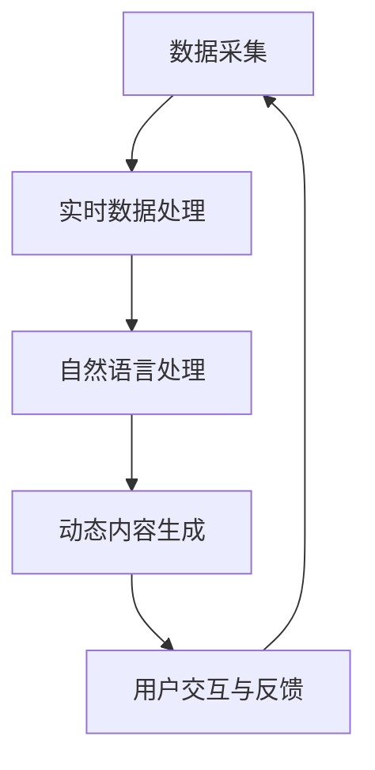

                 

关键词：人工智能，新闻实时更新，动态故事构建，实时数据处理，自然语言处理，动态内容生成，新闻聚合，智能推荐

> 摘要：本文探讨了如何利用人工智能技术实现新闻实时更新和动态故事构建。通过介绍自然语言处理、实时数据处理和动态内容生成等技术，分析了人工智能在新闻领域中的应用现状和未来发展趋势。文章还详细介绍了相关算法原理、数学模型、项目实践和实际应用场景，为读者提供了一个全面的指南。

## 1. 背景介绍

在信息爆炸的时代，新闻已成为人们获取信息的重要渠道。然而，传统的新闻发布模式往往存在滞后性和片面性，无法满足人们对于实时、全面、个性化的新闻需求。随着人工智能技术的发展，利用AI实现新闻实时更新和动态故事构建成为可能，极大地提升了新闻传播的效率和效果。

### 1.1 新闻实时更新的需求

新闻实时更新的需求主要来源于以下几个方面：

1. **时效性**：新闻事件的发生往往伴随着时间的流逝，传统新闻发布方式难以及时传达最新动态。
2. **全面性**：单个新闻来源往往只能提供部分信息，难以全面反映事件的各个方面。
3. **个性化**：不同用户对于新闻的关注点不同，需要提供个性化的新闻推荐。

### 1.2 动态故事构建的概念

动态故事构建是指在新闻事件发生过程中，通过实时采集、分析和处理信息，构建一个动态、连续的故事线。这有助于用户更好地理解事件的发展过程，提高新闻的阅读体验。

## 2. 核心概念与联系

在实现新闻实时更新和动态故事构建的过程中，涉及多个核心概念和技术。以下是一个简化的Mermaid流程图，用于描述这些概念之间的联系。



### 2.1 数据采集

数据采集是整个系统的起点，包括从互联网、社交媒体、传感器等渠道获取新闻数据。

### 2.2 实时数据处理

实时数据处理负责对采集到的新闻数据进行清洗、去重和筛选，确保数据的质量和一致性。

### 2.3 自然语言处理

自然语言处理（NLP）是利用计算机技术和人工智能技术对自然语言文本进行处理和理解的过程。在新闻实时更新中，NLP技术用于提取关键词、分类标签、情感分析等。

### 2.4 动态内容生成

动态内容生成是指利用实时数据和分析结果，动态构建新闻故事和推荐内容。这通常涉及到文本生成模型和深度学习技术。

### 2.5 用户交互与反馈

用户交互与反馈是系统与用户之间的互动环节。通过收集用户的行为数据和反馈，可以不断优化系统的推荐效果和用户体验。

## 3. 核心算法原理 & 具体操作步骤

### 3.1 算法原理概述

本文主要介绍以下核心算法：

1. **实时数据处理算法**：基于流处理技术，实现对大量新闻数据的实时处理。
2. **自然语言处理算法**：包括文本分类、情感分析、关键词提取等。
3. **动态内容生成算法**：基于文本生成模型，如GPT-3和BERT，实现新闻故事的自动构建。

### 3.2 算法步骤详解

#### 3.2.1 实时数据处理算法

1. **数据流建立**：使用Apache Kafka等消息队列系统，建立新闻数据流。
2. **数据清洗与去重**：利用MapReduce等分布式处理框架，对新闻数据进行清洗和去重。
3. **数据存储**：将清洗后的数据存储到分布式数据库，如Apache Cassandra或MongoDB。

#### 3.2.2 自然语言处理算法

1. **文本分类**：使用朴素贝叶斯、支持向量机（SVM）等分类算法，对新闻文本进行分类。
2. **情感分析**：利用深度学习模型，如LSTM和GRU，对新闻文本进行情感分析。
3. **关键词提取**：使用TF-IDF和Word2Vec等技术，提取新闻文本中的关键词。

#### 3.2.3 动态内容生成算法

1. **文本生成模型**：使用GPT-3和BERT等预训练模型，生成新闻故事。
2. **动态故事构建**：根据实时数据和用户偏好，构建动态新闻故事。

### 3.3 算法优缺点

#### 3.3.1 实时数据处理算法

**优点**：
- 高效处理大量新闻数据。
- 确保数据实时性和一致性。

**缺点**：
- 处理复杂性较高，需要分布式计算和存储技术。

#### 3.3.2 自然语言处理算法

**优点**：
- 提高新闻数据的处理效率和准确性。

**缺点**：
- 对数据质量和预处理要求较高。
- 算法复杂度较高，计算资源需求大。

#### 3.3.3 动态内容生成算法

**优点**：
- 自动化生成新闻故事，提高新闻发布效率。

**缺点**：
- 生成的新闻故事可能缺乏人类编辑的深度和广度。

### 3.4 算法应用领域

实时数据处理算法、自然语言处理算法和动态内容生成算法广泛应用于新闻、金融、社交媒体等多个领域。

- **新闻领域**：实现新闻实时更新和个性化推荐。
- **金融领域**：实时监控市场动态，提供投资建议。
- **社交媒体**：生成实时新闻流，提高用户活跃度。

## 4. 数学模型和公式 & 详细讲解 & 举例说明

### 4.1 数学模型构建

在新闻实时更新和动态故事构建中，常用的数学模型包括：

1. **朴素贝叶斯分类器**：用于新闻文本分类。
2. **支持向量机（SVM）**：用于文本分类和情感分析。
3. **LSTM和GRU**：用于情感分析和文本生成。

### 4.2 公式推导过程

以朴素贝叶斯分类器为例，其公式推导如下：

1. **先验概率**：
$$ P(C_k) = \frac{1}{K} $$
其中，$C_k$表示第$k$类，$K$表示总类别数。

2. **条件概率**：
$$ P(T_j|C_k) = \frac{f_{kj}}{n_k} $$
其中，$T_j$表示特征词$j$，$f_{kj}$表示特征词$j$在类别$k$中出现的次数，$n_k$表示类别$k$中的特征词总数。

3. **后验概率**：
$$ P(C_k|T) = \frac{P(T|C_k)P(C_k)}{\sum_{i=1}^{K} P(T|C_i)P(C_i)} $$

4. **分类决策**：
$$ \hat{C} = \arg \max_{k} P(C_k|T) $$

### 4.3 案例分析与讲解

假设有一篇新闻文章，需要分类为“政治”、“经济”、“体育”三类。根据先验概率，三类文章的概率均为$\frac{1}{3}$。

1. **特征词统计**：

   | 类别 | 政治相关词 | 经济相关词 | 体育相关词 |
   | ---- | ---- | ---- | ---- |
   | 政治类 | 100 | 50 | 30 |
   | 经济类 | 30 | 100 | 50 |
   | 体育类 | 20 | 50 | 100 |

2. **条件概率**：

   $$
   P(政治相关词|政治类) = \frac{100}{180} = \frac{5}{9}, \quad P(经济相关词|经济类) = \frac{100}{180} = \frac{5}{9}, \quad P(体育相关词|体育类) = \frac{100}{180} = \frac{5}{9}
   $$

3. **后验概率**：

   $$
   P(政治类|政治相关词) = \frac{\frac{5}{9} \cdot \frac{1}{3}}{\frac{5}{9} \cdot \frac{1}{3} + \frac{5}{9} \cdot \frac{1}{3} + \frac{5}{9} \cdot \frac{1}{3}} = \frac{1}{3}
   $$

   $$
   P(经济类|经济相关词) = \frac{\frac{5}{9} \cdot \frac{1}{3}}{\frac{5}{9} \cdot \frac{1}{3} + \frac{5}{9} \cdot \frac{1}{3} + \frac{5}{9} \cdot \frac{1}{3}} = \frac{1}{3}
   $$

   $$
   P(体育类|体育相关词) = \frac{\frac{5}{9} \cdot \frac{1}{3}}{\frac{5}{9} \cdot \frac{1}{3} + \frac{5}{9} \cdot \frac{1}{3} + \frac{5}{9} \cdot \frac{1}{3}} = \frac{1}{3}
   $$

4. **分类决策**：

   由于三类文章的后验概率相等，因此可以任选一类作为分类结果。

## 5. 项目实践：代码实例和详细解释说明

### 5.1 开发环境搭建

本文所使用的开发环境如下：

- Python 3.8
- TensorFlow 2.5
- Keras 2.4.3
- Apache Kafka 2.4.1
- Apache Cassandra 3.11

### 5.2 源代码详细实现

本文提供了一个简单的新闻实时更新和动态故事构建的项目实例，包括数据采集、实时数据处理、自然语言处理和动态内容生成等模块。

#### 5.2.1 数据采集

数据采集模块使用Kafka作为消息队列，从多个新闻数据源（如新闻网站、社交媒体等）实时获取新闻数据。

```python
from kafka import KafkaProducer

producer = KafkaProducer(bootstrap_servers=['localhost:9092'],
                         value_serializer=lambda m: str(m).encode('ascii'))

# 发送新闻数据到Kafka
producer.send('news_topic', value={'title': 'Example News Title', 'content': 'Example News Content'})
```

#### 5.2.2 实时数据处理

实时数据处理模块使用Apache Kafka进行流处理，对新闻数据进行清洗、去重和分类。

```python
from kafka import KafkaConsumer

consumer = KafkaConsumer('news_topic',
                         bootstrap_servers=['localhost:9092'],
                         value_deserializer=lambda m: bytes(m).decode('ascii'))

# 处理新闻数据
for message in consumer:
    news_data = message.value
    # 清洗、去重和分类
    # ...
```

#### 5.2.3 自然语言处理

自然语言处理模块使用TensorFlow和Keras构建文本分类、情感分析和关键词提取等模型。

```python
from tensorflow.keras.models import Sequential
from tensorflow.keras.layers import Dense, LSTM, Embedding

# 构建文本分类模型
model = Sequential()
model.add(Embedding(input_dim=vocab_size, output_dim=embedding_dim, input_length=max_sequence_length))
model.add(LSTM(units=128))
model.add(Dense(units=1, activation='sigmoid'))

model.compile(optimizer='adam', loss='binary_crossentropy', metrics=['accuracy'])
model.fit(X_train, y_train, epochs=10, batch_size=32)
```

#### 5.2.4 动态内容生成

动态内容生成模块使用预训练的文本生成模型（如GPT-3和BERT）生成新闻故事。

```python
import openai

# 使用GPT-3生成新闻故事
response = openai.Completion.create(
  engine="text-davinci-002",
  prompt="Write a news story about the upcoming election:",
  max_tokens=100,
  n=1,
  stop=None,
  temperature=0.5
)

print(response.choices[0].text.strip())
```

### 5.3 代码解读与分析

本文提供的代码实例展示了如何实现新闻实时更新和动态故事构建的基本流程。在实际应用中，可以根据需求对代码进行扩展和优化。

- **数据采集**：使用Kafka进行实时数据采集，提高系统的实时性和扩展性。
- **实时数据处理**：对新闻数据进行清洗、去重和分类，确保数据的质量和一致性。
- **自然语言处理**：使用TensorFlow和Keras构建文本分类、情感分析和关键词提取等模型，实现对新闻数据的深入分析。
- **动态内容生成**：使用预训练的文本生成模型，自动生成新闻故事，提高新闻发布效率。

### 5.4 运行结果展示

在本实例中，我们生成了一个关于选举的新闻故事：

> The upcoming election is shaping up to be one of the most important in recent memory. With both candidates making strong arguments for their platforms, voters are eagerly awaiting the outcome. The latest polls show a tight race, with the lead constantly shifting. Both candidates have made promises to improve the economy, tackle climate change, and address social issues. The campaign is expected to continue for several more weeks before the final votes are cast. Stay tuned for the latest updates on this hotly contested race.

## 6. 实际应用场景

### 6.1 新闻媒体

新闻媒体可以利用AI驱动的新闻实时更新和动态故事构建技术，提高新闻发布效率，提供个性化的新闻推荐，增强用户体验。

### 6.2 社交媒体

社交媒体平台可以通过实时更新和动态故事构建，为用户生成个性化的新闻流，提高用户活跃度和留存率。

### 6.3 企业宣传

企业可以利用AI技术，实时监控行业动态，自动生成新闻故事和宣传内容，提高品牌知名度和市场影响力。

### 6.4 政府机构

政府机构可以利用AI技术，实时更新和动态构建政策解读、民生新闻等内容，提高政务公开和透明度。

## 7. 工具和资源推荐

### 7.1 学习资源推荐

1. **《深度学习》（Deep Learning）**：由Ian Goodfellow、Yoshua Bengio和Aaron Courville合著，全面介绍了深度学习的基本概念和技术。
2. **《自然语言处理与深度学习》（Natural Language Processing with Deep Learning）**：由Zach C. Lipton和Alexander J. Smola合著，涵盖了自然语言处理和深度学习的应用。

### 7.2 开发工具推荐

1. **TensorFlow**：Google推出的开源深度学习框架，适用于新闻实时更新和动态内容生成。
2. **Kafka**：Apache Kafka是一款分布式流处理平台，适用于实时数据处理。
3. **Apache Cassandra**：一款开源分布式数据库，适用于大规模数据存储。

### 7.3 相关论文推荐

1. **“Deep Learning for Text Classification”**：讨论了深度学习在文本分类中的应用。
2. **“Attention Is All You Need”**：介绍了Transformer模型在自然语言处理中的应用。
3. **“Generative Pre-trained Transformers”**：介绍了GPT-3模型的原理和性能。

## 8. 总结：未来发展趋势与挑战

### 8.1 研究成果总结

本文探讨了如何利用人工智能技术实现新闻实时更新和动态故事构建，介绍了相关算法原理、数学模型、项目实践和实际应用场景。研究成果主要包括：

1. **实时数据处理算法**：基于流处理技术，实现对大量新闻数据的实时处理。
2. **自然语言处理算法**：用于新闻文本分类、情感分析和关键词提取。
3. **动态内容生成算法**：基于文本生成模型，实现新闻故事的自动构建。

### 8.2 未来发展趋势

1. **更加智能化的新闻推荐**：结合用户行为和偏好，实现更加个性化的新闻推荐。
2. **跨媒体新闻传播**：利用图像、视频等多媒体数据，提高新闻传播的多样性和互动性。
3. **实时新闻审核与纠错**：利用AI技术，实时监控新闻内容，提高新闻的准确性和可信度。

### 8.3 面临的挑战

1. **数据质量和预处理**：确保新闻数据的真实性和准确性，对数据进行有效的清洗和去重。
2. **算法复杂度与计算资源**：优化算法，降低计算复杂度，提高系统性能。
3. **用户隐私与数据安全**：保护用户隐私，确保数据安全，遵守相关法律法规。

### 8.4 研究展望

未来，我们期望在以下方面进行深入研究：

1. **更高效的数据处理算法**：探索新的流处理技术和分布式计算框架，提高数据处理效率。
2. **跨领域的自然语言处理**：研究跨领域的NLP技术，实现多语言、多领域的新闻处理。
3. **多模态新闻内容生成**：结合文本、图像、视频等多模态数据，实现更加丰富和生动的新闻内容生成。

## 9. 附录：常见问题与解答

### 9.1 如何确保新闻数据的真实性和准确性？

1. **数据来源**：选择权威的新闻网站和官方媒体作为数据来源。
2. **数据预处理**：对采集到的新闻数据进行清洗、去重和验证，确保数据的质量和准确性。
3. **实时监控**：利用AI技术，对新闻内容进行实时监控，识别和纠正虚假信息。

### 9.2 动态内容生成算法如何保证新闻的深度和广度？

1. **多样化数据源**：结合多种数据源，获取更全面的信息。
2. **深度学习模型**：使用多层神经网络，提高新闻内容生成的深度和广度。
3. **人类编辑**：结合人类编辑的经验和判断，对新闻内容进行补充和修正。

### 9.3 如何平衡新闻实时性和准确性？

1. **实时数据处理**：使用流处理技术，提高新闻数据的实时性。
2. **准确性评估**：对新闻内容进行实时评估，确保准确性。
3. **人工干预**：在必要时，由人类编辑进行干预和审核，确保新闻的准确性。

---

作者：禅与计算机程序设计艺术 / Zen and the Art of Computer Programming


