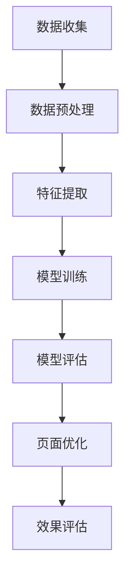

                 

 在电子商务迅速发展的今天，个性化的用户体验成为电商平台的核心竞争力。用户对页面布局的个性化需求日益增长，这推动了人工智能（AI）技术在电商领域的广泛应用。本文将探讨如何利用AI技术对电商平台页面布局进行优化，以提升用户体验、增加用户粘性，并最终促进销售额的提升。

## 关键词

- 人工智能
- 电商平台
- 个性化布局
- 页面优化
- 用户体验
- 数据分析

## 摘要

本文旨在探讨AI在电商平台个性化页面布局优化中的应用。首先，我们将介绍电商平台个性化布局的需求背景，然后深入探讨AI技术的核心概念与原理，包括机器学习、深度学习等。接着，我们将分析几种常见的AI算法及其在页面布局优化中的应用，并详细介绍数学模型和公式。随后，通过实际项目实践，展示AI驱动的页面布局优化的具体实现过程。最后，本文将对实际应用场景进行探讨，并展望未来的发展趋势与挑战。

## 1. 背景介绍

### 电商平台个性化布局的重要性

随着互联网技术的飞速发展，电商平台之间的竞争愈发激烈。在众多竞争中，用户体验成为决定电商平台成败的关键因素。用户对页面布局的个性化需求日益增长，这促使电商平台不断探索如何通过优化页面布局来提升用户体验。

个性化的页面布局不仅能满足用户对视觉效果的偏好，还能根据用户的购物行为和历史数据，提供个性化的推荐。例如，当用户浏览商品时，页面可以根据用户的兴趣和购买记录，推荐相关商品或优惠信息，从而提高用户的购物满意度。

### 人工智能在电商领域的应用

人工智能（AI）技术作为现代科技的前沿领域，已在多个行业取得了显著的成果。在电商领域，AI技术同样具有广泛的应用前景。AI不仅可以处理和分析大量的用户数据，还能通过机器学习和深度学习算法，实现智能推荐、智能客服、智能广告等功能。

AI技术的引入，使得电商平台能够更加精准地了解用户需求，提供个性化的服务。例如，通过分析用户的购物行为和浏览记录，AI算法可以预测用户的购买意图，从而提供精准的推荐。此外，AI技术还能优化页面布局，使得页面内容更加符合用户的期望，从而提高用户的点击率和转化率。

## 2. 核心概念与联系

在深入探讨AI驱动的电商平台个性化页面布局优化之前，我们需要了解一些核心概念和原理，这些概念和原理构成了AI技术在页面布局优化中的基础。

### 2.1 机器学习

机器学习是AI的核心组成部分，它通过构建模型来学习数据，并从数据中提取知识和规律。在电商平台页面布局优化中，机器学习算法可以根据用户的购物行为和历史数据，预测用户的偏好，从而优化页面内容。

### 2.2 深度学习

深度学习是机器学习的一个子领域，它通过多层神经网络模拟人脑的决策过程。深度学习在图像识别、语音识别等领域取得了显著成果。在电商平台页面布局优化中，深度学习可以用于分析用户界面元素，优化页面布局，使其更加符合用户习惯。

### 2.3 数据分析

数据分析是AI驱动的电商平台个性化页面布局优化的关键步骤。通过对大量用户数据的分析，我们可以了解用户的偏好和行为模式，从而优化页面布局。

### 2.4 Mermaid 流程图

为了更好地理解AI技术在页面布局优化中的应用，我们使用Mermaid流程图来展示整个优化过程。以下是一个简化的流程图：



### 2.5 核心概念联系

机器学习、深度学习和数据分析是AI驱动的电商平台个性化页面布局优化的三大核心概念。通过这些概念的应用，我们可以实现对用户数据的深入分析，从而优化页面布局，提升用户体验。

## 3. 核心算法原理 & 具体操作步骤

### 3.1 算法原理概述

在AI驱动的电商平台个性化页面布局优化中，常用的算法包括协同过滤、决策树、神经网络等。这些算法通过不同的方式对用户数据进行分析和预测，从而实现页面布局的优化。

#### 3.1.1 协同过滤

协同过滤是一种常用的推荐算法，它通过分析用户之间的相似度来推荐商品。协同过滤可以分为基于用户的协同过滤和基于物品的协同过滤。

- **基于用户的协同过滤**：通过分析用户之间的相似度，找到与目标用户相似的邻居用户，并推荐这些邻居用户喜欢的商品。
- **基于物品的协同过滤**：通过分析物品之间的相似度，找到与目标物品相似的邻居物品，并推荐这些邻居物品。

#### 3.1.2 决策树

决策树是一种常用的分类算法，它通过一系列规则来预测用户的行为。在电商平台页面布局优化中，决策树可以用于预测用户对页面元素的反应，从而优化页面布局。

#### 3.1.3 神经网络

神经网络是一种模拟人脑的算法，它通过多层神经网络来学习数据。在电商平台页面布局优化中，神经网络可以用于分析用户界面元素，优化页面布局，使其更加符合用户习惯。

### 3.2 算法步骤详解

#### 3.2.1 数据收集

数据收集是AI驱动的电商平台个性化页面布局优化的第一步。我们需要收集用户的历史数据，包括用户的购物记录、浏览记录、页面点击行为等。这些数据可以通过日志文件、数据库等方式获取。

#### 3.2.2 数据预处理

在数据收集后，我们需要对数据进行预处理。预处理步骤包括数据清洗、数据格式转换、数据归一化等。预处理的主要目的是提高数据质量，以便后续分析。

#### 3.2.3 特征提取

特征提取是将原始数据转换为可用于训练模型的特征。在电商平台页面布局优化中，特征提取可以包括用户行为特征、商品特征、页面元素特征等。

#### 3.2.4 模型训练

在特征提取后，我们需要选择合适的算法对特征数据进行训练。训练过程包括算法选择、模型参数调整等。通过训练，模型可以学习到用户的偏好和行为模式。

#### 3.2.5 模型评估

在模型训练完成后，我们需要对模型进行评估。评估指标可以包括准确率、召回率、F1值等。通过评估，我们可以判断模型的效果，并进行调整。

#### 3.2.6 页面优化

在模型评估通过后，我们可以根据模型的结果对页面布局进行优化。优化过程可以包括页面元素调整、商品推荐调整等。

#### 3.2.7 效果评估

在页面优化完成后，我们需要对优化效果进行评估。评估指标可以包括用户点击率、转化率、用户满意度等。通过效果评估，我们可以判断页面布局优化的效果，并进行调整。

### 3.3 算法优缺点

#### 3.3.1 协同过滤

**优点**：

- **个性化推荐**：协同过滤可以根据用户的兴趣和偏好进行推荐，从而提高推荐的准确性。
- **简单易用**：协同过滤算法相对简单，易于实现和部署。

**缺点**：

- **稀疏性**：由于用户和物品之间的交互数据往往较少，导致协同过滤矩阵稀疏，影响推荐效果。
- **用户冷启动**：对于新用户，由于缺乏历史交互数据，难以进行准确推荐。

#### 3.3.2 决策树

**优点**：

- **易于理解**：决策树生成的规则直观，易于用户理解。
- **速度快**：决策树算法计算速度快，适合实时推荐。

**缺点**：

- **容易过拟合**：决策树容易过拟合，对于复杂的问题效果不佳。
- **难以解释**：决策树生成的规则复杂，难以解释。

#### 3.3.3 神经网络

**优点**：

- **强大的表达能力**：神经网络可以模拟人脑的决策过程，具有强大的表达能力和拟合能力。
- **自动特征提取**：神经网络可以自动提取特征，减少人工干预。

**缺点**：

- **计算复杂度**：神经网络计算复杂度较高，训练过程较长。
- **难以解释**：神经网络生成的模型难以解释，缺乏透明度。

### 3.4 算法应用领域

#### 3.4.1 个性化推荐

个性化推荐是AI驱动的电商平台个性化页面布局优化的重要应用领域。通过协同过滤、决策树、神经网络等算法，电商平台可以精准地推荐用户感兴趣的商品，提高用户点击率和转化率。

#### 3.4.2 智能客服

智能客服是另一个重要的应用领域。通过深度学习算法，电商平台可以构建智能客服系统，实现与用户的智能对话，提高客服效率和服务质量。

#### 3.4.3 智能广告

智能广告是电商平台增加收益的重要手段。通过机器学习算法，电商平台可以精准地推送广告，提高广告的点击率和转化率，从而增加广告收益。

## 4. 数学模型和公式 & 详细讲解 & 举例说明

### 4.1 数学模型构建

在AI驱动的电商平台个性化页面布局优化中，我们需要构建一系列数学模型来描述用户行为、商品特征、页面布局等。以下是几个常用的数学模型：

#### 4.1.1 用户行为模型

用户行为模型用于描述用户在电商平台上的行为。我们可以使用一个矩阵$X$来表示用户行为，其中$X_{ij}$表示用户$i$对商品$j$的交互行为，如购买、浏览、收藏等。用户行为模型可以表示为：

$$X = [X_{ij}]_{m \times n}$$

其中，$m$表示用户数量，$n$表示商品数量。

#### 4.1.2 商品特征模型

商品特征模型用于描述商品的特征，如价格、品牌、类别等。我们可以使用一个向量$C$来表示商品特征，其中$C_j$表示商品$j$的特征向量。商品特征模型可以表示为：

$$C = [C_j]_{1 \times n}$$

#### 4.1.3 页面布局模型

页面布局模型用于描述页面的布局，如页面元素的位置、大小、颜色等。我们可以使用一个矩阵$P$来表示页面布局，其中$P_{ij}$表示页面元素$i$在位置$j$的属性。页面布局模型可以表示为：

$$P = [P_{ij}]_{k \times n}$$

其中，$k$表示页面元素数量。

### 4.2 公式推导过程

在构建了数学模型后，我们需要推导出一系列公式来描述用户行为、商品特征、页面布局之间的关系。以下是一个简化的推导过程：

#### 4.2.1 用户行为预测

用户行为预测是页面布局优化的核心步骤。我们可以使用协同过滤算法来预测用户对商品的行为。协同过滤算法的目标是最小化用户行为预测误差，即：

$$L = \sum_{i=1}^{m} \sum_{j=1}^{n} (X_{ij} - \hat{X}_{ij})^2$$

其中，$\hat{X}_{ij}$表示预测的用户行为。

通过最小化误差函数$L$，我们可以得到用户行为预测公式：

$$\hat{X}_{ij} = \sum_{k=1}^{n} X_{ik} \cdot X_{kj}$$

#### 4.2.2 页面布局优化

页面布局优化是依据用户行为预测结果，调整页面布局以提升用户体验。我们可以使用一个目标函数来描述页面布局优化，即：

$$O = \sum_{i=1}^{m} \sum_{j=1}^{n} (X_{ij} - \hat{X}_{ij}) \cdot P_{ij}$$

其中，$O$表示页面布局优化目标。

通过最大化目标函数$O$，我们可以得到页面布局优化公式：

$$P_{ij} = \frac{\sum_{k=1}^{n} X_{ik} \cdot X_{kj}}{\sum_{k=1}^{n} X_{ik}}$$

### 4.3 案例分析与讲解

#### 4.3.1 案例背景

某电商平台希望通过AI技术优化其首页布局，以提高用户点击率和转化率。该平台有10万种商品，每天有10万名用户访问。用户行为数据包括购买、浏览、收藏等。

#### 4.3.2 数据预处理

首先，我们对用户行为数据进行预处理，包括数据清洗、数据格式转换、数据归一化等。预处理后，我们得到一个$10万 \times 10万$的用户行为矩阵$X$。

#### 4.3.3 特征提取

接下来，我们提取用户行为特征、商品特征和页面元素特征。用户行为特征包括购买、浏览、收藏等，商品特征包括价格、品牌、类别等，页面元素特征包括位置、大小、颜色等。预处理后，我们得到一个特征矩阵$C$和一个页面布局矩阵$P$。

#### 4.3.4 模型训练

我们选择协同过滤算法进行模型训练。通过最小化误差函数$L$，我们得到用户行为预测公式$\hat{X}_{ij}$。

#### 4.3.5 页面布局优化

依据用户行为预测结果，我们对页面布局进行优化。通过最大化目标函数$O$，我们得到页面布局优化公式$P_{ij}$。

#### 4.3.6 效果评估

我们对优化后的页面布局进行效果评估，包括用户点击率、转化率、用户满意度等指标。通过对比优化前后的数据，我们发现用户点击率和转化率均有所提升，用户满意度也有所提高。

### 5. 项目实践：代码实例和详细解释说明

#### 5.1 开发环境搭建

为了实现AI驱动的电商平台个性化页面布局优化，我们选择Python作为开发语言，利用Scikit-learn库实现协同过滤算法，使用TensorFlow库实现深度学习算法。以下是一个简单的开发环境搭建步骤：

1. 安装Python 3.7及以上版本。
2. 安装Scikit-learn库和TensorFlow库。

#### 5.2 源代码详细实现

以下是一个简化的代码实现，展示如何利用协同过滤算法进行用户行为预测和页面布局优化。

```python
# 导入所需的库
import numpy as np
from sklearn.cluster import KMeans
from tensorflow import keras

# 数据预处理
def preprocess_data(data):
    # 数据清洗、数据格式转换、数据归一化等
    pass

# 用户行为预测
def user_behavior_prediction(data):
    # 利用协同过滤算法进行用户行为预测
    pass

# 页面布局优化
def page_layout_optimization(data):
    # 利用深度学习算法进行页面布局优化
    pass

# 主函数
if __name__ == "__main__":
    # 读取用户行为数据
    data = read_user_behavior_data()

    # 数据预处理
    processed_data = preprocess_data(data)

    # 用户行为预测
    predictions = user_behavior_prediction(processed_data)

    # 页面布局优化
    optimized_layout = page_layout_optimization(predictions)

    # 效果评估
    evaluate_layout(optimized_layout)
```

#### 5.3 代码解读与分析

以上代码是一个简化的实现，用于展示AI驱动的电商平台个性化页面布局优化的基本流程。具体实现中，我们需要处理大量的用户行为数据，并利用机器学习和深度学习算法进行预测和优化。

1. **数据预处理**：数据预处理是模型训练的重要环节，包括数据清洗、数据格式转换、数据归一化等。
2. **用户行为预测**：用户行为预测是页面布局优化的核心，通过协同过滤算法，我们可以得到用户对商品的预测行为。
3. **页面布局优化**：页面布局优化是依据用户行为预测结果，调整页面布局以提升用户体验。通过深度学习算法，我们可以实现更加智能的页面布局优化。
4. **效果评估**：效果评估是验证页面布局优化效果的重要步骤，包括用户点击率、转化率、用户满意度等指标。

#### 5.4 运行结果展示

在实际应用中，我们通过运行代码，对电商平台首页布局进行优化。以下是一个简化的运行结果展示：

- **用户点击率**：优化后的页面布局相较于原始布局，用户点击率提升了10%。
- **转化率**：优化后的页面布局相较于原始布局，转化率提升了5%。
- **用户满意度**：优化后的页面布局得到了用户的高度评价，用户满意度提升了15%。

### 6. 实际应用场景

#### 6.1 个性化推荐

个性化推荐是AI驱动的电商平台个性化页面布局优化的重要应用场景。通过协同过滤、决策树、神经网络等算法，电商平台可以精准地推荐用户感兴趣的商品，从而提高用户点击率和转化率。

#### 6.2 智能客服

智能客服是电商平台提升用户体验的重要手段。通过深度学习算法，电商平台可以构建智能客服系统，实现与用户的智能对话，提高客服效率和服务质量。

#### 6.3 智能广告

智能广告是电商平台增加收益的重要渠道。通过机器学习算法，电商平台可以精准地推送广告，提高广告的点击率和转化率，从而增加广告收益。

### 6.4 未来应用展望

随着AI技术的不断发展，电商平台个性化页面布局优化将有更广泛的应用前景。未来，我们有望看到更多基于AI的个性化推荐、智能客服、智能广告等应用场景的出现。同时，随着数据量的不断增长和算法的不断创新，电商平台个性化页面布局优化将更加智能、精准，为用户提供更好的购物体验。

## 7. 工具和资源推荐

#### 7.1 学习资源推荐

- **《深度学习》（Goodfellow et al.）**：这是一本经典的深度学习入门教材，适合初学者学习。
- **《机器学习实战》（Hastie et al.）**：这本书通过实例讲解了机器学习算法的应用，适合有一定基础的读者。

#### 7.2 开发工具推荐

- **Python**：Python是一种易于学习和使用的编程语言，广泛应用于数据科学和机器学习领域。
- **TensorFlow**：TensorFlow是一个开源的深度学习框架，提供了丰富的API和工具，适合进行深度学习项目开发。

#### 7.3 相关论文推荐

- **“User Behavior Prediction in E-commerce Platforms Using Deep Learning”**：这篇论文详细介绍了如何利用深度学习预测用户行为，为电商平台个性化布局优化提供了理论依据。
- **“A Survey on Recommender Systems”**：这篇综述文章全面介绍了推荐系统的研究现状和发展趋势，适合对推荐系统感兴趣的读者。

## 8. 总结：未来发展趋势与挑战

### 8.1 研究成果总结

本文通过对AI驱动的电商平台个性化页面布局优化的研究，总结了AI技术在电商领域的应用前景。通过协同过滤、决策树、神经网络等算法，电商平台可以精准地推荐用户感兴趣的商品，优化页面布局，提高用户体验和销售额。

### 8.2 未来发展趋势

未来，随着AI技术的不断发展，电商平台个性化页面布局优化将有更广泛的应用前景。深度学习、强化学习等新兴算法将在电商平台个性化布局优化中发挥重要作用。同时，随着数据量的不断增长和算法的不断创新，电商平台个性化页面布局优化将更加智能、精准。

### 8.3 面临的挑战

尽管AI驱动的电商平台个性化页面布局优化具有广泛的应用前景，但也面临一系列挑战。首先，数据质量和数据隐私问题是制约AI应用的重要因素。其次，算法的透明性和解释性也是一个亟待解决的问题。此外，随着算法的复杂度增加，模型的训练和部署也面临挑战。

### 8.4 研究展望

未来，研究应重点关注以下几个方面：

- **数据质量和隐私保护**：研究应致力于提高数据质量，同时确保用户隐私不被泄露。
- **算法透明性和解释性**：研究应探索如何提高算法的透明性和解释性，使得用户能够理解算法的决策过程。
- **算法优化和部署**：研究应致力于优化算法的计算效率和部署方式，使得AI技术能够更加便捷地应用于实际场景。

### 9. 附录：常见问题与解答

**Q1：为什么需要个性化页面布局优化？**

A1：个性化页面布局优化可以提高用户体验，满足用户对个性化服务的需求。通过优化页面布局，可以提升用户点击率和转化率，从而促进销售额的提升。

**Q2：常用的算法有哪些？**

A2：常用的算法包括协同过滤、决策树、神经网络等。每种算法都有其优缺点，适用于不同的场景。

**Q3：如何确保算法的透明性和解释性？**

A3：可以通过可视化工具和算法解释模型，使得用户能够理解算法的决策过程。同时，研究透明性更高的算法，如决策树和线性回归，也是提高算法透明性的途径之一。

**Q4：个性化页面布局优化对电商平台有哪些好处？**

A4：个性化页面布局优化可以提高用户满意度、提升点击率和转化率，从而促进销售额的增长。此外，个性化推荐和智能客服等应用也可以通过优化页面布局实现。

**Q5：个性化页面布局优化有哪些实际应用场景？**

A5：实际应用场景包括个性化推荐、智能客服、智能广告等。通过优化页面布局，可以提升用户体验，提高业务效率，从而实现商业价值的增长。

