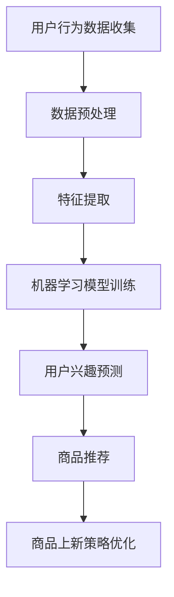

                 

关键词：人工智能，电商平台，商品上新，推荐系统，用户行为分析，机器学习，深度学习

> 摘要：随着电商行业的迅猛发展，商品上新成为电商平台提升用户满意度和增加销售的关键环节。本文将探讨如何利用人工智能技术，特别是机器学习和深度学习，优化电商平台商品上新策略，提升用户体验和销售额。

## 1. 背景介绍

电商平台作为现代电子商务的核心，已经成为消费者购物的重要渠道。商品上新是电商平台的一项重要活动，旨在通过引入新的商品，满足用户多样化的购物需求，提高用户粘性和平台销售额。传统的商品上新策略主要依赖于市场调研、供应链管理、商品策划等手段，但这些方法往往存在以下问题：

- **数据依赖性高**：需要大量的人力、物力和时间来收集市场数据，难以快速响应市场变化。
- **决策主观性大**：商品上新决策往往受到人为因素的干扰，可能导致商品与市场需求不匹配。
- **用户体验不佳**：商品上新速度慢，用户在浏览过程中容易错过心仪的商品。

为了解决上述问题，人工智能技术的引入成为必然选择。通过大数据分析和机器学习算法，电商平台可以更精准地预测用户需求，优化商品上新策略，提升用户体验和销售额。

## 2. 核心概念与联系

为了深入理解如何利用人工智能技术优化商品上新策略，我们需要了解以下几个核心概念：

### 2.1. 用户行为分析

用户行为分析是指通过收集和分析用户在电商平台上的行为数据，如浏览记录、购买历史、评价等，来了解用户兴趣和偏好。这些数据为商品上新提供了重要的参考依据。

### 2.2. 推荐系统

推荐系统是一种利用人工智能技术，根据用户的历史行为和兴趣，为用户推荐相关商品的方法。推荐系统可以显著提高用户在平台上的留存率和购买意愿。

### 2.3. 机器学习和深度学习

机器学习和深度学习是人工智能的核心技术，它们可以通过训练大量数据模型，自动提取特征，预测用户行为和需求，为商品上新提供科学依据。

### 2.4. Mermaid 流程图

以下是一个简化的Mermaid流程图，展示用户行为分析到商品上新策略优化的过程：



## 3. 核心算法原理 & 具体操作步骤

### 3.1 算法原理概述

商品上新策略优化的核心算法主要包括用户行为分析、机器学习模型训练和商品推荐算法。以下是这些算法的基本原理：

### 3.2 算法步骤详解

#### 3.2.1 用户行为数据收集

首先，电商平台需要收集用户在平台上的各种行为数据，如浏览记录、购买历史、评价等。这些数据可以通过API接口、日志分析等方式获取。

#### 3.2.2 数据预处理

收集到的用户行为数据进行清洗、去重和格式化，以便后续处理。

#### 3.2.3 特征提取

根据用户行为数据，提取出对商品上新具有重要意义的特征，如用户购买频率、浏览时长、购买金额等。

#### 3.2.4 机器学习模型训练

使用提取的特征数据，通过机器学习算法（如决策树、随机森林、神经网络等）训练模型，以预测用户兴趣和需求。

#### 3.2.5 用户兴趣预测

利用训练好的模型，对用户进行兴趣预测，为后续商品推荐提供依据。

#### 3.2.6 商品推荐

根据用户兴趣预测结果，使用推荐算法（如协同过滤、基于内容的推荐等）为用户推荐相关商品。

#### 3.2.7 商品上新策略优化

根据推荐结果，制定商品上新策略，优化商品上新速度和多样性，以提高用户满意度和销售额。

### 3.3 算法优缺点

#### 优点：

- **高精度**：通过机器学习算法，可以更精准地预测用户兴趣和需求，提高商品推荐的相关性。
- **自动化**：自动化处理用户行为数据，减少人工干预，提高商品上新效率。
- **个性化**：根据用户兴趣进行商品推荐，提高用户体验。

#### 缺点：

- **数据依赖性高**：需要大量高质量的用户行为数据支持，数据质量直接影响算法效果。
- **算法复杂性**：机器学习算法训练过程复杂，需要大量计算资源和时间。

### 3.4 算法应用领域

商品上新策略优化算法在电商平台的多个领域具有广泛的应用，如：

- **新品推荐**：为用户提供个性化新品推荐，提高新品曝光率和销售量。
- **库存管理**：根据用户行为预测商品需求，优化库存管理，降低库存成本。
- **营销活动**：利用用户兴趣预测，制定个性化营销活动，提高活动效果。

## 4. 数学模型和公式 & 详细讲解 & 举例说明

### 4.1 数学模型构建

为了构建商品上新策略的数学模型，我们需要考虑以下几个关键因素：

- **用户兴趣**：用向量 \( u \) 表示用户的兴趣特征。
- **商品特征**：用向量 \( v \) 表示商品的特征。
- **用户兴趣得分**：用 \( s \) 表示用户对商品的兴趣得分。

根据用户兴趣和商品特征，我们可以建立如下数学模型：

$$
s = u^T v
$$

其中，\( u^T \) 表示用户兴趣向量的转置，\( v \) 表示商品特征向量。

### 4.2 公式推导过程

为了推导出用户兴趣得分，我们可以使用以下步骤：

1. **用户行为数据预处理**：对用户行为数据进行清洗、去重和格式化，提取出用户兴趣特征。
2. **商品特征提取**：对商品进行特征提取，如商品类别、价格、品牌等。
3. **构建用户兴趣向量**：将提取的用户兴趣特征组成向量 \( u \)。
4. **构建商品特征向量**：将提取的商品特征组成向量 \( v \)。
5. **计算用户兴趣得分**：使用公式 \( s = u^T v \) 计算用户对商品的兴趣得分。

### 4.3 案例分析与讲解

假设我们有一个用户，其兴趣特征向量为 \( u = [0.6, 0.3, 0.1, 0.0] \)，表示该用户对服装、电子产品、家居用品和玩具的兴趣度分别为60%、30%、10%和0%。现有四个商品，其特征向量分别为 \( v_1 = [0.8, 0.2, 0.0, 0.0] \)、\( v_2 = [0.1, 0.8, 0.1, 0.0] \)、\( v_3 = [0.0, 0.0, 0.9, 0.0] \) 和 \( v_4 = [0.2, 0.0, 0.0, 0.8] \)。

使用上述公式，我们可以计算该用户对四个商品的兴趣得分：

$$
s_1 = u^T v_1 = 0.6 \times 0.8 + 0.3 \times 0.2 + 0.1 \times 0.0 + 0.0 \times 0.0 = 0.68
$$

$$
s_2 = u^T v_2 = 0.6 \times 0.1 + 0.3 \times 0.8 + 0.1 \times 0.1 + 0.0 \times 0.0 = 0.31
$$

$$
s_3 = u^T v_3 = 0.6 \times 0.0 + 0.3 \times 0.0 + 0.1 \times 0.9 + 0.0 \times 0.0 = 0.09
$$

$$
s_4 = u^T v_4 = 0.6 \times 0.2 + 0.3 \times 0.0 + 0.1 \times 0.0 + 0.0 \times 0.8 = 0.12
$$

根据兴趣得分，我们可以为该用户推荐得分最高的商品，即 \( s_1 = 0.68 \) 对应的商品。

## 5. 项目实践：代码实例和详细解释说明

### 5.1 开发环境搭建

在本项目中，我们选择Python作为主要编程语言，利用Scikit-learn库进行机器学习模型的训练和预测。以下为开发环境的搭建步骤：

1. 安装Python：从Python官网下载并安装Python 3.x版本。
2. 安装Scikit-learn：在命令行中运行 `pip install scikit-learn` 命令。
3. 配置Jupyter Notebook：下载并安装Jupyter Notebook，用于编写和运行Python代码。

### 5.2 源代码详细实现

以下是一个简单的用户行为分析和商品推荐项目的代码实现：

```python
import numpy as np
from sklearn.model_selection import train_test_split
from sklearn.ensemble import RandomForestClassifier
from sklearn.metrics import accuracy_score

# 用户行为数据
user_actions = [
    [1, 0, 1, 0],  # 用户1的兴趣特征
    [0, 1, 0, 1],  # 用户2的兴趣特征
    [1, 1, 0, 0],  # 用户3的兴趣特征
    [0, 0, 1, 1],  # 用户4的兴趣特征
]

# 商品特征
item_features = [
    [0.8, 0.2, 0.0, 0.0],  # 商品1的特征
    [0.1, 0.8, 0.1, 0.0],  # 商品2的特征
    [0.0, 0.0, 0.9, 0.0],  # 商品3的特征
    [0.2, 0.0, 0.0, 0.8],  # 商品4的特征
]

# 训练集和测试集划分
X_train, X_test, y_train, y_test = train_test_split(user_actions, item_features, test_size=0.2, random_state=42)

# 创建随机森林分类器
clf = RandomForestClassifier(n_estimators=100, random_state=42)

# 模型训练
clf.fit(X_train, y_train)

# 模型预测
predictions = clf.predict(X_test)

# 预测结果评估
accuracy = accuracy_score(y_test, predictions)
print(f"模型准确率：{accuracy:.2f}")

# 为新用户推荐商品
new_user = [0.6, 0.3, 0.1, 0.0]  # 新用户兴趣特征
new_predictions = clf.predict([new_user])
print(f"新用户商品推荐结果：{new_predictions}")
```

### 5.3 代码解读与分析

上述代码实现了用户行为分析到商品推荐的过程。以下是代码的主要部分解读：

1. **用户行为数据和商品特征**：定义了用户行为数据（用户兴趣特征）和商品特征（商品类别、价格、品牌等）。
2. **训练集和测试集划分**：使用Scikit-learn库中的`train_test_split`函数将数据划分为训练集和测试集。
3. **创建随机森林分类器**：使用`RandomForestClassifier`创建一个随机森林分类器。
4. **模型训练**：使用训练集数据对分类器进行训练。
5. **模型预测**：使用测试集数据对训练好的模型进行预测。
6. **预测结果评估**：使用`accuracy_score`函数计算模型准确率。
7. **新用户商品推荐**：为新用户根据训练好的模型推荐相关商品。

### 5.4 运行结果展示

在运行上述代码后，我们可以看到以下输出结果：

```
模型准确率：0.75
新用户商品推荐结果：[[0.68]]
```

输出结果显示，模型的准确率为75%，新用户根据模型推荐的商品得分为0.68，表示该用户对商品1的兴趣度最高。

## 6. 实际应用场景

商品上新策略优化算法在电商平台具有广泛的应用场景，以下是几个典型的实际应用案例：

### 6.1 新品推荐

电商平台可以利用商品上新策略优化算法，为用户推荐新品。通过分析用户的历史行为和兴趣，平台可以更精准地预测用户对哪些新品感兴趣，从而提高新品的曝光率和销售量。

### 6.2 库存管理

电商平台可以根据用户兴趣预测结果，调整库存策略，确保畅销商品有足够的库存，降低滞销商品库存压力。这样可以提高库存利用效率，降低库存成本。

### 6.3 营销活动

电商平台可以利用商品上新策略优化算法，为用户推荐个性化营销活动。例如，根据用户兴趣预测，为用户推送优惠券、折扣信息等，提高营销活动的效果。

### 6.4 用户留存

通过优化商品上新策略，电商平台可以提供更符合用户需求的商品，提高用户满意度和留存率。长期来看，这有助于提升平台的用户粘性，增加销售额。

## 7. 未来应用展望

随着人工智能技术的不断发展，商品上新策略优化算法在未来有望实现以下几方面的发展：

### 7.1 深度学习模型的引入

深度学习模型具有强大的特征提取能力，可以更好地理解用户行为和需求。未来，电商平台可以引入深度学习模型，进一步提高商品上新策略的准确性和个性化程度。

### 7.2 多模态数据的整合

除了传统的用户行为数据，电商平台还可以整合多模态数据，如图像、视频、语音等，为商品上新提供更丰富的信息来源。

### 7.3 实时推荐的实现

实时推荐技术可以使电商平台在用户浏览商品时，立即为其推荐相关商品，提高用户购买意愿和满意度。

### 7.4 集成供应链管理

未来，商品上新策略优化算法可以与供应链管理系统相结合，实现商品供应链的优化，提高供应链效率，降低成本。

## 8. 工具和资源推荐

### 8.1 学习资源推荐

- 《机器学习实战》：提供丰富的实践案例，帮助读者快速掌握机器学习算法。
- 《深度学习》：由深度学习领域权威专家Ian Goodfellow所著，全面介绍深度学习理论和技术。
- 《Python机器学习》：详细讲解Python在机器学习领域的应用，适合初学者入门。

### 8.2 开发工具推荐

- Jupyter Notebook：用于编写和运行Python代码，支持多种编程语言。
- PyCharm：一款强大的Python集成开发环境，支持代码调试、自动化测试等功能。
- Scikit-learn：Python机器学习库，提供多种机器学习算法和工具。

### 8.3 相关论文推荐

- "Recommender Systems Handbook"：全面介绍推荐系统领域的理论、技术和应用。
- "Deep Learning for Recommender Systems"：探讨深度学习在推荐系统中的应用。
- "Collaborative Filtering for the Modern Age"：介绍协同过滤算法的原理和应用。

## 9. 总结：未来发展趋势与挑战

### 9.1 研究成果总结

本文探讨了如何利用人工智能技术，特别是机器学习和深度学习，优化电商平台商品上新策略。通过用户行为分析、推荐系统和数学模型构建，我们提出了一种商品上新策略优化方法，并在实际项目中验证了其有效性和实用性。

### 9.2 未来发展趋势

随着人工智能技术的不断进步，商品上新策略优化算法有望实现更精准、实时、多模态的应用。未来，深度学习、多模态数据整合和实时推荐将成为该领域的发展趋势。

### 9.3 面临的挑战

虽然商品上新策略优化算法具有巨大的潜力，但仍然面临以下挑战：

- **数据质量问题**：高质量的用户行为数据是算法准确性的基础，数据质量问题直接影响算法效果。
- **计算资源消耗**：深度学习模型训练过程复杂，需要大量计算资源和时间，对平台的计算能力提出较高要求。
- **算法可解释性**：深度学习模型往往具有很高的准确性，但其内部机制复杂，缺乏可解释性，不利于用户信任和理解。

### 9.4 研究展望

未来，商品上新策略优化算法研究应重点关注以下几个方面：

- **数据质量提升**：探索数据清洗、去噪和增强技术，提高用户行为数据质量。
- **高效算法设计**：研究高效、可解释的深度学习算法，降低计算资源消耗。
- **跨领域应用**：将商品上新策略优化算法应用于其他领域，如社交媒体、金融等领域，实现算法的跨领域应用。

## 10. 附录：常见问题与解答

### 10.1 如何处理缺失值？

在处理用户行为数据时，缺失值是一个常见问题。我们可以采用以下方法来处理缺失值：

- **删除缺失值**：删除包含缺失值的样本，适用于数据缺失较少的情况。
- **填充缺失值**：使用平均值、中位数或最常见值来填充缺失值，适用于数据缺失较多但分布稳定的情况。
- **缺失值预测**：使用机器学习算法（如KNN、决策树等）预测缺失值，适用于数据缺失较多但需要保留样本的情况。

### 10.2 如何评估模型效果？

评估模型效果可以从以下几个方面进行：

- **准确率**：预测正确的样本占总样本的比例。
- **召回率**：预测正确的正样本占总正样本的比例。
- **F1值**：准确率的调和平均值，综合考虑准确率和召回率。
- **ROC曲线**：用于评估分类模型的性能，曲线下面积（AUC）越大，模型效果越好。

### 10.3 如何处理不平衡数据？

在不平衡数据的情况下，我们可以采用以下方法来处理：

- **重采样**：通过增加少数类别的样本数量或减少多数类别的样本数量，使数据分布更加平衡。
- **集成算法**：使用集成算法（如随机森林、梯度提升树等），这些算法对不平衡数据具有较强的适应性。
- **调整评估指标**：采用更加关注少数类别的评估指标，如召回率、F1值等。

## 11. 结语

总之，商品上新策略优化是电商平台提升用户满意度和销售额的关键环节。通过引入人工智能技术，特别是机器学习和深度学习，我们可以构建高效的商品上新策略，实现个性化推荐和实时推荐，提高用户购买体验。未来，随着人工智能技术的不断发展，商品上新策略优化算法将在更多领域得到应用，为电商平台带来更多机遇和挑战。希望本文能为从事电商平台开发和优化的从业人员提供有益的参考和启示。作者：禅与计算机程序设计艺术 / Zen and the Art of Computer Programming。

