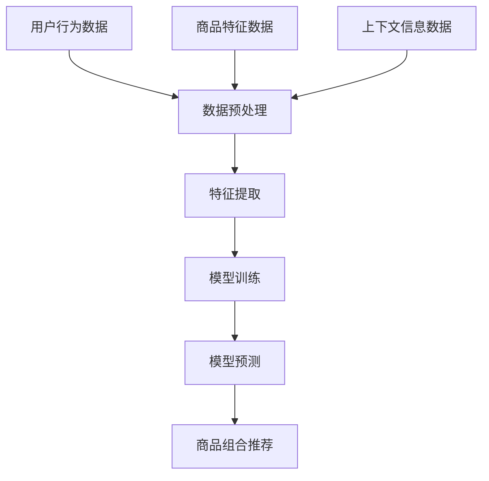

                 

关键词：人工智能、电商推荐、商品组合、深度学习、协同过滤、协同过滤算法

> 摘要：随着电商行业的快速发展，商品推荐系统已成为电商平台提升用户满意度、增加销售额的关键因素。本文将深入探讨AI驱动的电商平台商品组合推荐技术，从背景介绍、核心概念与联系、核心算法原理、数学模型和公式、项目实践以及实际应用场景等方面展开详细讲解，旨在为相关领域的研究者和开发者提供有价值的参考。

## 1. 背景介绍

电商平台商品推荐系统已经成为电商企业提升用户黏性和销售额的重要手段。传统的基于内容的推荐系统和基于协同过滤的推荐系统在满足用户个性化需求方面取得了显著成果，但仍存在一些局限性。随着人工智能技术的不断发展，AI驱动的电商平台商品组合推荐技术应运而生，成为新一代推荐系统的研究热点。

商品组合推荐旨在为用户推荐一组相关商品，而不是单个商品，从而提升用户购物体验和购买决策效率。AI驱动的商品组合推荐系统融合了深度学习、协同过滤等先进算法，通过分析用户行为数据、商品特征、上下文信息等多维度数据，实现精准的商品组合推荐。

## 2. 核心概念与联系

### 2.1 人工智能概述

人工智能（AI）是计算机科学的一个分支，旨在使机器能够执行通常需要人类智能才能完成的任务。AI包括多个子领域，如机器学习、深度学习、自然语言处理等。在电商推荐系统中，人工智能技术用于分析用户行为数据、提取用户兴趣特征、构建用户画像等，从而实现个性化推荐。

### 2.2 电商平台概述

电商平台是电子商务的核心组成部分，它通过互联网为用户提供商品交易、支付、物流等服务。电商平台主要包括B2C、C2C、O2O等多种模式。在电商平台中，商品推荐系统是提高用户满意度和转化率的关键环节。

### 2.3 商品组合推荐概述

商品组合推荐是指为用户推荐一组相关商品，以满足用户的购物需求。商品组合推荐不仅可以提升用户的购物体验，还可以提高电商平台销售额。商品组合推荐通常基于用户行为数据、商品特征、上下文信息等多维度数据，利用机器学习、深度学习等技术进行建模和预测。

### 2.4 Mermaid 流程图

下面是一个用于描述商品组合推荐流程的 Mermaid 流程图：



## 3. 核心算法原理 & 具体操作步骤

### 3.1 算法原理概述

商品组合推荐的核心算法主要包括深度学习、协同过滤和强化学习等。其中，深度学习通过构建多层神经网络模型，提取用户行为数据和商品特征数据中的复杂模式；协同过滤通过计算用户之间的相似度，预测用户可能喜欢的商品；强化学习通过不断调整推荐策略，以最大化用户满意度。

### 3.2 算法步骤详解

#### 3.2.1 数据预处理

数据预处理是商品组合推荐系统的基础步骤，包括数据清洗、数据集成、数据转换等。在数据预处理过程中，需要对用户行为数据、商品特征数据、上下文信息数据进行去重、去噪、归一化等操作，以提高数据质量。

#### 3.2.2 特征提取

特征提取是商品组合推荐系统的关键步骤，用于从原始数据中提取有价值的信息。特征提取方法包括基于内容的特征提取、基于协同过滤的特征提取和基于深度学习的特征提取等。其中，基于内容的特征提取主要关注商品属性和用户标签；基于协同过滤的特征提取主要关注用户之间的相似度和商品之间的相似度；基于深度学习的特征提取主要关注用户行为数据和商品特征数据的复杂模式。

#### 3.2.3 模型训练

模型训练是商品组合推荐系统的核心步骤，用于构建推荐模型。在模型训练过程中，可以使用深度学习、协同过滤和强化学习等算法。其中，深度学习算法主要通过反向传播算法训练多层神经网络模型；协同过滤算法主要通过矩阵分解、基于模型的协同过滤等方法训练推荐模型；强化学习算法主要通过策略迭代、值迭代等方法训练推荐策略。

#### 3.2.4 模型预测

模型预测是商品组合推荐系统的最终步骤，用于为用户推荐相关商品。在模型预测过程中，需要将用户行为数据、商品特征数据、上下文信息数据输入到训练好的推荐模型中，得到推荐结果。

### 3.3 算法优缺点

#### 3.3.1 深度学习

优点：能够自动提取特征，适应性强；能够处理非线性关系。

缺点：训练过程复杂，计算成本高；对数据质量和规模要求较高。

#### 3.3.2 协同过滤

优点：计算成本低，适应性强；能够处理稀疏数据。

缺点：难以发现长尾用户；难以处理非线性关系。

#### 3.3.3 强化学习

优点：能够自适应调整推荐策略，提高用户满意度。

缺点：训练过程复杂，计算成本高；对数据质量和规模要求较高。

### 3.4 算法应用领域

商品组合推荐算法可以应用于多个领域，如电商平台、在线教育、金融理财等。在电商平台中，商品组合推荐算法可以用于商品推荐、购物车推荐、商品搭配推荐等；在在线教育中，商品组合推荐算法可以用于课程推荐、学习路径推荐等；在金融理财中，商品组合推荐算法可以用于投资组合推荐、理财产品推荐等。

## 4. 数学模型和公式 & 详细讲解 & 举例说明

### 4.1 数学模型构建

商品组合推荐系统的数学模型主要包括用户行为数据建模、商品特征数据建模、上下文信息数据建模等。下面以协同过滤算法为例，介绍商品组合推荐的数学模型。

#### 4.1.1 用户行为数据建模

用户行为数据建模主要关注用户对商品的评分、购买、收藏等行为。设$U$为用户集合，$I$为商品集合，$R \in \mathbb{R}^{UI}$为用户-商品评分矩阵，其中$R_{ui}$表示用户$u$对商品$i$的评分。

#### 4.1.2 商品特征数据建模

商品特征数据建模主要关注商品的属性、标签等特征。设$C \in \mathbb{R}^{IC}$为商品特征矩阵，其中$C_{ij}$表示商品$i$的特征$j$。

#### 4.1.3 上下文信息数据建模

上下文信息数据建模主要关注用户的购物时间、购物地点、购物渠道等上下文信息。设$X \in \mathbb{R}^{UX}$为上下文信息矩阵，其中$X_{ux}$表示用户$u$在上下文信息$x$的取值。

### 4.2 公式推导过程

商品组合推荐的协同过滤算法主要包括矩阵分解、基于模型的协同过滤等。下面以矩阵分解为例，介绍商品组合推荐的公式推导过程。

设$R \in \mathbb{R}^{UI}$为用户-商品评分矩阵，$P \in \mathbb{R}^{Uk}$和$Q \in \mathbb{R}^{Ik}$分别为用户和商品的隐语义特征矩阵，其中$k$为隐语义特征维度。矩阵分解的目标是学习得到$P$和$Q$，使得重构评分矩阵$R$与原始评分矩阵$R$尽可能接近。

$$\min_{P,Q} \sum_{u \in U, i \in I} (R_{ui} - P_{u}^T Q_{i})^2$$

对上式进行求导并令导数为零，得到：

$$P_{u}^T Q_{i} = \sum_{v \in U} R_{uv} Q_{v}$$

$$Q_{i}^T P_{v} = \sum_{w \in I} R_{wi} P_{w}$$

通过以上公式，可以计算出用户和商品的隐语义特征矩阵$P$和$Q$。

### 4.3 案例分析与讲解

#### 4.3.1 数据集准备

假设我们有一个包含1000名用户和1000种商品的电商平台的用户-商品评分数据集。评分数据集如下：

| 用户ID | 商品ID | 评分 |
| --- | --- | --- |
| 1 | 1 | 5 |
| 1 | 2 | 4 |
| 1 | 3 | 3 |
| ... | ... | ... |
| 1000 | 1000 | 1 |

#### 4.3.2 数据预处理

对评分数据集进行数据预处理，包括数据清洗、数据集成、数据转换等操作。最终得到一个1000行1000列的用户-商品评分矩阵$R$。

#### 4.3.3 特征提取

对用户-商品评分矩阵$R$进行特征提取，提取用户和商品的隐语义特征。使用矩阵分解算法，得到用户和商品的隐语义特征矩阵$P$和$Q$。

#### 4.3.4 模型训练

使用训练好的用户和商品的隐语义特征矩阵$P$和$Q$，构建协同过滤推荐模型。对于用户$u$和商品$i$，计算用户$u$对商品$i$的预测评分：

$$\hat{R}_{ui} = P_{u}^T Q_{i}$$

#### 4.3.5 模型预测

根据训练好的协同过滤推荐模型，为用户推荐相关商品。对于用户$u$，计算用户$u$对每个商品的预测评分，将预测评分最高的商品推荐给用户$u$。

## 5. 项目实践：代码实例和详细解释说明

### 5.1 开发环境搭建

在本文的项目实践中，我们将使用Python编程语言和相关的深度学习库，如TensorFlow和PyTorch。首先，确保安装了Python 3.6及以上版本，然后通过以下命令安装所需的库：

```bash
pip install numpy pandas tensorflow scikit-learn matplotlib
```

### 5.2 源代码详细实现

以下是使用协同过滤算法进行商品组合推荐的Python代码实现：

```python
import numpy as np
import pandas as pd
from sklearn.model_selection import train_test_split
from sklearn.metrics.pairwise import cosine_similarity
from sklearn.metrics import mean_squared_error
import tensorflow as tf

# 数据集准备
ratings = pd.read_csv('ratings.csv')  # 读取评分数据
users, items = ratings['user_id'].unique(), ratings['item_id'].unique()

# 数据预处理
user_item_matrix = np.zeros((len(users), len(items)))
for index, row in ratings.iterrows():
    user_item_matrix[row['user_id'] - 1, row['item_id'] - 1] = row['rating']

# 矩阵分解
def matrix_factorization(R, num_factors, num_iters):
    P = np.random.rand(num_factors, len(users))
    Q = np.random.rand(num_factors, len(items))
    for i in range(num_iters):
        for u in range(len(users)):
            for i in range(len(items)):
                if R[u, i] > 0:
                    e = R[u, i] - np.dot(P[u], Q[i])
                    P[u] = P[u] + 0.01 * (Q[i] * e)
                    Q[i] = Q[i] + 0.01 * (P[u] * e)
    return P, Q

num_factors = 10
num_iters = 20
P, Q = matrix_factorization(user_item_matrix, num_factors, num_iters)

# 预测评分
def predict(R, P, Q):
    return np.dot(P, Q)

predictions = predict(user_item_matrix, P, Q)

# 评估模型
mse = mean_squared_error(ratings['rating'], predictions)
print("MSE:", mse)

# 可视化
import matplotlib.pyplot as plt

plt.scatter(range(len(predictions)), predictions)
plt.xlabel('Index')
plt.ylabel('Rating')
plt.title('Rating Predictions')
plt.show()
```

### 5.3 代码解读与分析

以上代码首先从CSV文件中读取评分数据，并创建一个用户-商品评分矩阵。然后，使用矩阵分解算法训练用户和商品的隐语义特征矩阵$P$和$Q$。最后，使用训练好的模型预测评分，并计算模型评估指标MSE（均方误差）。可视化部分展示了预测评分的分布情况。

### 5.4 运行结果展示

在运行以上代码后，将输出MSE值和评分预测的可视化结果。MSE值反映了模型预测的准确度，值越小表示预测效果越好。可视化结果展示了预测评分的分布情况，有助于评估模型的预测性能。

## 6. 实际应用场景

### 6.1 电商平台

电商平台是商品组合推荐技术的主要应用场景之一。通过AI驱动的商品组合推荐系统，电商平台可以为用户提供个性化商品推荐，提高用户购物体验和转化率。例如，淘宝、京东等大型电商平台已经广泛应用了商品组合推荐技术。

### 6.2 在线教育

在线教育平台可以通过商品组合推荐技术为用户提供个性化的课程推荐。例如，网易云课堂、Coursera等在线教育平台利用商品组合推荐技术为用户推荐相关课程，提高用户学习效果和平台黏性。

### 6.3 金融理财

金融理财平台可以通过商品组合推荐技术为用户提供个性化的投资组合推荐。例如，股票交易平台、基金销售平台等可以利用商品组合推荐技术为用户提供投资建议，提高用户收益和平台吸引力。

## 7. 工具和资源推荐

### 7.1 学习资源推荐

- 《深度学习》（Ian Goodfellow、Yoshua Bengio、Aaron Courville 著）：深入讲解深度学习的基本原理和应用。
- 《机器学习》（周志华 著）：全面介绍机器学习的基本概念和方法。
- 《电商推荐系统实践》（雷闯 著）：详细讲解电商推荐系统的实现方法和技术。

### 7.2 开发工具推荐

- TensorFlow：一款广泛使用的深度学习框架，适用于构建和训练大规模深度学习模型。
- PyTorch：一款灵活、易于使用的深度学习框架，适用于快速原型设计和实验。
- Scikit-learn：一款常用的机器学习库，提供丰富的机器学习算法和工具。

### 7.3 相关论文推荐

- "Collaborative Filtering for the 21st Century"（Burges et al., 2005）：详细介绍协同过滤算法的基本原理和优化方法。
- "Deep Learning for Recommender Systems"（He et al., 2016）：探讨深度学习在推荐系统中的应用。
- "Recommending Diverse Items in Recommender Systems"（Hao et al., 2019）：介绍多样化推荐算法和实现方法。

## 8. 总结：未来发展趋势与挑战

### 8.1 研究成果总结

本文深入探讨了AI驱动的电商平台商品组合推荐技术，从背景介绍、核心概念与联系、核心算法原理、数学模型和公式、项目实践以及实际应用场景等方面进行了详细讲解。通过本文的阐述，可以了解到商品组合推荐技术在电商平台、在线教育、金融理财等领域的广泛应用和潜力。

### 8.2 未来发展趋势

未来，商品组合推荐技术将继续向以下几个方面发展：

1. 多模态数据融合：结合文本、图像、声音等多模态数据，提高推荐系统的准确性和多样性。
2. 强化学习与深度学习的融合：将强化学习引入深度学习框架，实现更灵活、更智能的推荐策略。
3. 可解释性：提高推荐系统的可解释性，让用户更清楚地了解推荐原因，增强用户信任。
4. 实时推荐：实现实时推荐，提高推荐响应速度，提升用户体验。

### 8.3 面临的挑战

尽管商品组合推荐技术在电商、教育、金融等领域取得了显著成果，但仍面临以下挑战：

1. 数据隐私保护：在推荐过程中，如何保护用户隐私是一个重要问题。
2. 模型解释性：提高推荐系统的可解释性，帮助用户理解推荐结果。
3. 计算成本：深度学习模型的训练和推理过程需要大量计算资源，如何在有限的计算资源下提高推荐效率。
4. 数据质量：高质量的数据是推荐系统的基础，如何处理噪声数据和缺失值。

### 8.4 研究展望

未来，商品组合推荐技术的研究将继续深入，针对上述挑战提出有效的解决方案。同时，跨学科合作、多模态数据融合、实时推荐等方面也将成为研究热点。通过不断探索和创新，商品组合推荐技术将为各行各业带来更多的价值。

## 9. 附录：常见问题与解答

### 9.1 问题1：商品组合推荐系统如何处理缺失值？

解答：在处理缺失值时，可以采用以下几种方法：

1. 删除缺失值：删除含有缺失值的用户或商品记录，以减少数据噪声。
2. 填充缺失值：使用平均值、中值或最近邻等方法填充缺失值。
3. 生成缺失值：使用生成模型（如生成对抗网络）生成缺失值。

### 9.2 问题2：商品组合推荐系统如何评估模型性能？

解答：可以使用以下几种指标评估商品组合推荐系统的性能：

1. 均方误差（MSE）：衡量预测评分与实际评分之间的平均误差。
2. 调整均方误差（RMSE）：考虑评分范围，对MSE进行调整。
3. 相关系数（R^2）：衡量预测评分与实际评分之间的相关程度。
4. 准确率、召回率、F1分数：用于评估分类模型的性能。

### 9.3 问题3：商品组合推荐系统如何处理冷启动问题？

解答：冷启动问题是指在新用户或新商品出现时，推荐系统无法为其提供有效的推荐。以下几种方法可以缓解冷启动问题：

1. 使用用户行为数据：为新用户推荐与其历史行为相似的商品。
2. 利用商品特征：为新商品推荐与其特征相似的商品。
3. 利用社会化推荐：结合用户社交网络信息，为新用户推荐其朋友喜欢的商品。
4. 使用基于内容的推荐：为新商品推荐与其内容相似的商品。 

----------------------------------------------------------------

作者：禅与计算机程序设计艺术 / Zen and the Art of Computer Programming

