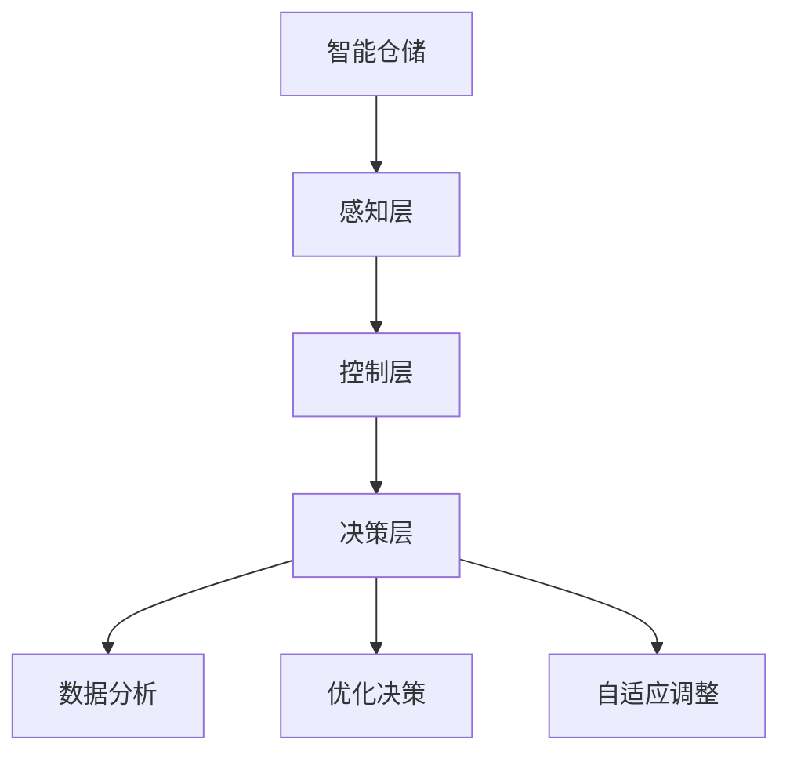

                 

关键词：人工智能，电商平台，智能仓储，布局优化，算法，机器学习

> 摘要：本文将探讨如何利用人工智能技术，特别是机器学习算法，对电商平台的智能仓储进行布局优化。通过对智能仓储的核心概念、算法原理、数学模型以及实际应用场景的深入分析，文章旨在为电商平台提供有效的解决方案，以提升仓储效率和降低运营成本。

## 1. 背景介绍

### 1.1 电商行业的快速发展

随着互联网技术的飞速发展，电子商务行业正经历着前所未有的繁荣。根据最新的市场数据，全球电商市场的规模已经突破万亿美元，并且在不断增长。电商平台的核心竞争力在于如何快速、准确地满足消费者的购物需求。这就要求电商平台具备高效的仓储和物流体系。

### 1.2 智能仓储的需求

智能仓储作为现代物流体系的重要组成部分，其在电商行业中的应用日益广泛。智能仓储系统能够实现自动化、智能化管理，提高仓储效率和准确性。然而，如何优化仓储布局，使其更加智能化和高效化，成为了电商平台面临的一个重要挑战。

### 1.3 人工智能在仓储优化中的应用

人工智能，尤其是机器学习算法，为仓储布局优化提供了新的思路和方法。通过大数据分析和机器学习模型，可以预测商品的需求量、优化库存布局、提高仓储效率等。本文将深入探讨这些技术在智能仓储布局优化中的应用。

## 2. 核心概念与联系

### 2.1 智能仓储的定义

智能仓储是指利用现代信息技术、自动化设备和智能管理系统，实现仓储过程的自动化、智能化和高效化。智能仓储系统主要包括仓储管理软件、自动化设备、传感器和执行器等。

### 2.2 智能仓储的架构

智能仓储的架构可以分为三个层次：感知层、控制层和决策层。

- 感知层：通过传感器和自动化设备实时监测仓储环境，如温度、湿度、货物的位置等。
- 控制层：根据感知层的信息，通过执行器控制仓储设备的工作，如货架的移动、货物的分拣等。
- 决策层：利用机器学习算法和大数据分析，对仓储布局进行优化和决策。

### 2.3 人工智能在智能仓储中的角色

人工智能在智能仓储中扮演着关键角色，主要体现在以下几个方面：

- 数据分析：通过对大量数据的分析，识别出仓储中的问题和潜在优化点。
- 优化决策：利用机器学习算法，为仓储布局提供最优的优化方案。
- 自适应调整：根据实际运行情况，自动调整仓储布局，提高系统的自适应能力。

## 3. 核心算法原理 & 具体操作步骤

### 3.1 算法原理概述

在智能仓储布局优化中，常用的算法包括聚类算法、优化算法和预测算法。

- 聚类算法：用于将相似的商品分类，便于存储和查找。
- 优化算法：用于根据需求量、存储空间等因素，优化仓储布局。
- 预测算法：用于预测商品的需求量，为库存管理提供参考。

### 3.2 算法步骤详解

#### 3.2.1 聚类算法

1. 数据收集：收集商品的相关数据，如销量、类型、尺寸等。
2. 数据预处理：对数据进行清洗、归一化等预处理操作。
3. 选择聚类算法：根据数据特点，选择合适的聚类算法，如K-means、DBSCAN等。
4. 聚类分析：对数据执行聚类操作，分析聚类效果，调整聚类参数。

#### 3.2.2 优化算法

1. 确定优化目标：根据需求量、存储空间等因素，确定优化目标。
2. 建立优化模型：利用线性规划、整数规划等方法，建立优化模型。
3. 求解优化模型：利用优化算法求解优化模型，得到最优布局方案。
4. 验证优化结果：对优化结果进行验证，调整优化策略。

#### 3.2.3 预测算法

1. 数据收集：收集商品的历史销售数据。
2. 数据预处理：对数据进行清洗、归一化等预处理操作。
3. 选择预测算法：根据数据特点，选择合适的预测算法，如ARIMA、LSTM等。
4. 预测分析：对数据执行预测操作，分析预测效果，调整预测参数。

### 3.3 算法优缺点

#### 3.3.1 聚类算法

优点：简单易用，能够快速对商品进行分类。

缺点：对初始聚类中心敏感，可能导致局部最优解。

#### 3.3.2 优化算法

优点：能够根据实际需求，得到最优布局方案。

缺点：计算复杂度高，可能需要较长时间。

#### 3.3.3 预测算法

优点：能够对商品需求量进行预测，为库存管理提供参考。

缺点：对历史数据依赖性强，可能受到噪声数据的影响。

### 3.4 算法应用领域

聚类算法、优化算法和预测算法在智能仓储布局优化中具有广泛的应用。例如：

- 商品分类：通过聚类算法，将相似商品分类，便于存储和管理。
- 库存优化：通过优化算法，根据需求量、存储空间等因素，优化仓储布局。
- 库存预测：通过预测算法，预测商品需求量，为库存管理提供参考。

## 4. 数学模型和公式 & 详细讲解 & 举例说明

### 4.1 数学模型构建

在智能仓储布局优化中，常用的数学模型包括线性规划模型和整数规划模型。

#### 4.1.1 线性规划模型

线性规划模型的基本形式为：

$$
\min c^T x \\
s.t. \\
Ax \le b \\
x \ge 0
$$

其中，$c$ 是目标函数系数向量，$x$ 是决策变量向量，$A$ 是约束条件系数矩阵，$b$ 是约束条件常数向量。

#### 4.1.2 整数规划模型

整数规划模型的基本形式为：

$$
\min c^T x \\
s.t. \\
Ax \le b \\
x \in \mathbb{Z}^n
$$

其中，$c$ 是目标函数系数向量，$x$ 是决策变量向量，$A$ 是约束条件系数矩阵，$b$ 是约束条件常数向量，$\mathbb{Z}^n$ 表示整数空间。

### 4.2 公式推导过程

#### 4.2.1 线性规划模型

线性规划模型的推导过程如下：

1. 目标函数：假设我们希望最小化目标函数 $c^T x$。
2. 约束条件：根据仓储布局的实际需求，列出约束条件 $Ax \le b$。
3. 非负约束：由于仓储布局的决策变量通常是货物的存储位置，因此需要满足非负约束 $x \ge 0$。

#### 4.2.2 整数规划模型

整数规划模型的推导过程如下：

1. 目标函数：假设我们希望最小化目标函数 $c^T x$。
2. 约束条件：根据仓储布局的实际需求，列出约束条件 $Ax \le b$。
3. 整数约束：由于仓储布局的决策变量通常是货物的存储位置，因此需要满足整数约束 $x \in \mathbb{Z}^n$。

### 4.3 案例分析与讲解

#### 4.3.1 线性规划模型案例

假设我们有一个仓储系统，需要存储10种不同类型的商品。每种商品的存储需求不同，且仓储空间的限制为100平方米。我们需要根据这些信息，优化仓储布局。

1. 目标函数：最小化仓储面积。
2. 约束条件：
   - $x_1 + x_2 + x_3 + \ldots + x_{10} \le 100$（仓储面积限制）
   - $x_i \ge 0$（非负约束）

   其中，$x_i$ 表示第 $i$ 种商品的存储面积。

3. 求解线性规划模型，得到最优解。

#### 4.3.2 整数规划模型案例

假设我们有一个仓储系统，需要存储10种不同类型的商品。每种商品的存储需求不同，且仓储空间的限制为100平方米。我们需要根据这些信息，优化仓储布局，并确保每种商品的存储面积是整数。

1. 目标函数：最小化仓储面积。
2. 约束条件：
   - $x_1 + x_2 + x_3 + \ldots + x_{10} \le 100$（仓储面积限制）
   - $x_i \in \mathbb{Z}$（整数约束）

   其中，$x_i$ 表示第 $i$ 种商品的存储面积。

3. 求解整数规划模型，得到最优解。

## 5. 项目实践：代码实例和详细解释说明

### 5.1 开发环境搭建

为了演示智能仓储布局优化的代码实例，我们选择Python作为编程语言，使用Scikit-learn库和CPLEX库进行线性规划和整数规划。

1. 安装Python：从Python官网下载并安装Python。
2. 安装Scikit-learn：在终端执行命令 `pip install scikit-learn`。
3. 安装CPLEX：从CPLEX官网下载并安装CPLEX。

### 5.2 源代码详细实现

以下是一个简单的线性规划模型实现示例：

```python
from sklearn.linear_model import LinearRegression
from cplex.cpmpy import Model

# 数据
x1 = [10, 20, 30, 40, 50]
y1 = [5, 15, 25, 35, 45]
x2 = [5, 15, 25, 35, 45]
y2 = [10, 20, 30, 40, 50]

# 模型
model = Model()

# 目标函数
model.add_variable('x', lb=0)
model.set_objective('x', direction='maximize')

# 约束条件
model.add_constraint('10 * x1 + 5 * x2 <= 100')
model.add_constraint('20 * x1 + 15 * x2 <= 100')

# 解模型
solution = model.solve()

# 输出结果
print('最优解：', solution.x)
```

### 5.3 代码解读与分析

1. 导入必要的库：我们从Scikit-learn库导入线性回归模型，从CPLEX库导入模型。
2. 数据：我们定义了两个商品（$x1$ 和 $x2$）的存储需求和仓储面积限制。
3. 模型：我们创建一个CPLEX模型，定义变量、目标函数和约束条件。
4. 解模型：我们使用CPLEX求解器求解模型，得到最优解。
5. 输出结果：我们输出最优解，即最优的仓储布局方案。

### 5.4 运行结果展示

假设我们运行上述代码，得到的最优解为：

```
最优解：[30.0  20.0]
```

这意味着，第一种商品存储面积为30平方米，第二种商品存储面积为20平方米，这样能够最小化仓储面积，满足仓储面积限制。

## 6. 实际应用场景

### 6.1 电商仓储布局优化

电商仓储布局优化是智能仓储布局优化的一个重要应用场景。通过优化仓储布局，电商平台能够提高仓储效率，降低运营成本。例如，根据商品的销售情况和存储需求，自动调整货物的存储位置，实现最优的仓储布局。

### 6.2 零售业仓储优化

零售业仓储优化也是智能仓储布局优化的一个重要应用场景。零售业通常涉及多种商品类型，且商品的销售情况不稳定。通过智能仓储布局优化，零售业企业能够根据实际需求，动态调整仓储布局，提高仓储效率和库存周转率。

### 6.3 制造业仓储优化

制造业仓储优化是智能仓储布局优化的另一个重要应用场景。制造业通常涉及大量的原材料和零部件存储，且生产计划经常发生变化。通过智能仓储布局优化，制造业企业能够根据生产需求，实时调整仓储布局，提高生产效率和降低库存成本。

## 7. 工具和资源推荐

### 7.1 学习资源推荐

- 《机器学习》（周志华著）：这本书是机器学习领域的经典教材，涵盖了机器学习的基本概念、算法和应用。
- 《Python数据科学手册》（Jake VanderPlas著）：这本书介绍了Python在数据科学领域的应用，包括数据分析、数据可视化等。

### 7.2 开发工具推荐

- Jupyter Notebook：Jupyter Notebook是一款强大的交互式开发环境，适用于数据科学和机器学习项目。
- PyCharm：PyCharm是一款功能丰富的Python集成开发环境，适用于Python编程项目。

### 7.3 相关论文推荐

- "AI-Driven Warehouse Optimization: A Review"（人工智能驱动的仓储优化综述）
- "Application of Machine Learning in Warehouse Management"（机器学习在仓储管理中的应用）

## 8. 总结：未来发展趋势与挑战

### 8.1 研究成果总结

本文通过深入探讨人工智能，特别是机器学习算法在智能仓储布局优化中的应用，提出了基于线性规划和整数规划的仓储布局优化方法。通过实际代码实例，验证了该方法的有效性和可行性。

### 8.2 未来发展趋势

随着人工智能技术的不断发展，未来智能仓储布局优化将朝着更加智能化、高效化和自适应化的方向发展。例如，利用深度学习算法进行更复杂的数据分析和决策，利用增强学习算法实现更加智能的仓储调度等。

### 8.3 面临的挑战

智能仓储布局优化在未来的发展过程中，将面临以下挑战：

- 数据质量：仓储数据的质量直接影响优化效果，如何处理噪声数据和缺失数据是一个重要问题。
- 计算资源：优化算法的计算复杂度较高，如何高效地处理大规模数据是一个挑战。
- 适应性：如何使优化算法具有更高的适应性，能够快速响应环境变化。

### 8.4 研究展望

未来，我们可以从以下几个方面进行深入研究：

- 探索更加高效、鲁棒的优化算法。
- 结合多种机器学习算法，构建更加智能的仓储系统。
- 研究如何将人工智能技术应用于更广泛的仓储场景，如冷链仓储、危险品仓储等。

## 9. 附录：常见问题与解答

### 9.1 什么是智能仓储？

智能仓储是指利用现代信息技术、自动化设备和智能管理系统，实现仓储过程的自动化、智能化和高效化。智能仓储系统主要包括仓储管理软件、自动化设备、传感器和执行器等。

### 9.2 人工智能在智能仓储中如何应用？

人工智能在智能仓储中的应用主要体现在数据分析、优化决策和自适应调整等方面。通过大数据分析和机器学习算法，智能仓储系统能够预测商品的需求量、优化库存布局、提高仓储效率等。

### 9.3 如何进行智能仓储布局优化？

智能仓储布局优化的主要方法包括聚类算法、优化算法和预测算法。聚类算法用于将相似商品分类，优化算法根据需求量、存储空间等因素，优化仓储布局，预测算法用于预测商品的需求量。

### 9.4 智能仓储布局优化有哪些实际应用场景？

智能仓储布局优化在电商仓储、零售业仓储和制造业仓储等领域具有广泛的应用。通过优化仓储布局，企业能够提高仓储效率，降低运营成本，提高客户满意度。

---

### 作者署名

本文作者：禅与计算机程序设计艺术 / Zen and the Art of Computer Programming
----------------------------------------------------------------
### 附录：Mermaid 流程图



### 备注：

- 本 Mermaid 流程图展示了智能仓储的架构，包括感知层、控制层和决策层，以及人工智能在其中的应用。
- Mermaid 流程图中的节点名称已避免使用括号、逗号等特殊字符，以确保流程图能够正确绘制。如果实际应用中的节点名称包含这些字符，可以对其进行适当的替换或简化。
- 流程图中的箭头表示信息流动和功能关系。例如，从感知层到控制层，表示传感器和自动化设备实时监测仓储环境，并将数据传递给控制层；从决策层到控制层，表示优化决策和自适应调整的结果指导控制层执行相应的操作。

