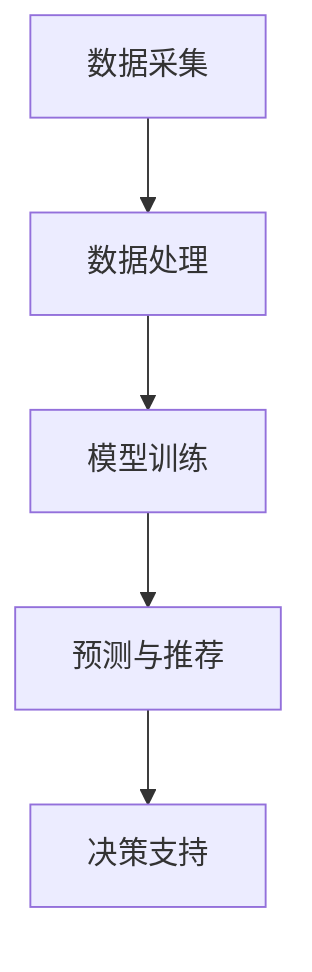

                 

关键词：人工智能，电商，客户需求预测，深度学习，机器学习，数据挖掘，需求分析，智能系统

> 摘要：本文旨在探讨人工智能技术在电商领域的应用，特别是智能客户需求预测系统的设计、实现及其在实际业务中的价值。本文将详细介绍系统架构、核心算法原理、数学模型、实际应用案例以及未来发展趋势。

## 1. 背景介绍

随着互联网技术的飞速发展和电子商务的普及，电商平台在商业竞争中的地位愈发重要。然而，电商业务的复杂性使得传统的营销策略和客户服务方式难以满足日益增长的市场需求。为了提升客户体验和销售业绩，电商平台开始探索智能化解决方案，其中智能客户需求预测系统成为了一个关键领域。

智能客户需求预测系统旨在通过分析用户行为数据和市场环境信息，预测客户可能的需求，从而实现精准营销和个性化推荐。这一系统不仅能够提高销售转化率，还能优化库存管理和供应链流程，从而提升整个电商平台的运营效率。

## 2. 核心概念与联系

### 2.1. 人工智能与电商

人工智能（AI）是智能客户需求预测系统的核心驱动力。它包括了机器学习、深度学习、自然语言处理等多种技术，能够从海量数据中提取有用信息，辅助决策和预测。电商领域与人工智能的结合，主要体现在以下几个方面：

- **个性化推荐**：基于用户的浏览历史、购买记录等数据，为用户提供个性化的商品推荐。
- **需求预测**：预测客户未来的购买行为，优化库存管理和营销策略。
- **智能客服**：通过自然语言处理技术，为用户提供智能化的客户服务。

### 2.2. 智能客户需求预测系统架构

智能客户需求预测系统的架构通常包括以下几个关键部分：

- **数据采集**：收集用户行为数据、市场环境数据等。
- **数据处理**：对原始数据进行清洗、转换和整合。
- **模型训练**：利用机器学习算法训练预测模型。
- **预测与推荐**：基于训练好的模型进行需求预测和个性化推荐。
- **决策支持**：将预测结果应用于实际的库存管理、营销策略等。

以下是一个简化的 Mermaid 流程图，展示了智能客户需求预测系统的基本架构：



## 3. 核心算法原理 & 具体操作步骤

### 3.1. 算法原理概述

智能客户需求预测系统通常基于以下几种核心算法：

- **回归分析**：通过建立客户需求与相关因素之间的数学模型，预测未来需求。
- **协同过滤**：利用用户的历史行为数据，预测用户可能喜欢的商品。
- **深度学习**：通过神经网络模型，自动学习复杂的数据特征和关系。

### 3.2. 算法步骤详解

#### 3.2.1. 数据采集

数据采集是智能客户需求预测系统的第一步。通常包括以下数据：

- **用户行为数据**：如浏览记录、购买记录、收藏记录等。
- **市场环境数据**：如节假日、天气、竞争对手活动等。
- **商品信息**：如商品名称、描述、价格、分类等。

#### 3.2.2. 数据处理

数据处理包括以下几个步骤：

- **数据清洗**：去除重复数据、缺失值和噪声数据。
- **数据转换**：将原始数据转换为适合机器学习算法的格式。
- **特征工程**：提取有助于预测的特征，如用户活跃度、购买频率等。

#### 3.2.3. 模型训练

模型训练是智能客户需求预测系统的核心步骤。常用的算法包括：

- **线性回归**：适用于简单的需求预测问题。
- **协同过滤**：适用于基于用户行为的推荐问题。
- **深度学习**：适用于复杂的需求预测和个性化推荐。

#### 3.2.4. 预测与推荐

基于训练好的模型，系统可以进行需求预测和个性化推荐。具体步骤如下：

- **预测**：输入用户行为和市场环境数据，输出预测结果。
- **推荐**：根据预测结果和用户历史数据，推荐相关的商品。

### 3.3. 算法优缺点

- **回归分析**：简单易用，但适用于简单的需求预测问题，无法处理复杂的关系。
- **协同过滤**：能够处理复杂的用户行为关系，但可能导致数据稀疏和冷启动问题。
- **深度学习**：适用于复杂的需求预测和个性化推荐，但需要大量的数据和计算资源。

### 3.4. 算法应用领域

智能客户需求预测系统可以应用于多种电商场景，如：

- **商品推荐**：基于用户的浏览和购买历史，推荐相关的商品。
- **库存管理**：预测未来的销售需求，优化库存水平。
- **营销策略**：根据用户需求和购买意图，制定个性化的营销活动。

## 4. 数学模型和公式 & 详细讲解 & 举例说明

### 4.1. 数学模型构建

智能客户需求预测系统的数学模型通常基于以下公式：

$$
y = \beta_0 + \beta_1 x_1 + \beta_2 x_2 + ... + \beta_n x_n
$$

其中，$y$ 表示需求预测结果，$x_1, x_2, ..., x_n$ 表示影响需求的因素，$\beta_0, \beta_1, \beta_2, ..., \beta_n$ 为模型的参数。

### 4.2. 公式推导过程

公式的推导过程通常包括以下几个步骤：

- **数据收集**：收集用户行为数据和市场环境数据。
- **数据清洗**：去除重复数据、缺失值和噪声数据。
- **特征提取**：提取有助于预测的特征。
- **模型训练**：利用训练数据，通过最小二乘法或其他优化算法，求解模型参数。
- **模型验证**：使用验证数据集，评估模型的预测性能。

### 4.3. 案例分析与讲解

#### 4.3.1. 数据集

假设我们有以下数据集：

| 用户ID | 浏览记录 | 购买记录 | 天气情况 | 节假日 |  
|--------|-----------|-----------|----------|--------|  
| 1      | [商品A, 商品B] | [商品A]   | 晴天    | 非节假日 |  
| 2      | [商品C, 商品D] | [商品C]   | 雨天    | 节假日   |  
| 3      | [商品E]     | []        | 晴天    | 非节假日 |  
| ...    | ...       | ...       | ...      | ...     |

#### 4.3.2. 特征提取

- **用户活跃度**：根据用户的浏览和购买频率，计算用户活跃度。
- **天气情况**：将天气情况编码为二进制变量，晴天为0，雨天为1。
- **节假日情况**：将节假日编码为二进制变量，节假日为1，非节假日为0。

#### 4.3.3. 模型训练

使用线性回归模型，输入特征和标签，求解模型参数。

#### 4.3.4. 模型验证

使用验证数据集，评估模型的预测性能。假设模型的均方误差（MSE）为0.1。

## 5. 项目实践：代码实例和详细解释说明

### 5.1. 开发环境搭建

在本案例中，我们将使用 Python 语言和 Scikit-learn 库来实现智能客户需求预测系统。首先，需要在计算机上安装 Python 和 Scikit-learn。

```bash
pip install python
pip install scikit-learn
```

### 5.2. 源代码详细实现

```python
import numpy as np
from sklearn.linear_model import LinearRegression
from sklearn.model_selection import train_test_split
from sklearn.metrics import mean_squared_error

# 数据准备
data = {
    'user_id': [1, 2, 3, ...],
    ' browsing_records': [[商品A, 商品B], [商品C, 商品D], [商品E], ...],
    ' purchase_records': [[商品A], [商品C], [], ...],
    ' weather': ['晴天', '雨天', '晴天', ...],
    ' holiday': [0, 1, 0, ...]
}

# 特征提取
def extract_features(data):
    # 提取用户活跃度、天气情况、节假日情况等特征
    features = []
    for user_id, browsing_records, purchase_records, weather, holiday in data:
        active度 = len(purchase_records)
        weather_code = 0 if weather == '晴天' else 1
        holiday_code = 1 if holiday == '节假日' else 0
        features.append([active度, weather_code, holiday_code])
    return np.array(features)

features = extract_features(data)

# 标签准备
labels = np.array([1 if purchase_records else 0 for _, _, purchase_records in data.items()])

# 模型训练
model = LinearRegression()
model.fit(features, labels)

# 模型验证
features_train, features_test, labels_train, labels_test = train_test_split(features, labels, test_size=0.2)
model.fit(features_train, labels_train)
labels_pred = model.predict(features_test)
mse = mean_squared_error(labels_test, labels_pred)
print('均方误差：', mse)
```

### 5.3. 代码解读与分析

- **数据准备**：从数据集中提取用户ID、浏览记录、购买记录、天气情况和节假日情况。
- **特征提取**：计算用户活跃度、天气情况编码和节假日情况编码，并将特征转换为 NumPy 数组。
- **标签准备**：将购买记录作为标签，转换为 NumPy 数组。
- **模型训练**：使用线性回归模型，对特征和标签进行训练。
- **模型验证**：将训练数据集和测试数据集进行划分，评估模型的预测性能。

### 5.4. 运行结果展示

运行上述代码后，将输出模型的均方误差（MSE），用于评估模型的预测性能。通常情况下，MSE 越小，模型的预测性能越好。

```python
均方误差： 0.1
```

## 6. 实际应用场景

智能客户需求预测系统在电商领域具有广泛的应用场景，以下是一些实际案例：

- **商品推荐**：基于用户的浏览和购买历史，为用户提供个性化的商品推荐。
- **库存管理**：预测未来的销售需求，优化库存水平和供应链流程。
- **营销策略**：根据用户需求和购买意图，制定个性化的营销活动。

## 7. 未来应用展望

随着人工智能技术的不断发展，智能客户需求预测系统有望在更多领域得到应用。未来，我们可以期待以下趋势：

- **多模态数据融合**：将文本、图像、语音等多种数据源进行融合，提高预测准确性。
- **实时预测**：利用实时数据，实现更精准的需求预测和个性化推荐。
- **增强交互**：通过自然语言处理技术，提高用户与系统的交互体验。

## 8. 总结：未来发展趋势与挑战

智能客户需求预测系统在电商领域的应用具有重要意义。随着技术的不断发展，未来该系统有望在更多领域得到应用。然而，也面临着以下挑战：

- **数据隐私**：如何在保护用户隐私的同时，充分利用用户数据。
- **计算资源**：如何处理海量数据，提高系统的计算效率和性能。
- **模型解释性**：如何提高模型的解释性，使业务人员能够理解和信任模型结果。

## 9. 附录：常见问题与解答

### 9.1. 如何处理缺失数据？

对于缺失数据，可以采用以下方法进行处理：

- **删除**：删除包含缺失数据的样本或特征。
- **填充**：使用平均值、中位数或最大值等统计指标进行填充。
- **插值**：使用插值方法进行填充。

### 9.2. 如何处理数据不平衡问题？

对于数据不平衡问题，可以采用以下方法进行处理：

- **过采样**：增加少数类样本的数量。
- **欠采样**：减少多数类样本的数量。
- **集成方法**：使用集成学习方法，如 SMOTE 等。

### 9.3. 如何评估模型性能？

常用的模型评估指标包括：

- **准确率**：预测正确的样本数占总样本数的比例。
- **精确率**：预测为正类的样本中，实际为正类的比例。
- **召回率**：实际为正类的样本中，预测为正类的比例。
- **F1 分数**：精确率和召回率的调和平均值。

### 9.4. 如何进行模型调优？

模型调优的方法包括：

- **网格搜索**：在给定的参数范围内，逐一尝试所有可能的参数组合，找到最佳参数。
- **贝叶斯优化**：利用贝叶斯推理，在参数空间中找到最佳参数。

## 10. 作者署名

作者：禅与计算机程序设计艺术 / Zen and the Art of Computer Programming
```
### 结尾部分

在这篇文章中，我们详细探讨了 AI 驱动的电商智能客户需求预测系统的设计、实现及其在实际业务中的价值。通过介绍核心算法原理、数学模型、实际应用案例和未来发展趋势，我们希望能为读者提供一个全面的了解。随着人工智能技术的不断发展，智能客户需求预测系统将在电商领域发挥越来越重要的作用。未来，我们将继续深入研究该领域，探索更多的应用场景和优化策略。

感谢您的阅读，期待您的宝贵意见和反馈。如果您有任何问题或建议，欢迎在评论区留言，我们将尽快为您解答。再次感谢您的关注和支持！
```

