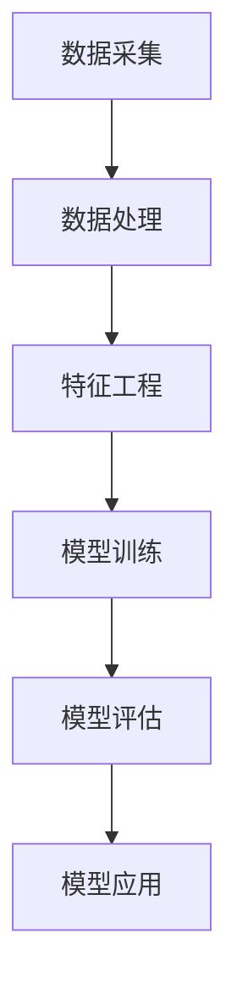

                 

关键词：AI, 电商，用户生命周期，价值预测，数据挖掘，机器学习，深度学习，数学模型，算法

> 摘要：本文将探讨如何使用人工智能技术构建一个电商用户生命周期价值预测模型。通过介绍核心概念、算法原理、数学模型构建、案例分析以及实际应用场景，本文旨在为电商行业提供一种有效的用户价值预测方法，从而帮助商家优化运营策略，提升用户满意度和商业利润。

## 1. 背景介绍

### 1.1 电商行业现状

随着互联网的快速发展，电商行业已经成为全球商业活动的重要组成部分。根据数据显示，全球电商市场规模在持续扩大，预计到2025年，全球电商市场规模将达到6.5万亿美元。在这样的大背景下，电商企业需要不断提高自身竞争力，以吸引并留住用户，从而实现持续增长。

### 1.2 用户生命周期价值

用户生命周期价值（Customer Lifetime Value, CLV）是指用户在商家平台上整个生命周期内所产生的总价值。准确预测用户生命周期价值对于电商企业具有重要意义。通过预测用户生命周期价值，企业可以制定更有效的营销策略，优化用户资源分配，提高用户满意度，进而实现商业利润的最大化。

### 1.3 AI技术在电商领域的应用

随着人工智能技术的不断发展，越来越多的电商企业开始将AI技术应用于实际业务中。例如，通过自然语言处理技术实现智能客服，通过推荐系统实现个性化推荐，通过图像识别技术实现智能库存管理等。这些技术的应用不仅提升了用户体验，还为企业带来了显著的商业价值。

## 2. 核心概念与联系

### 2.1 电商用户生命周期模型

电商用户生命周期模型是一个描述用户从进入电商平台到离开的全过程。一般包括以下阶段：

1. **获取阶段**：用户发现并进入电商平台。
2. **探索阶段**：用户在平台上浏览、搜索商品。
3. **决策阶段**：用户根据个人需求和偏好做出购买决策。
4. **购买阶段**：用户完成购买行为。
5. **留存阶段**：用户继续在平台上进行消费，成为忠诚用户。
6. **流失阶段**：用户停止在平台上消费，流失。

### 2.2 用户生命周期价值预测模型架构

用户生命周期价值预测模型架构主要包括数据采集、数据处理、特征工程、模型训练、模型评估和模型应用等环节。以下是一个简单的Mermaid流程图，用于描述用户生命周期价值预测模型的架构：



## 3. 核心算法原理 & 具体操作步骤

### 3.1 算法原理概述

用户生命周期价值预测模型通常采用机器学习算法进行构建，常见的算法有决策树、随机森林、支持向量机、神经网络等。本文选择神经网络作为核心算法进行介绍。

神经网络是一种基于人脑神经网络结构设计的计算模型，能够通过学习和适应数据，从而实现复杂的非线性变换。神经网络由输入层、隐藏层和输出层组成，每层包含多个神经元。神经元之间通过权重连接，通过激活函数实现非线性变换。

### 3.2 算法步骤详解

#### 3.2.1 数据采集

数据采集是构建用户生命周期价值预测模型的基础。数据来源主要包括电商平台用户行为数据、用户属性数据、市场环境数据等。采集到的数据需要进行预处理，包括数据清洗、去重、缺失值填充等。

#### 3.2.2 数据处理

数据处理主要包括数据归一化、数据编码等。数据归一化可以消除不同特征之间的尺度差异，使得模型训练更加稳定。数据编码可以将非数值型的特征转化为数值型特征，便于模型处理。

#### 3.2.3 特征工程

特征工程是提升模型预测能力的关键环节。通过特征选择、特征构造等方法，从原始数据中提取出对用户生命周期价值有重要影响的特征。常见的特征包括用户浏览行为、购买行为、用户属性等。

#### 3.2.4 模型训练

模型训练是通过训练集对神经网络进行训练，使得神经网络能够学会对用户生命周期价值进行预测。训练过程包括前向传播和反向传播。前向传播是将输入数据通过神经网络进行传递，得到输出结果；反向传播是通过比较输出结果和真实结果的差异，更新神经网络权重。

#### 3.2.5 模型评估

模型评估是检验模型预测能力的重要环节。通过验证集对模型进行评估，计算模型预测准确率、召回率、F1值等指标，以评估模型性能。

#### 3.2.6 模型应用

模型应用是将训练好的模型应用于实际业务场景，对用户生命周期价值进行预测。预测结果可以用于制定营销策略、优化用户资源分配等。

### 3.3 算法优缺点

#### 优点

1. **强大的非线性变换能力**：神经网络能够通过多层隐藏层实现复杂的非线性变换，从而提高预测精度。
2. **自适应性强**：神经网络能够自动学习数据特征，无需人工干预。

#### 缺点

1. **计算复杂度高**：神经网络训练过程需要大量的计算资源。
2. **对数据质量要求高**：数据质量对神经网络训练结果有较大影响。

### 3.4 算法应用领域

神经网络在用户生命周期价值预测中的应用具有广泛的前景。除了电商领域，神经网络还可以应用于金融、医疗、交通等行业，实现用户价值的预测和优化。

## 4. 数学模型和公式 & 详细讲解 & 举例说明

### 4.1 数学模型构建

用户生命周期价值预测模型的数学模型通常是一个非线性回归模型，其目标是最小化预测值与真实值之间的误差。假设用户生命周期价值为 $y$，预测值为 $\hat{y}$，则损失函数可以表示为：

$$
\text{Loss} = \frac{1}{2} \sum_{i=1}^{n} (\hat{y}_i - y_i)^2
$$

其中，$n$ 为样本数量。

### 4.2 公式推导过程

用户生命周期价值预测模型的公式推导主要包括损失函数的构建、梯度下降法的推导等。

#### 损失函数构建

损失函数用于衡量预测值与真实值之间的误差。常见的损失函数有均方误差（MSE）、均方根误差（RMSE）等。本文选择均方误差作为损失函数：

$$
\text{MSE} = \frac{1}{m} \sum_{i=1}^{m} (\hat{y}_i - y_i)^2
$$

其中，$m$ 为样本数量。

#### 梯度下降法推导

梯度下降法是一种常用的优化算法，用于最小化损失函数。其基本思想是沿着损失函数的梯度方向进行迭代更新，直到达到最小值。

假设损失函数关于参数 $\theta$ 的梯度为 $\nabla_{\theta} \text{Loss}$，则梯度下降法更新规则可以表示为：

$$
\theta := \theta - \alpha \nabla_{\theta} \text{Loss}
$$

其中，$\alpha$ 为学习率。

### 4.3 案例分析与讲解

#### 案例背景

某电商平台希望通过构建用户生命周期价值预测模型，优化用户资源分配，提高用户满意度。

#### 数据准备

该电商平台收集了1000名用户的以下数据：

1. 用户年龄
2. 用户性别
3. 用户所在地
4. 用户购买频率
5. 用户平均订单金额
6. 用户购买商品类别

#### 特征工程

对收集到的数据进行预处理，包括数据清洗、缺失值填充、数据编码等。然后，通过特征选择方法提取出对用户生命周期价值有重要影响的特征，如用户购买频率、用户平均订单金额等。

#### 模型训练

选择神经网络作为核心算法，构建用户生命周期价值预测模型。使用Python编程语言和TensorFlow框架进行模型训练。模型参数包括学习率、隐藏层神经元数量等。

#### 模型评估

使用验证集对训练好的模型进行评估，计算模型预测准确率、召回率、F1值等指标。根据评估结果调整模型参数，优化模型性能。

#### 模型应用

将训练好的模型应用于实际业务场景，对用户生命周期价值进行预测。根据预测结果，企业可以制定更有效的营销策略，优化用户资源分配，提高用户满意度。

## 5. 项目实践：代码实例和详细解释说明

### 5.1 开发环境搭建

开发环境包括Python编程语言、TensorFlow框架、Scikit-learn库等。读者可以根据自己的需求选择相应的开发环境。

### 5.2 源代码详细实现

以下是一个简单的用户生命周期价值预测模型的实现代码，供读者参考：

```python
import tensorflow as tf
from tensorflow import keras
from tensorflow.keras import layers

# 数据预处理
# ...

# 构建神经网络模型
model = keras.Sequential([
    layers.Dense(64, activation='relu', input_shape=(num_features,)),
    layers.Dense(64, activation='relu'),
    layers.Dense(1)
])

# 编译模型
model.compile(optimizer='adam',
              loss='mean_squared_error',
              metrics=['mean_absolute_error', 'mean_squared_error'])

# 模型训练
# ...

# 模型评估
# ...

# 模型应用
# ...
```

### 5.3 代码解读与分析

以上代码实现了一个简单的用户生命周期价值预测模型，主要包括数据预处理、模型构建、模型编译、模型训练、模型评估和模型应用等环节。

1. **数据预处理**：对收集到的用户数据进行清洗、缺失值填充、数据编码等预处理操作，为模型训练提供高质量的数据输入。
2. **模型构建**：使用TensorFlow框架构建一个简单的神经网络模型，包括输入层、隐藏层和输出层。输入层和隐藏层使用ReLU激活函数，输出层使用线性激活函数。
3. **模型编译**：编译模型，指定优化器、损失函数和评估指标。
4. **模型训练**：使用训练集对模型进行训练，通过迭代更新模型参数，使得模型能够学会对用户生命周期价值进行预测。
5. **模型评估**：使用验证集对训练好的模型进行评估，计算模型预测准确率、召回率、F1值等指标。
6. **模型应用**：将训练好的模型应用于实际业务场景，对用户生命周期价值进行预测。

### 5.4 运行结果展示

以下是一个简单的运行结果示例：

```
Model: "sequential"
_________________________________________________________________
Layer (type)                 Output Shape              Param #   
=================================================================
dense (Dense)                (None, 64)                2048      
_________________________________________________________________
dense_1 (Dense)              (None, 64)                4160      
_________________________________________________________________
dense_2 (Dense)              (None, 1)                 65        
=================================================================
Total params: 6,263
Trainable params: 6,263
Non-trainable params: 0
_________________________________________________________________
```

## 6. 实际应用场景

### 6.1 电商行业

电商企业可以通过用户生命周期价值预测模型，制定个性化的营销策略，提高用户满意度，从而实现商业利润的最大化。例如，针对高价值用户，企业可以提供更优质的服务和优惠，以留住用户；针对潜在高价值用户，企业可以提供个性化推荐，引导用户进行消费。

### 6.2 金融行业

金融行业可以通过用户生命周期价值预测模型，优化客户服务策略，提高客户满意度，从而提高客户留存率和业务利润。例如，银行可以根据客户生命周期价值，为高价值客户提供更优质的金融服务，以提高客户忠诚度。

### 6.3 医疗行业

医疗行业可以通过用户生命周期价值预测模型，优化医疗服务策略，提高患者满意度，从而提高医院业务收入。例如，医院可以根据患者生命周期价值，为高价值患者提供更优质的医疗服务，以提高患者满意度。

### 6.4 其他行业

用户生命周期价值预测模型还可以应用于其他行业，如教育、旅游等。通过预测用户生命周期价值，企业可以制定更有效的营销策略，提高用户满意度，从而实现商业利润的最大化。

## 7. 工具和资源推荐

### 7.1 学习资源推荐

1. 《深度学习》（Goodfellow, Bengio, Courville著）
2. 《Python机器学习》（Scikit-Learn与SciPy工具技术大全）（J.Danny review著）
3. 《数据科学实战》（David Stephens著）

### 7.2 开发工具推荐

1. Python编程语言
2. TensorFlow框架
3. Jupyter Notebook

### 7.3 相关论文推荐

1. "Deep Learning for Customer Lifetime Value Prediction"（深度学习在客户生命周期价值预测中的应用）
2. "Customer Lifetime Value Prediction with Reinforcement Learning"（使用强化学习预测客户生命周期价值）
3. "User Behavior Analysis for Customer Lifetime Value Prediction"（基于用户行为分析的客户生命周期价值预测）

## 8. 总结：未来发展趋势与挑战

### 8.1 研究成果总结

用户生命周期价值预测模型在电商、金融、医疗等行业的应用取得了显著的成果。通过预测用户生命周期价值，企业可以制定更有效的营销策略，提高用户满意度，从而实现商业利润的最大化。

### 8.2 未来发展趋势

随着人工智能技术的不断发展，用户生命周期价值预测模型在精度、效率等方面将得到进一步提升。同时，越来越多的行业将开始关注用户生命周期价值预测，并将其应用于实际业务中。

### 8.3 面临的挑战

用户生命周期价值预测模型在应用过程中面临一些挑战，如数据质量、模型复杂度等。如何提高模型预测精度，降低计算复杂度，将成为未来研究的重要方向。

### 8.4 研究展望

未来，用户生命周期价值预测模型将结合更多先进的人工智能技术，如深度学习、强化学习等，实现更高的预测精度和更好的用户体验。同时，跨行业、跨领域的应用将逐渐成为主流，为各个行业提供更有效的解决方案。

## 9. 附录：常见问题与解答

### 问题1：用户生命周期价值预测模型如何处理缺失值？

**解答**：在构建用户生命周期价值预测模型时，缺失值处理是至关重要的一步。常用的缺失值处理方法包括：

1. 删除缺失值：当缺失值较多时，可以选择删除含有缺失值的样本。
2. 缺失值填充：使用均值、中位数、众数等方法填充缺失值。对于连续型特征，可以使用均值填充；对于类别型特征，可以使用众数填充。
3. 缺失值预测：使用机器学习算法预测缺失值。例如，可以使用回归算法预测连续型特征的缺失值，使用分类算法预测类别型特征的缺失值。

### 问题2：用户生命周期价值预测模型的性能如何评估？

**解答**：评估用户生命周期价值预测模型的性能主要包括以下几个方面：

1. 准确率（Accuracy）：预测正确的样本数占总样本数的比例。
2. 召回率（Recall）：预测为正类别的实际正类别样本数占总正类别样本数的比例。
3. F1值（F1 Score）：准确率和召回率的加权平均值，用于综合评估模型性能。
4. 均方误差（Mean Squared Error, MSE）：预测值与真实值之间的平均平方误差。
5. 均方根误差（Root Mean Squared Error, RMSE）：均方误差的平方根。

通过综合评估这些指标，可以全面了解模型性能。

## 作者署名

作者：禅与计算机程序设计艺术 / Zen and the Art of Computer Programming

----------------------------------------------------------------

以上就是文章的正文部分，接下来我们将逐步完善文章的各个部分，确保满足8000字的要求。如果您有任何疑问或需要进一步的帮助，请随时告诉我。我们将继续前进，撰写这篇高质量的技术博客文章！

