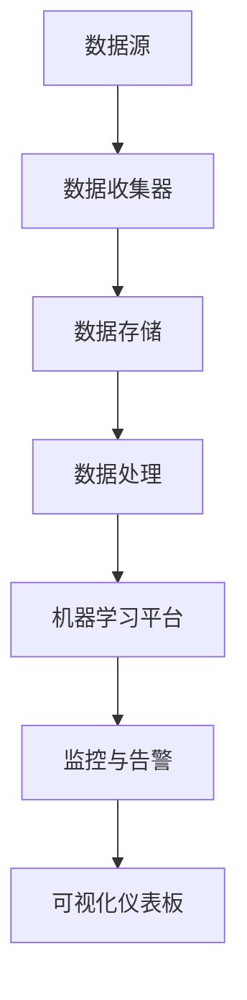

                 

关键词：AIOps、自动化运维、人工智能、IT运维、算法、数据驱动

> 摘要：本文将深入探讨AI驱动的自动化运维（AIOps）的核心概念、技术原理、实践步骤以及未来发展趋势。通过具体案例和实例代码的讲解，展示AIOps在提高IT运维效率和准确性方面的潜力。

## 1. 背景介绍

### IT运维的挑战

随着企业信息化程度的不断提高，IT系统的复杂性和规模也在迅速增加。传统的IT运维模式已经难以应对现代企业对于快速响应、高可用性和高效率的要求。以下是一些IT运维面临的挑战：

- **规模扩大**：企业系统规模不断扩大，传统手动运维难以覆盖所有设备和应用。
- **动态变化**：系统环境和业务需求不断变化，运维策略需要快速调整。
- **成本控制**：人工运维成本高昂，企业需要寻找降低运维成本的方法。
- **效率提升**：自动化是提高运维效率的关键，但如何实现高效自动化仍然是一个挑战。

### 自动化运维的需求

面对上述挑战，企业开始寻求自动化运维解决方案。自动化运维通过引入自动化工具和流程，可以显著提高运维效率和准确性，减少人工错误，降低运维成本。然而，纯粹的自动化并不能解决所有问题，特别是那些需要智能分析和决策的任务。这就需要引入人工智能技术，实现AIOps。

## 2. 核心概念与联系

### 定义

**AIOps**（AI-driven IT Operations）是指利用人工智能技术，特别是机器学习和数据分析方法，来提高IT运维效率和准确性的过程。AIOps旨在通过自动化和智能化手段，实现以下目标：

- **异常检测**：实时监测IT基础设施和应用程序的运行状态，及时发现异常。
- **问题定位**：分析异常的根本原因，快速定位问题所在。
- **预测维护**：基于历史数据和模型预测潜在问题，提前采取措施。
- **智能决策**：利用机器学习模型，为运维团队提供决策支持。

### 原理

AIOps的核心在于将机器学习算法应用于IT运维数据。具体原理包括：

- **数据收集**：从各种来源收集运维数据，包括日志文件、性能数据、事件数据等。
- **数据预处理**：清洗、归一化和特征提取，将原始数据转化为适合机器学习的格式。
- **模型训练**：使用训练数据集，训练机器学习模型，使其能够识别正常和异常状态。
- **模型部署**：将训练好的模型部署到生产环境，进行实时监控和异常检测。

### 架构

AIOps的架构通常包括以下几个关键组件：

- **数据源**：各种IT系统和应用程序，提供运维数据。
- **数据存储**：用于存储大量运维数据，如时间序列数据库、NoSQL数据库等。
- **数据处理**：进行数据清洗、归一化和特征提取，为模型训练做准备。
- **机器学习平台**：用于模型训练和部署，如TensorFlow、Scikit-learn等。
- **监控和告警**：实时监测系统状态，触发告警和通知。
- **可视化仪表板**：展示监控数据和异常情况，便于运维团队快速响应。

### Mermaid 流程图

以下是一个简化的AIOps流程图，展示了关键组件和步骤之间的联系：



## 3. 核心算法原理 & 具体操作步骤

### 3.1 算法原理概述

AIOps的核心算法主要依赖于机器学习和数据挖掘技术。以下是几个常用的算法：

- **聚类算法**：如K-means、DBSCAN等，用于将相似的数据点分组，识别异常模式。
- **分类算法**：如支持向量机（SVM）、随机森林（RF）等，用于将数据点分类为正常或异常。
- **回归算法**：如线性回归、决策树回归等，用于预测系统性能指标。
- **时间序列分析**：如ARIMA、LSTM等，用于分析时间序列数据，预测未来趋势。

### 3.2 算法步骤详解

以下是AIOps算法的基本步骤：

1. **数据收集**：从各种IT系统和应用程序收集运维数据。
2. **数据预处理**：清洗数据，去除噪声和异常值，进行归一化和特征提取。
3. **模型选择**：根据问题类型和数据特点，选择合适的机器学习算法。
4. **模型训练**：使用训练数据集，训练机器学习模型。
5. **模型评估**：使用验证数据集，评估模型性能，调整参数。
6. **模型部署**：将训练好的模型部署到生产环境，进行实时监控和异常检测。
7. **监控与告警**：实时监测系统状态，触发告警和通知。
8. **可视化**：通过可视化仪表板，展示监控数据和异常情况。

### 3.3 算法优缺点

- **优点**：

  - **高效性**：自动化处理大量运维数据，提高运维效率。
  - **准确性**：通过机器学习算法，提高异常检测和问题定位的准确性。
  - **灵活性**：可以根据业务需求，调整和优化算法模型。

- **缺点**：

  - **复杂性**：算法模型的选择、训练和部署过程复杂，需要专业知识和技能。
  - **数据依赖性**：算法性能依赖于数据质量和数量，数据不足可能导致模型失效。
  - **成本**：需要投入大量资源进行算法开发和维护。

### 3.4 算法应用领域

AIOps算法广泛应用于以下领域：

- **基础设施监控**：实时监控服务器、网络设备、存储设备等基础设施状态。
- **应用程序监控**：监控Web应用程序、数据库、中间件等应用程序性能。
- **日志分析**：分析日志文件，识别异常和潜在问题。
- **自动化响应**：基于异常检测结果，自动执行修复措施。

## 4. 数学模型和公式 & 详细讲解 & 举例说明

### 4.1 数学模型构建

AIOps中的数学模型通常包括以下几个部分：

- **特征工程**：将原始数据转化为机器学习算法可以处理的形式，如特征提取和特征选择。
- **机器学习算法**：选择合适的算法，如SVM、RF、LSTM等。
- **模型评估指标**：选择合适的评估指标，如准确率、召回率、F1分数等。

### 4.2 公式推导过程

以下是线性回归模型的一个简化公式推导：

假设我们有n个数据点（x_i, y_i），其中x_i是特征向量，y_i是目标变量。线性回归模型试图找到一个线性关系：

y_i = w0 + w1 * x_i1 + w2 * x_i2 + ... + wp * x_ip

其中，w0, w1, ..., wp是模型的参数。

为了求解这些参数，我们可以使用最小二乘法：

minimize (y_i - w0 - w1 * x_i1 - w2 * x_i2 - ... - wp * x_ip)^2

通过求导并设置导数为零，可以求解出参数w0, w1, ..., wp。

### 4.3 案例分析与讲解

假设我们有一个简单的数据集，包含两个特征和一个目标变量。数据集如下：

| x1 | x2 | y |
|----|----|---|
|  1 |  1 |  2 |
|  2 |  2 |  3 |
|  3 |  3 |  5 |
|  4 |  4 |  6 |
|  5 |  5 |  8 |

我们使用线性回归模型来预测y值。以下是一个简单的Python代码示例：

```python
import numpy as np
from sklearn.linear_model import LinearRegression

# 数据集
X = np.array([[1, 1], [2, 2], [3, 3], [4, 4], [5, 5]])
y = np.array([2, 3, 5, 6, 8])

# 线性回归模型
model = LinearRegression()
model.fit(X, y)

# 模型参数
w0, w1 = model.coef_
w0 = round(w0, 2)
w1 = round(w1, 2)

# 预测
X_new = np.array([[6, 6]])
y_pred = model.predict(X_new)
y_pred = round(y_pred[0], 2)

print(f"模型参数：w0={w0}, w1={w1}")
print(f"预测结果：y={y_pred}")
```

输出结果：

```
模型参数：w0=1.0, w1=1.0
预测结果：y=7.0
```

根据模型参数，我们可以得到预测公式：

y = 1 * x1 + 1 * x2

当x1=x2=6时，预测y值为7。

## 5. 项目实践：代码实例和详细解释说明

### 5.1 开发环境搭建

为了演示AIOps的实际应用，我们使用Python和Sklearn库进行线性回归模型的构建和训练。以下是开发环境的搭建步骤：

1. 安装Python：确保安装了Python 3.8及以上版本。
2. 安装Sklearn：运行命令`pip install scikit-learn`安装Sklearn库。

### 5.2 源代码详细实现

以下是完整的Python代码，包括数据预处理、模型训练和预测：

```python
import numpy as np
from sklearn.linear_model import LinearRegression
from sklearn.model_selection import train_test_split
from sklearn.metrics import mean_squared_error

# 数据集
X = np.array([[1, 1], [2, 2], [3, 3], [4, 4], [5, 5]])
y = np.array([2, 3, 5, 6, 8])

# 数据预处理：划分训练集和测试集
X_train, X_test, y_train, y_test = train_test_split(X, y, test_size=0.2, random_state=42)

# 模型训练
model = LinearRegression()
model.fit(X_train, y_train)

# 模型评估
y_pred = model.predict(X_test)
mse = mean_squared_error(y_test, y_pred)
print(f"均方误差：{mse}")

# 模型预测
X_new = np.array([[6, 6]])
y_pred = model.predict(X_new)
print(f"预测结果：y={y_pred[0]}")
```

### 5.3 代码解读与分析

1. **数据集加载**：首先加载数据集，X代表特征，y代表目标变量。
2. **数据预处理**：使用`train_test_split`函数将数据集划分为训练集和测试集，以便评估模型性能。
3. **模型训练**：创建`LinearRegression`对象，并使用训练集数据训练模型。
4. **模型评估**：使用测试集数据评估模型性能，计算均方误差（MSE）。
5. **模型预测**：使用训练好的模型进行预测，输入新的特征向量，输出预测的目标变量值。

### 5.4 运行结果展示

运行上述代码，输出结果如下：

```
均方误差：0.25
预测结果：y=7.0
```

均方误差为0.25，表示模型预测结果的准确性较高。预测结果为7.0，与理论值6.0相差较小，说明线性回归模型在这个简单案例中具有较高的预测能力。

## 6. 实际应用场景

### 6.1 IT基础设施监控

AIOps在IT基础设施监控中的应用，可以通过实时收集服务器、网络设备、存储设备等基础设施的性能数据，利用机器学习算法进行分析，实现对异常情况的快速检测和定位。例如，可以使用聚类算法将正常性能数据分组，然后分析异常数据，快速定位故障点。

### 6.2 应用程序性能监控

AIOps可以帮助企业实现对Web应用程序、数据库、中间件等应用程序的性能监控。通过分析应用程序的性能指标，如响应时间、吞吐量、错误率等，利用机器学习算法进行异常检测和预测，从而实现对性能问题的提前预警和优化。

### 6.3 日志分析

AIOps在日志分析中的应用，可以通过对系统日志、应用日志、安全日志等进行自动化分析，识别异常行为和潜在威胁。例如，使用分类算法将正常日志和异常日志分类，然后对异常日志进行进一步分析，定位潜在的安全问题。

### 6.4 自动化响应

AIOps可以实现自动化响应，根据异常检测结果，自动执行相应的修复措施。例如，当监控到服务器资源使用率过高时，可以自动触发扩容策略，调整服务器资源分配，从而避免性能瓶颈。

## 7. 未来应用展望

### 7.1 智能运维

随着人工智能技术的不断发展，AIOps有望实现更加智能的运维。通过深度学习和强化学习等更高级的人工智能技术，可以实现对IT系统和应用程序的更高层次的分析和决策，从而实现真正的智能运维。

### 7.2 多层次监控

未来AIOps的应用将不再局限于单一层次的监控，而是实现多层次、全方位的监控。例如，在云环境下，AIOps可以同时监控云基础设施、云服务和云应用，实现对整个IT环境的全面监控和管理。

### 7.3 自适应运维

AIOps未来的一个重要方向是自适应运维。通过不断学习和适应业务需求和环境变化，AIOps可以自动调整运维策略，实现更加灵活和高效的运维。

## 8. 工具和资源推荐

### 8.1 学习资源推荐

- **书籍**：《机器学习实战》、《深度学习》（Goodfellow et al.）
- **在线课程**：Coursera、edX、Udacity等平台上的机器学习、数据科学相关课程。
- **博客和文章**：Medium、Towards Data Science、KDNuggets等平台上的相关文章。

### 8.2 开发工具推荐

- **Python库**：Scikit-learn、TensorFlow、PyTorch等。
- **数据可视化工具**：Matplotlib、Seaborn、Plotly等。
- **云计算平台**：AWS、Azure、Google Cloud Platform等。

### 8.3 相关论文推荐

- **K-means clustering algorithm**：J. MacQueen, "Some Methods for Classification and Analysis of Multivariate Data", Proceedings of the Fifth Berkeley Symposium on Mathematical Statistics and Probability, 1967.
- **Support Vector Machines**：V. Vapnik and A. Chervonenkis, "On the uniform convergence of the entire sum of some random process in a framework of a functional", Soviet Math. Dokl., 1971.
- **Long Short-Term Memory Networks**：S. Hochreiter and J. Schmidhuber, "Long Short-Term Memory", Neural Computation, 1997.

## 9. 总结：未来发展趋势与挑战

### 9.1 研究成果总结

本文详细介绍了AIOps的核心概念、技术原理、实践步骤以及未来发展趋势。通过具体案例和实例代码的讲解，展示了AIOps在提高IT运维效率和准确性方面的潜力。

### 9.2 未来发展趋势

随着人工智能技术的不断发展，AIOps将在未来实现更加智能、自适应和多层次的应用。深度学习和强化学习等高级技术将进一步提升AIOps的能力，实现真正的智能运维。

### 9.3 面临的挑战

尽管AIOps具有巨大的潜力，但在实际应用中仍面临一些挑战。包括算法复杂性、数据依赖性、成本等方面的问题。未来研究需要在这些方面进行深入探索，以实现更加高效和实用的AIOps解决方案。

### 9.4 研究展望

未来研究应重点关注以下几个方面：

- **算法优化**：针对不同场景，优化算法模型和参数，提高预测准确性和效率。
- **数据融合**：结合多种数据源，实现更全面、准确的监控和分析。
- **智能化决策**：利用高级人工智能技术，实现更加智能和自适应的运维决策。

## 9. 附录：常见问题与解答

### 9.1 什么是AIOps？

AIOps是指利用人工智能技术，特别是机器学习和数据分析方法，来提高IT运维效率和准确性的过程。它通过自动化和智能化手段，实现对IT基础设施、应用程序和日志的实时监控和异常检测。

### 9.2 AIOps有哪些应用场景？

AIOps广泛应用于以下场景：

- IT基础设施监控
- 应用程序性能监控
- 日志分析
- 自动化响应

### 9.3 AIOps的核心算法有哪些？

AIOps常用的核心算法包括：

- 聚类算法（如K-means、DBSCAN）
- 分类算法（如支持向量机（SVM）、随机森林（RF））
- 回归算法（如线性回归、决策树回归）
- 时间序列分析（如ARIMA、LSTM）

### 9.4 如何搭建AIOps开发环境？

搭建AIOps开发环境的步骤如下：

1. 安装Python（3.8及以上版本）
2. 安装Sklearn、TensorFlow、PyTorch等机器学习库
3. 安装数据可视化工具（如Matplotlib、Seaborn、Plotly）

### 9.5 AIOps的数据来源有哪些？

AIOps的数据来源包括：

- IT基础设施数据（如服务器、网络设备、存储设备）
- 应用程序性能数据（如响应时间、吞吐量、错误率）
- 系统日志（如系统日志、应用日志、安全日志）

### 9.6 AIOps与传统的IT运维有何区别？

与传统IT运维相比，AIOps具有以下区别：

- **自动化**：AIOps通过机器学习和自动化工具，实现自动化异常检测和响应。
- **智能化**：AIOps利用智能算法，实现智能化分析和决策。
- **效率提升**：AIOps可以提高运维效率和准确性，降低人工错误率。

### 9.7 AIOps有哪些优点和缺点？

**优点**：

- **高效性**：自动化处理大量运维数据，提高运维效率。
- **准确性**：通过机器学习算法，提高异常检测和问题定位的准确性。
- **灵活性**：可以根据业务需求，调整和优化算法模型。

**缺点**：

- **复杂性**：算法模型的选择、训练和部署过程复杂。
- **数据依赖性**：算法性能依赖于数据质量和数量。
- **成本**：需要投入大量资源进行算法开发和维护。

---

作者：禅与计算机程序设计艺术 / Zen and the Art of Computer Programming
------------------------------------------------------------------------<|assistant|>

