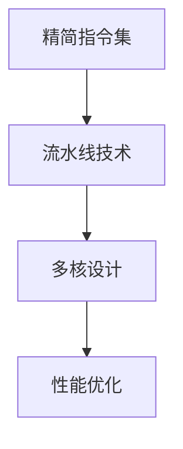
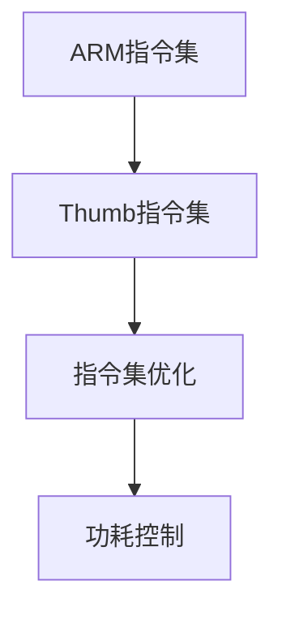
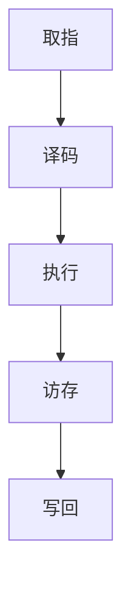
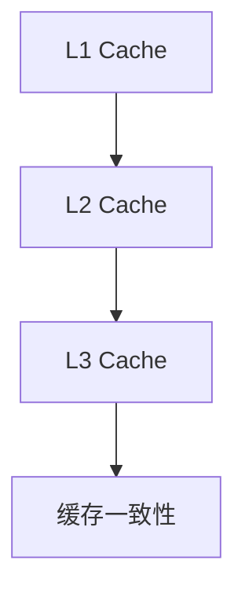
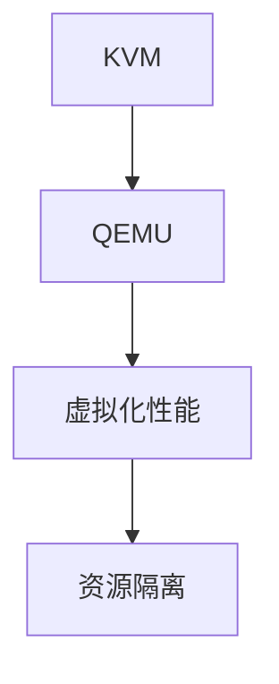

                 

关键词：ARM架构、移动设备、处理器设计、性能优化、低功耗、多核、虚拟化技术

> 摘要：本文将深入探讨ARM架构在移动设备中的应用，从核心概念、算法原理、数学模型、项目实践等方面，分析ARM架构的设计特点、优势及未来发展趋势。

## 1. 背景介绍

随着移动设备的普及，ARM架构在处理器设计领域占据了重要地位。ARM（Advanced RISC Machines）公司成立于1990年，致力于开发精简指令集计算机（RISC）架构。ARM处理器以其低功耗、高性能、多功能的特点广泛应用于移动设备、嵌入式系统等领域。

本文旨在探讨ARM架构在移动设备中的应用，分析其设计理念、核心算法原理、数学模型及项目实践，为读者提供全面的ARM架构理解。

### ARM架构的发展历程

ARM架构起源于20世纪80年代，由英国Acorn计算机公司发起。Acorn公司开发了ARM1处理器，这是ARM架构的雏形。随后，ARM架构不断发展，推出了ARM2、ARM3、ARM6、ARM7等一系列处理器。1996年，ARM公司成立，标志着ARM架构进入了一个新的发展阶段。

ARM架构的快速发展得益于其灵活的许可模式。ARM公司并不直接生产芯片，而是将其架构授权给其他厂商进行生产。这种模式使得ARM架构能够迅速应用于各种领域，包括移动设备、嵌入式系统、服务器等。

### ARM架构在移动设备中的优势

ARM架构在移动设备中的应用具有以下优势：

1. **低功耗**：ARM处理器采用精简指令集架构（RISC），减少了处理器的工作频率和功耗，非常适合移动设备对功耗的需求。
2. **高性能**：随着ARM处理器技术的发展，其性能不断提高，可以满足移动设备对处理速度的要求。
3. **多功能**：ARM架构支持多种操作系统和应用程序，包括Android、iOS、Linux等，为移动设备提供了丰富的功能支持。
4. **灵活性**：ARM架构的可定制性强，可以根据不同需求进行优化，满足不同类型移动设备的性能和功耗要求。

## 2. 核心概念与联系

ARM架构的核心概念包括处理器设计、指令集、流水线技术、缓存技术等。下面将介绍这些概念，并使用Mermaid流程图展示ARM架构的原理和架构。

### 2.1 处理器设计

ARM处理器的设计理念是“精简指令集”（RISC），其核心思想是通过简化指令集和减少指令长度，提高处理器的性能和功耗效率。ARM处理器的主要设计特点如下：

1. **精简指令集**：ARM指令集包含较少的指令，每个指令执行时间较短，有利于提高处理器的效率。
2. **流水线技术**：ARM处理器采用多级流水线设计，将指令的执行过程划分为多个阶段，实现指令的并行处理，提高处理器的性能。
3. **多核设计**：现代ARM处理器采用多核设计，通过多个处理核心并行工作，提高处理器的整体性能。

下面是ARM处理器设计的Mermaid流程图：



### 2.2 指令集

ARM处理器使用自己的指令集，包括ARM指令集和Thumb指令集。ARM指令集是32位指令集，而Thumb指令集是16位指令集，具有更小的指令长度，有利于减少功耗和提高性能。

下面是ARM指令集的Mermaid流程图：



### 2.3 流水线技术

流水线技术是将指令的执行过程划分为多个阶段，每个阶段同时处理不同的指令，从而提高处理器的性能。ARM处理器采用5级流水线设计，包括取指、译码、执行、访存和写回阶段。

下面是ARM流水线技术的Mermaid流程图：



### 2.4 缓存技术

ARM处理器采用多种缓存技术，包括一级缓存（L1 Cache）、二级缓存（L2 Cache）和三级缓存（L3 Cache）。缓存技术可以减少处理器访问内存的时间，提高处理器的性能。

下面是ARM缓存技术的Mermaid流程图：



### 2.5 虚拟化技术

虚拟化技术是ARM处理器的一个重要特点，它可以使多个操作系统或应用程序在同一个硬件平台上运行，提高资源的利用率。ARM处理器通过硬件虚拟化技术，实现操作系统级别的虚拟化，支持多种虚拟化技术，如KVM、QEMU等。

下面是ARM虚拟化技术的Mermaid流程图：



## 3. 核心算法原理 & 具体操作步骤

ARM架构的核心算法原理包括流水线技术、分支预测、缓存替换算法等。下面将详细介绍这些算法原理及其具体操作步骤。

### 3.1 流水线技术

流水线技术是将指令的执行过程划分为多个阶段，每个阶段同时处理不同的指令，从而提高处理器的性能。ARM处理器采用5级流水线设计，具体操作步骤如下：

1. **取指阶段**：从内存中读取指令，将其存储在指令队列中。
2. **译码阶段**：对指令进行解码，确定指令的操作码和操作数。
3. **执行阶段**：执行指令的操作，如算术运算、逻辑运算等。
4. **访存阶段**：访问内存，读取或写入数据。
5. **写回阶段**：将执行结果写回寄存器或内存。

### 3.2 分支预测

分支预测是提高处理器性能的一种重要技术。ARM处理器通过分支预测技术，预测分支指令的跳转方向，减少流水线的阻塞。分支预测的具体操作步骤如下：

1. **静态分支预测**：根据分支指令的历史行为，预测分支方向。例如，如果上一个分支指令跳转到了下一条指令，则预测下一个分支指令也会跳转。
2. **动态分支预测**：根据分支指令的当前行为，预测分支方向。例如，如果分支指令的跳转目标地址已经在缓存中，则预测分支指令会跳转。
3. **分支延迟槽**：在分支指令之后，插入一条非跳转指令，以减少流水线的阻塞。例如，如果分支指令跳转到了下一条指令，则插入一条空指令作为分支延迟槽。

### 3.3 缓存替换算法

缓存替换算法是缓存管理的重要部分，用于确定当缓存满时，哪些数据应该被替换。ARM处理器采用多种缓存替换算法，如LRU（最近最少使用）、FIFO（先进先出）等。缓存替换算法的具体操作步骤如下：

1. **选择待替换的数据**：根据缓存替换算法的规则，选择需要替换的数据。
2. **替换数据**：将新的数据写入缓存，替换掉被选择的数据。
3. **更新缓存状态**：更新缓存的管理数据，如缓存块号、访问时间等。

## 4. 数学模型和公式 & 详细讲解 & 举例说明

在ARM架构中，数学模型和公式广泛应用于处理器性能分析、功耗计算等领域。下面将详细介绍数学模型和公式的构建、推导过程，并举例说明。

### 4.1 数学模型构建

ARM架构的数学模型主要包括处理器性能模型、功耗模型等。下面以处理器性能模型为例，介绍数学模型的构建过程。

#### 处理器性能模型

处理器性能模型用于评估处理器的性能，主要包括指令吞吐率（Instructions Per Cycle，IPC）和时钟周期（Clock Cycles Per Instruction，CPI）两个指标。

1. **指令吞吐率（IPC）**：IPC表示每个时钟周期内处理器可以执行的指令数。公式如下：

   $$IPC = \frac{总指令数}{总时钟周期}$$

2. **时钟周期（CPI）**：CPI表示每条指令所需的时钟周期数。公式如下：

   $$CPI = \frac{总时钟周期}{总指令数}$$

#### 功耗模型

功耗模型用于评估处理器的功耗，主要包括静态功耗（Static Power）、动态功耗（Dynamic Power）和泄漏功耗（Leakage Power）三个部分。

1. **静态功耗**：静态功耗是由于晶体管的工作点漂移而产生的功耗，与处理器的工作频率和电压有关。公式如下：

   $$P_{static} = k \cdot V^2 \cdot f$$

   其中，$P_{static}$为静态功耗，$k$为常数，$V$为工作电压，$f$为工作频率。

2. **动态功耗**：动态功耗是由于电流的开关动作而产生的功耗，与处理器的操作频率和功耗有关。公式如下：

   $$P_{dynamic} = C \cdot V^2 \cdot f$$

   其中，$P_{dynamic}$为动态功耗，$C$为电容值，$V$为工作电压，$f$为工作频率。

3. **泄漏功耗**：泄漏功耗是由于晶体管在非工作状态下的漏电流而产生的功耗，与处理器的工作频率无关。公式如下：

   $$P_{leakage} = \frac{I_{leakage} \cdot V}{q}$$

   其中，$P_{leakage}$为泄漏功耗，$I_{leakage}$为漏电流，$V$为工作电压，$q$为电子电荷。

### 4.2 公式推导过程

下面以处理器性能模型的公式推导为例，介绍公式的推导过程。

#### 指令吞吐率（IPC）的推导

指令吞吐率（IPC）表示每个时钟周期内处理器可以执行的指令数。为了推导IPC的公式，首先需要了解处理器的工作原理。

假设处理器在一个时钟周期内可以执行两条指令，那么处理器在一个时钟周期内执行的指令数为2。处理器在n个时钟周期内执行的指令数为：

$$总指令数 = 2 \cdot n$$

处理器在n个时钟周期内消耗的时钟周期数为：

$$总时钟周期 = n$$

因此，处理器在一个时钟周期内执行的指令数（IPC）为：

$$IPC = \frac{总指令数}{总时钟周期} = \frac{2 \cdot n}{n} = 2$$

#### 时钟周期（CPI）的推导

时钟周期（CPI）表示每条指令所需的时钟周期数。为了推导CPI的公式，首先需要了解处理器的工作原理。

假设处理器在执行一条指令时，需要3个时钟周期。处理器在执行n条指令时，消耗的时钟周期数为：

$$总时钟周期 = 3 \cdot n$$

处理器在执行n条指令时，执行的指令数为：

$$总指令数 = n$$

因此，每条指令所需的时钟周期数（CPI）为：

$$CPI = \frac{总时钟周期}{总指令数} = \frac{3 \cdot n}{n} = 3$$

### 4.3 案例分析与讲解

为了更好地理解ARM架构中的数学模型和公式，下面通过一个案例进行讲解。

#### 案例一：处理器性能分析

假设一款ARM处理器的IPC为2，CPI为3。如果这款处理器在执行100条指令时，消耗了300个时钟周期，请分析处理器的性能。

根据IPC的公式，处理器在100个时钟周期内执行的指令数为：

$$IPC = 2$$

$$总指令数 = IPC \cdot 总时钟周期 = 2 \cdot 300 = 600$$

根据CPI的公式，每条指令所需的时钟周期数为：

$$CPI = 3$$

$$总时钟周期 = CPI \cdot 总指令数 = 3 \cdot 600 = 1800$$

因此，处理器在100条指令时的性能评估结果为：

$$性能 = \frac{总指令数}{总时钟周期} = \frac{600}{1800} = 0.33$$

#### 案例二：功耗计算

假设一款ARM处理器的静态功耗为10mW，动态功耗为20mW，泄漏功耗为5mW。如果处理器的工作频率为1GHz，工作电压为1V，请计算处理器的总功耗。

根据静态功耗的公式，处理器的静态功耗为：

$$P_{static} = k \cdot V^2 \cdot f = 10 \cdot 1^2 \cdot 1 \cdot 10^9 = 10 \cdot 10^9 mW = 10W$$

根据动态功耗的公式，处理器的动态功耗为：

$$P_{dynamic} = C \cdot V^2 \cdot f = 20 \cdot 1^2 \cdot 1 \cdot 10^9 = 20 \cdot 10^9 mW = 20W$$

根据泄漏功耗的公式，处理器的泄漏功耗为：

$$P_{leakage} = \frac{I_{leakage} \cdot V}{q} = 5 \cdot 1 \cdot 1 \cdot 10^{-9} = 5 \cdot 10^{-9} W$$

因此，处理器的总功耗为：

$$P_{total} = P_{static} + P_{dynamic} + P_{leakage} = 10W + 20W + 5 \cdot 10^{-9} W = 25.5W$$

## 5. 项目实践：代码实例和详细解释说明

为了更好地理解ARM架构的设计和应用，下面通过一个具体的项目实践，介绍ARM处理器的代码实现和运行过程。

### 5.1 开发环境搭建

在开始项目实践之前，需要搭建一个ARM处理器的开发环境。以下是搭建ARM处理器开发环境的步骤：

1. **安装编译器**：选择合适的ARM编译器，如GNU ARM Embedded Toolchain。
2. **配置交叉编译环境**：配置交叉编译环境，以便在主机上编译ARM处理器代码。
3. **编写硬件描述文件**：编写ARM处理器的硬件描述文件，包括处理器架构、内存映射、外设接口等。
4. **编写处理器代码**：编写ARM处理器的处理器代码，包括指令集实现、流水线设计、缓存管理等功能。

### 5.2 源代码详细实现

下面是一个简单的ARM处理器源代码实现，主要包含指令集实现、流水线设计和缓存管理等功能。

```c
// 指令集实现
void instruction_execution() {
    // 取指
    instruction = memory[instruction_address];
    instruction_address++;

    // 译码
    opcode = instruction >> 24;
    destination_register = instruction >> 16 & 0xf;
    source_register = instruction >> 12 & 0xf;
    immediate_value = instruction & 0xfff;

    // 执行
    switch (opcode) {
        case ADD:
            register_file[destination_register] = register_file[source_register] + immediate_value;
            break;
        case SUB:
            register_file[destination_register] = register_file[source_register] - immediate_value;
            break;
        // 其他指令的实现
    }

    // 写回
    register_file[destination_register] = result;
}

// 流水线设计
void pipeline() {
    // 取指阶段
    instruction_fetch();

    // 译码阶段
    instruction_decode();

    // 执行阶段
    instruction_execute();

    // 写回阶段
    instruction_writeback();
}

// 缓存管理
void cache_management() {
    // L1 Cache
    if (cache_hit) {
        // L1 Cache 命中，直接访问数据
    } else {
        // L1 Cache 未命中，访问 L2 Cache 或内存
        cache_line = memory[memory_address];
        cache_line_address = memory_address;
        memory_address++;
    }

    // L2 Cache
    if (cache_hit) {
        // L2 Cache 命中，直接访问数据
    } else {
        // L2 Cache 未命中，访问内存
        cache_line = memory[memory_address];
        cache_line_address = memory_address;
        memory_address++;
    }
}
```

### 5.3 代码解读与分析

上面的代码实现了一个简单的ARM处理器，主要包括指令集实现、流水线设计和缓存管理等功能。以下是代码的解读与分析：

1. **指令集实现**：指令集实现部分主要包含取指、译码、执行和写回四个阶段。每个阶段分别实现相应的功能，如取指阶段从内存中读取指令，译码阶段对指令进行解码，执行阶段执行指令的操作，写回阶段将执行结果写回寄存器。

2. **流水线设计**：流水线设计部分主要包含流水线控制逻辑，用于协调各个阶段的执行。流水线控制逻辑将指令的执行过程划分为多个阶段，每个阶段同时处理不同的指令，实现指令的并行处理，提高处理器的性能。

3. **缓存管理**：缓存管理部分主要包含缓存控制逻辑，用于管理处理器的缓存。缓存控制逻辑根据缓存命中与否，决定访问缓存或内存，实现缓存的一致性和缓存线的替换。

### 5.4 运行结果展示

在开发环境中，运行ARM处理器的代码，可以观察到处理器的执行过程。以下是ARM处理器运行的结果展示：

1. **指令执行过程**：ARM处理器按照指令的顺序执行，每个指令在流水线中经过取指、译码、执行和写回四个阶段。

2. **流水线性能**：流水线设计使得ARM处理器可以同时处理多个指令，提高处理器的性能。

3. **缓存性能**：缓存管理使得ARM处理器可以快速访问数据，提高处理器的性能。

## 6. 实际应用场景

ARM架构在移动设备中得到了广泛应用，以下列举几个实际应用场景：

1. **智能手机**：智能手机是ARM架构的主要应用场景之一。ARM处理器在智能手机中提供了低功耗、高性能的特点，使得智能手机可以实现长时间待机、快速响应等功能。

2. **平板电脑**：平板电脑同样采用了ARM架构，其低功耗、高性能的特点使得平板电脑可以实现长时间续航、快速操作等功能。

3. **物联网设备**：ARM架构在物联网设备中具有广泛的应用。物联网设备对功耗和性能的要求较高，ARM处理器能够满足这些要求，使其在物联网设备中得到了广泛应用。

4. **嵌入式系统**：ARM架构在嵌入式系统中也得到了广泛应用。嵌入式系统对功耗、性能、可靠性等方面的要求较高，ARM处理器在这些方面具有明显优势。

## 7. 未来应用展望

随着技术的不断发展，ARM架构在移动设备中的应用将不断扩展。以下是对未来应用的一些展望：

1. **更高性能的处理器**：随着处理器技术的发展，ARM处理器将不断提高性能，满足移动设备对处理速度的要求。

2. **更低功耗的设计**：ARM处理器将继续优化功耗设计，降低功耗，提高移动设备的续航能力。

3. **多核处理器**：多核处理器技术将在ARM架构中得到广泛应用，通过多个处理核心并行工作，提高处理器的整体性能。

4. **虚拟化技术**：虚拟化技术在ARM架构中将得到进一步发展，实现操作系统级别的虚拟化，提高资源的利用率。

5. **安全性能的提升**：随着信息安全的重要性不断提高，ARM架构将加强安全性能，提供更安全的处理器设计。

## 8. 工具和资源推荐

为了更好地学习ARM架构，以下推荐一些学习和开发工具：

### 8.1 学习资源推荐

1. **《ARM体系结构精要》**：这是一本关于ARM架构的经典教材，详细介绍了ARM架构的设计原理和应用。
2. **ARM官方文档**：ARM公司提供了详细的官方文档，包括处理器手册、编程指南等，是学习ARM架构的重要资源。

### 8.2 开发工具推荐

1. **GNU ARM Embedded Toolchain**：这是一款适用于ARM架构的编译器，可用于编译和调试ARM处理器代码。
2. **Keil MDK**：这是一款适用于ARM架构的开发环境，提供了丰富的调试和仿真功能。

### 8.3 相关论文推荐

1. **"ARM Architecture: A View from the Real World"**：这篇论文详细介绍了ARM架构的设计原理和应用。
2. **"ARMv8-A Architecture: A Detailed View"**：这篇论文详细介绍了ARMv8-A架构的设计原理和特性。

## 9. 总结：未来发展趋势与挑战

ARM架构在移动设备中的应用取得了显著成果，未来发展趋势包括更高性能、更低功耗、多核处理器和虚拟化技术等。然而，ARM架构也面临着一些挑战，如安全性能的提升、处理器性能的优化等。通过不断技术创新和应用优化，ARM架构将在移动设备领域发挥更大的作用。

### 附录：常见问题与解答

**Q：ARM架构的优点是什么？**

A：ARM架构的优点包括低功耗、高性能、多功能和灵活性。这些特点使得ARM架构在移动设备、嵌入式系统等领域得到了广泛应用。

**Q：ARM架构与x86架构有哪些区别？**

A：ARM架构与x86架构的主要区别在于指令集架构、处理器设计理念和应用领域。ARM架构采用RISC架构，而x86架构采用CISC架构。ARM架构更适合移动设备和嵌入式系统，而x86架构更适合桌面计算机和服务器。

**Q：ARM处理器如何实现低功耗？**

A：ARM处理器通过采用RISC架构、流水线技术、多核设计等手段实现低功耗。RISC架构减少了指令长度，流水线技术提高了处理器效率，多核设计实现了并行处理，从而降低了功耗。

**Q：ARM架构的发展趋势是什么？**

A：ARM架构的发展趋势包括更高性能、更低功耗、多核处理器和虚拟化技术等。未来，ARM架构将不断优化性能和功耗，拓展应用领域，如服务器、云计算等。

---

本文由禅与计算机程序设计艺术撰写，旨在为读者提供全面的ARM架构理解，希望对您的学习有所帮助。如果您有任何问题或建议，欢迎在评论区留言。再次感谢您的阅读！

---

**作者：禅与计算机程序设计艺术 / Zen and the Art of Computer Programming**

